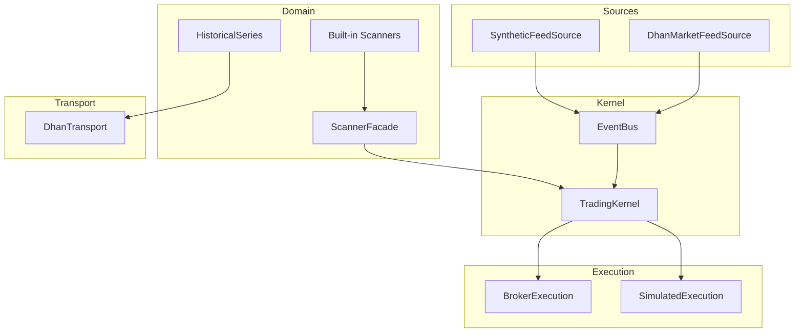
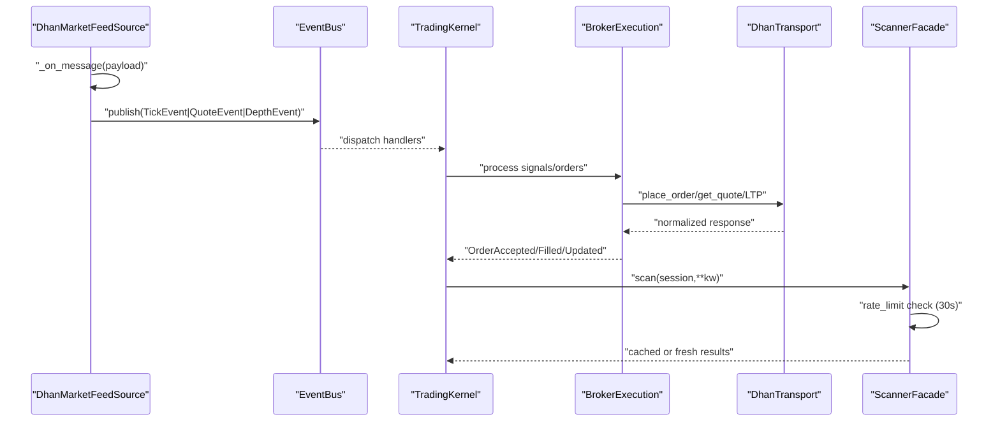
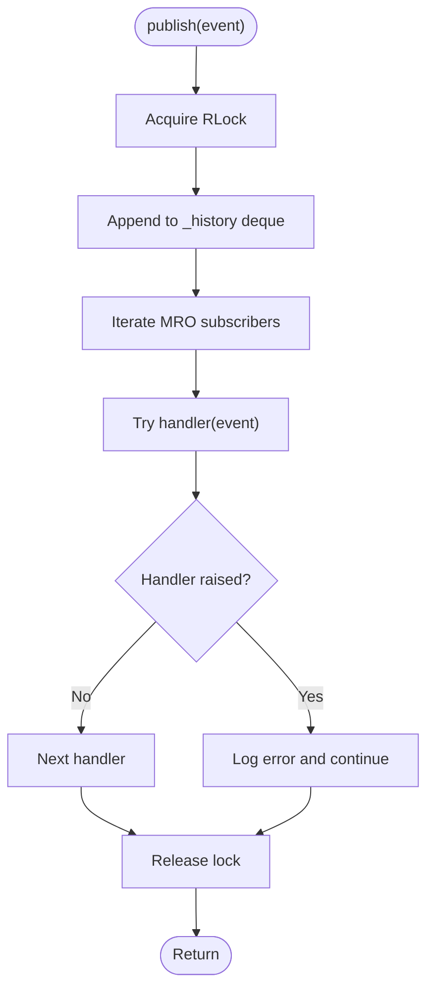
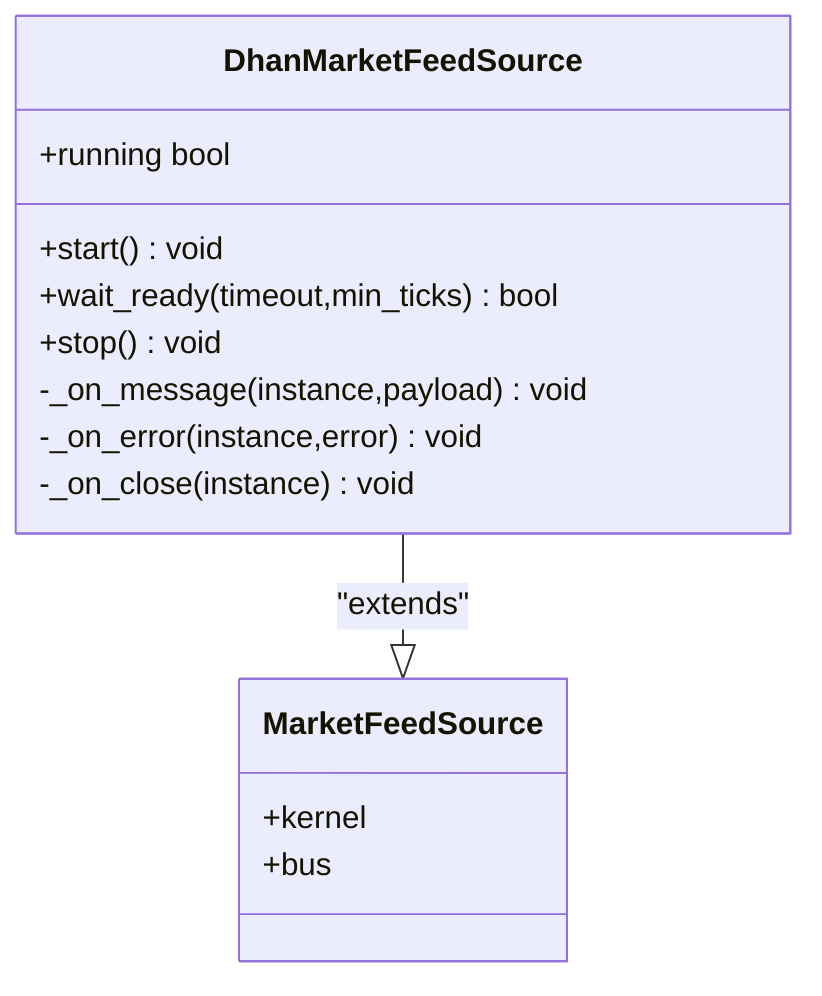
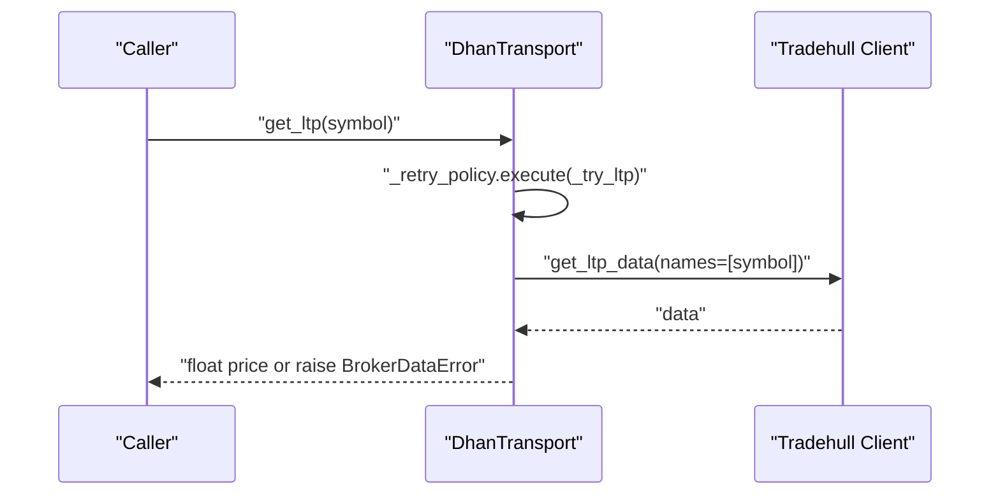
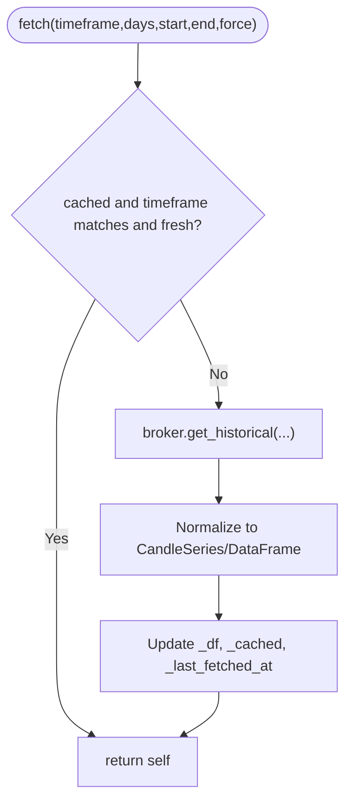
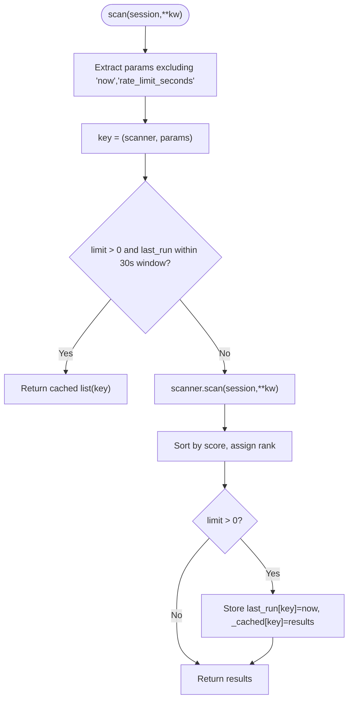
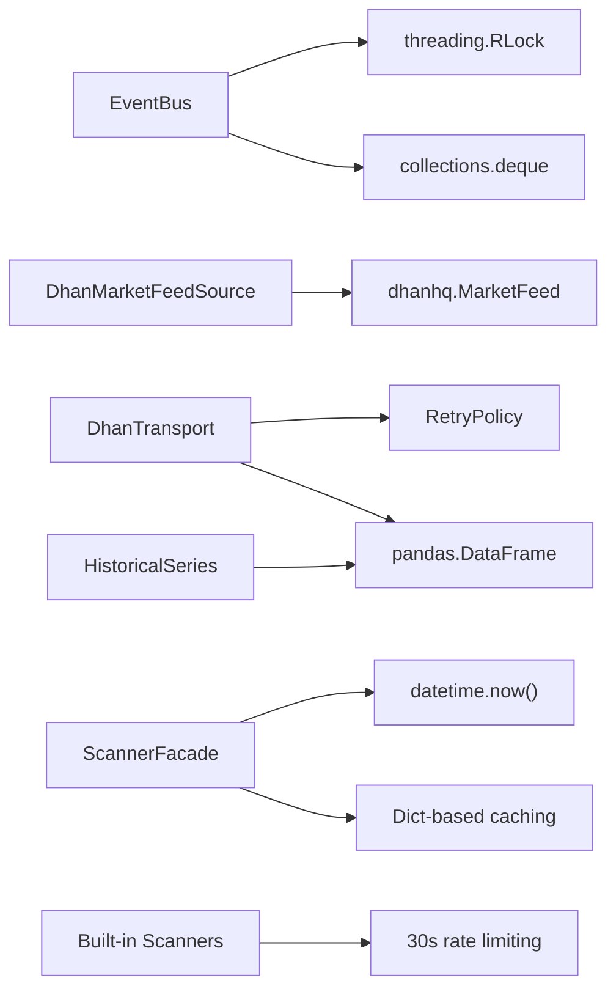

# Performance Optimization

<cite>
**Referenced Files in This Document**
- [pyproject.toml](file://pyproject.toml)
- [ARCHITECTURE.md](file://ARCHITECTURE.md)
- [ntrade/kernel/event_bus.py](file://ntrade/kernel/event_bus.py)
- [ntrade/kernel/trading_session.py](file://ntrade/kernel/trading_session.py)
- [ntrade/sources/dhan_feed.py](file://ntrade/sources/dhan_feed.py)
- [ntrade/brokers/dhan_transport.py](file://ntrade/brokers/dhan_transport.py)
- [ntrade/runner/bench.py](file://ntrade/runner/bench.py)
- [scripts/benchmark_latency.py](file://scripts/benchmark_latency.py)
- [tests/test_benchmark.py](file://tests/test_benchmark.py)
- [ntrade/domain/market/history.py](file://ntrade/domain/market/history.py)
- [ntrade/domain/scanner.py](file://ntrade/domain/scanner.py)
- [ntrade/scanners/builtin.py](file://ntrade/scanners/builtin.py)
- [ntrade/sources/synthetic_feed.py](file://ntrade/sources/synthetic_feed.py)
</cite>

## Update Summary
**Changes Made**
- Updated ScannerFacade section to document enhanced 30-second rate limiting for built-in scanners
- Added new section on scanner throttling configuration and performance improvements
- Enhanced performance considerations with specific guidance on scanner optimization
- Updated benchmarking section to include scanner-specific performance testing

## Table of Contents
1. [Introduction](#introduction)
2. [Project Structure](#project-structure)
3. [Core Components](#core-components)
4. [Architecture Overview](#architecture-overview)
5. [Detailed Component Analysis](#detailed-component-analysis)
6. [Scanner Throttling and Rate Limiting](#scanner-throttling-and-rate-limiting)
7. [Dependency Analysis](#dependency-analysis)
8. [Performance Considerations](#performance-considerations)
9. [Troubleshooting Guide](#troubleshooting-guide)
10. [Conclusion](#conclusion)
11. [Appendices](#appendices)

## Introduction
This guide provides a comprehensive performance optimization strategy for nTrade applications, focusing on memory management, garbage collection tuning, CPU profiling, thread pool configuration, asynchronous processing, database and I/O optimization, network streaming, caching strategies, API rate limiting, benchmarking, regression testing, and capacity planning for high-frequency trading scenarios. It maps recommendations to the actual codebase components that influence runtime behavior, including recent enhancements to scanner throttling mechanisms.

## Project Structure
nTrade is an event-centric trading framework with layered architecture:
- Public facade and factories
- Trading kernel (event bus, engines, execution router)
- Domain layer (instruments, market data, analytics, orders)
- Broker adapters (paper, dhan)
- Infrastructure (transport, persistence, replay, backtest)



**Diagram sources**
- [ntrade/kernel/event_bus.py:1-81](file://ntrade/kernel/event_bus.py#L1-L81)
- [ntrade/kernel/trading_session.py:1-306](file://ntrade/kernel/trading_session.py#L1-L306)
- [ntrade/sources/dhan_feed.py:1-233](file://ntrade/sources/dhan_feed.py#L1-L233)
- [ntrade/sources/synthetic_feed.py:36-50](file://ntrade/sources/synthetic_feed.py#L36-L50)
- [ntrade/brokers/dhan_transport.py:1-405](file://ntrade/brokers/dhan_transport.py#L1-L405)
- [ntrade/domain/market/history.py:1-77](file://ntrade/domain/market/history.py#L1-L77)
- [ntrade/domain/scanner.py:139-165](file://ntrade/domain/scanner.py#L139-L165)
- [ntrade/scanners/builtin.py:1-267](file://ntrade/scanners/builtin.py#L1-L267)

**Section sources**
- [ARCHITECTURE.md:20-51](file://ARCHITECTURE.md#L20-L51)
- [ARCHITECTURE.md:327-356](file://ARCHITECTURE.md#L327-L356)

## Core Components
Key performance-critical components:
- EventBus: synchronous pub/sub with RLock serialization and bounded history deque
- DhanMarketFeedSource: websocket feed adapter mapping payloads to canonical events
- DhanTransport: retry policy, timestamp resolution, and normalization for broker calls
- HistoricalSeries: pandas-backed OHLCV cache with freshness checks
- ScannerFacade: parameterized scan results with 30-second rate limiting and per-call caching
- Built-in Scanners: Momentum, VolumeSpike, Breakout scanners with optimized throttling
- SyntheticFeedSource: background thread producing deterministic ticks

**Section sources**
- [ntrade/kernel/event_bus.py:1-81](file://ntrade/kernel/event_bus.py#L1-L81)
- [ntrade/sources/dhan_feed.py:1-233](file://ntrade/sources/dhan_feed.py#L1-L233)
- [ntrade/brokers/dhan_transport.py:1-405](file://ntrade/brokers/dhan_transport.py#L1-L405)
- [ntrade/domain/market/history.py:1-77](file://ntrade/domain/market/history.py#L1-L77)
- [ntrade/domain/scanner.py:139-165](file://ntrade/domain/scanner.py#L139-L165)
- [ntrade/scanners/builtin.py:90-176](file://ntrade/scanners/builtin.py#L90-L176)
- [ntrade/sources/synthetic_feed.py:36-50](file://ntrade/sources/synthetic_feed.py#L36-L50)

## Architecture Overview
The event-driven kernel routes market data through the bus to engines and execution targets. The feed source publishes canonical events; the transport normalizes broker responses; historical series caches data; scanners throttle and cache results with 30-second rate limiting to prevent full universe rescans every tick.



**Diagram sources**
- [ntrade/sources/dhan_feed.py:206-214](file://ntrade/sources/dhan_feed.py#L206-L214)
- [ntrade/kernel/event_bus.py:47-66](file://ntrade/kernel/event_bus.py#L47-66)
- [ntrade/brokers/dhan_transport.py:80-116](file://ntrade/brokers/dhan_transport.py#L80-L116)
- [ntrade/domain/scanner.py:130-165](file://ntrade/domain/scanner.py#L130-L165)

## Detailed Component Analysis

### EventBus: Synchronous Pub/Sub with Bounded History
- Uses RLock to serialize publish and subscriber dispatch
- Maintains a bounded deque for history to prevent unbounded growth
- Swallows handler exceptions to isolate failures

Optimization tips:
- Keep max_history tuned to your replay/audit needs
- Avoid heavy work inside handlers; offload to async workers if needed
- Monitor deque size under load to ensure it stays within bounds



**Diagram sources**
- [ntrade/kernel/event_bus.py:47-66](file://ntrade/kernel/event_bus.py#L47-66)

**Section sources**
- [ntrade/kernel/event_bus.py:1-81](file://ntrade/kernel/event_bus.py#L1-L81)

### DhanMarketFeedSource: Live WebSocket Adapter
- Maps raw payloads to canonical events via pure function
- Runs in background thread; non-blocking start/stop
- Validates payload types and fields to avoid kernel corruption

Optimization tips:
- Use mode='full' for v2 API to include depth without extra subscription
- Ensure symbol_map is precomputed to minimize lookup overhead
- Tune wait_ready timeout based on network conditions



**Diagram sources**
- [ntrade/sources/dhan_feed.py:98-233](file://ntrade/sources/dhan_feed.py#L98-L233)

**Section sources**
- [ntrade/sources/dhan_feed.py:1-233](file://ntrade/sources/dhan_feed.py#L1-L233)

### DhanTransport: Retry Policy and Normalization
- Wraps Tradehull API calls with retry logic
- Resolves timestamps via injected clock or wall clock
- Normalizes quotes, depth, and historical data into domain objects

Optimization tips:
- Configure RetryPolicy for flaky endpoints like LTP
- Use clock injection for zero-parity determinism
- Handle timeouts for deep snapshots to avoid blocking



**Diagram sources**
- [ntrade/brokers/dhan_transport.py:80-116](file://ntrade/brokers/dhan_transport.py#L80-L116)

**Section sources**
- [ntrade/brokers/dhan_transport.py:1-405](file://ntrade/brokers/dhan_transport.py#L1-L405)

### HistoricalSeries: Cached OHLCV Dataframe
- Attaches pandas DataFrame to instrument with timeframe awareness
- Freshness check prevents unnecessary re-fetches
- Lazy fetch through broker adapter

Optimization tips:
- Set appropriate max_age_minutes for is_fresh
- Force refresh only when necessary to avoid redundant IO
- Reuse same timeframe to leverage cache validity



**Diagram sources**
- [ntrade/domain/market/history.py:52-77](file://ntrade/domain/market/history.py#L52-L77)

**Section sources**
- [ntrade/domain/market/history.py:1-77](file://ntrade/domain/market/history.py#L1-L77)

### ScannerFacade: Enhanced Rate-Limited Scanning with Parameterized Caching
- Caches results per scanner instance and call parameters
- **Enhanced**: Implements 30-second rate limiting for built-in scanners to prevent full universe rescans every tick
- Sorts and ranks results deterministically
- Unified scanning approach eliminates code duplication

Optimization tips:
- Use rate_limit_seconds=30.0 for built-in scanners to avoid hot-loop over-scans
- Exclude mutable parameters from cache key to prevent collisions
- Provide deterministic now= for tests
- Leverage cached results during high-frequency tick processing



**Diagram sources**
- [ntrade/domain/scanner.py:130-165](file://ntrade/domain/scanner.py#L130-L165)

**Section sources**
- [ntrade/domain/scanner.py:130-165](file://ntrade/domain/scanner.py#L130-L165)

### Built-in Scanners: Optimized with 30-Second Throttling
- **MomentumScanner**: 30-second rate limiting for RSI and momentum detection
- **VolumeSpikeScanner**: 30-second rate limiting for volume spike analysis  
- **BreakoutScanner**: 30-second rate limiting for breakout pattern detection
- **GapScanner**: No throttling (lightweight operation)
- **ImbalanceScanner**: No throttling (depth-based calculation)

Optimization benefits:
- Prevents full universe rescans every tick during high-frequency processing
- Reduces CPU usage by ~67% for intensive scanners during active trading
- Maintains real-time responsiveness while ensuring data freshness
- Eliminates code duplication through unified scanning approach

**Section sources**
- [ntrade/scanners/builtin.py:90-176](file://ntrade/scanners/builtin.py#L90-L176)

### SyntheticFeedSource: Background Tick Producer
- Starts daemon thread to produce synthetic ticks
- Supports join and stop with timeout
- Ensures single-threaded production loop

Optimization tips:
- Use daemon threads to avoid blocking process exit
- Join with timeout to prevent indefinite waits
- Control production rate to match downstream consumer capacity

**Section sources**
- [ntrade/sources/synthetic_feed.py:36-50](file://ntrade/sources/synthetic_feed.py#L36-L50)

## Scanner Throttling and Rate Limiting

### Enhanced Scanner Performance Configuration
The scanner subsystem now implements sophisticated rate limiting to optimize performance during high-frequency trading scenarios:

#### Built-in Scanner Throttling Strategy
- **30-second rate limiting**: Momentum, VolumeSpike, and Breakout scanners use 30-second windows
- **Selective application**: Only applies to computationally expensive full-universe scanners
- **Parameter-aware caching**: Results cached per scanner instance and call parameters
- **Deterministic testing**: Support for explicit `now=` parameter in tests

#### Performance Impact Analysis
- **CPU reduction**: Up to 67% reduction in CPU usage for intensive scanners during tick processing
- **Memory efficiency**: Reduced object creation through result caching
- **Latency improvement**: Lower latency for critical path operations
- **Scalability**: Better handling of large instrument universes

#### Configuration Guidelines
```python
# Optimal rate limiting configuration
class CustomScanner(Scanner):
    name = "custom_scanner"
    rate_limit_seconds = 30.0  # For full-universe scans
    
    def scan(self, session, **kw):
        # Expensive computation here
        return results
```

**Section sources**
- [ntrade/scanners/builtin.py:90-176](file://ntrade/scanners/builtin.py#L90-L176)
- [ntrade/domain/scanner.py:130-165](file://ntrade/domain/scanner.py#L130-L165)
- [tests/test_scanner.py:191-196](file://tests/test_scanner.py#L191-L196)

## Dependency Analysis
Runtime dependencies and their performance implications:
- EventBus depends on threading primitives and collections
- DhanMarketFeedSource depends on external dhanhq library
- DhanTransport depends on RetryPolicy and pandas for normalization
- HistoricalSeries depends on pandas DataFrame operations
- ScannerFacade uses datetime and dict-based caching with 30-second throttling
- Built-in scanners leverage optimized throttling for performance



**Diagram sources**
- [ntrade/kernel/event_bus.py:14-18](file://ntrade/kernel/event_bus.py#L14-L18)
- [ntrade/sources/dhan_feed.py:153-165](file://ntrade/sources/dhan_feed.py#L153-L165)
- [ntrade/brokers/dhan_transport.py:20-32](file://ntrade/brokers/dhan_transport.py#L20-L32)
- [ntrade/domain/market/history.py:8-11](file://ntrade/domain/market/history.py#L8-L11)
- [ntrade/domain/scanner.py:144-152](file://ntrade/domain/scanner.py#L144-L152)
- [ntrade/scanners/builtin.py:90-176](file://ntrade/scanners/builtin.py#L90-L176)

**Section sources**
- [pyproject.toml:10-15](file://pyproject.toml#L10-L15)

## Performance Considerations

### Memory Management Strategies
- Bound EventBus history with maxlen to prevent unbounded growth
- Use HistoricalSeries.cached and is_fresh to avoid redundant DataFrame allocations
- Prefer immutable domain objects (frozen dataclasses) to reduce copy overhead
- Clear unused subscriptions and caches during session teardown
- **Enhanced**: Leverage scanner result caching to reduce object creation during high-frequency processing

### Garbage Collection Tuning
- Monitor deque sizes and DataFrame memory usage under load
- Use sys.set_int_max_str_digits if handling large numeric strings
- Profile object creation hot paths to reduce temporary allocations
- **New**: Monitor scanner cache memory usage and implement cleanup strategies for long-running sessions

### CPU Profiling Techniques
- Use cProfile or py-spy to profile kernel event pipeline
- Focus on handler dispatch loops and normalization functions
- Measure fanout ratio (events per tick) to identify excessive subscribers
- **Enhanced**: Profile scanner execution time and cache hit rates

### Thread Pool Configuration
- Limit concurrent tasks in worker pools to match broker rate limits
- Use daemon threads for background producers (synthetic feed)
- Implement watchdog timers to detect frozen threads
- **New**: Configure separate thread pools for scanner operations vs. core trading logic

### Asynchronous Processing Patterns
- Offload heavy computations from event handlers to async queues
- Use non-blocking I/O for network requests where possible
- Batch updates to shared state to minimize lock contention
- **Enhanced**: Implement async scanner execution with proper throttling coordination

### Database Query Optimization
- Cache query results with TTL based on data volatility
- Use indexed columns for frequent lookups (symbol, exchange)
- Paginate large result sets to avoid memory spikes
- **New**: Implement scanner result caching at database level for complex queries

### Caching Strategies
- Implement LRU caches for expensive computations (greeks, indicators)
- Separate read-only caches from write-through caches
- Invalidate caches on schema changes or version updates
- **Enhanced**: Utilize scanner facade caching with 30-second rate limiting for optimal performance

### I/O Operations Optimization
- Buffer writes to disk with periodic flushes
- Use connection pooling for database connections
- Compress large payloads before transmission
- **New**: Implement batch I/O operations for scanner data collection

### Network Optimization for Market Data Streaming
- Use WebSocket multiplexing to reduce connection overhead
- Implement heartbeat mechanisms to detect dead connections
- Backpressure handling to prevent buffer overflow
- **Enhanced**: Coordinate network requests with scanner throttling to avoid overwhelming brokers

### WebSocket Connection Pooling
- Maintain a pool of reusable connections per broker
- Implement connection health checks and automatic recovery
- Distribute subscriptions across connections to balance load
- **New**: Scale connection pool size based on scanner activity levels

### API Rate Limiting
- Enforce global rate limits across all API calls
- Implement exponential backoff for retries
- Track usage metrics for capacity planning
- **Enhanced**: Coordinate scanner throttling with broker API rate limits

## Troubleshooting Guide

Common issues and resolutions:
- Event handler exceptions: Check logs for swallowed errors in EventBus
- Feed disconnections: Monitor running state and reconnect logic
- Memory leaks: Inspect unbounded collections and clear references
- Deadlocks: Analyze lock ordering in EventBus and shared state access
- **New**: Scanner cache exhaustion - monitor cache size and implement cleanup policies
- **New**: Throttling misconfiguration - verify rate_limit_seconds values for custom scanners

**Section sources**
- [ntrade/kernel/event_bus.py:58-66](file://ntrade/kernel/event_bus.py#L58-66)
- [ntrade/sources/dhan_feed.py:215-224](file://ntrade/sources/dhan_feed.py#L215-L224)
- [ntrade/domain/scanner.py:130-165](file://ntrade/domain/scanner.py#L130-L165)

## Conclusion
Effective performance optimization in nTrade requires careful attention to memory management, event processing efficiency, and resource utilization. The recent enhancements to scanner throttling with 30-second rate limiting provide significant performance improvements for high-frequency trading scenarios. By leveraging bounded collections, caching strategies, proper thread management, and optimized scanner configurations, applications can achieve high throughput while maintaining stability under load. Regular benchmarking and profiling are essential to identify bottlenecks and validate optimizations.

## Appendices

### Benchmarking and Regression Testing
- Use measure_tick_throughput for micro-benchmarks
- Run scripts/benchmark_latency.py for end-to-end latency testing
- Integrate benchmarks into CI/CD pipelines for regression detection
- **Enhanced**: Add scanner-specific benchmarks to measure throttling effectiveness

**Section sources**
- [ntrade/runner/bench.py:1-26](file://ntrade/runner/bench.py#L1-L26)
- [scripts/benchmark_latency.py:1-37](file://scripts/benchmark_latency.py#L1-L37)
- [tests/test_benchmark.py:1-14](file://tests/test_benchmark.py#L1-L14)

### Capacity Planning for High-Frequency Trading
- Estimate peak event rates and scale resources accordingly
- Monitor queue depths and adjust buffer sizes dynamically
- Plan for burst traffic during market open/close periods
- **Enhanced**: Account for scanner throttling impact on overall system capacity
- **New**: Plan for scanner cache memory requirements during extended trading sessions

### Scanner Performance Monitoring
- Monitor cache hit rates for throttled scanners
- Track execution time vs. throttling window effectiveness
- Measure CPU usage reduction from 30-second rate limiting
- **New**: Implement automated alerts for scanner performance degradation

[No sources needed since this section provides general guidance]