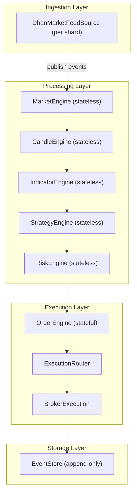
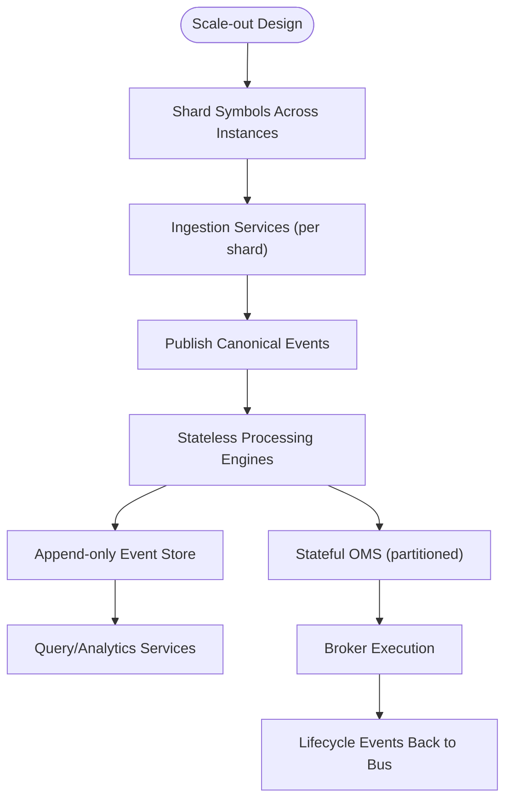
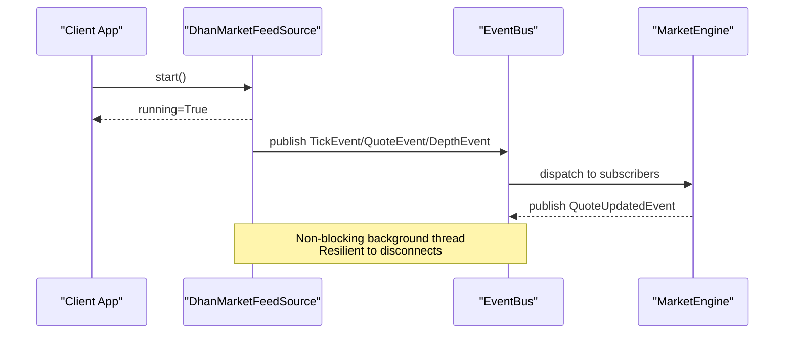
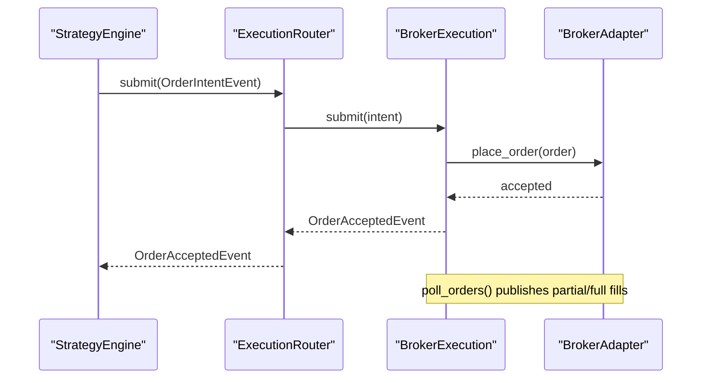
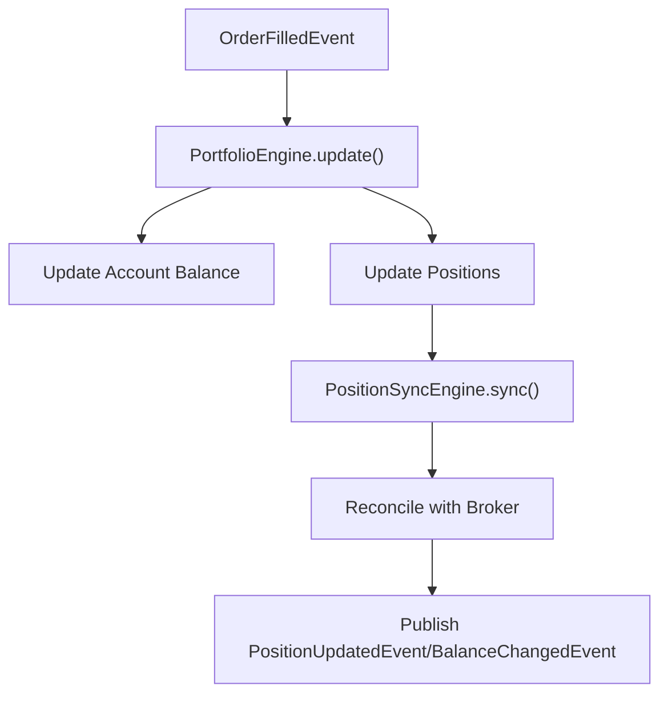
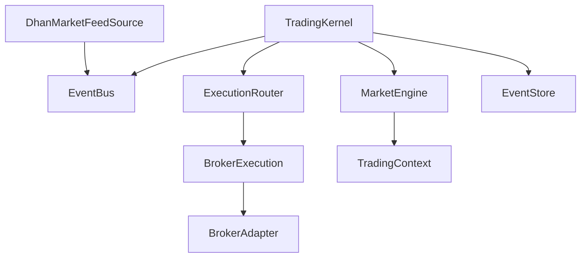

# Scalability Patterns & Architecture

<cite>
**Referenced Files in This Document**
- [ARCHITECTURE.md](file://ARCHITECTURE.md)
- [facade.py](file://ntrade/facade.py)
- [factories.py](file://ntrade/factories.py)
- [registry.py](file://ntrade/registry.py)
- [pyproject.toml](file://pyproject.toml)
- [trading_session.py](file://ntrade/kernel/trading_session.py)
- [event_bus.py](file://ntrade/kernel/event_bus.py)
- [base.py](file://ntrade/events/base.py)
- [market_engine.py](file://ntrade/engines/market_engine.py)
- [dhan_feed.py](file://ntrade/sources/dhan_feed.py)
- [router.py](file://ntrade/execution/router.py)
- [base.py](file://ntrade/brokers/base.py)
- [session.py](file://ntrade/kernel/session.py)
- [event_store.py](file://ntrade/storage/event_store.py)
</cite>

## Table of Contents
1. [Introduction](#introduction)
2. [Project Structure](#project-structure)
3. [Core Components](#core-components)
4. [Architecture Overview](#architecture-overview)
5. [Detailed Component Analysis](#detailed-component-analysis)
6. [Dependency Analysis](#dependency-analysis)
7. [Performance Considerations](#performance-considerations)
8. [Troubleshooting Guide](#troubleshooting-guide)
9. [Conclusion](#conclusion)
10. [Appendices](#appendices)

## Introduction
This document provides scalability patterns and architectural guidance for nTrade systems with a focus on horizontal scaling, microservices decomposition, distributed system considerations, load balancing, stateless service design, data partitioning, and monitoring. It maps these patterns to the existing event-driven kernel, broker adapters, market feed sources, execution router, and storage components that underpin market data feeds, order routing, and portfolio management.

## Project Structure
The codebase follows a layered architecture with clear separation between domain objects, engines, execution targets, brokers, and infrastructure. The trading kernel orchestrates an event-centric pipeline where market data flows through engines into strategies, risk checks, and order execution.

```mermaid
graph TB
subgraph "Public API"
Facade["Market (facade.py)"]
Session["TradingSession (trading_session.py)"]
end
subgraph "Kernel"
Kernel["TradingKernel (session.py)"]
Bus["EventBus (event_bus.py)"]
Clock["TradingClock"]
Ctx["TradingContext"]
end
subgraph "Engines"
MarketEng["MarketEngine (market_engine.py)"]
CandleEng["CandleEngine"]
IndicatorEng["IndicatorEngine"]
StrategyEng["StrategyEngine"]
RiskEng["RiskEngine"]
PortfolioEng["PortfolioEngine"]
OrderEng["OrderEngine"]
end
subgraph "Execution"
Router["ExecutionRouter (router.py)"]
SimExec["SimulatedExecution"]
BrokerExec["BrokerExecution"]
end
subgraph "Brokers"
BaseBroker["BrokerAdapter (brokers/base.py)"]
DhanBroker["DhanBroker"]
PaperBroker["PaperBroker"]
end
subgraph "Data Sources"
DhanFeed["DhanMarketFeedSource (dhan_feed.py)"]
EventStore["EventStore (event_store.py)"]
end
Facade --> Session
Session --> Kernel
Kernel --> Bus
Kernel --> Ctx
Bus --> MarketEng
MarketEng --> Ctx
Kernel --> Router
Router --> SimExec
Router --> BrokerExec
BrokerExec --> BaseBroker
BaseBroker --> DhanBroker
BaseBroker --> PaperBroker
DhanFeed --> Bus
Kernel --> EventStore
```

**Diagram sources**
- [facade.py:1-101](file://ntrade/facade.py#L1-L101)
- [trading_session.py:1-306](file://ntrade/kernel/trading_session.py#L1-L306)
- [session.py:1-200](file://ntrade/kernel/session.py#L1-L200)
- [event_bus.py:1-81](file://ntrade/kernel/event_bus.py#L1-L81)
- [market_engine.py:1-64](file://ntrade/engines/market_engine.py#L1-L64)
- [router.py:1-49](file://ntrade/execution/router.py#L1-L49)
- [base.py:1-163](file://ntrade/brokers/base.py#L1-L163)
- [dhan_feed.py:1-233](file://ntrade/sources/dhan_feed.py#L1-L233)
- [event_store.py:1-236](file://ntrade/storage/event_store.py#L1-L236)

**Section sources**
- [ARCHITECTURE.md:1-389](file://ARCHITECTURE.md#L1-L389)
- [pyproject.toml:1-25](file://pyproject.toml#L1-L25)

## Core Components
- TradingKernel: Coordinates engine stack, wiring, lifecycle, replay, and execution target selection.
- EventBus: Synchronous pub/sub bus with history and thread-safe dispatch.
- MarketEngine: Projects raw market events into instrument read-models and broadcasts normalized updates.
- ExecutionRouter: Routes order intents to strategy-specific or default execution targets.
- BrokerAdapter: Abstract transport boundary hiding broker specifics from domain logic.
- DhanMarketFeedSource: Live websocket adapter mapping vendor payloads to canonical events.
- EventStore: Append-only JSONL store for deterministic replay and crash recovery.

These components enable scalable, horizontally partitionable services by decoupling producers (feeds), processors (engines), and consumers (strategies/risk/OMS).

**Section sources**
- [session.py:1-200](file://ntrade/kernel/session.py#L1-L200)
- [event_bus.py:1-81](file://ntrade/kernel/event_bus.py#L1-L81)
- [market_engine.py:1-64](file://ntrade/engines/market_engine.py#L1-L64)
- [router.py:1-49](file://ntrade/execution/router.py#L1-L49)
- [base.py:1-163](file://ntrade/brokers/base.py#L1-L163)
- [dhan_feed.py:1-233](file://ntrade/sources/dhan_feed.py#L1-L233)
- [event_store.py:1-236](file://ntrade/storage/event_store.py#L1-L236)

## Architecture Overview
The system is event-driven and mode-agnostic (live/replay/backtest). Horizontal scaling can be achieved by partitioning responsibilities across services:
- Feed ingestion service(s): one per exchange or symbol shard; publish canonical events.
- Processing service(s): stateless engines consuming events; scale out per symbol or strategy.
- OMS service(s): stateful order book and position state; partitioned by symbol or account.
- Storage service(s): append-only event log and query layer.



[No sources needed since this diagram shows conceptual workflow, not actual code structure]

## Detailed Component Analysis

### Horizontal Scaling Patterns
- Stateless processing: Engines (market, candle, indicator, strategy, risk) are stateless with respect to event processing; they mutate read-models via context and publish events. Scale out by sharding symbols or strategies across instances.
- Partitioned ingestion: Multiple feed instances subscribe to different symbol sets or exchanges; each publishes canonical events to a shared bus or message queue.
- Stateful OMS: Order and position state should be partitioned by symbol/account and persisted in a durable store; use consistent hashing for routing.
- Replay and recovery: EventStore enables deterministic replay and crash recovery; scale reads for analytics and writes for persistence independently.



[No sources needed since this diagram shows conceptual workflow, not actual code structure]

### Microservices Decomposition Patterns
- Service boundaries:
  - Market Data Ingestion Service: wraps DhanMarketFeedSource; normalizes payloads to canonical events.
  - Engine Pipeline Service: subscribes to events, runs engines, publishes derived events.
  - OMS Service: manages order lifecycle and positions; exposes modify/cancel APIs.
  - Strategy Service: stateless signal generation; consumes indicators and emits order intents.
  - Risk Service: stateless policy enforcement; approves or rejects signals.
  - Storage Service: append-only event log with query endpoints.
- Inter-service communication: Use canonical events over a message bus (e.g., Kafka/PubSub) to maintain zero parity across live/replay/backtest.

**Section sources**
- [dhan_feed.py:1-233](file://ntrade/sources/dhan_feed.py#L1-L233)
- [session.py:1-200](file://ntrade/kernel/session.py#L1-L200)
- [event_store.py:1-236](file://ntrade/storage/event_store.py#L1-L236)

### Distributed System Considerations
- Idempotency: Events are immutable and timestamped; ensure handlers are idempotent to avoid double application during retries.
- Ordering: Maintain causal ordering within partitions; EventStore uses append order as tiebreaker for same timestamps.
- Consistency: Use eventual consistency for read models; reconcile via periodic sync (PositionSyncEngine pattern).
- Fault tolerance: Swallow handler exceptions in EventBus; resilient restarts via EventStore recovery.

**Section sources**
- [event_bus.py:1-81](file://ntrade/kernel/event_bus.py#L1-L81)
- [event_store.py:1-236](file://ntrade/storage/event_store.py#L1-L236)

### Load Balancing Approaches
- Symbol-based sharding: Distribute subscriptions across feed instances using consistent hashing on symbol/exchange keys.
- Strategy-based sharding: Assign strategies to processing instances based on symbol or strategy name hash.
- Read/write split: Separate event ingestion (write-heavy) from analytics (read-heavy) with independent scaling.

**Section sources**
- [registry.py:1-125](file://ntrade/registry.py#L1-L125)
- [factories.py:1-84](file://ntrade/factories.py#L1-L84)

### Stateless Service Design
- Engines operate on immutable events and update read-models via context; no global mutable state.
- BrokerAdapter abstracts transport; implementations remain stateless except for connection management.
- Strategies consume indicators and emit intents without retaining session state beyond event-driven reactions.

**Section sources**
- [market_engine.py:1-64](file://ntrade/engines/market_engine.py#L1-L64)
- [base.py:1-163](file://ntrade/brokers/base.py#L1-L163)

### Data Partitioning Strategies
- Symbol partitioning: Each instance owns a subset of symbols; instruments are created via InstrumentFactory and cached in SymbolMaster.
- Account partitioning: OMS partitions by account for multi-client deployments.
- Time-based partitioning: EventStore segments by time windows for efficient replay and archival.

**Section sources**
- [factories.py:1-84](file://ntrade/factories.py#L1-L84)
- [registry.py:1-125](file://ntrade/registry.py#L1-L125)
- [event_store.py:1-236](file://ntrade/storage/event_store.py#L1-L236)

### Scaling Market Data Feeds
- Multiple DhanMarketFeedSource instances subscribe to disjoint symbol sets; each publishes canonical events to the bus.
- Warmup and readiness: wait_ready ensures minimum ticks before starting downstream processing.
- Resilience: On disconnect, publish FeedDisconnectedEvent; clients handle reconnection.



**Diagram sources**
- [dhan_feed.py:1-233](file://ntrade/sources/dhan_feed.py#L1-L233)
- [event_bus.py:1-81](file://ntrade/kernel/event_bus.py#L1-L81)
- [market_engine.py:1-64](file://ntrade/engines/market_engine.py#L1-L64)

**Section sources**
- [dhan_feed.py:1-233](file://ntrade/sources/dhan_feed.py#L1-L233)

### Scaling Order Routing Systems
- ExecutionRouter selects strategy-specific or default execution targets; scale out by partitioning strategies or symbols.
- BrokerExecution handles async order lifecycle; poll_orders refreshes status and publishes fills/rejections.
- PositionSyncEngine reconciles broker-reported positions; failure-safe to preserve previous state.



**Diagram sources**
- [router.py:1-49](file://ntrade/execution/router.py#L1-L49)
- [session.py:1-200](file://ntrade/kernel/session.py#L1-L200)
- [base.py:1-163](file://ntrade/brokers/base.py#L1-L163)

**Section sources**
- [router.py:1-49](file://ntrade/execution/router.py#L1-L49)
- [session.py:1-200](file://ntrade/kernel/session.py#L1-L200)

### Scaling Portfolio Management Components
- PortfolioEngine updates positions and balances based on fills; state is part of TradingContext.
- PositionSyncEngine periodically reconciles with broker; safe against failures.
- EventStore captures open-order deltas for crash recovery; rebuilds state deterministically.



**Diagram sources**
- [session.py:1-200](file://ntrade/kernel/session.py#L1-L200)
- [event_store.py:1-236](file://ntrade/storage/event_store.py#L1-L236)

**Section sources**
- [session.py:1-200](file://ntrade/kernel/session.py#L1-L200)
- [event_store.py:1-236](file://ntrade/storage/event_store.py#L1-L236)

### Container Orchestration Patterns
- Deploy each service as a containerized microservice with resource limits and health checks.
- Use orchestration platforms (Kubernetes) to manage scaling policies, rolling updates, and self-healing.
- Configure environment variables for broker credentials and event bus endpoints.

[No sources needed since this section provides general guidance]

### Auto-scaling Configurations
- Scale ingestion services based on event throughput metrics (messages/sec, lag).
- Scale processing services based on CPU utilization and event backlog.
- Scale OMS services based on order volume and latency SLAs.

[No sources needed since this section provides general guidance]

### Monitoring Distributed Trading Systems
- Track event bus throughput, latency, and error rates.
- Monitor feed connectivity and reconnect frequency.
- Observe order lifecycle durations and fill rates.
- Alert on risk breaker activations and position drifts.

[No sources needed since this section provides general guidance]

## Dependency Analysis
The system exhibits low coupling between layers via adapters and event buses. Key dependencies include:
- TradingKernel depends on engines, router, and optional broker.
- MarketEngine depends on context and bus.
- DhanMarketFeedSource depends on external dhanhq library.
- EventStore depends on event types for serialization.



**Diagram sources**
- [session.py:1-200](file://ntrade/kernel/session.py#L1-L200)
- [event_bus.py:1-81](file://ntrade/kernel/event_bus.py#L1-L81)
- [market_engine.py:1-64](file://ntrade/engines/market_engine.py#L1-L64)
- [dhan_feed.py:1-233](file://ntrade/sources/dhan_feed.py#L1-L233)
- [router.py:1-49](file://ntrade/execution/router.py#L1-L49)
- [base.py:1-163](file://ntrade/brokers/base.py#L1-L163)
- [event_store.py:1-236](file://ntrade/storage/event_store.py#L1-L236)

**Section sources**
- [session.py:1-200](file://ntrade/kernel/session.py#L1-L200)
- [event_bus.py:1-81](file://ntrade/kernel/event_bus.py#L1-L81)
- [market_engine.py:1-64](file://ntrade/engines/market_engine.py#L1-L64)
- [dhan_feed.py:1-233](file://ntrade/sources/dhan_feed.py#L1-L233)
- [router.py:1-49](file://ntrade/execution/router.py#L1-L49)
- [base.py:1-163](file://ntrade/brokers/base.py#L1-L163)
- [event_store.py:1-236](file://ntrade/storage/event_store.py#L1-L236)

## Performance Considerations
- Minimize event payload size; use compact representations for high-frequency data.
- Batch operations where possible (e.g., historical data fetches).
- Avoid blocking calls in event handlers; offload I/O to background threads.
- Use efficient data structures for caches (SymbolMaster flyweight reduces memory footprint).
- Tune event bus history length to balance replay needs with memory usage.

[No sources needed since this section provides general guidance]

## Troubleshooting Guide
- Feed connectivity issues: Check DhanMarketFeedSource logs and reconnect events; verify credentials and network access.
- Event ordering anomalies: Ensure partition keys preserve causality; review EventStore append order.
- Order lifecycle mismatches: Use poll_orders to reconcile broker status; inspect open-order deltas from EventStore.
- Risk breaker activations: Review risk parameters and market conditions; resume only after validation.

**Section sources**
- [dhan_feed.py:1-233](file://ntrade/sources/dhan_feed.py#L1-L233)
- [event_store.py:1-236](file://ntrade/storage/event_store.py#L1-L236)
- [session.py:1-200](file://ntrade/kernel/session.py#L1-L200)

## Conclusion
nTrade’s event-driven architecture provides a solid foundation for scalable, distributed trading systems. By decomposing services along functional boundaries, leveraging stateless processing, and implementing robust storage and recovery mechanisms, organizations can achieve horizontal scalability while maintaining zero parity across live, replay, and backtest environments.

[No sources needed since this section summarizes without analyzing specific files]

## Appendices
- Public API facade and factory patterns support flexible instrument creation and broker abstraction.
- Registry patterns enable lazy loading and test isolation for brokers and capabilities.

**Section sources**
- [facade.py:1-101](file://ntrade/facade.py#L1-L101)
- [factories.py:1-84](file://ntrade/factories.py#L1-L84)
- [registry.py:1-125](file://ntrade/registry.py#L1-L125)