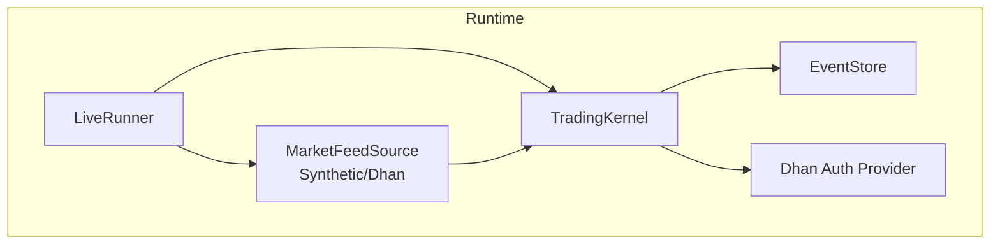
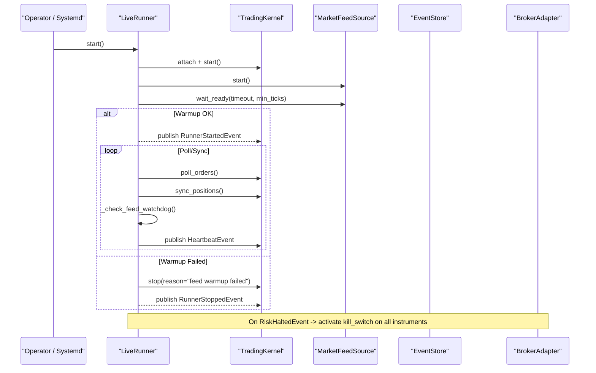
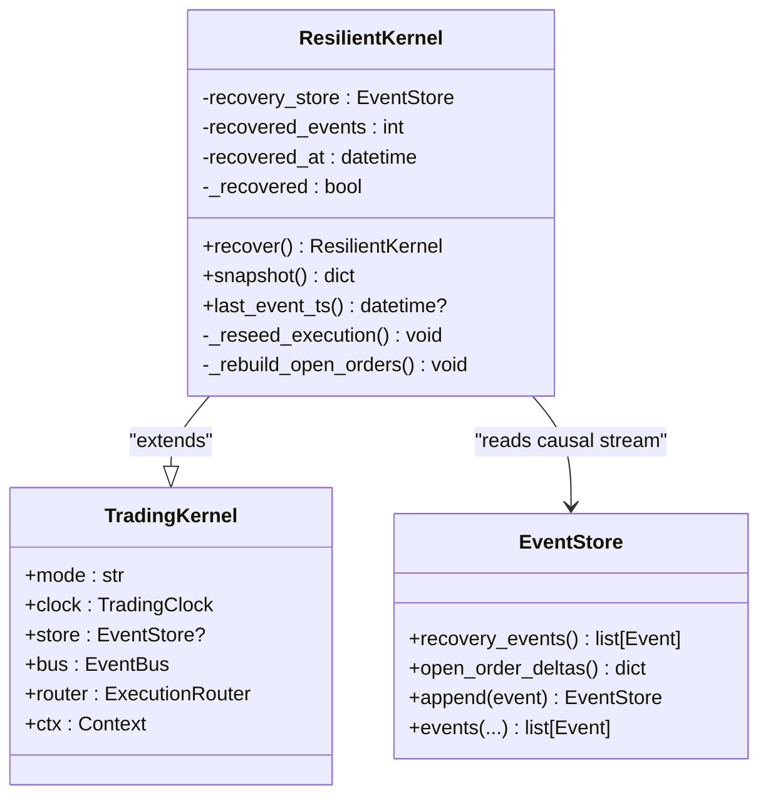
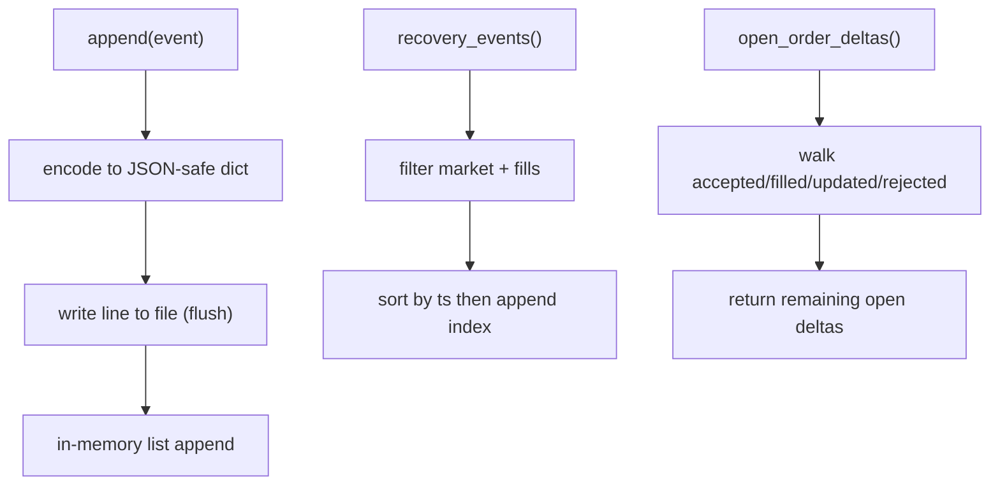
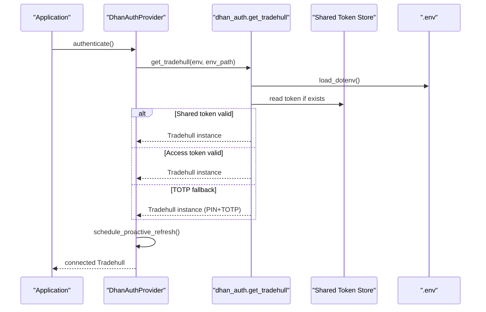
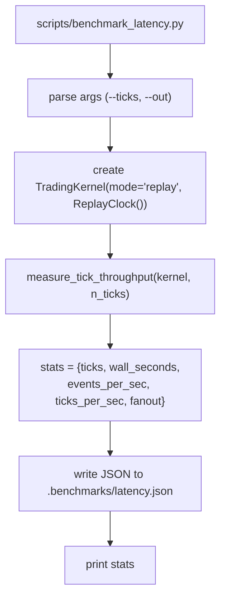
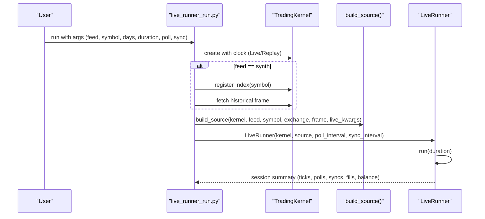
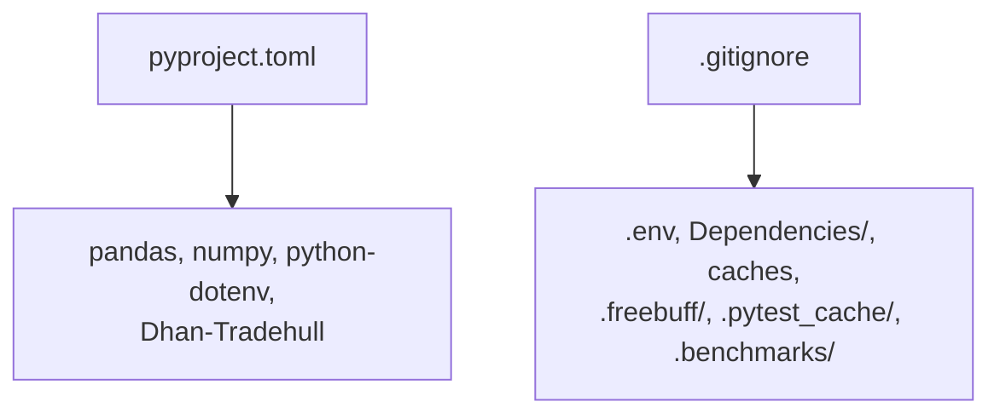

# Production Deployment Examples

<cite>
**Referenced Files in This Document**
- [pyproject.toml](file://pyproject.toml)
- [.gitignore](file://.gitignore)
- [ARCHITECTURE.md](file://ARCHITECTURE.md)
- [deployment.md](file://.agents/skills/dhan-tradehull/references/deployment.md)
- [live_runner.py](file://ntrade/runner/live_runner.py)
- [resilient.py](file://ntrade/kernel/resilient.py)
- [event_store.py](file://ntrade/storage/event_store.py)
- [dhan_auth.py](file://ntrade/brokers/dhan_auth.py)
- [dhan_auth_provider.py](file://ntrade/brokers/dhan_auth_provider.py)
- [benchmark_latency.py](file://scripts/benchmark_latency.py)
- [live_runner_run.py](file://scripts/live_runner_run.py)
</cite>

## Table of Contents
1. [Introduction](#introduction)
2. [Project Structure](#project-structure)
3. [Core Components](#core-components)
4. [Architecture Overview](#architecture-overview)
5. [Detailed Component Analysis](#detailed-component-analysis)
6. [Dependency Analysis](#dependency-analysis)
7. [Performance Considerations](#performance-considerations)
8. [Troubleshooting Guide](#troubleshooting-guide)
9. [Conclusion](#conclusion)
10. [Appendices](#appendices)

## Introduction
This document provides production deployment examples and operational guidance for nTrade applications. It covers containerization, environment configuration, monitoring setup, latency benchmarking, performance optimization, error handling, logging, alerting, health checks, graceful shutdown, crash recovery, scaling considerations, resource management, memory optimization for high-frequency trading, dashboards/metrics collection, profiling, security best practices, secret management, and compliance considerations. The guidance is grounded in the repository’s architecture and runtime components to ensure practical, code-aligned operations.

## Project Structure
nTrade follows a layered, event-centric architecture with clear separation between domain, execution, broker adapters, and infrastructure. For production, you will orchestrate:
- A TradingKernel (live or replay mode)
- A MarketFeedSource (synthetic or live Dhan feed)
- A LiveRunner loop that polls orders, syncs positions, monitors feed health, and triggers risk kill switches
- An EventStore for audit and crash recovery
- Authentication providers for secure broker access

**Diagram sources**
- [live_runner.py:1-196](file://ntrade/runner/live_runner.py#L1-L196)
- [resilient.py:1-147](file://ntrade/kernel/resilient.py#L1-L147)
- [event_store.py:1-236](file://ntrade/storage/event_store.py#L1-L236)
- [dhan_auth_provider.py:40-74](file://ntrade/brokers/dhan_auth_provider.py#L40-L74)

**Section sources**
- [ARCHITECTURE.md:1-389](file://ARCHITECTURE.md#L1-L389)
- [pyproject.toml:1-25](file://pyproject.toml#L1-L25)

## Core Components
- LiveRunner: Orchestrates kernel lifecycle, feed warmup, periodic polling/sync, heartbeat, watchdog, and risk-triggered kill switch activation.
- ResilientKernel: Extends TradingKernel with deterministic crash recovery from EventStore causal stream without re-trading.
- EventStore: Append-only JSONL record of events; supports market-only replay, open-order delta reconstruction, and recovery event ordering.
- Dhan Auth Provider: Manages token lifecycle, shared store usage, proactive refresh, and PIN+TOTP fallback.

Key operational behaviors:
- Feed warmup ensures connectivity before starting strategies.
- Heartbeat and watchdog detect frozen feeds and halt safely.
- Risk engine halts trigger broker kill switches across all instruments.
- Crash recovery rebuilds state deterministically and resumes safely.

**Section sources**
- [live_runner.py:1-196](file://ntrade/runner/live_runner.py#L1-L196)
- [resilient.py:1-147](file://ntrade/kernel/resilient.py#L1-L147)
- [event_store.py:1-236](file://ntrade/storage/event_store.py#L1-L236)
- [dhan_auth_provider.py:40-74](file://ntrade/brokers/dhan_auth_provider.py#L40-L74)

## Architecture Overview
The production runtime composes the kernel, feed, runner, and storage into a resilient pipeline. The kernel processes canonical events through engines (market, candle, indicator, strategy, risk, order, portfolio). Execution targets route intents to simulated or broker execution paths.

**Diagram sources**
- [live_runner.py:55-141](file://ntrade/runner/live_runner.py#L55-L141)
- [live_runner_run.py:26-64](file://scripts/live_runner_run.py#L26-L64)

**Section sources**
- [ARCHITECTURE.md:156-301](file://ARCHITECTURE.md#L156-L301)

## Detailed Component Analysis

### LiveRunner Orchestration
LiveRunner drives the live day by:
- Starting kernel and feed, performing feed warmup
- Periodically polling orders and syncing positions
- Monitoring feed liveness via watchdog
- Emitting heartbeats for observability
- Activating broker kill switches upon risk halts
- Handling SIGTERM/SIGINT for graceful shutdown

**Diagram sources**
- [live_runner.py:55-141](file://ntrade/runner/live_runner.py#L55-L141)

**Section sources**
- [live_runner.py:1-196](file://ntrade/runner/live_runner.py#L1-L196)

### ResilientKernel Crash Recovery
ResilientKernel enables deterministic recovery after crashes:
- Replays only causal events (market data + fills)
- Recomputes derived events (signals, candles, indicators)
- Rebuilds open-order deltas to resume partial fills correctly
- Reseeds execution sequences to avoid ID collisions
- Provides snapshot and last_event_ts for verification

**Diagram sources**
- [resilient.py:17-147](file://ntrade/kernel/resilient.py#L17-L147)
- [event_store.py:183-211](file://ntrade/storage/event_store.py#L183-L211)

**Section sources**
- [resilient.py:1-147](file://ntrade/kernel/resilient.py#L1-L147)
- [event_store.py:1-236](file://ntrade/storage/event_store.py#L1-L236)

### EventStore Audit and Recovery
EventStore provides:
- Append-only JSONL persistence
- Causal event ordering using append index for tiebreaking
- Market-only replay for deterministic recomputation
- Open-order delta reconstruction for partial fill continuity
- Safe decoding that skips unknown event types

**Diagram sources**
- [event_store.py:89-104](file://ntrade/storage/event_store.py#L89-L104)
- [event_store.py:183-211](file://ntrade/storage/event_store.py#L183-L211)
- [event_store.py:137-181](file://ntrade/storage/event_store.py#L137-L181)

**Section sources**
- [event_store.py:1-236](file://ntrade/storage/event_store.py#L1-L236)

### Dhan Authentication and Token Management
Authentication flow:
- Load .env credentials
- Try shared token store if present and not near expiry
- Use access_token if valid within buffer
- Fall back to PIN+TOTP when needed
- Proactive background refresh scheduled post-auth

**Diagram sources**
- [dhan_auth_provider.py:40-74](file://ntrade/brokers/dhan_auth_provider.py#L40-L74)
- [dhan_auth.py:114-151](file://ntrade/brokers/dhan_auth.py#L114-L151)

**Section sources**
- [dhan_auth.py:42-118](file://ntrade/brokers/dhan_auth.py#L42-L118)
- [dhan_auth_provider.py:40-74](file://ntrade/brokers/dhan_auth_provider.py#L40-L74)

### Latency Benchmarking and Performance Profiling
Use the provided benchmark script to measure kernel tick throughput and write results to a JSON file. This helps establish baseline performance and track regressions.

**Diagram sources**
- [benchmark_latency.py:18-32](file://scripts/benchmark_latency.py#L18-L32)

**Section sources**
- [benchmark_latency.py:1-37](file://scripts/benchmark_latency.py#L1-L37)

### Live Runner Harness Usage
The harness supports synthetic mode (offline rehearsal) and live mode (real Dhan websocket). It wires kernel, feed source, and runner with configurable intervals and durations.

**Diagram sources**
- [live_runner_run.py:26-64](file://scripts/live_runner_run.py#L26-L64)

**Section sources**
- [live_runner_run.py:1-69](file://scripts/live_runner_run.py#L1-L69)

## Dependency Analysis
Production dependencies include Python packages defined in the project manifest and runtime integrations with Dhan-Tradehull. Secrets are excluded from version control via .gitignore.

**Diagram sources**
- [pyproject.toml:1-25](file://pyproject.toml#L1-L25)
- [.gitignore:1-25](file://.gitignore#L1-L25)

**Section sources**
- [pyproject.toml:1-25](file://pyproject.toml#L1-L25)
- [.gitignore:1-25](file://.gitignore#L1-L25)

## Performance Considerations
- CPU-bound scanning and event processing: limit concurrent strategies per core budget.
- Memory growth: monitor EventBus history size; consider bounded buffers for long-running sessions.
- Feed throughput: use synthetic mode to rehearse pipelines offline; validate warmup thresholds.
- Order polling intervals: tune poll_interval and sync_interval to balance freshness vs overhead.
- Event fanout: measure events_per_sec and fanout to identify heavy subscribers or expensive handlers.
- Resource isolation: run each strategy in its own process/container to contain failures and resource spikes.

[No sources needed since this section provides general guidance]

## Troubleshooting Guide
Common issues and resolutions:
- Feed warmup failure: verify connectivity and minimum ticks; inspect logs for connection errors.
- Frozen feed: watchdog detects no new ticks; risk halt triggers automatically; check network and broker status.
- Kill switch failure: ensure broker adapter supports kill_switch capability; log critical failures and verify broker-side enforcement.
- OOM in live sessions: cap EventBus history length; offload heavy analytics to async workers.
- Token expiry: use PIN+TOTP auth to avoid daily restarts; monitor JWT expiry and proactive refresh scheduling.
- Port conflicts: kill by port rather than process name; confirm PID ownership after restart.

Operational tips:
- Use systemd for auto-restart and boot persistence.
- Follow logs with journalctl or tail -f app.log.
- Validate new deployments by running synthetic rehearsals first.

**Section sources**
- [deployment.md:51-118](file://.agents/skills/dhan-tradehull/references/deployment.md#L51-L118)
- [live_runner.py:154-174](file://ntrade/runner/live_runner.py#L154-L174)
- [dhan_auth_provider.py:58-74](file://ntrade/brokers/dhan_auth_provider.py#L58-L74)

## Conclusion
nTrade’s event-centric design, resilient kernel, and robust authentication provide a solid foundation for production deployments. By leveraging the LiveRunner orchestration, EventStore-based audit and recovery, and structured benchmarking tooling, teams can deploy scalable, observable, and safe trading systems. Adhering to the operational guidance here ensures reliable live trading, efficient resource usage, and strong security posture.

[No sources needed since this section summarizes without analyzing specific files]

## Appendices

### Containerization Example
- Base image: Python 3.10+ with system dependencies for pandas/numpy
- Install package from pyproject.toml
- Mount secrets via environment variables or mounted volumes (.env excluded from repo)
- Run scripts/live_runner_run.py in synth mode for rehearsal; switch to live mode with proper credentials
- Use health checks to probe heartbeat events or a lightweight HTTP endpoint if exposed

[No sources needed since this section provides general guidance]

### Environment Configuration
- Required environment variables: DHAN_CLIENT_ID, DHAN_ACCESS_TOKEN (optional), DHAN_PIN, DHAN_TOTP_SECRET, DHAN_TOKEN_PATH, DHAN_COOLDOWN_PATH
- Use .env for local development; inject secrets at runtime in production
- Validate token expiry and proactive refresh behavior

**Section sources**
- [dhan_auth.py:114-151](file://ntrade/brokers/dhan_auth.py#L114-L151)

### Monitoring and Alerting
- HeartbeatEvent: emit periodically with tick counts and open orders
- Watchdog: trigger RiskHaltedEvent on frozen feed
- Metrics: collect events_per_sec, ticks_per_sec, fanout from benchmarks
- Dashboards: visualize latency.json trends, heartbeat metrics, and risk events
- Alerting: on RiskHaltedEvent, feed watchdog trips, or kill switch failures

**Section sources**
- [live_runner.py:143-174](file://ntrade/runner/live_runner.py#L143-L174)
- [benchmark_latency.py:18-32](file://scripts/benchmark_latency.py#L18-L32)

### Security Best Practices
- Never commit secrets; enforce .gitignore rules
- Use PIN+TOTP auth for long-running services
- Restrict broker API access to whitelisted IPs
- Limit process privileges and isolate containers
- Rotate tokens proactively and monitor expiry

**Section sources**
- [.gitignore:1-25](file://.gitignore#L1-L25)
- [dhan_auth_provider.py:40-74](file://ntrade/brokers/dhan_auth_provider.py#L40-L74)

### Compliance Considerations
- Maintain audit trails via EventStore JSONL
- Ensure deterministic replay for reproducibility and debugging
- Enforce risk limits and circuit breakers to prevent excessive losses
- Document and validate kill switch behavior with brokers

**Section sources**
- [event_store.py:183-211](file://ntrade/storage/event_store.py#L183-L211)
- [live_runner.py:181-196](file://ntrade/runner/live_runner.py#L181-L196)