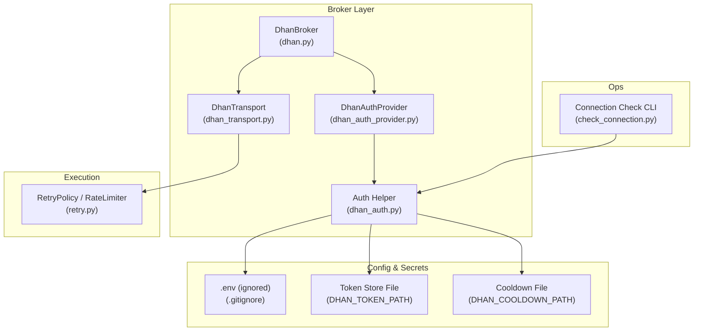
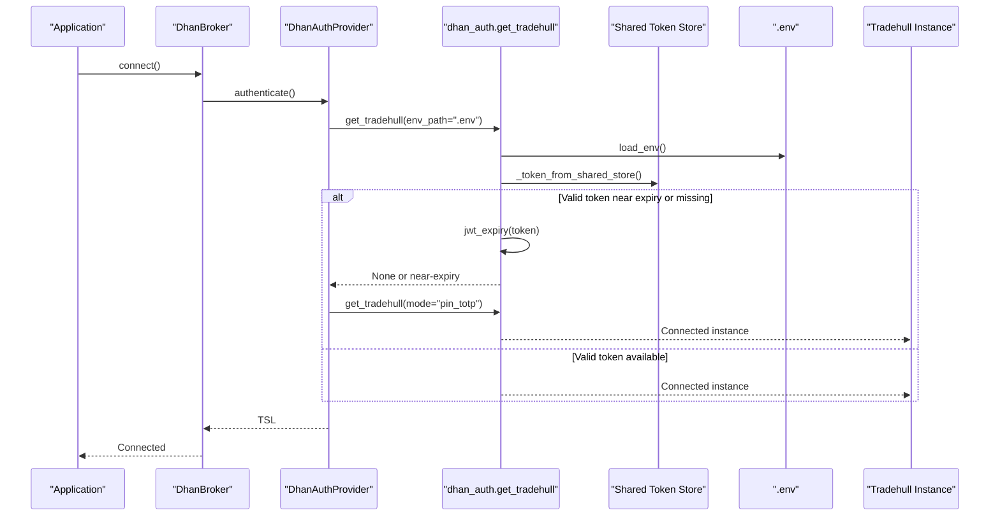
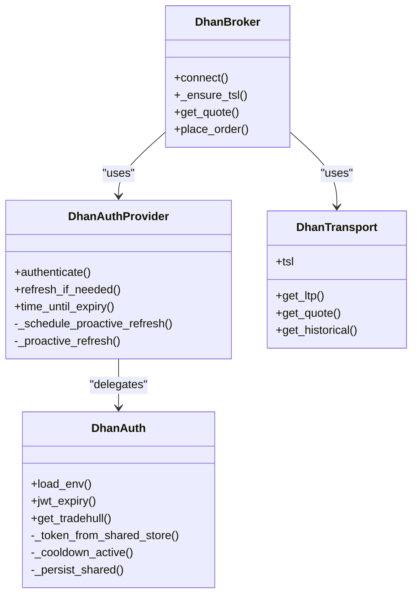
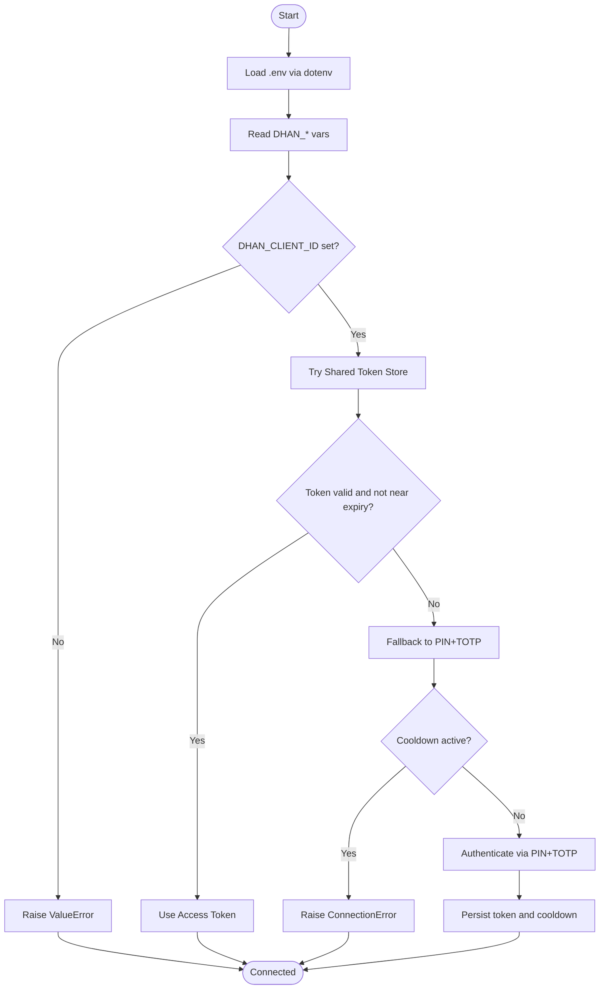
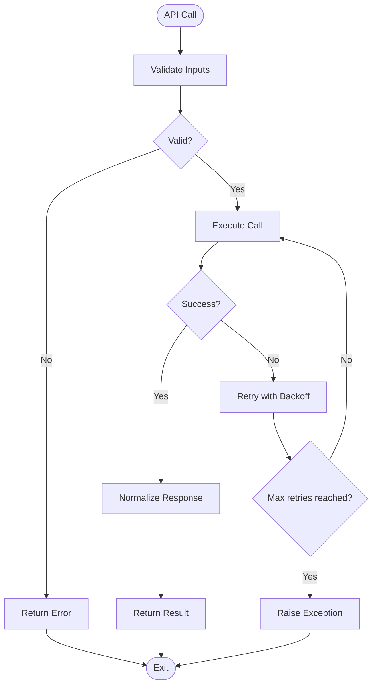
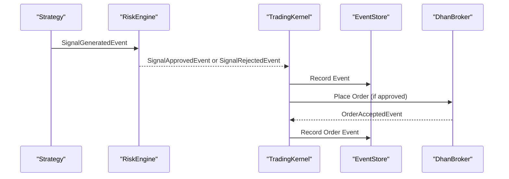
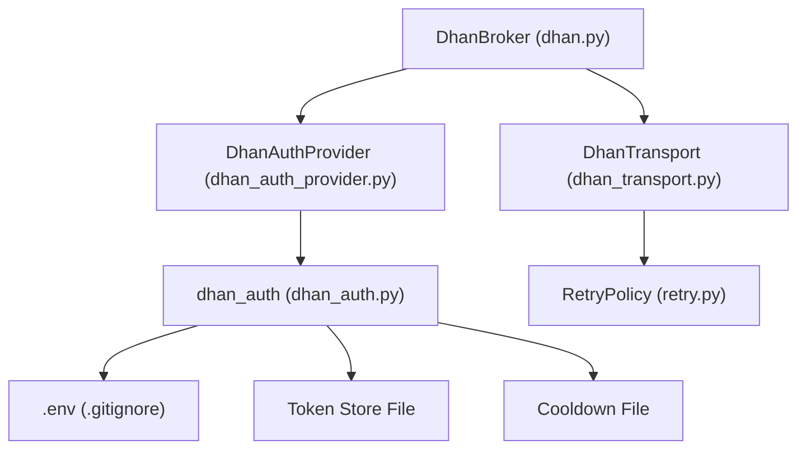

# Security & Compliance

<cite>
**Referenced Files in This Document**
- [dhan_auth.py](file://ntrade/brokers/dhan_auth.py)
- [dhan_auth_provider.py](file://ntrade/brokers/dhan_auth_provider.py)
- [dhan.py](file://ntrade/brokers/dhan.py)
- [dhan_transport.py](file://ntrade/brokers/dhan_transport.py)
- [retry.py](file://ntrade/execution/retry.py)
- [.gitignore](file://.gitignore)
- [check_connection.py](file://check_connection.py)
- [ARCHITECTURE.md](file://ARCHITECTURE.md)
</cite>

## Table of Contents
1. Introduction
2. Project Structure
3. Core Components
4. Architecture Overview
5. Detailed Component Analysis
6. Dependency Analysis
7. Performance Considerations
8. Troubleshooting Guide
9. Conclusion
10. Appendices

## Introduction
This document provides comprehensive security and compliance guidance for nTrade production environments, focusing on authentication and authorization patterns, secure secret management, API security best practices, input validation, encryption, certificate management, audit logging, and regulatory considerations relevant to financial applications. It also includes practical procedures for security scanning, vulnerability assessment, and penetration testing tailored to the codebase.

## Project Structure
The nTrade project follows a layered architecture with clear separation between domain logic, broker adapters, execution, and infrastructure. Security-sensitive components are primarily located in the broker layer (authentication, transport, retry), while configuration and secrets are managed via environment variables and file permissions.

**Diagram sources**
- [dhan.py:54-105](file://ntrade/brokers/dhan.py#L54-L105)
- [dhan_auth_provider.py:28-88](file://ntrade/brokers/dhan_auth_provider.py#L28-L88)
- [dhan_transport.py:48-77](file://ntrade/brokers/dhan_transport.py#L48-L77)
- [dhan_auth.py:42-118](file://ntrade/brokers/dhan_auth.py#L42-L118)
- [retry.py:19-98](file://ntrade/execution/retry.py#L19-L98)
- [.gitignore:1-25](file://.gitignore#L1-L25)
- [check_connection.py:17-38](file://check_connection.py#L17-L38)

**Section sources**
- [ARCHITECTURE.md:20-51](file://ARCHITECTURE.md#L20-L51)
- [.gitignore:1-25](file://.gitignore#L1-L25)

## Core Components
- Authentication and Authorization:
  - Dhan authentication helper manages token lifecycle, JWT expiry checks, shared token store, PIN+TOTP fallback, and cooldown enforcement.
  - DhanAuthProvider wraps authentication with proactive background refresh to avoid expired tokens during critical operations.
- Transport and Resilience:
  - DhanTransport encapsulates API calls with retry policies and error handling.
  - RetryPolicy provides exponential backoff with jitter; RateLimiter enforces call rate limits.
- Secret Management:
  - Environment variables loaded from .env (never committed).
  - Token files stored with restrictive permissions (0o600).
  - Cooldown state persisted to prevent brute-force TOTP attempts.
- Operational Utilities:
  - Connection check script validates connectivity and basic market data retrieval without placing orders.

**Section sources**
- [dhan_auth.py:42-118](file://ntrade/brokers/dhan_auth.py#L42-L118)
- [dhan_auth_provider.py:28-88](file://ntrade/brokers/dhan_auth_provider.py#L28-L88)
- [dhan_transport.py:48-77](file://ntrade/brokers/dhan_transport.py#L48-L77)
- [retry.py:19-98](file://ntrade/execution/retry.py#L19-L98)
- [.gitignore:1-25](file://.gitignore#L1-L25)
- [check_connection.py:17-38](file://check_connection.py#L17-L38)

## Architecture Overview
The authentication flow ensures that only valid, non-expired tokens are used for broker interactions. The system proactively refreshes tokens before expiry using PIN+TOTP when necessary, avoiding known renewal errors.

**Diagram sources**
- [dhan.py:69-74](file://ntrade/brokers/dhan.py#L69-L74)
- [dhan_auth_provider.py:47-56](file://ntrade/brokers/dhan_auth_provider.py#L47-L56)
- [dhan_auth.py:114-167](file://ntrade/brokers/dhan_auth.py#L114-L167)

## Detailed Component Analysis

### Authentication and Authorization
- dhan_auth.py:
  - Loads environment variables from .env.
  - Parses JWT payload to compute expiry and enforce a configurable buffer.
  - Reads/writes shared token store with strict file permissions.
  - Enforces TOTP attempt cooldown via a JSON file.
  - Implements fallback to PIN+TOTP when access token is invalid/expired.
- dhan_auth_provider.py:
  - Provides a class-based wrapper over module-level auth functions.
  - Schedules background timer to refresh tokens proactively before expiry.
  - Thread-safe refresh path with lock to avoid concurrent re-authentication.
- dhan.py:
  - Ensures token freshness before critical operations via _ensure_tsl().
  - Enforces SEBI-compliant LIMIT orders for F&O exchanges.
  - Normalizes broker responses into domain objects.

**Diagram sources**
- [dhan.py:54-105](file://ntrade/brokers/dhan.py#L54-L105)
- [dhan_auth_provider.py:28-88](file://ntrade/brokers/dhan_auth_provider.py#L28-L88)
- [dhan_auth.py:42-118](file://ntrade/brokers/dhan_auth.py#L42-L118)
- [dhan_transport.py:48-77](file://ntrade/brokers/dhan_transport.py#L48-L77)

**Section sources**
- [dhan_auth.py:42-118](file://ntrade/brokers/dhan_auth.py#L42-L118)
- [dhan_auth_provider.py:28-88](file://ntrade/brokers/dhan_auth_provider.py#L28-L88)
- [dhan.py:54-105](file://ntrade/brokers/dhan.py#L54-L105)

### Secure Secret Management
- Environment Variables:
  - DHAN_CLIENT_ID, DHAN_ACCESS_TOKEN, DHAN_PIN, DHAN_TOTP_SECRET, DHAN_TOKEN_PATH, DHAN_COOLDOWN_PATH.
  - Loaded via dotenv at runtime; never hardcoded.
- File Permissions:
  - Token and cooldown files written with mode 0o600 to restrict access.
- Git Ignore:
  - .env excluded from version control to prevent accidental secret leaks.

**Diagram sources**
- [dhan_auth.py:42-118](file://ntrade/brokers/dhan_auth.py#L42-L118)
- [.gitignore:1-25](file://.gitignore#L1-L25)

**Section sources**
- [dhan_auth.py:42-118](file://ntrade/brokers/dhan_auth.py#L42-L118)
- [.gitignore:1-25](file://.gitignore#L1-L25)

### API Security Best Practices
- Input Validation:
  - Timeframe mapping raises on unsupported values to prevent silent misrouting.
  - Instrument metadata hydration validates exchange mappings and symbol resolution.
- Error Handling:
  - Critical endpoints raise exceptions rather than collapsing to zeros to avoid corrupting downstream calculations.
  - Non-critical endpoints return safe defaults (empty lists, zero values).
- Rate Limiting and Retry:
  - RetryPolicy applies exponential backoff with jitter for transient failures.
  - RateLimiter enforces per-second call limits to respect broker constraints.

**Diagram sources**
- [dhan.py:725-745](file://ntrade/brokers/dhan.py#L725-L745)
- [dhan_transport.py:80-116](file://ntrade/brokers/dhan_transport.py#L80-L116)
- [retry.py:19-68](file://ntrade/execution/retry.py#L19-L68)

**Section sources**
- [dhan.py:725-745](file://ntrade/brokers/dhan.py#L725-L745)
- [dhan_transport.py:80-116](file://ntrade/brokers/dhan_transport.py#L80-L116)
- [retry.py:19-68](file://ntrade/execution/retry.py#L19-L68)

### Data Encryption and Secure Communication
- In Transit:
  - Broker communication uses HTTPS/TLS by default through the Tradehull library.
  - SSL certificate errors are documented and should be resolved by updating CA bundles or configuring trusted certificates.
- At Rest:
  - Token files stored with restrictive permissions (0o600).
  - No plaintext secrets in logs; stdout/stderr suppressed during sensitive operations.
- Certificate Management:
  - Ensure system trust store includes broker CA certificates.
  - Rotate certificates as per broker policy and validate connectivity post-rotation.

**Section sources**
- [dhan_auth.py:90-111](file://ntrade/brokers/dhan_auth.py#L90-L111)
- [dhan_auth.py:162-167](file://ntrade/brokers/dhan_auth.py#L162-L167)

### Audit Logging and Compliance
- Event Store:
  - Kernel records canonical events for audit and replay.
  - EventStore supports append-only JSONL format for tamper-evident logs.
- Risk Events:
  - RiskHaltedEvent and RiskResumedEvent provide audit trails for circuit breaker actions.
- Regulatory Considerations:
  - SEBI MARKET order ban enforced for F&O exchanges.
  - Order normalization ensures compliance with exchange rules.

**Diagram sources**
- [ARCHITECTURE.md:186-216](file://ARCHITECTURE.md#L186-L216)
- [dhan.py:304-351](file://ntrade/brokers/dhan.py#L304-L351)

**Section sources**
- [ARCHITECTURE.md:186-216](file://ARCHITECTURE.md#L186-L216)
- [dhan.py:304-351](file://ntrade/brokers/dhan.py#L304-L351)

### Security Scanning, Vulnerability Assessment, and Penetration Testing
- Static Analysis:
  - Run linters and type checkers (e.g., flake8, mypy) to identify code issues.
  - Use dependency scanners (e.g., pip-audit, safety) to detect vulnerable packages.
- Dynamic Analysis:
  - Unit tests cover authentication flows, retry logic, and error handling.
  - Integration tests validate broker connectivity and order placement.
- Penetration Testing:
  - Simulate token expiration and TOTP cooldown scenarios.
  - Test rate limiting and retry behavior under load.
  - Validate input validation against malformed payloads.

**Section sources**
- [retry.py:19-98](file://ntrade/execution/retry.py#L19-L98)
- [check_connection.py:17-38](file://check_connection.py#L17-L38)

## Dependency Analysis
The broker layer depends on authentication helpers, transport utilities, and retry mechanisms. Configuration is externalized via environment variables and files.

**Diagram sources**
- [dhan.py:54-105](file://ntrade/brokers/dhan.py#L54-L105)
- [dhan_auth_provider.py:28-88](file://ntrade/brokers/dhan_auth_provider.py#L28-L88)
- [dhan_transport.py:48-77](file://ntrade/brokers/dhan_transport.py#L48-L77)
- [dhan_auth.py:42-118](file://ntrade/brokers/dhan_auth.py#L42-L118)
- [retry.py:19-98](file://ntrade/execution/retry.py#L19-L98)
- [.gitignore:1-25](file://.gitignore#L1-L25)

**Section sources**
- [dhan.py:54-105](file://ntrade/brokers/dhan.py#L54-L105)
- [dhan_auth_provider.py:28-88](file://ntrade/brokers/dhan_auth_provider.py#L28-L88)
- [dhan_transport.py:48-77](file://ntrade/brokers/dhan_transport.py#L48-L77)
- [dhan_auth.py:42-118](file://ntrade/brokers/dhan_auth.py#L42-L118)
- [retry.py:19-98](file://ntrade/execution/retry.py#L19-L98)
- [.gitignore:1-25](file://.gitignore#L1-L25)

## Performance Considerations
- Proactive Token Refresh:
  - Background timer schedules refresh before token expiry to avoid latency spikes.
- Retry and Rate Limiting:
  - Exponential backoff with jitter reduces contention and improves resilience.
  - Rate limiter prevents exceeding broker API limits.
- Efficient Data Handling:
  - Normalization functions minimize overhead in hot paths.
  - Safe defaults prevent cascading failures.

[No sources needed since this section provides general guidance]

## Troubleshooting Guide
- Authentication Failures:
  - Verify DHAN_CLIENT_ID and access token validity.
  - Check TOTP secret and PIN configuration.
  - Review cooldown file for recent attempts.
- Network Issues:
  - Validate TLS configuration and CA certificates.
  - Monitor connection status via check_connection.py.
- Order Rejections:
  - Ensure SEBI-compliant order types (LIMIT for F&O).
  - Inspect normalized request parameters and broker responses.

**Section sources**
- [dhan_auth.py:114-167](file://ntrade/brokers/dhan_auth.py#L114-L167)
- [check_connection.py:17-38](file://check_connection.py#L17-L38)
- [dhan.py:304-351](file://ntrade/brokers/dhan.py#L304-L351)

## Conclusion
nTrade implements robust security and compliance measures for production environments, including secure authentication, secret management, API protection, and audit logging. By following the guidelines and leveraging the provided tools, teams can maintain a secure and compliant trading platform.

[No sources needed since this section summarizes without analyzing specific files]

## Appendices
- Environment Variables Reference:
  - DHAN_CLIENT_ID: Client identifier from Dhan profile.
  - DHAN_ACCESS_TOKEN: Temporary access token (24-hour lifetime).
  - DHAN_PIN: PIN for TOTP-based authentication.
  - DHAN_TOTP_SECRET: TOTP secret for generating codes.
  - DHAN_TOKEN_PATH: Path to shared token store file.
  - DHAN_COOLDOWN_PATH: Path to cooldown state file.
- File Permissions:
  - Token and cooldown files must have mode 0o600.
- Regulatory Notes:
  - SEBI MARKET order ban enforced for F&O exchanges.

**Section sources**
- [dhan_auth.py:42-118](file://ntrade/brokers/dhan_auth.py#L42-L118)
- [dhan.py:304-351](file://ntrade/brokers/dhan.py#L304-L351)