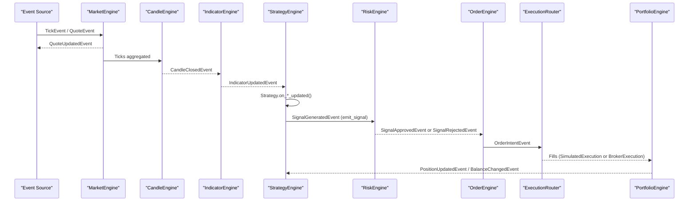
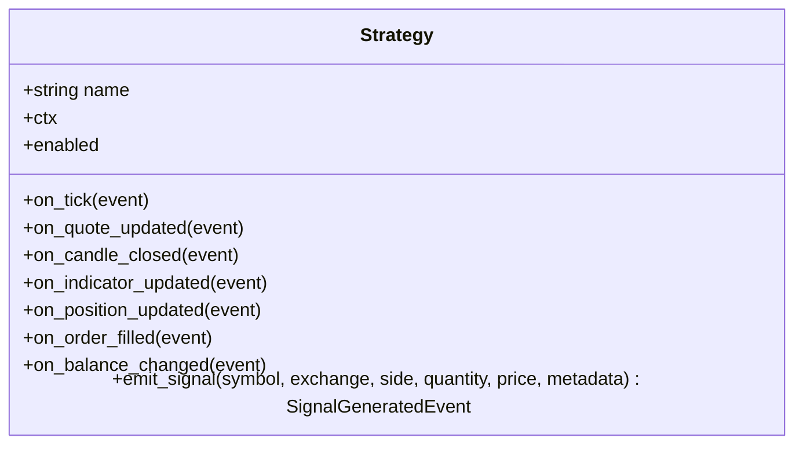
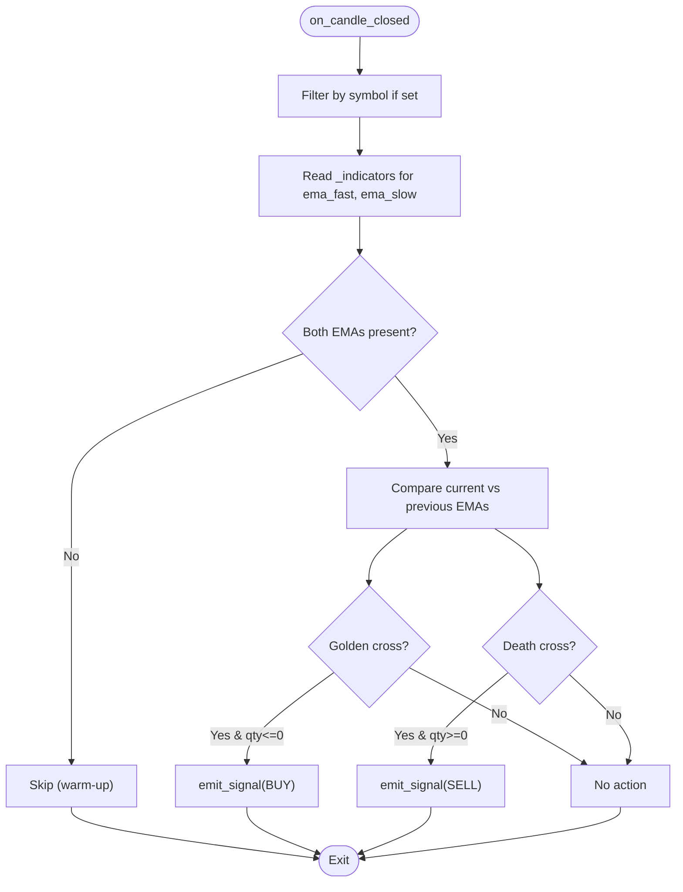
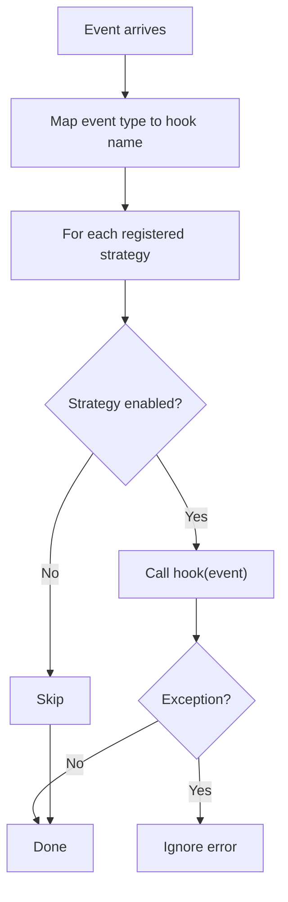
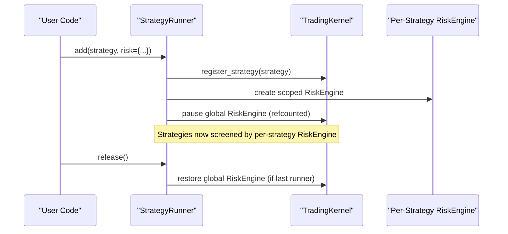
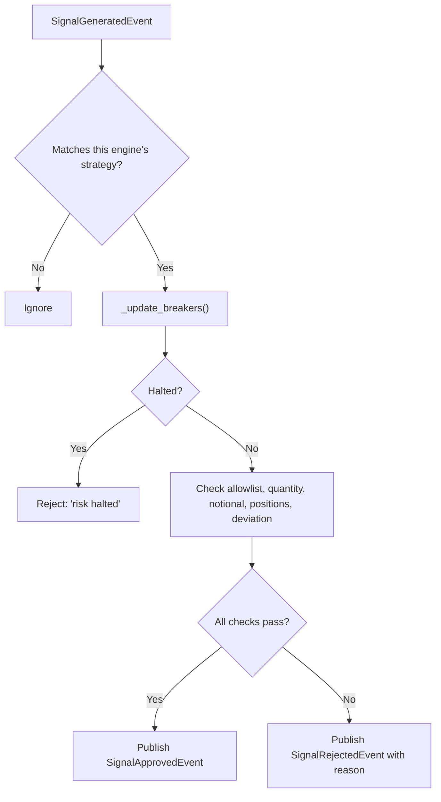
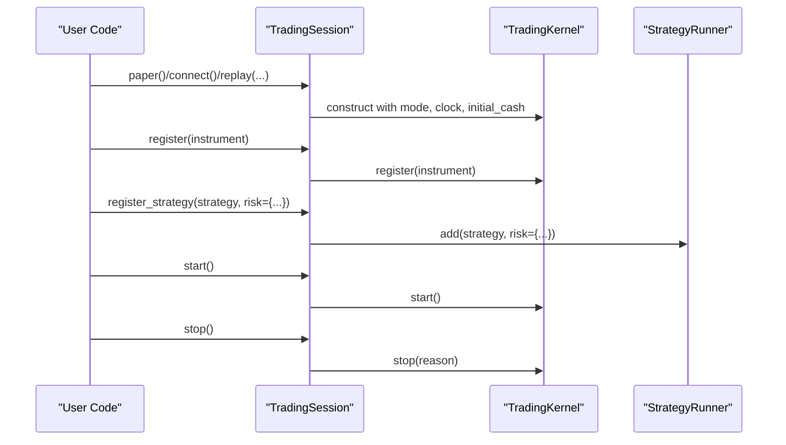
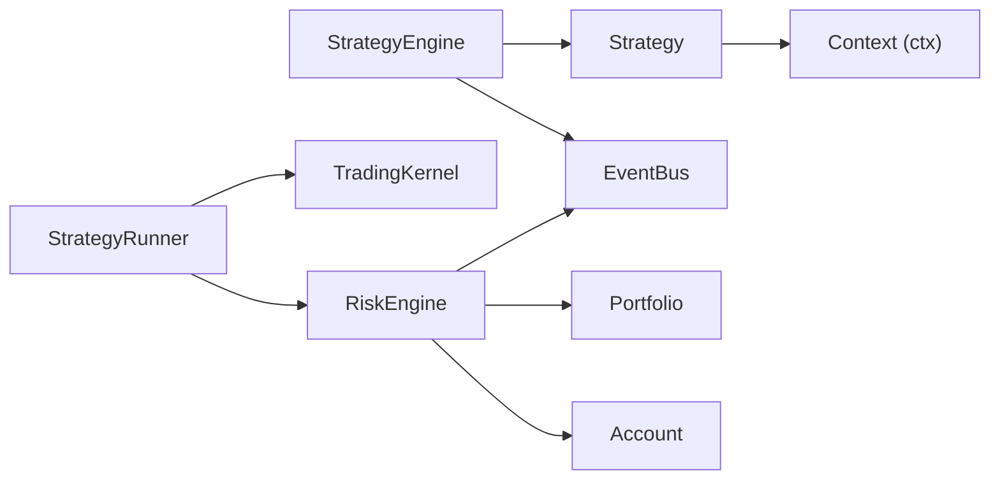

# Strategy Development Guide

<cite>
**Referenced Files in This Document**
- [03-strategies.md](file://user-guide/03-strategies.md)
- [strategies.py](file://ntrade/engines/strategies.py)
- [strategy_engine.py](file://ntrade/engines/strategy_engine.py)
- [trading_session.py](file://ntrade/kernel/trading_session.py)
- [runner.py](file://ntrade/kernel/runner.py)
- [risk_engine.py](file://ntrade/engines/risk_engine.py)
- [market.py](file://ntrade/events/market.py)
- [context.py](file://ntrade/kernel/context.py)
- [test_ema_cross_strategy.py](file://tests/test_ema_cross_strategy.py)
- [test_strategy_runner.py](file://tests/test_strategy_runner.py)
</cite>

## Update Summary
**Changes Made**
- Updated to reflect integration of how-to-write-a-strategy.md into user-guide/03-strategies.md
- Enhanced coverage of ready-made strategies including EmaCrossStrategy
- Added detailed hook explanations and context usage documentation
- Updated architecture diagrams to reflect current implementation
- Enhanced troubleshooting guide with current best practices

## Table of Contents
1. Introduction
2. Project Structure
3. Core Components
4. Architecture Overview
5. Detailed Component Analysis
6. Dependency Analysis
7. Performance Considerations
8. Troubleshooting Guide
9. Conclusion

## Introduction
This guide explains how to develop trading strategies in nTrade with zero parity across live, replay, and backtest environments. Strategies are event-driven: they react to canonical kernel events via hooks and act by emitting signals through a single contract. The kernel's engines handle risk screening, order management, execution, and portfolio updates. You write the strategy once and run it unchanged in any mode.

The framework provides both ready-made strategies like EMA crossover and the ability to create custom strategies with detailed hook support and comprehensive context access.

## Project Structure
The framework is organized into layers: public facade, trading kernel (event-centric), domain objects, broker adapters, and infrastructure. Strategies live in the engine layer and interact exclusively with canonical events and context.

```mermaid
graph TB
subgraph "Public API"
Facade["Market facade"]
Session["TradingSession"]
end
subgraph "Kernel"
Kernel["TradingKernel"]
Bus["EventBus"]
Clock["TradingClock"]
Context["TradingContext"]
end
subgraph "Engines"
MarketEngine["MarketEngine"]
CandleEngine["CandleEngine"]
IndicatorEngine["IndicatorEngine"]
StrategyEngine["StrategyEngine"]
RiskEngine["RiskEngine"]
OrderEngine["OrderEngine"]
PortfolioEngine["PortfolioEngine"]
end
subgraph "Execution"
Router["ExecutionRouter"]
SimExec["SimulatedExecution"]
BrokerExec["BrokerExecution"]
end
subgraph "Domain"
Instrument["Instrument"]
Portfolio["Portfolio"]
Account["Account"]
end
Facade --> Session
Session --> Kernel
Kernel --> Bus
Kernel --> Clock
Kernel --> Context
Bus --> MarketEngine
MarketEngine --> CandleEngine
CandleEngine --> IndicatorEngine
IndicatorEngine --> StrategyEngine
StrategyEngine --> RiskEngine
RiskEngine --> OrderEngine
OrderEngine --> Router
Router --> SimExec
Router --> BrokerExec
SimExec --> PortfolioEngine
BrokerExec --> PortfolioEngine
PortfolioEngine --> Portfolio
Instrument --> MarketEngine
```

**Diagram sources**
- [ARCHITECTURE.md:20-51](file://ARCHITECTURE.md#L20-L51)
- [ARCHITECTURE.md:156-215](file://ARCHITECTURE.md#L156-L215)

**Section sources**
- [ARCHITECTURE.md:20-51](file://ARCHITECTURE.md#L20-L51)
- [ARCHITECTURE.md:156-215](file://ARCHITECTURE.md#L156-L215)

## Core Components
- **Strategy base class and hooks**: define behavior by overriding event handlers and emitting signals.
- **StrategyEngine**: dispatches events to registered strategies and swallows per-strategy errors.
- **StrategyRunner**: manages multiple strategies with per-strategy risk limits and lifecycle control.
- **RiskEngine**: screens signals against static limits and circuit breakers; publishes approval or rejection.
- **TradingSession**: unified entry point for instruments, session lifecycle, and strategy registration.
- **Events**: canonical market data and derived events that drive the pipeline.

Key responsibilities:
- Strategies must never poll prices or place orders directly.
- All actions flow through emit_signal → RiskEngine → OrderEngine → Execution → Portfolio.

**Section sources**
- [strategy_engine.py:18-46](file://ntrade/engines/strategy_engine.py#L18-L46)
- [strategy_engine.py:48-104](file://ntrade/engines/strategy_engine.py#L48-L104)
- [runner.py:16-47](file://ntrade/kernel/runner.py#L16-L47)
- [risk_engine.py:19-41](file://ntrade/engines/risk_engine.py#L19-L41)
- [trading_session.py:230-248](file://ntrade/kernel/trading_session.py#L230-L248)
- [market.py:11-83](file://ntrade/events/market.py#L11-L83)

## Architecture Overview
The event-centric kernel ensures identical behavior across modes. A strategy subscribes to canonical events, emits signals, and the kernel routes them through risk, order management, and execution.



**Diagram sources**
- [ARCHITECTURE.md:156-215](file://ARCHITECTURE.md#L156-L215)
- [03-strategies.md:1-208](file://user-guide/03-strategies.md#L1-L208)

## Detailed Component Analysis

### Strategy Base Class and Hooks
- Subclass Strategy, set name, override hooks like on_candle_closed, on_indicator_updated, etc.
- Use self.ctx for deterministic time, instrument access, portfolio, and account state.
- Emit signals via emit_signal; price=0 implies MARKET, nonzero implies LIMIT.

Best practices:
- Read indicator bundles from the instrument instead of recomputing.
- Be position-aware to avoid stacking.
- Always use ctx.now() for timestamps.

Available hooks include:
- `on_tick`: every trade/quote/depth print
- `on_quote_updated`: a quote was projected into a symbol
- `on_candle_closed`: a candle completes
- `on_indicator_updated`: a fresh indicator bundle is ready
- `on_position_updated`: a fill changed a position
- `on_order_filled`: an order filled
- `on_balance_changed`: cash balance changed

Useful context methods:
- `self.ctx.now()`: ALWAYS this, never datetime.now()
- `self.ctx.instrument("NIFTY")`: the registered Instrument
- `self.ctx.portfolio.position("NIFTY")`: Position | None
- `self.ctx.account.balance`: float
- `self.ctx.mode`: "live" | "replay" | "backtest"



**Diagram sources**
- [strategy_engine.py:18-46](file://ntrade/engines/strategy_engine.py#L18-L46)

**Section sources**
- [strategy_engine.py:18-46](file://ntrade/engines/strategy_engine.py#L18-L46)
- [03-strategies.md:32-98](file://user-guide/03-strategies.md#L32-L98)
- [context.py:48-79](file://ntrade/kernel/context.py#L48-L79)

### Ready-made Strategies: EMA Crossover
The framework includes built-in strategies like EmaCrossStrategy that implement common trading patterns.

EmaCrossStrategy implements golden/death cross logic using EMA fast/slow values from the indicator bundle:
- Reverses positions instead of stacking; only acts on actual crossings
- Falls back to computing EMAs if the bundle is missing
- Uses position awareness to avoid duplicate entries



**Diagram sources**
- [strategies.py:13-67](file://ntrade/engines/strategies.py#L13-L67)

**Section sources**
- [strategies.py:13-67](file://ntrade/engines/strategies.py#L13-L67)
- [03-strategies.md:16-28](file://user-guide/03-strategies.md#L16-L28)
- [test_ema_cross_strategy.py:40-89](file://tests/test_ema_cross_strategy.py#L40-L89)

### Custom Strategy Development
Creating custom strategies involves subclassing the Strategy base class and implementing relevant hooks:

```python
from ntrade import Strategy

class RsiReversal(Strategy):
    name = "rsi_reversal"

    def __init__(self, quantity: int = 10, symbol: str = "NIFTY",
                 lower: float = 30.0, upper: float = 70.0):
        super().__init__()
        self.quantity = int(quantity)
        self.symbol = symbol
        self.lower = lower
        self.upper = upper

    def on_candle_closed(self, event) -> None:
        if event.symbol != self.symbol:
            return
        bundle = self.ctx.instrument(event.symbol)._indicators
        rsi = bundle.get("rsi_14")
        if rsi is None:
            return                        # warm-up: not enough candles yet
        position = self.ctx.portfolio.position(event.symbol)
        qty = position.quantity if position is not None else 0

        if rsi < self.lower and qty <= 0:
            self.emit_signal(
                symbol=event.symbol, exchange=event.exchange,
                side="BUY", quantity=self.quantity, price=event.close,
            )
        elif rsi > self.upper and qty >= 0:
            self.emit_signal(
                symbol=event.symbol, exchange=event.exchange,
                side="SELL", quantity=self.quantity, price=event.close,
            )
```

**Section sources**
- [03-strategies.md:32-72](file://user-guide/03-strategies.md#L32-L72)

### Strategy Engine Dispatch
- Maps event types to hook names and invokes each enabled strategy.
- Swallows exceptions per strategy so one failure does not crash the kernel.



**Diagram sources**
- [strategy_engine.py:48-104](file://ntrade/engines/strategy_engine.py#L48-L104)

**Section sources**
- [strategy_engine.py:48-104](file://ntrade/engines/strategy_engine.py#L48-L104)

### StrategyRunner: Multi-Strategy Management
- Adds strategies with unique names and per-strategy RiskEngine instances.
- Pauses the kernel's global RiskEngine while managing strategies to avoid double-screening.
- Provides status reporting and lifecycle methods.



**Diagram sources**
- [runner.py:33-47](file://ntrade/kernel/runner.py#L33-L47)
- [runner.py:58-68](file://ntrade/kernel/runner.py#L58-L68)
- [runner.py:119-135](file://ntrade/kernel/runner.py#L119-L135)

**Section sources**
- [runner.py:16-47](file://ntrade/kernel/runner.py#L16-47)
- [runner.py:58-68](file://ntrade/kernel/runner.py#L58-L68)
- [runner.py:119-135](file://ntrade/kernel/runner.py#L119-L135)
- [test_strategy_runner.py:72-107](file://tests/test_strategy_runner.py#L72-107)
- [test_strategy_runner.py:121-145](file://tests/test_strategy_runner.py#L121-145)

### RiskEngine: Screening and Circuit Breakers
- Static limits: max_quantity, max_notional, max_positions, allowlist, price_deviation_pct.
- Circuit breakers: max_daily_loss, max_drawdown_pct; halt until resume().
- Publishes SignalApprovedEvent or SignalRejectedEvent; tracks counts.



**Diagram sources**
- [risk_engine.py:73-111](file://ntrade/engines/risk_engine.py#L73-L111)
- [risk_engine.py:113-128](file://ntrade/engines/risk_engine.py#L113-L128)

**Section sources**
- [risk_engine.py:19-41](file://ntrade/engines/risk_engine.py#L19-L41)
- [risk_engine.py:73-111](file://ntrade/engines/risk_engine.py#L73-L111)
- [risk_engine.py:113-128](file://ntrade/engines/risk_engine.py#L113-L128)

### TradingSession: Unified Entry Point
- Factory for instruments, session lifecycle, and strategy registration via StrategyRunner.
- Supports connect (live), paper (offline), and replay (events) modes.



**Diagram sources**
- [trading_session.py:39-68](file://ntrade/kernel/trading_session.py#L39-L68)
- [trading_session.py:230-248](file://ntrade/kernel/trading_session.py#L230-L248)

**Section sources**
- [trading_session.py:39-68](file://ntrade/kernel/trading_session.py#L39-L68)
- [trading_session.py:230-248](file://ntrade/kernel/trading_session.py#L230-L248)

### Canonical Events
- Market events include TickEvent, QuoteEvent, DepthEvent, CandleClosedEvent, QuoteUpdatedEvent, IndicatorUpdatedEvent.
- These events drive the entire pipeline deterministically.

**Section sources**
- [market.py:11-83](file://ntrade/events/market.py#L11-L83)

## Dependency Analysis
Strategies depend on the Strategy base class and the kernel's EventBus via context. StrategyRunner depends on RiskEngine and the kernel. RiskEngine depends on portfolio/account state and the EventBus.



**Diagram sources**
- [strategy_engine.py:48-104](file://ntrade/engines/strategy_engine.py#L48-L104)
- [runner.py:16-47](file://ntrade/kernel/runner.py#L16-47)
- [risk_engine.py:19-41](file://ntrade/engines/risk_engine.py#L19-L41)

**Section sources**
- [strategy_engine.py:48-104](file://ntrade/engines/strategy_engine.py#L48-L104)
- [runner.py:16-47](file://ntrade/kernel/runner.py#L16-47)
- [risk_engine.py:19-41](file://ntrade/engines/risk_engine.py#L19-L41)

## Performance Considerations
- Prefer reading indicator bundles from the instrument rather than recomputing indicators inside hooks.
- Return early per symbol to avoid unnecessary processing when a strategy is registered without a symbol filter.
- Avoid heavy computations in tick-level hooks; prefer candle or indicator events where possible.
- Use ctx.now() consistently to ensure deterministic timing in replay/backtest.
- Indicator bundle keys commonly include `rsi_14`, `atr_14`, `vwap`, `avg_volume`, `ema_9`, `ema_21`. Check for `None` to skip warm-up gracefully.

## Troubleshooting Guide
Common issues and resolutions:
- **Signals rejected**: inspect SignalRejectedEvent.reason for details such as quantity caps, notional limits, allowlist violations, or price deviations.
- **No fills in backtest/replay**: ensure the indicator bundle has enough warm-up candles; verify timeframe and symbol filters.
- **Strategy errors swallowed**: per-strategy exceptions are ignored; unit-test hooks with hand-built events to validate behavior.
- **Global risk paused**: when using StrategyRunner, the kernel's global RiskEngine is paused; release restores it.

Best practices for robust strategies:
- **Read the indicator bundle** — do not recompute. Guard warm-up with `if key is None: return`.
- **Be position-aware** — BUY when flat/short, SELL when flat/long; avoid stacking.
- **Never call `datetime.now()`** — use `self.ctx.now()`.
- **Filter by symbol** — return early if `event.symbol != self.symbol`.
- **Strategy errors are swallowed** — a broken hook never kills the kernel, so test hooks with hand-built events and write defensively.

Useful references:
- How to write a strategy and best practices in the user guide.
- Tests demonstrating golden/death cross behavior and multi-strategy isolation.

**Section sources**
- [03-strategies.md:195-204](file://user-guide/03-strategies.md#L195-L204)
- [test_ema_cross_strategy.py:40-89](file://tests/test_ema_cross_strategy.py#L40-L89)
- [test_strategy_runner.py:89-107](file://tests/test_strategy_runner.py#L89-107)

## Conclusion
By writing strategies against canonical events and using emit_signal, you achieve zero parity across live, replay, and backtest. Leverage StrategyRunner for multi-strategy management with isolated risk, and rely on RiskEngine for robust screening and circuit breakers. Follow best practices around indicator usage, position awareness, and deterministic timing to build reliable, maintainable strategies.

The enhanced user guide provides comprehensive coverage of both ready-made strategies like EMA crossover and custom strategy development with detailed hook explanations and context usage, making it easier to develop robust trading strategies that work consistently across all execution modes.