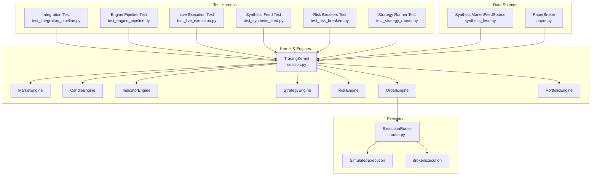
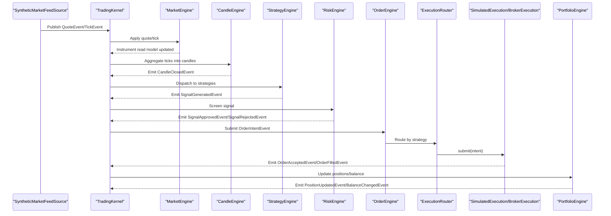
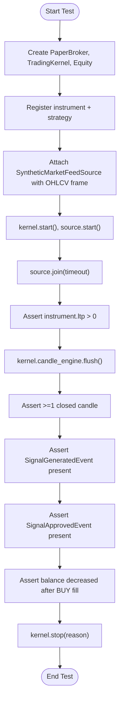
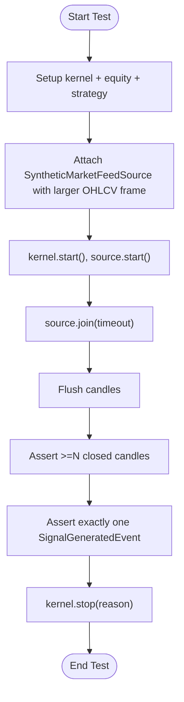
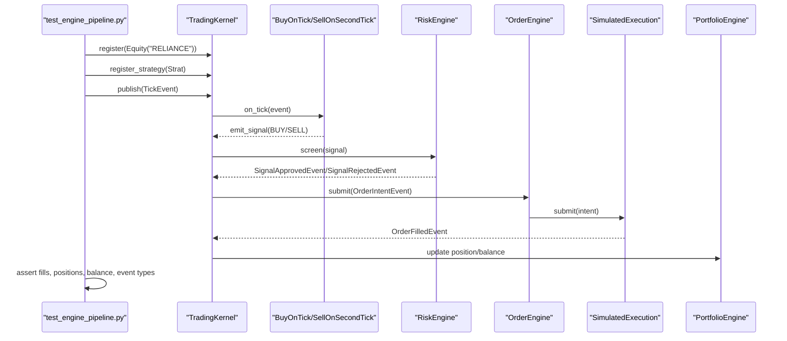
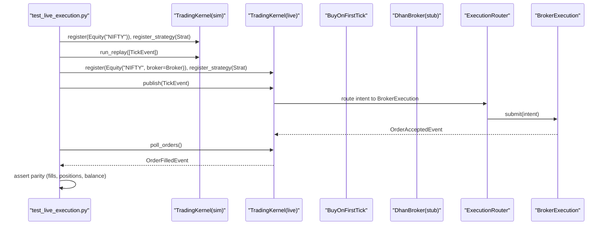
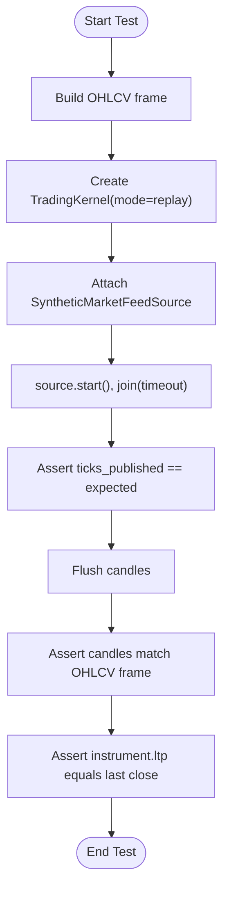
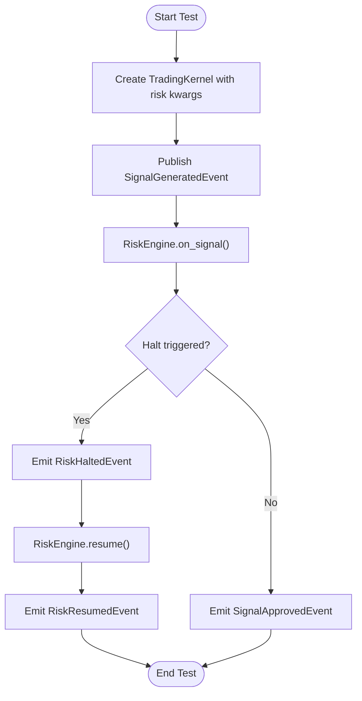
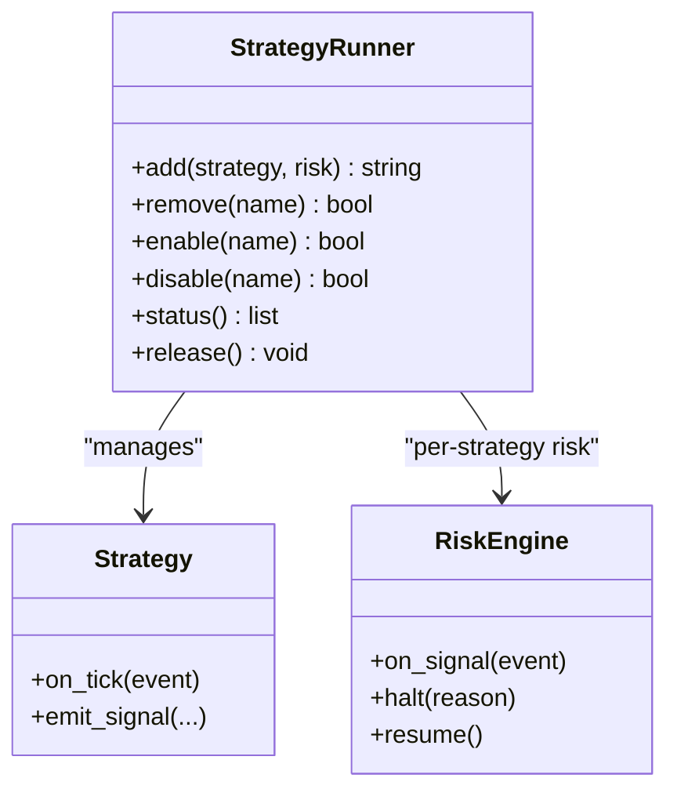
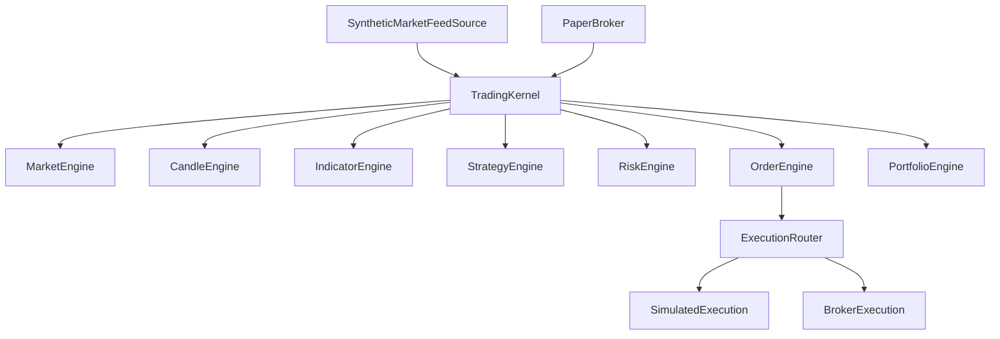

# Integration Testing Examples

<cite>
**Referenced Files in This Document**
- [test_integration_pipeline.py](file://tests/test_integration_pipeline.py)
- [test_engine_pipeline.py](file://tests/test_engine_pipeline.py)
- [test_live_execution.py](file://tests/test_live_execution.py)
- [test_synthetic_feed.py](file://tests/test_synthetic_feed.py)
- [test_risk_breakers.py](file://tests/test_risk_breakers.py)
- [test_strategy_runner.py](file://tests/test_strategy_runner.py)
- [session.py](file://ntrade/kernel/session.py)
- [synthetic_feed.py](file://ntrade/sources/synthetic_feed.py)
- [paper.py](file://ntrade/brokers/paper.py)
- [strategy_engine.py](file://ntrade/engines/strategy_engine.py)
- [risk_engine.py](file://ntrade/engines/risk_engine.py)
- [router.py](file://ntrade/execution/router.py)
- [ARCHITECTURE.md](file://ARCHITECTURE.md)
</cite>

## Table of Contents
1. [Introduction](#introduction)
2. [Project Structure](#project-structure)
3. [Core Components](#core-components)
4. [Architecture Overview](#architecture-overview)
5. [Detailed Component Analysis](#detailed-component-analysis)
6. [Dependency Analysis](#dependency-analysis)
7. [Performance Considerations](#performance-considerations)
8. [Troubleshooting Guide](#troubleshooting-guide)
9. [Conclusion](#conclusion)

## Introduction
This document provides comprehensive integration testing examples for nTrade, demonstrating end-to-end workflows from market data ingestion through strategy execution to order placement and portfolio updates. It covers engine interactions, event propagation, state synchronization across components, multi-engine coordination (candle generation, indicator computation, risk validation), and complex scenarios with multiple instruments and concurrent operations. The examples use mock brokers and synthetic data sources to ensure deterministic, repeatable tests that validate zero-parity across simulated and live execution paths.

## Project Structure
The integration tests are organized around the TradingKernel, which wires engines (market, candle, indicator, strategy, risk, order, portfolio) and an execution target (simulated or broker-backed). Synthetic feeds provide deterministic tick streams; PaperBroker offers a fully in-memory broker for backtests/replays/live parity checks. Tests assert canonical events on the bus, instrument state updates, and portfolio/account consistency.

**Diagram sources**
- [session.py:38-103](file://ntrade/kernel/session.py#L38-L103)
- [router.py:19-49](file://ntrade/execution/router.py#L19-L49)
- [synthetic_feed.py:19-77](file://ntrade/sources/synthetic_feed.py#L19-L77)
- [paper.py:23-216](file://ntrade/brokers/paper.py#L23-L216)

**Section sources**
- [ARCHITECTURE.md:20-51](file://ARCHITECTURE.md#L20-L51)
- [session.py:38-103](file://ntrade/kernel/session.py#L38-L103)

## Core Components
- TradingKernel: Wires all engines, manages lifecycle, replay, and live polling/sync.
- StrategyEngine: Dispatches kernel events to strategies; strategies emit signals via emit_signal.
- RiskEngine: Screens signals with static limits and circuit breakers; publishes approved/rejected events.
- ExecutionRouter: Routes intents to SimulatedExecution or BrokerExecution based on strategy name.
- SyntheticMarketFeedSource: Converts OHLCV frames into deterministic TickEvent streams.
- PaperBroker: In-memory broker implementing BrokerAdapter contract for parity testing.

Key test patterns:
- End-to-end pipeline: feed → kernel → strategy → risk → execution → portfolio.
- Multi-candle evaluation: ensure multiple candles trigger multiple evaluations while controlling signal emission.
- Live vs simulated parity: same signals produce identical fills and positions.
- Risk enforcement: quantity limits, allowlists, drawdown/daily loss halts, price deviation checks.
- Multi-strategy management: per-strategy risk isolation, hot detach/enable/disable, status reporting.

**Section sources**
- [session.py:38-103](file://ntrade/kernel/session.py#L38-L103)
- [strategy_engine.py:18-102](file://ntrade/engines/strategy_engine.py#L18-L102)
- [risk_engine.py:19-141](file://ntrade/engines/risk_engine.py#L19-L141)
- [router.py:19-49](file://ntrade/execution/router.py#L19-L49)
- [synthetic_feed.py:19-77](file://ntrade/sources/synthetic_feed.py#L19-L77)
- [paper.py:23-216](file://ntrade/brokers/paper.py#L23-L216)

## Architecture Overview
The kernel orchestrates an event-driven pipeline where each component reacts to canonical events. Strategies react to ticks/candles/indicators and emit signals. RiskEngine screens signals before they become order intents. OrderEngine submits intents to ExecutionRouter, which routes to either simulated or broker execution. PortfolioEngine updates positions and balances, emitting canonical events.

**Diagram sources**
- [session.py:79-103](file://ntrade/kernel/session.py#L79-L103)
- [strategy_engine.py:48-102](file://ntrade/engines/strategy_engine.py#L48-L102)
- [risk_engine.py:73-111](file://ntrade/engines/risk_engine.py#L73-L111)
- [router.py:37-49](file://ntrade/execution/router.py#L37-L49)

## Detailed Component Analysis

### Full-Pipeline Integration Test (Feed → Kernel → Strategy → Risk → Execution → Portfolio)
This example demonstrates a complete end-to-end flow using a synthetic feed and paper broker. A simple strategy emits a BUY signal on the first candle close. Assertions verify market updates, candle closure, signal emission, risk approval, and portfolio balance changes.

**Diagram sources**
- [test_integration_pipeline.py:46-95](file://tests/test_integration_pipeline.py#L46-L95)
- [synthetic_feed.py:37-77](file://ntrade/sources/synthetic_feed.py#L37-L77)
- [session.py:122-132](file://ntrade/kernel/session.py#L122-L132)

**Section sources**
- [test_integration_pipeline.py:46-95](file://tests/test_integration_pipeline.py#L46-L95)

### Multiple Candles Evaluation
This example ensures multiple candles produce multiple strategy evaluations while controlling signal emission behavior (e.g., only once). It validates candle counts and signal occurrences.

**Diagram sources**
- [test_integration_pipeline.py:98-136](file://tests/test_integration_pipeline.py#L98-L136)

**Section sources**
- [test_integration_pipeline.py:98-136](file://tests/test_integration_pipeline.py#L98-L136)

### Engine Pipeline Tests (Replay Mode)
These tests validate the full kernel pipeline in replay mode, asserting fills, position netting, risk rejections, and market order requirements. They demonstrate deterministic behavior without external dependencies.

**Diagram sources**
- [test_engine_pipeline.py:65-101](file://tests/test_engine_pipeline.py#L65-L101)
- [session.py:79-103](file://ntrade/kernel/session.py#L79-L103)
- [strategy_engine.py:48-102](file://ntrade/engines/strategy_engine.py#L48-L102)
- [risk_engine.py:73-111](file://ntrade/engines/risk_engine.py#L73-L111)

**Section sources**
- [test_engine_pipeline.py:65-101](file://tests/test_engine_pipeline.py#L65-L101)
- [test_engine_pipeline.py:115-137](file://tests/test_engine_pipeline.py#L115-L137)

### Live Execution Zero-Parity
This example verifies that the same signal produces identical fills and positions through both simulated and live broker execution. It uses a stubbed DhanBroker to avoid network calls.

**Diagram sources**
- [test_live_execution.py:172-203](file://tests/test_live_execution.py#L172-L203)
- [session.py:158-169](file://ntrade/kernel/session.py#L158-L169)
- [router.py:37-49](file://ntrade/execution/router.py#L37-L49)

**Section sources**
- [test_live_execution.py:79-116](file://tests/test_live_execution.py#L79-116)
- [test_live_execution.py:118-154](file://tests/test_live_execution.py#L118-154)
- [test_live_execution.py:172-203](file://tests/test_live_execution.py#L172-L203)

### Synthetic Feed Validation
This example ensures the synthetic feed generates deterministic ticks per bar and reconstructs OHLCV bars exactly. It asserts tick counts, candle reconstruction, and instrument quote alignment.

**Diagram sources**
- [test_synthetic_feed.py:38-63](file://tests/test_synthetic_feed.py#L38-L63)
- [synthetic_feed.py:52-77](file://ntrade/sources/synthetic_feed.py#L52-L77)

**Section sources**
- [test_synthetic_feed.py:38-63](file://tests/test_synthetic_feed.py#L38-L63)

### Risk Circuit Breakers
This example demonstrates risk engine halt/resume behavior due to daily loss, drawdown, and price deviation checks. It asserts event emissions and idempotent checks.

**Diagram sources**
- [test_risk_breakers.py:30-98](file://tests/test_risk_breakers.py#L30-98)
- [risk_engine.py:73-111](file://ntrade/engines/risk_engine.py#L73-L111)

**Section sources**
- [test_risk_breakers.py:30-98](file://tests/test_risk_breakers.py#L30-98)

### Multi-Strategy Coordination
This example shows how StrategyRunner manages multiple strategies with isolated per-strategy risk limits, hot detach/enable/disable, and status reporting. It validates that signals are screened only once and that global risk is paused while managing strategies.

**Diagram sources**
- [test_strategy_runner.py:72-107](file://tests/test_strategy_runner.py#L72-L107)
- [strategy_engine.py:48-102](file://ntrade/engines/strategy_engine.py#L48-L102)
- [risk_engine.py:19-41](file://ntrade/engines/risk_engine.py#L19-L41)

**Section sources**
- [test_strategy_runner.py:72-107](file://tests/test_strategy_runner.py#L72-L107)
- [test_strategy_runner.py:151-175](file://tests/test_strategy_runner.py#L151-L175)

## Dependency Analysis
The kernel wires engines and execution targets, ensuring zero-parity across modes. Synthetic feed depends on tick simulator; PaperBroker implements BrokerAdapter; StrategyEngine subscribes to kernel events; RiskEngine screens signals; ExecutionRouter selects targets.

**Diagram sources**
- [session.py:79-103](file://ntrade/kernel/session.py#L79-L103)
- [router.py:19-49](file://ntrade/execution/router.py#L19-L49)

**Section sources**
- [session.py:79-103](file://ntrade/kernel/session.py#L79-L103)

## Performance Considerations
- Deterministic synthetic feeds ensure reproducible tests without network latency.
- ReplayClock enables time-controlled processing for consistent results.
- EventBus swallows handler errors to prevent single failures from disrupting the pipeline.
- Polling for live orders should be scheduled appropriately to balance responsiveness and overhead.
- EventStore recording can impact performance; enable only when needed for audit/recovery.

## Troubleshooting Guide
Common issues and resolutions:
- No fills observed: Ensure initial quotes exist for MARKET orders; check risk engine allowlist/quantity limits.
- Signals rejected: Verify price deviation settings and available reference prices (ltp/prev_close).
- Position sync failures: Transient broker errors should not wipe state; check error handling in sync_positions.
- Duplicate events: Ensure idempotent polling and partial-fill delta handling.

**Section sources**
- [test_engine_pipeline.py:115-137](file://tests/test_engine_pipeline.py#L115-L137)
- [test_risk_breakers.py:101-111](file://tests/test_risk_breakers.py#L101-L111)
- [test_live_execution.py:424-439](file://tests/test_live_execution.py#L424-L439)

## Conclusion
The integration tests in nTrade provide robust coverage of end-to-end workflows, engine interactions, event propagation, and state synchronization. By leveraging synthetic feeds and mock brokers, tests achieve deterministic, repeatable validation across simulated and live execution paths. Patterns demonstrated include multi-candle evaluation, risk enforcement, multi-strategy coordination, and zero-parity verification, enabling confident development and deployment of trading strategies.