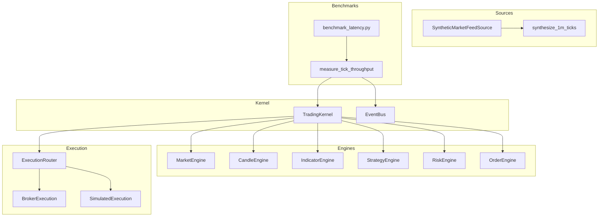
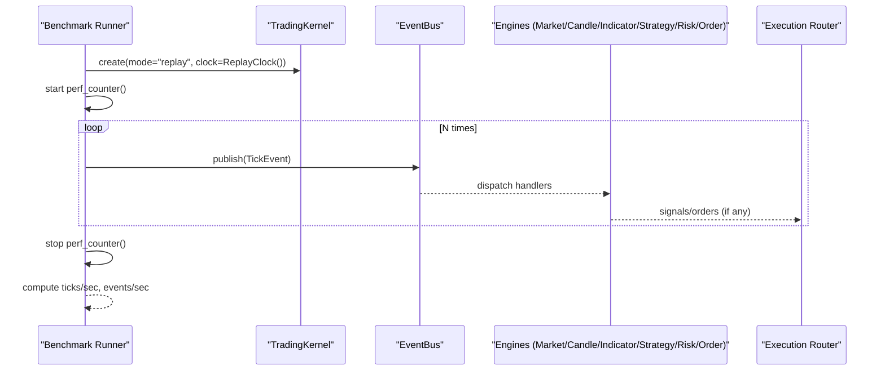
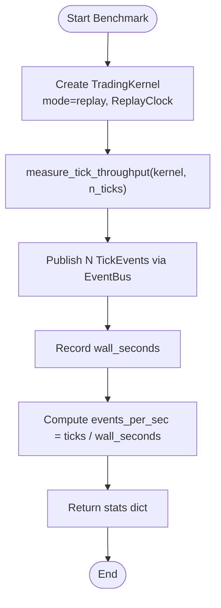
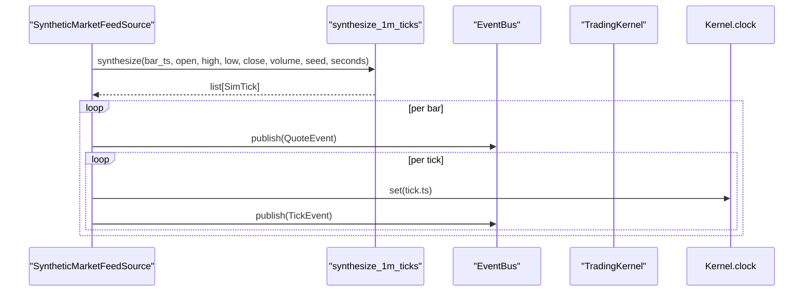
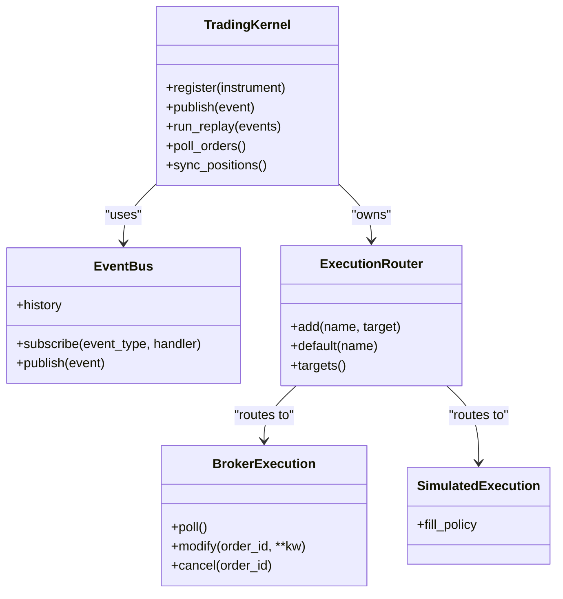
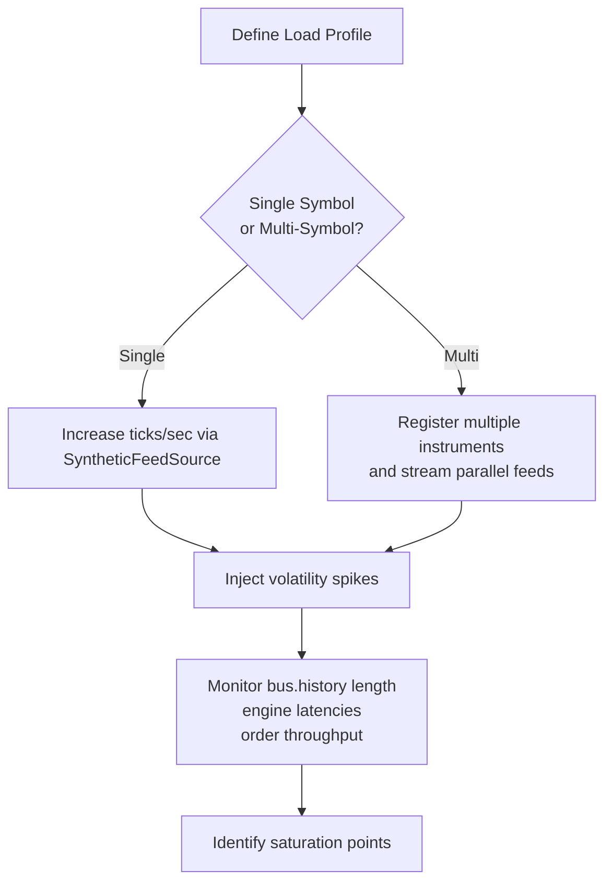
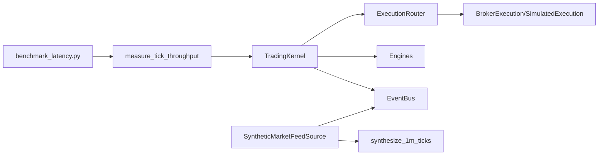

# Performance & Load Testing

<cite>
**Referenced Files in This Document**
- [ARCHITECTURE.md](file://ARCHITECTURE.md)
- [bench.py](file://ntrade/runner/bench.py)
- [benchmark_latency.py](file://scripts/benchmark_latency.py)
- [test_benchmark.py](file://tests/test_benchmark.py)
- [event_bus.py](file://ntrade/kernel/event_bus.py)
- [session.py](file://ntrade/kernel/session.py)
- [market.py](file://ntrade/events/market.py)
- [synthetic_feed.py](file://ntrade/sources/synthetic_feed.py)
- [tick_simulator.py](file://ntrade/sim/tick_simulator.py)
- [live_runner_run.py](file://scripts/live_runner_run.py)
</cite>

## Table of Contents
1. Introduction
2. Project Structure
3. Core Components
4. Architecture Overview
5. Detailed Component Analysis
6. Dependency Analysis
7. Performance Considerations
8. Troubleshooting Guide
9. Conclusion
10. Appendices

## Introduction
This document provides comprehensive performance and load testing guidance for nTrade applications. It covers benchmarking methodologies to measure latency, throughput, and resource utilization; examples of load testing with high-frequency market data streams and concurrent order processing; stress testing techniques for market volatility and system overload scenarios; memory profiling, CPU usage analysis, and network I/O optimization; guidelines for identifying bottlenecks and establishing baselines; and continuous performance monitoring with regression detection.

The guidance is grounded in the existing nTrade codebase, leveraging its event-driven kernel, synthetic feed, and built-in micro-benchmarks to design repeatable, scalable tests that reflect live trading behavior.

## Project Structure
The performance-relevant parts of the repository include:
- Kernel and event bus: central to measuring end-to-end latency and throughput
- Synthetic feed and tick simulator: deterministic, high-volume event generation for load/stress tests
- Benchmark utilities: scripts and helpers to quantify ticks/sec and wall time
- Live runner harness: orchestrates feeds, polling, and lifecycle for realistic load scenarios

**Diagram sources**
- [session.py:38-103](file://ntrade/kernel/session.py#L38-L103)
- [event_bus.py:24-81](file://ntrade/kernel/event_bus.py#L24-L81)
- [synthetic_feed.py:19-77](file://ntrade/sources/synthetic_feed.py#L19-L77)
- [tick_simulator.py:51-82](file://ntrade/sim/tick_simulator.py#L51-L82)
- [bench.py:11-26](file://ntrade/runner/bench.py#L11-L26)
- [benchmark_latency.py:18-32](file://scripts/benchmark_latency.py#L18-L32)

**Section sources**
- [ARCHITECTURE.md:1-389](file://ARCHITECTURE.md#L1-L389)

## Core Components
- TradingKernel: wires engines, execution targets, and the event bus; supports live/replay/backtest modes with identical stacks
- EventBus: thread-safe pub/sub with bounded history and serialized dispatch
- SyntheticMarketFeedSource: deterministic OHLCV-to-ticks generator for offline load/stress runs
- measure_tick_throughput: micro-benchmark that publishes N ticks and measures wall time and events/sec
- benchmark_latency.py: CLI entrypoint to run the micro-benchmark and persist results

These components form a closed loop suitable for latency, throughput, and stress testing without external dependencies.

**Section sources**
- [session.py:38-103](file://ntrade/kernel/session.py#L38-L103)
- [event_bus.py:24-81](file://ntrade/kernel/event_bus.py#L24-L81)
- [synthetic_feed.py:19-77](file://ntrade/sources/synthetic_feed.py#L19-L77)
- [bench.py:11-26](file://ntrade/runner/bench.py#L11-L26)
- [benchmark_latency.py:18-32](file://scripts/benchmark_latency.py#L18-L32)

## Architecture Overview
The event-centric architecture ensures consistent behavior across live, replay, and backtest modes. For performance testing, this means you can generate synthetic market data, route it through the same engine stack as live, and measure end-to-end latency and throughput deterministically.

**Diagram sources**
- [bench.py:11-26](file://ntrade/runner/bench.py#L11-L26)
- [event_bus.py:47-66](file://ntrade/kernel/event_bus.py#L47-L66)
- [session.py:114-116](file://ntrade/kernel/session.py#L114-L116)

## Detailed Component Analysis

### Latency and Throughput Micro-Benchmark
- Purpose: measure kernel event-pipeline latency and throughput by publishing N TickEvents and timing wall-clock duration
- Inputs: kernel instance, number of ticks
- Outputs: dict with ticks, wall_seconds, events_per_sec
- Usage: invoked by the CLI script to produce .benchmarks/latency.json

**Diagram sources**
- [bench.py:11-26](file://ntrade/runner/bench.py#L11-L26)
- [benchmark_latency.py:18-32](file://scripts/benchmark_latency.py#L18-L32)

**Section sources**
- [bench.py:11-26](file://ntrade/runner/bench.py#L11-L26)
- [benchmark_latency.py:18-32](file://scripts/benchmark_latency.py#L18-L32)
- [test_benchmark.py:9-15](file://tests/test_benchmark.py#L9-L15)

### High-Frequency Market Data Streams (Load Testing)
- Use SyntheticMarketFeedSource to stream deterministic 1-second ticks from 1-minute OHLCV bars
- The feed publishes QuoteEvent per bar and TickEvent per second, exercising the full kernel pipeline
- Suitable for sustained load testing at controlled rates (e.g., 60 ticks/min per symbol)

**Diagram sources**
- [synthetic_feed.py:52-77](file://ntrade/sources/synthetic_feed.py#L52-L77)
- [tick_simulator.py:51-82](file://ntrade/sim/tick_simulator.py#L51-L82)

**Section sources**
- [synthetic_feed.py:19-77](file://ntrade/sources/synthetic_feed.py#L19-L77)
- [tick_simulator.py:51-82](file://ntrade/sim/tick_simulator.py#L51-L82)

### Concurrent Order Processing (Stress Testing)
- With strategies enabled, each TickEvent can trigger signal generation, risk checks, and order intents
- ExecutionRouter routes orders to BrokerExecution or SimulatedExecution
- Stress test by increasing tick rate and strategy complexity while monitoring order throughput and latency

**Diagram sources**
- [session.py:38-103](file://ntrade/kernel/session.py#L38-L103)
- [event_bus.py:24-81](file://ntrade/kernel/event_bus.py#L24-L81)

**Section sources**
- [session.py:38-103](file://ntrade/kernel/session.py#L38-L103)
- [event_bus.py:24-81](file://ntrade/kernel/event_bus.py#L24-L81)

### Stress Testing Techniques for Volatility and Overload
- Increase tick frequency beyond normal levels using SyntheticMarketFeedSource with reduced seconds per bar
- Add multiple symbols concurrently by instantiating multiple kernels or registering multiple instruments
- Introduce market shocks by injecting large price jumps or depth changes via custom events
- Monitor kernel stability, event backlog, and engine processing times under load

[No sources needed since this diagram shows conceptual workflow, not actual code structure]

### Memory Profiling Guidelines
- Use Python profilers (e.g., cProfile, memory_profiler) around benchmark loops to identify hotspots
- Focus on event creation, handler execution, and object allocations within engines
- Track EventBus history growth; consider reducing max_history during heavy loads if not needed for replay

[No sources needed since this section provides general guidance]

### CPU Usage Analysis
- Profile the event dispatch path: EventBus.publish and handler chains
- Identify expensive indicator computations or strategy logic triggered per tick
- Consider batching or throttling non-critical work outside the hot path

[No sources needed since this section provides general guidance]

### Network I/O Optimization
- When running live smoke or real broker integration, minimize blocking calls
- Use asynchronous patterns where possible; ensure poll intervals are tuned to avoid busy-waiting
- For synthetic tests, decouple network concerns entirely to focus on CPU-bound paths

[No sources needed since this section provides general guidance]

## Dependency Analysis
Performance-critical dependencies and their interactions:

**Diagram sources**
- [benchmark_latency.py:18-32](file://scripts/benchmark_latency.py#L18-L32)
- [bench.py:11-26](file://ntrade/runner/bench.py#L11-L26)
- [session.py:38-103](file://ntrade/kernel/session.py#L38-L103)
- [event_bus.py:24-81](file://ntrade/kernel/event_bus.py#L24-L81)
- [synthetic_feed.py:19-77](file://ntrade/sources/synthetic_feed.py#L19-L77)
- [tick_simulator.py:51-82](file://ntrade/sim/tick_simulator.py#L51-L82)

**Section sources**
- [ARCHITECTURE.md:1-389](file://ARCHITECTURE.md#L1-L389)

## Performance Considerations
- Baseline establishment:
  - Run measure_tick_throughput with fixed tick counts (e.g., 1k, 10k) and record wall_seconds and events_per_sec
  - Store results in .benchmarks/latency.json for trend tracking
- Scalability:
  - Evaluate multi-symbol scaling by increasing registered instruments and feed concurrency
  - Monitor EventBus history length and engine queue depths
- Bottleneck identification:
  - Profile handler chains to find slow indicators or strategies
  - Check for excessive logging or serialization in hot paths
- Resource limits:
  - Tune poll_interval and sync_interval in LiveRunner to balance responsiveness and CPU usage
  - Adjust EventBus max_history based on replay needs vs memory constraints

[No sources needed since this section provides general guidance]

## Troubleshooting Guide
- Event bus exceptions:
  - Handler errors are swallowed to protect the kernel; inspect logs for handler failures
- Stalled pipelines:
  - Verify clock synchronization when using ReplayClock; ensure timestamps advance monotonically
- Memory growth:
  - Reduce EventBus max_history if replay is not required during benchmarks
- Order processing anomalies:
  - Confirm execution router configuration and broker adapter wiring in live mode

**Section sources**
- [event_bus.py:47-66](file://ntrade/kernel/event_bus.py#L47-L66)
- [session.py:135-147](file://ntrade/kernel/session.py#L135-L147)

## Conclusion
By leveraging nTrade’s event-driven kernel, synthetic feed, and built-in micro-benchmarks, you can construct robust performance and load tests that mirror live trading conditions. Establish clear baselines, monitor key metrics (ticks/sec, events/sec, wall time), and use profiling tools to pinpoint bottlenecks. Continuous monitoring and regression detection ensure performance remains stable as the system evolves.

[No sources needed since this section summarizes without analyzing specific files]

## Appendices

### Appendix A: Benchmarking Methodologies
- Latency measurement:
  - Use measure_tick_throughput to capture wall_seconds and events_per_sec
  - Repeat with varying tick counts to observe non-linearities
- Throughput measurement:
  - Scale tick volume and measure sustained events/sec
  - Add strategy complexity incrementally to assess impact
- Resource utilization:
  - Profile CPU and memory during benchmarks
  - Track EventBus history size and engine processing times

**Section sources**
- [bench.py:11-26](file://ntrade/runner/bench.py#L11-L26)
- [benchmark_latency.py:18-32](file://scripts/benchmark_latency.py#L18-L32)

### Appendix B: Load Testing Examples
- Single-symbol load:
  - Use SyntheticMarketFeedSource with 1-minute OHLCV to stream 1-second ticks
  - Vary seconds per bar to increase tick frequency
- Multi-symbol load:
  - Register multiple instruments and stream independent feeds
  - Monitor aggregate events/sec and per-symbol latencies

**Section sources**
- [synthetic_feed.py:19-77](file://ntrade/sources/synthetic_feed.py#L19-L77)
- [tick_simulator.py:51-82](file://ntrade/sim/tick_simulator.py#L51-L82)

### Appendix C: Stress Testing Scenarios
- Volatility spikes:
  - Inject large price jumps via custom events or adjust synthetic tick generation
- System overload:
  - Increase tick rate beyond normal levels and add complex strategies
  - Observe kernel stability and event backlog

[No sources needed since this section provides general guidance]

### Appendix D: Continuous Monitoring and Regression Detection
- Persist benchmark results to .benchmarks/latency.json
- Compare current runs against historical baselines to detect regressions
- Automate periodic benchmark runs in CI/CD pipelines

**Section sources**
- [benchmark_latency.py:27-31](file://scripts/benchmark_latency.py#L27-L31)