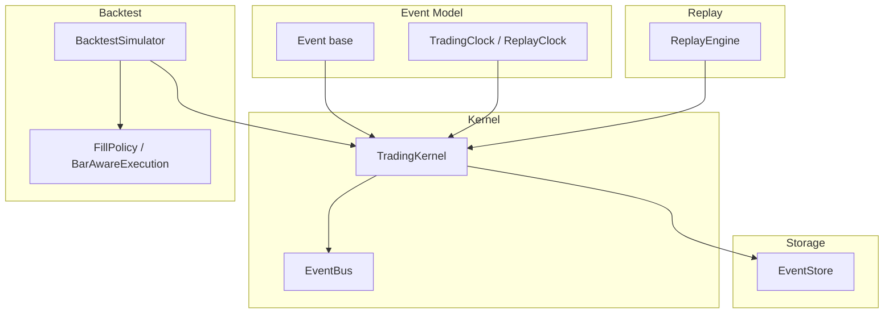
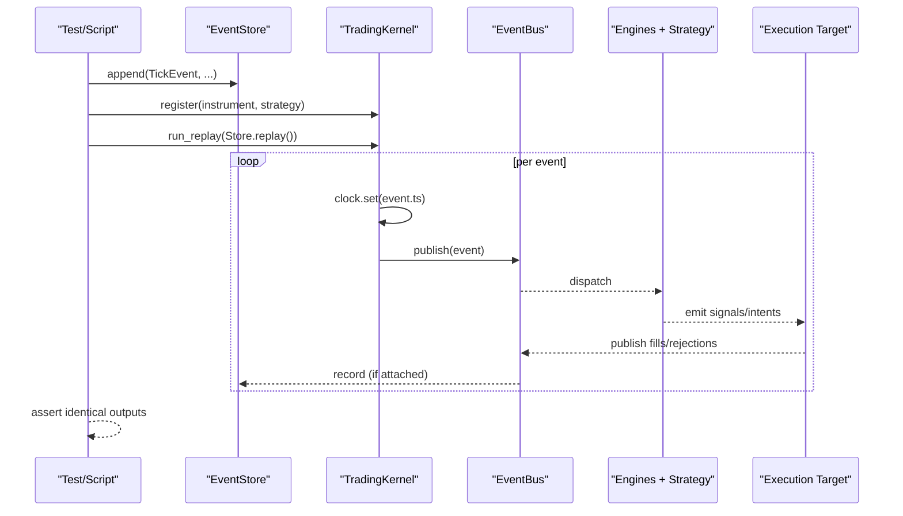
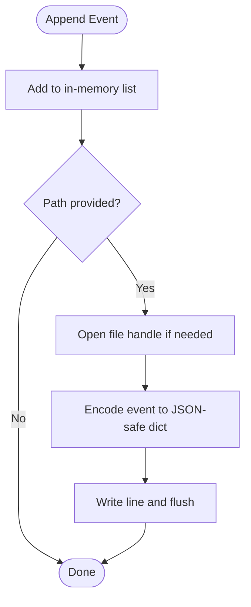
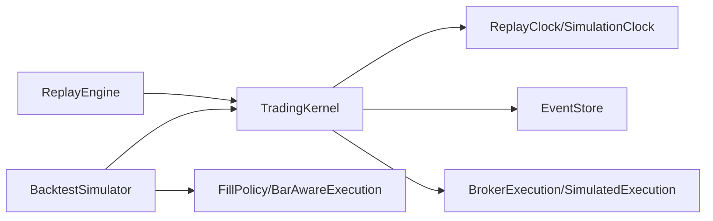

# Replay & Deterministic Testing

<cite>
**Referenced Files in This Document**
- [replay_engine.py](file://ntrade/replay/replay_engine.py)
- [event_store.py](file://ntrade/storage/event_store.py)
- [clock.py](file://ntrade/kernel/clock.py)
- [session.py](file://ntrade/kernel/session.py)
- [base.py](file://ntrade/events/base.py)
- [simulator.py](file://ntrade/backtest/simulator.py)
- [fills.py](file://ntrade/backtest/fills.py)
- [test_replay_backtest.py](file://tests/test_replay_backtest.py)
- [test_kernel_recording.py](file://tests/test_kernel_recording.py)
- [test_hardening_regression.py](file://tests/test_hardening_regression.py)
- [benchmark_latency.py](file://scripts/benchmark_latency.py)
</cite>

## Table of Contents
1. [Introduction](#introduction)
2. [Project Structure](#project-structure)
3. [Core Components](#core-components)
4. [Architecture Overview](#architecture-overview)
5. [Detailed Component Analysis](#detailed-component-analysis)
6. [Dependency Analysis](#dependency-analysis)
7. [Performance Considerations](#performance-considerations)
8. [Troubleshooting Guide](#troubleshooting-guide)
9. [Conclusion](#conclusion)
10. [Appendices](#appendices)

## Introduction
This document explains how nTrade supports replay-based testing and deterministic testing through a unified event-driven architecture. It covers:
- Recording live trading sessions as event streams
- Replaying recorded events to produce identical decisions (zero-parity)
- Using the EventStore for capturing, persisting, and reproducing scenarios
- Crash recovery testing using recorded events
- Building deterministic backtesting environments with consistent results across runs
- Verifying audit trails and performing performance regression testing via replay

The core idea is that all time-sensitive behavior is driven by an injected clock and immutable events, ensuring that the same event stream produces the same outcomes in live, replay, and backtest modes.

## Project Structure
Key modules involved in replay and deterministic testing:
- Events and clocks define the deterministic time source and immutable event model
- TradingKernel wires engines and optionally records every event to an EventStore
- EventStore persists events to JSONL and provides causal ordering for recovery
- ReplayEngine orchestrates replay through a kernel with a ReplayClock
- BacktestSimulator drives the kernel over OHLCV bars deterministically
- Tests validate zero-parity, persistence, crash recovery, and performance baselines

**Diagram sources**
- [base.py:1-22](file://ntrade/events/base.py#L1-L22)
- [clock.py:1-55](file://ntrade/kernel/clock.py#L1-L55)
- [session.py:1-200](file://ntrade/kernel/session.py#L1-L200)
- [event_store.py:1-236](file://ntrade/storage/event_store.py#L1-L236)
- [replay_engine.py:1-24](file://ntrade/replay/replay_engine.py#L1-L24)
- [simulator.py:1-220](file://ntrade/backtest/simulator.py#L1-L220)
- [fills.py:1-72](file://ntrade/backtest/fills.py#L1-L72)

**Section sources**
- [base.py:1-22](file://ntrade/events/base.py#L1-L22)
- [clock.py:1-55](file://ntrade/kernel/clock.py#L1-L55)
- [session.py:1-200](file://ntrade/kernel/session.py#L1-L200)
- [event_store.py:1-236](file://ntrade/storage/event_store.py#L1-L236)
- [replay_engine.py:1-24](file://ntrade/replay/replay_engine.py#L1-L24)
- [simulator.py:1-220](file://ntrade/backtest/simulator.py#L1-L220)
- [fills.py:1-72](file://ntrade/backtest/fills.py#L1-L72)

## Core Components
- Event base: Immutable dataclass with a kernel-clock timestamp ensures deterministic ordering and serialization.
- Clocks: LiveClock for wall time; ReplayClock and SimulationClock for deterministic time control.
- TradingKernel: Wires engine stack, optional full event recording, and run_replay to drive events deterministically.
- EventStore: Append-only store with JSONL persistence, query helpers, market-only filters, and recovery-oriented sorting.
- ReplayEngine: Thin wrapper to run an event iterable through a kernel configured for replay mode.
- BacktestSimulator: Drives the kernel over OHLCV bars with bar-aware fill policies and cost models.

**Section sources**
- [base.py:1-22](file://ntrade/events/base.py#L1-L22)
- [clock.py:1-55](file://ntrade/kernel/clock.py#L1-L55)
- [session.py:1-200](file://ntrade/kernel/session.py#L1-L200)
- [event_store.py:1-236](file://ntrade/storage/event_store.py#L1-L236)
- [replay_engine.py:1-24](file://ntrade/replay/replay_engine.py#L1-L24)
- [simulator.py:1-220](file://ntrade/backtest/simulator.py#L1-L220)

## Architecture Overview
The system enforces zero-parity by:
- Injecting a deterministic clock into the kernel
- Publishing immutable events with timestamps from the clock
- Optionally recording all events to EventStore
- Replaying only causal market events (and fills for recovery) to avoid double-application of derived effects

**Diagram sources**
- [session.py:135-147](file://ntrade/kernel/session.py#L135-L147)
- [event_store.py:89-104](file://ntrade/storage/event_store.py#L89-L104)
- [replay_engine.py:21-23](file://ntrade/replay/replay_engine.py#L21-L23)

**Section sources**
- [session.py:135-147](file://ntrade/kernel/session.py#L135-L147)
- [event_store.py:89-104](file://ntrade/storage/event_store.py#L89-L104)
- [replay_engine.py:21-23](file://ntrade/replay/replay_engine.py#L21-L23)

## Detailed Component Analysis

### EventStore: Capture, Persist, and Recover
Responsibilities:
- Append-only storage of immutable events
- JSONL persistence with recursive encoding/decoding of nested events
- Chronological iteration and symbol filtering
- Market-only event extraction for safe replay
- Recovery-oriented event selection with causal ordering (market before fill on timestamp ties)
- Partial-fill delta reconstruction for crash recovery

Key behaviors:
- Append order defines causality when timestamps tie; recovery uses index as tiebreaker
- Unknown event types are skipped gracefully during load
- Provides open_order_deltas to rebuild partial-fill state after restart

**Diagram sources**
- [event_store.py:89-104](file://ntrade/storage/event_store.py#L89-L104)
- [event_store.py:51-73](file://ntrade/storage/event_store.py#L51-L73)

**Section sources**
- [event_store.py:1-236](file://ntrade/storage/event_store.py#L1-L236)

### ReplayEngine: Deterministic Replay Driver
- Wraps a TradingKernel configured for replay mode with a ReplayClock
- Exposes run(events, start=None) to feed any iterable of events through the kernel

Usage pattern:
- Create ReplayEngine
- Register instruments and strategies on the kernel
- Run with events from EventStore.replay() or any generator

**Section sources**
- [replay_engine.py:1-24](file://ntrade/replay/replay_engine.py#L1-L24)
- [session.py:135-147](file://ntrade/kernel/session.py#L135-L147)

### TradingKernel: Zero-Parity Replay Loop
- Subscribes to base Event class when an EventStore is provided to record all events
- run_replay sets the clock to each event’s timestamp and publishes it
- Execution target can be broker or simulated; statutory costs are aligned between paths

Zero-parity guarantees:
- All time comes from the injected clock
- Derived events are recomputed by engines; do not re-feed them
- Same event stream yields same fills and portfolio updates

**Section sources**
- [session.py:71-78](file://ntrade/kernel/session.py#L71-L78)
- [session.py:135-147](file://ntrade/kernel/session.py#L135-L147)

### BacktestSimulator: Deterministic Backtesting Over Bars
- Publishes QuoteEvent and TickEvent per bar to keep the same engine pipeline as live
- Supports bar-aware limit fills via FillPolicy and BarAwareExecution
- Tracks equity curve, commissions, statutory costs, and drawdown

Determinism:
- SimulationClock controls time
- Fill policy decides limit fills based on bar ranges
- Costs applied consistently per fill

**Section sources**
- [simulator.py:116-143](file://ntrade/backtest/simulator.py#L116-L143)
- [fills.py:16-41](file://ntrade/backtest/fills.py#L16-L41)
- [fills.py:44-72](file://ntrade/backtest/fills.py#L44-L72)

### Clocks: Time Source for Determinism
- LiveClock returns wall time
- ReplayClock advances deterministically via set/advance
- SimulationClock adds speed scaling for accelerated backtests

**Section sources**
- [clock.py:14-55](file://ntrade/kernel/clock.py#L14-L55)

## Dependency Analysis
- ReplayEngine depends on TradingKernel and ReplayClock
- TradingKernel depends on EventBus, engines, execution targets, and optionally EventStore
- EventStore depends on event type registry and JSON serialization utilities
- BacktestSimulator depends on TradingKernel, SimulationClock, and fill policies

**Diagram sources**
- [replay_engine.py:1-24](file://ntrade/replay/replay_engine.py#L1-L24)
- [session.py:1-200](file://ntrade/kernel/session.py#L1-L200)
- [event_store.py:1-236](file://ntrade/storage/event_store.py#L1-L236)
- [simulator.py:1-220](file://ntrade/backtest/simulator.py#L1-L220)
- [fills.py:1-72](file://ntrade/backtest/fills.py#L1-L72)

**Section sources**
- [replay_engine.py:1-24](file://ntrade/replay/replay_engine.py#L1-L24)
- [session.py:1-200](file://ntrade/kernel/session.py#L1-L200)
- [event_store.py:1-236](file://ntrade/storage/event_store.py#L1-L236)
- [simulator.py:1-220](file://ntrade/backtest/simulator.py#L1-L220)
- [fills.py:1-72](file://ntrade/backtest/fills.py#L1-L72)

## Performance Considerations
- Use EventStore.market_events() for replay to avoid re-applying derived events
- Prefer ReplayClock/SimulationClock to avoid wall-clock drift
- For performance regression, use the benchmark script to measure tick throughput and event fanout
- Keep event payloads minimal and avoid heavy computations inside event handlers

[No sources needed since this section provides general guidance]

## Troubleshooting Guide
Common issues and resolutions:
- Unknown event types in JSONL: EventStore._decode skips unknown __type__ entries gracefully
- Causal ordering on timestamp ties: recovery_events sorts by (ts, append_index) to preserve cause-before-effect
- Stale feed halts: watchdog publishes RiskHaltedEvent when no new ticks arrive
- Partial-fill deltas: open_order_deltas reconstructs remaining quantities for still-open orders

**Section sources**
- [event_store.py:60-73](file://ntrade/storage/event_store.py#L60-L73)
- [event_store.py:183-210](file://ntrade/storage/event_store.py#L183-L210)
- [test_hardening_regression.py:25-50](file://tests/test_hardening_regression.py#L25-L50)

## Conclusion
nTrade’s replay and deterministic testing capabilities are built around immutable events, injectable clocks, and an append-only event store. By recording live sessions and replaying only causal market events, you achieve zero-parity across live, replay, and backtest modes. The EventStore enables robust crash recovery and audit trail verification, while the BacktestSimulator and benchmarks support performance regression and deterministic strategy validation.

[No sources needed since this section summarizes without analyzing specific files]

## Appendices

### How to Record Live Sessions and Replay Them
- Attach an EventStore to TradingKernel to capture all events
- After a session, extract market events via EventStore.market_events()
- Replay through a fresh kernel with ReplayClock to reproduce identical behavior

**Section sources**
- [session.py:71-78](file://ntrade/kernel/session.py#L71-L78)
- [event_store.py:126-135](file://ntrade/storage/event_store.py#L126-L135)
- [test_kernel_recording.py:41-82](file://tests/test_kernel_recording.py#L41-L82)

### Crash Recovery Testing Using Recorded Events
- Use EventStore.recovery_events() to obtain market data and fills in causal order
- Rebuild instrument, candle, indicator, and portfolio state deterministically
- Validate partial-fill deltas with open_order_deltas to ensure continuity

**Section sources**
- [event_store.py:183-210](file://ntrade/storage/event_store.py#L183-L210)
- [event_store.py:137-181](file://ntrade/storage/event_store.py#L137-L181)
- [test_hardening_regression.py:25-50](file://tests/test_hardening_regression.py#L25-L50)

### Creating Deterministic Backtesting Environments
- Use BacktestSimulator with SimulationClock and a FillPolicy
- Ensure bar-aware limit fills behave as expected
- Verify final equity, trades, and drawdown are reproducible

**Section sources**
- [simulator.py:116-143](file://ntrade/backtest/simulator.py#L116-L143)
- [fills.py:16-41](file://ntrade/backtest/fills.py#L16-L41)
- [test_replay_backtest.py:133-182](file://tests/test_replay_backtest.py#L133-L182)

### Audit Trail Verification
- Every published event is recorded when EventStore is attached
- Compare live vs replay fills and portfolio states to verify consistency
- Inspect persisted JSONL for completeness and correctness

**Section sources**
- [session.py:71-78](file://ntrade/kernel/session.py#L71-L78)
- [test_kernel_recording.py:41-62](file://tests/test_kernel_recording.py#L41-L62)
- [test_replay_backtest.py:34-55](file://tests/test_replay_backtest.py#L34-L55)

### Performance Regression Testing Using Replay
- Use scripts/benchmark_latency.py to measure tick throughput and event fanout
- Track metrics over time to detect regressions in event processing latency

**Section sources**
- [benchmark_latency.py:1-36](file://scripts/benchmark_latency.py#L1-L36)
- [test_benchmark.py:1-14](file://tests/test_benchmark.py#L1-L14)