# Testing & Integration Examples

<cite>
**Referenced Files in This Document**
- [test_integration_pipeline.py](file://tests/test_integration_pipeline.py)
- [test_replay_backtest.py](file://tests/test_replay_backtest.py)
- [test_engine_pipeline.py](file://tests/test_engine_pipeline.py)
- [test_live_execution.py](file://tests/test_live_execution.py)
- [test_broker_executor.py](file://tests/test_broker_executor.py)
- [test_brokers.py](file://tests/test_brokers.py)
- [test_synthetic_feed.py](file://tests/test_synthetic_feed.py)
- [test_indicators.py](file://tests/test_indicators.py)
- [test_portfolio_account.py](file://tests/test_portfolio_account.py)
- [test_risk_breakers.py](file://tests/test_risk_breakers.py)
- [test_strategy_runner.py](file://tests/test_strategy_runner.py)
- [test_kernel_engines.py](file://tests/test_kernel_engines.py)
- [test_benchmark.py](file://tests/test_benchmark.py)
- [benchmark_latency.py](file://scripts/benchmark_latency.py)
</cite>

## Table of Contents
1. [Introduction](#introduction)
2. [Project Structure](#project-structure)
3. [Core Components](#core-components)
4. [Architecture Overview](#architecture-overview)
5. [Detailed Component Analysis](#detailed-component-analysis)
6. [Dependency Analysis](#dependency-analysis)
7. [Performance Considerations](#performance-considerations)
8. [Troubleshooting Guide](#troubleshooting-guide)
9. [Conclusion](#conclusion)
10. [Appendices](#appendices)

## Introduction
This document provides comprehensive testing examples and integration patterns for nTrade, focusing on end-to-end workflows with mock brokers and synthetic data sources, unit tests for strategies and risk rules, replay-based and deterministic testing, performance benchmarking, load and stress testing methodologies, and best practices for test organization and continuous integration. It synthesizes the repository’s existing tests to demonstrate how to validate market data ingestion through order execution, portfolio updates, and broker reconciliation.

## Project Structure
The testing suite is organized by feature area:
- End-to-end pipeline and replay/backtest tests
- Broker layer and execution path tests
- Kernel engines (market, candle, indicator) tests
- Risk engine and circuit breaker tests
- Strategy runner and multi-strategy isolation tests
- Synthetic feed reconstruction and tick generation tests
- Portfolio/account domain object tests
- Performance benchmarking utilities and scripts

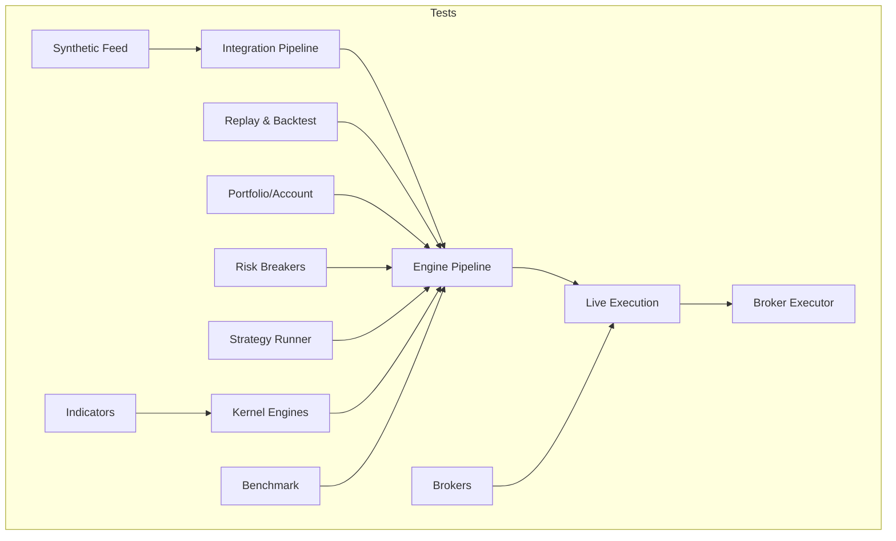

[No sources needed since this diagram shows conceptual workflow, not actual code structure]

## Core Components
Key components validated across tests include:
- TradingKernel orchestration of engines and event bus
- Market, Candle, Indicator, Risk, Order, and Portfolio engines
- Broker adapters (PaperBroker, DhanBroker via stubs)
- ReplayEngine and EventStore for deterministic replay
- SyntheticMarketFeedSource for reproducible tick streams
- StrategyRunner for multi-strategy lifecycle and per-strategy risk
- BacktestSimulator and FillPolicy for bar-aware fills

**Section sources**
- [test_engine_pipeline.py:1-137](file://tests/test_engine_pipeline.py#L1-L137)
- [test_replay_backtest.py:1-267](file://tests/test_replay_backtest.py#L1-L267)
- [test_live_execution.py:1-447](file://tests/test_live_execution.py#L1-L447)
- [test_broker_executor.py:1-39](file://tests/test_broker_executor.py#L1-L39)
- [test_brokers.py:1-107](file://tests/test_brokers.py#L1-L107)
- [test_synthetic_feed.py:1-63](file://tests/test_synthetic_feed.py#L1-L63)
- [test_indicators.py:1-149](file://tests/test_indicators.py#L1-L149)
- [test_portfolio_account.py:1-56](file://tests/test_portfolio_account.py#L1-L56)
- [test_risk_breakers.py:1-111](file://tests/test_risk_breakers.py#L1-L111)
- [test_strategy_runner.py:1-243](file://tests/test_strategy_runner.py#L1-L243)
- [test_kernel_engines.py:1-102](file://tests/test_kernel_engines.py#L1-L102)
- [test_benchmark.py:1-15](file://tests/test_benchmark.py#L1-L15)

## Architecture Overview
The kernel orchestrates a pipeline from market data ingestion to order execution and portfolio updates. Tests demonstrate both simulated and live paths with zero-parity guarantees.

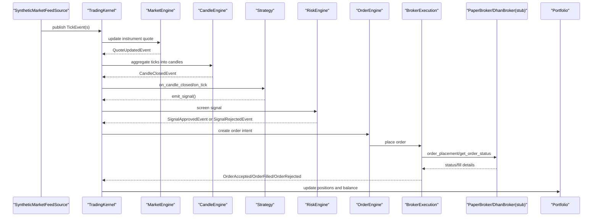

**Diagram sources**
- [test_integration_pipeline.py:46-96](file://tests/test_integration_pipeline.py#L46-L96)
- [test_engine_pipeline.py:65-101](file://tests/test_engine_pipeline.py#L65-L101)
- [test_live_execution.py:75-124](file://tests/test_live_execution.py#L75-L124)

## Detailed Component Analysis

### End-to-End Workflow Testing with Mock Brokers and Synthetic Data
- Use SyntheticMarketFeedSource to generate deterministic OHLCV-derived ticks that reconstruct bars exactly.
- Wire PaperBroker into TradingKernel for simulated execution without network calls.
- Assert full pipeline events: quotes updated, candles closed, signals emitted and approved, orders accepted/filled, portfolio updated.

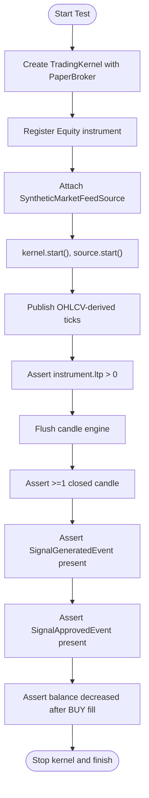

**Diagram sources**
- [test_integration_pipeline.py:46-96](file://tests/test_integration_pipeline.py#L46-L96)

**Section sources**
- [test_integration_pipeline.py:46-96](file://tests/test_integration_pipeline.py#L46-L96)
- [test_synthetic_feed.py:38-63](file://tests/test_synthetic_feed.py#L38-L63)

### Unit Testing Custom Strategies
- Implement minimal strategies emitting signals on first tick or candle close.
- Verify single emission behavior, side/quantity/price propagation, and netting effects when paired with opposite-side signals.
- Use ReplayClock for deterministic time progression.

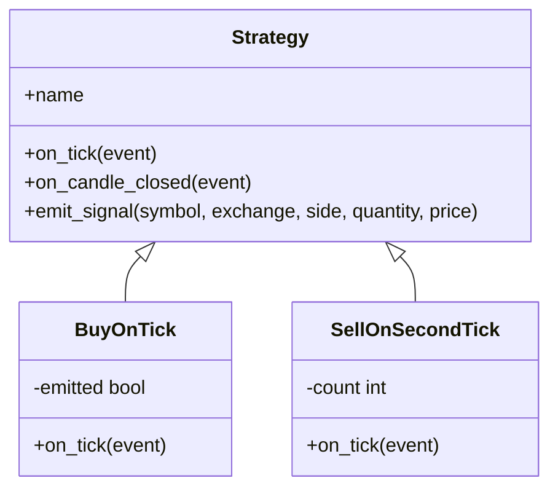

**Diagram sources**
- [test_engine_pipeline.py:16-47](file://tests/test_engine_pipeline.py#L16-L47)

**Section sources**
- [test_engine_pipeline.py:16-47](file://tests/test_engine_pipeline.py#L16-L47)

### Broker Adapters and Execution Path
- PaperBroker supports seeding quotes, historical data, and order book depth; validates capability extension pattern.
- DhanBroker integration tested via stubbed Tradehull methods to simulate placement, polling, partial fills, rejections, and idempotent poll behavior.
- BrokerExecution handles stale order eviction, timeout detection, and fallback order IDs.

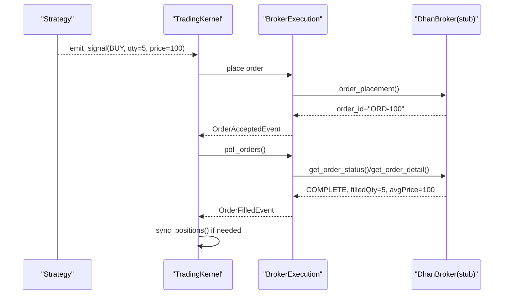

**Diagram sources**
- [test_live_execution.py:75-124](file://tests/test_live_execution.py#L75-L124)
- [test_broker_executor.py:13-39](file://tests/test_broker_executor.py#L13-L39)

**Section sources**
- [test_brokers.py:10-107](file://tests/test_brokers.py#L10-L107)
- [test_live_execution.py:75-124](file://tests/test_live_execution.py#L75-L124)
- [test_broker_executor.py:13-39](file://tests/test_broker_executor.py#L13-L39)

### Risk Rules and Circuit Breakers
- RiskEngine enforces daily loss limits, drawdown thresholds, price deviation checks, and allowlists.
- Tests assert halting/resuming behavior, idempotent check(), and rejection reasons.

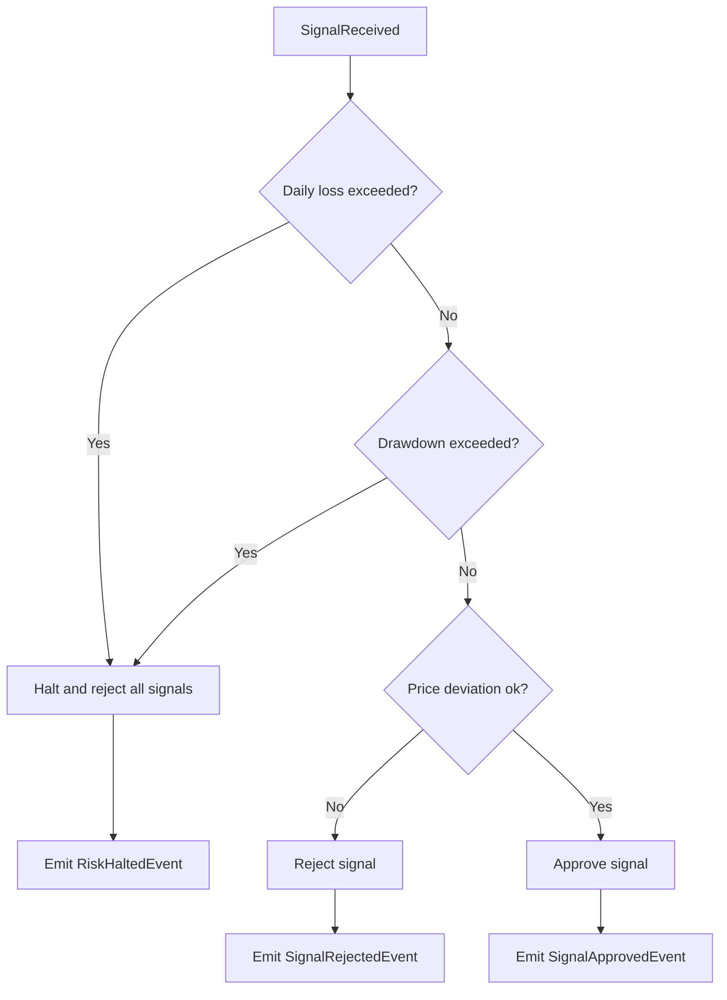

**Diagram sources**
- [test_risk_breakers.py:30-111](file://tests/test_risk_breakers.py#L30-L111)

**Section sources**
- [test_risk_breakers.py:30-111](file://tests/test_risk_breakers.py#L30-L111)

### Replay-Based and Deterministic Testing
- EventStore persists and replays events chronologically, supporting JSONL roundtrip and nested events.
- ReplayEngine drives TradingKernel deterministically using ReplayClock; zero-parity between simulated and live paths verified.
- BacktestSimulator produces equity curves, commissions, drawdown metrics, and bar-aware fills.

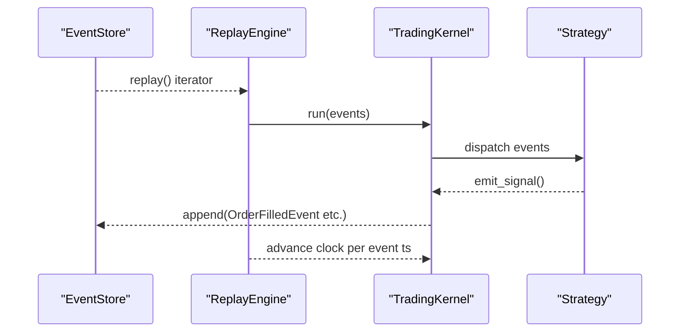

**Diagram sources**
- [test_replay_backtest.py:24-41](file://tests/test_replay_backtest.py#L24-L41)
- [test_replay_backtest.py:72-99](file://tests/test_replay_backtest.py#L72-L99)

**Section sources**
- [test_replay_backtest.py:24-41](file://tests/test_replay_backtest.py#L24-L41)
- [test_replay_backtest.py:72-99](file://tests/test_replay_backtest.py#L72-L99)
- [test_replay_backtest.py:133-182](file://tests/test_replay_backtest.py#L133-L182)

### Performance Benchmarking, Load, and Stress Testing
- measure_tick_throughput provides ticks, events_per_sec, wall_seconds for kernel throughput measurement.
- CLI script writes latency results to .benchmarks/latency.json for CI tracking.
- Load/stress patterns can be built by increasing n_ticks and asserting stable throughput and latency bounds.

**Diagram sources**
- [test_benchmark.py:9-15](file://tests/test_benchmark.py#L9-L15)
- [benchmark_latency.py:18-32](file://scripts/benchmark_latency.py#L18-L32)

**Section sources**
- [test_benchmark.py:9-15](file://tests/test_benchmark.py#L9-L15)
- [benchmark_latency.py:18-32](file://scripts/benchmark_latency.py#L18-L32)

### Testing Custom Indicators
- Validate RSI bounds and trend direction, ATR positivity, VWAP within session range, Supertrend signals, SMA/EMA warm-up periods, and compute_bundle outputs.
- IndicatorEngine respects max_rows to bound memory usage.

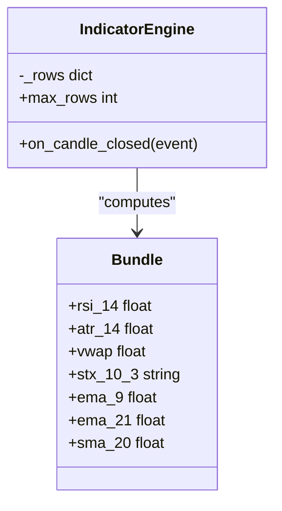

**Diagram sources**
- [test_indicators.py:129-149](file://tests/test_indicators.py#L129-L149)

**Section sources**
- [test_indicators.py:23-127](file://tests/test_indicators.py#L23-L127)
- [test_indicators.py:129-149](file://tests/test_indicators.py#L129-L149)

### Order Routing Logic and Portfolio Calculations
- Portfolio and Account objects support PnL, market value, holdings lookup, and broker-backed initialization.
- Tests verify position netting, balance changes, and canonical events emitted during updates.

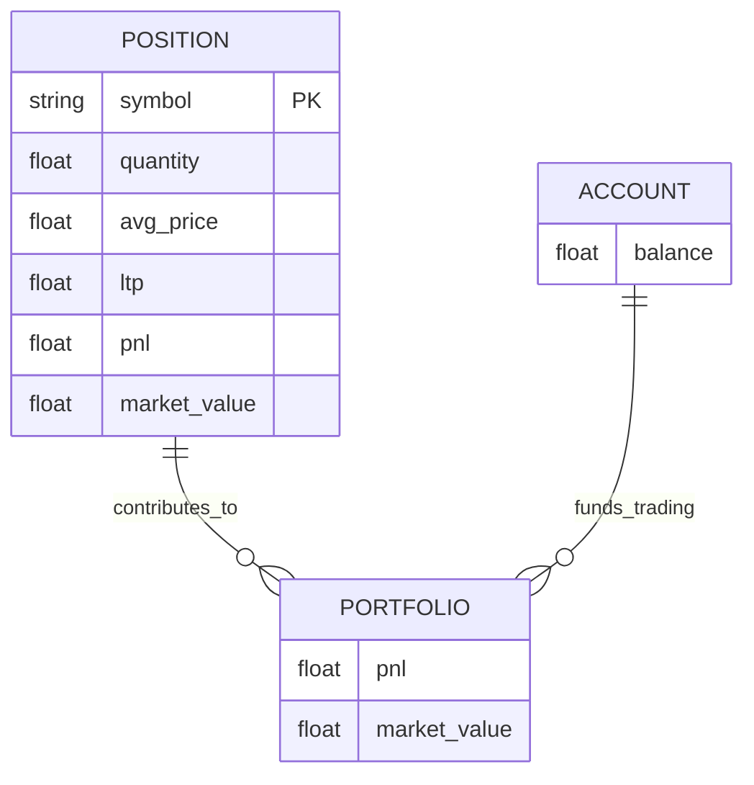

**Diagram sources**
- [test_portfolio_account.py:9-56](file://tests/test_portfolio_account.py#L9-L56)

**Section sources**
- [test_portfolio_account.py:9-56](file://tests/test_portfolio_account.py#L9-L56)

### Strategy Runner and Multi-Strategy Isolation
- StrategyRunner manages multiple strategies with unique names, hot detach/enable/disable, per-strategy risk limits, and global risk pause management.
- Verifies that per-strategy caps do not interfere across strategies and that release restores global risk handlers.

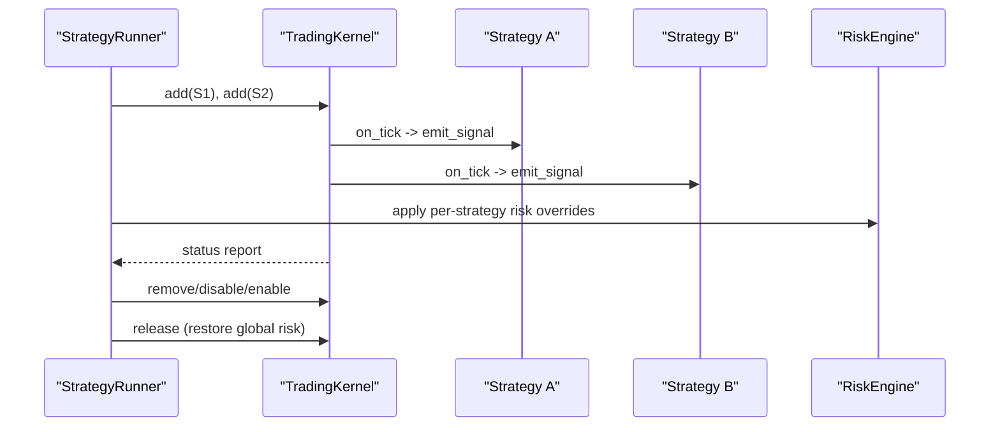

**Diagram sources**
- [test_strategy_runner.py:72-107](file://tests/test_strategy_runner.py#L72-L107)
- [test_strategy_runner.py:109-175](file://tests/test_strategy_runner.py#L109-L175)

**Section sources**
- [test_strategy_runner.py:72-107](file://tests/test_strategy_runner.py#L72-L107)
- [test_strategy_runner.py:109-175](file://tests/test_strategy_runner.py#L109-L175)

### Kernel Engines: Market, Candle, Indicator
- MarketEngine projects ticks/quotes/depth onto instruments and stream state.
- CandleEngine closes candles on bucket transitions and flushes partials.
- IndicatorEngine publishes bundles after sufficient candles and updates instrument analytics.

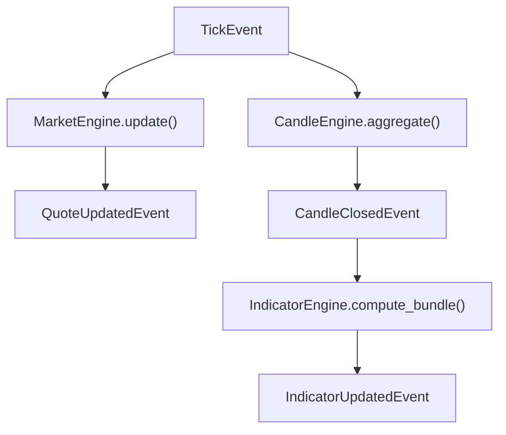

**Diagram sources**
- [test_kernel_engines.py:27-102](file://tests/test_kernel_engines.py#L27-L102)

**Section sources**
- [test_kernel_engines.py:27-102](file://tests/test_kernel_engines.py#L27-L102)

## Dependency Analysis
- TradingKernel depends on engines (Market, Candle, Indicator, Risk, Order, Portfolio) and optional broker adapter.
- ReplayEngine depends on EventStore and ReplayClock; BacktestSimulator depends on FillPolicy and strategy callbacks.
- StrategyRunner depends on TradingKernel and RiskEngine; isolates per-strategy risk while managing global risk pause.

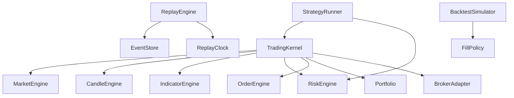

**Diagram sources**
- [test_engine_pipeline.py:49-57](file://tests/test_engine_pipeline.py#L49-L57)
- [test_replay_backtest.py:72-99](file://tests/test_replay_backtest.py#L72-L99)
- [test_strategy_runner.py:72-107](file://tests/test_strategy_runner.py#L72-L107)

**Section sources**
- [test_engine_pipeline.py:49-57](file://tests/test_engine_pipeline.py#L49-L57)
- [test_replay_backtest.py:72-99](file://tests/test_replay_backtest.py#L72-L99)
- [test_strategy_runner.py:72-107](file://tests/test_strategy_runner.py#L72-L107)

## Performance Considerations
- Use measure_tick_throughput to quantify ticks/sec and wall time; integrate into CI to detect regressions.
- Increase n_ticks for load testing; monitor memory usage of IndicatorEngine via max_rows.
- Prefer ReplayClock and deterministic feeds to avoid flaky timing-dependent tests.

[No sources needed since this section provides general guidance]

## Troubleshooting Guide
Common issues and resolutions:
- Stale orders not evicted: ensure BrokerExecution.poll() runs enough cycles to trigger eviction on repeated failures.
- Partial fills double-counted: verify poll() emits delta quantities and tracks open orders correctly.
- Unknown event types in JSONL: EventStore silently skips unknown __type__ entries; ensure consistent serialization.
- Non-numeric avg_price from broker: fallback to intent price; robust parsing prevents poll loop crashes.
- Position sync transient failures: ensure sync_positions() preserves local state and does not zero balance on errors.

**Section sources**
- [test_broker_executor.py:13-39](file://tests/test_broker_executor.py#L13-L39)
- [test_live_execution.py:262-377](file://tests/test_live_execution.py#L262-L377)
- [test_replay_backtest.py:243-267](file://tests/test_replay_backtest.py#L243-L267)

## Conclusion
The nTrade test suite demonstrates robust methodologies for validating trading pipelines under both simulated and live conditions. By leveraging synthetic feeds, replay engines, and mocked brokers, tests achieve deterministic, repeatable outcomes. The inclusion of risk breakers, strategy isolation, and performance benchmarks ensures reliability, safety, and scalability. Adopt these patterns to build resilient strategies and maintain high-quality integrations.

## Appendices
- Best practices for test organization: group by feature, use fixtures for common kernels and clocks, isolate external dependencies via mocks/stubs.
- Continuous integration setup: run pytest suites, capture benchmark outputs, fail on throughput regressions, and archive artifacts.

[No sources needed since this section summarizes without analyzing specific files]