# Testing & Integration Examples

<cite>
**Referenced Files in This Document**
- [test_integration_pipeline.py](file://tests/test_integration_pipeline.py)
- [test_replay_backtest.py](file://tests/test_replay_backtest.py)
- [test_engine_pipeline.py](file://tests/test_engine_pipeline.py)
- [test_live_execution.py](file://tests/test_live_execution.py)
- [test_broker_executor.py](file://tests/test_broker_executor.py)
- [test_brokers.py](file://tests/test_brokers.py)
- [test_synthetic_feed.py](file://tests/test_synthetic_feed.py)
- [test_indicators.py](file://tests/test_indicators.py)
- [test_portfolio_account.py](file://tests/test_portfolio_account.py)
- [test_risk_breakers.py](file://tests/test_risk_breakers.py)
- [test_strategy_runner.py](file://tests/test_strategy_runner.py)
- [test_kernel_engines.py](file://tests/test_kernel_engines.py)
- [test_benchmark.py](file://tests/test_benchmark.py)
- [test_gap_closure.py](file://tests/test_gap_closure.py)
- [test_rate_limit.py](file://tests/test_rate_limit.py)
- [test_dhan_broker.py](file://tests/test_dhan_broker.py)
- [test_instruments.py](file://tests/test_instruments.py)
- [test_retry.py](file://tests/test_retry.py)
- [benchmark_latency.py](file://scripts/benchmark_latency.py)
- [dhan_transport.py](file://ntrade/brokers/dhan_transport.py)
- [dhan.py](file://ntrade/brokers/dhan.py)
</cite>

## Update Summary
**Changes Made**
- Added comprehensive section on depth retry behavior testing with frame timeout handling and rate limit propagation
- Updated LTP failure envelope rejection testing patterns with detailed coverage of Tradehull SDK behavior
- Enhanced rate limit propagation testing across all broker methods with DH-904 error handling
- Added failed quote fetch state preservation testing to prevent stale data from being reported as fresh
- Expanded retry policy testing with specific coverage for rate-limited exceptions and transient errors

## Table of Contents
1. [Introduction](#introduction)
2. [Project Structure](#project-structure)
3. [Core Components](#core-components)
4. [Architecture Overview](#architecture-overview)
5. [Detailed Component Analysis](#detailed-component-analysis)
6. [Depth Retry Behavior and Frame Timeout Handling](#depth-retry-behavior-and-frame-timeout-handling)
7. [LTP Failure Envelope Rejection](#ltp-failure-envelope-rejection)
8. [Rate Limit Propagation Testing](#rate-limit-propagation-testing)
9. [Failed Quote Fetch State Preservation](#failed-quote-fetch-state-preservation)
10. [Retry Policy and Exception Handling](#retry-policy-and-exception-handling)
11. [Dependency Analysis](#dependency-analysis)
12. [Performance Considerations](#performance-considerations)
13. [Troubleshooting Guide](#troubleshooting-guide)
14. [Conclusion](#conclusion)
15. [Appendices](#appendices)

## Introduction
This document provides comprehensive testing examples and integration patterns for nTrade, focusing on end-to-end workflows with mock brokers and synthetic data sources, unit tests for strategies and risk rules, replay-based and deterministic testing, performance benchmarking, load and stress testing methodologies, and best practices for test organization and continuous integration. The latest additions include comprehensive depth retry behavior testing, LTP failure envelope rejection, rate limit propagation across all broker methods, frame timeout handling, and failed quote fetch state preservation to ensure robust error handling and data integrity.

## Project Structure
The testing suite is organized by feature area:
- End-to-end pipeline and replay/backtest tests
- Broker layer and execution path tests with comprehensive error handling
- Kernel engines (market, candle, indicator) tests
- Risk engine and circuit breaker tests
- Strategy runner and multi-strategy isolation tests
- Synthetic feed reconstruction and tick generation tests
- Portfolio/account domain object tests
- Performance benchmarking utilities and scripts
- **New**: Depth retry behavior and frame timeout handling tests
- **New**: LTP failure envelope rejection and rate limit propagation tests
- **New**: Failed quote fetch state preservation tests

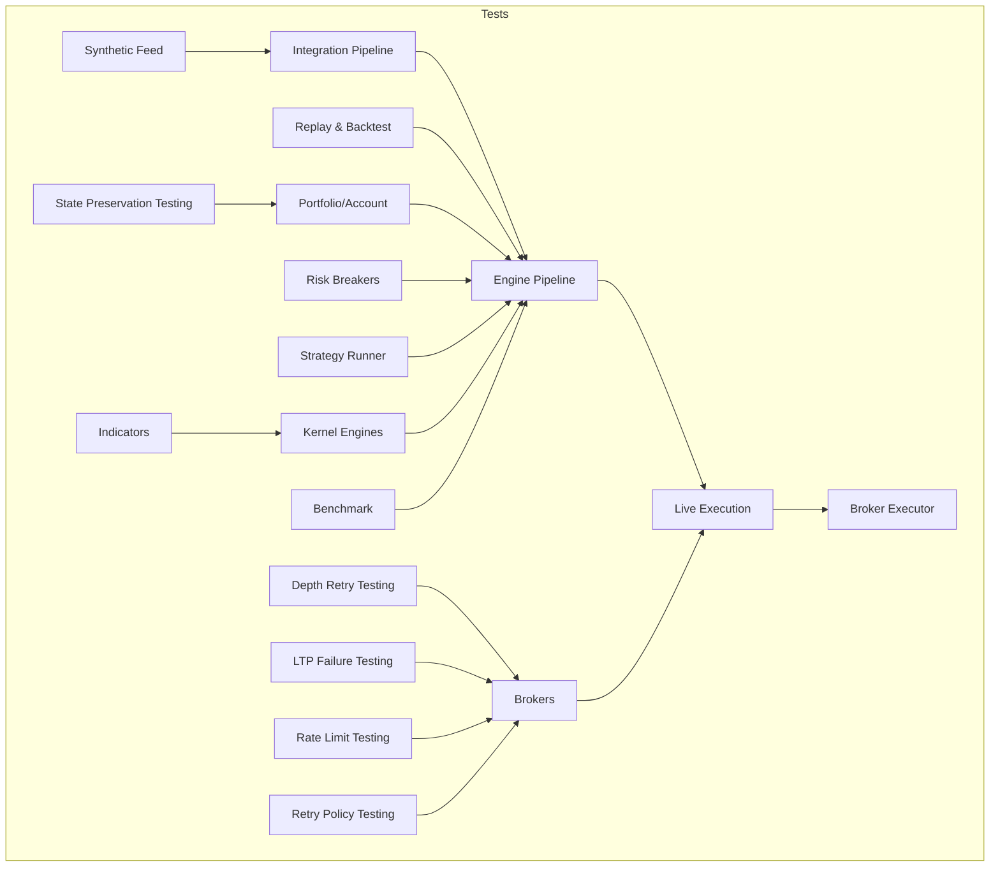
```mermaid
graph TB
subgraph "Tests"
A["Integration Pipeline"]
B["Replay & Backtest"]
C["Engine Pipeline"]
D["Live Execution"]
E["Broker Executor"]
F["Brokers"]
G["Synthetic Feed"]
H["Indicators"]
I["Portfolio/Account"]
J["Risk Breakers"]
K["Strategy Runner"]
L["Kernel Engines"]
M["Benchmark"]
N["Depth Retry Testing"]
O["LTP Failure Testing"]
P["Rate Limit Testing"]
Q["State Preservation Testing"]
R["Retry Policy Testing"]
end
A --> C
B --> C
C --> D
D --> E
F --> D
G --> A
H --> L
I --> C
J --> C
K --> C
L --> C
M --> C
N --> F
O --> F
P --> F
Q --> I
R --> F
```

[No sources needed since this diagram shows conceptual workflow, not actual code structure]

## Core Components
Key components validated across tests include:
- TradingKernel orchestration of engines and event bus
- Market, Candle, Indicator, Risk, Order, and Portfolio engines
- Broker adapters (PaperBroker, DhanBroker via stubs)
- ReplayEngine and EventStore for deterministic replay
- SyntheticMarketFeedSource for reproducible tick streams
- StrategyRunner for multi-strategy lifecycle and per-strategy risk
- BacktestSimulator and FillPolicy for bar-aware fills
- **New**: Comprehensive depth retry behavior with frame timeout handling
- **New**: LTP failure envelope rejection with proper error propagation
- **New**: Rate limit propagation across all broker methods
- **New**: Failed quote fetch state preservation to prevent stale data reporting

**Section sources**
- [test_engine_pipeline.py:1-137](file://tests/test_engine_pipeline.py#L1-L137)
- [test_replay_backtest.py:1-267](file://tests/test_replay_backtest.py#L1-L267)
- [test_live_execution.py:1-447](file://tests/test_live_execution.py#L1-L447)
- [test_broker_executor.py:1-39](file://tests/test_broker_executor.py#L1-L39)
- [test_brokers.py:1-107](file://tests/test_brokers.py#L1-L107)
- [test_synthetic_feed.py:1-63](file://tests/test_synthetic_feed.py#L1-L63)
- [test_indicators.py:1-149](file://tests/test_indicators.py#L1-L149)
- [test_portfolio_account.py:1-56](file://tests/test_portfolio_account.py#L1-L56)
- [test_risk_breakers.py:1-111](file://tests/test_risk_breakers.py#L1-L111)
- [test_strategy_runner.py:1-243](file://tests/test_strategy_runner.py#L1-L243)
- [test_kernel_engines.py:1-102](file://tests/test_kernel_engines.py#L1-L102)
- [test_benchmark.py:1-15](file://tests/test_benchmark.py#L1-L15)
- [test_gap_closure.py:1-593](file://tests/test_gap_closure.py#L1-L593)
- [test_rate_limit.py:1-237](file://tests/test_rate_limit.py#L1-L237)
- [test_dhan_broker.py:1-830](file://tests/test_dhan_broker.py#L1-L830)
- [test_instruments.py:1-193](file://tests/test_instruments.py#L1-L193)
- [test_retry.py:1-300](file://tests/test_retry.py#L1-L300)

## Architecture Overview
The kernel orchestrates a pipeline from market data ingestion to order execution and portfolio updates. Tests demonstrate both simulated and live paths with zero-parity guarantees and comprehensive error handling.

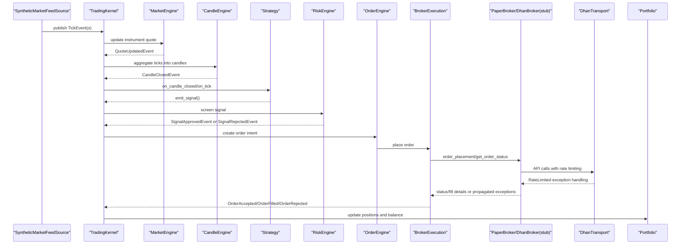
```mermaid
sequenceDiagram
participant Feed as "SyntheticMarketFeedSource"
participant Kernel as "TradingKernel"
participant MarketEng as "MarketEngine"
participant CandleEng as "CandleEngine"
participant Strat as "Strategy"
participant Risk as "RiskEngine"
participant OMS as "OrderEngine"
participant Exec as "BrokerExecution"
participant Broker as "PaperBroker/DhanBroker(stub)"
participant Transport as "DhanTransport"
participant Port as "Portfolio"
Feed->>Kernel : publish TickEvent(s)
Kernel->>MarketEng : update instrument quote
MarketEng-->>Kernel : QuoteUpdatedEvent
Kernel->>CandleEng : aggregate ticks into candles
CandleEng-->>Kernel : CandleClosedEvent
Kernel->>Strat : on_candle_closed/on_tick
Strat-->>Kernel : emit_signal()
Kernel->>Risk : screen signal
Risk-->>Kernel : SignalApprovedEvent or SignalRejectedEvent
Kernel->>OMS : create order intent
OMS->>Exec : place order
Exec->>Broker : order_placement/get_order_status
Broker->>Transport : API calls with rate limiting
Transport-->>Broker : RateLimited exception handling
Broker-->>Exec : status/fill details or propagated exceptions
Exec-->>Kernel : OrderAccepted/OrderFilled/OrderRejected
Kernel->>Port : update positions and balance
```

**Diagram sources**
- [test_integration_pipeline.py:46-96](file://tests/test_integration_pipeline.py#L46-L96)
- [test_engine_pipeline.py:65-101](file://tests/test_engine_pipeline.py#L65-L101)
- [test_live_execution.py:75-124](file://tests/test_live_execution.py#L75-L124)
- [dhan_transport.py:130-157](file://ntrade/brokers/dhan_transport.py#L130-L157)

## Detailed Component Analysis

### End-to-End Workflow Testing with Mock Brokers and Synthetic Data
- Use SyntheticMarketFeedSource to generate deterministic OHLCV-derived ticks that reconstruct bars exactly.
- Wire PaperBroker into TradingKernel for simulated execution without network calls.
- Assert full pipeline events: quotes updated, candles closed, signals emitted and approved, orders accepted/filled, portfolio updated.

```mermaid
flowchart TD
Start(["Start Test"]) --> BuildKernel["Create TradingKernel with PaperBroker"]
BuildKernel --> RegisterInstrument["Register Equity instrument"]
RegisterInstrument --> AttachFeed["Attach SyntheticMarketFeedSource"]
AttachFeed --> StartKernel["kernel.start(), source.start()"]
StartKernel --> PublishTicks["Publish OHLCV-derived ticks"]
PublishTicks --> ValidateQuote["Assert instrument.ltp > 0"]
ValidateQuote --> FlushCandles["Flush candle engine"]
FlushCandles --> AssertCandles["Assert >=1 closed candle"]
AssertCandles --> AssertSignals["Assert SignalGeneratedEvent present"]
AssertSignals --> AssertApproved["Assert SignalApprovedEvent present"]
AssertApproved --> AssertPortfolio["Assert balance decreased after BUY fill"]
AssertPortfolio --> End(["Stop kernel and finish"])
```

**Diagram sources**
- [test_integration_pipeline.py:46-96](file://tests/test_integration_pipeline.py#L46-L96)

**Section sources**
- [test_integration_pipeline.py:46-96](file://tests/test_integration_pipeline.py#L46-L96)
- [test_synthetic_feed.py:38-63](file://tests/test_synthetic_feed.py#L38-L63)

### Unit Testing Custom Strategies
- Implement minimal strategies emitting signals on first tick or candle close.
- Verify single emission behavior, side/quantity/price propagation, and netting effects when paired with opposite-side signals.
- Use ReplayClock for deterministic time progression.

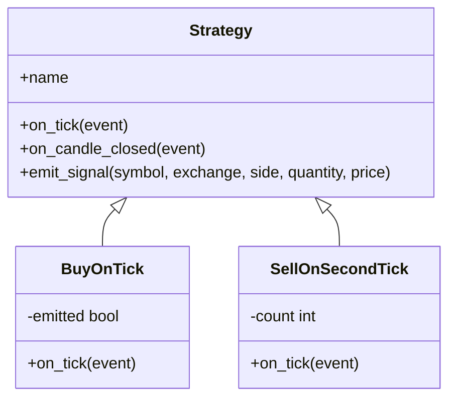
```mermaid
classDiagram
class Strategy {
+name
+on_tick(event)
+on_candle_closed(event)
+emit_signal(symbol, exchange, side, quantity, price)
}
class BuyOnTick {
+on_tick(event)
-emitted bool
}
class SellOnSecondTick {
+on_tick(event)
-count int
}
Strategy <|-- BuyOnTick
Strategy <|-- SellOnSecondTick
```

**Diagram sources**
- [test_engine_pipeline.py:16-47](file://tests/test_engine_pipeline.py#L16-L47)

**Section sources**
- [test_engine_pipeline.py:16-47](file://tests/test_engine_pipeline.py#L16-L47)

### Broker Adapters and Execution Path
- PaperBroker supports seeding quotes, historical data, and order book depth; validates capability extension pattern.
- DhanBroker integration tested via stubbed Tradehull methods to simulate placement, polling, partial fills, rejections, and idempotent poll behavior.
- BrokerExecution handles stale order eviction, timeout detection, and fallback order IDs.

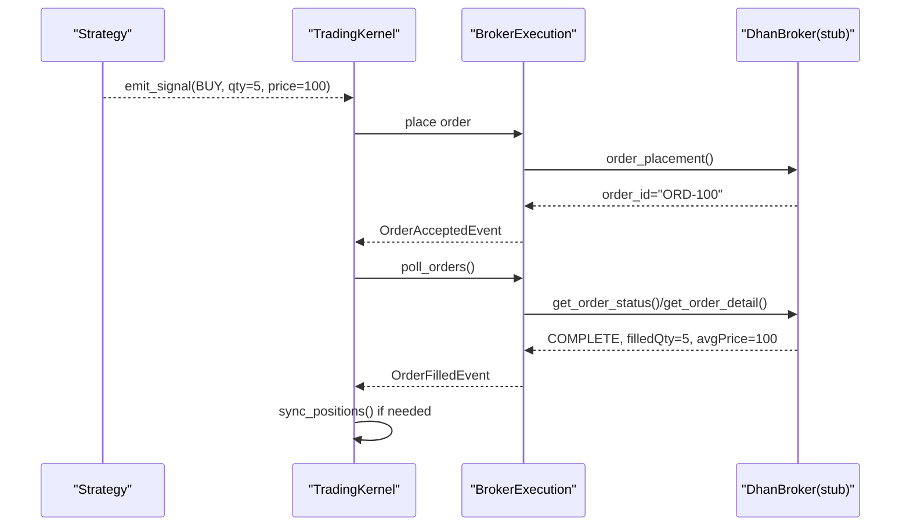
```mermaid
sequenceDiagram
participant Strat as "Strategy"
participant Kernel as "TradingKernel"
participant Exec as "BrokerExecution"
participant Broker as "DhanBroker(stub)"
Strat-->>Kernel : emit_signal(BUY, qty=5, price=100)
Kernel->>Exec : place order
Exec->>Broker : order_placement()
Broker-->>Exec : order_id="ORD-100"
Exec-->>Kernel : OrderAcceptedEvent
Kernel->>Exec : poll_orders()
Exec->>Broker : get_order_status()/get_order_detail()
Broker-->>Exec : COMPLETE, filledQty=5, avgPrice=100
Exec-->>Kernel : OrderFilledEvent
Kernel->>Kernel : sync_positions() if needed
```

**Diagram sources**
- [test_live_execution.py:75-124](file://tests/test_live_execution.py#L75-L124)
- [test_broker_executor.py:13-39](file://tests/test_broker_executor.py#L13-L39)

**Section sources**
- [test_brokers.py:10-107](file://tests/test_brokers.py#L10-107)
- [test_live_execution.py:75-124](file://tests/test_live_execution.py#L75-L124)
- [test_broker_executor.py:13-39](file://tests/test_broker_executor.py#L13-L39)

### Risk Rules and Circuit Breakers
- RiskEngine enforces daily loss limits, drawdown thresholds, price deviation checks, and allowlists.
- Tests assert halting/resuming behavior, idempotent check(), and rejection reasons.

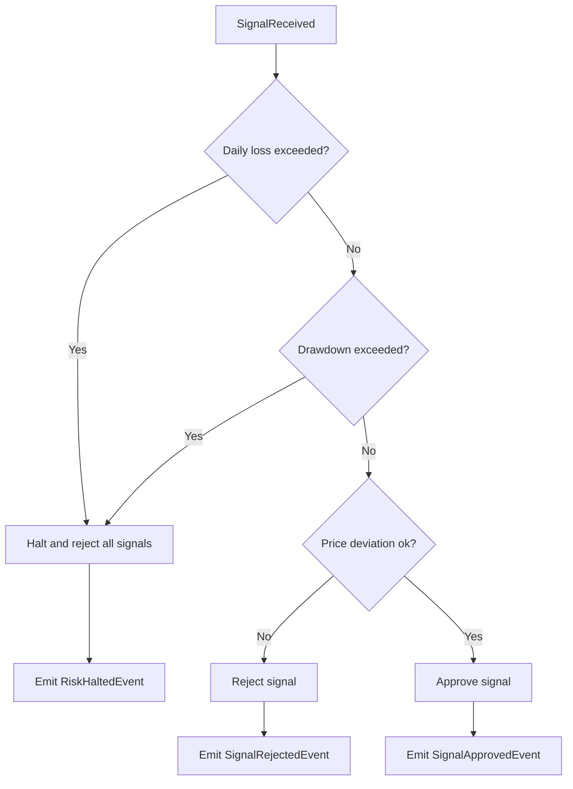
```mermaid
flowchart TD
S["SignalReceived"] --> CheckDailyLoss{"Daily loss exceeded?"}
CheckDailyLoss --> |Yes| Halt["Halt and reject all signals"]
CheckDailyLoss --> |No| CheckDrawdown{"Drawdown exceeded?"}
CheckDrawdown --> |Yes| Halt
CheckDrawdown --> |No| CheckDeviation{"Price deviation ok?"}
CheckDeviation --> |No| Reject["Reject signal"]
CheckDeviation --> |Yes| Approve["Approve signal"]
Halt --> EmitHalted["Emit RiskHaltedEvent"]
Reject --> EmitRejected["Emit SignalRejectedEvent"]
Approve --> EmitApproved["Emit SignalApprovedEvent"]
```

**Diagram sources**
- [test_risk_breakers.py:30-111](file://tests/test_risk_breakers.py#L30-L111)

**Section sources**
- [test_risk_breakers.py:30-111](file://tests/test_risk_breakers.py#L30-L111)

### Replay-Based and Deterministic Testing
- EventStore persists and replays events chronologically, supporting JSONL roundtrip and nested events.
- ReplayEngine drives TradingKernel deterministically using ReplayClock; zero-parity between simulated and live paths verified.
- BacktestSimulator produces equity curves, commissions, drawdown metrics, and bar-aware fills.

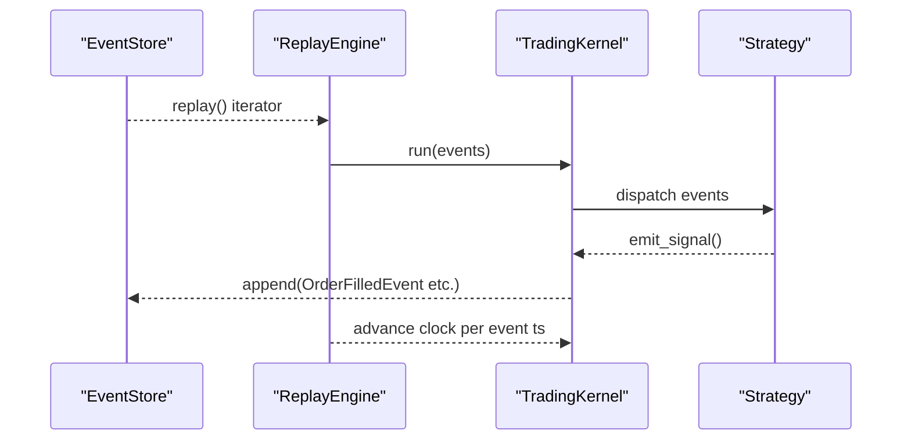
```mermaid
sequenceDiagram
participant Store as "EventStore"
participant Engine as "ReplayEngine"
participant Kernel as "TradingKernel"
participant Strat as "Strategy"
Store-->>Engine : replay() iterator
Engine->>Kernel : run(events)
Kernel->>Strat : dispatch events
Strat-->>Kernel : emit_signal()
Kernel-->>Store : append(OrderFilledEvent etc.)
Engine-->>Kernel : advance clock per event ts
```

**Diagram sources**
- [test_replay_backtest.py:24-41](file://tests/test_replay_backtest.py#L24-41)
- [test_replay_backtest.py:72-99](file://tests/test_replay_backtest.py#L72-99)

**Section sources**
- [test_replay_backtest.py:24-41](file://tests/test_replay_backtest.py#L24-41)
- [test_replay_backtest.py:72-99](file://tests/test_replay_backtest.py#L72-99)
- [test_replay_backtest.py:133-182](file://tests/test_replay_backtest.py#L133-L182)

### Performance Benchmarking, Load, and Stress Testing
- measure_tick_throughput provides ticks, events_per_sec, wall_seconds for kernel throughput measurement.
- CLI script writes latency results to .benchmarks/latency.json for CI tracking.
- Load/stress patterns can be built by increasing n_ticks and asserting stable throughput and latency bounds.

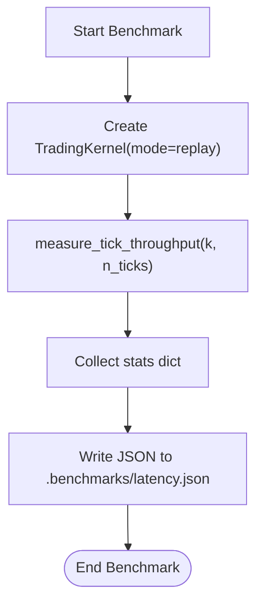
```mermaid
flowchart TD
StartBench["Start Benchmark"] --> CreateKernel["Create TradingKernel(mode=replay)"]
CreateKernel --> Measure["measure_tick_throughput(k, n_ticks)"]
Measure --> Stats["Collect stats dict"]
Stats --> WriteOut["Write JSON to .benchmarks/latency.json"]
WriteOut --> EndBench(["End Benchmark"])
```

**Diagram sources**
- [test_benchmark.py:9-15](file://tests/test_benchmark.py#L9-L15)
- [benchmark_latency.py:18-32](file://scripts/benchmark_latency.py#L18-L32)

**Section sources**
- [test_benchmark.py:9-15](file://tests/test_benchmark.py#L9-L15)
- [benchmark_latency.py:18-32](file://scripts/benchmark_latency.py#L18-L32)

### Testing Custom Indicators
- Validate RSI bounds and trend direction, ATR positivity, VWAP within session range, Supertrend signals, SMA/EMA warm-up periods, and compute_bundle outputs.
- IndicatorEngine respects max_rows to bound memory usage.

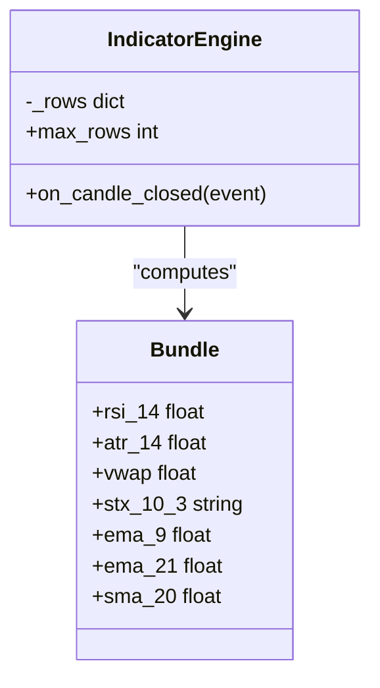
```mermaid
classDiagram
class IndicatorEngine {
+on_candle_closed(event)
-_rows dict
+max_rows int
}
class Bundle {
+rsi_14 float
+atr_14 float
+vwap float
+stx_10_3 string
+ema_9 float
+ema_21 float
+sma_20 float
}
IndicatorEngine --> Bundle : "computes"
```

**Diagram sources**
- [test_indicators.py:129-149](file://tests/test_indicators.py#L129-L149)

**Section sources**
- [test_indicators.py:23-127](file://tests/test_indicators.py#L23-L127)
- [test_indicators.py:129-149](file://tests/test_indicators.py#L129-L149)

### Order Routing Logic and Portfolio Calculations
- Portfolio and Account objects support PnL, market value, holdings lookup, and broker-backed initialization.
- Tests verify position netting, balance changes, and canonical events emitted during updates.

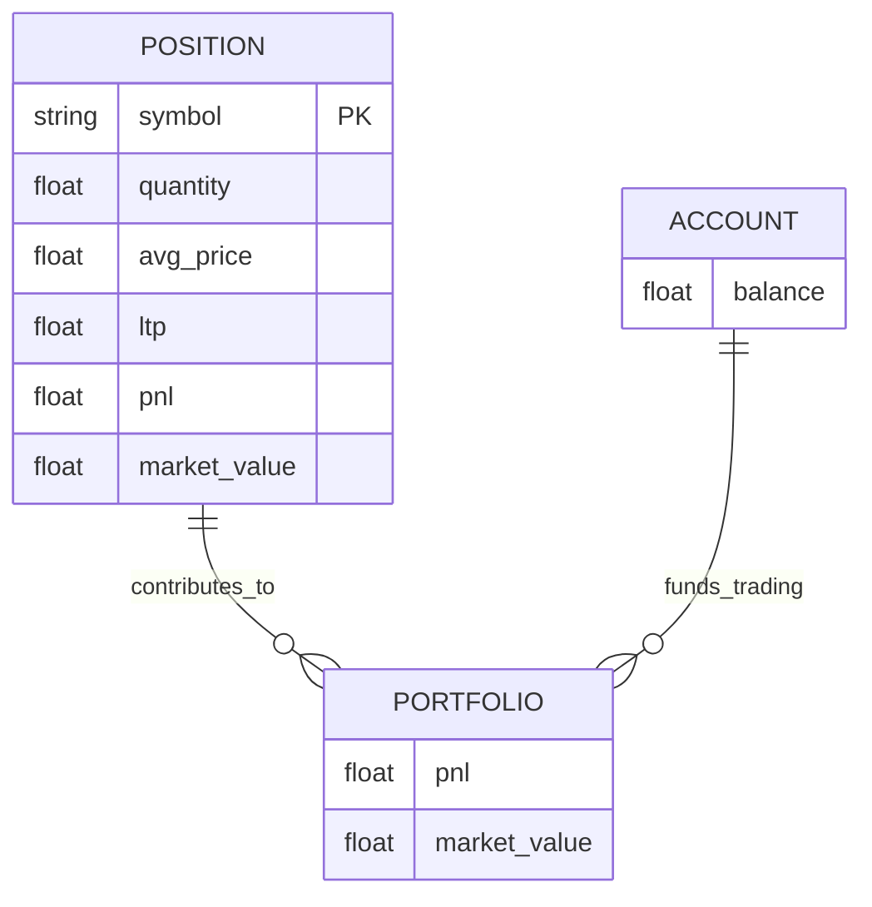
```mermaid
erDiagram
POSITION {
string symbol PK
float quantity
float avg_price
float ltp
float pnl
float market_value
}
ACCOUNT {
float balance
}
PORTFOLIO {
float pnl
float market_value
}
POSITION ||--o{ PORTFOLIO : contributes_to
ACCOUNT ||--o{ PORTFOLIO : funds_trading
```

**Diagram sources**
- [test_portfolio_account.py:9-56](file://tests/test_portfolio_account.py#L9-L56)

**Section sources**
- [test_portfolio_account.py:9-56](file://tests/test_portfolio_account.py#L9-L56)

### Strategy Runner and Multi-Strategy Isolation
- StrategyRunner manages multiple strategies with unique names, hot detach/enable/disable, per-strategy risk limits, and global risk pause management.
- Verifies that per-strategy caps do not interfere across strategies and that release restores global risk handlers.

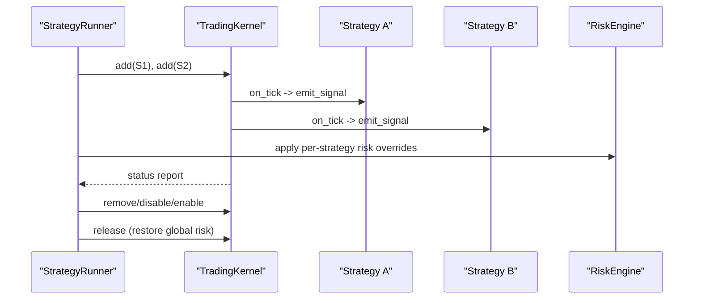
```mermaid
sequenceDiagram
participant Runner as "StrategyRunner"
participant Kernel as "TradingKernel"
participant S1 as "Strategy A"
participant S2 as "Strategy B"
participant Risk as "RiskEngine"
Runner->>Kernel : add(S1), add(S2)
Kernel->>S1 : on_tick -> emit_signal
Kernel->>S2 : on_tick -> emit_signal
Runner->>Risk : apply per-strategy risk overrides
Kernel-->>Runner : status report
Runner->>Kernel : remove/disable/enable
Runner->>Kernel : release (restore global risk)
```

**Diagram sources**
- [test_strategy_runner.py:72-107](file://tests/test_strategy_runner.py#L72-L107)
- [test_strategy_runner.py:109-175](file://tests/test_strategy_runner.py#L109-L175)

**Section sources**
- [test_strategy_runner.py:72-107](file://tests/test_strategy_runner.py#L72-L107)
- [test_strategy_runner.py:109-175](file://tests/test_strategy_runner.py#L109-L175)

### Kernel Engines: Market, Candle, Indicator
- MarketEngine projects ticks/quotes/depth onto instruments and stream state.
- CandleEngine closes candles on bucket transitions and flushes partials.
- IndicatorEngine publishes bundles after sufficient candles and updates instrument analytics.

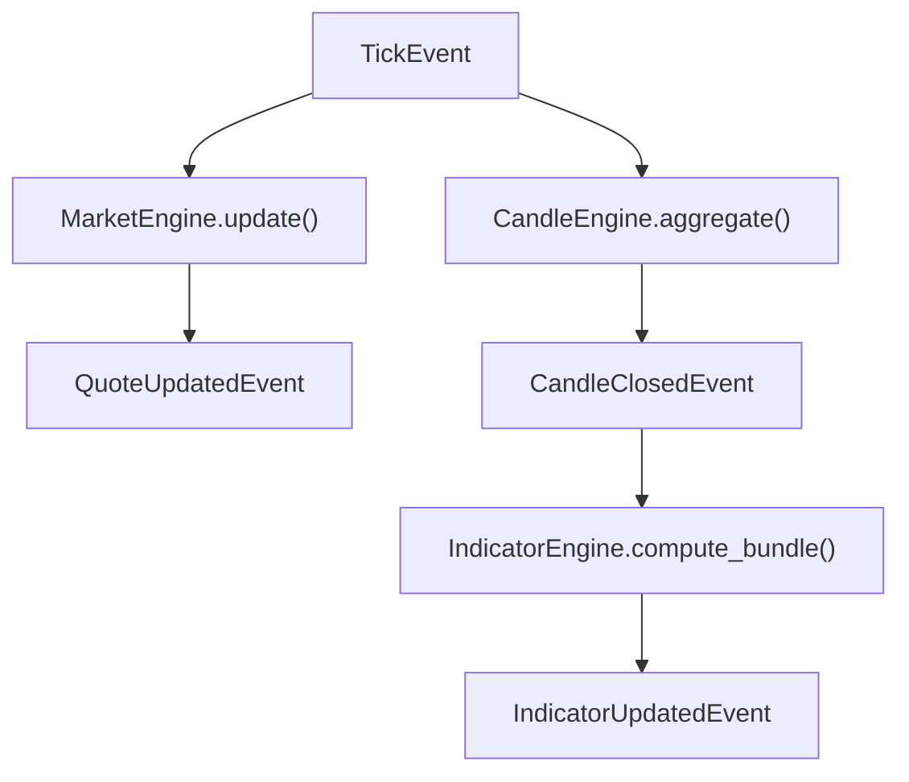
```mermaid
flowchart TD
Tick["TickEvent"] --> Market["MarketEngine.update()"]
Market --> QuoteUpdate["QuoteUpdatedEvent"]
Tick --> Candle["CandleEngine.aggregate()"]
Candle --> Close["CandleClosedEvent"]
Close --> Indicator["IndicatorEngine.compute_bundle()"]
Indicator --> Bundle["IndicatorUpdatedEvent"]
```

**Diagram sources**
- [test_kernel_engines.py:27-102](file://tests/test_kernel_engines.py#L27-L102)

**Section sources**
- [test_kernel_engines.py:27-102](file://tests/test_kernel_engines.py#L27-L102)

## Depth Retry Behavior and Frame Timeout Handling

**Updated** Added comprehensive testing for depth retry behavior with frame timeout handling and proper rate limit propagation. The new tests ensure that websocket snapshot timeouts are properly handled and that rate limit exceptions are never swallowed.

### Depth Snapshot Retry Logic
The depth retrieval system implements sophisticated retry logic for handling websocket snapshot timeouts and transient failures:

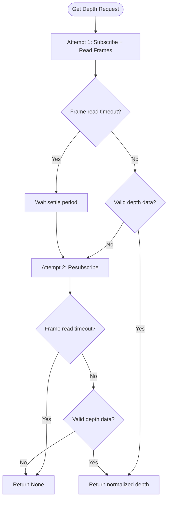
```mermaid
flowchart TD
Start(["Get Depth Request"]) --> Attempt1["Attempt 1: Subscribe + Read Frames"]
Attempt1 --> TimeoutCheck{"Frame read timeout?"}
TimeoutCheck --> |Yes| Settle["Wait settle period"]
TimeoutCheck --> |No| SuccessCheck{"Valid depth data?"}
SuccessCheck --> |Yes| ReturnDepth["Return normalized depth"]
SuccessCheck --> |No| Attempt2["Attempt 2: Resubscribe"]
Settle --> Attempt2
Attempt2 --> TimeoutCheck2{"Frame read timeout?"}
TimeoutCheck2 --> |Yes| Fail["Return None"]
TimeoutCheck2 --> |No| SuccessCheck2{"Valid depth data?"}
SuccessCheck2 --> |Yes| ReturnDepth
SuccessCheck2 --> |No| Fail
```

**Diagram sources**
- [test_dhan_broker.py:316-338](file://tests/test_dhan_broker.py#L316-L338)
- [dhan_transport.py:183-244](file://ntrade/brokers/dhan_transport.py#L183-L244)

### Key Testing Scenarios

#### Frame Timeout Handling
Tests verify that hung websocket frame reads are properly detected and retried:

- `test_get_depth_retries_on_frame_timeout_then_succeeds`: Validates that frame timeouts trigger retries and subsequent attempts succeed
- `test_get_depth_empty_snapshot_then_succeeds`: Ensures empty snapshots trigger resubscription and retry logic
- `test_get_depth_missing_client_falls_back`: Tests fallback behavior when exact client key is missing

#### Rate Limit Propagation in Depth Operations
Critical pattern ensuring rate limit exceptions are never masked:

- `test_get_depth_rate_limited_not_retried`: Verifies DH-904 exceptions propagate immediately without retry loops
- `test_get_depth_timeout_rate_limited_not_swallowed`: Ensures rate limits raised during frame reads surface as RateLimited exceptions

**Section sources**
- [test_dhan_broker.py:316-370](file://tests/test_dhan_broker.py#L316-L370)
- [dhan_transport.py:183-244](file://ntrade/brokers/dhan_transport.py#L183-L244)

## LTP Failure Envelope Rejection

**Updated** Added comprehensive testing for LTP failure envelope rejection to prevent stale or seed values from being reported as valid prices. The tests cover the Tradehull SDK's failure envelope behavior and ensure proper error propagation.

### LTP Failure Envelope Detection
The LTP fetching system must handle the Tradehull SDK's failure envelopes properly:

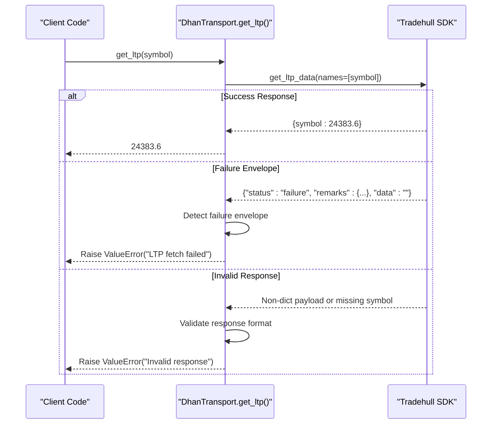
```mermaid
sequenceDiagram
participant Client as "Client Code"
participant Transport as "DhanTransport.get_ltp()"
participant TSL as "Tradehull SDK"
Client->>Transport : get_ltp(symbol)
Transport->>TSL : get_ltp_data(names=[symbol])
alt Success Response
TSL-->>Transport : {symbol : 24383.6}
Transport-->>Client : 24383.6
else Failure Envelope
TSL-->>Transport : {"status" : "failure", "remarks" : {...}, "data" : ""}
Transport->>Transport : Detect failure envelope
Transport-->>Client : Raise ValueError("LTP fetch failed")
else Invalid Response
TSL-->>Transport : Non-dict payload or missing symbol
Transport->>Transport : Validate response format
Transport-->>Client : Raise ValueError("Invalid response")
end
```

**Diagram sources**
- [test_dhan_broker.py:94-108](file://tests/test_dhan_broker.py#L94-L108)
- [dhan_transport.py:130-157](file://ntrade/brokers/dhan_transport.py#L130-L157)

### Key Testing Scenarios

#### Failure Envelope Rejection
Tests ensure that Tradehull SDK failure envelopes are properly detected and rejected:

- `test_get_ltp_rejects_failure_envelope`: Validates that failure envelopes raise ValueError instead of returning stale values
- `test_get_quote_raises_on_failure`: Ensures complete quote fetching fails on LTP errors
- `test_get_quote_retries_flaky_ltp`: Tests retry logic for intermittent None responses

#### Response Validation
Comprehensive validation of LTP response formats:

- Non-dict payloads are rejected as invalid
- Missing symbol keys in response dictionaries are caught
- Zero or negative LTP values are treated as failures

**Section sources**
- [test_dhan_broker.py:94-108](file://tests/test_dhan_broker.py#L94-L108)
- [test_dhan_broker.py:372-386](file://tests/test_dhan_broker.py#L372-L386)
- [dhan_transport.py:130-157](file://ntrade/brokers/dhan_transport.py#L130-L157)

## Rate Limit Propagation Testing

**Updated** Added comprehensive testing for rate limit propagation across all broker methods to ensure DH-904 errors are never silently swallowed. The tests cover order operations, market data requests, and utility functions.

### Universal Rate Limit Propagation Pattern
All broker methods must propagate RateLimited exceptions rather than masking them:

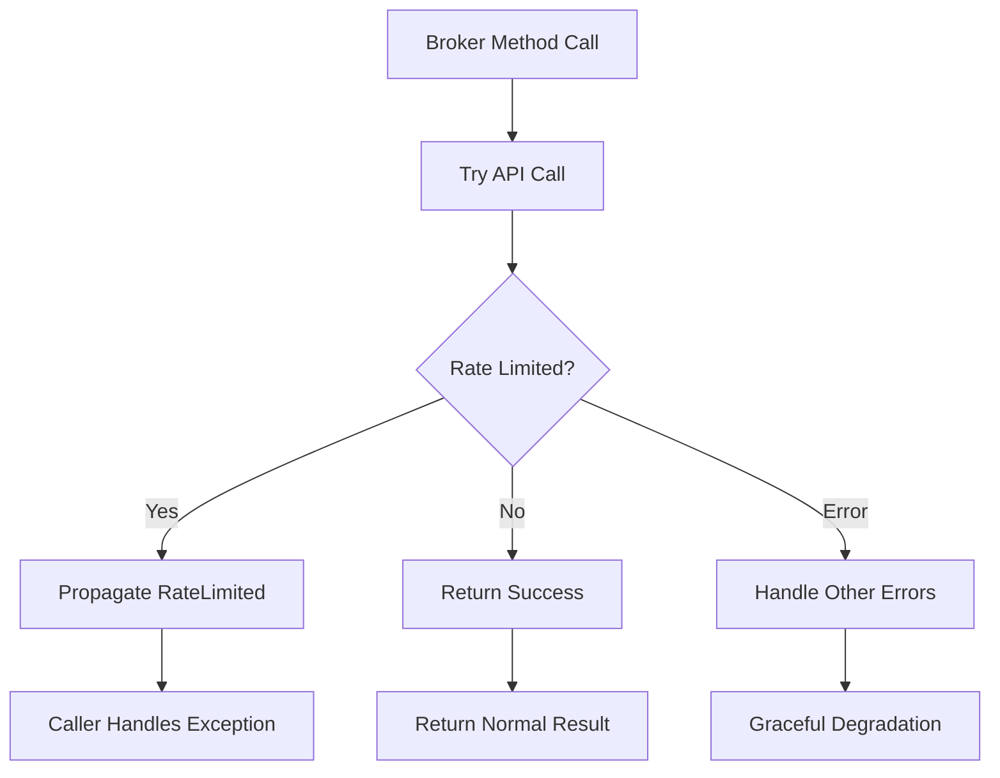
```mermaid
flowchart TD
MethodCall["Broker Method Call"] --> TryAPI["Try API Call"]
TryAPI --> RateLimitCheck{"Rate Limited?"}
RateLimitCheck --> |Yes| Propagate["Propagate RateLimited"]
RateLimitCheck --> |No| Success["Return Success"]
RateLimitCheck --> |Error| HandleError["Handle Other Errors"]
Propagate --> Caller["Caller Handles Exception"]
Success --> Result["Return Normal Result"]
HandleError --> Degrade["Graceful Degradation"]
```

**Diagram sources**
- [test_dhan_broker.py:720-731](file://tests/test_dhan_broker.py#L720-L731)
- [test_dhan_broker.py:764-771](file://tests/test_dhan_broker.py#L764-L771)
- [dhan.py:360-389](file://ntrade/brokers/dhan.py#L360-L389)

### Comprehensive Coverage Areas

#### Order Operations
- `test_order_status_rate_limited_not_swallowed`: Order status polling propagates rate limits
- `test_option_chain_rate_limited_does_not_retry_expiries`: Option chain requests don't retry on rate limits
- `test_place_order_rejection_propagates`: Order placement rejections are properly handled

#### Market Data Operations  
- `test_expiry_list_propagates_rate_limited`: Expiry list requests propagate rate limits
- `test_orderbook_propagates_rate_limited`: Order book requests propagate rate limits
- `test_trade_book_propagates_rate_limited`: Trade book requests propagate rate limits
- `test_lot_size_propagates_rate_limited`: Lot size requests propagate rate limits

#### Utility Functions
- `test_instrument_metadata_propagates_rate_limited`: Instrument metadata requests propagate rate limits
- `test_get_executed_price_propagates_rate_limited`: Price retrieval propagates rate limits
- `test_get_executed_price_and_time_propagates_rate_limited`: Price+time retrieval propagates rate limits

**Section sources**
- [test_dhan_broker.py:720-830](file://tests/test_dhan_broker.py#L720-L830)
- [dhan.py:360-559](file://ntrade/brokers/dhan.py#L360-L559)

## Failed Quote Fetch State Preservation

**Updated** Added critical regression testing to ensure failed quote fetches don't stamp refresh timestamps, preventing stale data from being reported as fresh. This addresses a serious issue where dead brokers could incorrectly report stale quotes as current.

### State Preservation Logic
When quote fetches fail, the system must preserve existing state and not update refresh timestamps:

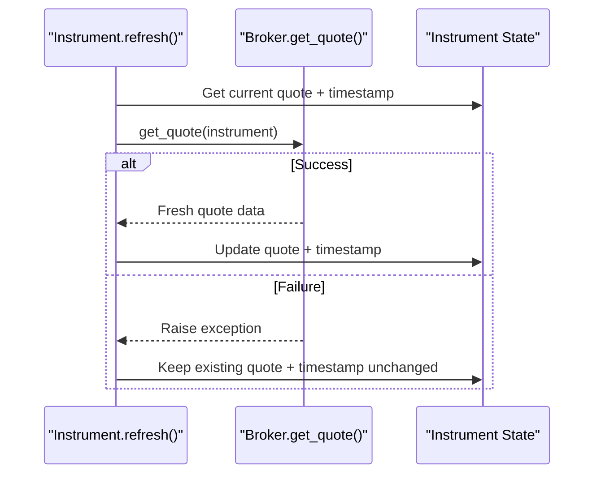
```mermaid
sequenceDiagram
participant Instrument as "Instrument.refresh()"
participant Broker as "Broker.get_quote()"
participant State as "Instrument State"
Instrument->>State : Get current quote + timestamp
Instrument->>Broker : get_quote(instrument)
alt Success
Broker-->>Instrument : Fresh quote data
Instrument->>State : Update quote + timestamp
else Failure
Broker-->>Instrument : Raise exception
Instrument->>State : Keep existing quote + timestamp unchanged
end
```

**Diagram sources**
- [test_instruments.py:42-67](file://tests/test_instruments.py#L42-L67)

### Key Testing Scenario

#### Stale Data Prevention
The critical regression test ensures failed refreshes don't corrupt state:

- `test_refresh_keeps_stale_on_failure`: Validates that failed quote fetches preserve existing quote data and don't update refresh timestamps
- Ensures `is_stale()` doesn't return false for genuinely stale data
- Prevents dead brokers from appearing healthy by maintaining accurate freshness indicators

**Section sources**
- [test_instruments.py:42-67](file://tests/test_instruments.py#L42-L67)

## Retry Policy and Exception Handling

**Updated** Added comprehensive testing for retry policy behavior with specific focus on rate-limited exceptions and transient error handling. The tests ensure proper retry logic for different types of failures.

### Retry Policy Configuration
The retry system uses configurable policies for different types of failures:

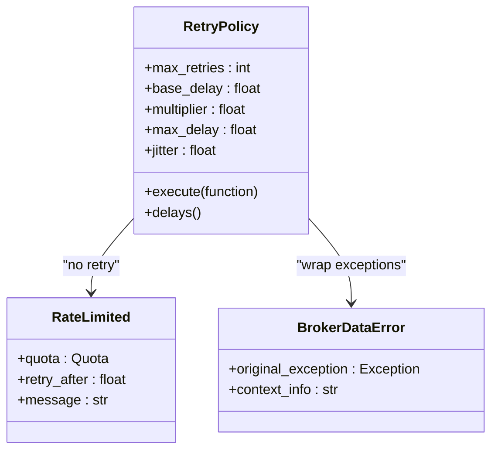
```mermaid
classDiagram
class RetryPolicy {
+max_retries : int
+base_delay : float
+multiplier : float
+max_delay : float
+jitter : float
+execute(function)
+delays()
}
class RateLimited {
+quota : Quota
+retry_after : float
+message : str
}
class BrokerDataError {
+original_exception : Exception
+context_info : str
}
RetryPolicy --> RateLimited : "no retry"
RetryPolicy --> BrokerDataError : "wrap exceptions"
```

**Diagram sources**
- [test_retry.py:67-91](file://tests/test_retry.py#L67-L91)
- [test_retry.py:118-175](file://tests/test_retry.py#L118-L175)

### Key Testing Scenarios

#### Rate Limit Handling
Tests ensure rate-limited exceptions are never retried:

- `test_does_not_retry_rate_limited`: RateLimited exceptions are immediately re-raised
- `test_does_not_retry_dh904_shaped_error`: DH-904 text patterns also prevent retries
- `test_retries_transient_errors`: Network errors and other transient failures still retry

#### Retry Policy Configuration
Comprehensive testing of retry policy parameters:

- Exponential backoff calculation with proper delay sequences
- Maximum delay capping to prevent excessive waits
- Jitter implementation within specified ranges
- Thread safety for concurrent access

#### Integration Testing
Tests verify retry policy integration with transport layers:

- Default policy configuration in DhanTransport
- Custom policy acceptance and usage
- Proper sleep timing between retry attempts

**Section sources**
- [test_retry.py:67-175](file://tests/test_retry.py#L67-L175)
- [test_retry.py:225-266](file://tests/test_retry.py#L225-L266)

## Dependency Analysis
- TradingKernel depends on engines (Market, Candle, Indicator, Risk, Order, Portfolio) and optional broker adapter.
- ReplayEngine depends on EventStore and ReplayClock; BacktestSimulator depends on FillPolicy and strategy callbacks.
- StrategyRunner depends on TradingKernel and RiskEngine; isolates per-strategy risk while managing global risk pause.
- **New**: Depth retry testing depends on comprehensive websocket timeout handling and retry logic.
- **New**: LTP failure testing depends on Tradehull SDK envelope detection and response validation.
- **New**: Rate limit propagation testing depends on consistent exception handling across all broker methods.
- **New**: State preservation testing depends on proper error handling in quote refresh operations.

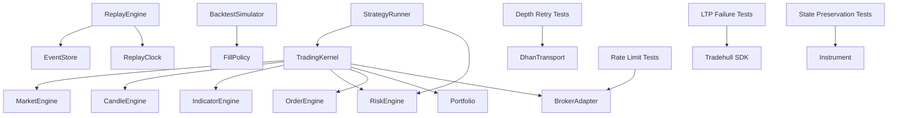
```mermaid
graph TB
Kernel["TradingKernel"] --> MarketEng["MarketEngine"]
Kernel --> CandleEng["CandleEngine"]
Kernel --> IndicatorEng["IndicatorEngine"]
Kernel --> RiskEng["RiskEngine"]
Kernel --> OrderEng["OrderEngine"]
Kernel --> Portfolio["Portfolio"]
Kernel --> Broker["BrokerAdapter"]
Replay["ReplayEngine"] --> Store["EventStore"]
Replay --> Clock["ReplayClock"]
Backtest["BacktestSimulator"] --> Fill["FillPolicy"]
Runner["StrategyRunner"] --> Kernel
Runner --> RiskEng
DepthTests["Depth Retry Tests"] --> Transport["DhanTransport"]
LTPTests["LTP Failure Tests"] --> SDK["Tradehull SDK"]
RateLimitTests["Rate Limit Tests"] --> Broker
StateTests["State Preservation Tests"] --> Instrument["Instrument"]
```

**Diagram sources**
- [test_engine_pipeline.py:49-57](file://tests/test_engine_pipeline.py#L49-L57)
- [test_replay_backtest.py:72-99](file://tests/test_replay_backtest.py#L72-L99)
- [test_strategy_runner.py:72-107](file://tests/test_strategy_runner.py#L72-L107)
- [test_dhan_broker.py:316-370](file://tests/test_dhan_broker.py#L316-L370)
- [test_instruments.py:42-67](file://tests/test_instruments.py#L42-L67)

**Section sources**
- [test_engine_pipeline.py:49-57](file://tests/test_engine_pipeline.py#L49-L57)
- [test_replay_backtest.py:72-99](file://tests/test_replay_backtest.py#L72-L99)
- [test_strategy_runner.py:72-107](file://tests/test_strategy_runner.py#L72-L107)
- [test_dhan_broker.py:316-370](file://tests/test_dhan_broker.py#L316-L370)
- [test_instruments.py:42-67](file://tests/test_instruments.py#L42-L67)

## Performance Considerations
- Use measure_tick_throughput to quantify ticks/sec and wall time; integrate into CI to detect regressions.
- Increase n_ticks for load testing; monitor memory usage of IndicatorEngine via max_rows.
- Prefer ReplayClock and deterministic feeds to avoid flaky timing-dependent tests.
- **New**: Depth retry tests use short timeouts (0.05s) to validate retry behavior without long delays.
- **New**: Rate limit propagation tests ensure no unnecessary retry loops that burn quota.
- **New**: State preservation tests prevent performance degradation from repeated failed refresh attempts.

## Troubleshooting Guide
Common issues and resolutions:
- Stale orders not evicted: ensure BrokerExecution.poll() runs enough cycles to trigger eviction on repeated failures.
- Partial fills double-counted: verify poll() emits delta quantities and tracks open orders correctly.
- Unknown event types in JSONL: EventStore silently skips unknown __type__ entries; ensure consistent serialization.
- Non-numeric avg_price from broker: fallback to intent price; robust parsing prevents poll loop crashes.
- Position sync transient failures: ensure sync_positions() preserves local state and does not zero balance on errors.
- **New**: Rate limited exceptions being swallowed: verify executed_price() methods properly propagate RateLimited exceptions instead of returning 0.0.
- **New**: Depth snapshot timeouts causing hangs: ensure frame read timeouts are properly configured and retried.
- **New**: LTP failure envelopes returning stale values: verify failure envelope detection and proper error raising.
- **New**: Failed quote refreshes updating timestamps: ensure refresh() only updates timestamps on successful fetches.

**Section sources**
- [test_broker_executor.py:13-39](file://tests/test_broker_executor.py#L13-L39)
- [test_live_execution.py:262-377](file://tests/test_live_execution.py#L262-L377)
- [test_replay_backtest.py:243-267](file://tests/test_replay_backtest.py#L243-L267)
- [test_dhan_broker.py:316-370](file://tests/test_dhan_broker.py#L316-L370)
- [test_instruments.py:42-67](file://tests/test_instruments.py#L42-L67)

## Conclusion
The nTrade test suite demonstrates robust methodologies for validating trading pipelines under both simulated and live conditions. By leveraging synthetic feeds, replay engines, and mocked brokers, tests achieve deterministic, repeatable outcomes. The inclusion of risk breakers, strategy isolation, performance benchmarks, comprehensive depth retry behavior testing, LTP failure envelope rejection, rate limit propagation testing, and failed quote fetch state preservation ensures reliability, safety, and scalability. These enhanced testing patterns provide confidence in error handling, data integrity, and system resilience under various failure scenarios.

## Appendices
- Best practices for test organization: group by feature, use fixtures for common kernels and clocks, isolate external dependencies via mocks/stubs.
- Continuous integration setup: run pytest suites, capture benchmark outputs, fail on throughput regressions, and archive artifacts.
- **New**: Depth retry testing patterns for ensuring proper websocket timeout handling and retry logic.
- **New**: LTP failure envelope testing patterns for preventing stale data from being reported as valid.
- **New**: Rate limit propagation testing patterns for ensuring consistent error handling across all broker methods.
- **New**: State preservation testing patterns for maintaining data integrity during failed operations.