# Unit Testing Examples

<cite>
**Referenced Files in This Document**
- [test_domain_types.py](file://tests/test_domain_types.py)
- [test_instruments.py](file://tests/test_instruments.py)
- [test_indicators.py](file://tests/test_indicators.py)
- [test_orders.py](file://tests/test_orders.py)
- [test_portfolio_account.py](file://tests/test_portfolio_account.py)
- [test_ema_cross_strategy.py](file://tests/test_ema_cross_strategy.py)
- [test_brokers.py](file://tests/test_brokers.py)
- [test_event_bus_threads.py](file://tests/test_event_bus_threads.py)
- [test_risk_breakers.py](file://tests/test_risk_breakers.py)
- [test_engine_pipeline.py](file://tests/test_engine_pipeline.py)
- [test_event_bus_clock.py](file://tests/test_event_bus_clock.py)
- [test_kernel_resilient.py](file://tests/test_kernel_resilient.py)
- [test_sources.py](file://tests/test_sources.py)
- [test_dhan_feed.py](file://tests/test_dhan_feed.py)
- [test_replay_backtest.py](file://tests/test_replay_backtest.py)
- [test_dhan_broker.py](file://tests/test_dhan_broker.py)
- [test_live_execution.py](file://tests/test_live_execution.py)
- [test_kill_switch_wiring.py](file://tests/test_kill_switch_wiring.py)
</cite>

## Update Summary
**Changes Made**
- Enhanced the "Mocking Techniques for External Dependencies" section with advanced broker simulation patterns using make_broker() helper function
- Added comprehensive error condition testing examples demonstrating sophisticated exception handling validation
- Updated diagrams to reflect new mocking patterns and error handling flows
- Expanded coverage of DhanBroker testing with failure envelope handling and rate limiting scenarios
- Added new sections on zero-parity testing between simulated and live execution paths

## Table of Contents
1. Introduction
2. Project Structure
3. Core Components
4. Architecture Overview
5. Detailed Component Analysis
6. Dependency Analysis
7. Performance Considerations
8. Troubleshooting Guide
9. Conclusion

## Introduction
This document provides comprehensive unit testing examples for nTrade components. It covers how to write tests for custom strategies, broker adapters, risk rules, and domain objects. It demonstrates testing instrument creation, order lifecycle management, indicator calculations, and portfolio state changes. It also includes patterns for mocking external dependencies (market data feeds and broker APIs), testing edge cases and boundary scenarios, event-driven components using the event bus history, asynchronous operations, and thread-safe components. **Updated**: Enhanced with advanced mocking patterns for broker simulation and error condition testing, demonstrating sophisticated use of make_broker() helper function and proper exception handling validation for trading system reliability.

## Project Structure
The repository organizes code into layered modules:
- Domain models: instruments, orders, portfolio, analytics, market primitives
- Engines: strategy, indicator, candle, market, order, portfolio, risk
- Execution: broker executor, router, simulator, costs, retry
- Kernel: event bus, clock, session, resilient kernel
- Sources: market feed sources (synthetic, Dhan)
- Replay and backtest: replay engine, simulator, fills
- Storage: event store with JSONL persistence
- Tests: extensive pytest suite covering all layers

```mermaid
graph TB
subgraph "Tests"
T1["test_domain_types.py"]
T2["test_instruments.py"]
T3["test_indicators.py"]
T4["test_orders.py"]
T5["test_portfolio_account.py"]
T6["test_ema_cross_strategy.py"]
T7["test_brokers.py"]
T8["test_event_bus_threads.py"]
T9["test_risk_breakers.py"]
T10["test_engine_pipeline.py"]
T11["test_event_bus_clock.py"]
T12["test_kernel_resilient.py"]
T13["test_sources.py"]
T14["test_dhan_feed.py"]
T15["test_replay_backtest.py"]
T16["test_dhan_broker.py"]
T17["test_live_execution.py"]
T18["test_kill_switch_wiring.py"]
end
subgraph "Kernel"
K1["kernel/event_bus.py"]
K2["kernel/clock.py"]
K3["kernel/session.py"]
K4["kernel/resilient.py"]
end
subgraph "Engines"
E1["engines/strategy_engine.py"]
E2["engines/risk_engine.py"]
E3["engines/order_engine.py"]
E4["engines/portfolio_engine.py"]
E5["engines/indicator_engine.py"]
end
subgraph "Domain"
D1["domain/instruments/*"]
D2["domain/orders/*"]
D3["domain/portfolio.py"]
D4["domain/analytics/*"]
D5["domain/market/*"]
end
subgraph "Execution"
X1["execution/broker_executor.py"]
X2["execution/router.py"]
X3["execution/simulator.py"]
X4["execution/costs.py"]
X5["execution/retry.py"]
end
subgraph "Sources"
S1["sources/market_feed.py"]
S2["sources/dhan_feed.py"]
end
subgraph "Replay/Backtest"
R1["replay/replay_engine.py"]
R2["backtest/simulator.py"]
R3["backtest/fills.py"]
end
subgraph "Storage"
ST1["storage/event_store.py"]
end
T1 --> D2
T2 --> D1
T3 --> D4
T4 --> D2
T5 --> D3
T6 --> E1
T7 --> D1
T8 --> K1
T9 --> E2
T10 --> E1
T11 --> K1
T12 --> K4
T13 --> S1
T14 --> S2
T15 --> R1
T16 --> X1
T17 --> X1
T18 --> E2
```

**Diagram sources**
- [test_engine_pipeline.py:1-137](file://tests/test_engine_pipeline.py#L1-L137)
- [test_event_bus_clock.py:1-128](file://tests/test_event_bus_clock.py#L1-L128)
- [test_kernel_resilient.py:1-396](file://tests/test_kernel_resilient.py#L1-L396)
- [test_replay_backtest.py:1-267](file://tests/test_replay_backtest.py#L1-L267)
- [test_dhan_broker.py:1-758](file://tests/test_dhan_broker.py#L1-L758)
- [test_live_execution.py:1-494](file://tests/test_live_execution.py#L1-L494)
- [test_kill_switch_wiring.py:1-58](file://tests/test_kill_switch_wiring.py#L1-L58)

**Section sources**
- [test_engine_pipeline.py:1-137](file://tests/test_engine_pipeline.py#L1-L137)
- [test_event_bus_clock.py:1-128](file://tests/test_event_bus_clock.py#L1-L128)
- [test_kernel_resilient.py:1-396](file://tests/test_kernel_resilient.py#L1-L396)
- [test_replay_backtest.py:1-267](file://tests/test_replay_backtest.py#L1-L267)
- [test_dhan_broker.py:1-758](file://tests/test_dhan_broker.py#L1-L758)
- [test_live_execution.py:1-494](file://tests/test_live_execution.py#L1-L494)
- [test_kill_switch_wiring.py:1-58](file://tests/test_kill_switch_wiring.py#L1-L58)

## Core Components
Key areas covered by tests:
- Domain types: OrderBook, TradeBook, IVSurface, GreeksTable
- Instruments: Equity, Index, Commodity, Spot, Future, Option
- Indicators: RSI, ATR, VWAP, Supertrend, EMA/SMA bundles
- Orders: limit/market/stop orders, side/status/type validation
- Portfolio/Account: positions, holdings, balance updates
- Event Bus: publish/subscribe, history, isolation, threading
- Risk Engine: daily loss, drawdown, price deviation, allowlist
- Strategy Engine: signal emission, golden/death cross logic
- Broker layer: PaperBroker capabilities, option chain, subscription multiplexing
- Sources: SimulatedFeedSource, DhanMarketFeedSource error/close handling
- Replay/Backtest: EventStore, ReplayEngine, zero-parity, fill policies
- Resilient Kernel: crash recovery, partial-fill deltas, idempotency
- **Updated**: Advanced broker mocking with make_broker() helper for DhanBroker simulation and comprehensive error condition testing

**Section sources**
- [test_domain_types.py:1-239](file://tests/test_domain_types.py#L1-L239)
- [test_instruments.py:1-165](file://tests/test_instruments.py#L1-L165)
- [test_indicators.py:1-151](file://tests/test_indicators.py#L1-L151)
- [test_orders.py:1-90](file://tests/test_orders.py#L1-L90)
- [test_portfolio_account.py:1-56](file://tests/test_portfolio_account.py#L1-L56)
- [test_event_bus_threads.py:1-63](file://tests/test_event_bus_threads.py#L1-L63)
- [test_risk_breakers.py:1-111](file://tests/test_risk_breakers.py#L1-L111)
- [test_ema_cross_strategy.py:1-89](file://tests/test_ema_cross_strategy.py#L1-L89)
- [test_brokers.py:1-107](file://tests/test_brokers.py#L1-L107)
- [test_sources.py:1-63](file://tests/test_sources.py#L1-L63)
- [test_dhan_feed.py:1-31](file://tests/test_dhan_feed.py#L1-L31)
- [test_replay_backtest.py:1-267](file://tests/test_replay_backtest.py#L1-L267)
- [test_kernel_resilient.py:1-396](file://tests/test_kernel_resilient.py#L1-L396)
- [test_dhan_broker.py:1-758](file://tests/test_dhan_broker.py#L1-L758)
- [test_live_execution.py:1-494](file://tests/test_live_execution.py#L1-L494)

## Architecture Overview
End-to-end flow tested across the kernel pipeline:
- Strategy emits signals on ticks or candles
- Risk engine screens signals (allowlist, quantity limits, price deviation)
- Order engine creates intents and submits via broker executor
- Execution produces fills that update portfolio and account
- Event bus records all events for inspection and replay

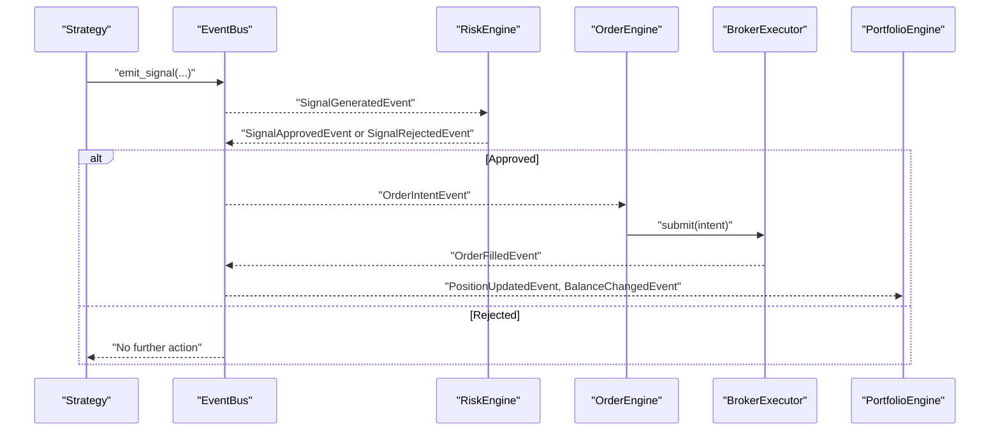

**Diagram sources**
- [test_engine_pipeline.py:16-79](file://tests/test_engine_pipeline.py#L16-L79)
- [test_risk_breakers.py:30-63](file://tests/test_risk_breakers.py#L30-L63)

**Section sources**
- [test_engine_pipeline.py:1-137](file://tests/test_engine_pipeline.py#L1-L137)
- [test_risk_breakers.py:1-111](file://tests/test_risk_breakers.py#L1-L111)

## Detailed Component Analysis

### Custom Strategies
Patterns demonstrated:
- Register a strategy with TradingKernel
- Emit signals based on indicators or ticks
- Validate fills and position state through event bus history
- Test warm-up behavior and non-stacking same-direction trades

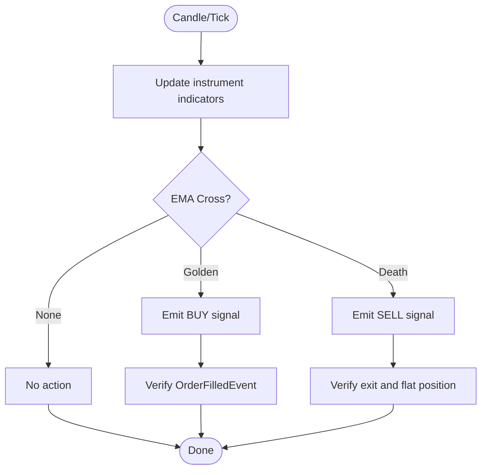

**Diagram sources**
- [test_ema_cross_strategy.py:14-54](file://tests/test_ema_cross_strategy.py#L14-L54)

**Section sources**
- [test_ema_cross_strategy.py:1-89](file://tests/test_ema_cross_strategy.py#L1-L89)

### Broker Adapters
Patterns demonstrated:
- Use PaperBroker for deterministic quotes, depth, and order book
- Seed historical data and validate timeframes
- Capability extension pattern with decorators
- Subscription multiplexing and disconnect notifications
- Option chain generation and typed returns

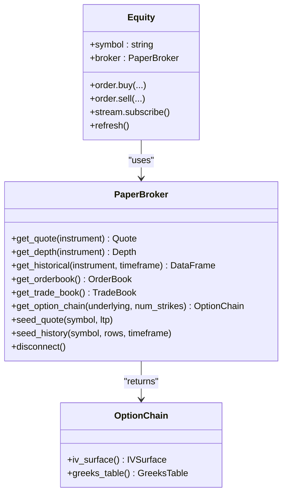

**Diagram sources**
- [test_brokers.py:10-107](file://tests/test_brokers.py#L10-L107)
- [test_domain_types.py:119-153](file://tests/test_domain_types.py#L119-L153)

**Section sources**
- [test_brokers.py:1-107](file://tests/test_brokers.py#L1-L107)
- [test_domain_types.py:1-239](file://tests/test_domain_types.py#L1-L239)

### Risk Rules
Patterns demonstrated:
- Daily loss breaker halts trading and rejects subsequent signals
- Drawdown breaker halts when equity drops below threshold
- Price deviation rejects unverifiable prices without halting
- Allowlist blocks symbols not permitted
- Resume functionality emits events and restores state

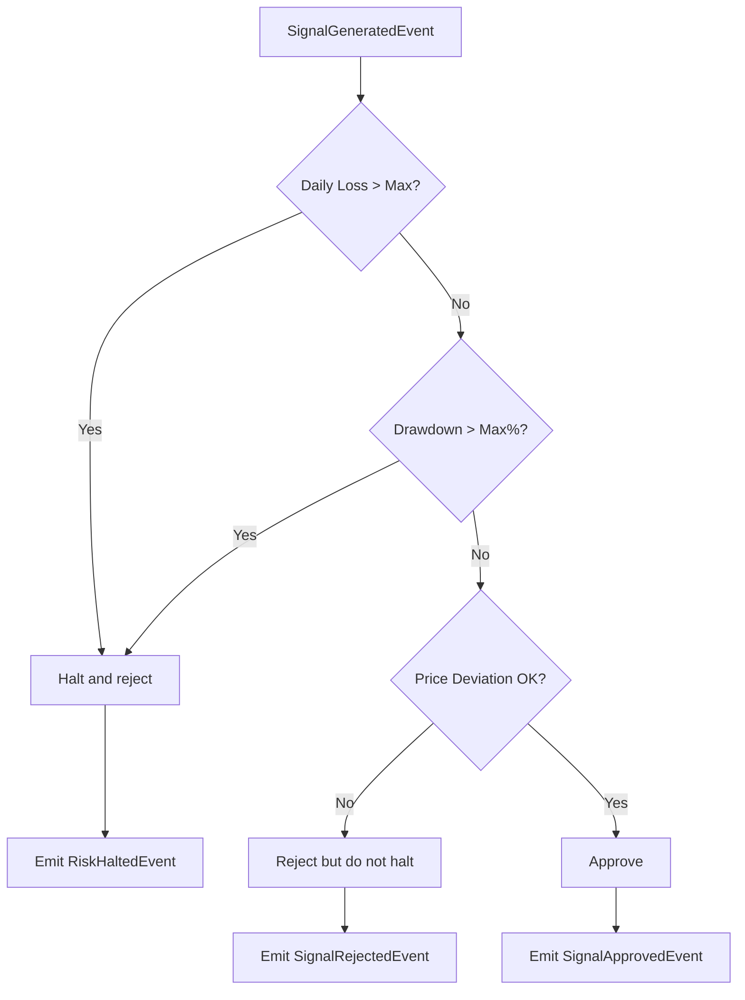

**Diagram sources**
- [test_risk_breakers.py:30-111](file://tests/test_risk_breakers.py#L30-L111)

**Section sources**
- [test_risk_breakers.py:1-111](file://tests/test_risk_breakers.py#L1-L111)

### Domain Objects
Patterns demonstrated:
- OrderBook and TradeBook immutability and filtering
- IVSurface and GreeksTable delegation to pandas DataFrames
- Instrument hierarchy defaults and behaviors
- History caching per timeframe and snapshot serialization
- Option type validation and future basis calculation

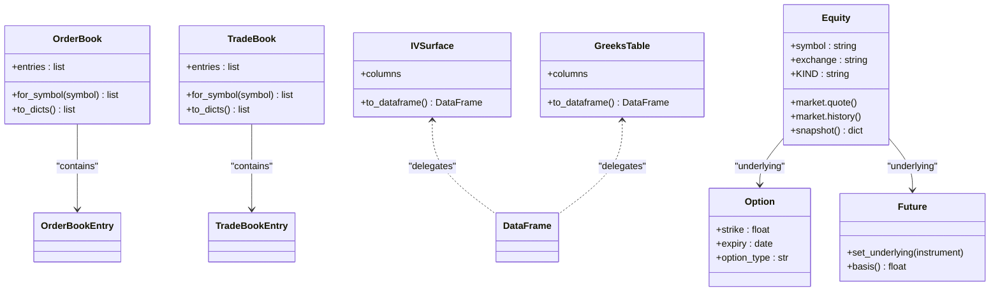

**Diagram sources**
- [test_domain_types.py:26-116](file://tests/test_domain_types.py#L26-L116)
- [test_instruments.py:11-165](file://tests/test_instruments.py#L11-L165)

**Section sources**
- [test_domain_types.py:1-239](file://tests/test_domain_types.py#L1-L239)
- [test_instruments.py:1-165](file://tests/test_instruments.py#L1-L165)

### Indicator Calculations
Patterns demonstrated:
- Compute RSI bounds and trend direction
- ATR positivity and VWAP range checks
- Supertrend up/down signals on clean trends
- Bundle computation with default/custom periods
- IndicatorEngine row limiting behavior

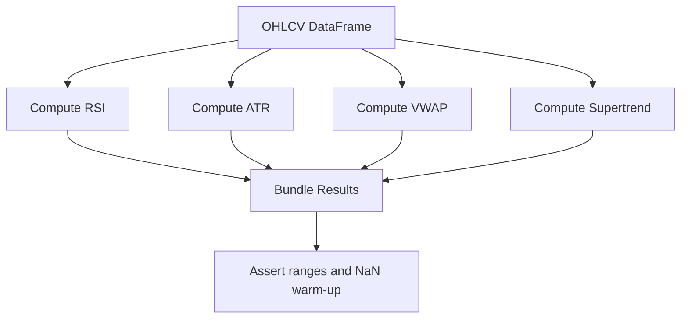

**Diagram sources**
- [test_indicators.py:23-151](file://tests/test_indicators.py#L23-L151)

**Section sources**
- [test_indicators.py:1-151](file://tests/test_indicators.py#L1-L151)

### Order Lifecycle Management
Patterns demonstrated:
- Buy limit and sell market orders with PaperBroker
- Order tracking by broker and status flags
- Stop orders with trigger prices
- Option market order conversion to limit per SEBI rule
- Error conditions when no broker is attached

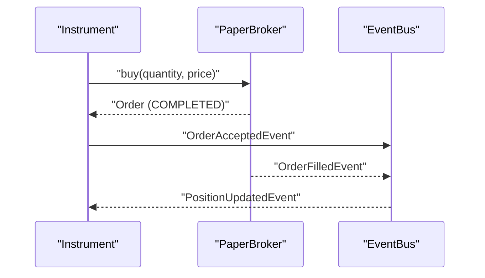

**Diagram sources**
- [test_orders.py:9-82](file://tests/test_orders.py#L9-L82)

**Section sources**
- [test_orders.py:1-90](file://tests/test_orders.py#L1-L90)

### Portfolio State Changes
Patterns demonstrated:
- Position PnL and market value calculations
- Portfolio aggregation and lookup by symbol
- Account from broker with initial balance
- Market facade integration for account and portfolio

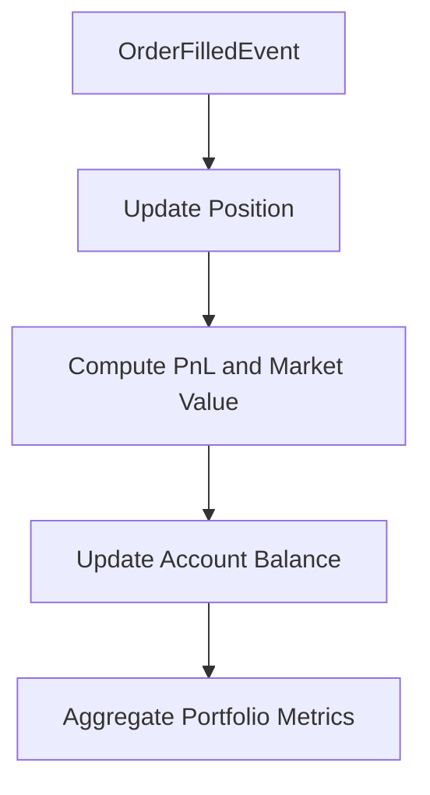

**Diagram sources**
- [test_portfolio_account.py:9-56](file://tests/test_portfolio_account.py#L9-L56)

**Section sources**
- [test_portfolio_account.py:1-56](file://tests/test_portfolio_account.py#L1-L56)

### Event-Driven Components Using Event Bus History
Patterns demonstrated:
- Subscribe to specific event types and base Event
- Unsubscribe handlers
- Isolate handler errors without affecting other handlers
- Bounded history and logging of exceptions
- Heartbeat event publishing

```mermaid
sequenceDiagram
participant Pub as "Publisher"
participant Bus as "EventBus"
participant H1 as "Handler1"
participant H2 as "Handler2"
Pub->>Bus : "publish(Event)"
Bus-->>H1 : "dispatch(Event)"
Bus-->>H2 : "dispatch(Event)"
Note over H1,H2 : "Errors isolated; history bounded"
```

**Diagram sources**
- [test_event_bus_clock.py:29-128](file://tests/test_event_bus_clock.py#L29-L128)

**Section sources**
- [test_event_bus_clock.py:1-128](file://tests/test_event_bus_clock.py#L1-L128)

### Asynchronous Operations and Thread-Safe Components
Patterns demonstrated:
- EventBus serializes publishes to prevent interleaving
- Concurrent publishers produce no lost events
- Disconnect notifications propagate to streams

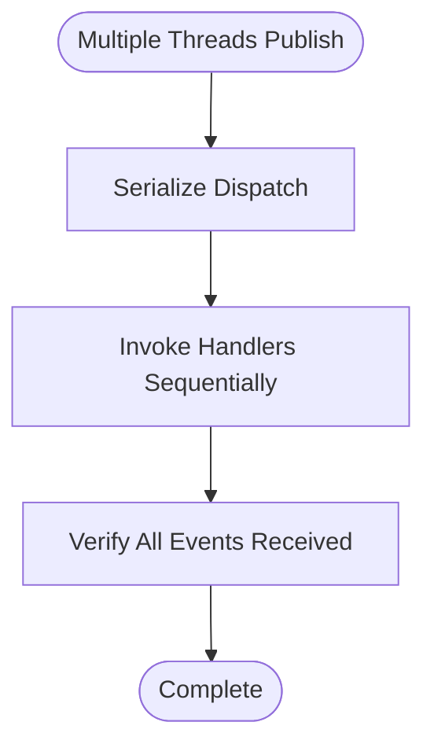

**Diagram sources**
- [test_event_bus_threads.py:18-63](file://tests/test_event_bus_threads.py#L18-L63)

**Section sources**
- [test_event_bus_threads.py:1-63](file://tests/test_event_bus_threads.py#L1-L63)

### Mocking Techniques for External Dependencies
Patterns demonstrated:
- Stubbing DhanBroker methods via SimpleNamespace
- Injecting mock kernel and bus for feed sources
- Using PaperBroker to simulate market data deterministically
- Creating synthetic feeds with known sequences
- **Updated**: Advanced make_broker() helper function for creating fully functional DhanBroker instances with stubbed Tradehull methods
- **Updated**: Comprehensive error condition testing including failure envelopes, rate limiting, and network failures

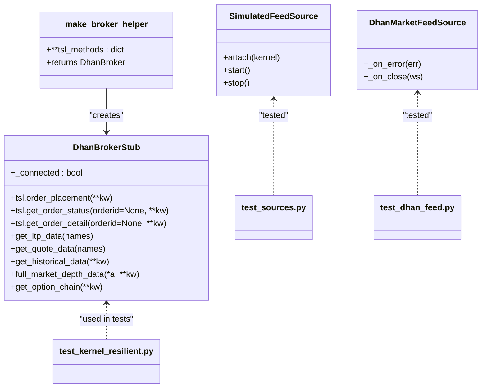

**Diagram sources**
- [test_kernel_resilient.py:235-278](file://tests/test_kernel_resilient.py#L235-L278)
- [test_sources.py:21-63](file://tests/test_sources.py#L21-63)
- [test_dhan_feed.py:4-31](file://tests/test_dhan_feed.py#L4-L31)
- [test_dhan_broker.py:18-23](file://tests/test_dhan_broker.py#L18-L23)
- [test_live_execution.py:55-61](file://tests/test_live_execution.py#L55-L61)

**Section sources**
- [test_kernel_resilient.py:1-396](file://tests/test_kernel_resilient.py#L1-L396)
- [test_sources.py:1-63](file://tests/test_sources.py#L1-L63)
- [test_dhan_feed.py:1-31](file://tests/test_dhan_feed.py#L1-L31)
- [test_dhan_broker.py:1-758](file://tests/test_dhan_broker.py#L1-L758)
- [test_live_execution.py:1-494](file://tests/test_live_execution.py#L1-L494)

### Zero-Parity Testing Between Simulated and Live Execution
Patterns demonstrated:
- Same signal produces identical fills, positions, and balances through both simulated and live broker paths
- Zero-cost parity testing ensures consistent behavior across execution modes
- Statistical equivalence validation between different execution backends

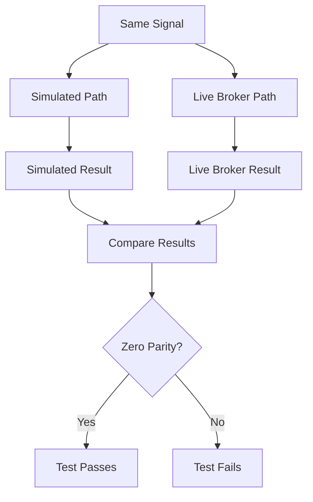

**Diagram sources**
- [test_live_execution.py:174-205](file://tests/test_live_execution.py#L174-L205)

**Section sources**
- [test_live_execution.py:174-205](file://tests/test_live_execution.py#L174-L205)

### Backtesting and Replay
Patterns demonstrated:
- EventStore append and chronological replay
- JSONL roundtrip with nested events
- ReplayEngine driving kernel from stored events
- Zero-parity between live and replay runs
- Backtest simulator producing equity curves and commissions
- Fill policy bar-aware execution

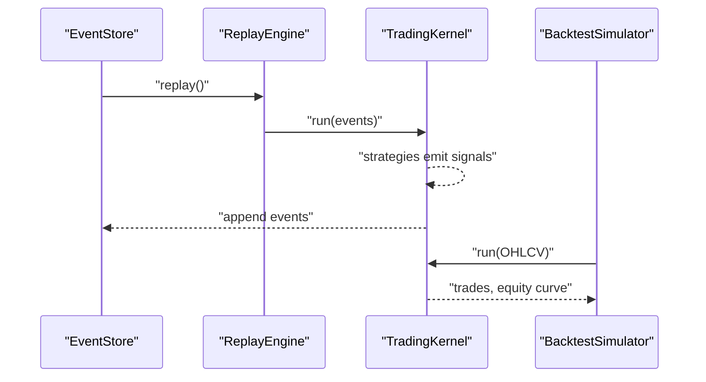

**Diagram sources**
- [test_replay_backtest.py:24-267](file://tests/test_replay_backtest.py#L24-L267)

**Section sources**
- [test_replay_backtest.py:1-267](file://tests/test_replay_backtest.py#L1-L267)

### Resilient Kernel Recovery
Patterns demonstrated:
- Recovery events include fills and maintain causal order
- One-shot recover with idempotent checks
- Rebuilding position and balance after crash
- Matching original kernel state (zero-parity)
- Handling partial-fill deltas and preventing ID collisions

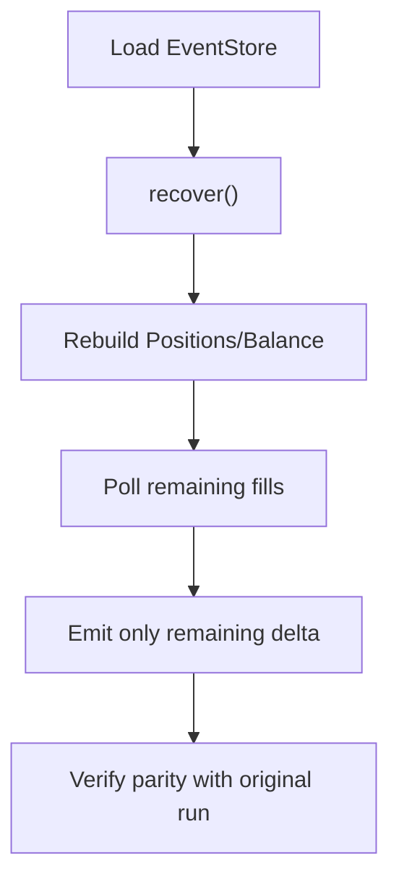

**Diagram sources**
- [test_kernel_resilient.py:54-193](file://tests/test_kernel_resilient.py#L54-L193)
- [test_kernel_resilient.py:281-396](file://tests/test_kernel_resilient.py#L281-L396)

**Section sources**
- [test_kernel_resilient.py:1-396](file://tests/test_kernel_resilient.py#L1-L396)

### Advanced Error Condition Testing
Patterns demonstrated:
- Failure envelope detection and proper error propagation
- Rate limiting exception handling and quota exhaustion scenarios
- Network timeout and connection failure resilience
- Transient failure retry mechanisms with exponential backoff
- Kill switch activation on risk halts with graceful degradation

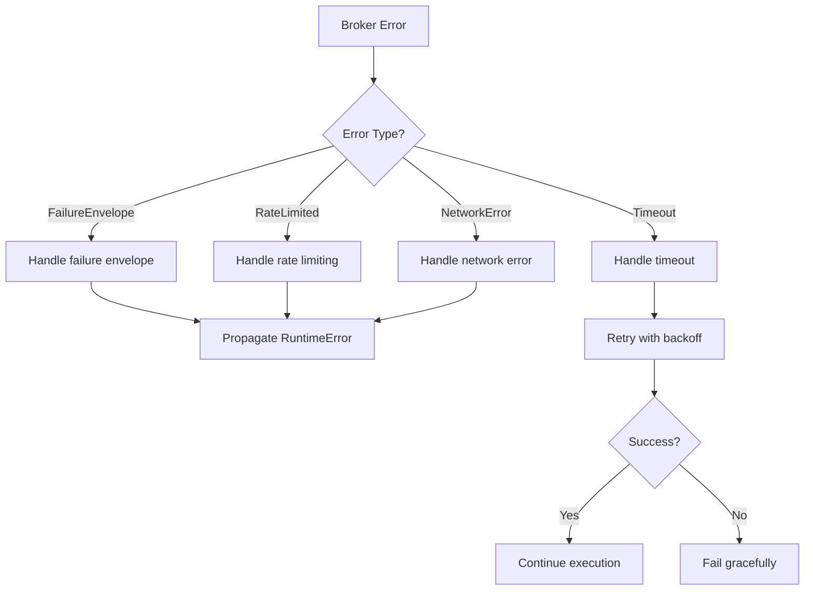

**Diagram sources**
- [test_dhan_broker.py:87-108](file://tests/test_dhan_broker.py#L87-L108)
- [test_dhan_broker.py:340-370](file://tests/test_dhan_broker.py#L340-L370)
- [test_kill_switch_wiring.py:36-58](file://tests/test_kill_switch_wiring.py#L36-L58)

**Section sources**
- [test_dhan_broker.py:87-108](file://tests/test_dhan_broker.py#L87-L108)
- [test_dhan_broker.py:340-370](file://tests/test_dhan_broker.py#L340-L370)
- [test_kill_switch_wiring.py:36-58](file://tests/test_kill_switch_wiring.py#L36-L58)

## Dependency Analysis
Key dependency relationships validated by tests:
- Strategies depend on kernel context and event bus
- Risk engine depends on portfolio and account state
- Order engine depends on broker executor and event bus
- Sources depend on kernel for publishing events
- Replay engine depends on event store and kernel
- Resilient kernel depends on event store and optional broker
- **Updated**: DhanBroker depends on Tradehull SDK with comprehensive error handling

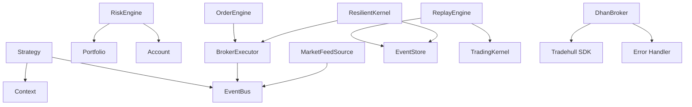

**Diagram sources**
- [test_engine_pipeline.py:16-79](file://tests/test_engine_pipeline.py#L16-L79)
- [test_replay_backtest.py:72-100](file://tests/test_replay_backtest.py#L72-L100)
- [test_kernel_resilient.py:107-153](file://tests/test_kernel_resilient.py#L107-L153)
- [test_dhan_broker.py:18-23](file://tests/test_dhan_broker.py#L18-L23)

**Section sources**
- [test_engine_pipeline.py:1-137](file://tests/test_engine_pipeline.py#L1-L137)
- [test_replay_backtest.py:1-267](file://tests/test_replay_backtest.py#L1-L267)
- [test_kernel_resilient.py:1-396](file://tests/test_kernel_resilient.py#L1-L396)
- [test_dhan_broker.py:1-758](file://tests/test_dhan_broker.py#L1-L758)

## Performance Considerations
- IndicatorEngine enforces max_rows to bound memory usage during streaming
- EventBus supports bounded history to control memory growth
- ReplayEngine and EventStore enable efficient backtesting with minimal overhead
- PaperBroker seeding provides deterministic performance without network latency
- ResilientKernel avoids reprocessing already-applied events to ensure idempotency
- **Updated**: make_broker() helper enables fast, deterministic broker testing without network calls

## Troubleshooting Guide
Common issues and resolutions:
- Handler exceptions are isolated and logged; verify logger configuration
- Unknown event types in JSONL are silently skipped; ensure schema compatibility
- Market orders require a live quote; seed quotes before placing orders
- Risk breakers may halt trading; check daily loss and drawdown thresholds
- Partial-fill recovery requires correct open-order deltas; validate stored events
- **Updated**: DhanBroker failure envelopes indicate rate limiting; check request parameters and raw responses
- **Updated**: make_broker() helper should include all required TSL methods for complete broker simulation

**Section sources**
- [test_event_bus_clock.py:109-128](file://tests/test_event_bus_clock.py#L109-L128)
- [test_replay_backtest.py:243-267](file://tests/test_replay_backtest.py#L243-L267)
- [test_engine_pipeline.py:115-137](file://tests/test_engine_pipeline.py#L115-L137)
- [test_risk_breakers.py:30-111](file://tests/test_risk_breakers.py#L30-L111)
- [test_kernel_resilient.py:281-396](file://tests/test_kernel_resilient.py#L281-L396)
- [test_dhan_broker.py:94-108](file://tests/test_dhan_broker.py#L94-L108)

## Conclusion
The nTrade test suite demonstrates robust patterns for unit testing across domain models, engines, brokers, and infrastructure components. By leveraging deterministic fixtures like PaperBroker, event bus history, and replay/backtest tools, tests cover edge cases, error conditions, and asynchronous behavior. The examples provide clear blueprints for writing reliable tests for custom strategies, broker adapters, risk rules, and domain objects, ensuring correctness and resilience in production systems. **Updated**: The enhanced mocking patterns with make_broker() helper function and comprehensive error condition testing provide sophisticated techniques for validating trading system reliability under various failure scenarios, ensuring robust production deployments.