# Trading Flows

<cite>
**Referenced Files in This Document**
- [facade.py](file://ntrade/facade.py)
- [trading_session.py](file://ntrade/kernel/trading_session.py)
- [session.py](file://ntrade/kernel/session.py)
- [order_engine.py](file://ntrade/engines/order_engine.py)
- [strategy_engine.py](file://ntrade/engines/strategy_engine.py)
- [risk_engine.py](file://ntrade/engines/risk_engine.py)
- [router.py](file://ntrade/execution/router.py)
- [broker_executor.py](file://ntrade/execution/broker_executor.py)
- [simulator.py](file://ntrade/execution/simulator.py)
- [paper.py](file://ntrade/brokers/paper.py)
- [order.py](file://ntrade/domain/orders/order.py)
- [order_events.py](file://ntrade/events/order.py)
- [risk_events.py](file://ntrade/events/risk.py)
- [09-trading-flows.md](file://user-guide/09-trading-flows.md)
</cite>

## Table of Contents
1. [Introduction](#introduction)
2. [Project Structure](#project-structure)
3. [Core Components](#core-components)
4. [Architecture Overview](#architecture-overview)
5. [Detailed Component Analysis](#detailed-component-analysis)
6. [Dependency Analysis](#dependency-analysis)
7. [Performance Considerations](#performance-considerations)
8. [Troubleshooting Guide](#troubleshooting-guide)
9. [Conclusion](#conclusion)

## Introduction
This document explains the end-to-end trading flows in the nTrade system, from market data to order execution and fill reporting. It covers both paper (simulation) and live broker execution paths, the event-driven strategy pipeline, risk controls, and operational lifecycles such as polling, recovery, and kill switches. The goal is to make the flow understandable for both new users and experienced developers.

## Project Structure
At a high level, the trading system is organized into:
- Session and kernel orchestration
- Engines for market processing, strategies, risk, orders, and portfolio updates
- Execution targets for simulation and live brokers
- Domain models for instruments, orders, and events
- User-facing facade and session APIs

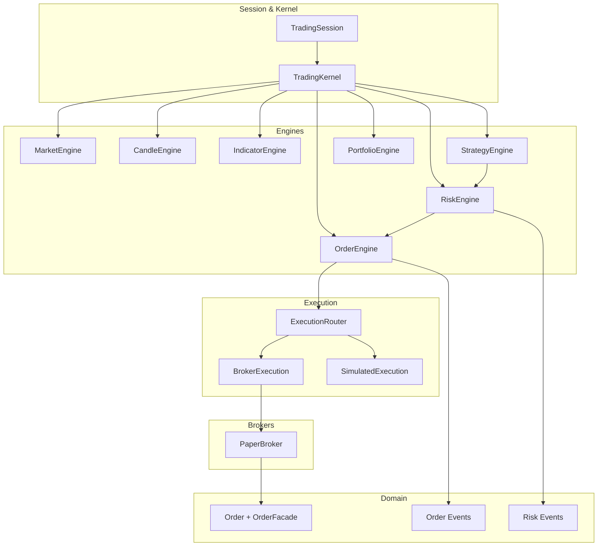

**Diagram sources**
- [trading_session.py:39-143](file://ntrade/kernel/trading_session.py#L39-L143)
- [session.py:38-103](file://ntrade/kernel/session.py#L38-L103)
- [order_engine.py:14-34](file://ntrade/engines/order_engine.py#L14-L34)
- [strategy_engine.py:48-104](file://ntrade/engines/strategy_engine.py#L48-L104)
- [risk_engine.py:19-141](file://ntrade/engines/risk_engine.py#L19-L141)
- [router.py:19-49](file://ntrade/execution/router.py#L19-L49)
- [broker_executor.py:53-107](file://ntrade/execution/broker_executor.py#L53-L107)
- [simulator.py:43-147](file://ntrade/execution/simulator.py#L43-L147)
- [paper.py:23-118](file://ntrade/brokers/paper.py#L23-L118)
- [order.py:44-173](file://ntrade/domain/orders/order.py#L44-L173)
- [order_events.py:11-91](file://ntrade/events/order.py#L11-L91)
- [risk_events.py:11-52](file://ntrade/events/risk.py#L11-L52)

**Section sources**
- [trading_session.py:39-143](file://ntrade/kernel/trading_session.py#L39-L143)
- [session.py:38-103](file://ntrade/kernel/session.py#L38-L103)

## Core Components
- TradingSession: Unified entry point for connecting to brokers, creating instruments, registering strategies, and starting/stopping sessions.
- TradingKernel: Orchestrates engines, wiring, replay, and live operations; holds context, bus, clock, and execution target.
- StrategyEngine: Dispatches market and portfolio events to registered strategies; strategies emit signals via emit_signal().
- RiskEngine: Screens signals with static limits and circuit breakers; publishes approved/rejected signals and halt/resume events.
- OrderEngine: Converts approved signals into order intents and submits them through the execution router.
- ExecutionRouter: Routes order intents to the appropriate execution target (simulated or broker).
- BrokerExecution: Live execution target that places orders via the broker adapter, tracks open orders, polls lifecycle, and emits fills/status updates.
- SimulatedExecution: Deterministic execution target for paper/backtest/replay using current quotes and configurable costs/slippage.
- PaperBroker: In-memory broker implementing the same contract as live brokers for consistent API parity.
- Order model and facade: Rich order representation and convenient buy/sell/modify/cancel methods bound to an instrument.

**Section sources**
- [trading_session.py:39-143](file://ntrade/kernel/trading_session.py#L39-L143)
- [session.py:38-103](file://ntrade/kernel/session.py#L38-L103)
- [strategy_engine.py:18-104](file://ntrade/engines/strategy_engine.py#L18-L104)
- [risk_engine.py:19-141](file://ntrade/engines/risk_engine.py#L19-L141)
- [order_engine.py:14-34](file://ntrade/engines/order_engine.py#L14-L34)
- [router.py:19-49](file://ntrade/execution/router.py#L19-L49)
- [broker_executor.py:53-107](file://ntrade/execution/broker_executor.py#L53-L107)
- [simulator.py:43-147](file://ntrade/execution/simulator.py#L43-L147)
- [paper.py:23-118](file://ntrade/brokers/paper.py#L23-L118)
- [order.py:44-173](file://ntrade/domain/orders/order.py#L44-L173)

## Architecture Overview
The system follows an event-driven architecture with clear separation between signal generation, risk screening, order intent creation, and execution. Market data flows through engines to strategies; strategies emit signals; risk screens them; approved signals become order intents; execution targets produce fills and status updates; portfolio engine updates positions and balances.

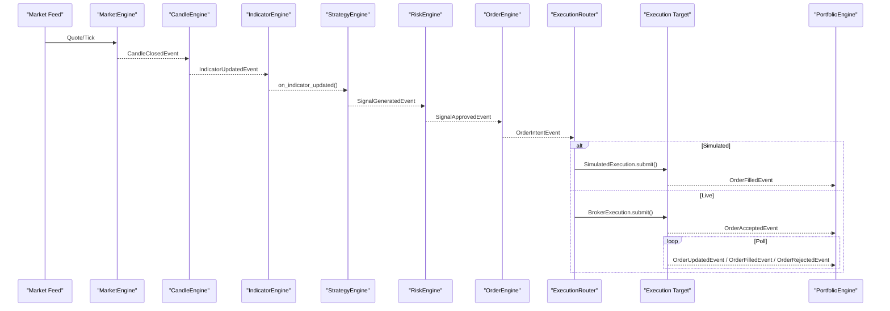

**Diagram sources**
- [session.py:79-103](file://ntrade/kernel/session.py#L79-L103)
- [strategy_engine.py:48-104](file://ntrade/engines/strategy_engine.py#L48-L104)
- [risk_engine.py:73-111](file://ntrade/engines/risk_engine.py#L73-L111)
- [order_engine.py:21-34](file://ntrade/engines/order_engine.py#L21-L34)
- [router.py:37-49](file://ntrade/execution/router.py#L37-L49)
- [simulator.py:72-147](file://ntrade/execution/simulator.py#L72-L147)
- [broker_executor.py:70-107](file://ntrade/execution/broker_executor.py#L70-L107)

## Detailed Component Analysis

### End-to-End Flow: Paper Trading (Happy Path)
- Create a paper session and instrument.
- Refresh quotes and compute indicators.
- Place an order via the instrument’s order facade.
- Immediate fill in paper mode; check positions and balance.

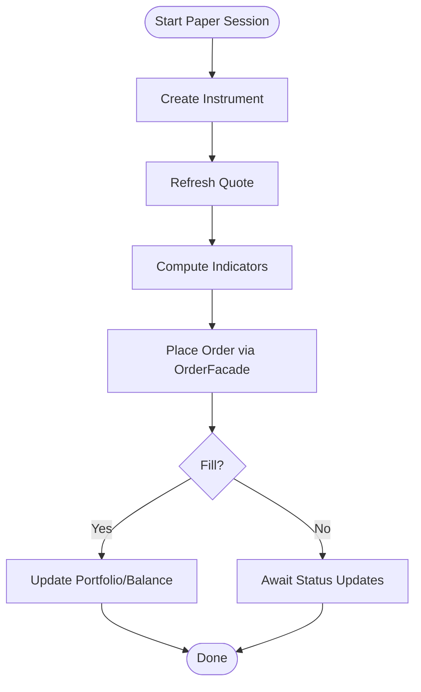

**Diagram sources**
- [trading_session.py:96-116](file://ntrade/kernel/trading_session.py#L96-L116)
- [order.py:118-173](file://ntrade/domain/orders/order.py#L118-L173)
- [paper.py:108-118](file://ntrade/brokers/paper.py#L108-L118)

**Section sources**
- [09-trading-flows.md:9-46](file://user-guide/09-trading-flows.md#L9-L46)
- [trading_session.py:96-116](file://ntrade/kernel/trading_session.py#L96-L116)
- [order.py:118-173](file://ntrade/domain/orders/order.py#L118-L173)
- [paper.py:108-118](file://ntrade/brokers/paper.py#L108-L118)

### Strategy Flow (Event-Centric)
- Strategies receive candle/indicator events and emit signals.
- RiskEngine screens signals and either approves or rejects them.
- Approved signals are converted to order intents by OrderEngine.
- ExecutionRouter selects the correct execution target (simulated or broker).
- Fills and status updates propagate to portfolio updates.

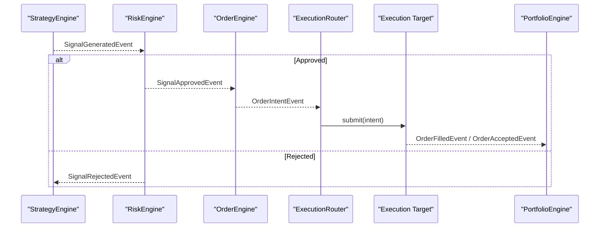

**Diagram sources**
- [strategy_engine.py:18-46](file://ntrade/engines/strategy_engine.py#L18-L46)
- [risk_engine.py:73-111](file://ntrade/engines/risk_engine.py#L73-L111)
- [order_engine.py:21-34](file://ntrade/engines/order_engine.py#L21-L34)
- [router.py:37-49](file://ntrade/execution/router.py#L37-L49)
- [simulator.py:72-147](file://ntrade/execution/simulator.py#L72-L147)
- [broker_executor.py:70-107](file://ntrade/execution/broker_executor.py#L70-L107)

**Section sources**
- [09-trading-flows.md:50-95](file://user-guide/09-trading-flows.md#L50-L95)
- [strategy_engine.py:48-104](file://ntrade/engines/strategy_engine.py#L48-L104)
- [risk_engine.py:73-111](file://ntrade/engines/risk_engine.py#L73-L111)
- [order_engine.py:21-34](file://ntrade/engines/order_engine.py#L21-L34)

### Order Lifecycle (Live Kernel Orders)
- Submit publishes OrderAcceptedEvent immediately and tracks open orders.
- Polling refreshes broker status and publishes fills, updates, and rejections.
- Partial fills are handled safely without double-reporting.
- Timeout detection for PENDING orders.

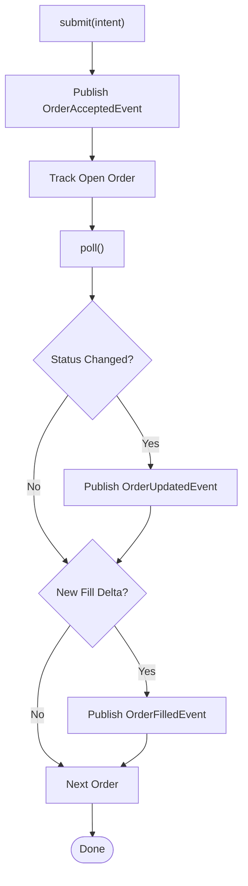

**Diagram sources**
- [broker_executor.py:70-107](file://ntrade/execution/broker_executor.py#L70-L107)
- [broker_executor.py:118-181](file://ntrade/execution/broker_executor.py#L118-L181)
- [order_events.py:24-91](file://ntrade/events/order.py#L24-L91)

**Section sources**
- [09-trading-flows.md:117-139](file://user-guide/09-trading-flows.md#L117-L139)
- [broker_executor.py:70-107](file://ntrade/execution/broker_executor.py#L70-L107)
- [broker_executor.py:118-181](file://ntrade/execution/broker_executor.py#L118-L181)

### Options Flow
- Refresh underlying quote.
- Fetch option chain via derivatives interface.
- Trade ATM/ITM/OTM options through order facade.

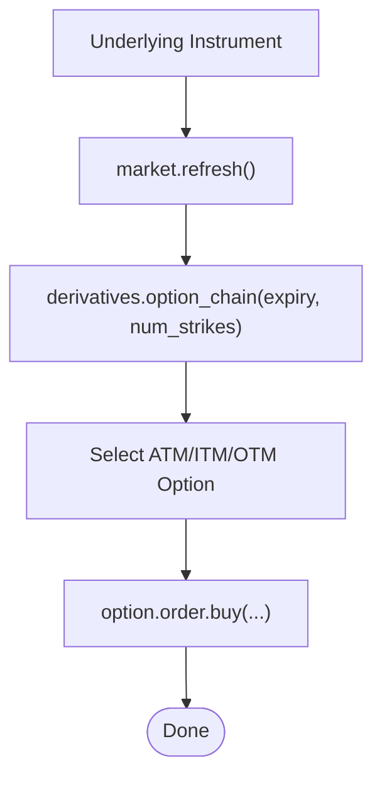

**Diagram sources**
- [trading_session.py:218-221](file://ntrade/kernel/trading_session.py#L218-L221)
- [order.py:118-173](file://ntrade/domain/orders/order.py#L118-L173)

**Section sources**
- [09-trading-flows.md:142-157](file://user-guide/09-trading-flows.md#L142-L157)

### Scanner to Discretionary Trade
- Register instruments and refresh quotes.
- Use scanner to rank opportunities.
- Optionally place trades manually based on results.

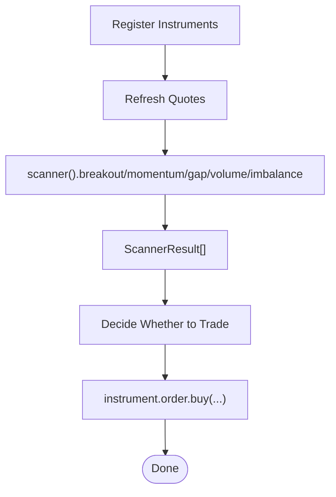

**Diagram sources**
- [trading_session.py:253-258](file://ntrade/kernel/trading_session.py#L253-L258)
- [order.py:118-173](file://ntrade/domain/orders/order.py#L118-L173)

**Section sources**
- [09-trading-flows.md:161-177](file://user-guide/09-trading-flaces.md#L161-L177)

### Paper → Backtest → Paper-Gate → Live
- Develop on paper, backtest with historical data, run paper gate checks, then go live.
- Live runner polls orders and syncs positions; risk halt triggers kill switch.

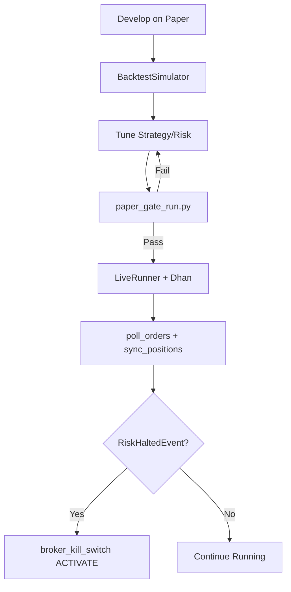

**Diagram sources**
- [09-trading-flows.md:181-237](file://user-guide/09-trading-flows.md#L181-L237)

**Section sources**
- [09-trading-flows.md:181-237](file://user-guide/09-trading-flows.md#L181-L237)

### Replay and Crash Recovery
- Record all events to EventStore during live session.
- On crash/stop, recover by replaying market events only; derived events recomputed deterministically.

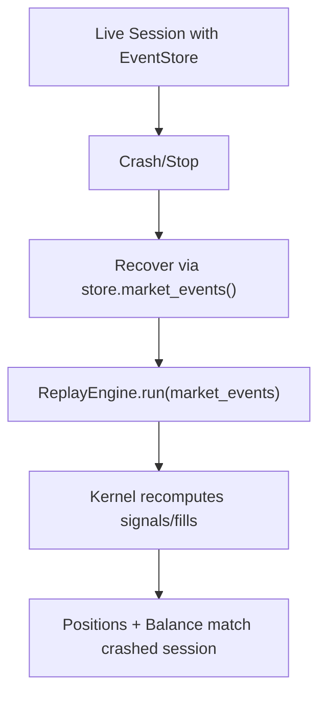

**Diagram sources**
- [09-trading-flows.md:240-268](file://user-guide/09-trading-flows.md#L240-L268)
- [session.py:134-147](file://ntrade/kernel/session.py#L134-L147)

**Section sources**
- [09-trading-flows.md:240-268](file://user-guide/09-trading-flows.md#L240-L268)
- [session.py:134-147](file://ntrade/kernel/session.py#L134-L147)

### Risk Halt Flow (Live)
- RiskEngine monitors daily loss and drawdown; halts trading when thresholds exceeded.
- LiveRunner activates broker kill switch upon RiskHaltedEvent.

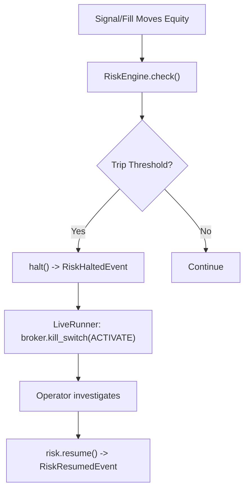

**Diagram sources**
- [risk_engine.py:49-63](file://ntrade/engines/risk_engine.py#L49-L63)
- [risk_events.py:39-52](file://ntrade/events/risk.py#L39-L52)
- [09-trading-flows.md:271-289](file://user-guide/09-trading-flows.md#L271-L289)

**Section sources**
- [09-trading-flows.md:271-289](file://user-guide/09-trading-flows.md#L271-L289)
- [risk_engine.py:49-63](file://ntrade/engines/risk_engine.py#L49-L63)

## Dependency Analysis
Key dependencies and relationships:
- TradingSession depends on TradingKernel, InstrumentFactory, and StrategyRunner.
- TradingKernel wires engines and execution targets; uses EventBus and TradingClock.
- StrategyEngine subscribes to market/portfolio events and dispatches to strategies.
- RiskEngine subscribes to SignalGeneratedEvent and publishes approvals/rejections.
- OrderEngine subscribes to SignalApprovedEvent and publishes OrderIntentEvent.
- ExecutionRouter routes intents to SimulatedExecution or BrokerExecution.
- BrokerExecution interacts with BrokerAdapter (e.g., PaperBroker) and publishes lifecycle events.

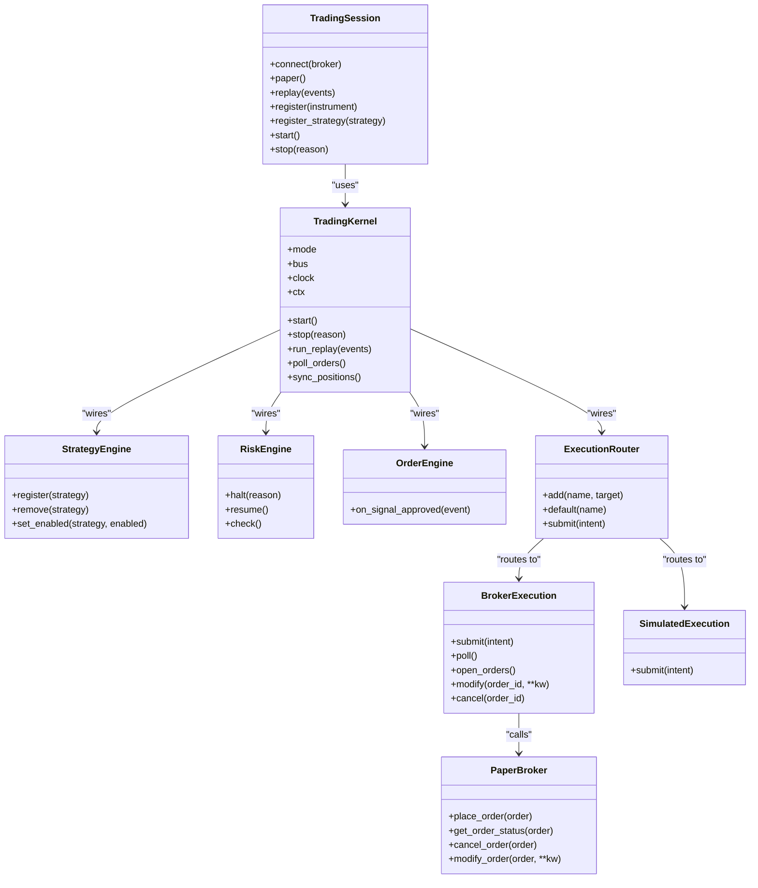

**Diagram sources**
- [trading_session.py:39-143](file://ntrade/kernel/trading_session.py#L39-L143)
- [session.py:38-103](file://ntrade/kernel/session.py#L38-L103)
- [strategy_engine.py:48-104](file://ntrade/engines/strategy_engine.py#L48-L104)
- [risk_engine.py:19-141](file://ntrade/engines/risk_engine.py#L19-L141)
- [order_engine.py:14-34](file://ntrade/engines/order_engine.py#L14-L34)
- [router.py:19-49](file://ntrade/execution/router.py#L19-L49)
- [broker_executor.py:53-107](file://ntrade/execution/broker_executor.py#L53-L107)
- [simulator.py:43-147](file://ntrade/execution/simulator.py#L43-L147)
- [paper.py:23-118](file://ntrade/brokers/paper.py#L23-L118)

**Section sources**
- [trading_session.py:39-143](file://ntrade/kernel/trading_session.py#L39-L143)
- [session.py:38-103](file://ntrade/kernel/session.py#L38-L103)
- [router.py:19-49](file://ntrade/execution/router.py#L19-L49)

## Performance Considerations
- Event-driven design minimizes coupling and allows asynchronous processing.
- SimulatedExecution provides deterministic fills for fast iteration and testing.
- BrokerExecution tracks open orders and uses polling to avoid blocking; stale order eviction prevents memory leaks.
- Statutory cost models ensure parity between simulated and live PnL; zero-cost opt-out available for specific scenarios.
- Delivery detection in SimulatedExecution adjusts costs for overnight equity exits to mirror live behavior.

[No sources needed since this section provides general guidance]

## Troubleshooting Guide
Common issues and resolutions:
- No execution target for strategy: Ensure the strategy name matches a registered execution target or default is set.
- Unknown instrument: Verify the instrument is registered with the kernel before placing orders.
- Invalid fill price: For market orders, ensure LTP is available; otherwise, use limit orders.
- Stale orders: BrokerExecution evicts orders after repeated poll failures; investigate connectivity and broker responsiveness.
- Risk halted: Review daily loss and drawdown thresholds; resume risk after investigation.

**Section sources**
- [router.py:37-49](file://ntrade/execution/router.py#L37-L49)
- [simulator.py:72-96](file://ntrade/execution/simulator.py#L72-L96)
- [broker_executor.py:118-141](file://ntrade/execution/broker_executor.py#L118-L141)
- [risk_engine.py:49-63](file://ntrade/engines/risk_engine.py#L49-L63)

## Conclusion
The nTrade system provides a robust, event-driven trading framework with clear separation of concerns across market processing, strategy execution, risk management, and order handling. The unified session and kernel abstractions enable seamless transitions between paper, backtest, and live modes while maintaining parity in execution and cost modeling. Understanding these flows helps developers build reliable trading systems and operators manage live sessions effectively.

[No sources needed since this section summarizes without analyzing specific files]