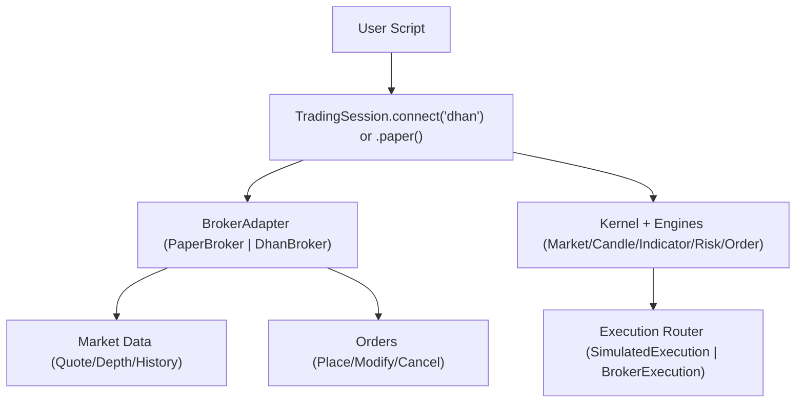
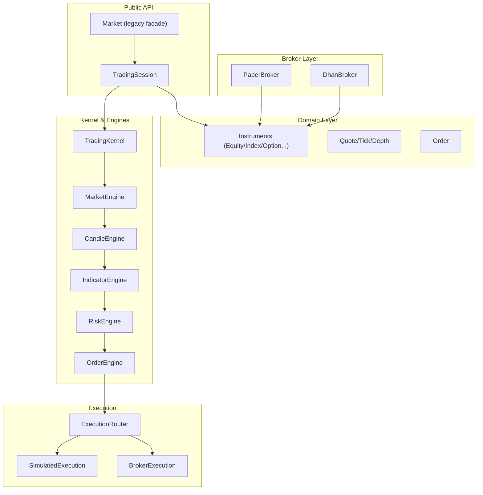
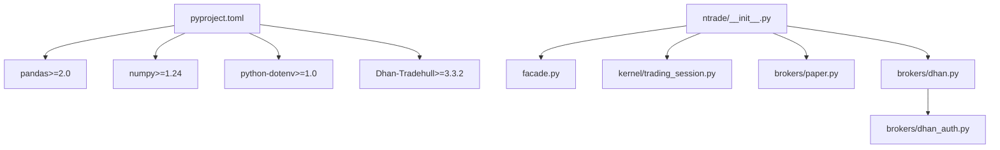

# Getting Started

<cite>
**Referenced Files in This Document**
- [pyproject.toml](file://pyproject.toml)
- [.gitignore](file://.gitignore)
- [ntrade/__init__.py](file://ntrade/__init__.py)
- [ntrade/facade.py](file://ntrade/facade.py)
- [ntrade/kernel/trading_session.py](file://ntrade/kernel/trading_session.py)
- [ntrade/brokers/paper.py](file://ntrade/brokers/paper.py)
- [ntrade/brokers/dhan.py](file://ntrade/brokers/dhan.py)
- [ntrade/brokers/dhan_auth.py](file://ntrade/brokers/dhan_auth.py)
- [check_connection.py](file://check_connection.py)
- [scripts/ema_cross_run.py](file://scripts/ema_cross_run.py)
- [scripts/live_runner_run.py](file://scripts/live_runner_run.py)
- [ARCHITECTURE.md](file://ARCHITECTURE.md)
</cite>

## Table of Contents
1. [Introduction](#introduction)
2. [Project Structure](#project-structure)
3. [Core Components](#core-components)
4. [Architecture Overview](#architecture-overview)
5. [Detailed Component Analysis](#detailed-component-analysis)
6. [Dependency Analysis](#dependency-analysis)
7. [Performance Considerations](#performance-considerations)
8. [Troubleshooting Guide](#troubleshooting-guide)
9. [Conclusion](#conclusion)
10. [Appendices](#appendices)

## Introduction
This guide helps you get started with nTrade, an object-oriented trading framework that exposes rich market domain objects (Equity, Index, Option, etc.) and hides broker transport details behind adapters. You will:
- Install the package using pip
- Configure environment variables via python-dotenv
- Run a paper-trading session end-to-end
- Connect to a live broker (Dhan) and run a smoke test
- Create instruments, access quotes, subscribe to data, and place orders
- Understand configuration patterns for different brokers

The content is beginner-friendly but includes enough technical depth for experienced developers to understand how the framework wires together sessions, kernels, feeds, and execution.

## Project Structure
At a high level:
- Installation and dependencies are declared in pyproject.toml
- The public API surface re-exports core types and utilities from ntrade/__init__.py
- TradingSession is the unified entry point for connecting to brokers, creating instruments, and running strategies
- PaperBroker provides deterministic offline trading; DhanBroker connects to live markets via Dhan-Tradehull
- Authentication and token management for Dhan are handled by dhan_auth
- Example scripts demonstrate historical replay and live runner flows

**Diagram sources**
- [ntrade/kernel/trading_session.py:71-116](file://ntrade/kernel/trading_session.py#L71-L116)
- [ntrade/brokers/paper.py:23-60](file://ntrade/brokers/paper.py#L23-L60)
- [ntrade/brokers/dhan.py:54-74](file://ntrade/brokers/dhan.py#L54-L74)

**Section sources**
- [pyproject.toml:1-25](file://pyproject.toml#L1-L25)
- [ntrade/__init__.py:1-105](file://ntrade/__init__.py#L1-L105)
- [ntrade/kernel/trading_session.py:1-306](file://ntrade/kernel/trading_session.py#L1-L306)
- [ARCHITECTURE.md:1-389](file://ARCHITECTURE.md#L1-L389)

## Core Components
- TradingSession: Unified entry point to connect to brokers, create instruments, manage kernel, and run strategies
- BrokerAdapter implementations:
  - PaperBroker: In-memory, deterministic broker for paper/backtest/replay
  - DhanBroker: Live broker adapter over Dhan-Tradehull
- Market facade: Legacy compatibility wrapper around TradingSession
- Dhan authentication: Shared helper to load env, manage tokens, and handle PIN+TOTP fallback

Key capabilities exposed through domain objects:
- Quote access, history, live streaming, order placement, analytics, and metadata hydration

**Section sources**
- [ntrade/kernel/trading_session.py:71-116](file://ntrade/kernel/trading_session.py#L71-L116)
- [ntrade/brokers/paper.py:23-60](file://ntrade/brokers/paper.py#L23-L60)
- [ntrade/brokers/dhan.py:54-74](file://ntrade/brokers/dhan.py#L54-L74)
- [ntrade/facade.py:27-36](file://ntrade/facade.py#L27-L36)
- [ntrade/brokers/dhan_auth.py:114-166](file://ntrade/brokers/dhan_auth.py#L114-L166)

## Architecture Overview
nTrade follows a layered architecture with a clean separation between domain objects, broker adapters, and infrastructure. The event-centric kernel processes canonical events from multiple sources (live, replay, backtest) and drives engines (market, candle, indicator, risk, order). Execution targets can be simulated or routed to a real broker.

**Diagram sources**
- [ARCHITECTURE.md:20-51](file://ARCHITECTURE.md#L20-L51)
- [ntrade/kernel/trading_session.py:1-306](file://ntrade/kernel/trading_session.py#L1-L306)
- [ntrade/brokers/paper.py:23-60](file://ntrade/brokers/paper.py#L23-L60)
- [ntrade/brokers/dhan.py:54-74](file://ntrade/brokers/dhan.py#L54-L74)

## Detailed Component Analysis

### Installation and Environment Setup
- Install the package and dependencies using pip. Python version must be >= 3.10.
- Use python-dotenv to load environment variables from a .env file.
- For Dhan live trading, ensure Dhan-Tradehull is installed as it is a required dependency.

Environment variables for Dhan authentication:
- DHAN_CLIENT_ID: Required
- DHAN_ACCESS_TOKEN: Optional; used if not expired
- DHAN_PIN: Required for PIN+TOTP fallback
- DHAN_TOTP_SECRET: Required for PIN+TOTP fallback
- DHAN_TOKEN_PATH: Optional shared token store path
- DHAN_COOLDOWN_PATH: Optional cooldown file path
- DHAN_EXPIRY_BUFFER_S: Optional buffer to proactively refresh tokens

Verification:
- Use check_connection.py to validate connectivity and basic data retrieval without placing orders.

**Section sources**
- [pyproject.toml:1-25](file://pyproject.toml#L1-L25)
- [ntrade/brokers/dhan_auth.py:42-44](file://ntrade/brokers/dhan_auth.py#L42-L44)
- [ntrade/brokers/dhan_auth.py:114-166](file://ntrade/brokers/dhan_auth.py#L114-L166)
- [check_connection.py:1-43](file://check_connection.py#L1-L43)
- [.gitignore:1-25](file://.gitignore#L1-L25)

### First Trading Session: Paper Trading
Steps:
- Create a paper session using TradingSession.paper()
- Create instruments (equity, index, option)
- Access quotes and history
- Place orders and inspect orderbook/tradebook

Highlights:
- PaperBroker seeds quotes and history deterministically
- Orders are immediately filled at LTP or limit price
- Balance and positions are tracked in memory

Example flow references:
- Creating a paper session and instruments
- Accessing quote and history
- Placing orders and retrieving orderbook/tradebook

**Section sources**
- [ntrade/kernel/trading_session.py:96-116](file://ntrade/kernel/trading_session.py#L96-L116)
- [ntrade/brokers/paper.py:39-60](file://ntrade/brokers/paper.py#L39-L60)
- [ntrade/brokers/paper.py:108-118](file://ntrade/brokers/paper.py#L108-L118)
- [ntrade/brokers/paper.py:161-188](file://ntrade/brokers/paper.py#L161-L188)

### First Trading Session: Live Trading (Dhan)
Steps:
- Create a live session using TradingSession.connect("dhan")
- Ensure environment variables are set and token is valid
- Create instruments and fetch quotes/history
- Subscribe to market data streams and place orders

Highlights:
- DhanBroker handles quotes, depth, history, option chains, and orders
- Authentication uses shared token store, access token, or PIN+TOTP fallback
- Bracket orders route to Dhan’s super order API; MARKET orders for F&O are converted to LIMIT per regulation

Example flow references:
- Connecting to Dhan and fetching LTP
- Historical data retrieval and normalization
- Option chain construction and expiry handling
- Order placement and status polling

**Section sources**
- [ntrade/kernel/trading_session.py:73-94](file://ntrade/kernel/trading_session.py#L73-L94)
- [ntrade/brokers/dhan.py:69-74](file://ntrade/brokers/dhan.py#L69-L74)
- [ntrade/brokers/dhan.py:103-135](file://ntrade/brokers/dhan.py#L103-L135)
- [ntrade/brokers/dhan.py:184-203](file://ntrade/brokers/dhan.py#L184-L203)
- [ntrade/brokers/dhan.py:254-296](file://ntrade/brokers/dhan.py#L254-L296)
- [ntrade/brokers/dhan.py:299-345](file://ntrade/brokers/dhan.py#L299-L345)

### Instrument Creation Examples
- Equity: session.stock("TCS")
- Index: session.index("NIFTY")
- ETF: session.etf("NIFTYBEES")
- Commodity: session.commodity("GOLD")
- Currency: session.currency("USDINR")
- Future: session.future(underlying, expiry)
- Option: session.option(underlying, strike, expiry, "CE"/"PE")

These methods delegate to InstrumentFactory bound to the active broker.

**Section sources**
- [ntrade/kernel/trading_session.py:146-172](file://ntrade/kernel/trading_session.py#L146-L172)

### Accessing Real-Time Quotes and Subscribing to Streams
- Quote access: instrument.quote.ltp, bid, ask, volume, OI
- History: instrument.history(timeframe, days/start/end) returns CandleSeries
- Streaming: instrument.subscribe(), on_tick/on_quote handlers, last_tick/ticks/candles

For live data:
- DhanBroker.get_quote retries LTP calls and normalizes fields
- Depth retrieval uses websocket snapshots with timeouts
- Historical data is normalized and filtered by timeframe and date ranges

**Section sources**
- [ntrade/brokers/dhan.py:103-135](file://ntrade/brokers/dhan.py#L103-L135)
- [ntrade/brokers/dhan.py:137-182](file://ntrade/brokers/dhan.py#L137-L182)
- [ntrade/brokers/dhan.py:184-203](file://ntrade/brokers/dhan.py#L184-L203)

### Placing Orders and Managing Lifecycle
- Place orders: instrument.order.buy/sell/limit/market/stop/cover/bracket/place
- Modify/cancel: modify_order(price/quantity/order_type/trigger_price), cancel_order
- Poll status: poll_orders() publishes updated states and fills

Dhan-specific behaviors:
- MARKET orders for F&O exchanges are converted to LIMIT with safe offsets
- Bracket orders use place_super_order API
- Order status mapping and detail retrieval normalize broker responses

**Section sources**
- [ntrade/brokers/dhan.py:299-345](file://ntrade/brokers/dhan.py#L299-L345)
- [ntrade/brokers/dhan.py:347-378](file://ntrade/brokers/dhan.py#L347-L378)
- [ntrade/brokers/dhan.py:380-414](file://ntrade/brokers/dhan.py#L380-L414)

### Running a Strategy Through the Kernel
- Use TradingKernel with a chosen clock (LiveClock/ReplayClock/SimulationClock)
- Register instruments and strategies
- Feed data via SimulatedFeedSource (historical) or DhanMarketFeedSource (live)
- Observe canonical events (TickEvent, QuoteUpdatedEvent, CandleClosedEvent, IndicatorUpdatedEvent, SignalGeneratedEvent, OrderFilledEvent)

Example script demonstrates EMA crossover strategy on historical data.

**Section sources**
- [scripts/ema_cross_run.py:1-87](file://scripts/ema_cross_run.py#L1-L87)

### Live Runner Orchestration
- LiveRunner starts kernel and feed, polls orders and syncs positions
- Supports synth mode (offline rehearsal using historical data extrapolated to ticks) and live mode (real-time websocket)
- Publishes lifecycle events and summary statistics

**Section sources**
- [scripts/live_runner_run.py:1-69](file://scripts/live_runner_run.py#L1-L69)

## Dependency Analysis
nTrade depends on pandas, numpy, python-dotenv, and Dhan-Tradehull. The package structure exposes a curated public API while keeping broker-specific logic isolated in adapters.

**Diagram sources**
- [pyproject.toml:1-25](file://pyproject.toml#L1-L25)
- [ntrade/__init__.py:1-105](file://ntrade/__init__.py#L1-L105)
- [ntrade/facade.py:27-36](file://ntrade/facade.py#L27-L36)
- [ntrade/kernel/trading_session.py:71-116](file://ntrade/kernel/trading_session.py#L71-L116)
- [ntrade/brokers/paper.py:23-60](file://ntrade/brokers/paper.py#L23-L60)
- [ntrade/brokers/dhan.py:54-74](file://ntrade/brokers/dhan.py#L54-L74)
- [ntrade/brokers/dhan_auth.py:114-166](file://ntrade/brokers/dhan_auth.py#L114-L166)

**Section sources**
- [pyproject.toml:1-25](file://pyproject.toml#L1-L25)
- [ntrade/__init__.py:1-105](file://ntrade/__init__.py#L1-L105)

## Performance Considerations
- Historical data caching: instrument.history caches results and supports refresh/download operations
- Event processing: EventBus is synchronous; handler errors are swallowed to keep the stream alive
- Depth retrieval: WebSocket snapshots are bounded by timeouts to avoid blocking
- Replay/backtest parity: Deterministic clocks and canonical events ensure zero-parity across modes
- Synthetic feed: Offline tick synthesis allows full pipeline rehearsal without network latency

[No sources needed since this section provides general guidance]

## Troubleshooting Guide
Common issues and resolutions:
- Missing environment variables: Ensure DHAN_CLIENT_ID is set; optionally provide DHAN_ACCESS_TOKEN or PIN+TOTP credentials
- Token expiry: The system proactively checks JWT expiry and falls back to PIN+TOTP when necessary
- TOTP cooldown: If TOTP login fails due to cooldown, wait ~90 seconds before retrying
- Dhan-Tradehull not installed: Install the dependency to enable live broker functionality
- Connection verification: Use check_connection.py to validate LTP fetch and balance retrieval

Verification steps:
- Run check_connection.py to confirm connectivity and basic data retrieval
- Inspect logs for authentication failures or rate limiting
- Validate environment paths for token and cooldown files

**Section sources**
- [ntrade/brokers/dhan_auth.py:114-166](file://ntrade/brokers/dhan_auth.py#L114-L166)
- [check_connection.py:1-43](file://check_connection.py#L1-L43)

## Conclusion
You now have the essentials to install nTrade, configure your environment, and run both paper and live trading sessions. The framework’s object-oriented design and event-driven kernel make it straightforward to create instruments, access market data, and execute orders consistently across environments. Use the provided scripts and examples to explore further and integrate your own strategies.

[No sources needed since this section summarizes without analyzing specific files]

## Appendices

### Configuration Patterns and Environment Variables
- .env file should include:
  - DHAN_CLIENT_ID
  - DHAN_ACCESS_TOKEN (optional)
  - DHAN_PIN (for PIN+TOTP fallback)
  - DHAN_TOTP_SECRET (for PIN+TOTP fallback)
  - DHAN_TOKEN_PATH (optional shared store)
  - DHAN_COOLDOWN_PATH (optional cooldown file)
  - DHAN_EXPIRY_BUFFER_S (optional buffer)

- .gitignore excludes secrets and generated artifacts

**Section sources**
- [ntrade/brokers/dhan_auth.py:114-166](file://ntrade/brokers/dhan_auth.py#L114-L166)
- [.gitignore:1-25](file://.gitignore#L1-L25)

### Example Workflows
- EMA crossover strategy on historical data: scripts/ema_cross_run.py
- Live runner orchestration with synth/live feeds: scripts/live_runner_run.py

**Section sources**
- [scripts/ema_cross_run.py:1-87](file://scripts/ema_cross_run.py#L1-L87)
- [scripts/live_runner_run.py:1-69](file://scripts/live_runner_run.py#L1-L69)