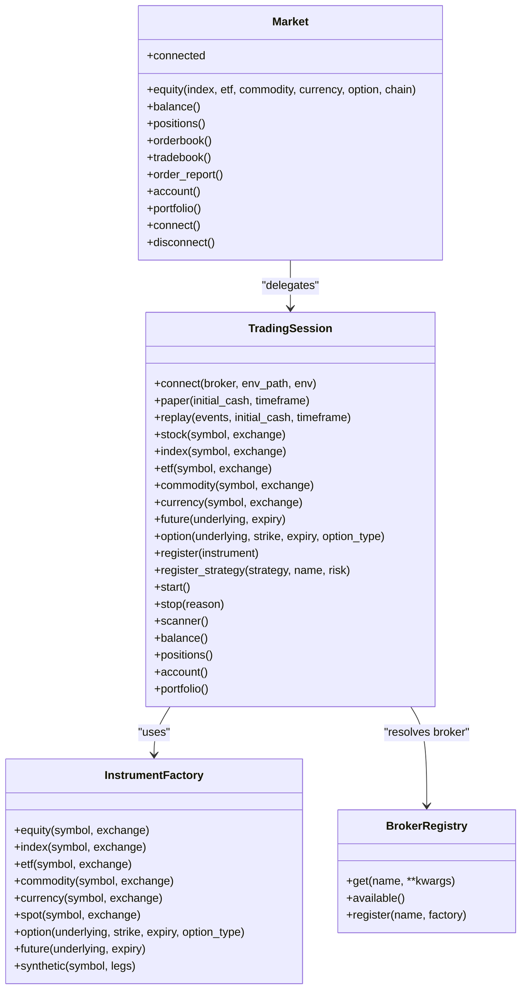
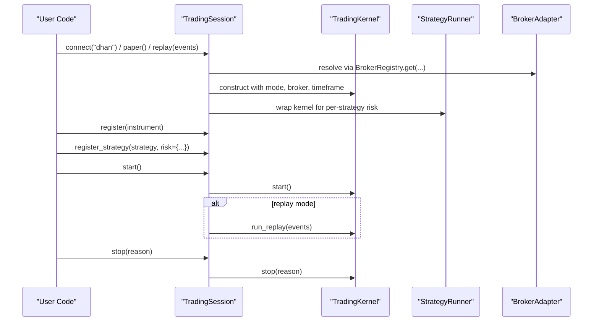
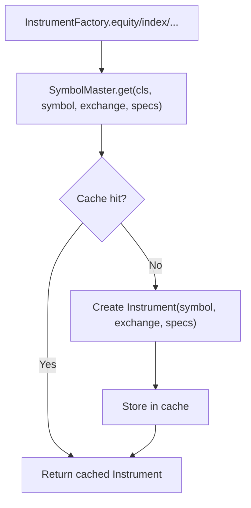
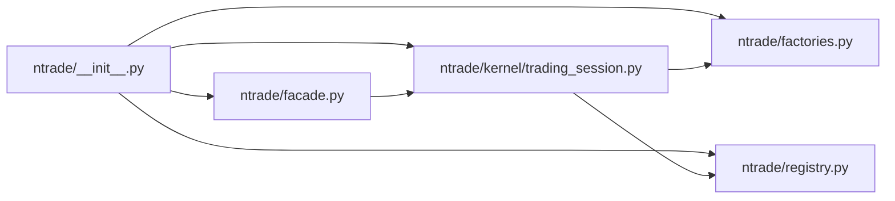

# User Guide Index

<cite>
**Referenced Files in This Document**
- [index.md](file://user-guide/index.md)
- [01-install-brokers.md](file://user-guide/01-install-brokers.md)
- [02-core-journey.md](file://user-guide/02-core-journey.md)
- [03-strategies.md](file://user-guide/03-strategies.md)
- [04-scanners.md](file://user-guide/04-scanners.md)
- [05-risk.md](file://user-guide/05-risk.md)
- [06-simulation.md](file://user-guide/06-simulation.md)
- [07-broker-capabilities.md](file://user-guide/07-broker-capabilities.md)
- [08-options-trading.md](file://user-guide/08-options-trading.md)
- [09-trading-flows.md](file://user-guide/09-trading-flows.md)
- [ARCHITECTURE.md](file://ARCHITECTURE.md)
- [pyproject.toml](file://pyproject.toml)
- [__init__.py](file://ntrade/__init__.py)
- [facade.py](file://ntrade/facade.py)
- [trading_session.py](file://ntrade/kernel/trading_session.py)
- [factories.py](file://ntrade/factories.py)
- [registry.py](file://ntrade/registry.py)
</cite>

## Table of Contents
1. Introduction
2. Project Structure
3. Core Components
4. Architecture Overview
5. Detailed Component Analysis
6. Dependency Analysis
7. Performance Considerations
8. Troubleshooting Guide
9. Conclusion
10. Appendices

## Introduction
This index guides you through the nTrade user documentation, from installation and broker setup to strategies, scanners, risk controls, simulation, options trading, and end-to-end flows. The goal is to help traders use rich domain objects (quotes, history, orders, chains) without dealing with REST endpoints or JSON payloads.

How to read this guide:
- Start with Install & Brokers, then walk the core journey (quotes → history → orders).
- Strategies, scanners, and risk build on that foundation.
- Simulation shows how to prove a strategy offline before going live.
- Deep dives cover Dhan-only capabilities, options trading, and full flows.
- Every example uses TradingSession.paper() unless a live Dhan credential is required.

Quick start (paper — no credentials needed):
- Create a paper session, fetch an index, refresh market data, and print last traded price.

End-to-end journey:
- Install → Connect broker → Build session → Quotes/History/Options → Strategy or Scanner → Risk screen → Execute paper or live → Backtest/Replay/Gate.

**Section sources**
- [index.md:1-55](file://user-guide/index.md#L1-L55)

## Project Structure
The repository organizes code into clear layers: public API, kernel (event-centric), domain (pure Python), brokers (adapters), and infrastructure (transport, persistence, replay). Documentation lives under user-guide/ and covers progressive topics for users.

```mermaid
graph TB
subgraph "Public API"
Facade["Market (legacy facade)"]
Session["TradingSession (unified entry)"]
end
subgraph "Kernel"
Kernel["TradingKernel"]
Runner["StrategyRunner"]
Bus["EventBus"]
end
subgraph "Domain"
Instruments["Instruments (Equity/Index/Future/Option)"]
MarketData["Quote/Tick/Depth/HistoricalSeries"]
Analytics["Indicators/Greeks"]
end
subgraph "Brokers"
Paper["PaperBroker"]
Dhan["DhanBroker"]
end
subgraph "Execution"
SimExec["SimulatedExecution"]
BrokerExec["BrokerExecution"]
end
Facade --> Session
Session --> Kernel
Kernel --> Runner
Kernel --> Bus
Session --> Instruments
Instruments --> MarketData
Instruments --> Analytics
Session --> Paper
Session --> Dhan
Kernel --> SimExec
Kernel --> BrokerExec
```

**Diagram sources**
- [ARCHITECTURE.md:20-51](file://ARCHITECTURE.md#L20-L51)
- [ARCHITECTURE.md:328-365](file://ARCHITECTURE.md#L328-L365)

**Section sources**
- [ARCHITECTURE.md:20-51](file://ARCHITECTURE.md#L20-L51)
- [ARCHITECTURE.md:328-365](file://ARCHITECTURE.md#L328-L365)

## Core Components
Key components exposed to users:
- TradingSession: unified entry point for connect/paper/replay modes; instrument creation; strategy registration; lifecycle control.
- InstrumentFactory: creates shared instruments via SymbolMaster flyweight.
- BrokerRegistry: maps names to broker factories (dhan, paper).
- Market (legacy facade): thin adapter over TradingSession for backward compatibility.
- Public package exports: events, kernels, execution targets, costs, sources, and utilities.

Highlights:
- Zero-parity design: same strategy runs identically across backtest, replay, and live.
- Event-centric kernel: canonical events drive engines and projections.
- Capability pattern: broker-specific features are opt-in and fail fast if unsupported.

**Section sources**
- [trading_session.py:39-143](file://ntrade/kernel/trading_session.py#L39-L143)
- [factories.py:20-67](file://ntrade/factories.py#L20-L67)
- [registry.py:61-90](file://ntrade/registry.py#L61-L90)
- [facade.py:27-101](file://ntrade/facade.py#L27-L101)
- [__init__.py:72-104](file://ntrade/__init__.py#L72-L104)

## Architecture Overview
nTrade follows Clean Architecture principles with layered separation and dependency inversion. The domain layer is pure Python and never imports broker code. Instruments receive a BrokerAdapter via constructor injection and access broker-specific capabilities through a capability facade at call time.



**Diagram sources**
- [trading_session.py:39-143](file://ntrade/kernel/trading_session.py#L39-L143)
- [factories.py:20-67](file://ntrade/factories.py#L20-L67)
- [registry.py:61-90](file://ntrade/registry.py#L61-L90)
- [facade.py:27-101](file://ntrade/facade.py#L27-L101)

## Detailed Component Analysis

### TradingSession
TradingSession is the single entry point for all user workflows. It composes a broker adapter, a TradingKernel, and a StrategyRunner. It exposes constructors for live, paper, and replay modes, instrument creation helpers, account/portfolio accessors, and lifecycle methods.

Key behaviors:
- Mode selection: connect("dhan"), paper(), replay(events).
- Instrument creation: stock/index/etf/commodity/currency/future/option.
- Strategy management: register_strategy with per-strategy risk limits.
- Lifecycle: start() triggers kernel start and optional replay; stop() halts cleanly.
- Scanner facade: lazy initialization for built-in and custom scanners.



**Diagram sources**
- [trading_session.py:73-143](file://ntrade/kernel/trading_session.py#L73-L143)
- [trading_session.py:225-249](file://ntrade/kernel/trading_session.py#L225-L249)

**Section sources**
- [trading_session.py:39-143](file://ntrade/kernel/trading_session.py#L39-L143)
- [trading_session.py:225-249](file://ntrade/kernel/trading_session.py#L225-L249)

### InstrumentFactory and SymbolMaster
InstrumentFactory centralizes object creation and delegates to SymbolMaster for flyweight caching. Repeated lookups return the same instance, ensuring shared metadata, subscriptions, and caches.

Key points:
- Shared instances by (kind, symbol, exchange).
- Option/Future construction sets underlying relationships.
- SyntheticInstrument support for multi-leg constructs.



**Diagram sources**
- [factories.py:20-67](file://ntrade/factories.py#L20-L67)
- [registry.py:16-44](file://ntrade/registry.py#L16-L44)

**Section sources**
- [factories.py:20-67](file://ntrade/factories.py#L20-L67)
- [registry.py:16-44](file://ntrade/registry.py#L16-L44)

### BrokerRegistry
BrokerRegistry maps broker names to factories with thread-safe registration and retrieval. Default brokers are registered lazily when first accessed.

Key points:
- get(name, **kwargs) returns a configured broker instance.
- available() lists supported brokers.
- Unregister_all resets state for test isolation.

**Section sources**
- [registry.py:61-90](file://ntrade/registry.py#L61-L90)
- [registry.py:104-125](file://ntrade/registry.py#L104-L125)

### Legacy Market Facade
Market provides a legacy API that delegates to TradingSession for backward compatibility. All methods map to session equivalents.

**Section sources**
- [facade.py:27-101](file://ntrade/facade.py#L27-L101)

## Dependency Analysis
High-level dependencies between core modules:



**Diagram sources**
- [__init__.py:72-104](file://ntrade/__init__.py#L72-L104)
- [facade.py:27-101](file://ntrade/facade.py#L27-L101)
- [trading_session.py:39-143](file://ntrade/kernel/trading_session.py#L39-L143)
- [factories.py:20-67](file://ntrade/factories.py#L20-L67)
- [registry.py:61-90](file://ntrade/registry.py#L61-L90)

**Section sources**
- [__init__.py:72-104](file://ntrade/__init__.py#L72-L104)
- [facade.py:27-101](file://ntrade/facade.py#L27-L101)
- [trading_session.py:39-143](file://ntrade/kernel/trading_session.py#L39-L143)
- [factories.py:20-67](file://ntrade/factories.py#L20-L67)
- [registry.py:61-90](file://ntrade/registry.py#L61-L90)

## Performance Considerations
- Use paper mode for deterministic, offline development and testing.
- Prefer indicator bundles and cached history to avoid recomputation.
- Keep one session per process; avoid recreating sessions inside loops.
- For live, rely on event-driven updates rather than polling excessively.
- Use synthetic feeds for realistic tick-level simulation without network overhead.

[No sources needed since this section provides general guidance]

## Troubleshooting Guide
Common issues and remedies:
- AttributeError on broker capabilities in paper mode: expected; capabilities are Dhan-only.
- Missing credentials for live Dhan: ensure .env exists and contains required keys.
- Stale quotes/history: call refresh() or force re-download via history parameters.
- Strategy not firing: verify warm-up guards and correct symbol filtering.
- Risk halted unexpectedly: inspect SignalRejectedEvent reasons and adjust limits.

**Section sources**
- [07-broker-capabilities.md:14-31](file://user-guide/07-broker-capabilities.md#L14-L31)
- [01-install-brokers.md:28-33](file://user-guide/01-install-brokers.md#L28-L33)
- [02-core-journey.md:36-51](file://user-guide/02-core-journey.md#L36-L51)
- [03-strategies.md:96-98](file://user-guide/03-strategies.md#L96-L98)
- [05-risk.md:61-72](file://user-guide/05-risk.md#L61-L72)

## Conclusion
This index equips you to navigate nTrade’s user documentation effectively. Start with installation and brokers, master the core journey, write strategies and scanners, apply risk controls, validate via simulation, explore options, and follow end-to-end flows to go live safely.

[No sources needed since this section summarizes without analyzing specific files]

## Appendices

### Installation and Dependencies
- Install the package with pip using editable mode.
- Required dependencies include pandas, numpy, python-dotenv, and Dhan-Tradehull.
- Optional dev dependencies include pytest.

**Section sources**
- [01-install-brokers.md:20-29](file://user-guide/01-install-brokers.md#L20-L29)
- [pyproject.toml:5-15](file://pyproject.toml#L5-L15)

### Quick Reference: Modes and Entry Points
- Preferred entry: TradingSession.connect("dhan") for live, TradingSession.paper() for offline, TradingSession.replay(events) for replay.
- Legacy entry: Market(broker="dhan"/"paper") remains supported.

**Section sources**
- [01-install-brokers.md:58-74](file://user-guide/01-install-brokers.md#L58-L74)
- [facade.py:27-36](file://ntrade/facade.py#L27-L36)