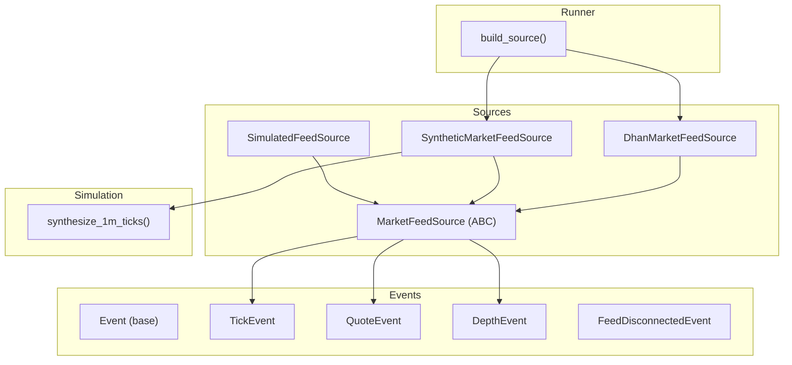
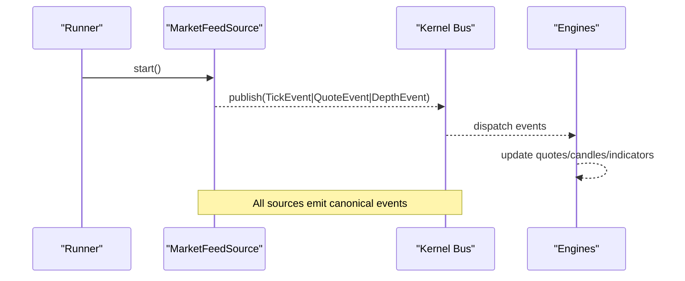
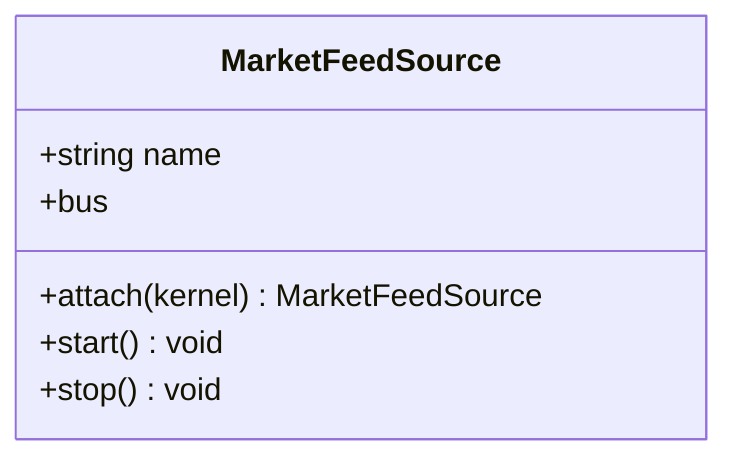
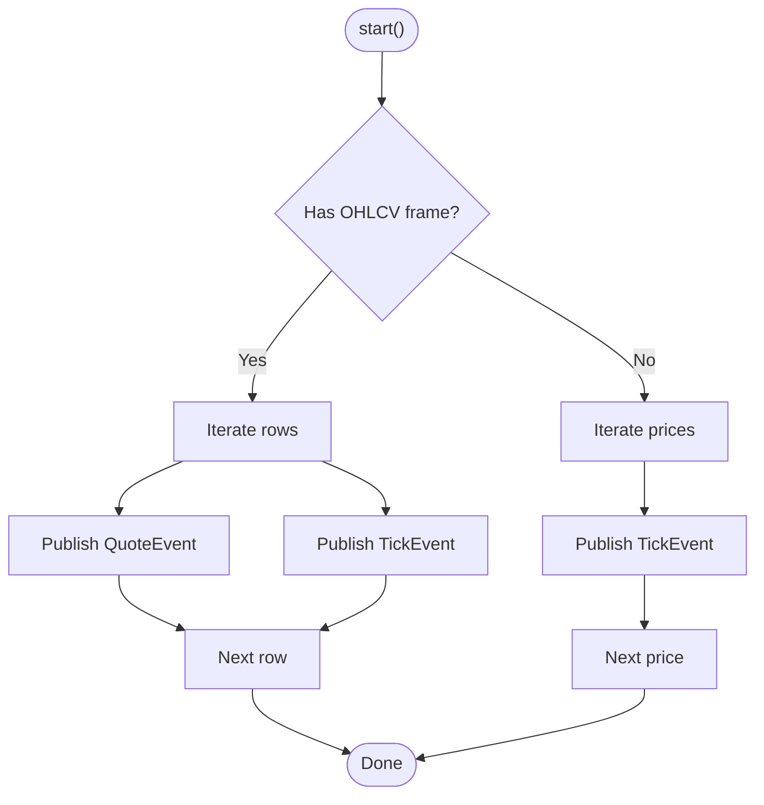
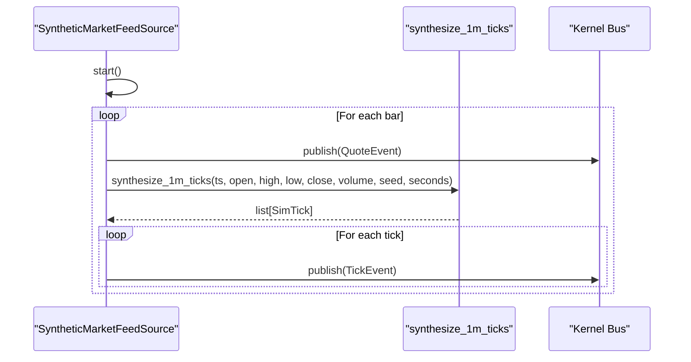
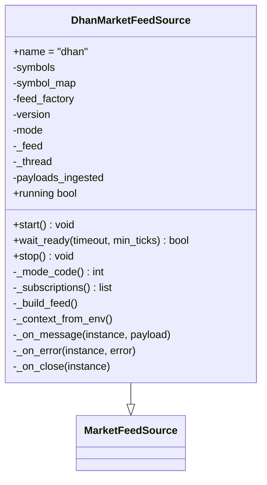
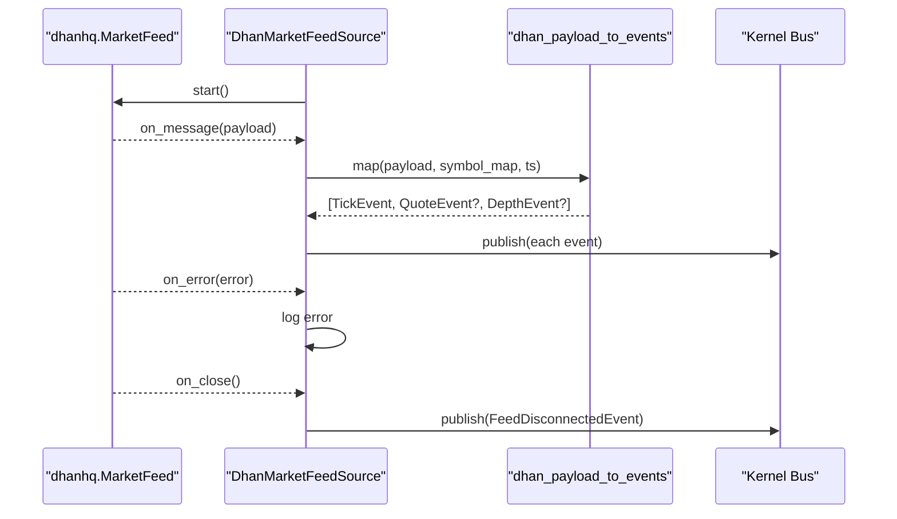
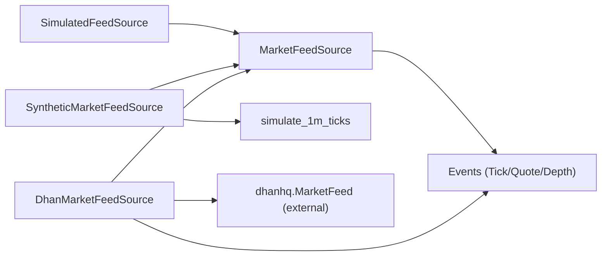
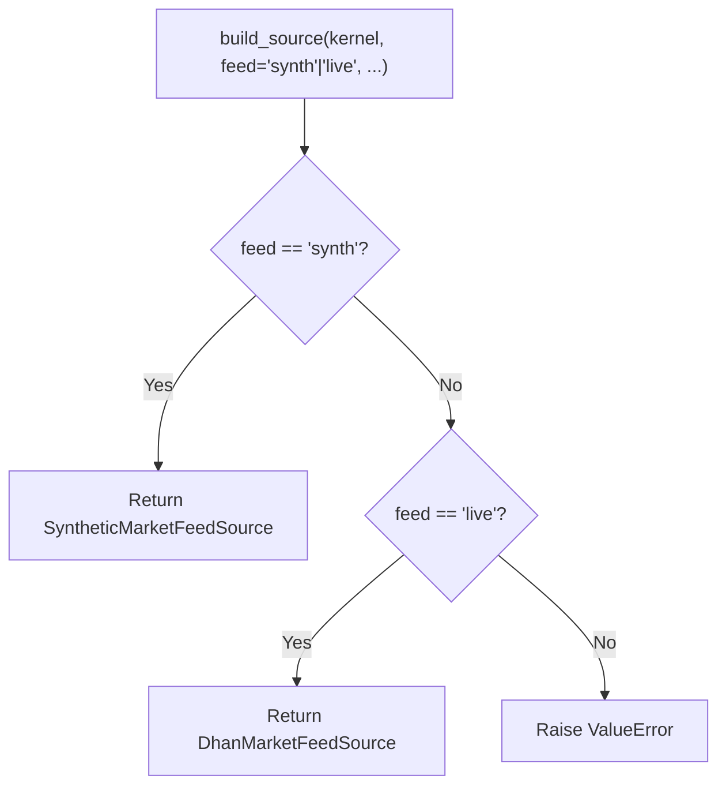

# Feed Sources

<cite>
**Referenced Files in This Document**
- [market_feed.py](file://ntrade/sources/market_feed.py)
- [dhan_feed.py](file://ntrade/sources/dhan_feed.py)
- [synthetic_feed.py](file://ntrade/sources/synthetic_feed.py)
- [market.py](file://ntrade/events/market.py)
- [base.py](file://ntrade/events/base.py)
- [lifecycle.py](file://ntrade/events/lifecycle.py)
- [tick_simulator.py](file://ntrade/sim/tick_simulator.py)
- [feeds.py](file://ntrade/runner/feeds.py)
- [test_sources.py](file://tests/test_sources.py)
- [test_synthetic_feed.py](file://tests/test_synthetic_feed.py)
- [test_dhan_feed_source.py](file://tests/test_dhan_feed_source.py)
</cite>

## Table of Contents
1. [Introduction](#introduction)
2. [Project Structure](#project-structure)
3. [Core Components](#core-components)
4. [Architecture Overview](#architecture-overview)
5. [Detailed Component Analysis](#detailed-component-analysis)
6. [Dependency Analysis](#dependency-analysis)
7. [Performance Considerations](#performance-considerations)
8. [Troubleshooting Guide](#troubleshooting-guide)
9. [Conclusion](#conclusion)
10. [Appendices](#appendices)

## Introduction
This document explains the market data feed sources in nTrade, focusing on the abstract base class that unifies all ingestion implementations and the concrete sources for live streaming, deterministic simulation, and synthetic tick generation from historical OHLCV data. It covers event emission patterns (TickEvent, QuoteEvent), normalization to canonical formats, connection management, multiplexing symbols, reconnection handling, and performance considerations such as memory usage, asynchronous processing, and connection lifecycle.

## Project Structure
The feed source subsystem lives under ntrade/sources and integrates with the kernel’s event bus via canonical events defined in ntrade/events. A small runner helper wires either a synthetic or live feed depending on configuration.

**Diagram sources**
- [market_feed.py:23-45](file://ntrade/sources/market_feed.py#L23-L45)
- [market_feed.py:47-105](file://ntrade/sources/market_feed.py#L47-L105)
- [synthetic_feed.py:19-77](file://ntrade/sources/synthetic_feed.py#L19-L77)
- [dhan_feed.py:98-233](file://ntrade/sources/dhan_feed.py#L98-L233)
- [market.py:11-48](file://ntrade/events/market.py#L11-L48)
- [base.py:16-22](file://ntrade/events/base.py#L16-L22)
- [lifecycle.py:52-57](file://ntrade/events/lifecycle.py#L52-L57)
- [tick_simulator.py:51-82](file://ntrade/sim/tick_simulator.py#L51-L82)
- [feeds.py:6-18](file://ntrade/runner/feeds.py#L6-L18)

**Section sources**
- [market_feed.py:1-105](file://ntrade/sources/market_feed.py#L1-L105)
- [dhan_feed.py:1-233](file://ntrade/sources/dhan_feed.py#L1-L233)
- [synthetic_feed.py:1-77](file://ntrade/sources/synthetic_feed.py#L1-L77)
- [market.py:1-83](file://ntrade/events/market.py#L1-L83)
- [base.py:1-22](file://ntrade/events/base.py#L1-L22)
- [lifecycle.py:1-57](file://ntrade/events/lifecycle.py#L1-L57)
- [tick_simulator.py:1-82](file://ntrade/sim/tick_simulator.py#L1-L82)
- [feeds.py:1-19](file://ntrade/runner/feeds.py#L1-L19)

## Core Components
- MarketFeedSource: Abstract base defining start/stop and kernel attachment; exposes bus for publishing canonical events.
- SimulatedFeedSource: Deterministic tick generator from a price list or OHLCV DataFrame; publishes TickEvent and QuoteEvent per row.
- SyntheticMarketFeedSource: Converts 1-minute OHLCV bars into 1-second ticks using a deterministic simulator; publishes QuoteEvent per bar and TickEvent per second.
- DhanMarketFeedSource: Live WebSocket adapter over dhanhq.MarketFeed; maps payloads to canonical events and manages connection lifecycle.

Key event types:
- TickEvent: single trade/quote print with symbol, exchange, price, quantity, side, kind.
- QuoteEvent: full snapshot including ltp, bid/ask, open/high/low/prev_close, volume, OI.
- DepthEvent: order book snapshot with bids/asks tuples.

All events inherit Event, which provides ts (from TradingClock) and event_id.

**Section sources**
- [market_feed.py:23-45](file://ntrade/sources/market_feed.py#L23-L45)
- [market_feed.py:47-105](file://ntrade/sources/market_feed.py#L47-L105)
- [synthetic_feed.py:19-77](file://ntrade/sources/synthetic_feed.py#L19-L77)
- [dhan_feed.py:98-233](file://ntrade/sources/dhan_feed.py#L98-L233)
- [market.py:11-48](file://ntrade/events/market.py#L11-L48)
- [base.py:16-22](file://ntrade/events/base.py#L16-L22)

## Architecture Overview
The zero-parity design ensures kernels and strategies consume identical events regardless of source. Sources publish to the kernel’s event bus; downstream engines subscribe and process uniformly.

**Diagram sources**
- [market_feed.py:23-45](file://ntrade/sources/market_feed.py#L23-L45)
- [market.py:11-48](file://ntrade/events/market.py#L11-L48)

## Detailed Component Analysis

### MarketFeedSource (Abstract Base)
Responsibilities:
- Provide attach(kernel) and bus property for event publishing.
- Define start() and stop() lifecycle methods.
- Enforce zero-parity by requiring all implementations to publish canonical events.

Design notes:
- Minimal state; defers transport details to subclasses.
- Optional kernel reference enables clock access and bus publishing.

**Diagram sources**
- [market_feed.py:23-45](file://ntrade/sources/market_feed.py#L23-L45)

**Section sources**
- [market_feed.py:23-45](file://ntrade/sources/market_feed.py#L23-L45)

### SimulatedFeedSource
Purpose:
- Deterministic offline feed from either a list of prices or an OHLCV DataFrame.
- Publishes TickEvent per price step; when given OHLCV rows, also publishes QuoteEvent per row.

Behavior:
- start() chooses between _feed_prices() and _feed_frame().
- Optionally advances kernel clock if available.
- Tracks ticks_published.

Usage pattern:
- Construct with prices or data; attach kernel; start(); stop() is no-op.

**Diagram sources**
- [market_feed.py:71-105](file://ntrade/sources/market_feed.py#L71-L105)

**Section sources**
- [market_feed.py:47-105](file://ntrade/sources/market_feed.py#L47-L105)
- [test_sources.py:21-63](file://tests/test_sources.py#L21-L63)

### SyntheticMarketFeedSource
Purpose:
- Convert 1-minute OHLCV bars into 1-second ticks deterministically using synthesize_1m_ticks.
- Publishes one QuoteEvent per bar and multiple TickEvent per bar.

Key features:
- Runs in a background thread; supports join(timeout) and stop().
- Uses seed and seconds parameters to control tick generation.
- Updates kernel clock per tick when available.

**Diagram sources**
- [synthetic_feed.py:37-77](file://ntrade/sources/synthetic_feed.py#L37-L77)
- [tick_simulator.py:51-82](file://ntrade/sim/tick_simulator.py#L51-L82)

**Section sources**
- [synthetic_feed.py:19-77](file://ntrade/sources/synthetic_feed.py#L19-L77)
- [test_synthetic_feed.py:1-63](file://tests/test_synthetic_feed.py#L1-L63)

### DhanMarketFeedSource
Purpose:
- Live WebSocket feed adapter for dhanhq.MarketFeed.
- Maps wire payloads to canonical events via dhan_payload_to_events.
- Manages subscriptions, mode codes, and connection lifecycle.

Key behaviors:
- start() launches feed in a background thread; wait_ready() polls until connected and ingested min ticks.
- stop() closes connection and resets internal state so start() can rebuild feed.
- _on_message normalizes payload and publishes TickEvent, QuoteEvent, and DepthEvent as applicable.
- _on_error logs errors; _on_close emits FeedDisconnectedEvent.

Multiplexing:
- Subscriptions are built from symbols list and mode code; each subscription tuple includes exchange, security_id, and mode code.

Payload mapping:
- Non-dict payloads and unknown securities are skipped safely.
- Malformed numeric fields are coerced to safe defaults.

**Diagram sources**
- [dhan_feed.py:98-233](file://ntrade/sources/dhan_feed.py#L98-L233)
- [market_feed.py:23-45](file://ntrade/sources/market_feed.py#L23-L45)

**Diagram sources**
- [dhan_feed.py:175-233](file://ntrade/sources/dhan_feed.py#L175-L233)
- [dhan_feed.py:38-96](file://ntrade/sources/dhan_feed.py#L38-L96)
- [lifecycle.py:52-57](file://ntrade/events/lifecycle.py#L52-L57)

**Section sources**
- [dhan_feed.py:1-233](file://ntrade/sources/dhan_feed.py#L1-L233)
- [test_dhan_feed_source.py:1-200](file://tests/test_dhan_feed_source.py#L1-L200)
- [test_dhan_feed_source.py:202-294](file://tests/test_dhan_feed_source.py#L202-L294)

### Event Emission Patterns and Normalization
- All sources publish canonical events to the kernel bus.
- TickEvent carries price and optional quantity/side/kind.
- QuoteEvent carries full snapshot fields (ltp, bid/ask, OHLC, volume, OI).
- DepthEvent carries ordered bids/asks as tuples.
- Timestamps come from the kernel clock to ensure replay/live parity.

Normalization:
- dhan_payload_to_events converts broker-specific payloads into canonical events, skipping invalid inputs and coercing malformed fields.
- SimulatedFeedSource constructs events directly from provided data structures.
- SyntheticMarketFeedSource uses deterministic tick synthesis to produce consistent TickEvent sequences per bar.

**Section sources**
- [market.py:11-48](file://ntrade/events/market.py#L11-L48)
- [base.py:16-22](file://ntrade/events/base.py#L16-L22)
- [dhan_feed.py:38-96](file://ntrade/sources/dhan_feed.py#L38-L96)
- [market_feed.py:71-105](file://ntrade/sources/market_feed.py#L71-L105)
- [synthetic_feed.py:52-77](file://ntrade/sources/synthetic_feed.py#L52-L77)

### Implementing Custom Feed Sources
To implement a custom feed source:
- Extend MarketFeedSource and implement start() (and optionally stop()).
- Use self.bus.publish(...) to emit TickEvent, QuoteEvent, and/or DepthEvent.
- Ensure timestamps are sourced from the kernel clock (self.kernel.clock.now()) for parity.
- If integrating with external transports, manage threads and lifecycle similarly to DhanMarketFeedSource.

Example outline:
- Create a subclass with a descriptive name.
- In start(), initialize transport and begin consuming messages asynchronously.
- Map incoming messages to canonical events and publish them.
- Handle disconnects by emitting FeedDisconnectedEvent and updating running state.

**Section sources**
- [market_feed.py:23-45](file://ntrade/sources/market_feed.py#L23-L45)
- [lifecycle.py:52-57](file://ntrade/events/lifecycle.py#L52-L57)

## Dependency Analysis
Sources depend on:
- Events module for canonical event definitions.
- Kernel session for bus and clock access.
- Simulation utilities for deterministic tick generation.
- External transport (dhanhq) for live feeds, abstracted via factory injection.

**Diagram sources**
- [market_feed.py:23-45](file://ntrade/sources/market_feed.py#L23-L45)
- [synthetic_feed.py:19-77](file://ntrade/sources/synthetic_feed.py#L19-L77)
- [dhan_feed.py:98-233](file://ntrade/sources/dhan_feed.py#L98-L233)
- [tick_simulator.py:51-82](file://ntrade/sim/tick_simulator.py#L51-L82)

**Section sources**
- [market_feed.py:1-105](file://ntrade/sources/market_feed.py#L1-L105)
- [synthetic_feed.py:1-77](file://ntrade/sources/synthetic_feed.py#L1-L77)
- [dhan_feed.py:1-233](file://ntrade/sources/dhan_feed.py#L1-L233)
- [tick_simulator.py:1-82](file://ntrade/sim/tick_simulator.py#L1-L82)

## Performance Considerations
- Memory usage:
  - SimulatedFeedSource iterates lists/DataFrames; avoid excessively large frames in memory.
  - SyntheticMarketFeedSource generates per-bar tick lists; keep seconds reasonable (default 60).
  - DhanMarketFeedSource buffers minimal state; avoid retaining large payload histories.
- Connection pooling:
  - DhanMarketFeedSource builds a single feed instance per start; stop() drops cache to allow fresh build.
  - Multiplex subscriptions internally via symbol_map and mode codes.
- Asynchronous processing:
  - DhanMarketFeedSource runs feed in a background thread; use wait_ready() for warmup.
  - SyntheticMarketFeedSource runs in a daemon thread; use join(timeout) for graceful shutdown.
- Event throughput:
  - Prefer batched operations where possible; minimize per-tick overhead in event construction.
  - Ensure kernel clock updates are efficient; only set when needed.

[No sources needed since this section provides general guidance]

## Troubleshooting Guide
Common issues and resolutions:
- Unknown security IDs in DhanMarketFeedSource:
  - Ensure symbol_map contains all expected security_ids; unknown mappings are skipped safely.
- Malformed payloads:
  - dhan_payload_to_events coerces bad numeric fields to safe defaults; verify field names and types.
- Mode validation:
  - DhanMarketFeedSource enforces supported modes; v2 forbids depth-only mode—use full instead.
- Disconnections:
  - FeedDisconnectedEvent is emitted on close; handle reconnect logic at higher layers.
- Synthetic feed timing:
  - Ensure OHLCV frame has valid timestamps and non-empty data; otherwise constructor raises.

**Section sources**
- [dhan_feed.py:128-144](file://ntrade/sources/dhan_feed.py#L128-L144)
- [dhan_feed.py:206-233](file://ntrade/sources/dhan_feed.py#L206-L233)
- [synthetic_feed.py:22-35](file://ntrade/sources/synthetic_feed.py#L22-L35)

## Conclusion
The feed source layer in nTrade provides a clean abstraction for diverse market data origins while preserving zero-parity across live, simulated, and synthetic scenarios. By standardizing event emission and normalization, strategies and engines remain agnostic to the underlying transport. The documented components and patterns enable robust, testable, and performant data ingestion pipelines.

[No sources needed since this section summarizes without analyzing specific files]

## Appendices

### Quick Wiring Example
Use the runner helper to select synthetic or live feed based on configuration.

**Diagram sources**
- [feeds.py:6-18](file://ntrade/runner/feeds.py#L6-L18)

**Section sources**
- [feeds.py:1-19](file://ntrade/runner/feeds.py#L1-L19)