# Historical Data

<cite>
**Referenced Files in This Document**
- [history.py](file://ntrade/domain/market/history.py)
- [candles.py](file://ntrade/domain/market/candles.py)
- [market_feed.py](file://ntrade/sources/market_feed.py)
- [dhan_feed.py](file://ntrade/sources/dhan_feed.py)
- [event_store.py](file://ntrade/storage/event_store.py)
- [candle_engine.py](file://ntrade/engines/candle_engine.py)
- [simulator.py](file://ntrade/backtest/simulator.py)
- [indicators.py](file://ntrade/domain/analytics/indicators.py)
- [base.py](file://ntrade/brokers/base.py)
- [dhan.py](file://ntrade/brokers/dhan.py)
- [replay_engine.py](file://ntrade/replay/replay_engine.py)
- [tick_simulator.py](file://ntrade/sim/tick_simulator.py)
- [test_history_stream.py](file://tests/test_history_stream.py)
- [dhan_mapper.py](file://ntrade/brokers/dhan_mapper.py)
- [test_candle_timezone.py](file://tests/test_candle_timezone.py)
- [test_dhan_transport.py](file://tests/test_dhan_transport.py)
</cite>

## Update Summary
**Changes Made**
- Enhanced DhanMapper.resample_history() documentation with comprehensive K-025 alignment details
- Added detailed cross-path parity validation between HistoricalSeries.resample() and DhanMapper.resample_history()
- Updated night-session handling documentation with specific test cases for calendar day boundaries
- Expanded validation section with new test coverage for right-edge labeling convention
- Added comprehensive examples of 2m/4m interval grid divergence behavior

## Table of Contents
1. Introduction
2. Project Structure
3. Core Components
4. Architecture Overview
5. Detailed Component Analysis
6. Dependency Analysis
7. Performance Considerations
8. Troubleshooting Guide
9. Conclusion
10. Appendices

## Introduction
This document explains how nTrade retrieves, normalizes, caches, and consumes historical market data. It covers timeframe resampling from tick to OHLCV candles, caching strategies (in-memory and disk-backed event store), intelligent refresh and invalidation, integration with live streaming for seamless continuity, normalization of broker-specific formats into canonical domain objects, and practical usage patterns for backtesting, indicator computation, and synthetic price generation. It also addresses performance techniques such as lazy loading, chunked processing, and memory management, plus data quality validation and gap detection mechanisms.

## Project Structure
Historical data flows through a layered architecture:
- Domain models encapsulate OHLCV series and typed candle wrappers.
- Broker adapters normalize raw broker responses into canonical CandleSeries.
- Engines aggregate ticks into closed candles and publish events.
- Sources provide both live and simulated feeds that emit canonical events.
- Storage persists events for deterministic replay and recovery.
- Backtest engine replays historical bars through the same kernel used in live trading.

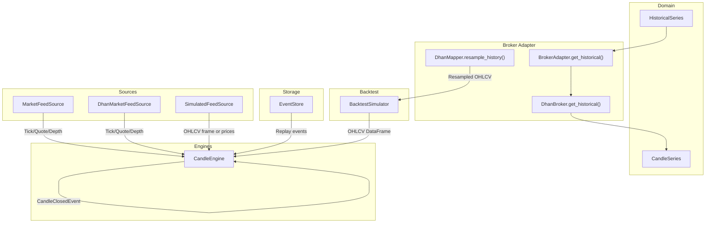

**Diagram sources**
- [history.py:14-149](file://ntrade/domain/market/history.py#L14-L149)
- [candles.py:18-67](file://ntrade/domain/market/candles.py#L18-L67)
- [base.py:83-90](file://ntrade/brokers/base.py#L83-90)
- [dhan.py:189-257](file://ntrade/brokers/dhan.py#L189-L257)
- [candle_engine.py:19-82](file://ntrade/engines/candle_engine.py#L19-L82)
- [market_feed.py:23-105](file://ntrade/sources/market_feed.py#L23-L105)
- [dhan_feed.py:98-233](file://ntrade/sources/dhan_feed.py#L98-L233)
- [event_store.py:76-236](file://ntrade/storage/event_store.py#L76-236)
- [simulator.py:58-220](file://ntrade/backtest/simulator.py#L58-L220)
- [dhan_mapper.py:101-147](file://ntrade/brokers/dhan_mapper.py#L101-L147)

**Section sources**
- [history.py:14-149](file://ntrade/domain/market/history.py#L14-L149)
- [candles.py:18-67](file://ntrade/domain/market/candles.py#L18-67)
- [base.py:83-90](file://ntrade/brokers/base.py#L83-90)
- [dhan.py:189-257](file://ntrade/brokers/dhan.py#L189-L257)
- [candle_engine.py:19-82](file://ntrade/engines/candle_engine.py#L19-L82)
- [market_feed.py:23-105](file://ntrade/sources/market_feed.py#L23-L105)
- [dhan_feed.py:98-233](file://ntrade/sources/dhan_feed.py#L98-L233)
- [event_store.py:76-236](file://ntrade/storage/event_store.py#L76-236)
- [simulator.py:58-220](file://ntrade/backtest/simulator.py#L58-L220)

## Core Components
- HistoricalSeries: A pandas-backed, instrument-attached series with lazy fetch, cache freshness checks, resampling, and live merge capabilities.
- CandleSeries: A domain-typed wrapper around an OHLCV DataFrame returned by brokers, preserving DataFrame interop while enforcing schema.
- BrokerAdapter.get_historical(): Abstract contract for fetching normalized OHLCV; DhanBroker implements it with timeframe routing and normalization.
- CandleEngine: Aggregates TickEvents into closed candles per timeframe and publishes CandleClosedEvent.
- MarketFeedSource and implementations: Provide canonical events from live websockets, simulated frames, or price lists.
- EventStore: Append-only JSONL storage for deterministic replay and crash recovery.
- BacktestSimulator: Runs the same kernel over historical OHLCV frames, publishing QuoteEvent and TickEvent per bar.
- Indicators: Pure functions computing standard indicators over OHLCV frames.
- DhanMapper: Handles broker-specific resampling with K-025 aligned timestamp conventions.

**Section sources**
- [history.py:14-149](file://ntrade/domain/market/history.py#L14-L149)
- [candles.py:18-67](file://ntrade/domain/market/candles.py#L18-67)
- [base.py:83-90](file://ntrade/brokers/base.py#L83-90)
- [dhan.py:189-257](file://ntrade/brokers/dhan.py#L189-L257)
- [candle_engine.py:19-82](file://ntrade/engines/candle_engine.py#L19-L82)
- [market_feed.py:23-105](file://ntrade/sources/market_feed.py#L23-L105)
- [event_store.py:76-236](file://ntrade/storage/event_store.py#L76-236)
- [simulator.py:58-220](file://ntrade/backtest/simulator.py#L58-L220)
- [indicators.py:148-194](file://ntrade/domain/analytics/indicators.py#L148-L194)
- [dhan_mapper.py:101-147](file://ntrade/brokers/dhan_mapper.py#L101-L147)

## Architecture Overview
The system maintains zero-parity across live, replay, and backtest modes by emitting canonical events. Historical data is fetched via broker adapters, normalized into CandleSeries, optionally resampled with K-025 aligned timestamps, merged with live ticks, and consumed by engines and analytics.

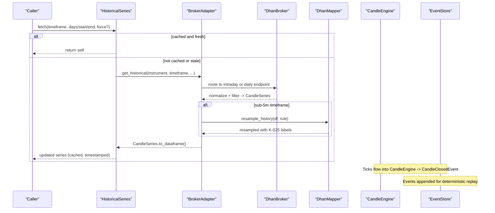

**Diagram sources**
- [history.py:52-88](file://ntrade/domain/market/history.py#L52-L88)
- [base.py:83-90](file://ntrade/brokers/base.py#L83-90)
- [dhan.py:189-257](file://ntrade/brokers/dhan.py#L189-L257)
- [dhan_mapper.py:101-147](file://ntrade/brokers/dhan_mapper.py#L101-L147)
- [candle_engine.py:38-82](file://ntrade/engines/candle_engine.py#L38-L82)
- [event_store.py:89-114](file://ntrade/storage/event_store.py#L89-114)

## Detailed Component Analysis

### HistoricalSeries: Fetching, Caching, Resampling, Live Merge
- Lazy fetch with cache keyed by timeframe and freshness window.
- Force-refresh and download methods bypass cache.
- Resample aggregates OHLCV into coarser timeframes using first/open, max/high, min/low, last/close, sum(volume, oi).
- Live merge converts incoming ticks into single-print candle rows and merges safely.

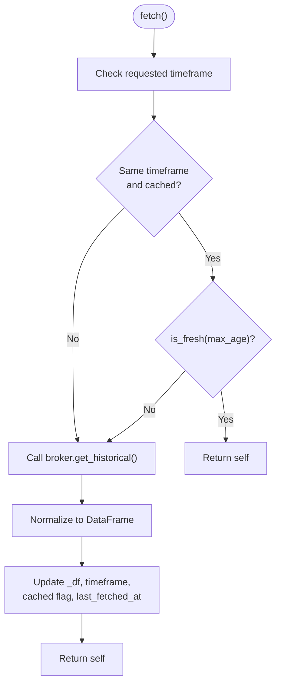

**Diagram sources**
- [history.py:52-88](file://ntrade/domain/market/history.py#L52-L88)
- [history.py:116-124](file://ntrade/domain/market/history.py#L116-124)
- [history.py:91-114](file://ntrade/domain/market/history.py#L91-114)

**Section sources**
- [history.py:25-88](file://ntrade/domain/market/history.py#L25-88)
- [history.py:91-124](file://ntrade/domain/market/history.py#L91-124)

### CandleSeries: Normalized OHLCV Wrapper
- Enforces schema: timestamp, open, high, low, close, volume.
- Provides escape hatch to underlying DataFrame while keeping domain boundary intact.

**Section sources**
- [candles.py:18-67](file://ntrade/domain/market/candles.py#L18-67)

### BrokerAdapter and DhanBroker: Timeframe Routing and Normalization
- BrokerAdapter defines get_historical returning CandleSeries.
- DhanBroker maps user timeframes to provider intervals, routes DAY requests for FUT-type contracts to long-term endpoint, normalizes columns, filters by date/time windows, and returns CandleSeries.

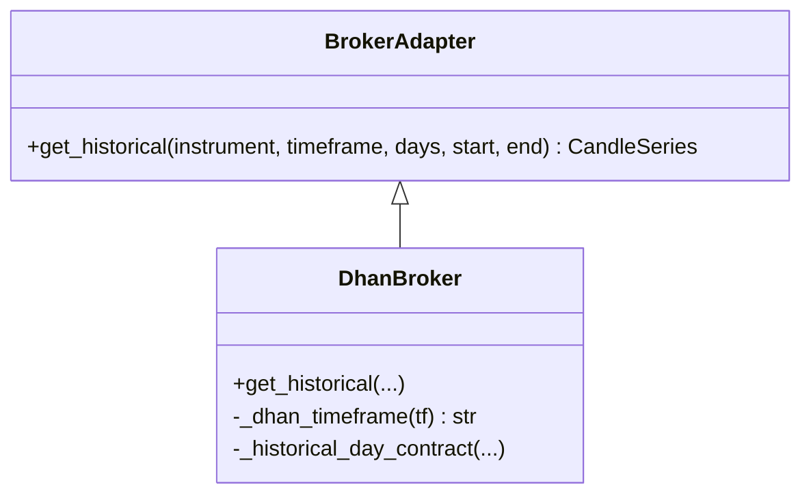

**Diagram sources**
- [base.py:83-90](file://ntrade/brokers/base.py#L83-90)
- [dhan.py:189-257](file://ntrade/brokers/dhan.py#L189-L257)

**Section sources**
- [base.py:83-90](file://ntrade/brokers/base.py#L83-90)
- [dhan.py:189-257](file://ntrade/brokers/dhan.py#L189-L257)

### CandleEngine: Tick-to-Candle Aggregation
- Subscribes to TickEvent, buckets by timeframe, updates open/high/low/close/volume, and publishes CandleClosedEvent when a new bucket starts.
- Supports flushing partial candles at session end.
- Uses closed="left" bin membership with right-edge labeling for consistent timestamp assignment.
- Implements UTC-pinned bucketing for timezone-independent operation.

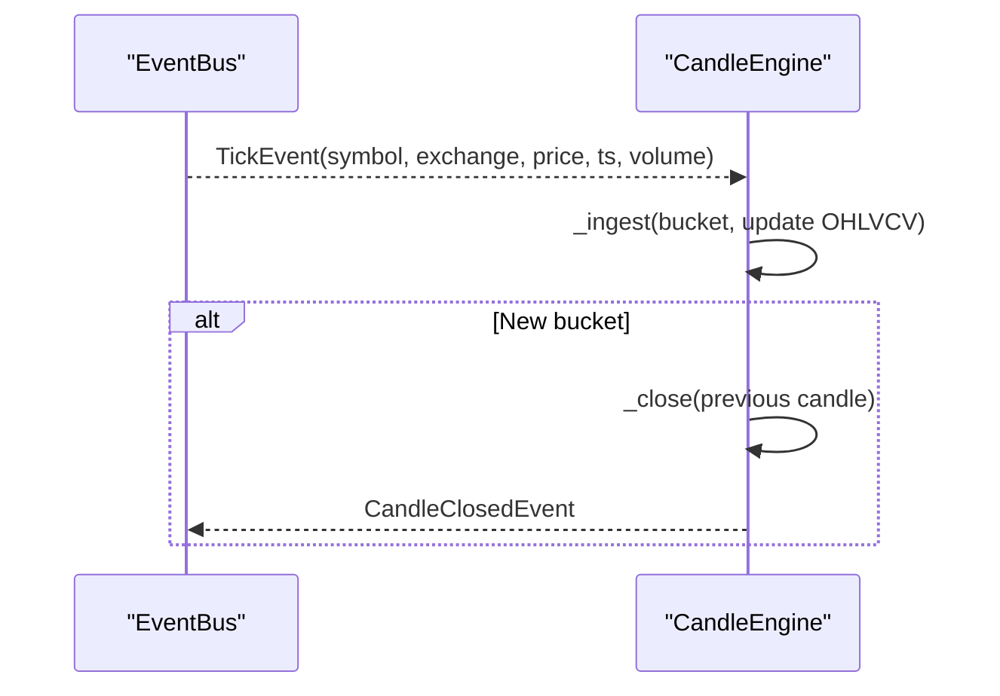

**Diagram sources**
- [candle_engine.py:38-82](file://ntrade/engines/candle_engine.py#L38-L82)

**Section sources**
- [candle_engine.py:19-82](file://ntrade/engines/candle_engine.py#L19-L82)

### MarketFeedSource and Implementations: Zero-Parity Event Emission
- SimulatedFeedSource emits QuoteEvent and TickEvent from either a price list or OHLCV DataFrame.
- DhanMarketFeedSource translates wire payloads into canonical events and publishes them.

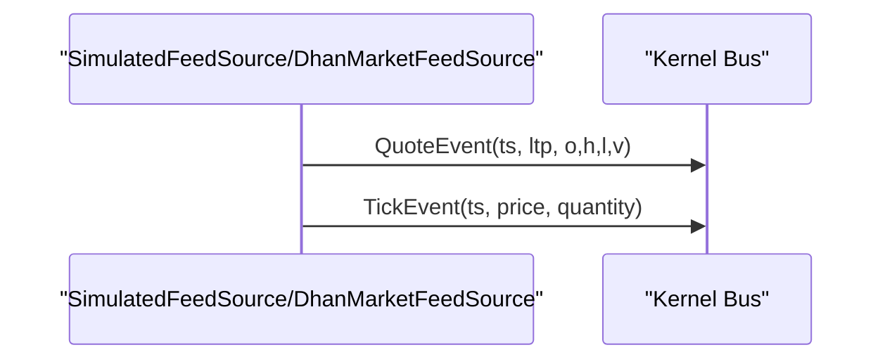

**Diagram sources**
- [market_feed.py:47-105](file://ntrade/sources/market_feed.py#L47-L105)
- [dhan_feed.py:98-233](file://ntrade/sources/dhan_feed.py#L98-L233)

**Section sources**
- [market_feed.py:23-105](file://ntrade/sources/market_feed.py#L23-L105)
- [dhan_feed.py:98-233](file://ntrade/sources/dhan_feed.py#L98-L233)

### EventStore: Append-Only Replay and Recovery
- Persists events to JSONL (optional path), supports querying, replay, and recovery sequences.
- recovery_events sorts by timestamp then append order to preserve causality.

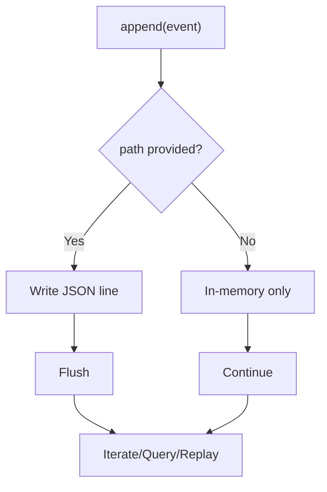

**Diagram sources**
- [event_store.py:89-114](file://ntrade/storage/event_store.py#L89-114)
- [event_store.py:183-210](file://ntrade/storage/event_store.py#L183-210)

**Section sources**
- [event_store.py:76-236](file://ntrade/storage/event_store.py#L76-236)

### BacktestSimulator: Running Over Historical Bars
- Iterates OHLCV DataFrame, sets clock, publishes QuoteEvent and TickEvent per bar, tracks equity curve, and computes results including costs and drawdown.

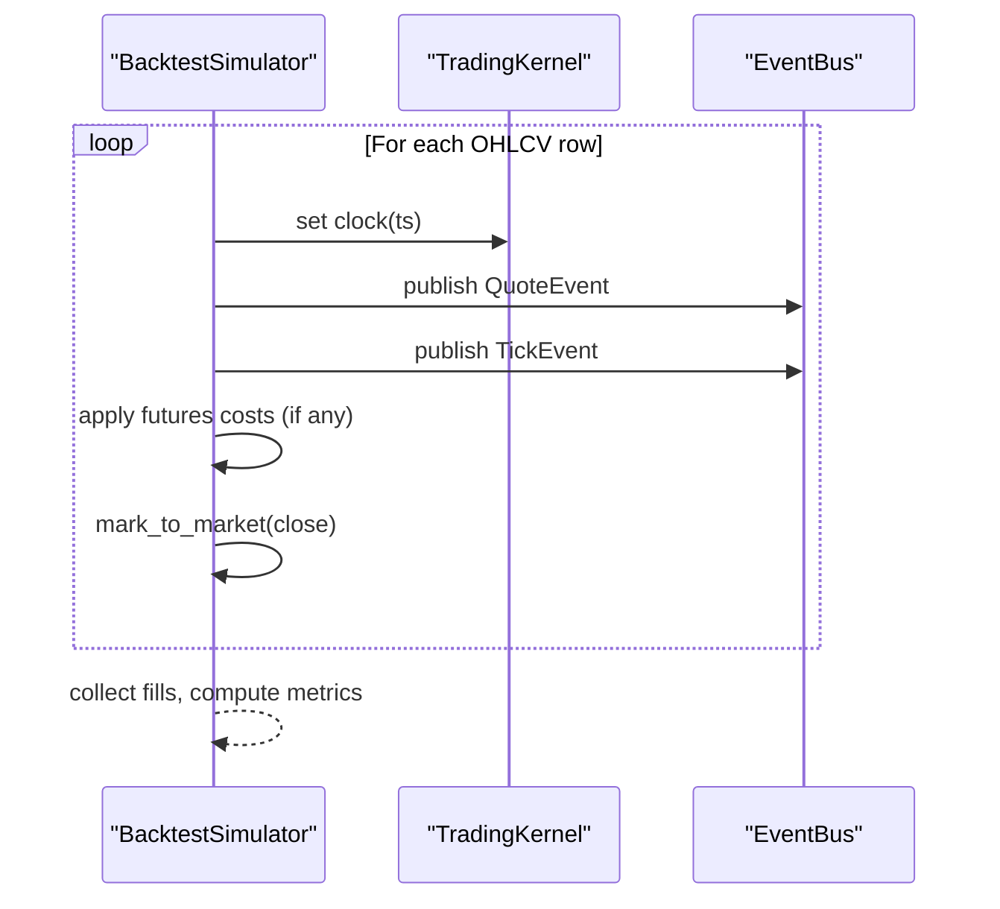

**Diagram sources**
- [simulator.py:116-143](file://ntrade/backtest/simulator.py#L116-143)
- [simulator.py:145-191](file://ntrade/backtest/simulator.py#L145-191)

**Section sources**
- [simulator.py:58-220](file://ntrade/backtest/simulator.py#L58-L220)

### Indicators: Computing on Historical Series
- Bundle function computes RSI, ATR, VWAP, SuperTrend, EMA/SMA variants over the latest completed candle.
- HistoricalSeries.indicators delegates to this bundle.

**Section sources**
- [indicators.py:148-194](file://ntrade/domain/analytics/indicators.py#L148-L194)
- [history.py:126-129](file://ntrade/domain/market/history.py#L126-129)

### Synthetic Price Paths: Deterministic Tick Generation
- synthesize_1m_ticks generates one-second ticks from a 1-minute OHLCV bar respecting open/close anchors, high/low bounds, and total volume.

**Section sources**
- [tick_simulator.py:178-208](file://ntrade/sim/tick_simulator.py#L178-208)

### HistoricalSeries.resample(): K-025 Alignment with CandleEngine Bucketing
**Updated** The resample method now ensures perfect parity between backtest and live environments through precise timestamp labeling alignment with CandleEngine's closed-candle convention.

- **Label Convention**: Uses `label='right'` with `closed='left'` to match CandleEngine's bucketing logic where timestamps are labeled at the end-of-bar (right edge) rather than the beginning (left edge).
- **Bucket Membership**: Maintains `closed='left'` to ensure bins don't shift, preserving the same bin membership as CandleEngine's `_bucket()` method.
- **Timestamp Labeling**: Labels bars at the RIGHT edge (bin start + span) to match CandleEngine's closed-candle labels which use `bucket + seconds` formula.
- **Timezone Handling**: Index stays timezone-naive like the engine treats it, ensuring consistency across different environments.
- **Aggregation Functions**: Applies first/open, max/high, min/low, last/close for OHLCV fields and sum for volume/OI fields.

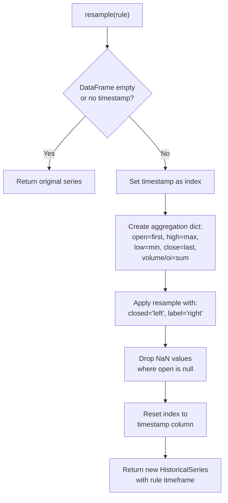

**Diagram sources**
- [history.py:122-136](file://ntrade/domain/market/history.py#L122-136)

**Section sources**
- [history.py:122-136](file://ntrade/domain/market/history.py#L122-136)

### DhanMapper.resample_history(): Broker-Specific Resampling with K-025 Alignment
**Updated** The DhanMapper.resample_history method applies the same K-025 aligned timestamp conventions for broker-specific resampling operations with comprehensive validation.

- **IST Origin Anchoring**: Uses 09:15 IST market open as origin to keep night-session candles within their calendar day.
- **K-025 Parity**: Applies `closed='left', label='right'` to match CandleEngine's bucketing convention.
- **Grid Parity Considerations**: Exact grid parity with CandleEngine holds only for 3m intervals due to epoch alignment; 2m/4m intervals sit 1-3min off the engine's epoch grid by design.
- **Night Session Handling**: Preserves calendar day boundaries for night sessions while maintaining right-edge labeling.
- **Cross-Path Validation**: Comprehensive tests ensure parity between HistoricalSeries.resample() and DhanMapper.resample_history() implementations.

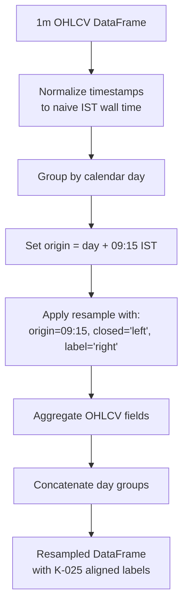

**Diagram sources**
- [dhan_mapper.py:101-147](file://ntrade/brokers/dhan_mapper.py#L101-L147)

**Section sources**
- [dhan_mapper.py:101-147](file://ntrade/brokers/dhan_mapper.py#L101-L147)

## Dependency Analysis
Key dependencies and interactions:
- HistoricalSeries depends on Instrument.broker_adapter to fetch data.
- DhanBroker depends on DhanTransport and DhanMapper for API calls and normalization.
- CandleEngine subscribes to TickEvent and publishes CandleClosedEvent.
- MarketFeedSource implementations depend on kernel bus to publish canonical events.
- EventStore depends on event types from lifecycle, market, order, portfolio, risk modules.
- BacktestSimulator depends on TradingKernel, SimulationClock, and cost models.
- DhanMapper provides resampling utilities with K-025 aligned timestamp conventions.

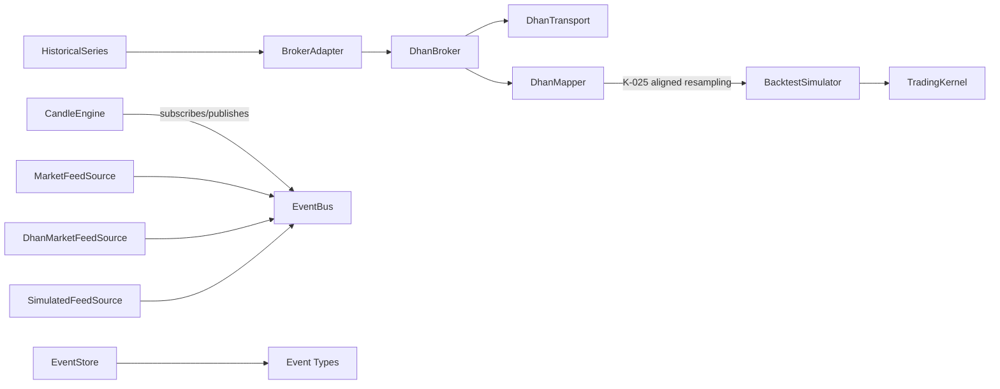

**Diagram sources**
- [history.py:52-88](file://ntrade/domain/market/history.py#L52-88)
- [base.py:83-90](file://ntrade/brokers/base.py#L83-90)
- [dhan.py:189-257](file://ntrade/brokers/dhan.py#L189-L257)
- [candle_engine.py:29-82](file://ntrade/engines/candle_engine.py#L29-82)
- [market_feed.py:23-105](file://ntrade/sources/market_feed.py#L23-L105)
- [dhan_feed.py:98-233](file://ntrade/sources/dhan_feed.py#L98-L233)
- [event_store.py:16-29](file://ntrade/storage/event_store.py#L16-29)
- [simulator.py:58-109](file://ntrade/backtest/simulator.py#L58-L109)
- [dhan_mapper.py:101-147](file://ntrade/brokers/dhan_mapper.py#L101-L147)

**Section sources**
- [history.py:52-88](file://ntrade/domain/market/history.py#L52-88)
- [base.py:83-90](file://ntrade/brokers/base.py#L83-90)
- [dhan.py:189-257](file://ntrade/brokers/dhan.py#L189-L257)
- [candle_engine.py:29-82](file://ntrade/engines/candle_engine.py#L29-82)
- [market_feed.py:23-105](file://ntrade/sources/market_feed.py#L23-L105)
- [dhan_feed.py:98-233](file://ntrade/sources/dhan_feed.py#L98-L233)
- [event_store.py:16-29](file://ntrade/storage/event_store.py#L16-29)
- [simulator.py:58-109](file://ntrade/backtest/simulator.py#L58-L109)

## Performance Considerations
- Lazy loading: HistoricalSeries.fetch defers network calls until needed and caches by timeframe.
- Chunked processing: DhanBroker's long-term historical endpoints can be called with date ranges; filtering occurs post-fetch.
- Memory management: EventStore writes to JSONL incrementally; use clear/close to release resources.
- Efficient resampling: Pandas resample with aggregated functions minimizes overhead.
- Deterministic replay: EventStore sorts by timestamp and append index to avoid OOM during replay by limiting history where applicable.
- **K-025 Optimization**: The aligned resample operation eliminates timestamp conversion overhead by using consistent labeling conventions across backtest and live environments.
- **IST Origin Efficiency**: DhanMapper's 09:15 IST origin avoids timezone conversions for night-session handling.

## Troubleshooting Guide
Common issues and resolutions:
- Empty or stale history: Use refresh/download to force re-fetch; verify timeframe matches cached timeframe.
- Missing columns after merge: Ensure tick_df contains timestamp and OHLCV fields; live_merge enforces schema.
- Unsupported timeframe: DhanBroker raises on unsupported intervals; use supported values.
- Replay divergence: Ensure recovery_events uses correct sort key (ts, append index) to maintain causality.
- Indicator failures: compute_bundle logs warnings; check input DataFrame has required columns.
- **Resample timestamp mismatch**: If resampled timestamps don't match expected CandleEngine labels, verify the resample uses `closed='left', label='right'` configuration for K-025 parity.
- **Night session issues**: For DhanMapper resampling, ensure timestamps are properly normalized to naive IST wall time before grouping by calendar day.
- **Grid parity confusion**: Remember that exact grid parity with CandleEngine only holds for 3m intervals; 2m/4m intervals intentionally diverge due to 09:15 IST origin anchoring.

**Section sources**
- [history.py:52-88](file://ntrade/domain/market/history.py#L52-88)
- [history.py:91-114](file://ntrade/domain/market/history.py#L91-114)
- [dhan.py:732-745](file://ntrade/brokers/dhan.py#L732-745)
- [event_store.py:183-210](file://ntrade/storage/event_store.py#L183-210)
- [indicators.py:148-194](file://ntrade/domain/analytics/indicators.py#L148-L194)
- [dhan_mapper.py:113-117](file://ntrade/brokers/dhan_mapper.py#L113-117)

## Conclusion
nTrade's historical data subsystem provides robust, zero-parity access across live, replay, and backtest environments. HistoricalSeries offers flexible caching and resampling with K-025 alignment ensuring perfect timestamp parity between environments, DhanBroker ensures normalized and filtered OHLCV data, CandleEngine builds real-time candles, and EventStore enables deterministic replay. Together with indicators and synthetic tick generation, these components form a cohesive foundation for reliable data-driven trading systems.

## Appendices

### Usage Examples and Patterns
- Loading historical data for backtesting:
  - Use BacktestSimulator.run with an OHLCV DataFrame; it publishes QuoteEvent and TickEvent per bar.
- Calculating technical indicators:
  - Use HistoricalSeries.indicators(params) to compute a bundle over the current series.
- Generating synthetic price paths:
  - Use synthesize_1m_ticks to create deterministic 1-second ticks from a 1-minute OHLCV bar.
- **Resampling with K-025 parity**:
  - Use `series.resample("15min")` to resample to coarser timeframes with timestamps aligned to CandleEngine's closed-candle labeling convention.
- **Broker-specific resampling**:
  - Use `DhanMapper.resample_history(df, "3min")` for sub-5m timeframes with IST-origin anchoring and K-025 aligned labels.

**Section sources**
- [simulator.py:116-143](file://ntrade/backtest/simulator.py#L116-143)
- [history.py:126-129](file://ntrade/domain/market/history.py#L126-129)
- [tick_simulator.py:178-208](file://ntrade/sim/tick_simulator.py#L178-208)
- [dhan_mapper.py:101-147](file://ntrade/brokers/dhan_mapper.py#L101-L147)

### Data Quality Validation and Gap Detection
- Validate presence of timestamp and OHLCV columns before resampling or merging.
- Detect gaps by checking consecutive timestamps and ensuring no missing intervals; consider filling or flagging gaps prior to analysis.
- Use EventStore.recovery_events to reconstruct causal sequences and identify missing market events.
- **K-025 Validation**: Verify resampled timestamps align with CandleEngine labels using the formula: `datetime.fromtimestamp(engine._bucket(t) + engine.seconds, tz=timezone.utc).replace(tzinfo=None)`
- **Night Session Validation**: Ensure resampled night-session candles remain within their calendar day boundaries.
- **Cross-Path Parity Validation**: Test that both HistoricalSeries.resample() and DhanMapper.resample_history() produce consistent right-edge labeling conventions.

**Section sources**
- [history.py:116-124](file://ntrade/domain/market/history.py#L116-124)
- [event_store.py:183-210](file://ntrade/storage/event_store.py#L183-210)
- [dhan_mapper.py:127-140](file://ntrade/brokers/dhan_mapper.py#L127-140)

### Integration Between Historical Data and Live Streaming
- HistoricalSeries.live_merge integrates live ticks into existing candles, maintaining schema and deduplication.
- MarketFeedSource implementations ensure canonical events are published regardless of source (live websocket, simulated feed, or replay).
- **K-025 Consistency**: Both historical resampling and live candle generation use the same timestamp labeling convention, ensuring seamless transitions between backtested and live data.

**Section sources**
- [history.py:91-114](file://ntrade/domain/market/history.py#L91-114)
- [market_feed.py:47-105](file://ntrade/sources/market_feed.py#L47-L105)
- [dhan_feed.py:98-233](file://ntrade/sources/dhan_feed.py#L98-L233)

### Tests and Validation References
- HistoricalSeries behavior and live merge correctness validated in tests.
- **K-025 Parity Tests**: Comprehensive validation ensures resampled timestamps match CandleEngine's closed-candle labels exactly.
- **Timezone Independence Tests**: Validates UTC-pinned bucketing and consistent labeling across different host timezones.
- **Night Session Tests**: Ensures proper calendar day grouping for night-session candles.
- **Cross-Path Parity Tests**: Verifies that both resample implementations share the same right-edge labeling convention.

**Section sources**
- [test_history_stream.py:13-70](file://tests/test_history_stream.py#L13-70)
- [test_history_stream.py:107-148](file://tests/test_history_stream.py#L107-148)
- [test_history_stream.py:150-205](file://tests/test_history_stream.py#L150-205)
- [test_candle_timezone.py:32-55](file://tests/test_candle_timezone.py#L32-55)
- [test_dhan_transport.py:156-216](file://tests/test_dhan_transport.py#L156-216)

### K-025 Technical Implementation Details
The K-025 alignment ensures perfect parity between backtest and live environments through consistent timestamp labeling:

- **CandleEngine Bucketing**: Uses `epoch - (epoch % seconds)` for bucket calculation and labels at `bucket + seconds` (right edge).
- **HistoricalSeries Resampling**: Mirrors this behavior with `pandas.resample(rule, closed='left', label='right')`.
- **DhanMapper Resampling**: Applies the same convention with IST-origin anchoring for broker-specific resampling operations.
- **Validation**: Tests verify that resampled timestamps equal `engine_labels = [datetime.fromtimestamp(engine._bucket(t) + engine.seconds, tz=timezone.utc).replace(tzinfo=None) for t in timestamps]`.
- **Grid Parity Notes**: Exact grid parity with CandleEngine holds only for 3m intervals; 2m/4m intervals intentionally sit 1-3min off the engine's epoch grid to maintain calendar day boundaries.
- **Right-Edge Convention**: Both implementations consistently label bars at the bin's right edge (bin start + span), ensuring semantic consistency even when grids diverge.

**Section sources**
- [history.py:129-135](file://ntrade/domain/market/history.py#L129-135)
- [dhan_mapper.py:130-140](file://ntrade/brokers/dhan_mapper.py#L130-140)
- [test_history_stream.py:150-205](file://tests/test_history_stream.py#L150-205)
- [test_candle_timezone.py:32-55](file://tests/test_candle_timezone.py#L32-55)
- [test_dhan_transport.py:156-216](file://tests/test_dhan_transport.py#L156-216)