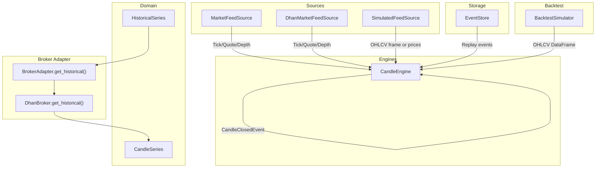
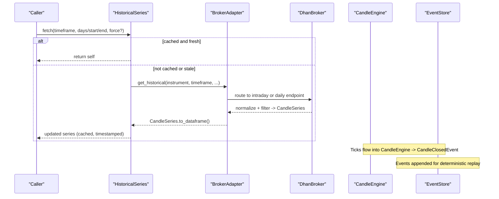
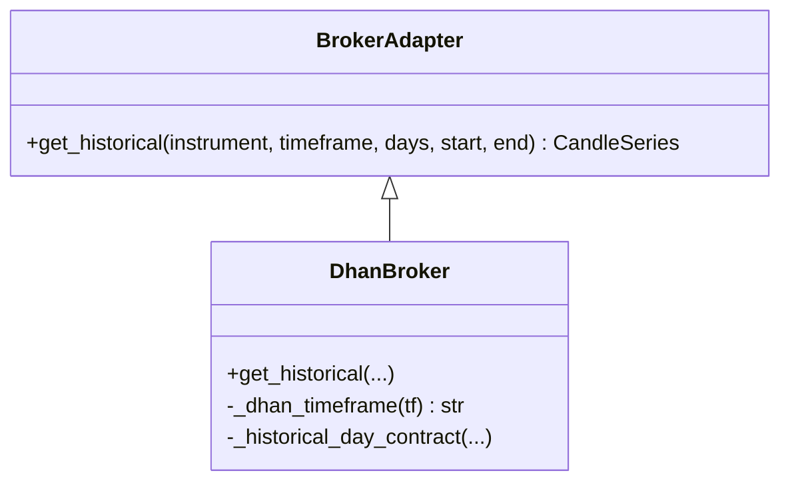
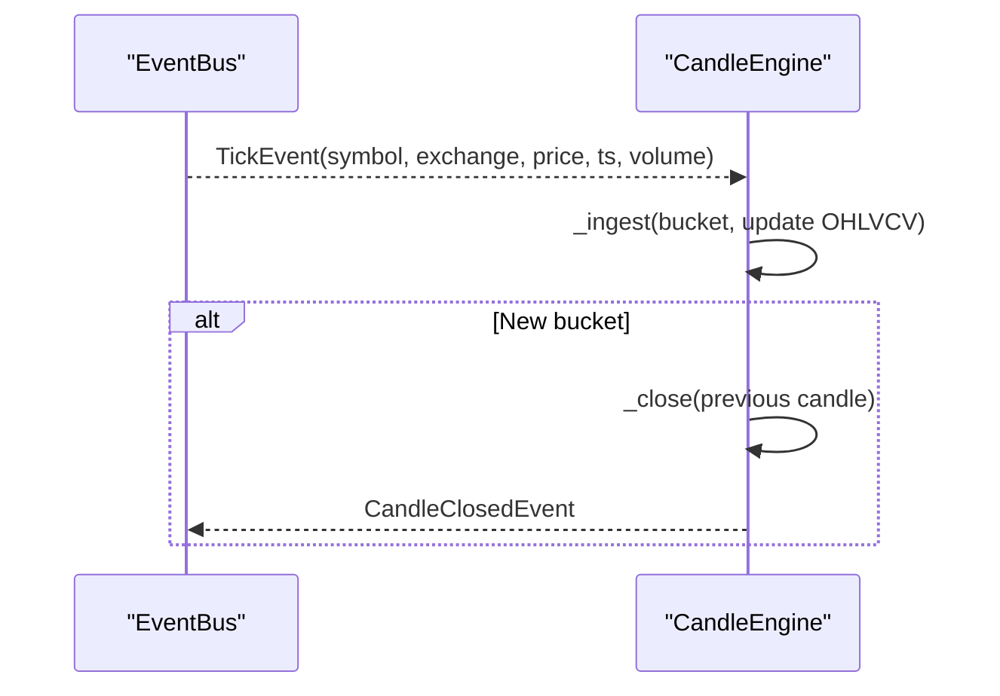
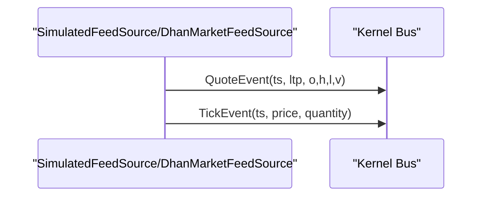
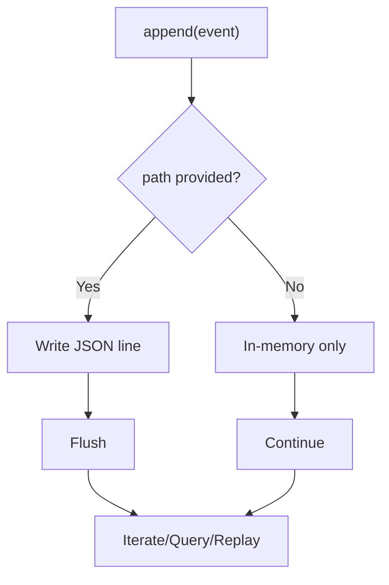
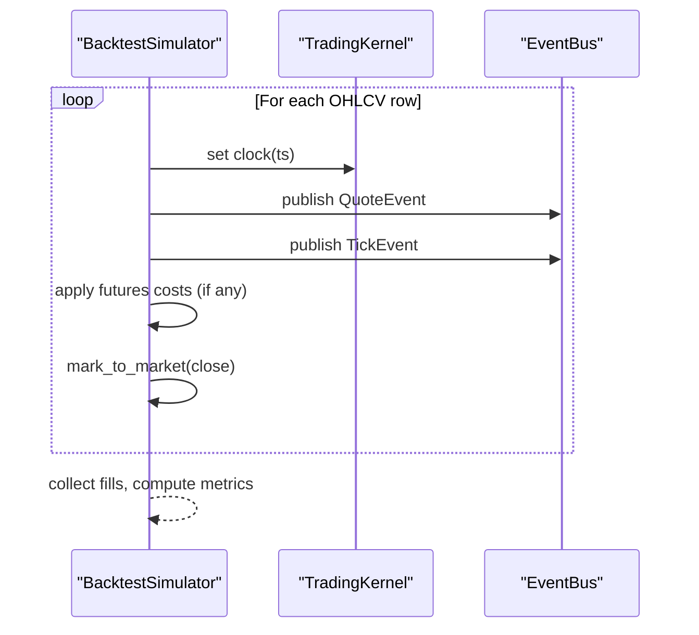
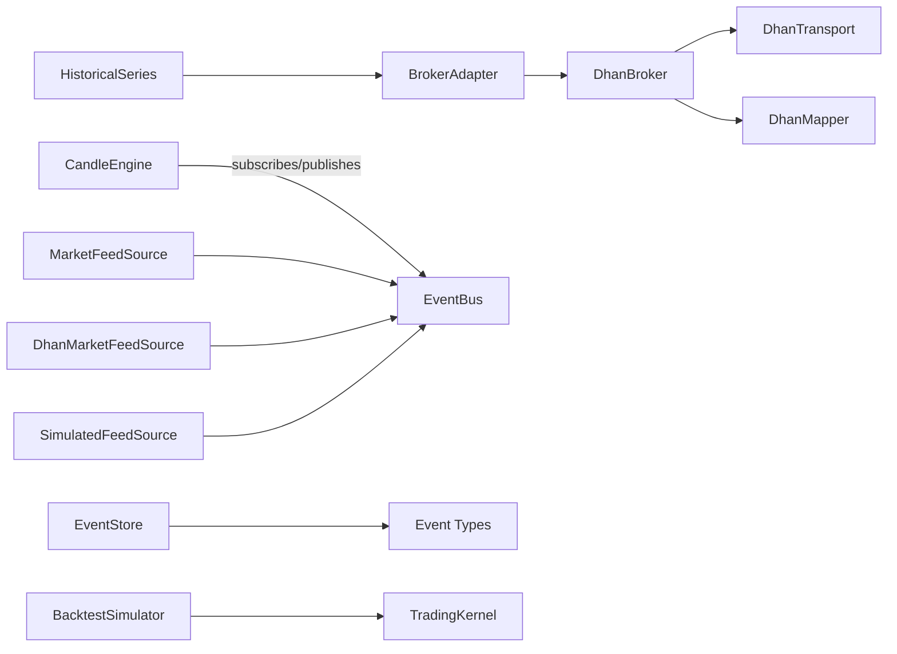

# Historical Data

<cite>
**Referenced Files in This Document**
- [history.py](file://ntrade/domain/market/history.py)
- [candles.py](file://ntrade/domain/market/candles.py)
- [market_feed.py](file://ntrade/sources/market_feed.py)
- [dhan_feed.py](file://ntrade/sources/dhan_feed.py)
- [event_store.py](file://ntrade/storage/event_store.py)
- [candle_engine.py](file://ntrade/engines/candle_engine.py)
- [simulator.py](file://ntrade/backtest/simulator.py)
- [indicators.py](file://ntrade/domain/analytics/indicators.py)
- [base.py](file://ntrade/brokers/base.py)
- [dhan.py](file://ntrade/brokers/dhan.py)
- [replay_engine.py](file://ntrade/replay/replay_engine.py)
- [tick_simulator.py](file://ntrade/sim/tick_simulator.py)
- [test_history_stream.py](file://tests/test_history_stream.py)
</cite>

## Table of Contents
1. Introduction
2. Project Structure
3. Core Components
4. Architecture Overview
5. Detailed Component Analysis
6. Dependency Analysis
7. Performance Considerations
8. Troubleshooting Guide
9. Conclusion
10. Appendices

## Introduction
This document explains how nTrade retrieves, normalizes, caches, and consumes historical market data. It covers timeframe resampling from tick to OHLCV candles, caching strategies (in-memory and disk-backed event store), intelligent refresh and invalidation, integration with live streaming for seamless continuity, normalization of broker-specific formats into canonical domain objects, and practical usage patterns for backtesting, indicator computation, and synthetic price generation. It also addresses performance techniques such as lazy loading, chunked processing, and memory management, plus data quality validation and gap detection mechanisms.

## Project Structure
Historical data flows through a layered architecture:
- Domain models encapsulate OHLCV series and typed candle wrappers.
- Broker adapters normalize raw broker responses into canonical CandleSeries.
- Engines aggregate ticks into closed candles and publish events.
- Sources provide both live and simulated feeds that emit canonical events.
- Storage persists events for deterministic replay and recovery.
- Backtest engine replays historical bars through the same kernel used in live trading.

**Diagram sources**
- [history.py:14-149](file://ntrade/domain/market/history.py#L14-L149)
- [candles.py:18-67](file://ntrade/domain/market/candles.py#L18-L67)
- [base.py:83-90](file://ntrade/brokers/base.py#L83-L90)
- [dhan.py:189-257](file://ntrade/brokers/dhan.py#L189-L257)
- [candle_engine.py:19-82](file://ntrade/engines/candle_engine.py#L19-L82)
- [market_feed.py:23-105](file://ntrade/sources/market_feed.py#L23-L105)
- [dhan_feed.py:98-233](file://ntrade/sources/dhan_feed.py#L98-L233)
- [event_store.py:76-236](file://ntrade/storage/event_store.py#L76-L236)
- [simulator.py:58-220](file://ntrade/backtest/simulator.py#L58-L220)

**Section sources**
- [history.py:14-149](file://ntrade/domain/market/history.py#L14-L149)
- [candles.py:18-67](file://ntrade/domain/market/candles.py#L18-L67)
- [base.py:83-90](file://ntrade/brokers/base.py#L83-L90)
- [dhan.py:189-257](file://ntrade/brokers/dhan.py#L189-L257)
- [candle_engine.py:19-82](file://ntrade/engines/candle_engine.py#L19-L82)
- [market_feed.py:23-105](file://ntrade/sources/market_feed.py#L23-L105)
- [dhan_feed.py:98-233](file://ntrade/sources/dhan_feed.py#L98-L233)
- [event_store.py:76-236](file://ntrade/storage/event_store.py#L76-L236)
- [simulator.py:58-220](file://ntrade/backtest/simulator.py#L58-L220)

## Core Components
- HistoricalSeries: A pandas-backed, instrument-attached series with lazy fetch, cache freshness checks, resampling, and live merge capabilities.
- CandleSeries: A domain-typed wrapper around an OHLCV DataFrame returned by brokers, preserving DataFrame interop while enforcing schema.
- BrokerAdapter.get_historical(): Abstract contract for fetching normalized OHLCV; DhanBroker implements it with timeframe routing and normalization.
- CandleEngine: Aggregates TickEvents into closed candles per timeframe and publishes CandleClosedEvent.
- MarketFeedSource and implementations: Provide canonical events from live websockets, simulated frames, or price lists.
- EventStore: Append-only JSONL storage for deterministic replay and crash recovery.
- BacktestSimulator: Runs the same kernel over historical OHLCV frames, publishing QuoteEvent and TickEvent per bar.
- Indicators: Pure functions computing standard indicators over OHLCV frames.

**Section sources**
- [history.py:14-149](file://ntrade/domain/market/history.py#L14-L149)
- [candles.py:18-67](file://ntrade/domain/market/candles.py#L18-L67)
- [base.py:83-90](file://ntrade/brokers/base.py#L83-L90)
- [dhan.py:189-257](file://ntrade/brokers/dhan.py#L189-L257)
- [candle_engine.py:19-82](file://ntrade/engines/candle_engine.py#L19-L82)
- [market_feed.py:23-105](file://ntrade/sources/market_feed.py#L23-L105)
- [event_store.py:76-236](file://ntrade/storage/event_store.py#L76-L236)
- [simulator.py:58-220](file://ntrade/backtest/simulator.py#L58-L220)
- [indicators.py:148-194](file://ntrade/domain/analytics/indicators.py#L148-L194)

## Architecture Overview
The system maintains zero-parity across live, replay, and backtest modes by emitting canonical events. Historical data is fetched via broker adapters, normalized into CandleSeries, optionally resampled, merged with live ticks, and consumed by engines and analytics.

**Diagram sources**
- [history.py:52-88](file://ntrade/domain/market/history.py#L52-L88)
- [base.py:83-90](file://ntrade/brokers/base.py#L83-L90)
- [dhan.py:189-257](file://ntrade/brokers/dhan.py#L189-L257)
- [candle_engine.py:38-82](file://ntrade/engines/candle_engine.py#L38-L82)
- [event_store.py:89-114](file://ntrade/storage/event_store.py#L89-L114)

## Detailed Component Analysis

### HistoricalSeries: Fetching, Caching, Resampling, Live Merge
- Lazy fetch with cache keyed by timeframe and freshness window.
- Force-refresh and download methods bypass cache.
- Resample aggregates OHLCV into coarser timeframes using first/open, max/high, min/low, last/close, sum(volume, oi).
- Live merge converts incoming ticks into single-print candle rows and merges safely.

**Diagram sources**
- [history.py:52-88](file://ntrade/domain/market/history.py#L52-L88)
- [history.py:116-124](file://ntrade/domain/market/history.py#L116-L124)
- [history.py:91-114](file://ntrade/domain/market/history.py#L91-L114)

**Section sources**
- [history.py:25-88](file://ntrade/domain/market/history.py#L25-L88)
- [history.py:91-124](file://ntrade/domain/market/history.py#L91-L124)

### CandleSeries: Normalized OHLCV Wrapper
- Enforces schema: timestamp, open, high, low, close, volume.
- Provides escape hatch to underlying DataFrame while keeping domain boundary intact.

**Section sources**
- [candles.py:18-67](file://ntrade/domain/market/candles.py#L18-L67)

### BrokerAdapter and DhanBroker: Timeframe Routing and Normalization
- BrokerAdapter defines get_historical returning CandleSeries.
- DhanBroker maps user timeframes to provider intervals, routes DAY requests for FUT-type contracts to long-term endpoint, normalizes columns, filters by date/time windows, and returns CandleSeries.

**Diagram sources**
- [base.py:83-90](file://ntrade/brokers/base.py#L83-L90)
- [dhan.py:189-257](file://ntrade/brokers/dhan.py#L189-L257)

**Section sources**
- [base.py:83-90](file://ntrade/brokers/base.py#L83-L90)
- [dhan.py:189-257](file://ntrade/brokers/dhan.py#L189-L257)

### CandleEngine: Tick-to-Candle Aggregation
- Subscribes to TickEvent, buckets by timeframe, updates open/high/low/close/volume, and publishes CandleClosedEvent when a new bucket starts.
- Supports flushing partial candles at session end.

**Diagram sources**
- [candle_engine.py:38-82](file://ntrade/engines/candle_engine.py#L38-L82)

**Section sources**
- [candle_engine.py:19-82](file://ntrade/engines/candle_engine.py#L19-L82)

### MarketFeedSource and Implementations: Zero-Parity Event Emission
- SimulatedFeedSource emits QuoteEvent and TickEvent from either a price list or OHLCV DataFrame.
- DhanMarketFeedSource translates wire payloads into canonical events and publishes them.

**Diagram sources**
- [market_feed.py:47-105](file://ntrade/sources/market_feed.py#L47-L105)
- [dhan_feed.py:98-233](file://ntrade/sources/dhan_feed.py#L98-L233)

**Section sources**
- [market_feed.py:23-105](file://ntrade/sources/market_feed.py#L23-L105)
- [dhan_feed.py:98-233](file://ntrade/sources/dhan_feed.py#L98-L233)

### EventStore: Append-Only Replay and Recovery
- Persists events to JSONL (optional path), supports querying, replay, and recovery sequences.
- recovery_events sorts by timestamp then append order to preserve causality.

**Diagram sources**
- [event_store.py:89-114](file://ntrade/storage/event_store.py#L89-L114)
- [event_store.py:183-210](file://ntrade/storage/event_store.py#L183-L210)

**Section sources**
- [event_store.py:76-236](file://ntrade/storage/event_store.py#L76-L236)

### BacktestSimulator: Running Over Historical Bars
- Iterates OHLCV DataFrame, sets clock, publishes QuoteEvent and TickEvent per bar, tracks equity curve, and computes results including costs and drawdown.

**Diagram sources**
- [simulator.py:116-143](file://ntrade/backtest/simulator.py#L116-L143)
- [simulator.py:145-191](file://ntrade/backtest/simulator.py#L145-L191)

**Section sources**
- [simulator.py:58-220](file://ntrade/backtest/simulator.py#L58-L220)

### Indicators: Computing on Historical Series
- Bundle function computes RSI, ATR, VWAP, SuperTrend, EMA/SMA variants over the latest completed candle.
- HistoricalSeries.indicators delegates to this bundle.

**Section sources**
- [indicators.py:148-194](file://ntrade/domain/analytics/indicators.py#L148-L194)
- [history.py:126-129](file://ntrade/domain/market/history.py#L126-L129)

### Synthetic Price Paths: Deterministic Tick Generation
- synthesize_1m_ticks generates one-second ticks from a 1-minute OHLCV bar respecting open/close anchors, high/low bounds, and total volume.

**Section sources**
- [tick_simulator.py:178-208](file://ntrade/sim/tick_simulator.py#L178-L208)

## Dependency Analysis
Key dependencies and interactions:
- HistoricalSeries depends on Instrument.broker_adapter to fetch data.
- DhanBroker depends on DhanTransport and DhanMapper for API calls and normalization.
- CandleEngine subscribes to TickEvent and publishes CandleClosedEvent.
- MarketFeedSource implementations depend on kernel bus to publish canonical events.
- EventStore depends on event types from lifecycle, market, order, portfolio, risk modules.
- BacktestSimulator depends on TradingKernel, SimulationClock, and cost models.

**Diagram sources**
- [history.py:52-88](file://ntrade/domain/market/history.py#L52-L88)
- [base.py:83-90](file://ntrade/brokers/base.py#L83-L90)
- [dhan.py:189-257](file://ntrade/brokers/dhan.py#L189-L257)
- [candle_engine.py:29-82](file://ntrade/engines/candle_engine.py#L29-L82)
- [market_feed.py:23-105](file://ntrade/sources/market_feed.py#L23-L105)
- [dhan_feed.py:98-233](file://ntrade/sources/dhan_feed.py#L98-L233)
- [event_store.py:16-29](file://ntrade/storage/event_store.py#L16-L29)
- [simulator.py:58-109](file://ntrade/backtest/simulator.py#L58-L109)

**Section sources**
- [history.py:52-88](file://ntrade/domain/market/history.py#L52-L88)
- [base.py:83-90](file://ntrade/brokers/base.py#L83-L90)
- [dhan.py:189-257](file://ntrade/brokers/dhan.py#L189-L257)
- [candle_engine.py:29-82](file://ntrade/engines/candle_engine.py#L29-L82)
- [market_feed.py:23-105](file://ntrade/sources/market_feed.py#L23-L105)
- [dhan_feed.py:98-233](file://ntrade/sources/dhan_feed.py#L98-L233)
- [event_store.py:16-29](file://ntrade/storage/event_store.py#L16-L29)
- [simulator.py:58-109](file://ntrade/backtest/simulator.py#L58-L109)

## Performance Considerations
- Lazy loading: HistoricalSeries.fetch defers network calls until needed and caches by timeframe.
- Chunked processing: DhanBroker’s long-term historical endpoints can be called with date ranges; filtering occurs post-fetch.
- Memory management: EventStore writes to JSONL incrementally; use clear/close to release resources.
- Efficient resampling: Pandas resample with aggregated functions minimizes overhead.
- Deterministic replay: EventStore sorts by timestamp and append index to avoid OOM during replay by limiting history where applicable.

[No sources needed since this section provides general guidance]

## Troubleshooting Guide
Common issues and resolutions:
- Empty or stale history: Use refresh/download to force re-fetch; verify timeframe matches cached timeframe.
- Missing columns after merge: Ensure tick_df contains timestamp and OHLCV fields; live_merge enforces schema.
- Unsupported timeframe: DhanBroker raises on unsupported intervals; use supported values.
- Replay divergence: Ensure recovery_events uses correct sort key (ts, append index) to maintain causality.
- Indicator failures: compute_bundle logs warnings; check input DataFrame has required columns.

**Section sources**
- [history.py:52-88](file://ntrade/domain/market/history.py#L52-L88)
- [history.py:91-114](file://ntrade/domain/market/history.py#L91-L114)
- [dhan.py:732-745](file://ntrade/brokers/dhan.py#L732-L745)
- [event_store.py:183-210](file://ntrade/storage/event_store.py#L183-L210)
- [indicators.py:148-194](file://ntrade/domain/analytics/indicators.py#L148-L194)

## Conclusion
nTrade’s historical data subsystem provides robust, zero-parity access across live, replay, and backtest environments. HistoricalSeries offers flexible caching and resampling, DhanBroker ensures normalized and filtered OHLCV data, CandleEngine builds real-time candles, and EventStore enables deterministic replay. Together with indicators and synthetic tick generation, these components form a cohesive foundation for reliable data-driven trading systems.

[No sources needed since this section summarizes without analyzing specific files]

## Appendices

### Usage Examples and Patterns
- Loading historical data for backtesting:
  - Use BacktestSimulator.run with an OHLCV DataFrame; it publishes QuoteEvent and TickEvent per bar.
- Calculating technical indicators:
  - Use HistoricalSeries.indicators(params) to compute a bundle over the current series.
- Generating synthetic price paths:
  - Use synthesize_1m_ticks to create deterministic 1-second ticks from a 1-minute OHLCV bar.

**Section sources**
- [simulator.py:116-143](file://ntrade/backtest/simulator.py#L116-L143)
- [history.py:126-129](file://ntrade/domain/market/history.py#L126-L129)
- [tick_simulator.py:178-208](file://ntrade/sim/tick_simulator.py#L178-L208)

### Data Quality Validation and Gap Detection
- Validate presence of timestamp and OHLCV columns before resampling or merging.
- Detect gaps by checking consecutive timestamps and ensuring no missing intervals; consider filling or flagging gaps prior to analysis.
- Use EventStore.recovery_events to reconstruct causal sequences and identify missing market events.

**Section sources**
- [history.py:116-124](file://ntrade/domain/market/history.py#L116-L124)
- [event_store.py:183-210](file://ntrade/storage/event_store.py#L183-L210)

### Integration Between Historical Data and Live Streaming
- HistoricalSeries.live_merge integrates live ticks into existing candles, maintaining schema and deduplication.
- MarketFeedSource implementations ensure canonical events are published regardless of source (live websocket, simulated feed, or replay).

**Section sources**
- [history.py:91-114](file://ntrade/domain/market/history.py#L91-L114)
- [market_feed.py:47-105](file://ntrade/sources/market_feed.py#L47-L105)
- [dhan_feed.py:98-233](file://ntrade/sources/dhan_feed.py#L98-L233)

### Tests and Validation References
- HistoricalSeries behavior and live merge correctness validated in tests.

**Section sources**
- [test_history_stream.py:13-70](file://tests/test_history_stream.py#L13-L70)