# Market Data

<cite>
**Referenced Files in This Document**
- [market_feed.py](file://ntrade/sources/market_feed.py)
- [dhan_feed.py](file://ntrade/sources/dhan_feed.py)
- [synthetic_feed.py](file://ntrade/sources/synthetic_feed.py)
- [stream.py](file://ntrade/domain/market/stream.py)
- [depth.py](file://ntrade/domain/market/depth.py)
- [history.py](file://ntrade/domain/market/history.py)
- [candles.py](file://ntrade/domain/market/candles.py)
- [quote.py](file://ntrade/domain/market/quote.py)
- [market.py](file://ntrade/events/market.py)
- [event_bus.py](file://ntrade/kernel/event_bus.py)
- [feeds.py](file://ntrade/runner/feeds.py)
- [tick_simulator.py](file://ntrade/sim/tick_simulator.py)
</cite>

## Table of Contents
1. Introduction
2. Project Structure
3. Core Components
4. Architecture Overview
5. Detailed Component Analysis
6. Dependency Analysis
7. Performance Considerations
8. Troubleshooting Guide
9. Conclusion

## Introduction
This document explains how nTrade handles market data across live and offline scenarios with a zero-parity design: the kernel consumes canonical events regardless of whether they originate from a live broker WebSocket, a synthetic simulator, or historical replay. It covers the abstract feed source, concrete implementations for Dhan live streaming and deterministic synthetic ticks, historical data access patterns (caching, refresh, resampling), live streaming lifecycle and event emission, order book handling, normalization to canonical domain objects, setup examples, performance optimizations, and production-grade error handling and monitoring strategies.

## Project Structure
Market data spans several layers:
- Sources: abstract base and concrete feed sources that publish canonical events to the kernel bus
- Domain models: Quote, Tick, MarketDepth, CandleSeries, HistoricalSeries
- Events: TickEvent, QuoteEvent, DepthEvent, etc.
- Streaming state: per-instrument LiveStream managing subscriptions and callbacks
- Event bus: thread-safe pub/sub backbone
- Runner helpers: factory to build synthetic or live feeds

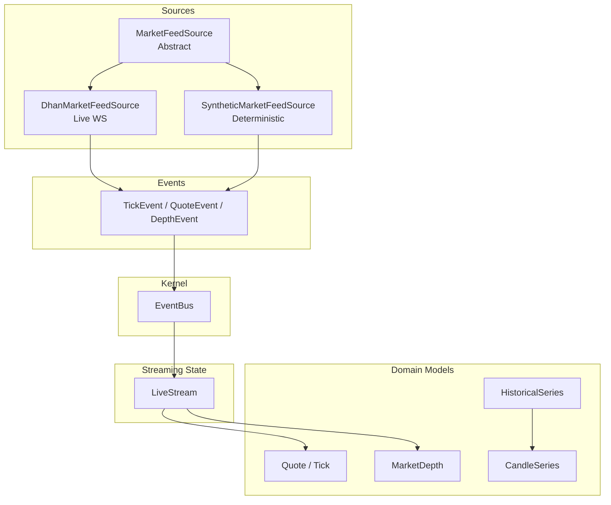

**Diagram sources**
- [market_feed.py:23-45](file://ntrade/sources/market_feed.py#L23-L45)
- [dhan_feed.py:98-145](file://ntrade/sources/dhan_feed.py#L98-L145)
- [synthetic_feed.py:19-50](file://ntrade/sources/synthetic_feed.py#L19-L50)
- [quote.py:9-91](file://ntrade/domain/market/quote.py#L9-L91)
- [depth.py:9-49](file://ntrade/domain/market/depth.py#L9-L49)
- [candles.py:18-67](file://ntrade/domain/market/candles.py#L18-L67)
- [history.py:14-88](file://ntrade/domain/market/history.py#L14-L88)
- [market.py:11-48](file://ntrade/events/market.py#L11-L48)
- [stream.py:27-131](file://ntrade/domain/market/stream.py#L27-L131)
- [event_bus.py:24-81](file://ntrade/kernel/event_bus.py#L24-L81)

**Section sources**
- [market_feed.py:1-105](file://ntrade/sources/market_feed.py#L1-L105)
- [dhan_feed.py:1-233](file://ntrade/sources/dhan_feed.py#L1-L233)
- [synthetic_feed.py:1-77](file://ntrade/sources/synthetic_feed.py#L1-L77)
- [stream.py:1-131](file://ntrade/domain/market/stream.py#L1-L131)
- [depth.py:1-49](file://ntrade/domain/market/depth.py#L1-L49)
- [history.py:1-149](file://ntrade/domain/market/history.py#L1-L149)
- [candles.py:1-67](file://ntrade/domain/market/candles.py#L1-L67)
- [quote.py:1-91](file://ntrade/domain/market/quote.py#L1-L91)
- [market.py:1-83](file://ntrade/events/market.py#L1-L83)
- [event_bus.py:1-81](file://ntrade/kernel/event_bus.py#L1-L81)
- [feeds.py:1-19](file://ntrade/runner/feeds.py#L1-L19)
- [tick_simulator.py:1-82](file://ntrade/sim/tick_simulator.py#L1-L82)

## Core Components
- MarketFeedSource: Abstract base defining start/stop and kernel attachment; all sources produce canonical events via the kernel bus.
- DhanMarketFeedSource: Live WebSocket adapter mapping broker payloads to canonical events, multiplexing subscriptions, and handling disconnects.
- SyntheticMarketFeedSource: Deterministic tick generator from 1m OHLCV using a seeded engine, publishing QuoteEvent and TickEvent per bar.
- LiveStream: Per-instrument subscription lifecycle, tick cache, and callback dispatch for tick/quote/trade/depth/disconnect/reconnect.
- HistoricalSeries: Cached, timeframe-aware history fetcher with merge and resample utilities.
- Domain models: Quote/Tick immutable value objects; MarketDepth snapshot with spread and imbalance helpers; CandleSeries wrapper around OHLCV DataFrame.
- Events: Canonical TickEvent, QuoteEvent, DepthEvent, and others consumed by engines.
- EventBus: Thread-safe pub/sub with serialized dispatch and bounded history.

**Section sources**
- [market_feed.py:23-105](file://ntrade/sources/market_feed.py#L23-L105)
- [dhan_feed.py:98-233](file://ntrade/sources/dhan_feed.py#L98-L233)
- [synthetic_feed.py:19-77](file://ntrade/sources/synthetic_feed.py#L19-L77)
- [stream.py:21-131](file://ntrade/domain/market/stream.py#L21-L131)
- [history.py:14-149](file://ntrade/domain/market/history.py#L14-L149)
- [quote.py:9-91](file://ntrade/domain/market/quote.py#L9-L91)
- [depth.py:9-49](file://ntrade/domain/market/depth.py#L9-L49)
- [candles.py:18-67](file://ntrade/domain/market/candles.py#L18-L67)
- [market.py:11-83](file://ntrade/events/market.py#L11-L83)
- [event_bus.py:24-81](file://ntrade/kernel/event_bus.py#L24-L81)

## Architecture Overview
The system enforces zero parity between live and simulated data. Sources publish canonical events to the kernel’s EventBus. Engines and instruments subscribe to these events and maintain read-models (quotes, depth, candles). The runner selects a feed source based on configuration.

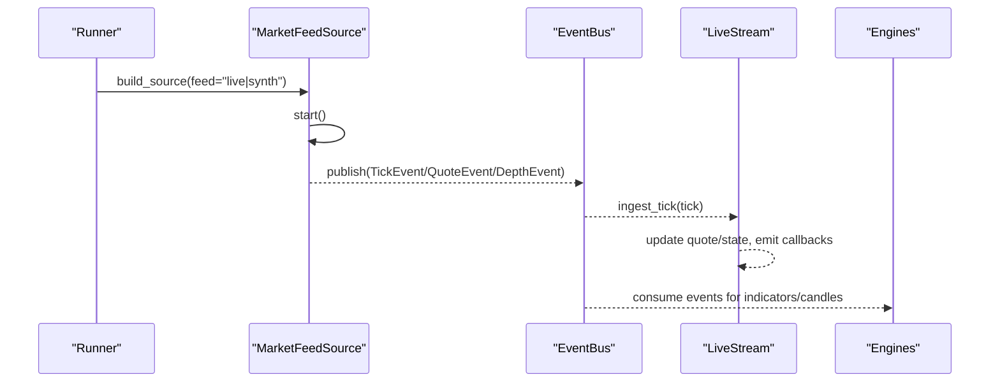

**Diagram sources**
- [feeds.py:6-18](file://ntrade/runner/feeds.py#L6-L18)
- [dhan_feed.py:175-224](file://ntrade/sources/dhan_feed.py#L175-L224)
- [synthetic_feed.py:37-77](file://ntrade/sources/synthetic_feed.py#L37-L77)
- [event_bus.py:47-66](file://ntrade/kernel/event_bus.py#L47-L66)
- [stream.py:106-131](file://ntrade/domain/market/stream.py#L106-L131)

## Detailed Component Analysis

### MarketFeedSource Abstract Base
- Responsibilities:
  - Provide attach(kernel) and bus property for publishing events
  - Define start() contract; optional stop()
- Design:
  - Minimal interface ensures interchangeable sources
  - Kernel is optional at construction; attach later

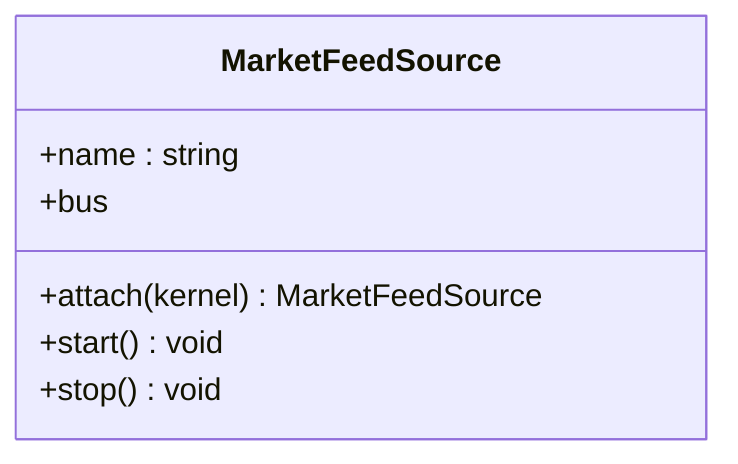

**Diagram sources**
- [market_feed.py:23-45](file://ntrade/sources/market_feed.py#L23-L45)

**Section sources**
- [market_feed.py:23-45](file://ntrade/sources/market_feed.py#L23-L45)

### DhanMarketFeedSource (Live WebSocket)
- Responsibilities:
  - Build subscriptions with mode codes (ticker/quote/full/depth)
  - Map raw payloads to canonical events via dhan_payload_to_events
  - Publish events to kernel bus; handle errors and close events
  - Support wait_ready(timeout, min_ticks) for warmup
- Key behaviors:
  - Multiplexed subscriptions per symbol with exchange_code and security_id
  - Version-aware mode validation (v2 forbids depth-only code)
  - Lazy feed construction with injectable factory for tests
  - FeedDisconnectedEvent emitted on close

```mermaid
classDiagram
class DhanMarketFeedSource {
+name : string
+symbols : list
+symbol_map : dict
+version : string
+mode : string
+start() void
+wait_ready(timeout, min_ticks) bool
+stop() void
-_build_feed()
-_on_message(instance, payload)
-_on_error(instance, error)
-_on_close(instance)
}
class MarketFeedSource <|-- DhanMarketFeedSource
```

**Diagram sources**
- [dhan_feed.py:98-173](file://ntrade/sources/dhan_feed.py#L98-L173)
- [market_feed.py:23-45](file://ntrade/sources/market_feed.py#L23-L45)

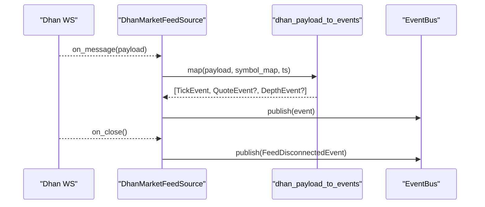

**Diagram sources**
- [dhan_feed.py:206-224](file://ntrade/sources/dhan_feed.py#L206-L224)
- [dhan_feed.py:38-95](file://ntrade/sources/dhan_feed.py#L38-L95)
- [market.py:11-48](file://ntrade/events/market.py#L11-L48)

**Section sources**
- [dhan_feed.py:98-233](file://ntrade/sources/dhan_feed.py#L98-L233)
- [dhan_feed.py:38-95](file://ntrade/sources/dhan_feed.py#L38-L95)
- [market.py:11-48](file://ntrade/events/market.py#L11-L48)

### SyntheticMarketFeedSource (Offline Deterministic)
- Responsibilities:
  - Generate one TickEvent per second from a 1m OHLCV bar using synthesize_1m_ticks
  - Emit QuoteEvent per bar to keep OHLCV consistent
  - Daemon thread producer with stop/join semantics
- Determinism:
  - Seeded RNG ensures identical tick sequences for same inputs

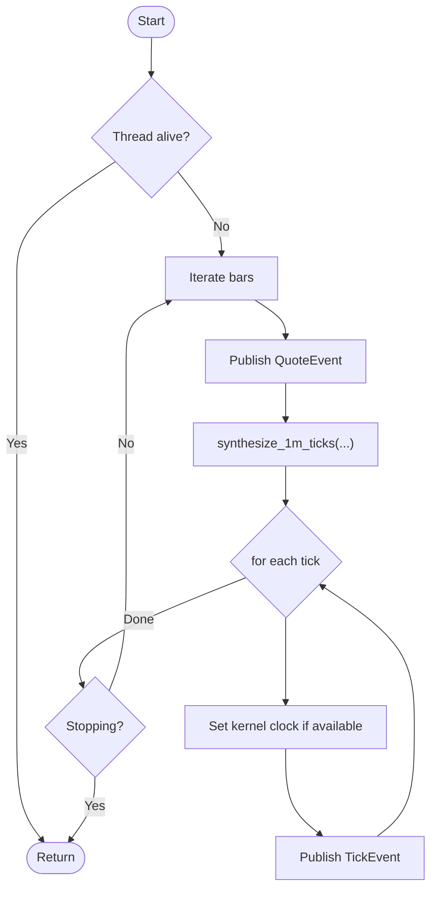

**Diagram sources**
- [synthetic_feed.py:37-77](file://ntrade/sources/synthetic_feed.py#L37-L77)
- [tick_simulator.py:51-82](file://ntrade/sim/tick_simulator.py#L51-L82)

**Section sources**
- [synthetic_feed.py:19-77](file://ntrade/sources/synthetic_feed.py#L19-L77)
- [tick_simulator.py:1-82](file://ntrade/sim/tick_simulator.py#L1-L82)

### LiveStream (Subscription Management and Event Emission)
- Responsibilities:
  - Manage subscribe/unsubscribe lifecycle per instrument
  - Maintain last_tick and bounded deque of ticks
  - Emit typed callbacks for tick/quote/trade/depth/disconnect/reconnect
  - Update instrument quote immutably on incoming ticks
- Invariants:
  - Callback exceptions are swallowed to protect stream continuity

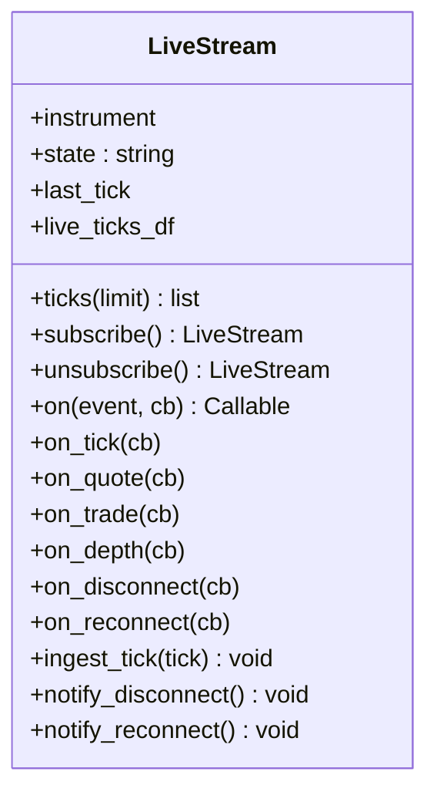

**Diagram sources**
- [stream.py:21-131](file://ntrade/domain/market/stream.py#L21-L131)

**Section sources**
- [stream.py:21-131](file://ntrade/domain/market/stream.py#L21-L131)

### Market Depth Handling
- Snapshot model:
  - MarketDepth holds bids/asks tuples of DepthLevel with price, quantity, orders
  - Helpers: best_bid/ask, spread, depth(levels), bid_ask_imbalance
- Live ingestion:
  - DhanMarketFeedSource maps broker depth arrays into DepthEvent
  - LiveStream emits depth events alongside tick/quote

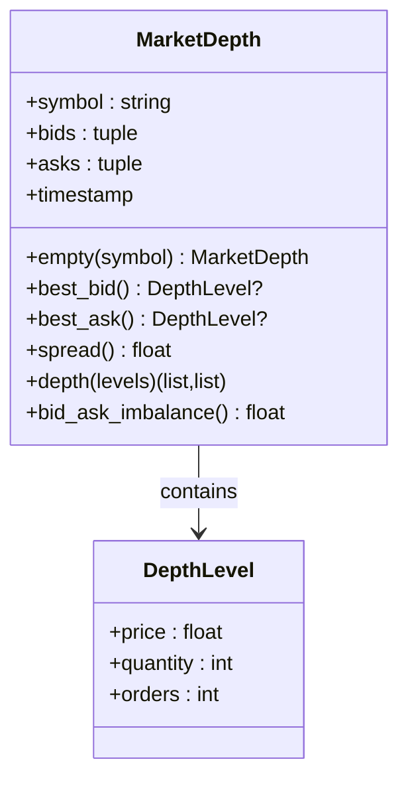

**Diagram sources**
- [depth.py:9-49](file://ntrade/domain/market/depth.py#L9-L49)
- [dhan_feed.py:79-95](file://ntrade/sources/dhan_feed.py#L79-L95)

**Section sources**
- [depth.py:9-49](file://ntrade/domain/market/depth.py#L9-L49)
- [dhan_feed.py:79-95](file://ntrade/sources/dhan_feed.py#L79-L95)

### Historical Data Access Patterns
- Caching and refresh:
  - HistoricalSeries caches per timeframe; force refresh via refresh/download
  - is_fresh checks staleness; fetch delegates to broker.get_historical
- Resampling:
  - resample(rule) aggregates OHLCV safely and returns new series
- Live merge:
  - live_merge merges recent ticks into candles while preserving schema

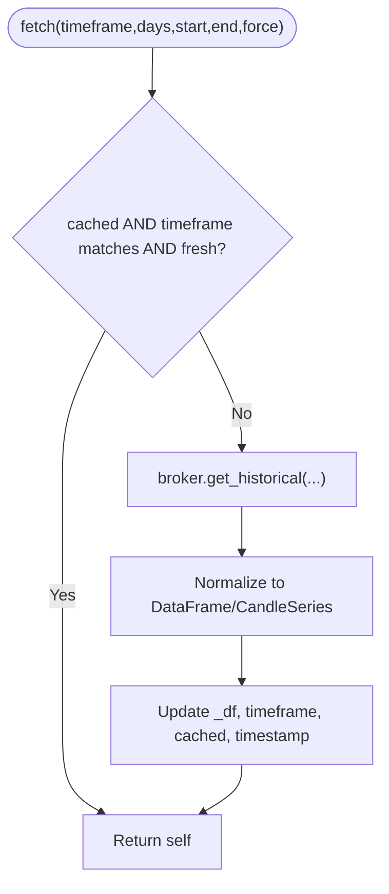

**Diagram sources**
- [history.py:52-88](file://ntrade/domain/market/history.py#L52-L88)
- [history.py:91-124](file://ntrade/domain/market/history.py#L91-L124)

**Section sources**
- [history.py:14-149](file://ntrade/domain/market/history.py#L14-L149)
- [candles.py:18-67](file://ntrade/domain/market/candles.py#L18-L67)

### Data Normalization and Canonical Events
- Broker payloads are mapped to canonical events:
  - dhan_payload_to_events converts LTP/quote/full/depth into TickEvent/QuoteEvent/DepthEvent
  - Safe parsing with _to_float/_to_int; unknown types skipped
- Domain objects:
  - Quote/Tick are immutable value objects with derived properties (spread, mid_price, change)
  - DepthLevel/MarketDepth provide order book analytics

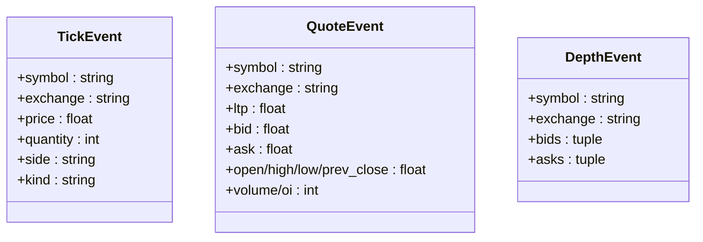

**Diagram sources**
- [market.py:11-48](file://ntrade/events/market.py#L11-L48)
- [dhan_feed.py:38-95](file://ntrade/sources/dhan_feed.py#L38-L95)
- [quote.py:9-91](file://ntrade/domain/market/quote.py#L9-L91)

**Section sources**
- [market.py:11-48](file://ntrade/events/market.py#L11-L48)
- [dhan_feed.py:38-95](file://ntrade/sources/dhan_feed.py#L38-L95)
- [quote.py:9-91](file://ntrade/domain/market/quote.py#L9-L91)

### Setup Examples and Custom Feed Sources
- Choosing a feed source:
  - Use build_source(feed="synth"|"live", ...) to construct Synthetic or Dhan feed
- Setting up live Dhan:
  - Provide symbols as [(exchange_code, security_id), ...] and symbol_map for canonical names
  - Optionally inject feed_factory for testing; otherwise uses real dhanhq.MarketFeed
- Implementing a custom feed:
  - Subclass MarketFeedSource, implement start(), publish TickEvent/QuoteEvent/DepthEvent via self.bus.publish()
  - Attach to kernel via attach(kernel) before starting

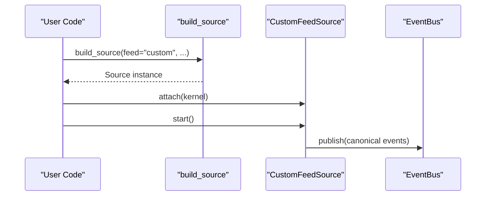

**Diagram sources**
- [feeds.py:6-18](file://ntrade/runner/feeds.py#L6-L18)
- [market_feed.py:23-45](file://ntrade/sources/market_feed.py#L23-L45)

**Section sources**
- [feeds.py:6-18](file://ntrade/runner/feeds.py#L6-L18)
- [market_feed.py:23-45](file://ntrade/sources/market_feed.py#L23-L45)

## Dependency Analysis
- Sources depend on:
  - Events (TickEvent/QuoteEvent/DepthEvent)
  - Kernel bus via attached TradingKernel
  - Optional external libraries (dhanhq) for live feed
- Domain models are independent value objects
- LiveStream depends on Instrument and its broker_adapter for subscribe/unsubscribe
- HistoricalSeries depends on broker_adapter.get_historical

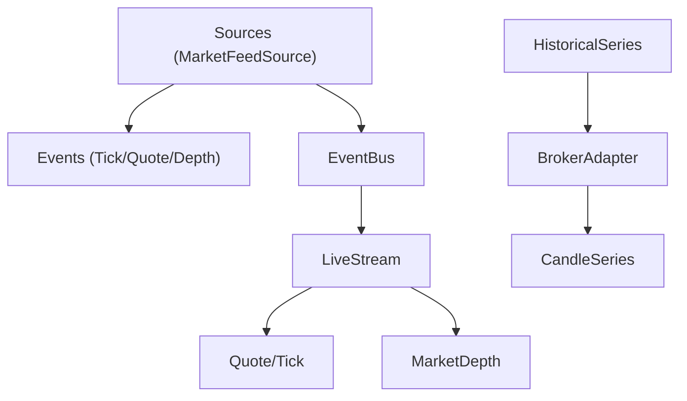

**Diagram sources**
- [market_feed.py:23-45](file://ntrade/sources/market_feed.py#L23-L45)
- [dhan_feed.py:98-173](file://ntrade/sources/dhan_feed.py#L98-L173)
- [synthetic_feed.py:19-50](file://ntrade/sources/synthetic_feed.py#L19-L50)
- [event_bus.py:24-81](file://ntrade/kernel/event_bus.py#L24-L81)
- [stream.py:21-131](file://ntrade/domain/market/stream.py#L21-L131)
- [history.py:52-88](file://ntrade/domain/market/history.py#L52-L88)
- [candles.py:18-67](file://ntrade/domain/market/candles.py#L18-L67)

**Section sources**
- [market_feed.py:23-45](file://ntrade/sources/market_feed.py#L23-L45)
- [dhan_feed.py:98-173](file://ntrade/sources/dhan_feed.py#L98-L173)
- [synthetic_feed.py:19-50](file://ntrade/sources/synthetic_feed.py#L19-L50)
- [event_bus.py:24-81](file://ntrade/kernel/event_bus.py#L24-L81)
- [stream.py:21-131](file://ntrade/domain/market/stream.py#L21-L131)
- [history.py:52-88](file://ntrade/domain/market/history.py#L52-L88)
- [candles.py:18-67](file://ntrade/domain/market/candles.py#L18-L67)

## Performance Considerations
- Connection management:
  - DhanMarketFeedSource reuses a single feed instance per start(); stop clears it to allow fresh connection
  - wait_ready supports non-blocking warmup with timeout and minimum tick threshold
- Data caching:
  - HistoricalSeries caches per timeframe; avoid redundant network calls with is_fresh and force flags
  - LiveStream maintains a bounded deque of ticks to limit memory growth
- Event bus serialization:
  - EventBus uses RLock to serialize dispatch; handler exceptions are swallowed to prevent stalls
- Memory management:
  - Depth snapshots use tuples; Quote/Tick are immutable dataclasses
  - Avoid large unbounded buffers; prefer sliding windows and periodic pruning
- Optimization opportunities:
  - Batch event processing in consumers where possible
  - Precompute symbol_map once and reuse across subscriptions
  - Use seed-based synthetic feeds for reproducible benchmarks

[No sources needed since this section provides general guidance]

## Troubleshooting Guide
- Common issues:
  - Unknown feed mode or version mismatch in DhanMarketFeedSource raises ValueError; ensure mode/version compatibility
  - Missing symbol_map entries cause payloads to be skipped silently; verify mappings
  - Empty or malformed payloads are ignored; check logs for warnings/errors
  - Disconnections emit FeedDisconnectedEvent; implement reconnect logic in consumers
- Validation and monitoring:
  - Track payloads_ingested and ticks_published counters for liveness
  - Monitor EventBus.history length and consumer latency
  - Log errors from _on_error and handler exceptions in EventBus
- Recovery strategies:
  - Rebuild feed on disconnect; restart source with fresh context
  - Refresh historical data with force=True when stale
  - Gracefully degrade by ignoring bad events and continuing pipeline

**Section sources**
- [dhan_feed.py:129-141](file://ntrade/sources/dhan_feed.py#L129-L141)
- [dhan_feed.py:206-224](file://ntrade/sources/dhan_feed.py#L206-L224)
- [event_bus.py:47-66](file://ntrade/kernel/event_bus.py#L47-L66)
- [history.py:46-88](file://ntrade/domain/market/history.py#L46-L88)

## Conclusion
nTrade’s market data layer achieves zero parity through a clean abstraction over diverse sources, robust normalization to canonical events, and resilient streaming with clear lifecycle management. Historical data access is efficient and flexible, while live streaming provides fine-grained control over subscriptions and event emission. With careful attention to caching, connection handling, and error resilience, the system scales reliably for both simulation and production environments.

[No sources needed since this section summarizes without analyzing specific files]