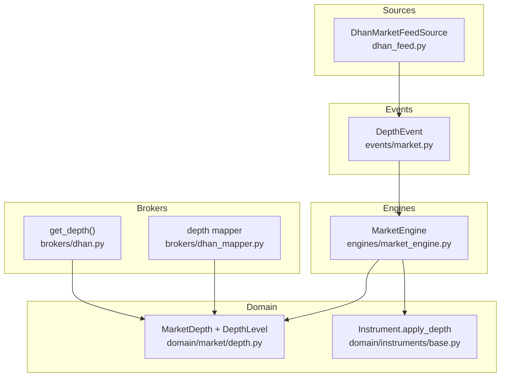
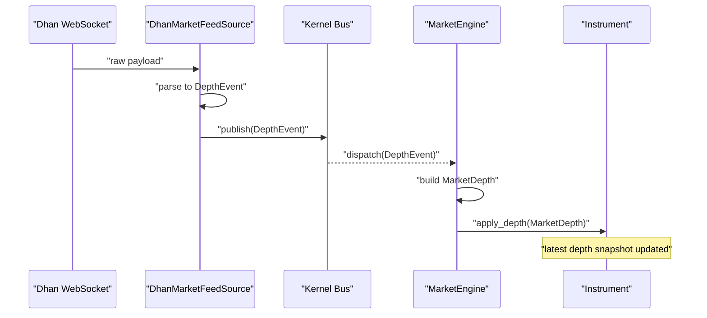
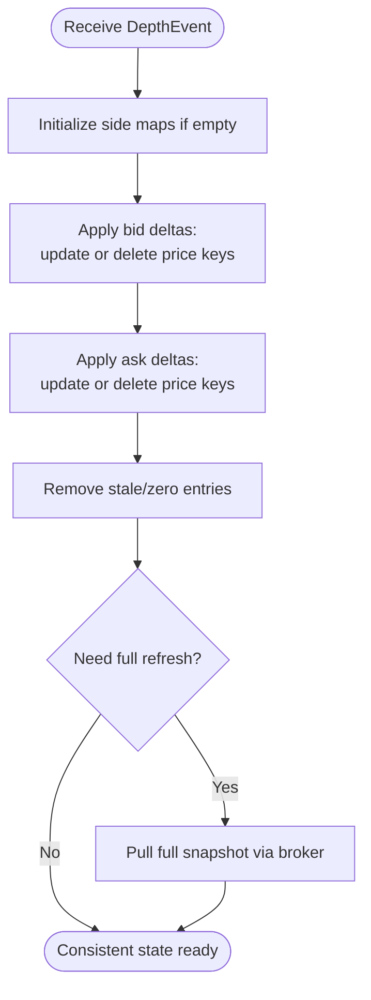
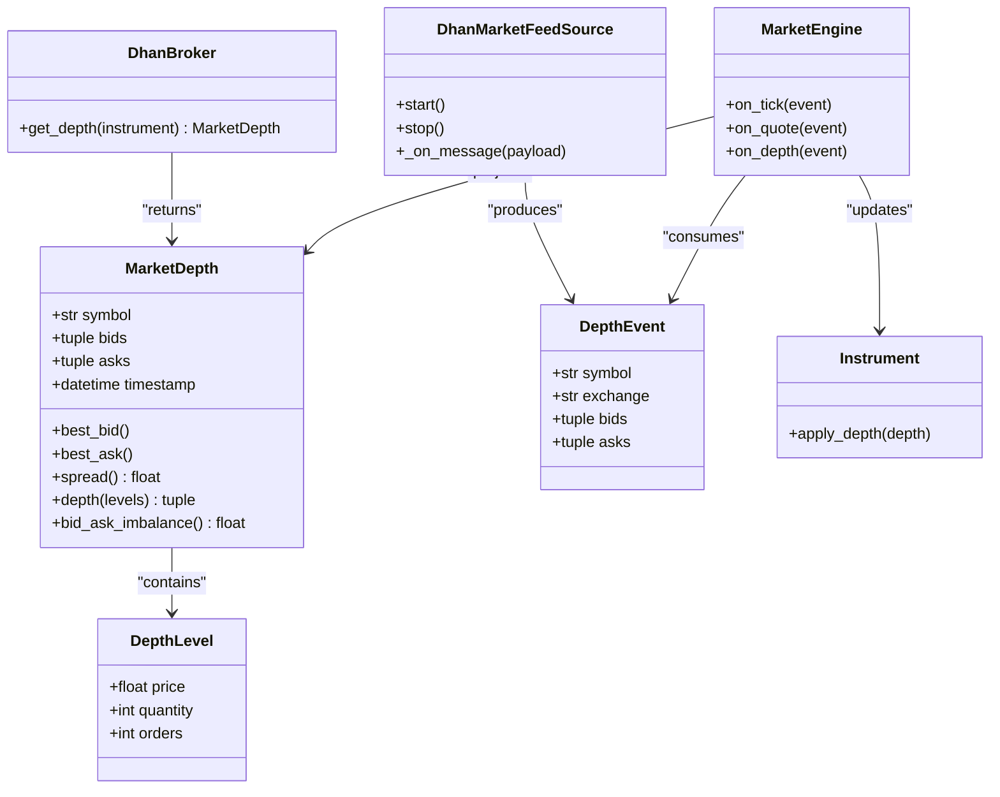

# Market Depth

<cite>
**Referenced Files in This Document**
- [depth.py](file://ntrade/domain/market/depth.py)
- [market.py](file://ntrade/events/market.py)
- [dhan_feed.py](file://ntrade/sources/dhan_feed.py)
- [market_engine.py](file://ntrade/engines/market_engine.py)
- [base.py](file://ntrade/domain/instruments/base.py)
- [dhan.py](file://ntrade/brokers/dhan.py)
- [dhan_mapper.py](file://ntrade/brokers/dhan_mapper.py)
</cite>

## Table of Contents
1. [Introduction](#introduction)
2. [Project Structure](#project-structure)
3. [Core Components](#core-components)
4. [Architecture Overview](#architecture-overview)
5. [Detailed Component Analysis](#detailed-component-analysis)
6. [Dependency Analysis](#dependency-analysis)
7. [Performance Considerations](#performance-considerations)
8. [Troubleshooting Guide](#troubleshooting-guide)
9. [Conclusion](#conclusion)
10. [Appendices](#appendices)

## Introduction
This document explains how nTrade handles market depth (order book) data, from ingestion to consumption. It covers the immutable MarketDepth snapshot, the streaming DepthEvent type, and how the MarketEngine projects incoming events into instrument state. It also provides guidance for aggregation across multiple feeds, spread and mid-price computation, liquidity metrics, visualization patterns, execution usage, performance optimizations, and robustness against out-of-order or missing updates.

## Project Structure
Market depth flows through a small set of focused modules:
- Domain models define the immutable order book snapshot.
- Events carry snapshots from sources to engines.
- Sources translate wire payloads into canonical events.
- Engines project events into per-instrument read-model state.
- Brokers provide on-demand depth snapshots when needed.

**Diagram sources**
- [dhan_feed.py:1-233](file://ntrade/sources/dhan_feed.py#L1-L233)
- [market.py:1-83](file://ntrade/events/market.py#L1-L83)
- [market_engine.py:1-64](file://ntrade/engines/market_engine.py#L1-L64)
- [depth.py:1-49](file://ntrade/domain/market/depth.py#L1-L49)
- [base.py:1-305](file://ntrade/domain/instruments/base.py#L1-L305)
- [dhan.py:140-339](file://ntrade/brokers/dhan.py#L140-L339)
- [dhan_mapper.py:220-356](file://ntrade/brokers/dhan_mapper.py#L220-L356)

**Section sources**
- [depth.py:1-49](file://ntrade/domain/market/depth.py#L1-L49)
- [market.py:1-83](file://ntrade/events/market.py#L1-L83)
- [dhan_feed.py:1-233](file://ntrade/sources/dhan_feed.py#L1-L233)
- [market_engine.py:1-64](file://ntrade/engines/market_engine.py#L1-L64)
- [base.py:1-305](file://ntrade/domain/instruments/base.py#L1-L305)
- [dhan.py:140-339](file://ntrade/brokers/dhan.py#L140-L339)
- [dhan_mapper.py:220-356](file://ntrade/brokers/dhan_mapper.py#L220-L356)

## Core Components
- DepthLevel: Immutable price-level record with price, quantity, and optional orders count.
- MarketDepth: Immutable snapshot of bids and asks as ordered tuples, plus timestamp and helpers for best bid/ask, spread, top-N levels, and imbalance.
- DepthEvent: Canonical event carrying symbol, exchange, and tuples of (price, quantity, orders) for bids and asks.
- MarketEngine: Subscribes to DepthEvent and projects it into an Instrument’s internal MarketDepth via apply_depth.
- Instrument: Holds the latest MarketDepth snapshot and exposes it via capabilities.
- Broker adapters: Provide on-demand MarketDepth snapshots (e.g., Dhan.get_depth).

Key responsibilities:
- Data model immutability ensures thread-safe reads and consistent snapshots.
- Event-driven projection keeps the instrument’s read model in sync without polling.
- Source adapters normalize heterogeneous wire formats into canonical DepthEvent.

**Section sources**
- [depth.py:1-49](file://ntrade/domain/market/depth.py#L1-L49)
- [market.py:1-83](file://ntrade/events/market.py#L1-L83)
- [market_engine.py:1-64](file://ntrade/engines/market_engine.py#L1-L64)
- [base.py:1-305](file://ntrade/domain/instruments/base.py#L1-L305)
- [dhan.py:140-339](file://ntrade/brokers/dhan.py#L140-L339)

## Architecture Overview
The depth pipeline is event-driven and source-agnostic:
- Live sources (e.g., Dhan websocket) parse payloads into DepthEvent and publish them.
- MarketEngine consumes DepthEvent, builds a MarketDepth snapshot, and applies it to the Instrument.
- Downstream consumers read the Instrument’s current depth snapshot.

**Diagram sources**
- [dhan_feed.py:1-233](file://ntrade/sources/dhan_feed.py#L1-L233)
- [market.py:1-83](file://ntrade/events/market.py#L1-L83)
- [market_engine.py:1-64](file://ntrade/engines/market_engine.py#L1-L64)
- [base.py:1-305](file://ntrade/domain/instruments/base.py#L1-L305)

## Detailed Component Analysis

### MarketDepth and DepthLevel
- DepthLevel holds price, quantity, and optional orders count at a single level.
- MarketDepth stores bids and asks as ordered tuples of DepthLevel, with:
  - best_bid() and best_ask() for top-of-book prices.
  - spread() computing ask.best - bid.best.
  - depth(levels) returning top N levels for each side.
  - bid_ask_imbalance() measuring buy/sell pressure.

Complexity:
- O(1) for best bid/ask and spread.
- O(k) for depth(k) slicing and imbalance summation.

Usage:
- Read-only accessors ensure consistency across threads.
- Suitable for visualization and quick metrics.

**Section sources**
- [depth.py:1-49](file://ntrade/domain/market/depth.py#L1-L49)

### DepthEvent and Streaming
- DepthEvent carries symbol, exchange, and tuples of (price, quantity, orders) for both sides.
- DhanMarketFeedSource maps raw payloads to DepthEvent and publishes via the kernel bus.
- The engine subscribes to DepthEvent and projects into instrument state.

Data flow:
- Wire payload -> parser -> DepthEvent -> bus -> MarketEngine -> Instrument.apply_depth.

**Section sources**
- [market.py:1-83](file://ntrade/events/market.py#L1-L83)
- [dhan_feed.py:1-233](file://ntrade/sources/dhan_feed.py#L1-L233)
- [market_engine.py:1-64](file://ntrade/engines/market_engine.py#L1-L64)

### Order Book Reconstruction and State Maintenance
- MarketDepth is immutable; each DepthEvent replaces the previous snapshot in the Instrument.
- For incremental updates, consumers can maintain their own mutable order book keyed by price, applying deltas from DepthEvent tuples and reconciling gaps.
- Reconciliation strategy:
  - Maintain a map of price -> quantity for each side.
  - On update, remove zero-quantity entries and insert new quantities.
  - Periodically re-seed from a full snapshot if sequence checks fail.

Reconstruction algorithm outline:

[No diagram sources since this is a conceptual reconstruction flow]

### Depth Aggregation Across Multiple Feeds
- When subscribing to multiple exchanges or brokers, aggregate by symbol and exchange code.
- Consolidation strategies:
  - Price-time priority: prefer earlier timestamps at same price.
  - Volume-weighted consolidation: sum quantities at identical prices across feeds.
  - Best-of-side selection: choose best bid/ask across sources.
- Implement a consolidator that merges DepthEvent streams into a single consolidated MarketDepth for downstream use.

[No section sources since this is conceptual guidance]

### Spread, Mid-Price, and Liquidity Metrics
- Spread: computed directly from MarketDepth.spread().
- Mid-price: average of best bid and best ask when both exist.
- Liquidity metrics:
  - Total bid/ask volume within N levels.
  - Bid-ask imbalance from MarketDepth.bid_ask_imbalance().
  - Depth slope: change in cumulative quantity across levels.

Implementation tips:
- Use MarketDepth.depth(n) to compute metrics over top N levels efficiently.
- Cache derived metrics if recalculated frequently.

**Section sources**
- [depth.py:1-49](file://ntrade/domain/market/depth.py#L1-L49)

### Using Depth Data for Execution Algorithms
- Slippage estimation: compare expected fill price vs. mid-price using top N levels.
- Iceberg detection: monitor sudden drops in visible quantity at best levels.
- Adaptive sizing: scale order size based on available depth within acceptable slippage.

[No section sources since this is conceptual guidance]

### Visualizing Depth
- Plot stacked bars for bids and asks up to N levels.
- Annotate best bid/ask and spread.
- Update incrementally on DepthEvent to avoid full redraws.

[No section sources since this is conceptual guidance]

### Broker Depth Snapshots
- DhanBroker.get_depth returns a MarketDepth snapshot for supported instruments.
- dhan_mapper provides utilities to build MarketDepth from DataFrame rows.

**Section sources**
- [dhan.py:140-339](file://ntrade/brokers/dhan.py#L140-L339)
- [dhan_mapper.py:220-356](file://ntrade/brokers/dhan_mapper.py#L220-L356)

## Dependency Analysis

**Diagram sources**
- [depth.py:1-49](file://ntrade/domain/market/depth.py#L1-L49)
- [market.py:1-83](file://ntrade/events/market.py#L1-L83)
- [market_engine.py:1-64](file://ntrade/engines/market_engine.py#L1-L64)
- [base.py:1-305](file://ntrade/domain/instruments/base.py#L1-L305)
- [dhan_feed.py:1-233](file://ntrade/sources/dhan_feed.py#L1-L233)
- [dhan.py:140-339](file://ntrade/brokers/dhan.py#L140-L339)

**Section sources**
- [depth.py:1-49](file://ntrade/domain/market/depth.py#L1-L49)
- [market.py:1-83](file://ntrade/events/market.py#L1-L83)
- [market_engine.py:1-64](file://ntrade/engines/market_engine.py#L1-L64)
- [base.py:1-305](file://ntrade/domain/instruments/base.py#L1-L305)
- [dhan_feed.py:1-233](file://ntrade/sources/dhan_feed.py#L1-L233)
- [dhan.py:140-339](file://ntrade/brokers/dhan.py#L140-L339)

## Performance Considerations
- Immutability: MarketDepth and DepthLevel are frozen dataclasses, enabling lock-free reads and safe sharing across threads.
- Efficient storage: Tuples of DepthLevel minimize overhead and enable fast slicing for top-N views.
- Event throughput: Keep parsers lightweight; avoid heavy allocations in hot paths.
- Memory management: Reuse buffers where possible; avoid creating intermediate structures inside tight loops.
- Aggregation: Prefer hash maps keyed by price for incremental updates; clear stale entries promptly.
- Backpressure: If consumers lag, consider dropping oldest DepthEvent or buffering with bounded queues.

[No section sources since this section provides general guidance]

## Troubleshooting Guide
Common issues and remedies:
- Out-of-order updates:
  - Maintain a monotonic sequence per symbol/exchange; reorder or buffer until gaps are filled.
  - Use timestamps to detect anomalies and trigger reconciliation.
- Missing messages:
  - Periodically reconcile with a full snapshot from the broker.
  - Detect stalls by monitoring event frequency and reconnecting if necessary.
- Connection interruptions:
  - Handle disconnect events and restart subscriptions gracefully.
  - Log errors and alert on repeated failures.
- Malformed payloads:
  - Validate fields before constructing DepthEvent; skip invalid payloads safely.

Operational checks:
- Verify feed connectivity and payload rates.
- Ensure symbol mapping is correct for all sources.
- Monitor spread and depth health metrics for anomalies.

**Section sources**
- [dhan_feed.py:1-233](file://ntrade/sources/dhan_feed.py#L1-L233)
- [market_engine.py:1-64](file://ntrade/engines/market_engine.py#L1-L64)

## Conclusion
nTrade’s market depth handling centers on immutable snapshots and event-driven projection, providing a clean, high-performance foundation for order book analytics, visualization, and execution algorithms. By combining robust data models, source-agnostic events, and efficient engines, the system supports multi-feed aggregation and resilient operation under real-world conditions.

[No section sources since this section summarizes without analyzing specific files]

## Appendices

### Example: Subscribing to Depth Updates
- Attach a consumer to the kernel bus for DepthEvent.
- Build a local order book map keyed by price and side.
- On each DepthEvent, apply deltas and expose consolidated depth for UI or algorithms.

[No section sources since this is conceptual guidance]

### Example: Computing Mid-Price and Spread
- Retrieve best bid/ask from MarketDepth.
- Compute mid as average when both exist.
- Compute spread as difference between best ask and best bid.

**Section sources**
- [depth.py:1-49](file://ntrade/domain/market/depth.py#L1-L49)

### Example: Visualization Workflow
- Subscribe to DepthEvent.
- Render top N levels as stacked bars.
- Highlight best bid/ask and annotate spread.

[No section sources since this is conceptual guidance]

### Example: Execution Algorithm Usage
- Estimate slippage using top N levels.
- Size orders to fit within desired depth without excessive impact.
- Monitor depth changes for dynamic adjustments.

[No section sources since this is conceptual guidance]