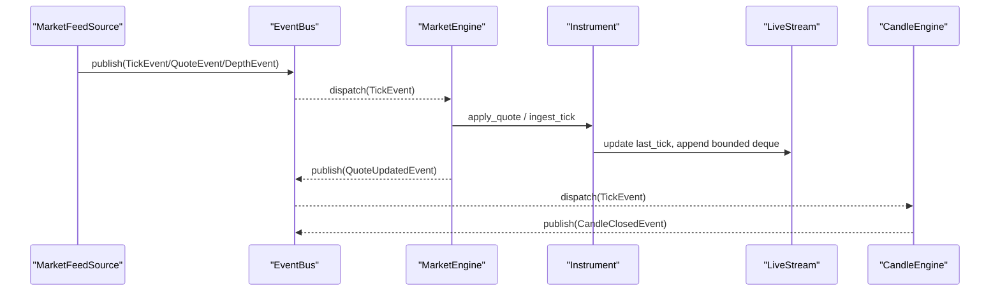
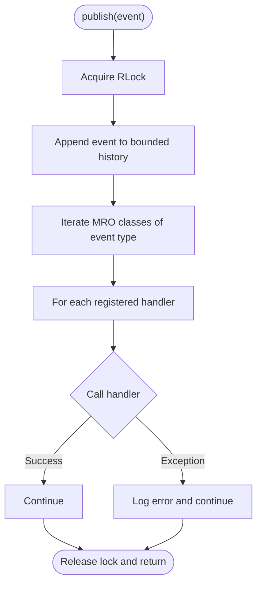
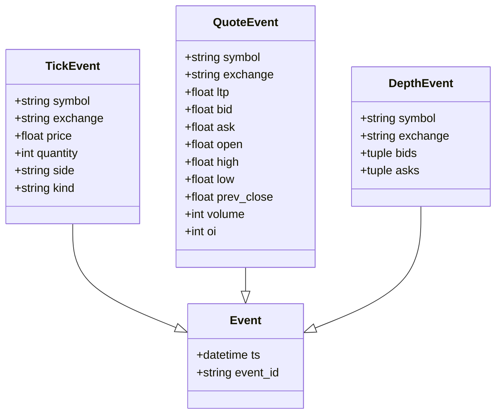
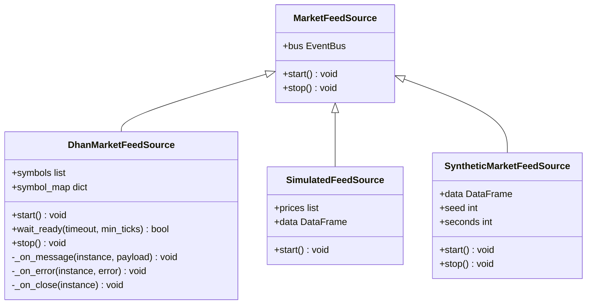
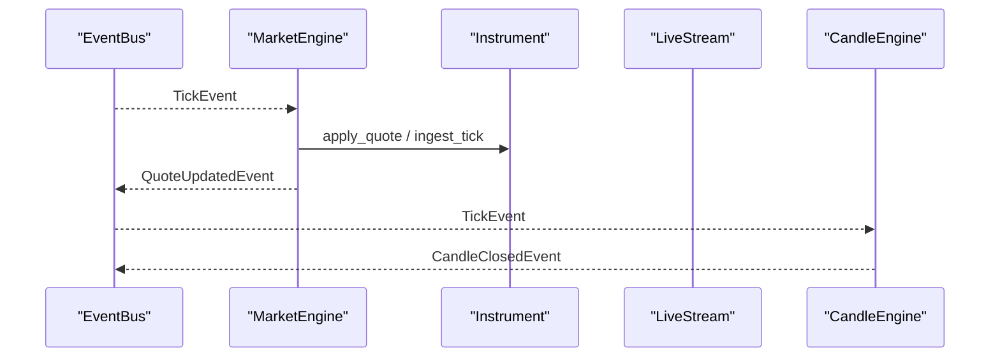
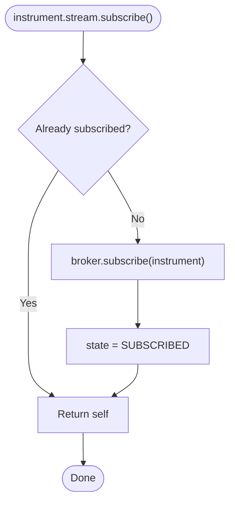
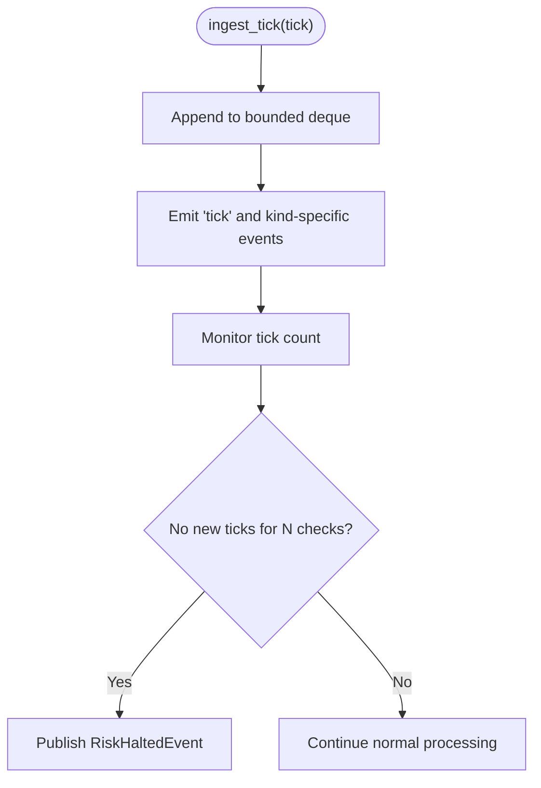
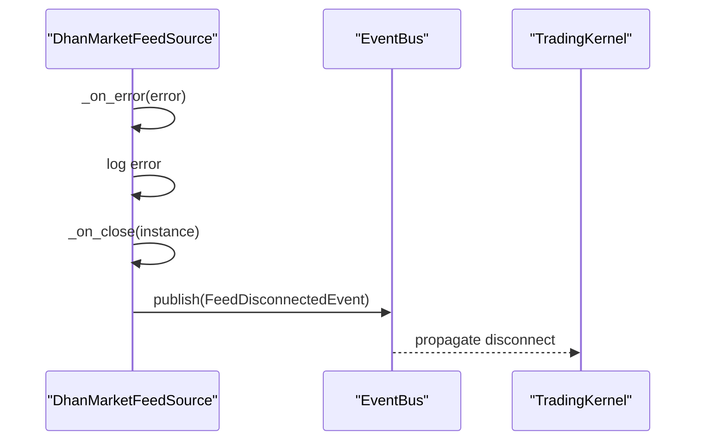
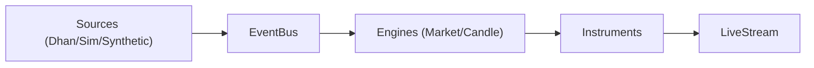

# Streaming Infrastructure

<cite>
**Referenced Files in This Document**
- [event_bus.py](file://ntrade/kernel/event_bus.py)
- [base.py](file://ntrade/events/base.py)
- [market.py](file://ntrade/events/market.py)
- [stream.py](file://ntrade/domain/market/stream.py)
- [quote.py](file://ntrade/domain/market/quote.py)
- [depth.py](file://ntrade/domain/market/depth.py)
- [dhan_feed.py](file://ntrade/sources/dhan_feed.py)
- [market_feed.py](file://ntrade/sources/market_feed.py)
- [synthetic_feed.py](file://ntrade/sources/synthetic_feed.py)
- [market_engine.py](file://ntrade/engines/market_engine.py)
- [candle_engine.py](file://ntrade/engines/candle_engine.py)
- [session.py](file://ntrade/kernel/session.py)
- [base.py](file://ntrade/brokers/base.py)
- [live_runner.py](file://ntrade/runner/live_runner.py)
</cite>

## Table of Contents
1. [Introduction](#introduction)
2. [Project Structure](#project-structure)
3. [Core Components](#core-components)
4. [Architecture Overview](#architecture-overview)
5. [Detailed Component Analysis](#detailed-component-analysis)
6. [Dependency Analysis](#dependency-analysis)
7. [Performance Considerations](#performance-considerations)
8. [Troubleshooting Guide](#troubleshooting-guide)
9. [Conclusion](#conclusion)

## Introduction
This document explains the market data streaming infrastructure in nTrade, focusing on the event-driven architecture that powers real-time processing via the EventBus system. It documents the core event types (TickEvent, QuoteEvent, DepthEvent), subscription management across symbols and exchanges, event routing through engines, backpressure and flow control strategies, error handling patterns, and performance optimizations such as batching, memory-efficient structures, and thread-safe operations. It also provides practical guidance for subscribing to events, implementing custom handlers, and monitoring stream health.

## Project Structure
The streaming pipeline is composed of:
- Event sources (live websockets, simulated feeds, synthetic feeds) producing canonical events
- A synchronous, thread-safe EventBus for publish/subscribe
- Engines that consume raw events and project them into instrument read-model state
- Instrument-level LiveStream objects managing per-instrument subscriptions and tick history
- Kernel orchestration wiring engines and lifecycle

```mermaid
graph TB
subgraph "Sources"
Dhan["DhanMarketFeedSource"]
Sim["SimulatedFeedSource"]
Synth["SyntheticMarketFeedSource"]
end
subgraph "Kernel"
Bus["EventBus"]
Kernel["TradingKernel"]
end
subgraph "Engines"
Market["MarketEngine"]
Candle["CandleEngine"]
end
subgraph "Instruments"
Inst["Instrument"]
Stream["LiveStream"]
end
Dhan --> Bus
Sim --> Bus
Synth --> Bus
Bus --> Market
Bus --> Candle
Market --> Inst
Inst --> Stream
```

**Diagram sources**
- [dhan_feed.py](file://ntrade/sources/dhan_feed.py)
- [market_feed.py](file://ntrade/sources/market_feed.py)
- [synthetic_feed.py](file://ntrade/sources/synthetic_feed.py)
- [event_bus.py](file://ntrade/kernel/event_bus.py)
- [session.py](file://ntrade/kernel/session.py)
- [market_engine.py](file://ntrade/engines/market_engine.py)
- [candle_engine.py](file://ntrade/engines/candle_engine.py)
- [stream.py](file://ntrade/domain/market/stream.py)
- [base.py](file://ntrade/domain/instruments/base.py)

**Section sources**
- [event_bus.py](file://ntrade/kernel/event_bus.py)
- [market_feed.py](file://ntrade/sources/market_feed.py)
- [session.py](file://ntrade/kernel/session.py)

## Core Components
- EventBus: Synchronous, reentrant-lock protected pub/sub with bounded history and exception isolation for handlers.
- Events: Immutable dataclass events carrying kernel-clock timestamps; includes TickEvent, QuoteEvent, DepthEvent, and derived events.
- MarketFeedSource: Abstract source interface for interchangeable producers (live, sim, synthetic).
- DhanMarketFeedSource: Live websocket adapter mapping wire payloads to canonical events and publishing to the bus.
- SimulatedFeedSource and SyntheticMarketFeedSource: Deterministic offline sources emitting canonical events.
- MarketEngine: Consumes raw events, updates instrument read-models, and broadcasts normalized QuoteUpdatedEvent.
- CandleEngine: Aggregates ticks into time-bucketed candles and emits closed candle events.
- LiveStream: Per-instrument subscription lifecycle, tick cache, and event emission hooks.

**Section sources**
- [event_bus.py](file://ntrade/kernel/event_bus.py)
- [base.py](file://ntrade/events/base.py)
- [market.py](file://ntrade/events/market.py)
- [market_feed.py](file://ntrade/sources/market_feed.py)
- [dhan_feed.py](file://ntrade/sources/dhan_feed.py)
- [synthetic_feed.py](file://ntrade/sources/synthetic_feed.py)
- [market_engine.py](file://ntrade/engines/market_engine.py)
- [candle_engine.py](file://ntrade/engines/candle_engine.py)
- [stream.py](file://ntrade/domain/market/stream.py)

## Architecture Overview
The streaming architecture follows a zero-parity design: all sources produce identical canonical events, enabling live, replay, and simulation to run identically. The EventBus serializes dispatch to avoid torn states across producer threads. Engines subscribe to base event types and broadcast higher-level events to downstream consumers.



**Diagram sources**
- [dhan_feed.py](file://ntrade/sources/dhan_feed.py)
- [event_bus.py](file://ntrade/kernel/event_bus.py)
- [market_engine.py](file://ntrade/engines/market_engine.py)
- [candle_engine.py](file://ntrade/engines/candle_engine.py)
- [stream.py](file://ntrade/domain/market/stream.py)
- [base.py](file://ntrade/domain/instruments/base.py)

## Detailed Component Analysis

### EventBus: Thread-Safe Pub/Sub with Bounded History
- Responsibilities:
  - Subscribe/unsubscribe handlers by event type (including subclasses via MRO).
  - Publish events with serialized dispatch using a reentrant lock.
  - Maintain a bounded history deque for replay and auditing.
  - Isolate handler exceptions so one failing subscriber cannot disrupt others.
- Complexity:
  - Publish is O(N) over matching subscribers; history append is O(1) amortized.
- Error handling:
  - Exceptions in handlers are caught and logged; dispatch continues.
- Performance:
  - Reentrant lock ensures safe concurrent access from multiple producer threads.
  - Bounded history prevents unbounded memory growth.



**Diagram sources**
- [event_bus.py](file://ntrade/kernel/event_bus.py)

**Section sources**
- [event_bus.py](file://ntrade/kernel/event_bus.py)

### Event Types: TickEvent, QuoteEvent, DepthEvent
- TickEvent: Single trade/quote/depth print with symbol, exchange, price, quantity, side, kind, and timestamp.
- QuoteEvent: Full snapshot including LTP, bid/ask, OHLC, volume, open interest, and timestamp.
- DepthEvent: Order-book snapshot with bids/asks as tuples of (price, quantity, orders).
- Base Event: Immutable dataclass with kernel-clock timestamp and unique ID.



**Diagram sources**
- [base.py](file://ntrade/events/base.py)
- [market.py](file://ntrade/events/market.py)

**Section sources**
- [base.py](file://ntrade/events/base.py)
- [market.py](file://ntrade/events/market.py)

### MarketFeedSource Abstraction and Implementations
- MarketFeedSource: Abstract interface defining start/stop and bus access; enables zero-parity across sources.
- DhanMarketFeedSource:
  - Maps wire payloads to canonical events via dhan_payload_to_events.
  - Starts a background thread for websocket callbacks.
  - Handles errors and disconnects, publishing FeedDisconnectedEvent.
- SimulatedFeedSource:
  - Emits deterministic TickEvent/QuoteEvent sequences from prices or OHLCV frames.
- SyntheticMarketFeedSource:
  - Generates 1-second ticks from 1m OHLCV bars using a seeded simulator.



**Diagram sources**
- [market_feed.py](file://ntrade/sources/market_feed.py)
- [dhan_feed.py](file://ntrade/sources/dhan_feed.py)
- [synthetic_feed.py](file://ntrade/sources/synthetic_feed.py)

**Section sources**
- [market_feed.py](file://ntrade/sources/market_feed.py)
- [dhan_feed.py](file://ntrade/sources/dhan_feed.py)
- [synthetic_feed.py](file://ntrade/sources/synthetic_feed.py)

### Event Routing Through Engines
- MarketEngine:
  - Subscribes to TickEvent, QuoteEvent, DepthEvent.
  - Updates instrument read-models and publishes QuoteUpdatedEvent.
- CandleEngine:
  - Subscribes to TickEvent, aggregates into time-bucketed candles, publishes CandleClosedEvent.



**Diagram sources**
- [market_engine.py](file://ntrade/engines/market_engine.py)
- [candle_engine.py](file://ntrade/engines/candle_engine.py)
- [stream.py](file://ntrade/domain/market/stream.py)

**Section sources**
- [market_engine.py](file://ntrade/engines/market_engine.py)
- [candle_engine.py](file://ntrade/engines/candle_engine.py)

### Subscription Management: Symbols and Exchanges
- Per-instrument LiveStream manages lifecycle:
  - subscribe/unsubscribe delegates to broker adapter.
  - Maintains bounded tick history and exposes last_tick and tick_count.
  - Emits typed events (tick, quote, trade, depth, disconnect, reconnect).
- BrokerAdapter.disconnect notifies all instruments’ streams and clears subscriptions.



**Diagram sources**
- [stream.py](file://ntrade/domain/market/stream.py)
- [base.py](file://ntrade/brokers/base.py)

**Section sources**
- [stream.py](file://ntrade/domain/market/stream.py)
- [base.py](file://ntrade/brokers/base.py)

### Backpressure and Flow Control
- Bounded tick history:
  - LiveStream._ticks uses a deque with maxlen to cap memory usage under high-frequency loads.
- Engine buffering:
  - CandleEngine maintains a bounded buffer of closed candles per symbol.
- Feed watchdog:
  - LiveRunner monitors total tick counts across instruments; if no new ticks for N checks, it publishes RiskHaltedEvent to halt risk exposure.
- EventBus serialization:
  - Reentrant lock serializes dispatch, preventing interleaved reads/writes across producer threads.



**Diagram sources**
- [stream.py](file://ntrade/domain/market/stream.py)
- [candle_engine.py](file://ntrade/engines/candle_engine.py)
- [live_runner.py](file://ntrade/runner/live_runner.py)

**Section sources**
- [stream.py](file://ntrade/domain/market/stream.py)
- [candle_engine.py](file://ntrade/engines/candle_engine.py)
- [live_runner.py](file://ntrade/runner/live_runner.py)

### Error Handling Patterns
- Handler isolation:
  - EventBus catches exceptions in handlers and logs without halting dispatch.
- Feed resilience:
  - DhanMarketFeedSource._on_error logs errors; _on_close publishes FeedDisconnectedEvent.
  - Non-dict payloads and malformed fields are skipped safely.
- Broker disconnect:
  - BrokerAdapter.disconnect notifies all instruments’ streams and clears subscriptions.
- Graceful degradation:
  - Instruments retain previous quotes on broker failures during refresh.



**Diagram sources**
- [dhan_feed.py](file://ntrade/sources/dhan_feed.py)
- [event_bus.py](file://ntrade/kernel/event_bus.py)
- [session.py](file://ntrade/kernel/session.py)

**Section sources**
- [dhan_feed.py](file://ntrade/sources/dhan_feed.py)
- [event_bus.py](file://ntrade/kernel/event_bus.py)
- [base.py](file://ntrade/brokers/base.py)

### Examples: Subscriptions, Custom Handlers, Monitoring
- Subscribe to market events:
  - Use engine subscriptions to base event types (e.g., MarketEngine subscribes to TickEvent/QuoteEvent/DepthEvent).
- Implement custom event handlers:
  - Register handlers via EventBus.subscribe(event_type, handler); ensure handlers are exception-safe.
- Monitor stream health:
  - Inspect instrument.stream.tick_count and is_live status.
  - Use heartbeat events published by LiveRunner to track tick throughput and open orders.

[No sources needed since this section provides general guidance]

## Dependency Analysis
The streaming components have clear separation of concerns:
- Sources depend on the kernel’s bus but not on engines.
- Engines depend on the bus and instrument read-models.
- Instruments encapsulate state and expose capabilities; they do not depend on sources directly.
- Kernel orchestrates wiring and lifecycle.



**Diagram sources**
- [dhan_feed.py](file://ntrade/sources/dhan_feed.py)
- [market_feed.py](file://ntrade/sources/market_feed.py)
- [synthetic_feed.py](file://ntrade/sources/synthetic_feed.py)
- [event_bus.py](file://ntrade/kernel/event_bus.py)
- [market_engine.py](file://ntrade/engines/market_engine.py)
- [candle_engine.py](file://ntrade/engines/candle_engine.py)
- [stream.py](file://ntrade/domain/market/stream.py)

**Section sources**
- [session.py](file://ntrade/kernel/session.py)
- [event_bus.py](file://ntrade/kernel/event_bus.py)

## Performance Considerations
- Memory efficiency:
  - Bounded deques for tick history and candle buffers prevent unbounded growth.
  - Immutable dataclasses reduce copying overhead and enable safe sharing.
- Threading safety:
  - Reentrant lock in EventBus serializes dispatch across producer threads.
- Event batching:
  - CandleEngine batches ticks into time buckets before emitting closed candles.
- Zero-parity:
  - Canonical events allow identical processing across live, replay, and simulation modes.
- Optimization opportunities:
  - Minimize per-event allocations by reusing lightweight structures where possible.
  - Avoid heavy computations inside hot-path handlers; offload to background workers if necessary.

[No sources needed since this section provides general guidance]

## Troubleshooting Guide
- No ticks received:
  - Check feed watchdog metrics; if stalled, RiskHaltedEvent will be published.
  - Verify DhanMarketFeedSource.running and payloads_ingested counters.
- Connection failures:
  - Inspect feed error logs; confirm FeedDisconnectedEvent is emitted.
  - Ensure broker.disconnect properly notifies streams and clears subscriptions.
- Data validation errors:
  - Malformed payloads are skipped; verify symbol_map mappings and payload structure.
- Handler exceptions:
  - Review EventBus logs for handler errors; isolate faulty handlers to maintain stability.

**Section sources**
- [live_runner.py](file://ntrade/runner/live_runner.py)
- [dhan_feed.py](file://ntrade/sources/dhan_feed.py)
- [event_bus.py](file://ntrade/kernel/event_bus.py)
- [base.py](file://ntrade/brokers/base.py)

## Conclusion
The nTrade streaming infrastructure leverages an event-driven architecture centered around a thread-safe EventBus, immutable canonical events, and pluggable sources. Engines normalize and route data to instrument read-models, while per-instrument LiveStream objects manage subscription lifecycles and bounded histories. Robust error handling, backpressure mechanisms, and zero-parity design ensure reliability and consistency across live, replay, and simulation environments. By following the patterns outlined here, developers can implement scalable, resilient market data pipelines with clear extension points for custom handlers and monitoring.