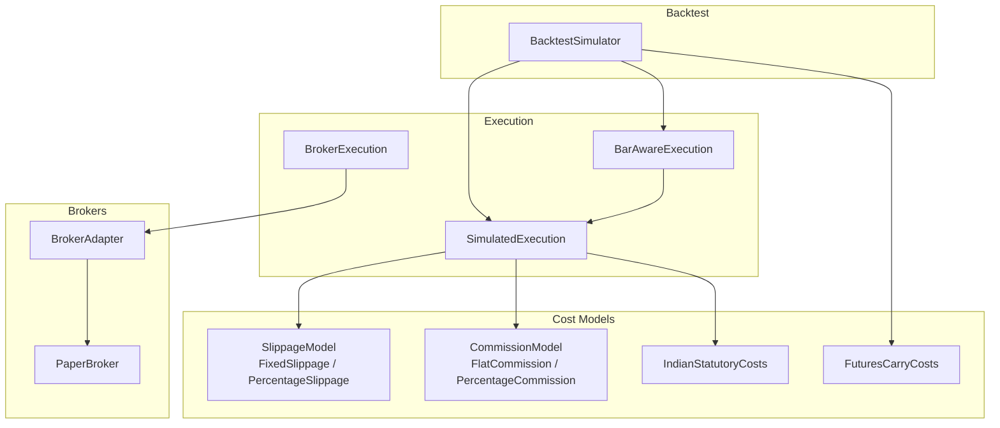
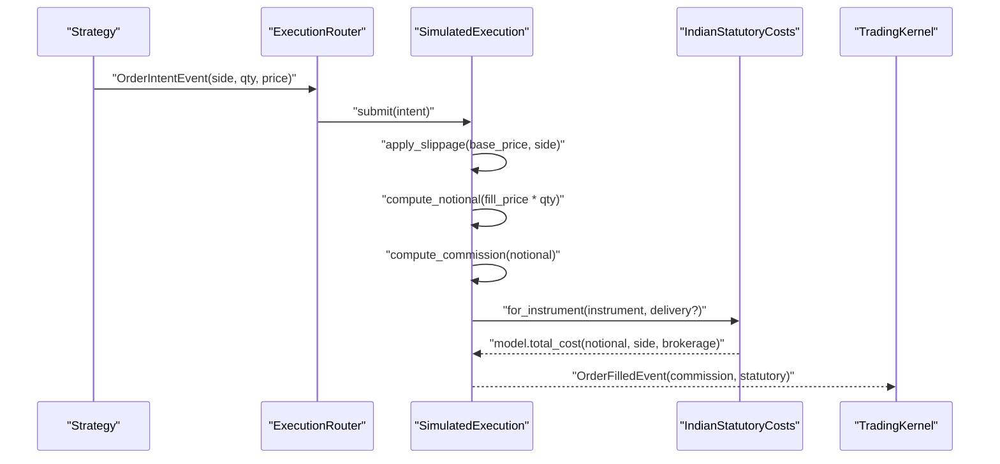
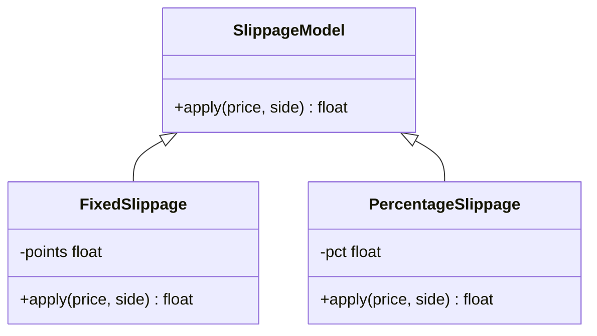
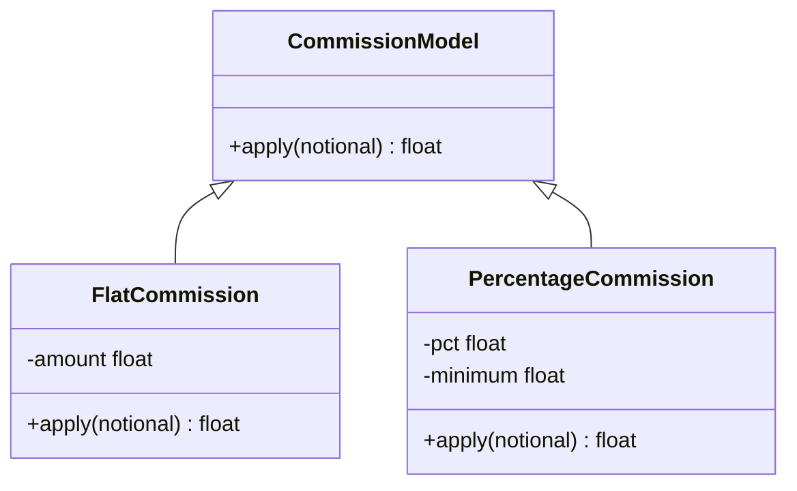
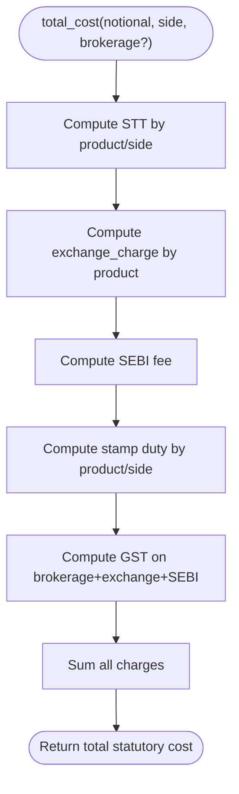
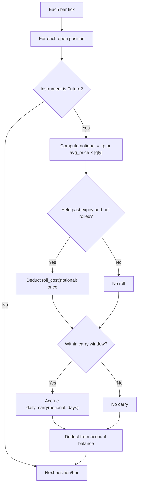
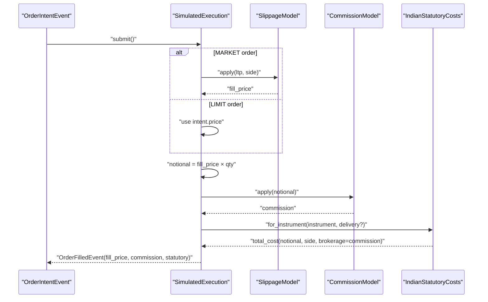
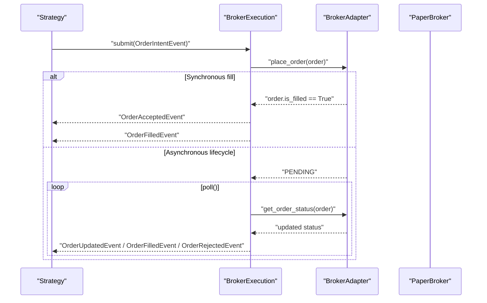
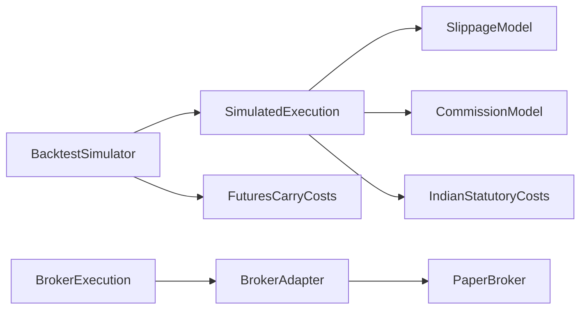

# Cost Modeling & Fee Calculation

<cite>
**Referenced Files in This Document**
- [costs.py](file://ntrade/execution/costs.py)
- [simulator.py](file://ntrade/execution/simulator.py)
- [fills.py](file://ntrade/backtest/fills.py)
- [simulator.py](file://ntrade/backtest/simulator.py)
- [broker_executor.py](file://ntrade/execution/broker_executor.py)
- [base.py](file://ntrade/brokers/base.py)
- [paper.py](file://ntrade/brokers/paper.py)
- [test_costs_india.py](file://tests/test_costs_india.py)
- [test_futures_carry_costs.py](file://tests/test_futures_carry_costs.py)
</cite>

## Table of Contents
1. [Introduction](#introduction)
2. [Project Structure](#project-structure)
3. [Core Components](#core-components)
4. [Architecture Overview](#architecture-overview)
5. [Detailed Component Analysis](#detailed-component-analysis)
6. [Dependency Analysis](#dependency-analysis)
7. [Performance Considerations](#performance-considerations)
8. [Troubleshooting Guide](#troubleshooting-guide)
9. [Conclusion](#conclusion)
10. [Appendices](#appendices)

## Introduction
This document explains the cost modeling and fee calculation system used across backtesting, paper trading, and live execution. It covers how total trading costs are computed (commissions, slippage, statutory charges, and futures carry/roll), how different models apply by instrument type and market segment, and how expected vs actual costs are derived. It also includes configuration examples, tax calculations for Indian markets, and strategies to optimize transaction costs while preserving execution quality.

## Project Structure
The cost engine is implemented as a set of composable models and execution targets that ensure zero parity between simulated and live flows:
- Execution targets compute fills and attach commission/statutory costs per fill.
- Backtest simulator orchestrates runs and aggregates all cost components.
- Broker executor routes orders to real brokers without altering the cost pipeline.
- Tests validate statutory rates and futures carry logic.

**Diagram sources**
- [simulator.py:43-147](file://ntrade/execution/simulator.py#L43-L147)
- [fills.py:44-72](file://ntrade/backtest/fills.py#L44-L72)
- [simulator.py:58-220](file://ntrade/backtest/simulator.py#L58-L220)
- [broker_executor.py:46-262](file://ntrade/execution/broker_executor.py#L46-L262)
- [base.py:25-163](file://ntrade/brokers/base.py#L25-L163)
- [paper.py:23-216](file://ntrade/brokers/paper.py#L23-L216)
- [costs.py:21-285](file://ntrade/execution/costs.py#L21-L285)

**Section sources**
- [simulator.py:43-147](file://ntrade/execution/simulator.py#L43-L147)
- [fills.py:16-72](file://ntrade/backtest/fills.py#L16-L72)
- [simulator.py:58-220](file://ntrade/backtest/simulator.py#L58-L220)
- [broker_executor.py:46-262](file://ntrade/execution/broker_executor.py#L46-L262)
- [base.py:25-163](file://ntrade/brokers/base.py#L25-L163)
- [paper.py:23-216](file://ntrade/brokers/paper.py#L23-L216)
- [costs.py:21-285](file://ntrade/execution/costs.py#L21-L285)

## Core Components
- Slippage models adjust the executed price based on order side.
- Commission models charge a fixed or percentage-based fee on notional.
- IndianStatutoryCosts computes STT, exchange charges, SEBI fee, GST, and stamp duty with product/delivery-aware schedules.
- FuturesCarryCosts accrues daily carry and one-off roll costs for futures positions.
- SimulatedExecution applies slippage, commission, and statutory costs deterministically; BarAwareExecution adds bar-aware limit fills; BrokerExecution integrates with live broker adapters.

Key responsibilities:
- Compute fill price after slippage.
- Compute commission from notional.
- Compute statutory charges using instrument class and delivery state.
- Track and aggregate total costs per trade and across runs.

**Section sources**
- [costs.py:21-285](file://ntrade/execution/costs.py#L21-L285)
- [simulator.py:43-147](file://ntrade/execution/simulator.py#L43-L147)
- [fills.py:44-72](file://ntrade/backtest/fills.py#L44-L72)
- [simulator.py:58-220](file://ntrade/backtest/simulator.py#L58-L220)

## Architecture Overview
The cost pipeline is consistent across environments:
- Strategy emits OrderIntentEvent.
- Execution target (SimulatedExecution or BrokerExecution) resolves fill price and attaches costs.
- BacktestSimulator aggregates commissions, statutory, and futures costs into results.

**Diagram sources**
- [simulator.py:72-147](file://ntrade/execution/simulator.py#L72-L147)
- [costs.py:164-174](file://ntrade/execution/costs.py#L164-L174)
- [simulator.py:194-220](file://ntrade/backtest/simulator.py#L194-L220)

## Detailed Component Analysis

### Slippage Models
- FixedSlippage: Adds/subtracts a fixed number of points depending on BUY/SELL.
- PercentageSlippage: Multiplies price by (1 ± pct) based on side.

These models determine the effective execution price before commission and statutory charges.

**Diagram sources**
- [costs.py:21-41](file://ntrade/execution/costs.py#L21-L41)

**Section sources**
- [costs.py:21-41](file://ntrade/execution/costs.py#L21-L41)

### Commission Models
- FlatCommission: Charges a fixed amount per notional.
- PercentageCommission: Charges a percentage of notional with an optional minimum floor.

Commissions are applied to the notional derived from fill price and quantity.

**Diagram sources**
- [costs.py:43-64](file://ntrade/execution/costs.py#L43-L64)

**Section sources**
- [costs.py:43-64](file://ntrade/execution/costs.py#L43-L64)

### Indian Statutory Costs
IndianStatutoryCosts implements additive charges:
- STT: Different rates for equity delivery/intraday and F&O buy/sell.
- Exchange charge: Product-specific rate on notional.
- SEBI fee: Small percentage on notional.
- Stamp duty: Buy-side only for most products; varies by product and delivery.
- GST: 18% on (brokerage + exchange charge + SEBI fee).

Product and delivery selection:
- Instrument class determines product schedule (equity/futures/options).
- Delivery flag switches equity intraday vs delivery schedules.
- for_instrument() returns a model configured for the instrument’s schedule.

**Diagram sources**
- [costs.py:122-174](file://ntrade/execution/costs.py#L122-L174)

Configuration and override capabilities:
- Custom rates can be provided for STT, exchange charge, SEBI fee, GST rate, and stamp duty.
- resolve_statutory() allows defaulting to realistic Indian charges or opting out entirely.

**Section sources**
- [costs.py:70-205](file://ntrade/execution/costs.py#L70-L205)
- [test_costs_india.py:10-79](file://tests/test_costs_india.py#L10-L79)

### Futures Carry and Roll Costs
FuturesCarryCosts models holding-period costs:
- daily_carry(notional, days): Notional × (risk_free − dividend_yield) × days/365.
- roll_cost(notional): One-off slippage when rolling past expiry.
- within_window(expiry, now): Limits accrual to a configurable window before expiry.

BacktestSimulator applies these costs per day for open futures positions and deducts them from account balance, ensuring PnL convergence with live behavior.

**Diagram sources**
- [costs.py:207-258](file://ntrade/execution/costs.py#L207-L258)
- [simulator.py:145-187](file://ntrade/backtest/simulator.py#L145-L187)

**Section sources**
- [costs.py:207-258](file://ntrade/execution/costs.py#L207-L258)
- [test_futures_carry_costs.py:22-102](file://tests/test_futures_carry_costs.py#L22-L102)
- [simulator.py:145-187](file://ntrade/backtest/simulator.py#L145-L187)

### Simulated Execution Pipeline
SimulatedExecution:
- Determines fill price via slippage for MARKET orders or uses intent price for LIMIT.
- Computes commission from notional.
- Applies statutory charges using instrument-derived schedule and delivery detection for overnight equity exits.
- Emits OrderFilledEvent with commission and statutory fields.

BarAwareExecution extends this to enforce bar-aware limit fills.

**Diagram sources**
- [simulator.py:72-147](file://ntrade/execution/simulator.py#L72-L147)
- [costs.py:164-174](file://ntrade/execution/costs.py#L164-L174)

**Section sources**
- [simulator.py:43-147](file://ntrade/execution/simulator.py#L43-L147)
- [fills.py:44-72](file://ntrade/backtest/fills.py#L44-L72)

### Broker Execution Integration
BrokerExecution routes intents to a BrokerAdapter and publishes lifecycle events. While it does not alter cost models, it ensures parity by emitting fills through the same event bus used by SimulatedExecution. PaperBroker provides deterministic fills for testing and replay.

**Diagram sources**
- [broker_executor.py:58-169](file://ntrade/execution/broker_executor.py#L58-L169)
- [base.py:96-136](file://ntrade/brokers/base.py#L96-L136)
- [paper.py:108-118](file://ntrade/brokers/paper.py#L108-L118)

**Section sources**
- [broker_executor.py:46-262](file://ntrade/execution/broker_executor.py#L46-L262)
- [base.py:25-163](file://ntrade/brokers/base.py#L25-L163)
- [paper.py:23-216](file://ntrade/brokers/paper.py#L23-L216)

## Dependency Analysis
- SimulatedExecution depends on SlippageModel, CommissionModel, and IndianStatutoryCosts.
- BacktestSimulator wires execution targets and aggregates costs across fills and futures holdings.
- BrokerExecution depends on BrokerAdapter implementations; PaperBroker provides deterministic behavior.
- Tests validate statutory rates and futures carry logic.

**Diagram sources**
- [simulator.py:43-147](file://ntrade/execution/simulator.py#L43-L147)
- [simulator.py:58-220](file://ntrade/backtest/simulator.py#L58-L220)
- [broker_executor.py:46-262](file://ntrade/execution/broker_executor.py#L46-L262)
- [base.py:25-163](file://ntrade/brokers/base.py#L25-L163)
- [paper.py:23-216](file://ntrade/brokers/paper.py#L23-L216)
- [costs.py:21-285](file://ntrade/execution/costs.py#L21-L285)

**Section sources**
- [simulator.py:43-147](file://ntrade/execution/simulator.py#L43-L147)
- [simulator.py:58-220](file://ntrade/backtest/simulator.py#L58-L220)
- [broker_executor.py:46-262](file://ntrade/execution/broker_executor.py#L46-L262)
- [base.py:25-163](file://ntrade/brokers/base.py#L25-L163)
- [paper.py:23-216](file://ntrade/brokers/paper.py#L23-L216)
- [costs.py:21-285](file://ntrade/execution/costs.py#L21-L285)

## Performance Considerations
- Deterministic fills in SimulatedExecution avoid network overhead and ensure reproducible results.
- Aggregating costs per fill minimizes repeated computations; totals are computed at result time.
- Futures carry accrual is limited to a configurable window to prevent double-counting and reduce unnecessary calculations.
- Using STATUTORY_DEFAULT ensures realistic charges without custom configuration overhead.

[No sources needed since this section provides general guidance]

## Troubleshooting Guide
Common issues and resolutions:
- No market price available: Ensure quotes are present before submitting MARKET orders.
- Invalid fill price: Verify limit prices and bar-touch conditions for BarAwareExecution.
- Unexpected statutory costs: Confirm product/delivery settings and instrument class mapping.
- Missing futures costs: Enable FuturesCarryCosts and ensure positions are held within the carry window.

Validation references:
- Statutory rates and edge cases are covered by tests for equity delivery/intraday and F&O schedules.
- Futures carry and roll behaviors are validated across multiple scenarios.

**Section sources**
- [test_costs_india.py:10-79](file://tests/test_costs_india.py#L10-L79)
- [test_futures_carry_costs.py:22-102](file://tests/test_futures_carry_costs.py#L22-L102)
- [simulator.py:72-96](file://ntrade/execution/simulator.py#L72-L96)
- [fills.py:59-71](file://ntrade/backtest/fills.py#L59-L71)

## Conclusion
The cost modeling system provides a robust, zero-parity pipeline for computing total trading costs across backtests, paper trading, and live execution. By composing slippage, commission, and statutory models—and adding futures carry/roll where applicable—it ensures accurate expected vs actual cost analysis and supports optimization strategies that preserve execution quality.

[No sources needed since this section summarizes without analyzing specific files]

## Appendices

### Configuration Examples
- Basic backtest with default statutory charges and fixed slippage:
  - Configure BacktestSimulator with symbol, exchange, initial cash, slippage, and statutory defaults.
- Delivery-equity backtest:
  - Pass IndianStatutoryCosts(product="equity", delivery=True) to simulate delivery schedules.
- Futures carry modeling:
  - Instantiate FuturesCarryCosts with risk-free rate, dividend yield, roll percentage, and carry window; pass to BacktestSimulator.

References:
- [simulator.py:58-109](file://ntrade/backtest/simulator.py#L58-L109)
- [costs.py:99-121](file://ntrade/execution/costs.py#L99-L121)
- [test_futures_carry_costs.py:60-86](file://tests/test_futures_carry_costs.py#L60-L86)

### Expected vs Actual Costs
- Expected costs: Derived from configured slippage, commission, and statutory models during simulation.
- Actual costs: In live trading, use broker-reported fills and apply the same statutory model to reconcile differences.

References:
- [simulator.py:103-146](file://ntrade/execution/simulator.py#L103-L146)
- [simulator.py:194-220](file://ntrade/backtest/simulator.py#L194-L220)

### Tax Calculations for Indian Markets
- STT: Product- and side-dependent rates for equity and F&O.
- Exchange charge: Product-specific percentage on notional.
- SEBI fee: Small percentage on notional.
- Stamp duty: Typically buy-side only; varies by product and delivery.
- GST: 18% on brokerage plus exchange charge and SEBI fee.

References:
- [costs.py:70-174](file://ntrade/execution/costs.py#L70-L174)
- [test_costs_india.py:10-79](file://tests/test_costs_india.py#L10-L79)

### Optimization Strategies
- Reduce slippage: Use limit orders with bar-aware policies and avoid illiquid sessions.
- Minimize commission: Choose flat or percentage models aligned with typical notional sizes.
- Optimize statutory exposure: Avoid unnecessary delivery conversions; keep intraday trades when appropriate.
- Manage futures carry: Hold positions outside the carry window when possible; consider roll timing to minimize roll costs.

[No sources needed since this section provides general guidance]