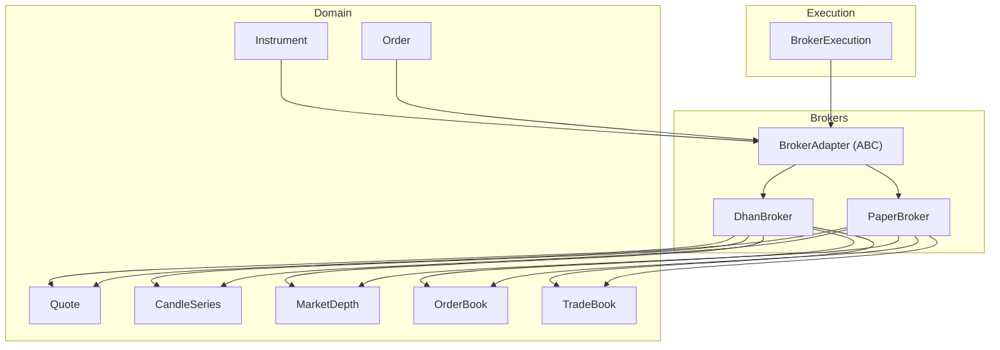
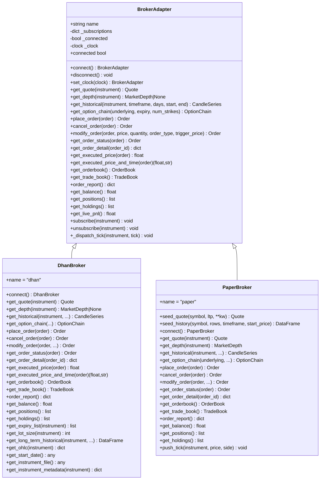
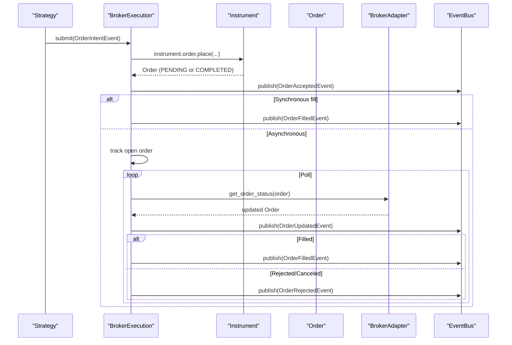
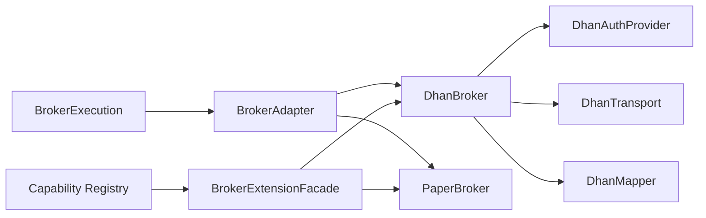

# Broker Adapter Pattern

<cite>
**Referenced Files in This Document**
- [base.py](file://ntrade/brokers/base.py)
- [capabilities.py](file://ntrade/brokers/capabilities.py)
- [dhan.py](file://ntrade/brokers/dhan.py)
- [paper.py](file://ntrade/brokers/paper.py)
- [broker_executor.py](file://ntrade/execution/broker_executor.py)
- [test_brokers.py](file://tests/test_brokers.py)
</cite>

## Table of Contents
1. [Introduction](#introduction)
2. [Project Structure](#project-structure)
3. [Core Components](#core-components)
4. [Architecture Overview](#architecture-overview)
5. [Detailed Component Analysis](#detailed-component-analysis)
6. [Dependency Analysis](#dependency-analysis)
7. [Performance Considerations](#performance-considerations)
8. [Troubleshooting Guide](#troubleshooting-guide)
9. [Conclusion](#conclusion)
10. [Appendices](#appendices)

## Introduction
This document explains the BrokerAdapter abstract base class and the adapter pattern used to unify broker integrations across different providers. It details the required interface, optional capabilities, error handling conventions, and how the execution layer interacts with adapters. You will learn how to implement a custom broker adapter, handle broker-specific quirks via the capability system, and test implementations consistently using a paper broker.

## Project Structure
The broker subsystem is organized around an abstract adapter that defines a stable API for market data, orders, and portfolio queries. Concrete adapters implement this interface for specific brokers (e.g., DhanBroker, PaperBroker). A capability system enables dynamic, broker-scoped extensions without polluting the core interface. The execution layer uses a single adapter instance to submit and track orders, publish lifecycle events, and reconcile fills.

**Diagram sources**
- [base.py:25-163](file://ntrade/brokers/base.py#L25-L163)
- [dhan.py:54-634](file://ntrade/brokers/dhan.py#L54-L634)
- [paper.py:23-216](file://ntrade/brokers/paper.py#L23-L216)
- [broker_executor.py:53-290](file://ntrade/execution/broker_executor.py#L53-L290)

**Section sources**
- [base.py:1-163](file://ntrade/brokers/base.py#L1-L163)
- [capabilities.py:1-74](file://ntrade/brokers/capabilities.py#L1-L74)
- [dhan.py:1-1153](file://ntrade/brokers/dhan.py#L1-L1153)
- [paper.py:1-216](file://ntrade/brokers/paper.py#L1-L216)
- [broker_executor.py:1-290](file://ntrade/execution/broker_executor.py#L1-L290)

## Core Components
- BrokerAdapter: Abstract base defining the contract for all broker integrations. It enforces consistent methods for connection, market data, order placement, lifecycle operations, portfolio queries, and streaming subscriptions.
- Capability System: A registry-driven extension mechanism allowing broker-specific features to be exposed through a facade on instruments. Capabilities are registered globally and gated by broker name.
- DhanBroker: A concrete adapter implementing the full interface for a live broker, including robust token refresh, retries, and normalization of responses into domain objects.
- PaperBroker: A deterministic in-memory adapter used for testing and backtesting, providing identical semantics to live brokers.
- BrokerExecution: The execution layer that submits orders via the adapter, tracks open orders, polls status, emits lifecycle events, and computes costs.

Key responsibilities:
- Market data: get_quote, get_depth, get_historical, get_option_chain
- Orders: place_order, cancel_order, modify_order, get_order_status, get_order_detail
- Portfolio: get_balance, get_positions, get_holdings, get_live_pnl
- Streaming: subscribe, unsubscribe, _dispatch_tick
- Time source: set_clock and internal timestamp resolution for zero-parity replay

**Section sources**
- [base.py:25-163](file://ntrade/brokers/base.py#L25-L163)
- [capabilities.py:16-74](file://ntrade/brokers/capabilities.py#L16-L74)
- [dhan.py:54-634](file://ntrade/brokers/dhan.py#L54-L634)
- [paper.py:23-216](file://ntrade/brokers/paper.py#L23-L216)
- [broker_executor.py:53-290](file://ntrade/execution/broker_executor.py#L53-L290)

## Architecture Overview
The adapter pattern isolates broker-specific transport logic from the rest of the system. Domain code interacts only with BrokerAdapter and domain types. BrokerExecution orchestrates order submission and lifecycle polling, publishing standardized events. Capabilities allow adding broker-specific functionality without changing the base interface.

**Diagram sources**
- [base.py:25-163](file://ntrade/brokers/base.py#L25-L163)
- [dhan.py:54-634](file://ntrade/brokers/dhan.py#L54-L634)
- [paper.py:23-216](file://ntrade/brokers/paper.py#L23-L216)

## Detailed Component Analysis

### BrokerAdapter: Contract and Responsibilities
- Connection lifecycle: connect/disconnect; connected property; subscription management; clock injection for replay parity.
- Market data: quote, depth (optional), historical candles, option chain (default raises if unsupported).
- Orders: mandatory place_order; optional cancel/modify/status/detail; default implementations raise when not supported.
- Portfolio: balance, positions, holdings, live PnL; defaults raise or return neutral values.
- Streaming: subscribe/unsubscribe update instrument stream state; _dispatch_tick pushes ticks to subscribers.
- Timestamps: _ts resolves explicit now > injected clock > wall clock.

Implementation notes:
- Abstract methods enforce minimum viable implementation per broker.
- Optional methods provide safe defaults; concrete brokers override as needed.
- Subscription multiplexing centralizes transport concerns.

**Section sources**
- [base.py:25-163](file://ntrade/brokers/base.py#L25-L163)

### Capability System: Dynamic Extensions
- Capability decorator registers functions with a name and allowed brokers.
- BrokerExtensionFacade exposes capabilities via instrument.broker.<name>(...).
- If a capability is not supported by the current broker, AttributeError is raised (fail-fast).
- Example capabilities include depth20, margin_calculator, kill_switch, and many others.

Usage patterns:
- Register once at module load time.
- Call via instrument.broker.<capability>(...) anywhere in strategy or orchestration code.
- Use available() to discover supported capabilities for the active broker.

**Section sources**
- [capabilities.py:16-74](file://ntrade/brokers/capabilities.py#L16-L74)
- [dhan.py:866-1153](file://ntrade/brokers/dhan.py#L866-L1153)
- [test_brokers.py:38-66](file://tests/test_brokers.py#L38-L66)

### DhanBroker: Live Implementation
Key behaviors:
- Authentication and token refresh before critical calls.
- Robust retry and fallbacks for LTP and option chain retrieval.
- Mapping of broker-specific responses into domain objects (quotes, depth, history, books).
- SEBI-compliant behavior for F&O (convert MARKET to LIMIT with jitter).
- Bracket/super orders, GTT/forever orders, conditional triggers, and more via capabilities.

Error handling:
- Network/API failures often return None or empty structures; adapters normalize to safe defaults or raise descriptive errors where appropriate.
- Token refresh is transparent; transport is updated automatically.

**Section sources**
- [dhan.py:54-634](file://ntrade/brokers/dhan.py#L54-L634)
- [dhan.py:866-1153](file://ntrade/brokers/dhan.py#L866-L1153)

### PaperBroker: Deterministic Testing
Key behaviors:
- Always connected; provides seed_quote and seed_history for deterministic tests.
- Immediate fill for place_order (synchronous), simplifying tests and backtests.
- In-memory order book and trade book for verification.
- push_tick helper to simulate live ticks.

Testing benefits:
- Same API as live brokers ensures consistent behavior across environments.
- Deterministic outputs enable reliable assertions.

**Section sources**
- [paper.py:23-216](file://ntrade/brokers/paper.py#L23-L216)
- [test_brokers.py:10-36](file://tests/test_brokers.py#L10-L36)

### Execution Layer: BrokerExecution
Responsibilities:
- Submit intents to the broker adapter and publish accepted events immediately.
- Track open orders and poll for status updates.
- Emit filled/rejected/updated/timeout events based on broker feedback.
- Compute commissions and statutory costs per fill.
- Restore open orders after crashes using persisted deltas.

Sequence of order flow:
- submit(intent) -> instrument.order.place -> publish OrderAcceptedEvent
- poll() -> broker.get_order_status -> publish OrderUpdatedEvent / OrderFilledEvent / OrderRejectedEvent / OrderTimeoutEvent

**Diagram sources**
- [broker_executor.py:70-181](file://ntrade/execution/broker_executor.py#L70-L181)
- [base.py:96-118](file://ntrade/brokers/base.py#L96-L118)

**Section sources**
- [broker_executor.py:53-290](file://ntrade/execution/broker_executor.py#L53-L290)

## Dependency Analysis
- BrokerAdapter is the single transport boundary; domain code never imports broker-specific modules.
- DhanBroker composes authentication, transport, and mapper components to isolate concerns.
- BrokerExecution depends on BrokerAdapter and domain order types; it publishes events to the kernel event bus.
- Capabilities are global and resolved dynamically against the active broker’s name.

**Diagram sources**
- [base.py:25-163](file://ntrade/brokers/base.py#L25-L163)
- [dhan.py:54-634](file://ntrade/brokers/dhan.py#L54-L634)
- [capabilities.py:16-74](file://ntrade/brokers/capabilities.py#L16-L74)
- [broker_executor.py:53-290](file://ntrade/execution/broker_executor.py#L53-L290)

**Section sources**
- [base.py:25-163](file://ntrade/brokers/base.py#L25-L163)
- [capabilities.py:16-74](file://ntrade/brokers/capabilities.py#L16-L74)
- [dhan.py:54-634](file://ntrade/brokers/dhan.py#L54-L634)
- [broker_executor.py:53-290](file://ntrade/execution/broker_executor.py#L53-L290)

## Performance Considerations
- Zero-parity timestamps: use set_clock to ensure replay determinism; avoid wall-clock drift in tests/backtests.
- Retry and timeout strategies: DhanBroker implements retries for unstable endpoints; consider similar patterns for new brokers.
- Subscription multiplexing: minimize redundant connections by sharing transport across instruments.
- Polling cadence: tune BrokerExecution poll frequency to balance latency and broker rate limits.
- Cost computation: compute statutory costs per fill to align paper and live PnL.

[No sources needed since this section provides general guidance]

## Troubleshooting Guide
Common issues and resolutions:
- Missing order IDs: BrokerExecution allocates BRK- fallback IDs to avoid collisions; ensure your adapter sets order.order_id.
- Unsupported capabilities: AttributeError indicates the current broker does not support the capability; check available() and broker.name.
- Empty quotes/history: Validate timeframe mappings and exchange routing; DhanBroker normalizes columns and filters ranges.
- Stale orders: BrokerExecution evicts orders after repeated get_order_status failures; investigate network/auth issues.
- Token expiry: Ensure _ensure_tsl is called before critical operations; DhanBroker auto-refreshes tokens.

**Section sources**
- [broker_executor.py:109-116](file://ntrade/execution/broker_executor.py#L109-L116)
- [capabilities.py:60-70](file://ntrade/brokers/capabilities.py#L60-L70)
- [dhan.py:75-94](file://ntrade/brokers/dhan.py#L75-L94)

## Conclusion
The BrokerAdapter pattern cleanly separates broker-specific transport logic from the trading system, enabling seamless switching between providers while maintaining a consistent API. The capability system adds broker-specific features without cluttering the core interface. By following the documented contracts, error-handling conventions, and performance practices, you can implement robust broker integrations that behave identically in paper and live environments.

[No sources needed since this section summarizes without analyzing specific files]

## Appendices

### Implementing a Custom Broker Adapter
Steps:
- Subclass BrokerAdapter and implement required methods: connect, get_quote, get_historical, place_order.
- Override optional methods as needed: get_depth, cancel_order, modify_order, get_order_status, get_order_detail, get_orderbook, get_trade_book, get_balance, get_positions, get_holdings.
- Provide a meaningful name attribute for capability gating.
- Handle timestamps via set_clock/_ts for replay parity.
- Normalize responses into domain objects (Quote, CandleSeries, MarketDepth, OrderBook, TradeBook).

Example references:
- Minimal synchronous adapter: see PaperBroker for immediate fills and deterministic behavior.
- Full-featured live adapter: see DhanBroker for auth, retries, mapping, and advanced order types.

**Section sources**
- [base.py:25-163](file://ntrade/brokers/base.py#L25-L163)
- [paper.py:23-216](file://ntrade/brokers/paper.py#L23-L216)
- [dhan.py:54-634](file://ntrade/brokers/dhan.py#L54-L634)

### Handling Broker-Specific Quirks
- Timeframe mapping: validate and map user-facing intervals to broker-specific strings; raise on unsupported values.
- Exchange routing: some brokers require mapped exchanges for derivatives; mirror wrapper behavior.
- Data normalization: standardize column names and missing values; return safe defaults or empty structures.
- Order types: enforce regulatory constraints (e.g., convert MARKET to LIMIT for F&O).

**Section sources**
- [dhan.py:725-745](file://ntrade/brokers/dhan.py#L725-L745)
- [dhan.py:304-351](file://ntrade/brokers/dhan.py#L304-L351)

### Testing Broker Implementations
Use PaperBroker for deterministic tests:
- Seed quotes and history for reproducible results.
- Assert order lifecycle events and final states.
- Verify capability availability and behavior.

Test references:
- Quote and depth assertions
- History seeding and filtering
- Balance and order counts
- Capability registry and facade behavior

**Section sources**
- [test_brokers.py:10-66](file://tests/test_brokers.py#L10-L66)

### Contract Between Adapters and Execution Layer
- Submit intent -> accept immediately -> poll for updates -> emit lifecycle events.
- Open order tracking includes intent, order snapshot, filled quantities, and timestamps.
- Costs are computed per fill using commission model and statutory rules.
- Crash recovery restores open orders from persisted deltas.

**Section sources**
- [broker_executor.py:70-181](file://ntrade/execution/broker_executor.py#L70-L181)
- [broker_executor.py:188-231](file://ntrade/execution/broker_executor.py#L188-L231)
- [broker_executor.py:253-290](file://ntrade/execution/broker_executor.py#L253-L290)

### Best Practices for Robust Broker Integrations
- Enforce minimal viable interface first; add optional methods gradually.
- Centralize transport concerns (auth, retries, timeouts) within the adapter.
- Normalize all broker responses into domain objects; avoid leaking raw formats.
- Use capability decorators for broker-specific features; gate by broker.name.
- Support zero-parity timestamps for replay and testing.
- Publish clear, actionable errors; prefer raising exceptions over silent failures.
- Keep cost models aligned between paper and live to converge PnL.

[No sources needed since this section provides general guidance]