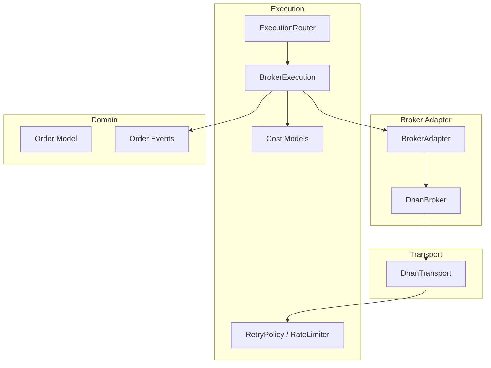
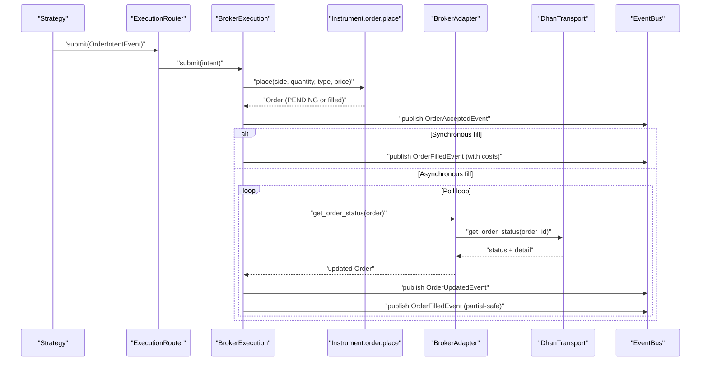
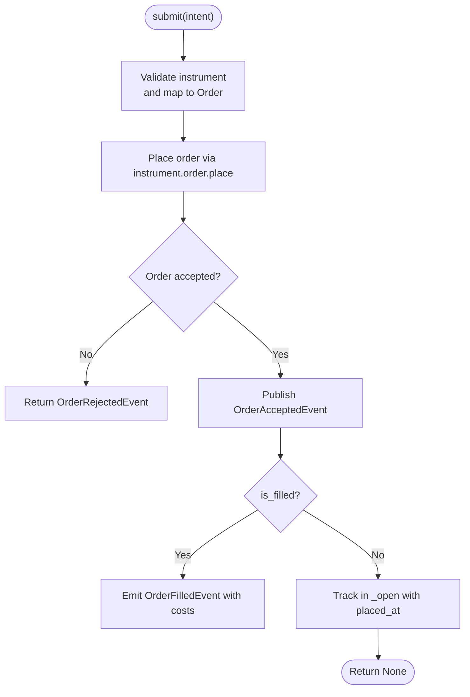
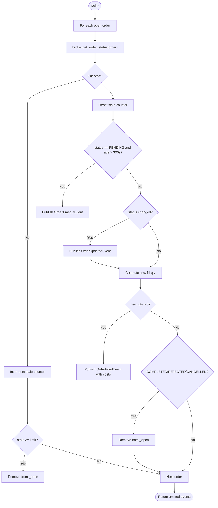
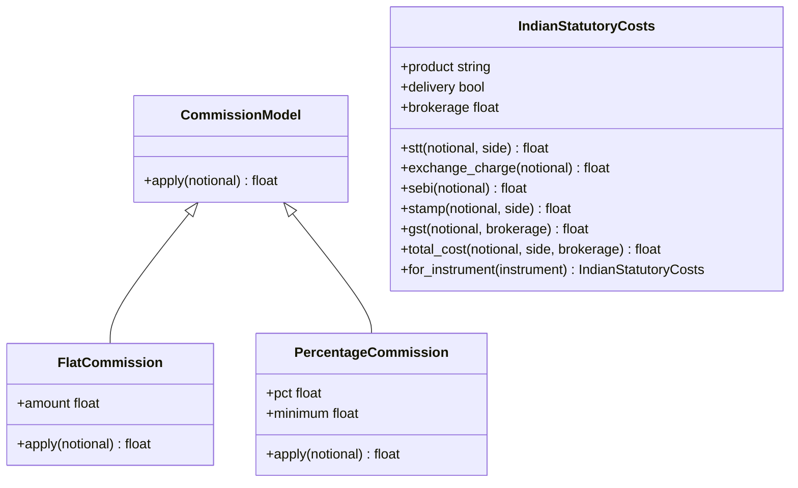
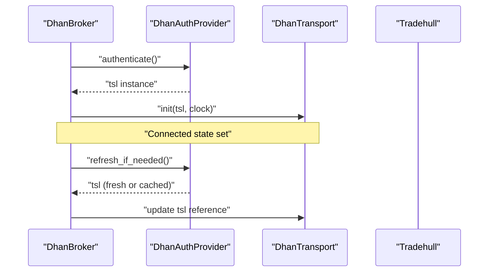
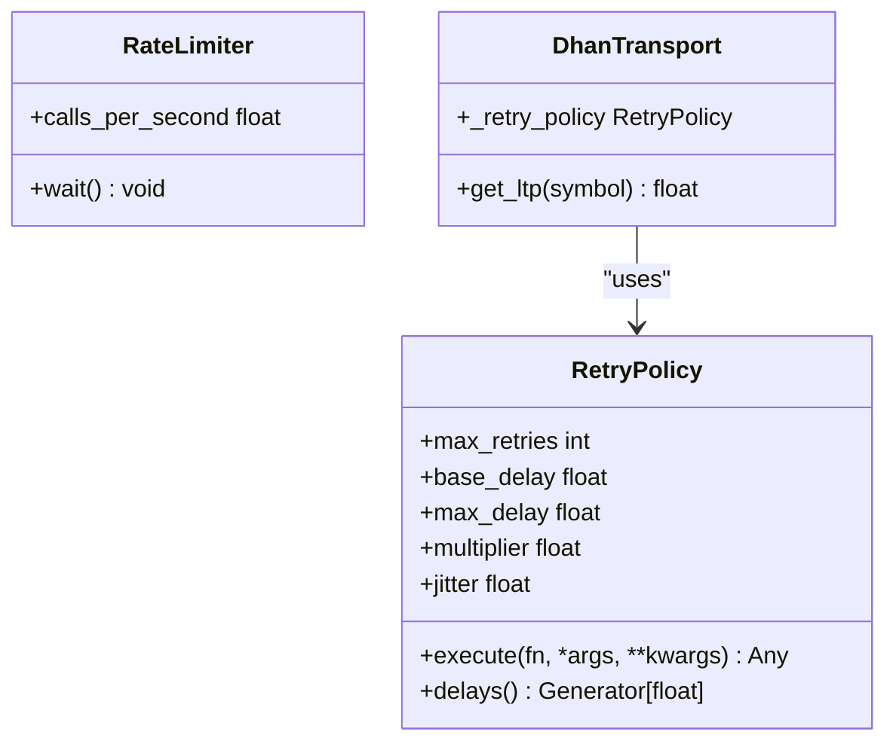
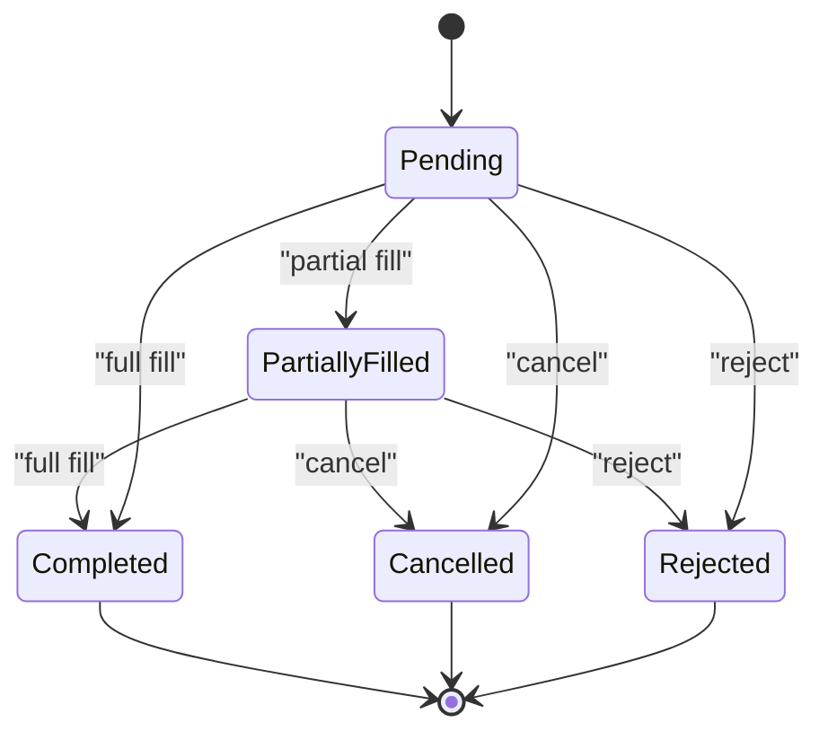
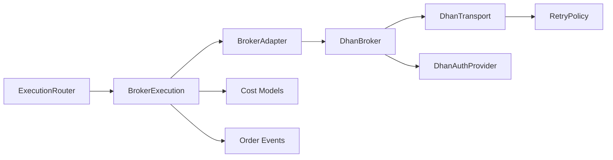

# Broker Executor

<cite>
**Referenced Files in This Document**
- [broker_executor.py](file://ntrade/execution/broker_executor.py)
- [retry.py](file://ntrade/execution/retry.py)
- [costs.py](file://ntrade/execution/costs.py)
- [base.py](file://ntrade/brokers/base.py)
- [dhan.py](file://ntrade/brokers/dhan.py)
- [dhan_transport.py](file://ntrade/brokers/dhan_transport.py)
- [order.py](file://ntrade/domain/orders/order.py)
- [order_events.py](file://ntrade/events/order.py)
- [router.py](file://ntrade/execution/router.py)
- [test_broker_executor.py](file://tests/test_broker_executor.py)
- [test_retry.py](file://tests/test_retry.py)
</cite>

## Table of Contents
1. [Introduction](#introduction)
2. [Project Structure](#project-structure)
3. [Core Components](#core-components)
4. [Architecture Overview](#architecture-overview)
5. [Detailed Component Analysis](#detailed-component-analysis)
6. [Dependency Analysis](#dependency-analysis)
7. [Performance Considerations](#performance-considerations)
8. [Troubleshooting Guide](#troubleshooting-guide)
9. [Conclusion](#conclusion)

## Introduction
This document provides comprehensive documentation for the live execution path centered on the BrokerExecution class (referred to as BrokerExecutor in this guide). It explains how order intents are transformed into broker orders, how asynchronous lifecycle polling publishes fills and status updates, and how costs are modeled for commissions, taxes, and slippage. It also covers resilience patterns such as retry policies, rate limiting, connection management, authentication handling, timeout detection, partial fill handling, and crash recovery. Finally, it outlines performance optimization techniques including connection pooling and batch operations where applicable.

## Project Structure
The execution subsystem is organized around a clear separation of concerns:
- Execution layer: orchestrates submission, polling, cost calculation, and event publishing
- Broker adapters: abstract broker-specific transport details
- Transport layer: wraps external SDK calls with retry and normalization
- Domain models: orders, instruments, and events
- Resilience utilities: retry policy and rate limiter

**Diagram sources**
- [broker_executor.py:53-107](file://ntrade/execution/broker_executor.py#L53-L107)
- [base.py:25-110](file://ntrade/brokers/base.py#L25-L110)
- [dhan.py:54-105](file://ntrade/brokers/dhan.py#L54-L105)
- [dhan_transport.py:48-101](file://ntrade/brokers/dhan_transport.py#L48-L101)
- [order.py:44-105](file://ntrade/domain/orders/order.py#L44-L105)
- [order_events.py:11-91](file://ntrade/events/order.py#L11-L91)
- [retry.py:19-98](file://ntrade/execution/retry.py#L19-L98)
- [costs.py:43-174](file://ntrade/execution/costs.py#L43-L174)

**Section sources**
- [broker_executor.py:1-107](file://ntrade/execution/broker_executor.py#L1-L107)
- [base.py:1-110](file://ntrade/brokers/base.py#L1-L110)
- [dhan.py:1-105](file://ntrade/brokers/dhan.py#L1-L105)
- [dhan_transport.py:1-101](file://ntrade/brokers/dhan_transport.py#L1-L101)
- [order.py:1-105](file://ntrade/domain/orders/order.py#L1-L105)
- [order_events.py:1-91](file://ntrade/events/order.py#L1-L91)
- [retry.py:1-98](file://ntrade/execution/retry.py#L1-L98)
- [costs.py:1-174](file://ntrade/execution/costs.py#L1-L174)

## Core Components
- BrokerExecution: Orchestrates live order submission, open-order tracking, polling for lifecycle changes, cost computation per fill, and event publication.
- BrokerAdapter: Abstract interface for broker connectivity and order lifecycle methods.
- DhanBroker: Concrete adapter implementing Dhan API interactions, including auth refresh and SEBI-compliant order placement rules.
- DhanTransport: Wraps Tradehull SDK calls with retry logic and normalization; centralizes LTP quote retrieval and depth fetching.
- Cost Models: Commission and statutory charge models (including Indian market charges) used to compute realized costs per fill.
- Resilience Utilities: RetryPolicy for exponential backoff with jitter and RateLimiter for token-bucket throttling.
- Order Model and Events: Typed domain objects representing orders and their lifecycle events.

Key responsibilities:
- Asynchronous order placement via submit() and immediate acceptance event
- Poll-driven lifecycle updates and partial fill emission
- Timeout detection and stale order eviction
- Crash recovery by restoring open orders from persisted deltas
- Integration of commission and statutory costs per fill

**Section sources**
- [broker_executor.py:53-181](file://ntrade/execution/broker_executor.py#L53-L181)
- [base.py:25-110](file://ntrade/brokers/base.py#L25-L110)
- [dhan.py:304-407](file://ntrade/brokers/dhan.py#L304-L407)
- [dhan_transport.py:48-116](file://ntrade/brokers/dhan_transport.py#L48-L116)
- [costs.py:43-174](file://ntrade/execution/costs.py#L43-L174)
- [retry.py:19-98](file://ntrade/execution/retry.py#L19-L98)
- [order.py:44-105](file://ntrade/domain/orders/order.py#L44-L105)
- [order_events.py:11-91](file://ntrade/events/order.py#L11-L91)

## Architecture Overview
The execution flow bridges strategy-generated order intents to broker APIs through a resilient pipeline that ensures zero parity between simulated and live execution.

**Diagram sources**
- [router.py:37-49](file://ntrade/execution/router.py#L37-L49)
- [broker_executor.py:70-107](file://ntrade/execution/broker_executor.py#L70-L107)
- [broker_executor.py:118-181](file://ntrade/execution/broker_executor.py#L118-L181)
- [dhan.py:388-407](file://ntrade/brokers/dhan.py#L388-L407)
- [dhan_transport.py:288-303](file://ntrade/brokers/dhan_transport.py#L288-L303)
- [order_events.py:24-91](file://ntrade/events/order.py#L24-L91)

## Detailed Component Analysis

### BrokerExecution (BrokerExecutor)
Responsibilities:
- Validates instrument availability and maps intent to an Order object via the instrument’s broker adapter
- Submits the order and publishes an acceptance event immediately
- Tracks open orders with intent metadata, current status, and cumulative filled quantity
- Polls for status updates, emits updated status and partial/full fills, handles timeouts and rejections
- Computes commission and statutory costs per fill using configured models
- Supports modify/cancel operations on open orders
- Restores open orders after crashes from persisted deltas

Key behaviors:
- Immediate acceptance event even if the broker fills synchronously
- Partial-fill safe emission: only newly filled quantities are emitted
- Stale order eviction after repeated failures to refresh status
- Timeout detection for PENDING orders beyond a threshold
- Crash recovery reconstructs open orders and preserves already-filled quantities

**Diagram sources**
- [broker_executor.py:70-107](file://ntrade/execution/broker_executor.py#L70-L107)

Polling and lifecycle:
- Refreshes each open order’s status via broker.get_order_status
- Resets stale counter on success; increments on failure and evicts after threshold
- Emits OrderUpdatedEvent when status changes
- Emits OrderFilledEvent for new fill quantities since last poll
- Emits OrderRejectedEvent for remaining unfilled quantity when order is rejected/cancelled after partial fill
- Emits OrderTimeoutEvent for PENDING orders exceeding timeout

**Diagram sources**
- [broker_executor.py:118-181](file://ntrade/execution/broker_executor.py#L118-L181)

Crash recovery:
- Rehydrates open orders from persisted deltas, preserving filled quantities and timestamps
- Ensures generated BRK- ids do not collide with restored ones by bumping sequence

Modify and cancel:
- Delegates to broker.modify_order and broker.cancel_order for open orders

**Section sources**
- [broker_executor.py:53-181](file://ntrade/execution/broker_executor.py#L53-L181)
- [broker_executor.py:188-231](file://ntrade/execution/broker_executor.py#L188-L231)
- [broker_executor.py:234-251](file://ntrade/execution/broker_executor.py#L234-L251)

### Cost Calculation Integration
Commission and statutory costs are computed per fill:
- Commission model applies to notional value
- Statutory costs (STT, exchange charges, SEBI fee, GST, stamp duty) are calculated based on product type and side
- GST is applied on brokerage plus exchange and SEBI fees, using actual per-fill commission
- Product schedule selection uses instrument type (equity/futures/options) to pick correct rates

**Diagram sources**
- [costs.py:43-174](file://ntrade/execution/costs.py#L43-L174)

Usage in BrokerExecution:
- Notional = fill_price × new_qty
- Commission = round(commission.apply(notional), 4)
- Statutory = round(statutory_model.total_cost(notional, side, brokerage=commission), 4)
- OrderFilledEvent includes commission and statutory fields

**Section sources**
- [broker_executor.py:253-290](file://ntrade/execution/broker_executor.py#L253-L290)
- [costs.py:43-174](file://ntrade/execution/costs.py#L43-L174)

### Connection Management and Authentication Handling
DhanBroker manages authentication and token lifecycle:
- Connect establishes authenticated session and initializes transport
- _ensure_tsl checks token freshness before critical operations and refreshes if needed
- Proactive background refresh scheduled to avoid expiry during trading hours
- Transport receives updated tsl reference for subsequent calls

**Diagram sources**
- [dhan.py:69-94](file://ntrade/brokers/dhan.py#L69-L94)
- [dhan_auth_provider.py:104-141](file://ntrade/brokers/dhan_auth_provider.py#L104-L141)

**Section sources**
- [dhan.py:54-105](file://ntrade/brokers/dhan.py#L54-L105)
- [dhan_auth_provider.py:104-141](file://ntrade/brokers/dhan_auth_provider.py#L104-L141)

### Rate Limiting and Retry Mechanisms
Resilience infrastructure:
- RetryPolicy implements exponential backoff with configurable base delay, multiplier, max delay, and jitter
- RateLimiter provides thread-safe token bucket throttling for API calls
- DhanTransport integrates RetryPolicy for flaky endpoints like LTP fetch
- Tests validate retry behavior, delay generation, and rate limiting enforcement

**Diagram sources**
- [retry.py:19-98](file://ntrade/execution/retry.py#L19-L98)
- [dhan_transport.py:48-101](file://ntrade/brokers/dhan_transport.py#L48-L101)

**Section sources**
- [retry.py:1-98](file://ntrade/execution/retry.py#L1-L98)
- [dhan_transport.py:80-101](file://ntrade/brokers/dhan_transport.py#L80-L101)
- [test_retry.py:17-125](file://tests/test_retry.py#L17-L125)

### Order Lifecycle and Event Publishing
Order lifecycle events provide complete visibility:
- OrderIntentEvent: Pre-execution signal converted to order intent
- OrderAcceptedEvent: Immediate confirmation of order acceptance
- OrderUpdatedEvent: Status changes during lifecycle
- OrderFilledEvent: Fill notifications with price, quantity, and costs
- OrderRejectedEvent: Rejection reasons and remaining quantities
- OrderTimeoutEvent: PENDING orders exceeding timeout threshold

**Diagram sources**
- [order_events.py:11-91](file://ntrade/events/order.py#L11-L91)
- [order.py:35-41](file://ntrade/domain/orders/order.py#L35-L41)

**Section sources**
- [order_events.py:11-91](file://ntrade/events/order.py#L11-L91)
- [order.py:35-41](file://ntrade/domain/orders/order.py#L35-L41)

### Configuration Examples and Usage Patterns
Configuring execution parameters:
- BrokerExecution accepts commission model and statutory cost configuration
- Default commission is flat zero-cost; statutory defaults to IndianStatutoryCosts unless explicitly disabled
- Order types include LIMIT, MARKET, STOP_LIMIT, STOP_MARKET, COVER, BRACKET
- Trade types support MIS, CNC, MARGIN, MTF

Handling partial fills:
- Only newly filled quantities are emitted per poll cycle
- Cumulative filled tracking prevents duplicate emissions
- Remaining quantities reported on rejection/cancellation after partial fill

Managing order lifecycle events:
- Immediate acceptance event published regardless of fill speed
- Status updates published on any change
- Timeout detection for long-pending orders
- Crash recovery restores open orders with accurate filled quantities

**Section sources**
- [broker_executor.py:56-68](file://ntrade/execution/broker_executor.py#L56-L68)
- [order.py:118-173](file://ntrade/domain/orders/order.py#L118-L173)
- [test_broker_executor.py:13-39](file://tests/test_broker_executor.py#L13-L39)

## Dependency Analysis
The execution system exhibits clear separation between orchestration, transport, and domain concerns:

**Diagram sources**
- [router.py:19-49](file://ntrade/execution/router.py#L19-L49)
- [broker_executor.py:53-107](file://ntrade/execution/broker_executor.py#L53-L107)
- [base.py:25-110](file://ntrade/brokers/base.py#L25-L110)
- [dhan.py:54-105](file://ntrade/brokers/dhan.py#L54-L105)
- [dhan_transport.py:48-101](file://ntrade/brokers/dhan_transport.py#L48-L101)
- [costs.py:43-174](file://ntrade/execution/costs.py#L43-L174)
- [order_events.py:11-91](file://ntrade/events/order.py#L11-L91)
- [retry.py:19-98](file://ntrade/execution/retry.py#L19-L98)

**Section sources**
- [router.py:1-49](file://ntrade/execution/router.py#L1-L49)
- [broker_executor.py:1-107](file://ntrade/execution/broker_executor.py#L1-L107)
- [base.py:1-110](file://ntrade/brokers/base.py#L1-L110)
- [dhan.py:1-105](file://ntrade/brokers/dhan.py#L1-L105)
- [dhan_transport.py:1-101](file://ntrade/brokers/dhan_transport.py#L1-L101)
- [costs.py:1-174](file://ntrade/execution/costs.py#L1-L174)
- [order_events.py:1-91](file://ntrade/events/order.py#L1-L91)
- [retry.py:1-98](file://ntrade/execution/retry.py#L1-L98)

## Performance Considerations
Optimization techniques implemented and recommended:
- Connection pooling: DhanBroker maintains a single authenticated session reused across calls
- Batch operations: Option chain and historical data requests leverage efficient SDK methods
- Event-driven architecture: EventBus enables non-blocking event propagation
- Retry strategies: Exponential backoff reduces load on failing endpoints
- Rate limiting: Token bucket prevents API throttling violations
- Zero-copy event design: Frozen dataclasses minimize memory overhead
- Stale order eviction: Prevents memory leaks from failed order tracking

Connection pooling recommendations:
- Reuse DhanBroker instances across strategies to minimize authentication overhead
- Share RateLimiter instances across components to coordinate API access
- Implement connection health monitoring with automatic reconnection

Batch operation opportunities:
- Group multiple order modifications in single API calls where supported
- Batch historical data requests for multiple instruments
- Consolidate portfolio queries to reduce network round trips

**Section sources**
- [dhan.py:69-73](file://ntrade/brokers/dhan.py#L69-L73)
- [dhan_transport.py:146-194](file://ntrade/brokers/dhan_transport.py#L146-L194)
- [retry.py:70-98](file://ntrade/execution/retry.py#L70-L98)

## Troubleshooting Guide
Common issues and resolutions:
- Network failures during order placement: Check RetryPolicy configuration and network connectivity
- Authentication errors: Verify token expiration and DhanAuthProvider configuration
- Stale orders not updating: Monitor poll frequency and broker.get_order_status reliability
- Partial fill discrepancies: Verify cumulative filled tracking and event emission logic
- Cost calculation mismatches: Review commission model and statutory cost configuration
- Rate limiting errors: Adjust RateLimiter settings and implement proper backoff

Debugging utilities:
- Open order inspection via open_orders() method
- Event history analysis through EventBus
- Logging statements for order lifecycle events
- Test coverage for edge cases like missing order IDs and network failures

Error recovery strategies:
- Circuit breaker pattern: Implement fallback mechanisms for critical endpoints
- Graceful degradation: Continue operations with reduced functionality when non-critical services fail
- State persistence: Ensure crash recovery restores consistent state
- Health checks: Monitor broker connectivity and API responsiveness

**Section sources**
- [test_broker_executor.py:13-39](file://tests/test_broker_executor.py#L13-L39)
- [test_retry.py:175-238](file://tests/test_retry.py#L175-L238)
- [broker_executor.py:188-231](file://ntrade/execution/broker_executor.py#L188-L231)

## Conclusion
The BrokerExecution component provides a robust, resilient foundation for live trading execution. Its design emphasizes zero-parity between simulated and live environments, comprehensive cost modeling, and reliable error handling. The modular architecture separates concerns effectively while maintaining high performance through connection reuse, event-driven processing, and intelligent retry mechanisms. With proper configuration and monitoring, this system can handle the complexities of live trading operations including partial fills, authentication management, and network resilience.