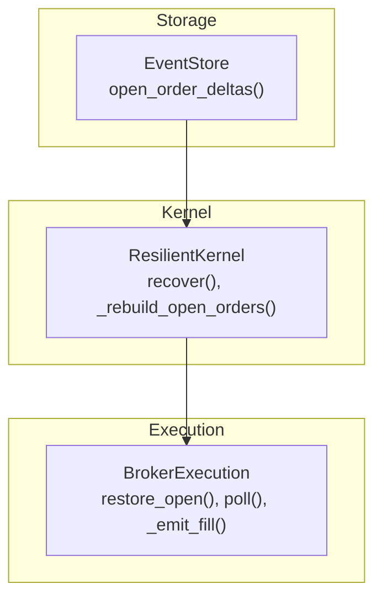
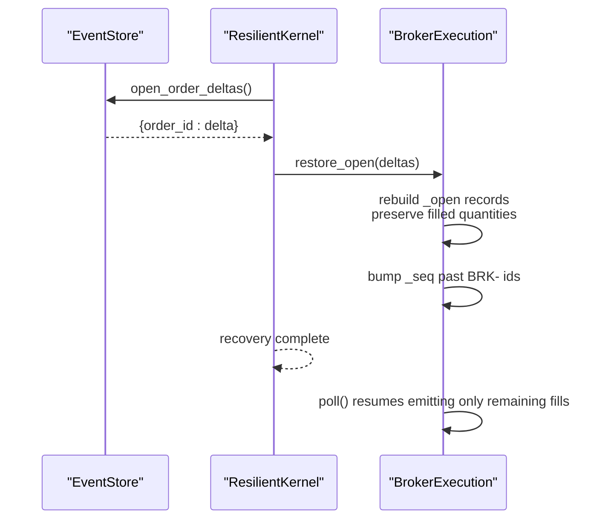
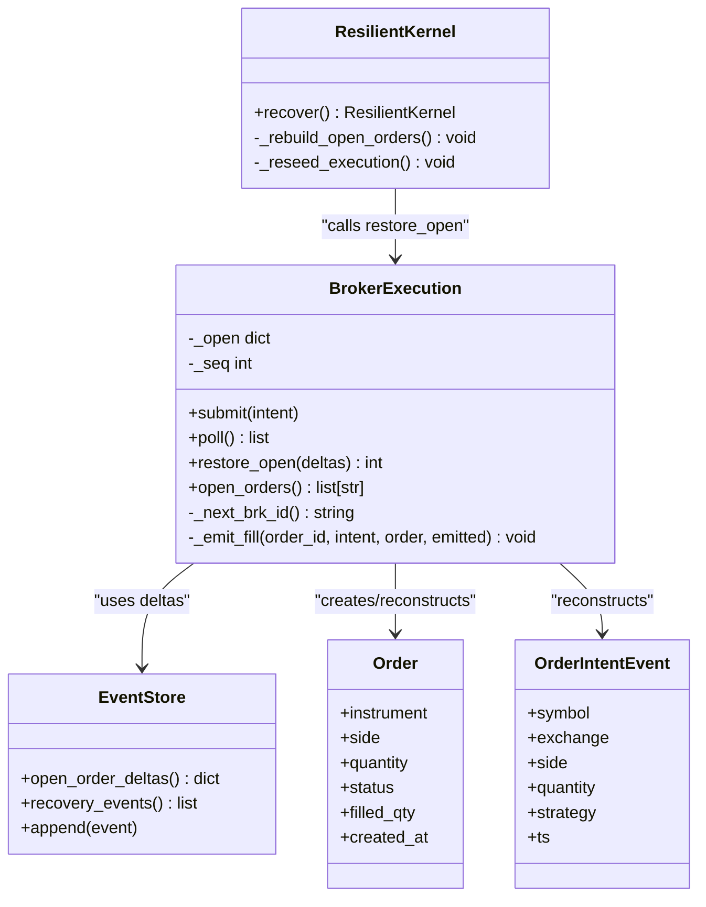
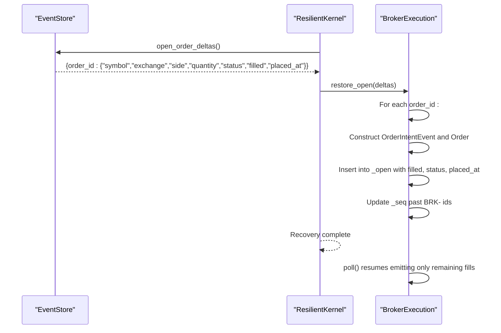
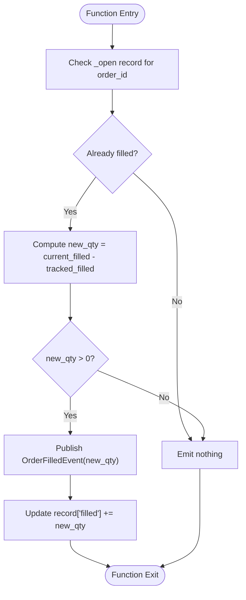

# Crash Recovery & State Restoration

<cite>
**Referenced Files in This Document**
- [event_store.py](file://ntrade/storage/event_store.py)
- [resilient.py](file://ntrade/kernel/resilient.py)
- [broker_executor.py](file://ntrade/execution/broker_executor.py)
- [order.py](file://ntrade/domain/orders/order.py)
- [order_events.py](file://ntrade/events/order.py)
- [test_kernel_resilient.py](file://tests/test_kernel_resilient.py)
</cite>

## Table of Contents
1. [Introduction](#introduction)
2. [Project Structure](#project-structure)
3. [Core Components](#core-components)
4. [Architecture Overview](#architecture-overview)
5. [Detailed Component Analysis](#detailed-component-analysis)
6. [Dependency Analysis](#dependency-analysis)
7. [Performance Considerations](#performance-considerations)
8. [Troubleshooting Guide](#troubleshooting-guide)
9. [Conclusion](#conclusion)
10. [Appendices](#appendices)

## Introduction
This document explains the crash recovery and state restoration capabilities that allow the system to resume trading after a session crash without losing partially filled orders or duplicating already-filled quantities. The core mechanism centers on:
- Reconstructing open-order deltas from an append-only event log via EventStore.open_order_deltas()
- Rehydrating BrokerExecution’s in-memory _open tracker through restore_open()
- Ensuring sequence numbers for BRK- IDs do not collide between restored and newly placed orders
- Maintaining idempotent fill emission so only remaining fills are emitted post-recovery

The result is deterministic, zero-parity recovery: instruments, indicators, portfolio, and balances are rebuilt from causal events, while open order state is reconstructed to continue lifecycle tracking seamlessly.

## Project Structure
Crash recovery spans three primary layers:
- Storage layer (EventStore): persists and reconstructs order lifecycle deltas
- Kernel layer (ResilientKernel): orchestrates replay and rehydration
- Execution layer (BrokerExecution): maintains per-order state and emits fills safely

**Diagram sources**
- [event_store.py:137-181](file://ntrade/storage/event_store.py#L137-L181)
- [resilient.py:105-122](file://ntrade/kernel/resilient.py#L105-L122)
- [broker_executor.py:188-231](file://ntrade/execution/broker_executor.py#L188-L231)

**Section sources**
- [event_store.py:1-236](file://ntrade/storage/event_store.py#L1-L236)
- [resilient.py:1-147](file://ntrade/kernel/resilient.py#L1-L147)
- [broker_executor.py:1-290](file://ntrade/execution/broker_executor.py#L1-L290)

## Core Components
- EventStore.open_order_deltas(): Builds a delta map for still-open orders with fields like symbol, exchange, side, quantity, status, filled, placed_at, and derived remaining.
- ResilientKernel._rebuild_open_orders(): Calls EventStore.open_order_deltas() and invokes BrokerExecution.restore_open(deltas) for each live execution target.
- BrokerExecution.restore_open(deltas): Rebuilds in-memory _open records from deltas, reconstructs Order and OrderIntentEvent objects, preserves filled quantities, and bumps _seq to avoid BRK- ID collisions.
- BrokerExecution.poll() and _emit_fill(): Ensure only new fill deltas are emitted; never re-emit previously filled quantities.

Key behaviors:
- Only terminal orders (COMPLETED, REJECTED, CANCELLED) are excluded from deltas
- Partially filled orders retain their filled count and remaining quantity
- Sequence number management prevents BRK- ID collisions across restored and new orders

**Section sources**
- [event_store.py:137-181](file://ntrade/storage/event_store.py#L137-L181)
- [resilient.py:105-122](file://ntrade/kernel/resilient.py#L105-L122)
- [broker_executor.py:188-231](file://ntrade/execution/broker_executor.py#L188-L231)
- [broker_executor.py:118-181](file://ntrade/execution/broker_executor.py#L118-L181)
- [broker_executor.py:253-290](file://ntrade/execution/broker_executor.py#L253-L290)

## Architecture Overview
The crash recovery flow ensures deterministic state reconstruction and safe continuation of order lifecycles.

**Diagram sources**
- [event_store.py:137-181](file://ntrade/storage/event_store.py#L137-L181)
- [resilient.py:105-122](file://ntrade/kernel/resilient.py#L105-L122)
- [broker_executor.py:188-231](file://ntrade/execution/broker_executor.py#L188-L231)
- [broker_executor.py:118-181](file://ntrade/execution/broker_executor.py#L118-L181)

## Detailed Component Analysis

### EventStore.open_order_deltas()
Purpose:
- Walks recorded order lifecycle events to produce a delta map for still-open orders
- Tracks quantity, filled, status, symbol, exchange, side, strategy, placed_at
- Derives remaining = quantity - filled
- Excludes terminal states (COMPLETED, REJECTED, CANCELLED) and fully filled orders

Data structure requirements for delta maps:
- symbol: str
- exchange: str
- side: str (BUY/SELL)
- quantity: int
- status: str (PENDING/PARTIALLY_FILLED/etc.)
- filled: int (cumulative filled quantity)
- placed_at: datetime (timestamp when accepted)
- remaining: int (derived)

Complexity:
- O(N) over recorded events; constant-time updates per order_id
- Memory proportional to unique open orders

Error handling:
- Skips unknown event types gracefully during load
- Ignores terminal or fully filled orders

**Section sources**
- [event_store.py:137-181](file://ntrade/storage/event_store.py#L137-L181)

### ResilientKernel._rebuild_open_orders()
Purpose:
- Retrieves deltas from EventStore.open_order_deltas()
- Invokes BrokerExecution.restore_open(deltas) for each live execution target
- Ensures in-memory _open trackers are consistent with persisted state

Sequence number management:
- Also reseeds simulated execution sequences to avoid SIM- ID collisions (separate path)

**Section sources**
- [resilient.py:105-122](file://ntrade/kernel/resilient.py#L105-L122)

### BrokerExecution.restore_open(deltas)
Purpose:
- Rehydrates _open records from deltas
- Reconstructs Order and OrderIntentEvent objects
- Preserves filled quantities to ensure idempotent fill emission
- Bumps _seq past any recovered BRK- IDs to prevent collisions

Implementation highlights:
- Skips already present order_ids
- Uses context instrument resolution by symbol
- Constructs Order with correct side, quantity, status, filled_qty, created_at
- Updates _open[order_id] with intent, order, filled, status, placed_at
- Extracts numeric suffix from order_id and updates _seq if higher

Idempotency guarantees:
- poll() uses record["filled"] to compute new fill delta
- _emit_fill() publishes only new quantity since last poll

**Section sources**
- [broker_executor.py:188-231](file://ntrade/execution/broker_executor.py#L188-L231)
- [broker_executor.py:118-181](file://ntrade/execution/broker_executor.py#L118-L181)
- [broker_executor.py:253-290](file://ntrade/execution/broker_executor.py#L253-L290)

### Data Models and Events
Order model:
- OrderSide, OrderType, TradeType, OrderStatus enums define lifecycle and semantics
- Order dataclass holds instrument, side, quantity, order_type, trade_type, price, trigger_price, target_price, stop_loss_price, order_id, status, filled_qty, avg_price, created_at

Order events:
- OrderIntentEvent: pre-execution intent
- OrderAcceptedEvent: acceptance by execution target
- OrderFilledEvent: fill with quantity, price, commission, statutory costs
- OrderUpdatedEvent: status changes for open orders
- OrderRejectedEvent: rejection reasons
- OrderTimeoutEvent: PENDING timeout notifications

**Section sources**
- [order.py:14-58](file://ntrade/domain/orders/order.py#L14-L58)
- [order_events.py:11-90](file://ntrade/events/order.py#L11-L90)

### Class Diagram

**Diagram sources**
- [broker_executor.py:53-290](file://ntrade/execution/broker_executor.py#L53-L290)
- [event_store.py:76-181](file://ntrade/storage/event_store.py#L76-L181)
- [resilient.py:17-122](file://ntrade/kernel/resilient.py#L17-L122)
- [order.py:43-58](file://ntrade/domain/orders/order.py#L43-L58)
- [order_events.py:11-22](file://ntrade/events/order.py#L11-L22)

### Sequence Diagram: Restore Open Flow

**Diagram sources**
- [event_store.py:137-181](file://ntrade/storage/event_store.py#L137-L181)
- [resilient.py:105-122](file://ntrade/kernel/resilient.py#L105-L122)
- [broker_executor.py:188-231](file://ntrade/execution/broker_executor.py#L188-L231)

### Flowchart: Idempotent Fill Emission

**Diagram sources**
- [broker_executor.py:253-290](file://ntrade/execution/broker_executor.py#L253-L290)

## Dependency Analysis
Components interact as follows:
- ResilientKernel depends on EventStore for deltas and recovery events
- BrokerExecution depends on domain models (Order, OrderStatus, OrderSide) and events (OrderIntentEvent, OrderFilledEvent, etc.)
- EventStore depends on order events to reconstruct deltas

Potential coupling:
- EventStore must understand order event schema to build accurate deltas
- BrokerExecution must align with EventStore field names for restore_open()
- ResilientKernel coordinates both layers without tight coupling

Circular dependencies:
- None detected; clear separation of concerns across storage, kernel, and execution layers

External dependencies:
- Domain models and events are used consistently across layers
- No direct external I/O within these components beyond EventStore persistence

**Section sources**
- [event_store.py:137-181](file://ntrade/storage/event_store.py#L137-L181)
- [broker_executor.py:188-231](file://ntrade/execution/broker_executor.py#L188-L231)
- [resilient.py:105-122](file://ntrade/kernel/resilient.py#L105-L122)

## Performance Considerations
- EventStore.open_order_deltas() is O(N) over events; acceptable for typical session sizes
- BrokerExecution.restore_open() iterates deltas once; linear in number of open orders
- poll() and _emit_fill() operate per open order; constant-time per order per poll cycle
- Memory usage scales with number of open orders and event history size
- Avoid excessive logging in hot paths; use structured logging for diagnostics

Optimization opportunities:
- Batch delta reconstruction if needed for very large sessions
- Cache instrument lookups in BrokerExecution.restore_open() if repeated symbols exist
- Consider incremental delta updates for streaming scenarios

## Troubleshooting Guide
Common issues and resolutions:
- Missing instrument during restore_open(): Ensure the instrument exists in context before reconstruction
- Duplicate order_id entries: restore_open() skips existing keys; verify no concurrent modifications
- BRK- ID collisions: Verify _seq is bumped correctly; tests confirm sequence advancement
- Double-emitted fills: Confirm _emit_fill() computes new_qty correctly using tracked filled
- Terminal orders included in deltas: EventStore excludes COMPLETED/REJECTED/CANCELLED; validate event ordering

Debugging tips:
- Inspect open_order_deltas() output to verify delta correctness
- Check BrokerExecution._open contents after restore_open()
- Validate poll() emissions against expected remaining quantities
- Use test cases as reference for expected behavior

**Section sources**
- [broker_executor.py:188-231](file://ntrade/execution/broker_executor.py#L188-L231)
- [event_store.py:137-181](file://ntrade/storage/event_store.py#L137-L181)
- [test_kernel_resilient.py:327-396](file://tests/test_kernel_resilient.py#L327-L396)

## Conclusion
The crash recovery system provides robust state restoration through:
- Deterministic reconstruction of open-order deltas from event logs
- Safe rehydration of in-memory order trackers with preserved fill quantities
- Sequence number management preventing BRK- ID collisions
- Idempotent fill emission ensuring only remaining quantities are processed post-recovery

This design ensures continuity of trading operations across crashes while maintaining consistency and avoiding duplicate processing.

## Appendices

### Example Scenarios

#### Scenario 1: Restoring After Session Crash
- EventStore contains partial fill events for an order
- ResilientKernel.recover() replays causal events and calls _rebuild_open_orders()
- BrokerExecution.restore_open() reconstructs _open with filled=3, quantity=10
- poll() resumes and emits only remaining 7 units when broker reports completion

#### Scenario 2: Preventing BRK- ID Collisions
- Restored order has BRK-000042
- restore_open() extracts numeric suffix and updates _seq to at least 42
- New order submission generates BRK-000043, avoiding collision

#### Scenario 3: Maintaining Order Consistency Across Restarts
- Delta maps include symbol, exchange, side, quantity, status, filled, placed_at
- restore_open() reconstructs Order and OrderIntentEvent with matching attributes
- poll() continues lifecycle tracking without re-emitting already-filled quantities

**Section sources**
- [test_kernel_resilient.py:327-396](file://tests/test_kernel_resilient.py#L327-L396)
- [event_store.py:137-181](file://ntrade/storage/event_store.py#L137-L181)
- [broker_executor.py:188-231](file://ntrade/execution/broker_executor.py#L188-L231)