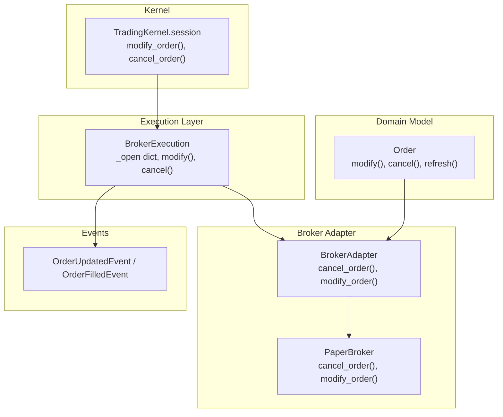
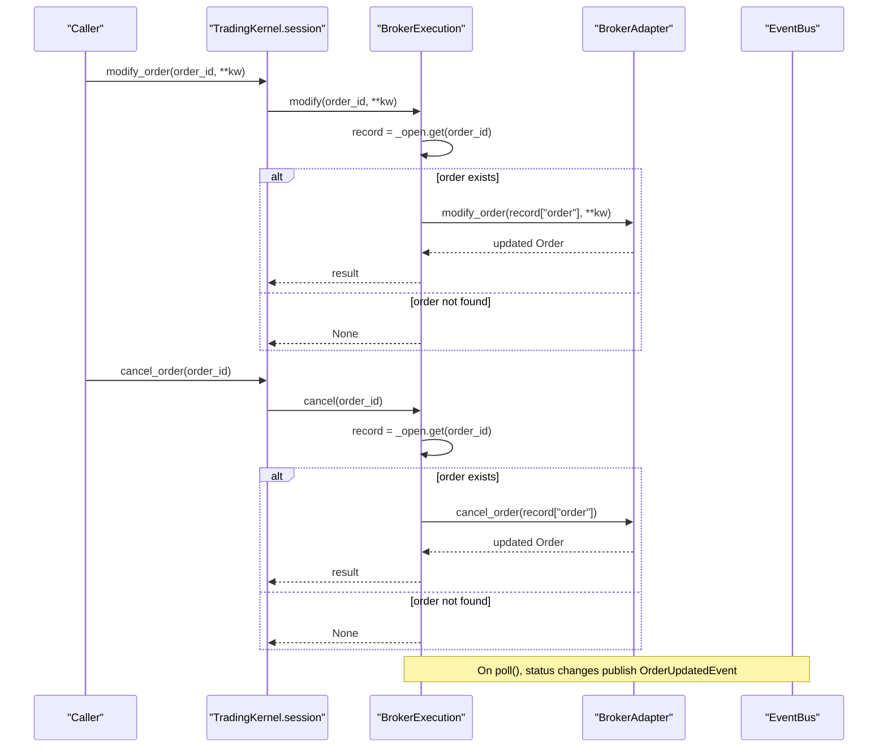
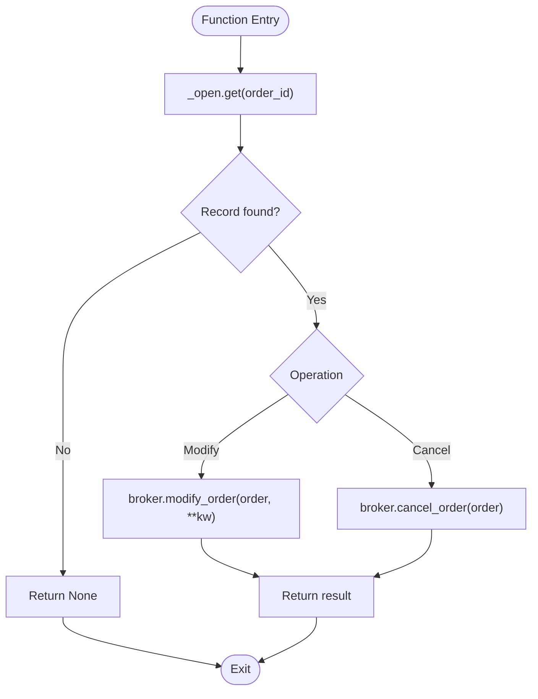
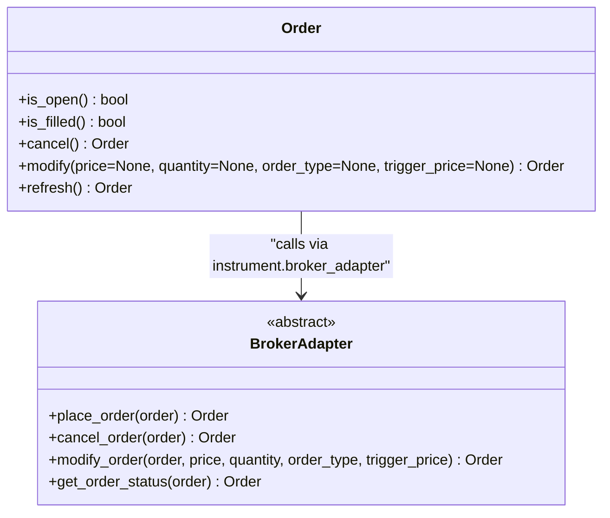
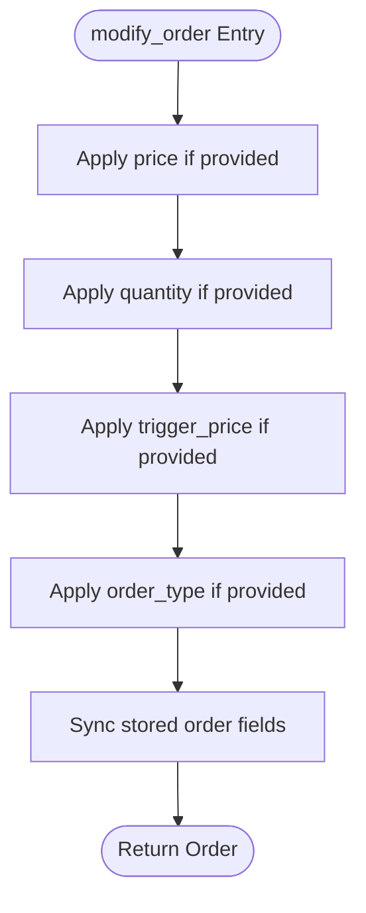
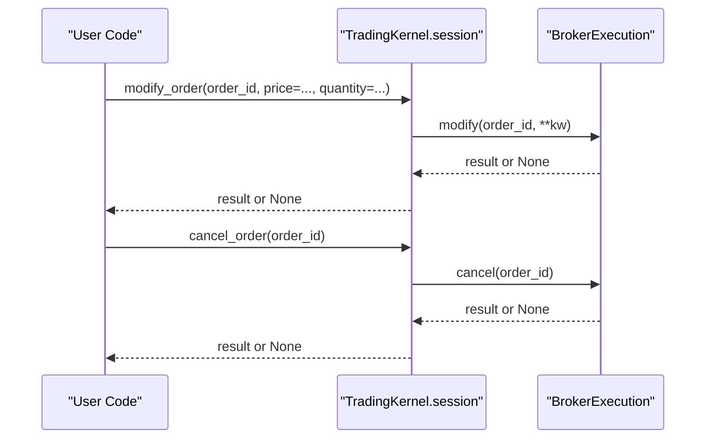
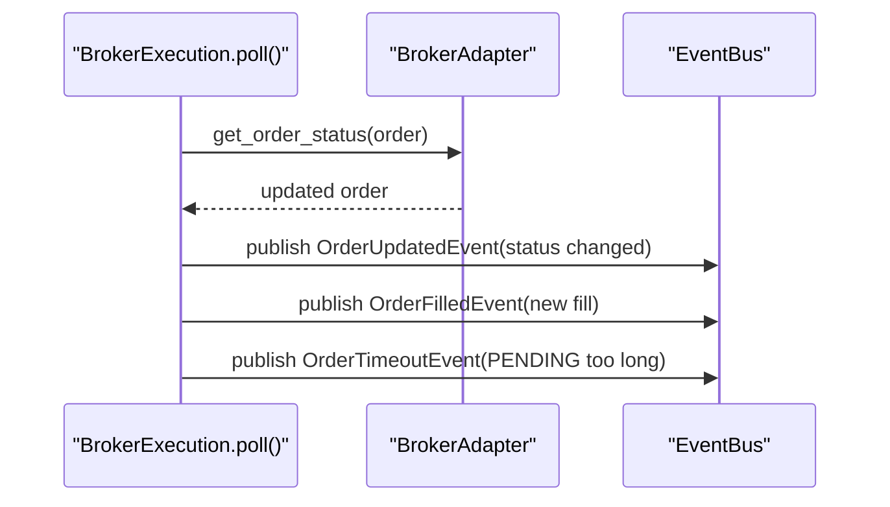
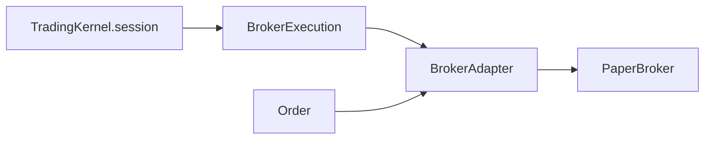

# OMS Operations & Order Management

<cite>
**Referenced Files in This Document**
- [broker_executor.py](file://ntrade/execution/broker_executor.py)
- [order_engine.py](file://ntrade/engines/order_engine.py)
- [order.py](file://ntrade/domain/orders/order.py)
- [base.py](file://ntrade/brokers/base.py)
- [paper.py](file://ntrade/brokers/paper.py)
- [session.py](file://ntrade/kernel/session.py)
- [order.py (events)](file://ntrade/events/order.py)
</cite>

## Table of Contents
1. [Introduction](#introduction)
2. [Project Structure](#project-structure)
3. [Core Components](#core-components)
4. [Architecture Overview](#architecture-overview)
5. [Detailed Component Analysis](#detailed-component-analysis)
6. [Dependency Analysis](#dependency-analysis)
7. [Performance Considerations](#performance-considerations)
8. [Troubleshooting Guide](#troubleshooting-guide)
9. [Conclusion](#conclusion)

## Introduction
This document explains the Order Management System (OMS) operations for modifying and canceling open orders. It focuses on how the system locates open orders, delegates to broker adapters, and handles failures gracefully. You will learn:
- How modify() updates price, quantity, order type, and trigger price for open orders
- How cancel() terminates open orders
- The role of the internal _open dictionary for order lookup
- Error handling when an order does not exist
- The relationship between OMS operations and broker APIs
- Practical examples for limit order modification and stop-loss cancellation

## Project Structure
The OMS is implemented across a few focused modules:
- Execution layer that tracks open orders and exposes modify/cancel
- Domain model for orders and lifecycle methods
- Broker adapter interface and concrete implementations
- Kernel passthroughs to expose OMS operations at runtime
- Event types for lifecycle changes

**Diagram sources**
- [broker_executor.py:53-107](file://ntrade/execution/broker_executor.py#L53-L107)
- [broker_executor.py:233-250](file://ntrade/execution/broker_executor.py#L233-L250)
- [order.py:69-91](file://ntrade/domain/orders/order.py#L69-L91)
- [base.py:96-110](file://ntrade/brokers/base.py#L96-L110)
- [paper.py:121-144](file://ntrade/brokers/paper.py#L121-L144)
- [session.py:179-191](file://ntrade/kernel/session.py#L179-L191)
- [order.py (events):66-78](file://ntrade/events/order.py#L66-L78)

**Section sources**
- [broker_executor.py:53-107](file://ntrade/execution/broker_executor.py#L53-L107)
- [order_engine.py:14-34](file://ntrade/engines/order_engine.py#L14-L34)
- [order.py:44-91](file://ntrade/domain/orders/order.py#L44-L91)
- [base.py:25-110](file://ntrade/brokers/base.py#L25-L110)
- [paper.py:107-144](file://ntrade/brokers/paper.py#L107-L144)
- [session.py:179-191](file://ntrade/kernel/session.py#L179-L191)
- [order.py (events):66-78](file://ntrade/events/order.py#L66-L78)

## Core Components
- BrokerExecution: Tracks open orders via an internal _open dictionary and provides modify() and cancel() that delegate to the broker adapter.
- Order domain object: Offers modify() and cancel() methods that call the instrument’s broker adapter directly.
- BrokerAdapter: Abstract interface defining cancel_order() and modify_order() contracts; PaperBroker implements them for testing.
- TradingKernel session: Exposes modify_order() and cancel_order() passthroughs to the active BrokerExecution.
- Events: OrderUpdatedEvent and related events reflect lifecycle changes during polling.

Key responsibilities:
- Open-order tracking and idempotent lifecycle polling
- Safe delegation to broker adapters with minimal coupling
- Clear error paths for non-existent orders and missing brokers

**Section sources**
- [broker_executor.py:53-107](file://ntrade/execution/broker_executor.py#L53-L107)
- [broker_executor.py:233-250](file://ntrade/execution/broker_executor.py#L233-L250)
- [order.py:69-91](file://ntrade/domain/orders/order.py#L69-L91)
- [base.py:96-110](file://ntrade/brokers/base.py#L96-L110)
- [paper.py:121-144](file://ntrade/brokers/paper.py#L121-L144)
- [session.py:179-191](file://ntrade/kernel/session.py#L179-L191)
- [order.py (events):66-78](file://ntrade/events/order.py#L66-L78)

## Architecture Overview
The OMS flow for modify and cancel operations:
- Caller invokes kernel or execution layer methods
- BrokerExecution looks up the order in _open by order_id
- If found, it calls broker.cancel_order or broker.modify_order
- Polling publishes OrderUpdatedEvent when status changes
- Non-existent orders return None without raising exceptions

**Diagram sources**
- [session.py:179-191](file://ntrade/kernel/session.py#L179-L191)
- [broker_executor.py:233-250](file://ntrade/execution/broker_executor.py#L233-L250)
- [order.py (events):66-78](file://ntrade/events/order.py#L66-L78)

## Detailed Component Analysis

### BrokerExecution OMS Operations
- Internal state: _open maps order_id to a record containing intent, order object, filled quantity, status, and placement time.
- modify():
  - Looks up order by order_id in _open
  - Returns None if not found
  - Delegates to broker.modify_order with optional fields: price, quantity, order_type, trigger_price
- cancel():
  - Looks up order by order_id in _open
  - Returns None if not found
  - Delegates to broker.cancel_order

**Diagram sources**
- [broker_executor.py:233-250](file://ntrade/execution/broker_executor.py#L233-L250)

**Section sources**
- [broker_executor.py:53-107](file://ntrade/execution/broker_executor.py#L53-L107)
- [broker_executor.py:233-250](file://ntrade/execution/broker_executor.py#L233-L250)

### Order Domain Object Methods
- Order.cancel():
  - Requires a broker adapter attached to the instrument
  - Raises RuntimeError if no broker adapter is present
  - Calls broker.cancel_order(order)
- Order.modify():
  - Requires a broker adapter attached to the instrument
  - Raises RuntimeError if no broker adapter is present
  - Calls broker.modify_order(order, price, quantity, order_type, trigger_price)

**Diagram sources**
- [order.py:69-91](file://ntrade/domain/orders/order.py#L69-L91)
- [base.py:96-110](file://ntrade/brokers/base.py#L96-L110)

**Section sources**
- [order.py:69-91](file://ntrade/domain/orders/order.py#L69-L91)
- [base.py:96-110](file://ntrade/brokers/base.py#L96-L110)

### PaperBroker Implementation
- cancel_order():
  - Updates status to CANCELLED for PENDING or PARTIALLY_FILLED orders
  - Ensures both stored and passed-in order objects are synchronized
- modify_order():
  - Applies provided fields: price, quantity, trigger_price, order_type
  - Synchronizes changes to stored order entries

**Diagram sources**
- [paper.py:131-144](file://ntrade/brokers/paper.py#L131-L144)

**Section sources**
- [paper.py:121-144](file://ntrade/brokers/paper.py#L121-L144)

### Kernel Passthroughs
- TradingKernel.session.modify_order(order_id, **kw):
  - Retrieves the active BrokerExecution
  - Delegates to execution.modify(order_id, **kw)
- TradingKernel.session.cancel_order(order_id):
  - Retrieves the active BrokerExecution
  - Delegates to execution.cancel(order_id)

**Diagram sources**
- [session.py:179-191](file://ntrade/kernel/session.py#L179-L191)
- [broker_executor.py:233-250](file://ntrade/execution/broker_executor.py#L233-L250)

**Section sources**
- [session.py:179-191](file://ntrade/kernel/session.py#L179-L191)

### Event Lifecycle Integration
- During poll(), any change in order status triggers OrderUpdatedEvent
- Fills emit OrderFilledEvent with computed costs
- Timeouts emit OrderTimeoutEvent for stale PENDING orders

**Diagram sources**
- [broker_executor.py:118-181](file://ntrade/execution/broker_executor.py#L118-L181)
- [order.py (events):66-91](file://ntrade/events/order.py#L66-L91)

**Section sources**
- [broker_executor.py:118-181](file://ntrade/execution/broker_executor.py#L118-L181)
- [order.py (events):66-91](file://ntrade/events/order.py#L66-L91)

## Dependency Analysis
- BrokerExecution depends on BrokerAdapter for order lifecycle operations
- Order domain methods depend on instrument.broker_adapter
- PaperBroker implements BrokerAdapter for deterministic behavior in tests/backtests
- Kernel session acts as a thin facade delegating to BrokerExecution

**Diagram sources**
- [session.py:179-191](file://ntrade/kernel/session.py#L179-L191)
- [broker_executor.py:53-107](file://ntrade/execution/broker_executor.py#L53-L107)
- [base.py:25-110](file://ntrade/brokers/base.py#L25-L110)
- [paper.py:107-144](file://ntrade/brokers/paper.py#L107-L144)
- [order.py:69-91](file://ntrade/domain/orders/order.py#L69-L91)

**Section sources**
- [session.py:179-191](file://ntrade/kernel/session.py#L179-L191)
- [broker_executor.py:53-107](file://ntrade/execution/broker_executor.py#L53-L107)
- [base.py:25-110](file://ntrade/brokers/base.py#L25-L110)
- [paper.py:107-144](file://ntrade/brokers/paper.py#L107-L144)
- [order.py:69-91](file://ntrade/domain/orders/order.py#L69-L91)

## Performance Considerations
- Order lookup uses a hash map (_open), providing O(1) average-time access by order_id
- Polling iterates only over open orders; stale detection evicts unrecoverable entries after a threshold
- Cost computation for fills is performed per new fill to avoid redundant calculations
- Minimal overhead in modify/cancel since they perform a single lookup and one broker call

[No sources needed since this section provides general guidance]

## Troubleshooting Guide
Common issues and resolutions:
- Modifying or canceling a non-existent order:
  - Behavior: returns None from BrokerExecution.modify/cancel
  - Resolution: verify order_id exists in _open before calling; handle None results gracefully
- Calling Order.cancel()/Order.modify() without a broker adapter:
  - Behavior: raises RuntimeError
  - Resolution: ensure the instrument has a valid broker_adapter set before invoking domain methods
- No updates observed after modify():
  - Ensure poll() is running so status changes are published as OrderUpdatedEvent
  - Check broker implementation supports modify_order and returns updated order fields

**Section sources**
- [broker_executor.py:233-250](file://ntrade/execution/broker_executor.py#L233-L250)
- [order.py:69-91](file://ntrade/domain/orders/order.py#L69-L91)
- [broker_executor.py:118-181](file://ntrade/execution/broker_executor.py#L118-L181)

## Conclusion
The OMS provides a clean separation between order management logic and broker-specific details. BrokerExecution maintains open orders and delegates modifications and cancellations to the broker adapter through well-defined interfaces. The design ensures safe handling of non-existent orders, consistent event-driven updates, and straightforward integration points for live and paper trading environments.

[No sources needed since this section summarizes without analyzing specific files]