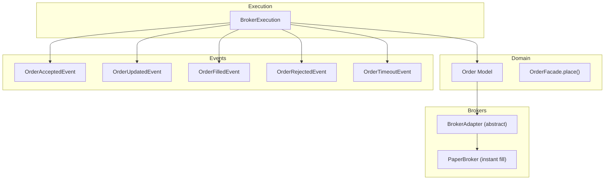
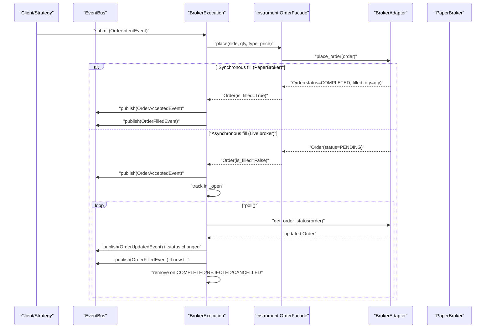
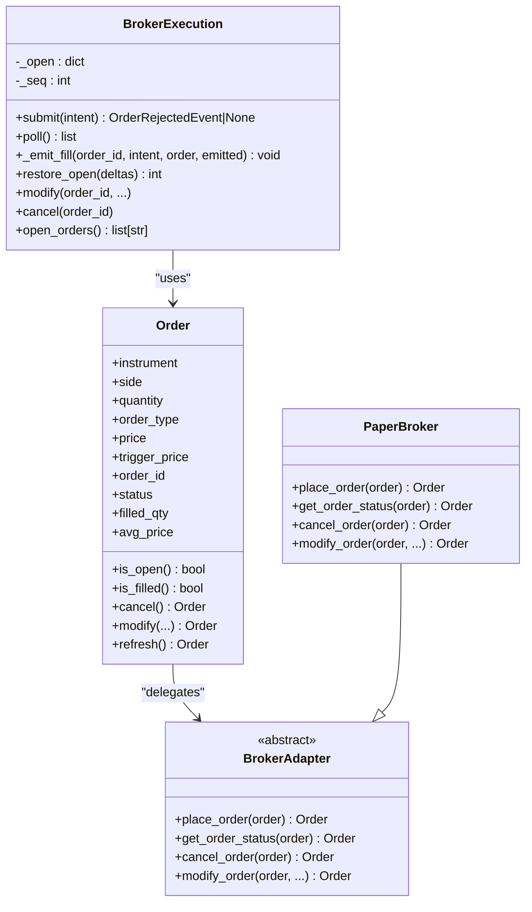

# Order Submission & Lifecycle

<cite>
**Referenced Files in This Document**
- [broker_executor.py](file://ntrade/execution/broker_executor.py)
- [order.py](file://ntrade/domain/orders/order.py)
- [base.py](file://ntrade/brokers/base.py)
- [paper.py](file://ntrade/brokers/paper.py)
- [order.py (events)](file://ntrade/events/order.py)
- [test_broker_executor.py](file://tests/test_broker_executor.py)
- [test_order_state_events.py](file://tests/test_order_state_events.py)
</cite>

## Table of Contents
1. [Introduction](#introduction)
2. [Project Structure](#project-structure)
3. [Core Components](#core-components)
4. [Architecture Overview](#architecture-overview)
5. [Detailed Component Analysis](#detailed-component-analysis)
6. [Dependency Analysis](#dependency-analysis)
7. [Performance Considerations](#performance-considerations)
8. [Troubleshooting Guide](#troubleshooting-guide)
9. [Conclusion](#conclusion)

## Introduction
This document explains how orders are submitted and managed through the BrokerExecution component, focusing on:
- The submit() method: validation, broker adapter integration, and immediate acceptance events.
- Asynchronous order placement: immediate acceptance followed by asynchronous fills via poll().
- Internal tracking with the _open dictionary: intent, order state, and fill quantities.
- Synchronous vs asynchronous broker behavior: instant fills from PaperBroker versus live brokers that report lifecycle updates over time.
- Complete order lifecycle examples: creation, status tracking, partial fills, completion, cancellation, and rejection.

## Project Structure
The relevant code spans execution, domain models, broker adapters, and event types:
- Execution layer: BrokerExecution orchestrates submission and lifecycle polling.
- Domain layer: Order model and facade for placing orders against an instrument.
- Broker adapters: Abstract contract and concrete implementations (PaperBroker).
- Events: Order lifecycle events published to the kernel’s event bus.

**Diagram sources**
- [broker_executor.py:53-107](file://ntrade/execution/broker_executor.py#L53-L107)
- [order.py:118-173](file://ntrade/domain/orders/order.py#L118-L173)
- [base.py:25-122](file://ntrade/brokers/base.py#L25-L122)
- [paper.py:108-118](file://ntrade/brokers/paper.py#L108-L118)
- [order.py (events):11-91](file://ntrade/events/order.py#L11-L91)

**Section sources**
- [broker_executor.py:53-107](file://ntrade/execution/broker_executor.py#L53-L107)
- [order.py:118-173](file://ntrade/domain/orders/order.py#L118-L173)
- [base.py:25-122](file://ntrade/brokers/base.py#L25-L122)
- [paper.py:108-118](file://ntrade/brokers/paper.py#L108-L118)
- [order.py (events):11-91](file://ntrade/events/order.py#L11-L91)

## Core Components
- BrokerExecution: Central orchestrator for submitting intents, publishing acceptance, tracking open orders, polling for lifecycle updates, and emitting fills/rejections/timeouts.
- Order model and facade: Encapsulates order attributes and exposes a place() method that delegates to the instrument’s broker adapter.
- BrokerAdapter: Abstract interface defining place_order(), get_order_status(), cancel_order(), modify_order(), etc.
- PaperBroker: In-memory broker that returns fully filled orders immediately (synchronous behavior).
- Order events: Immutable dataclasses representing acceptance, updates, fills, rejections, and timeouts.

Key responsibilities:
- Validation and routing in submit(): ensure instrument exists and has a broker adapter; construct and place the order; publish acceptance; handle synchronous fills.
- Polling in poll(): refresh order status, detect changes, emit updates/fills/rejections, handle stale connections and timeouts, manage eviction.
- Cost computation in _emit_fill(): compute commission and statutory costs per fill.

**Section sources**
- [broker_executor.py:53-107](file://ntrade/execution/broker_executor.py#L53-L107)
- [broker_executor.py:118-181](file://ntrade/execution/broker_executor.py#L118-L181)
- [broker_executor.py:253-290](file://ntrade/execution/broker_executor.py#L253-L290)
- [order.py:43-116](file://ntrade/domain/orders/order.py#L43-L116)
- [order.py:118-173](file://ntrade/domain/orders/order.py#L118-L173)
- [base.py:95-122](file://ntrade/brokers/base.py#L95-L122)
- [paper.py:108-118](file://ntrade/brokers/paper.py#L108-L118)
- [order.py (events):11-91](file://ntrade/events/order.py#L11-L91)

## Architecture Overview
The order lifecycle flows through clear boundaries:
- Strategy or engine emits an OrderIntentEvent.
- BrokerExecution.submit() validates and places the order via the instrument’s OrderFacade.place(), which calls the broker adapter’s place_order().
- Immediate acceptance is published as OrderAcceptedEvent.
- If the broker fills synchronously (e.g., PaperBroker), an OrderFilledEvent is emitted immediately.
- Otherwise, poll() periodically refreshes order status via get_order_status(), publishes OrderUpdatedEvent on status changes, and emits OrderFilledEvent when new quantity is filled. Terminal states (COMPLETED, REJECTED, CANCELLED) remove the order from _open.

**Diagram sources**
- [broker_executor.py:70-107](file://ntrade/execution/broker_executor.py#L70-L107)
- [broker_executor.py:118-181](file://ntrade/execution/broker_executor.py#L118-L181)
- [order.py:118-173](file://ntrade/domain/orders/order.py#L118-L173)
- [paper.py:108-118](file://ntrade/brokers/paper.py#L108-L118)
- [order.py (events):11-91](file://ntrade/events/order.py#L11-L91)

## Detailed Component Analysis

### BrokerExecution.submit()
Responsibilities:
- Validate instrument and broker adapter availability.
- Construct an Order via instrument.order.place() using intent parameters.
- Handle broker exceptions as rejections.
- Ensure a stable order_id; fallback to BRK-NNNNNN if missing or invalid.
- Publish OrderAcceptedEvent immediately.
- For synchronous brokers (is_filled), emit fill immediately; otherwise track in _open.

Key behaviors:
- Rejection paths return OrderRejectedEvent without side effects.
- Acceptance path ensures idempotent tracking and immediate acceptance event.
- Immediate fill path bypasses _open tracking since no further polling is needed.

**Section sources**
- [broker_executor.py:70-107](file://ntrade/execution/broker_executor.py#L70-L107)
- [order.py:118-173](file://ntrade/domain/orders/order.py#L118-L173)
- [order.py (events):24-34](file://ntrade/events/order.py#L24-L34)

### BrokerExecution.poll()
Responsibilities:
- Iterate over tracked open orders in _open.
- Refresh status via broker.get_order_status(order).
- Track failures with a stale counter; evict after threshold.
- Detect timeout for PENDING orders older than threshold.
- Emit OrderUpdatedEvent on status change.
- Emit OrderFilledEvent for incremental fills; avoid re-emitting already-filled quantities.
- Remove terminal orders (COMPLETED, REJECTED, CANCELLED); emit remaining-rejection if applicable.

Key behaviors:
- Idempotent emissions: partial fills only emit newly filled quantity.
- Timeout detection uses placed_at timestamp and current context time.
- Stale eviction prevents memory leaks on persistent network errors.

**Section sources**
- [broker_executor.py:118-181](file://ntrade/execution/broker_executor.py#L118-L181)
- [order.py (events):66-91](file://ntrade/events/order.py#L66-L91)

### _open Dictionary Tracking Mechanism
Structure:
- Key: order_id (string).
- Value: dict containing:
  - intent: OrderIntentEvent used to reconstruct cost and metadata.
  - order: Order instance reflecting latest broker state.
  - filled: cumulative filled quantity since last emission.
  - status: last known status value.
  - placed_at: timestamp when order was accepted.

Purpose:
- Maintain open-order state across polls.
- Compute incremental fills and avoid duplicates.
- Support crash recovery via restore_open() to rebuild _open from persisted deltas.

**Section sources**
- [broker_executor.py:65-67](file://ntrade/execution/broker_executor.py#L65-L67)
- [broker_executor.py:105-106](file://ntrade/execution/broker_executor.py#L105-L106)
- [broker_executor.py:188-231](file://ntrade/execution/broker_executor.py#L188-L231)

### Synchronous vs Asynchronous Broker Behavior
- Synchronous (PaperBroker): place_order() returns an Order with status COMPLETED and filled_qty equal to requested quantity. BrokerExecution detects is_filled and emits OrderFilledEvent immediately.
- Asynchronous (live brokers): place_order() returns PENDING; BrokerExecution tracks in _open and relies on poll() to fetch updates and emit fills and status changes.

Implications:
- Zero-parity: both paths produce identical events and outcomes; timing differs.
- Testing and backtesting can use PaperBroker to simulate instant fills.

**Section sources**
- [paper.py:108-118](file://ntrade/brokers/paper.py#L108-L118)
- [broker_executor.py:102-107](file://ntrade/execution/broker_executor.py#L102-L107)

### Fill Emission and Costs
_emit_fill():
- Computes new fill quantity as difference between current filled_qty and previously recorded filled.
- Derives fill price from order.avg_price or intent.price.
- Calculates commission using configured CommissionModel.
- Calculates statutory charges based on instrument product schedule unless zero-cost opt-out.
- Publishes OrderFilledEvent and logs fill details.

**Section sources**
- [broker_executor.py:253-290](file://ntrade/execution/broker_executor.py#L253-L290)

### Order Lifecycle Examples
- Creation:
  - Instrument.OrderFacade.place() constructs an Order and delegates to broker adapter.
  - BrokerExecution.submit() publishes OrderAcceptedEvent immediately.
- Status tracking:
  - poll() calls get_order_status() and publishes OrderUpdatedEvent on changes.
- Partial fills:
  - Each poll may reveal incremental filled_qty; _emit_fill() emits only new quantity.
- Completion:
  - When status becomes COMPLETED, order is removed from _open; final fill emitted if any remains.
- Cancellation/Rejection:
  - On CANCELLED/REJECTED, remaining quantity (if any) is rejected via OrderRejectedEvent; order removed from _open.
- Timeouts:
  - PENDING orders exceeding threshold emit OrderTimeoutEvent.

**Section sources**
- [order.py:118-173](file://ntrade/domain/orders/order.py#L118-L173)
- [broker_executor.py:118-181](file://ntrade/execution/broker_executor.py#L118-L181)
- [order.py (events):24-91](file://ntrade/events/order.py#L24-L91)

## Dependency Analysis

**Diagram sources**
- [broker_executor.py:53-107](file://ntrade/execution/broker_executor.py#L53-L107)
- [order.py:43-116](file://ntrade/domain/orders/order.py#L43-L116)
- [base.py:25-122](file://ntrade/brokers/base.py#L25-L122)
- [paper.py:108-118](file://ntrade/brokers/paper.py#L108-L118)

**Section sources**
- [broker_executor.py:53-107](file://ntrade/execution/broker_executor.py#L53-L107)
- [order.py:43-116](file://ntrade/domain/orders/order.py#L43-L116)
- [base.py:25-122](file://ntrade/brokers/base.py#L25-L122)
- [paper.py:108-118](file://ntrade/brokers/paper.py#L108-L118)

## Performance Considerations
- poll() iterates over _open; keep the number of concurrent open orders bounded to minimize overhead.
- Stale eviction prevents unbounded growth under persistent network failures.
- Avoid excessive polling frequency; batch updates where possible.
- Instant fills from PaperBroker reduce polling overhead during tests/backtests.

[No sources needed since this section provides general guidance]

## Troubleshooting Guide
Common issues and resolutions:
- No broker-backed instrument:
  - submit() returns OrderRejectedEvent with reason “no broker-backed instrument”. Ensure the instrument is registered and has a valid broker adapter.
- Missing or invalid order_id:
  - Fallback to BRK-NNNNNN generation; verify that generated IDs do not collide with existing open orders.
- Network errors during poll():
  - Stale counter increments; after threshold, order is evicted. Investigate connectivity and retry policies.
- Timeout detection:
  - PENDING orders older than threshold emit OrderTimeoutEvent. Review exchange latency and order type constraints.
- Duplicate fill emissions:
  - _emit_fill() computes incremental fills; ensure record["filled"] is updated correctly to avoid duplicates.

**Section sources**
- [broker_executor.py:70-107](file://ntrade/execution/broker_executor.py#L70-L107)
- [broker_executor.py:118-181](file://ntrade/execution/broker_executor.py#L118-L181)
- [test_broker_executor.py:13-39](file://tests/test_broker_executor.py#L13-L39)

## Conclusion
BrokerExecution provides a robust, zero-parity order submission and lifecycle management system:
- Immediate acceptance ensures downstream systems react promptly.
- Asynchronous fills align with real broker behavior while maintaining consistent event semantics.
- The _open dictionary enables precise tracking of open orders, incremental fills, and resilient recovery.
- Synchronous brokers like PaperBroker simplify testing and backtesting by delivering instant fills.
- Comprehensive event emissions (accepted, updated, filled, rejected, timeout) support observability and control.

[No sources needed since this section summarizes without analyzing specific files]