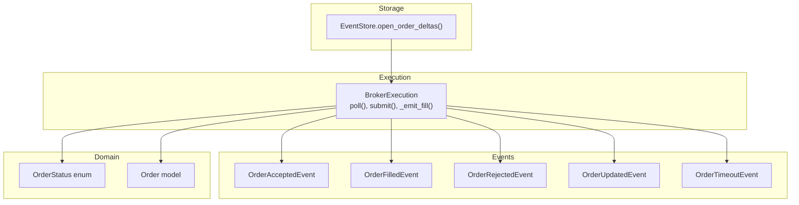
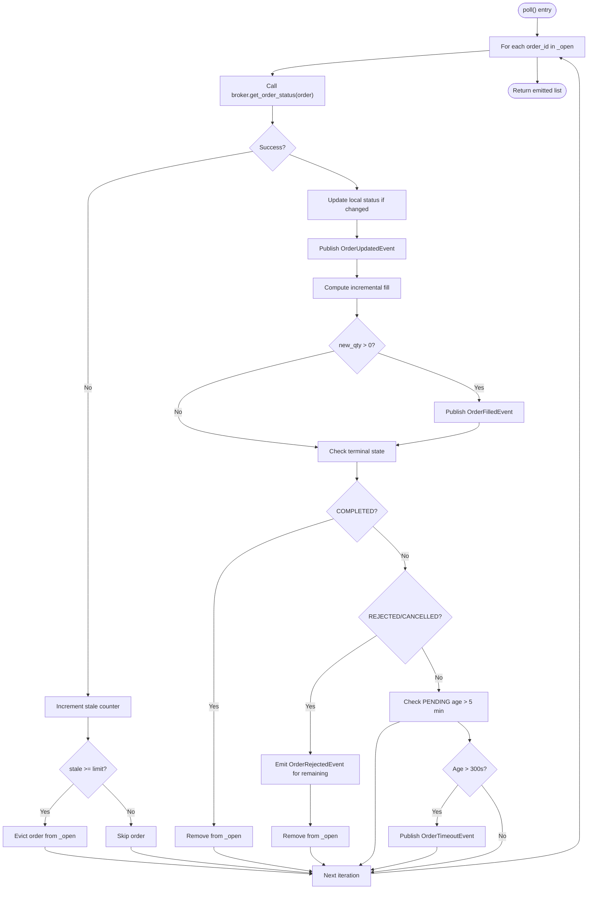
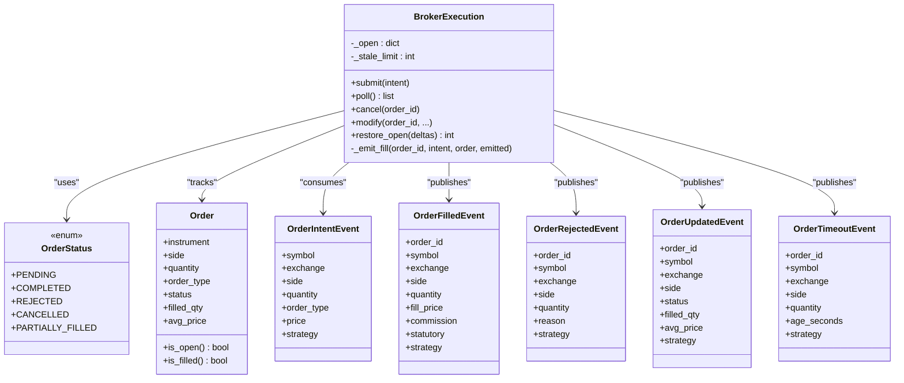
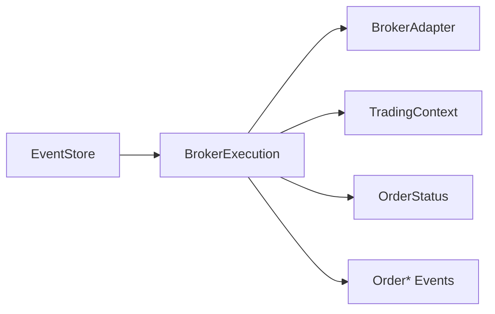

# Polling & Status Tracking

<cite>
**Referenced Files in This Document**
- [broker_executor.py](file://ntrade/execution/broker_executor.py)
- [order.py](file://ntrade/events/order.py)
- [order.py](file://ntrade/domain/orders/order.py)
- [test_broker_executor.py](file://tests/test_broker_executor.py)
- [test_order_state_events.py](file://tests/test_order_state_events.py)
- [event_store.py](file://ntrade/storage/event_store.py)
</cite>

## Table of Contents
1. [Introduction](#introduction)
2. [Project Structure](#project-structure)
3. [Core Components](#core-components)
4. [Architecture Overview](#architecture-overview)
5. [Detailed Component Analysis](#detailed-component-analysis)
6. [Dependency Analysis](#dependency-analysis)
7. [Performance Considerations](#performance-considerations)
8. [Troubleshooting Guide](#troubleshooting-guide)
9. [Conclusion](#conclusion)
10. [Appendices](#appendices)

## Introduction
This document explains the polling mechanism and order status tracking system used to reconcile live broker orders with internal state. The central method is poll(), which refreshes open orders from the broker, publishes lifecycle events (OrderFilledEvent, OrderRejectedEvent, OrderUpdatedEvent), detects stale orders via a configurable failure threshold, emits OrderTimeoutEvent for PENDING orders older than 5 minutes, and ensures idempotent partial fill handling so already-filled quantities are never re-emitted. It also covers configuration, error handling patterns, and monitoring strategies.

## Project Structure
The polling and status tracking logic lives primarily in the execution layer and event definitions:
- Execution layer orchestrates submission, polling, and OMS operations (modify/cancel).
- Event models define lifecycle notifications.
- Domain models provide order types and statuses.
- Storage utilities reconstruct open-order deltas for crash recovery.



**Diagram sources**
- [broker_executor.py:56-181](file://ntrade/execution/broker_executor.py#L56-L181)
- [order.py:66-91](file://ntrade/events/order.py#L66-L91)
- [order.py:35-41](file://ntrade/domain/orders/order.py#L35-L41)
- [event_store.py:157-181](file://ntrade/storage/event_store.py#L157-L181)

**Section sources**
- [broker_executor.py:56-181](file://ntrade/execution/broker_executor.py#L56-L181)
- [order.py:66-91](file://ntrade/events/order.py#L66-L91)
- [order.py:35-41](file://ntrade/domain/orders/order.py#L35-L41)
- [event_store.py:157-181](file://ntrade/storage/event_store.py#L157-L181)

## Core Components
- BrokerExecution.poll(): Iterates over tracked open orders, calls broker.get_order_status(order), updates local status, emits OrderUpdatedEvent on changes, computes incremental fills, emits OrderFilledEvent only for new quantity, and handles terminal states (COMPLETED, REJECTED, CANCELLED).
- Stale detection: A per-order counter increments on failed get_order_status calls; when it reaches the configured limit (default 10), the order is evicted from the tracker.
- Timeout detection: For PENDING orders older than 5 minutes, an OrderTimeoutEvent is published.
- Idempotent partial fills: _emit_fill() tracks previously filled quantity per order and emits only the delta since last poll.
- Crash recovery: restore_open() rebuilds the in-memory tracker from persisted deltas so poll() resumes without re-emitting already-filled quantities.

Key responsibilities and behaviors are implemented in:
- [broker_executor.py:56-181](file://ntrade/execution/broker_executor.py#L56-L181)
- [broker_executor.py:253-290](file://ntrade/execution/broker_executor.py#L253-L290)
- [order.py:66-91](file://ntrade/events/order.py#L66-L91)
- [order.py:35-41](file://ntrade/domain/orders/order.py#L35-L41)
- [event_store.py:157-181](file://ntrade/storage/event_store.py#L157-L181)

**Section sources**
- [broker_executor.py:56-181](file://ntrade/execution/broker_executor.py#L56-L181)
- [broker_executor.py:253-290](file://ntrade/execution/broker_executor.py#L253-L290)
- [order.py:66-91](file://ntrade/events/order.py#L66-L91)
- [order.py:35-41](file://ntrade/domain/orders/order.py#L35-L41)
- [event_store.py:157-181](file://ntrade/storage/event_store.py#L157-L181)

## Architecture Overview
The polling loop bridges the broker’s asynchronous order lifecycle with the internal event bus. Each poll refreshes order state, normalizes status transitions into events, and maintains idempotency across retries and crashes.

```mermaid
sequenceDiagram
participant Runner as "Runner"
participant Exec as "BrokerExecution"
participant Broker as "BrokerAdapter"
participant Bus as "EventBus"
Runner->>Exec : poll()
loop For each open order
Exec->>Broker : get_order_status(order)
alt Success
Exec->>Exec : update local status
Exec->>Bus : publish OrderUpdatedEvent if changed
Exec->>Exec : compute incremental fill
Exec->>Bus : publish OrderFilledEvent (if any)
alt Terminal
Exec->>Exec : remove from _open
else Not terminal
Exec->>Exec : keep tracking
end
alt Failure
Exec->>Exec : increment stale counter
alt Exceeded threshold
Exec->>Exec : evict order from _open
else Continue
Exec->>Exec : skip this order
end
end
Exec->>Exec : check timeout for PENDING > 5 min
Exec->>Bus : publish OrderTimeoutEvent (if timed out)
end
Exec-->>Runner : return emitted list
```

**Diagram sources**
- [broker_executor.py:118-181](file://ntrade/execution/broker_executor.py#L118-L181)
- [order.py:66-91](file://ntrade/events/order.py#L66-L91)

## Detailed Component Analysis

### BrokerExecution.poll() — Lifecycle Refresh and Event Publishing
- Iterates over self._open entries.
- Calls broker.get_order_status(order) to refresh state.
- Tracks consecutive failures per order; evicts after threshold (default 10).
- Emits OrderUpdatedEvent whenever status changes.
- Computes incremental fill using _emit_fill(); publishes OrderFilledEvent only for new quantity.
- Handles terminal states:
  - COMPLETED: removes from _open.
  - REJECTED or CANCELLED: emits OrderRejectedEvent for remaining quantity (if any) and removes from _open.
- Detects timeouts for PENDING orders older than 5 minutes and publishes OrderTimeoutEvent.



**Diagram sources**
- [broker_executor.py:118-181](file://ntrade/execution/broker_executor.py#L118-L181)
- [broker_executor.py:253-290](file://ntrade/execution/broker_executor.py#L253-L290)

**Section sources**
- [broker_executor.py:118-181](file://ntrade/execution/broker_executor.py#L118-L181)
- [broker_executor.py:253-290](file://ntrade/execution/broker_executor.py#L253-L290)

### Stale Order Detection and Automatic Eviction
- Per-order stale counter increments on each failed get_order_status call.
- When the counter reaches the configured threshold (default 10), the order is evicted from _open and no longer polled.
- Verified by unit tests that simulate repeated failures and assert eviction.

Configuration:
- Default threshold: 10 consecutive failures.
- Customization point: _stale_limit attribute in BrokerExecution.__init__.

Behavior validation:
- Unit test injects a failing broker and polls repeatedly to trigger eviction.

**Section sources**
- [broker_executor.py:56-68](file://ntrade/execution/broker_executor.py#L56-L68)
- [broker_executor.py:133-141](file://ntrade/execution/broker_executor.py#L133-L141)
- [test_broker_executor.py:13-38](file://tests/test_broker_executor.py#L13-L38)

### Timeout Detection for PENDING Orders
- If an order remains PENDING for more than 5 minutes (300 seconds), an OrderTimeoutEvent is published with the order’s original quantity and age_seconds.
- This enables downstream systems to react (e.g., cancel or alert).

Implementation details:
- Age computed from placed_at timestamp stored during submit().
- Only applies while order.status == PENDING.

**Section sources**
- [broker_executor.py:142-153](file://ntrade/execution/broker_executor.py#L142-L153)
- [order.py:80-91](file://ntrade/events/order.py#L80-L91)

### Partial Fill Handling and Idempotency
- _emit_fill() calculates new_qty = current_filled_qty - already_filled.
- Only publishes OrderFilledEvent when new_qty > 0.
- Updates record["filled"] to prevent re-emission on subsequent polls.
- Ensures idempotency even under retries, crashes, and resubmissions.

Crash recovery support:
- restore_open() reconstructs _open records including filled counts so poll() continues emitting only remaining fills.

**Section sources**
- [broker_executor.py:253-290](file://ntrade/execution/broker_executor.py#L253-L290)
- [broker_executor.py:187-231](file://ntrade/execution/broker_executor.py#L187-L231)
- [event_store.py:157-181](file://ntrade/storage/event_store.py#L157-L181)

### Order Status Changes and Events
- OrderUpdatedEvent is published whenever the broker reports a different status than the locally tracked one.
- Includes symbol, exchange, side, status, filled_qty, avg_price, and strategy context.
- Tests verify that successive polls emit PARTIALLY_FILLED then COMPLETED updates.

**Section sources**
- [broker_executor.py:154-162](file://ntrade/execution/broker_executor.py#L154-L162)
- [order.py:66-78](file://ntrade/events/order.py#L66-78)
- [test_order_state_events.py:83-96](file://tests/test_order_state_events.py#L83-L96)

### Class Relationships and Data Flow


**Diagram sources**
- [broker_executor.py:56-181](file://ntrade/execution/broker_executor.py#L56-L181)
- [order.py:35-41](file://ntrade/domain/orders/order.py#L35-L41)
- [order.py:11-91](file://ntrade/events/order.py#L11-L91)

## Dependency Analysis
- BrokerExecution depends on:
  - BrokerAdapter for get_order_status, modify_order, cancel_order.
  - Context for clock.now() and event bus publishing.
  - Domain OrderStatus enum for state checks.
  - Event dataclasses for lifecycle emissions.
  - Optional cost models for statutory/commission calculations in fills.
- EventStore provides open_order_deltas for crash recovery, ensuring consistent state reconstruction.



**Diagram sources**
- [broker_executor.py:56-181](file://ntrade/execution/broker_executor.py#L56-L181)
- [event_store.py:157-181](file://ntrade/storage/event_store.py#L157-L181)

**Section sources**
- [broker_executor.py:56-181](file://ntrade/execution/broker_executor.py#L56-L181)
- [event_store.py:157-181](file://ntrade/storage/event_store.py#L157-L181)

## Performance Considerations
- Polling frequency should balance latency and broker API limits.
- Stale eviction prevents memory growth from unresponsive orders.
- Incremental fill computation avoids redundant events and reduces downstream processing.
- Use of simple dicts and counters keeps per-poll overhead minimal.

[No sources needed since this section provides general guidance]

## Troubleshooting Guide
Common issues and resolutions:
- No OrderUpdatedEvent observed:
  - Ensure poll() is called regularly and broker.get_order_status() returns updated status.
  - Verify order is present in _open and not evicted due to stale threshold.
- Duplicate fills:
  - Confirm _emit_fill() uses already_filled count and that restore_open() sets correct filled values.
- Stale orders not evicted:
  - Check _stale_limit value and ensure exceptions are raised on get_order_status failures.
- Timeout events not firing:
  - Validate placed_at is set during submit() and order.status remains PENDING beyond 300 seconds.

Relevant code paths:
- Stale eviction: [broker_executor.py:133-141](file://ntrade/execution/broker_executor.py#L133-L141)
- Timeout emission: [broker_executor.py:142-153](file://ntrade/execution/broker_executor.py#L142-L153)
- Idempotent fills: [broker_executor.py:253-290](file://ntrade/execution/broker_executor.py#L253-L290)

**Section sources**
- [broker_executor.py:133-153](file://ntrade/execution/broker_executor.py#L133-L153)
- [broker_executor.py:253-290](file://ntrade/execution/broker_executor.py#L253-L290)

## Conclusion
The polling mechanism in BrokerExecution provides robust, idempotent reconciliation of broker order lifecycles through structured event emissions. Configurable stale thresholds protect against resource leaks, while timeout detection surfaces stuck orders. Partial fill handling guarantees no duplicate emissions, and crash recovery ensures continuity. Together, these components form a resilient foundation for live order management.

[No sources needed since this section summarizes without analyzing specific files]

## Appendices

### Polling Configuration Examples
- Default stale threshold: 10 consecutive failures before eviction.
- Timeout threshold: 5 minutes (300 seconds) for PENDING orders.
- Customization points:
  - Adjust _stale_limit in BrokerExecution.__init__ for different resilience profiles.
  - Modify timeout constant (300 seconds) in poll() if business rules require different thresholds.

**Section sources**
- [broker_executor.py:56-68](file://ntrade/execution/broker_executor.py#L56-L68)
- [broker_executor.py:142-153](file://ntrade/execution/broker_executor.py#L142-L153)

### Error Handling Patterns
- Transient failures: Exceptions during get_order_status increment stale counter; do not crash the loop.
- Terminal states: COMPLETED removes order; REJECTED/CANCELLED emit remaining rejection and remove order.
- Recovery: restore_open() rebuilds state from persisted deltas to resume accurate polling.

**Section sources**
- [broker_executor.py:133-141](file://ntrade/execution/broker_executor.py#L133-L141)
- [broker_executor.py:165-181](file://ntrade/execution/broker_executor.py#L165-L181)
- [broker_executor.py:187-231](file://ntrade/execution/broker_executor.py#L187-L231)

### Monitoring Order Status Changes
- Subscribe to OrderUpdatedEvent to track status transitions (PENDING → PARTIALLY_FILLED → COMPLETED).
- Monitor OrderTimeoutEvent to detect stuck orders.
- Observe OrderFilledEvent for actual executions and OrderRejectedEvent for failures.

**Section sources**
- [order.py:66-91](file://ntrade/events/order.py#L66-91)
- [test_order_state_events.py:83-96](file://tests/test_order_state_events.py#L83-L96)