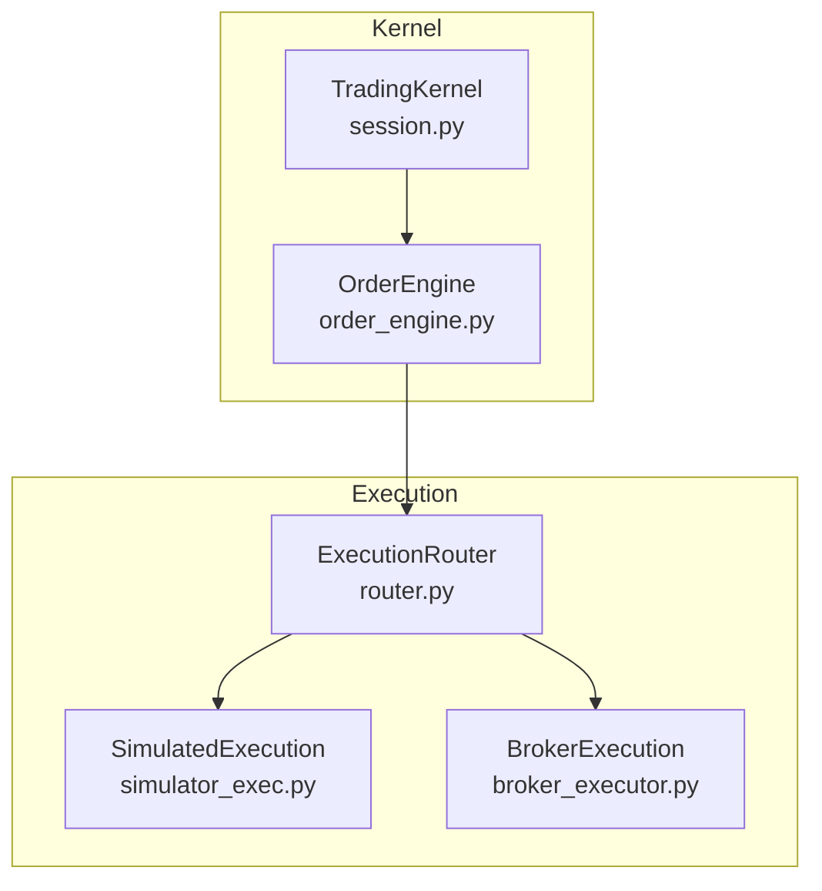
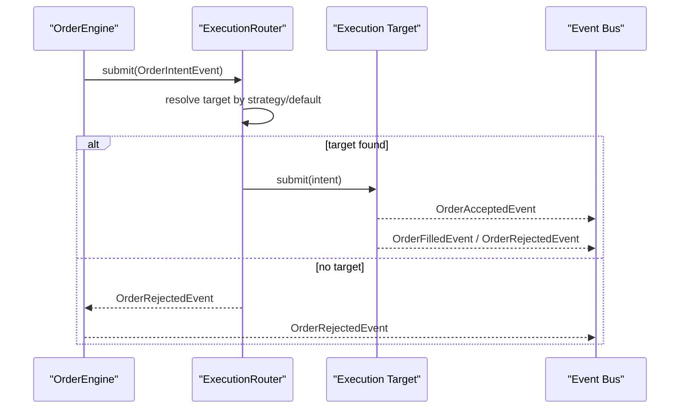
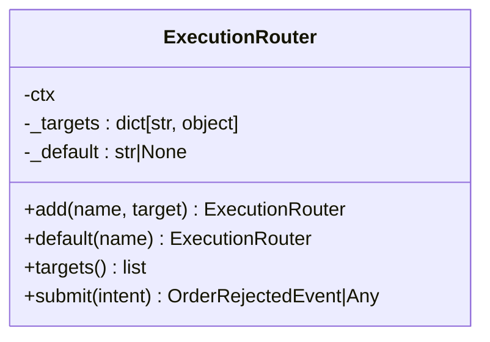
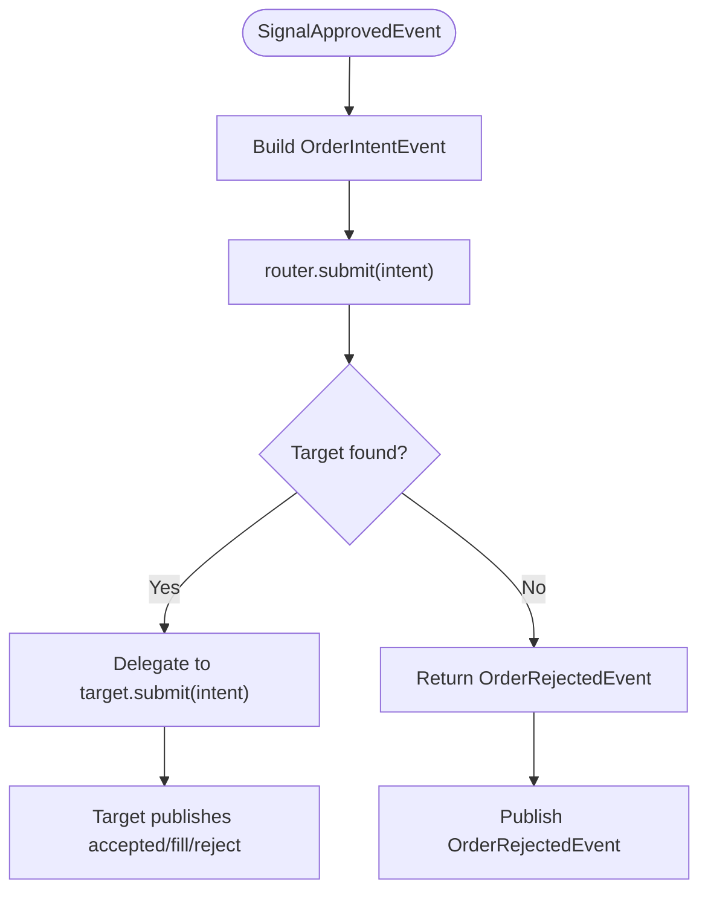
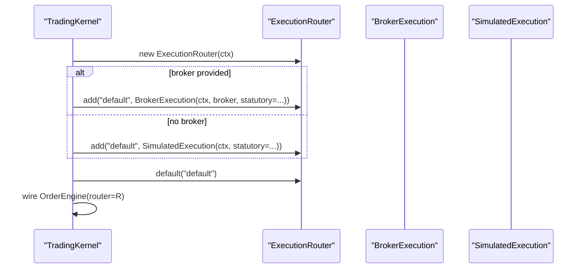
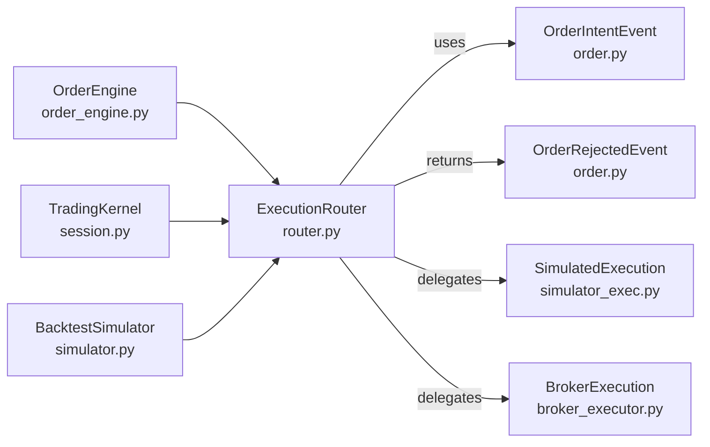

# Execution Router

<cite>
**Referenced Files in This Document**
- [router.py](file://ntrade/execution/router.py)
- [order_engine.py](file://ntrade/engines/order_engine.py)
- [session.py](file://ntrade/kernel/session.py)
- [simulator.py](file://ntrade/backtest/simulator.py)
- [order.py](file://ntrade/events/order.py)
- [broker_executor.py](file://ntrade/execution/broker_executor.py)
- [simulator_exec.py](file://ntrade/execution/simulator.py)
</cite>

## Table of Contents
1. [Introduction](#introduction)
2. [Project Structure](#project-structure)
3. [Core Components](#core-components)
4. [Architecture Overview](#architecture-overview)
5. [Detailed Component Analysis](#detailed-component-analysis)
6. [Dependency Analysis](#dependency-analysis)
7. [Performance Considerations](#performance-considerations)
8. [Troubleshooting Guide](#troubleshooting-guide)
9. [Conclusion](#conclusion)

## Introduction
This document explains the ExecutionRouter class, which routes order intents to execution targets based on strategy names and falls back to a default target when no specific target is registered. It covers target registration via add(), default configuration via default(), the submit() routing logic, error handling through OrderRejectedEvent, and how the router participates in the zero-parity trading invariant system alongside SimulatedExecution and BrokerExecution.

## Project Structure
The ExecutionRouter lives in the execution subsystem and is wired into the kernel’s session and backtest simulator. The router delegates to concrete execution targets that implement a common submit(intent) interface:
- SimulatedExecution for paper/backtest runs
- BrokerExecution for live trading

**Diagram sources**
- [session.py:80-104](file://ntrade/kernel/session.py#L80-L104)
- [order_engine.py:14-34](file://ntrade/engines/order_engine.py#L14-L34)
- [router.py:19-48](file://ntrade/execution/router.py#L19-L48)
- [simulator_exec.py:43-147](file://ntrade/execution/simulator.py#L43-L147)
- [broker_executor.py:53-107](file://ntrade/execution/broker_executor.py#L53-L107)

**Section sources**
- [session.py:80-104](file://ntrade/kernel/session.py#L80-L104)
- [simulator.py:85-108](file://ntrade/backtest/simulator.py#L85-L108)
- [router.py:19-48](file://ntrade/execution/router.py#L19-L48)

## Core Components
- ExecutionRouter: Maintains a name→target registry and a default target name; resolves the correct target per intent.strategy with fallback to default; returns OrderRejectedEvent if no target is available.
- SimulatedExecution: Deterministic fill engine for paper/backtest; publishes OrderAcceptedEvent and OrderFilledEvent; can reject intents under invalid conditions.
- BrokerExecution: Live execution engine; publishes OrderAcceptedEvent immediately and later emits fills/rejections via poll(); tracks open orders and timeouts.

Key responsibilities:
- Routing by strategy name with default fallback
- Error signaling via OrderRejectedEvent
- Zero-parity: same event flow across simulated and live targets

**Section sources**
- [router.py:19-48](file://ntrade/execution/router.py#L19-L48)
- [simulator_exec.py:43-147](file://ntrade/execution/simulator.py#L43-L147)
- [broker_executor.py:53-107](file://ntrade/execution/broker_executor.py#L53-L107)
- [order.py:11-47](file://ntrade/events/order.py#L11-L47)

## Architecture Overview
The router sits between the OrderEngine and execution targets. OrderEngine materializes approved signals into OrderIntentEvent and submits them to the router. The router selects the appropriate target by intent.strategy or default and delegates submission. Targets publish lifecycle events (accepted/filled/rejected) to the event bus.

**Diagram sources**
- [order_engine.py:21-34](file://ntrade/engines/order_engine.py#L21-L34)
- [router.py:37-48](file://ntrade/execution/router.py#L37-L48)
- [simulator_exec.py:72-147](file://ntrade/execution/simulator.py#L72-L147)
- [broker_executor.py:70-107](file://ntrade/execution/broker_executor.py#L70-L107)

## Detailed Component Analysis

### ExecutionRouter Class
Responsibilities:
- Registration: add(name, target) registers an execution target under a string key.
- Default: default(name) sets the fallback target used when no strategy-specific target exists.
- Resolution: submit(intent) looks up target by intent.strategy; if not found and default is set, uses default; otherwise returns OrderRejectedEvent.
- Inspection: targets() returns all registered targets.

Routing algorithm:
- Try exact match on intent.strategy
- Fallback to configured default
- If still none, produce OrderRejectedEvent with reason indicating missing target

Error handling:
- When no target is available, constructs OrderRejectedEvent carrying symbol, exchange, side, quantity, reason, strategy, and timestamp.

Zero-parity role:
- ExecutionRouter is the interchangeable “execution target” layer enabling identical flows for simulated and live environments.

**Diagram sources**
- [router.py:19-48](file://ntrade/execution/router.py#L19-L48)

**Section sources**
- [router.py:19-48](file://ntrade/execution/router.py#L19-L48)

### OrderEngine Integration
OrderEngine converts SignalApprovedEvent into OrderIntentEvent and submits it to the router. If the router returns an OrderRejectedEvent, OrderEngine republishes it to the bus.

Flow highlights:
- Intent creation includes strategy from signal
- Router.submit outcome determines whether acceptance/fill events come from the target or rejection comes directly from the router

**Diagram sources**
- [order_engine.py:21-34](file://ntrade/engines/order_engine.py#L21-L34)
- [router.py:37-48](file://ntrade/execution/router.py#L37-L48)

**Section sources**
- [order_engine.py:14-34](file://ntrade/engines/order_engine.py#L14-L34)

### Kernel Session Wiring
TradingKernel constructs an ExecutionRouter and wires either BrokerExecution (live) or SimulatedExecution (paper/backtest) as the default target. It also exposes helpers to access broker execution for polling and OMS operations.

Key points:
- If no custom execution is provided, kernel creates ExecutionRouter and adds a default target
- In live mode, BrokerExecution is added with statutory cost configuration matching simulation
- In paper/backtest modes, SimulatedExecution is added with statutory costs enabled by default

**Diagram sources**
- [session.py:88-103](file://ntrade/kernel/session.py#L88-L103)

**Section sources**
- [session.py:80-104](file://ntrade/kernel/session.py#L80-L104)

### Backtest Simulator Wiring
BacktestSimulator builds a kernel and configures an ExecutionRouter with either BarAwareExecution or SimulatedExecution as the default target. This ensures deterministic fills during backtests while preserving the same event pipeline.

**Section sources**
- [simulator.py:85-108](file://ntrade/backtest/simulator.py#L85-L108)

### Event Types Used by Router
- OrderIntentEvent: carries symbol, exchange, side, quantity, order_type, price, strategy, ts
- OrderRejectedEvent: carries symbol, exchange, side, quantity, reason, strategy, ts

These are used by the router to signal unresolvable routing scenarios.

**Section sources**
- [order.py:11-47](file://ntrade/events/order.py#L11-L47)

## Dependency Analysis
ExecutionRouter depends on:
- OrderIntentEvent and OrderRejectedEvent from ntrade.events.order
- TradingContext (type hint only)
- Concrete targets implementing submit(intent)

It is consumed by:
- OrderEngine (via router.submit)
- TradingKernel (wiring default targets)
- BacktestSimulator (customizing execution target)

**Diagram sources**
- [router.py:19-48](file://ntrade/execution/router.py#L19-L48)
- [order_engine.py:14-34](file://ntrade/engines/order_engine.py#L14-L34)
- [session.py:88-103](file://ntrade/kernel/session.py#L88-L103)
- [simulator.py:85-108](file://ntrade/backtest/simulator.py#L85-L108)
- [simulator_exec.py:43-147](file://ntrade/execution/simulator.py#L43-L147)
- [broker_executor.py:53-107](file://ntrade/execution/broker_executor.py#L53-L107)
- [order.py:11-47](file://ntrade/events/order.py#L11-L47)

**Section sources**
- [router.py:19-48](file://ntrade/execution/router.py#L19-L48)
- [order_engine.py:14-34](file://ntrade/engines/order_engine.py#L14-L34)
- [session.py:88-103](file://ntrade/kernel/session.py#L88-L103)
- [simulator.py:85-108](file://ntrade/backtest/simulator.py#L85-L108)

## Performance Considerations
- Target lookup is O(1) dictionary access by strategy name; fallback to default is another O(1) lookup.
- No blocking I/O inside the router; delegation is synchronous and lightweight.
- For high-throughput strategies, ensure each target’s submit() is efficient and non-blocking where possible.
- Avoid heavy computations in add()/default() calls; these are typically invoked once at startup.

[No sources needed since this section provides general guidance]

## Troubleshooting Guide
Common issues and resolutions:
- Orders rejected due to missing target:
  - Symptom: OrderRejectedEvent with reason indicating no execution target for the strategy.
  - Cause: No target registered for the strategy name and no default target configured.
  - Fix: Register a target for the strategy via add(strategy_name, target) or set a default target via default(target_name).
- Unexpected rejections in live mode:
  - Check BrokerExecution.submit() for instrument availability and broker exceptions; these also produce OrderRejectedEvent.
- Rejections in simulation/backtest:
  - Verify instrument presence and valid pricing for market orders; SimulatedExecution may reject intents without prices.

Relevant patterns:
- Router produces OrderRejectedEvent when no target is resolvable.
- OrderEngine republishes any OrderRejectedEvent returned by the router.

**Section sources**
- [router.py:37-48](file://ntrade/execution/router.py#L37-L48)
- [order_engine.py:21-34](file://ntrade/engines/order_engine.py#L21-L34)
- [broker_executor.py:70-107](file://ntrade/execution/broker_executor.py#L70-L107)
- [simulator_exec.py:72-107](file://ntrade/execution/simulator.py#L72-L107)
- [order.py:36-47](file://ntrade/events/order.py#L36-L47)

## Conclusion
ExecutionRouter provides a clean, extensible routing mechanism for order intents based on strategy names with a robust default fallback. It integrates seamlessly with both simulated and live execution targets, ensuring consistent event-driven behavior across environments. By registering multiple targets and configuring defaults, you can support dynamic routing strategies such as instrument-type-based routing or market-condition-aware dispatching. Proper configuration avoids OrderRejectedEvent scenarios and maintains zero-parity across paper and live trading.

[No sources needed since this section summarizes without analyzing specific files]