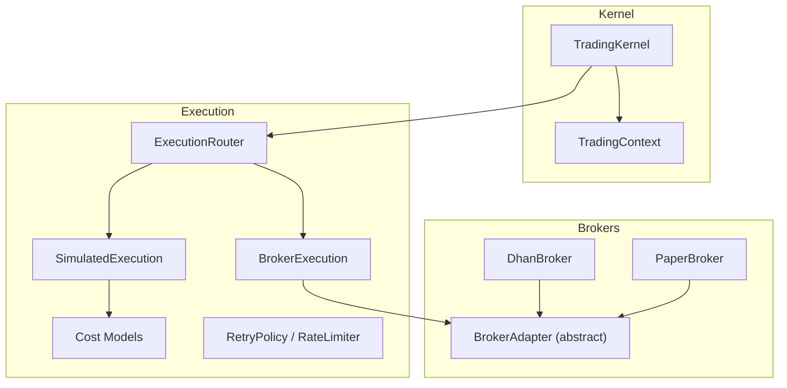
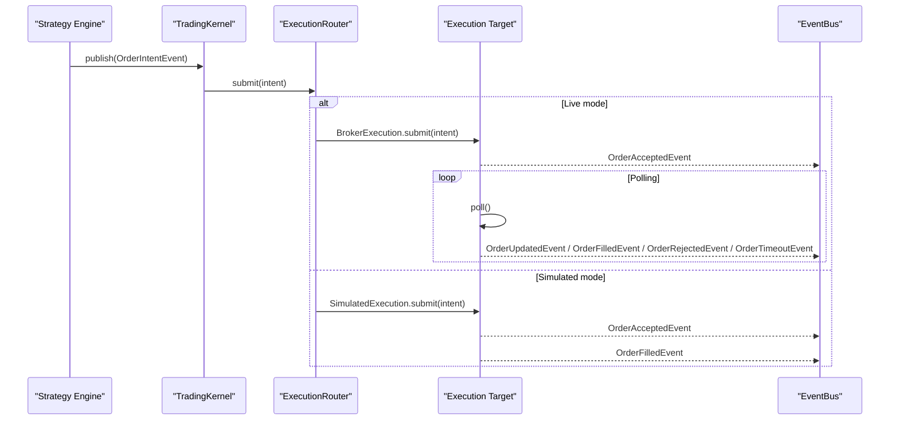
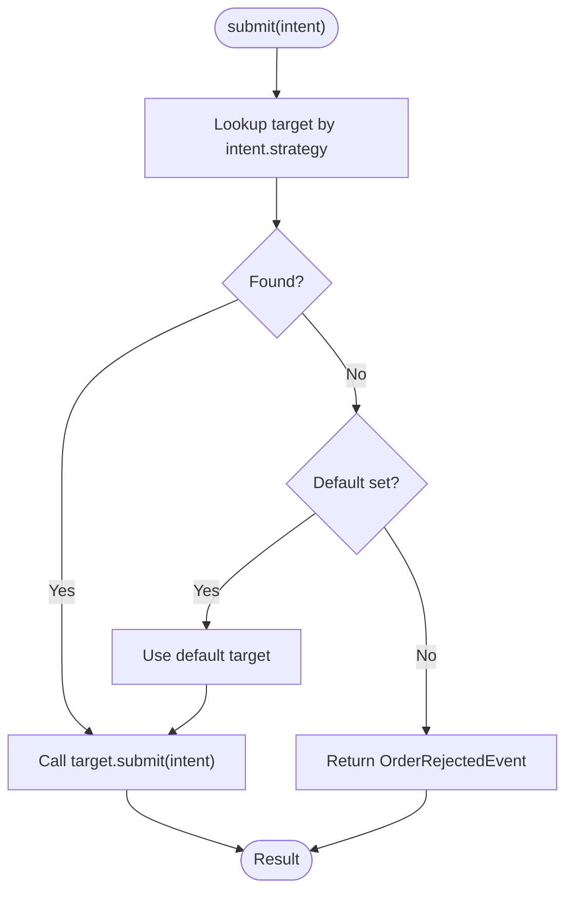
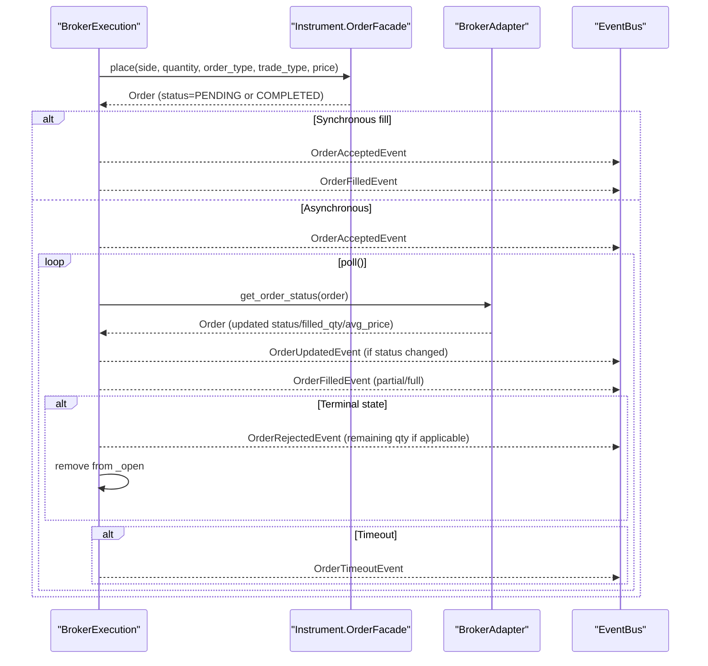
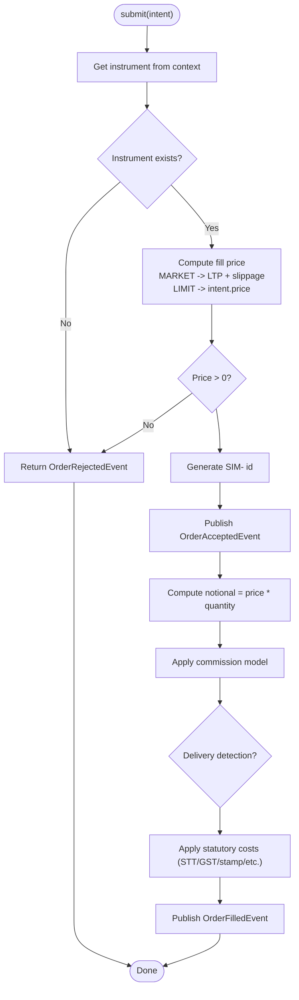
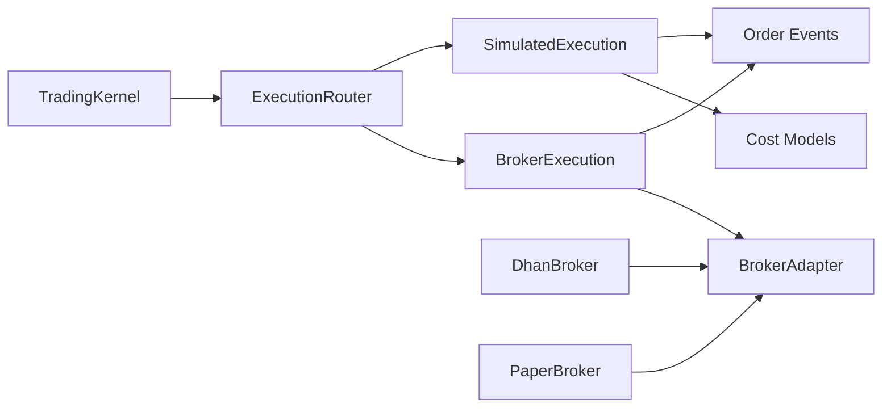

# Execution Routing & Broker Integration

<cite>
**Referenced Files in This Document**
- [router.py](file://ntrade/execution/router.py)
- [broker_executor.py](file://ntrade/execution/broker_executor.py)
- [simulator.py](file://ntrade/execution/simulator.py)
- [base.py](file://ntrade/brokers/base.py)
- [dhan.py](file://ntrade/brokers/dhan.py)
- [paper.py](file://ntrade/brokers/paper.py)
- [costs.py](file://ntrade/execution/costs.py)
- [retry.py](file://ntrade/execution/retry.py)
- [order.py](file://ntrade/domain/orders/order.py)
- [order_events.py](file://ntrade/events/order.py)
- [session.py](file://ntrade/kernel/session.py)
- [context.py](file://ntrade/kernel/context.py)
- [live_runner.py](file://docs/superpowers/plans/2026-07-31-g2-live-harness.md)
</cite>

## Table of Contents
1. [Introduction](#introduction)
2. [Project Structure](#project-structure)
3. [Core Components](#core-components)
4. [Architecture Overview](#architecture-overview)
5. [Detailed Component Analysis](#detailed-component-analysis)
6. [Dependency Analysis](#dependency-analysis)
7. [Performance Considerations](#performance-considerations)
8. [Troubleshooting Guide](#troubleshooting-guide)
9. [Conclusion](#conclusion)
10. [Appendices](#appendices)

## Introduction
This document explains the execution routing and broker integration systems that direct order intents to appropriate execution targets, support both simulated and live trading modes, and provide robust lifecycle management for orders. It focuses on:
- ExecutionRouter for strategy-based routing to execution targets
- BrokerExecution for asynchronous live order placement, polling, and real-time updates
- BrokerAdapter as the abstract interface for broker-specific implementations
- SimulatedExecution for paper trading and backtesting with realistic cost modeling
- Order submission flow, validation, routing decisions, and strategies
- Multi-broker support and dynamic routing based on instrument type, market conditions, and capabilities
- Configuration examples, failure handling, custom adapter implementation, performance considerations, connection pooling, and error recovery

## Project Structure
The execution subsystem is organized under ntrade/execution and integrates with brokers under ntrade/brokers. The kernel wires these components together via TradingKernel, which selects the execution target based on whether a broker is present (live) or not (simulated).

**Diagram sources**
- [session.py:87-101](file://ntrade/kernel/session.py#L87-L101)
- [router.py:19-48](file://ntrade/execution/router.py#L19-L48)
- [broker_executor.py:46-55](file://ntrade/execution/broker_executor.py#L46-L55)
- [simulator.py:43-70](file://ntrade/execution/simulator.py#L43-L70)
- [base.py:25-34](file://ntrade/brokers/base.py#L25-L34)
- [dhan.py:54-68](file://ntrade/brokers/dhan.py#L54-L68)
- [paper.py:23-36](file://ntrade/brokers/paper.py#L23-L36)

**Section sources**
- [session.py:87-101](file://ntrade/kernel/session.py#L87-L101)
- [context.py:17-46](file://ntrade/kernel/context.py#L17-L46)

## Core Components
- ExecutionRouter: Routes OrderIntentEvent to a target by strategy name; falls back to a default target if none matches.
- BrokerExecution: Live execution target that places orders asynchronously, tracks open orders, polls status, emits lifecycle events, and handles timeouts and partial fills.
- SimulatedExecution: Deterministic fill engine for paper/backtest with configurable slippage, commission, and statutory costs.
- BrokerAdapter: Abstract base defining the transport boundary between domain objects and broker APIs (quotes, history, orders, books, streaming).
- DhanBroker and PaperBroker: Concrete BrokerAdapter implementations for live and paper trading respectively.
- Cost models: SlippageModel, CommissionModel, IndianStatutoryCosts, FuturesCarryCosts for realistic simulation.
- Resilience utilities: RetryPolicy and RateLimiter for resilient API calls.

Key responsibilities:
- Validation and routing of order intents
- Asynchronous order lifecycle management
- Real-time event emission for fills, updates, rejections, and timeouts
- Zero-parity execution across simulated and live modes

**Section sources**
- [router.py:19-48](file://ntrade/execution/router.py#L19-L48)
- [broker_executor.py:46-169](file://ntrade/execution/broker_executor.py#L46-L169)
- [simulator.py:43-147](file://ntrade/execution/simulator.py#L43-L147)
- [base.py:25-163](file://ntrade/brokers/base.py#L25-L163)
- [dhan.py:54-68](file://ntrade/brokers/dhan.py#L54-L68)
- [paper.py:23-36](file://ntrade/brokers/paper.py#L23-L36)
- [costs.py:21-285](file://ntrade/execution/costs.py#L21-L285)
- [retry.py:19-98](file://ntrade/execution/retry.py#L19-L98)

## Architecture Overview
The system enforces zero parity: the same OrderEngine → ExecutionTarget pipeline runs identically in live and simulated modes. ExecutionRouter selects the target per strategy; BrokerExecution manages live order lifecycles; SimulatedExecution provides deterministic fills with realistic costs.

**Diagram sources**
- [session.py:87-101](file://ntrade/kernel/session.py#L87-L101)
- [router.py:37-48](file://ntrade/execution/router.py#L37-L48)
- [broker_executor.py:58-95](file://ntrade/execution/broker_executor.py#L58-L95)
- [simulator.py:72-147](file://ntrade/execution/simulator.py#L72-L147)
- [order_events.py:11-91](file://ntrade/events/order.py#L11-L91)

## Detailed Component Analysis

### ExecutionRouter
Responsibilities:
- Maintain a map of named execution targets
- Select target by intent.strategy; fallback to default
- Return OrderRejectedEvent when no target is available

Routing logic:
- If intent.strategy has a registered target, use it
- Else if default is set, use default
- Else return rejection with reason

Configuration:
- Add targets by name
- Set default target
- Retrieve all targets

**Diagram sources**
- [router.py:37-48](file://ntrade/execution/router.py#L37-L48)

**Section sources**
- [router.py:19-48](file://ntrade/execution/router.py#L19-L48)

### BrokerExecution (Live)
Responsibilities:
- Place orders via instrument.order.place using the broker adapter
- Publish OrderAcceptedEvent immediately
- Track open orders and poll for status changes
- Emit OrderUpdatedEvent, OrderFilledEvent, OrderRejectedEvent, OrderTimeoutEvent
- Handle synchronous brokers (instant fill) and asynchronous brokers
- Support modify/cancel operations
- Restore open orders from persisted deltas after crash

Submission flow:
- Validate instrument and broker_adapter
- Create Order via instrument.order.place
- Assign unique order_id (fallback BRK- id if missing)
- Publish OrderAcceptedEvent
- If filled synchronously, emit fill; else track as open

Polling flow:
- For each open order, refresh status via broker.get_order_status
- On success, reset stale counter; otherwise increment and evict after threshold
- Detect timeout for PENDING orders older than threshold
- Emit OrderUpdatedEvent on status change
- Emit partial/full fills via _emit_fill
- Remove completed/rejected/cancelled orders from tracking

**Diagram sources**
- [broker_executor.py:58-169](file://ntrade/execution/broker_executor.py#L58-L169)

**Section sources**
- [broker_executor.py:46-169](file://ntrade/execution/broker_executor.py#L46-L169)

### SimulatedExecution (Paper/Backtest)
Responsibilities:
- Determine fill price based on order type and instrument quote
- Apply slippage model
- Compute commission and statutory costs
- Detect delivery vs intraday equity for accurate STT/stamp
- Emit OrderAcceptedEvent and OrderFilledEvent deterministically

Cost modeling:
- SlippageModel: FixedSlippage, PercentageSlippage
- CommissionModel: FlatCommission, PercentageCommission
- IndianStatutoryCosts: STT, exchange charges, SEBI fee, GST, stamp duty
- FuturesCarryCosts: daily carry and roll costs

Delivery detection:
- Track entry session date and notional per symbol
- On sell leg next session, apply delivery schedule uplift to both legs

**Diagram sources**
- [simulator.py:72-147](file://ntrade/execution/simulator.py#L72-L147)
- [costs.py:21-285](file://ntrade/execution/costs.py#L21-L285)

**Section sources**
- [simulator.py:43-147](file://ntrade/execution/simulator.py#L43-L147)
- [costs.py:21-285](file://ntrade/execution/costs.py#L21-L285)

### BrokerAdapter (Abstract Base)
Responsibilities:
- Define the transport boundary for quotes, depth, history, option chains
- Provide order lifecycle methods: place_order, cancel_order, modify_order, get_order_status, get_order_detail
- Expose portfolio and streaming capabilities
- Manage subscriptions and time source for zero-parity timestamps

Key methods:
- connect/disconnect
- get_quote/get_depth/get_historical/get_option_chain
- place_order/cancel_order/modify_order/get_order_status/get_order_detail
- get_executed_price/get_executed_price_and_time
- subscribe/unsubscribe/_dispatch_tick

**Section sources**
- [base.py:25-163](file://ntrade/brokers/base.py#L25-L163)

### DhanBroker (Live)
Responsibilities:
- Implement BrokerAdapter for Dhan-Tradehull
- Authenticate and manage token refresh
- Fetch quotes, depth, historical data, option chains
- Place orders with SEBI-compliant LIMIT for F&O
- Handle bracket orders via dedicated API
- Refresh order status and details
- Normalize order/trade books and reports

Notable behaviors:
- Retry on intermittent LTP failures
- Timeframe mapping with strict validation
- Option chain fallback to next expiry
- Instrument metadata resolution from instrument file

**Section sources**
- [dhan.py:54-68](file://ntrade/brokers/dhan.py#L54-L68)
- [dhan.py:107-140](file://ntrade/brokers/dhan.py#L107-L140)
- [dhan.py:304-351](file://ntrade/brokers/dhan.py#L304-L351)
- [dhan.py:388-407](file://ntrade/brokers/dhan.py#L388-L407)

### PaperBroker (Simulated)
Responsibilities:
- In-memory BrokerAdapter for tests/backtests/replays
- Seed quotes and history
- Instantly fill orders with deterministic prices
- Support cancel/modify/status refresh
- Provide order/trade books and reports

**Section sources**
- [paper.py:23-36](file://ntrade/brokers/paper.py#L23-L36)
- [paper.py:108-118](file://ntrade/brokers/paper.py#L108-L118)

### Order Model and Facade
Responsibilities:
- Represent order state and lifecycle
- Provide facade methods for buy/sell/market/limit/stop/cover/bracket
- Delegate place/cancel/modify/refresh to broker adapter via instrument

**Section sources**
- [order.py:44-173](file://ntrade/domain/orders/order.py#L44-L173)

### Event Types
Order lifecycle events:
- OrderIntentEvent: pre-execution signal
- OrderAcceptedEvent: target accepted
- OrderRejectedEvent: target rejected
- OrderFilledEvent: fill with price/commission/statutory
- OrderUpdatedEvent: status change with filled_qty/avg_price
- OrderTimeoutEvent: pending order exceeded timeout

**Section sources**
- [order_events.py:11-91](file://ntrade/events/order.py#L11-L91)

## Dependency Analysis
The execution system depends on:
- TradingKernel for wiring and orchestration
- ExecutionRouter for strategy-based routing
- BrokerExecution/SimulatedExecution for execution targets
- BrokerAdapter implementations for transport
- Cost models for realistic simulation
- RetryPolicy/RateLimiter for resilience

**Diagram sources**
- [session.py:87-101](file://ntrade/kernel/session.py#L87-L101)
- [router.py:19-48](file://ntrade/execution/router.py#L19-L48)
- [broker_executor.py:46-55](file://ntrade/execution/broker_executor.py#L46-L55)
- [simulator.py:43-70](file://ntrade/execution/simulator.py#L43-L70)
- [base.py:25-34](file://ntrade/brokers/base.py#L25-L34)
- [dhan.py:54-68](file://ntrade/brokers/dhan.py#L54-L68)
- [paper.py:23-36](file://ntrade/brokers/paper.py#L23-L36)
- [costs.py:21-285](file://ntrade/execution/costs.py#L21-L285)
- [order_events.py:11-91](file://ntrade/events/order.py#L11-L91)

**Section sources**
- [session.py:87-101](file://ntrade/kernel/session.py#L87-L101)
- [router.py:19-48](file://ntrade/execution/router.py#L19-L48)
- [broker_executor.py:46-55](file://ntrade/execution/broker_executor.py#L46-L55)
- [simulator.py:43-70](file://ntrade/execution/simulator.py#L43-L70)
- [base.py:25-34](file://ntrade/brokers/base.py#L25-L34)
- [dhan.py:54-68](file://ntrade/brokers/dhan.py#L54-L68)
- [paper.py:23-36](file://ntrade/brokers/paper.py#L23-L36)
- [costs.py:21-285](file://ntrade/execution/costs.py#L21-L285)
- [order_events.py:11-91](file://ntrade/events/order.py#L11-L91)

## Performance Considerations
- Polling frequency: Adjust poll_interval in LiveRunner to balance latency and load
- Stale order eviction: BrokerExecution evicts orders after consecutive failures to prevent memory leaks
- Token refresh: DhanBroker ensures tokens are refreshed before critical operations
- Rate limiting: Use RateLimiter to throttle API calls and avoid rate limit errors
- Retry policies: Configure RetryPolicy for exponential backoff with jitter
- Connection pooling: Broker adapters should reuse connections where possible (e.g., DhanTransport)
- Event bus efficiency: Minimize event payload size and avoid unnecessary publishes

[No sources needed since this section provides general guidance]

## Troubleshooting Guide
Common issues and resolutions:
- No execution target for strategy: Ensure ExecutionRouter.add(name, target) and router.default("name") are configured correctly
- Order rejected due to no broker-backed instrument: Verify instrument.broker_adapter is set
- Synchronous vs asynchronous fills: Check broker implementation; PaperBroker fills instantly, DhanBroker may be async
- Timeout events: Orders stuck in PENDING beyond threshold trigger OrderTimeoutEvent
- Partial fills: BrokerExecution emits partial fills and continues tracking until terminal state
- Rejections after cancellation: Remaining quantity may be rejected if partially filled then cancelled

Debugging steps:
- Inspect open_orders() to see tracked orders
- Review emitted events via EventBus.history
- Log broker responses and exceptions
- Validate instrument metadata and quote availability

**Section sources**
- [router.py:37-48](file://ntrade/execution/router.py#L37-L48)
- [broker_executor.py:58-169](file://ntrade/execution/broker_executor.py#L58-L169)
- [simulator.py:72-147](file://ntrade/execution/simulator.py#L72-L147)
- [order_events.py:11-91](file://ntrade/events/order.py#L11-L91)

## Conclusion
The execution routing and broker integration system provides a robust, zero-parity framework for both simulated and live trading. ExecutionRouter enables flexible strategy-based routing, while BrokerExecution and SimulatedExecution ensure consistent order lifecycle management. BrokerAdapter abstracts broker-specific details, enabling easy extension for new brokers. With comprehensive cost modeling, resilience utilities, and clear event-driven architecture, the system supports reliable, high-performance trading operations.

[No sources needed since this section summarizes without analyzing specific files]

## Appendices

### Configuration Examples
- Configure execution routes:
  - Add targets by strategy name: router.add("strategy_name", target)
  - Set default target: router.default("default")
- Configure simulated execution:
  - Set slippage model: SimulatedExecution(ctx, slippage=FixedSlippage(0.1))
  - Set commission model: SimulatedExecution(ctx, commission=PercentageCommission(0.001))
  - Enable/disable statutory costs: SimulatedExecution(ctx, statutory=STATUTORY_DEFAULT or None)
- Configure live execution:
  - Instantiate broker: DhanBroker(env_path=".env", connect=True)
  - Wire into kernel: TradingKernel(mode="live", broker=broker)

### Error Recovery Mechanisms
- RetryPolicy: Exponential backoff with jitter for flaky API calls
- RateLimiter: Token-bucket rate limiting to respect API quotas
- Stale order eviction: Automatic cleanup of unresponsive orders
- Crash recovery: restore_open() rebuilds open order tracker from persisted deltas

### Custom Broker Adapter Implementation
Steps:
- Extend BrokerAdapter
- Implement required methods: connect, get_quote, get_historical, place_order
- Optionally implement optional methods: cancel_order, modify_order, get_order_status
- Register capability extensions via @capability decorator
- Test with PaperBroker patterns for consistency

**Section sources**
- [session.py:87-101](file://ntrade/kernel/session.py#L87-L101)
- [simulator.py:43-70](file://ntrade/execution/simulator.py#L43-L70)
- [dhan.py:54-68](file://ntrade/brokers/dhan.py#L54-L68)
- [base.py:25-163](file://ntrade/brokers/base.py#L25-L163)
- [retry.py:19-98](file://ntrade/execution/retry.py#L19-L98)
- [broker_executor.py:176-219](file://ntrade/execution/broker_executor.py#L176-L219)