# Order Book & Position Tracking

<cite>
**Referenced Files in This Document**
- [book.py](file://ntrade/domain/orders/book.py)
- [order.py](file://ntrade/domain/orders/order.py)
- [portfolio.py](file://ntrade/domain/portfolio.py)
- [order_engine.py](file://ntrade/engines/order_engine.py)
- [position_sync.py](file://ntrade/engines/position_sync.py)
- [order_events.py](file://ntrade/events/order.py)
- [broker_executor.py](file://ntrade/execution/broker_executor.py)
- [router.py](file://ntrade/execution/router.py)
- [portfolio_engine.py](file://ntrade/engines/portfolio_engine.py)
- [paper_broker.py](file://ntrade/brokers/paper.py)
- [test_orders.py](file://tests/test_orders.py)
</cite>

## Table of Contents
1. Introduction
2. Project Structure
3. Core Components
4. Architecture Overview
5. Detailed Component Analysis
6. Dependency Analysis
7. Performance Considerations
8. Troubleshooting Guide
9. Conclusion

## Introduction
This document explains how the system manages open orders, tracks their lifecycle and partial fills, and integrates order execution with positions and portfolio updates. It covers the order book structure, operations to add/update/remove/query orders, and the relationship between order book entries and position changes. It also provides examples for querying and filtering orders by status or instrument, monitoring execution progress, and discusses performance considerations for large order books and efficient lookups.

## Project Structure
The order book and position tracking functionality spans domain models, engines, execution components, and broker adapters:
- Domain models define immutable order/trade book entries and rich order types.
- Engines materialize signals into order intents and reconcile live state from brokers.
- Execution components route intents to targets (simulated or real brokers), track open orders, and emit lifecycle events.
- Portfolio engine updates positions and balances on fills.
- Paper broker provides an in-memory implementation of order book and trade book retrieval.

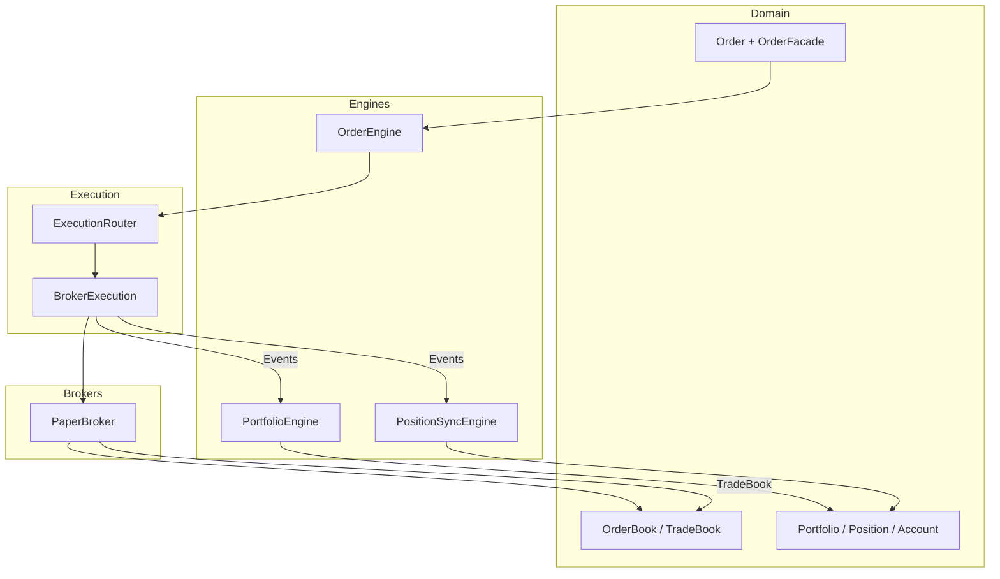

**Diagram sources**
- [book.py:1-120](file://ntrade/domain/orders/book.py#L1-L120)
- [order.py:1-173](file://ntrade/domain/orders/order.py#L1-L173)
- [portfolio.py:1-173](file://ntrade/domain/portfolio.py#L1-L173)
- [order_engine.py:1-34](file://ntrade/engines/order_engine.py#L1-L34)
- [portfolio_engine.py:1-69](file://ntrade/engines/portfolio_engine.py#L1-L69)
- [position_sync.py:1-110](file://ntrade/engines/position_sync.py#L1-L110)
- [broker_executor.py:1-262](file://ntrade/execution/broker_executor.py#L1-L262)
- [router.py:1-49](file://ntrade/execution/router.py#L1-L49)
- [paper_broker.py:1-216](file://ntrade/brokers/paper.py#L1-L216)

**Section sources**
- [book.py:1-120](file://ntrade/domain/orders/book.py#L1-L120)
- [order.py:1-173](file://ntrade/domain/orders/order.py#L1-L173)
- [portfolio.py:1-173](file://ntrade/domain/portfolio.py#L1-L173)
- [order_engine.py:1-34](file://ntrade/engines/order_engine.py#L1-L34)
- [position_sync.py:1-110](file://ntrade/engines/position_sync.py#L1-L110)
- [order_events.py:1-91](file://ntrade/events/order.py#L1-L91)
- [broker_executor.py:1-262](file://ntrade/execution/broker_executor.py#L1-L262)
- [router.py:1-49](file://ntrade/execution/router.py#L1-L49)
- [portfolio_engine.py:1-69](file://ntrade/engines/portfolio_engine.py#L1-L69)
- [paper_broker.py:1-216](file://ntrade/brokers/paper.py#L1-L216)

## Core Components
- OrderBook and TradeBook: Immutable collections of open orders and executed trades with symbol filtering and dict conversion utilities.
- Order model and facade: Rich order representation with lifecycle helpers and a convenient entry API bound to instruments.
- Portfolio, Position, Account: Read models for positions and holdings with computed metrics and refresh capabilities.
- OrderEngine: Converts approved signals into order intents and submits them via the router.
- BrokerExecution: Tracks open orders, polls broker for lifecycle updates, emits fill/rejection/timeout events, and supports modify/cancel.
- PortfolioEngine: Updates positions and account balance on fills; publishes position and balance change events.
- PositionSyncEngine: Reconciles broker-reported positions and cash into kernel read models, publishing canonical events.
- PaperBroker: In-memory broker implementing order placement, lifecycle, and order/trade book retrieval.

**Section sources**
- [book.py:1-120](file://ntrade/domain/orders/book.py#L1-L120)
- [order.py:1-173](file://ntrade/domain/orders/order.py#L1-L173)
- [portfolio.py:1-173](file://ntrade/domain/portfolio.py#L1-L173)
- [order_engine.py:1-34](file://ntrade/engines/order_engine.py#L1-L34)
- [broker_executor.py:1-262](file://ntrade/execution/broker_executor.py#L1-L262)
- [portfolio_engine.py:1-69](file://ntrade/engines/portfolio_engine.py#L1-L69)
- [position_sync.py:1-110](file://ntrade/engines/position_sync.py#L1-L110)
- [paper_broker.py:1-216](file://ntrade/brokers/paper.py#L1-L216)

## Architecture Overview
The order lifecycle flows through signal approval, intent creation, routing, execution, and event-driven updates to positions and accounts. The broker executor maintains an in-memory open-order tracker and reconciles broker-reported states.

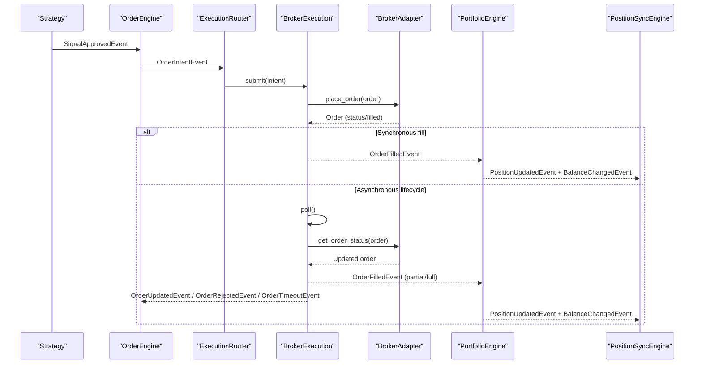

**Diagram sources**
- [order_engine.py:1-34](file://ntrade/engines/order_engine.py#L1-L34)
- [router.py:1-49](file://ntrade/execution/router.py#L1-L49)
- [broker_executor.py:1-262](file://ntrade/execution/broker_executor.py#L1-L262)
- [portfolio_engine.py:1-69](file://ntrade/engines/portfolio_engine.py#L1-L69)
- [position_sync.py:1-110](file://ntrade/engines/position_sync.py#L1-L110)
- [order_events.py:1-91](file://ntrade/events/order.py#L1-L91)

## Detailed Component Analysis

### Order Book Data Model
- OrderBookEntry captures symbol, order_id, side, quantity, price, status, exchange, timestamp.
- OrderBook is an immutable tuple of entries with symbol filtering and iteration helpers.
- TradeBookEntry captures executed trade details linked to an order_id.
- TradeBook mirrors OrderBook for executed trades.

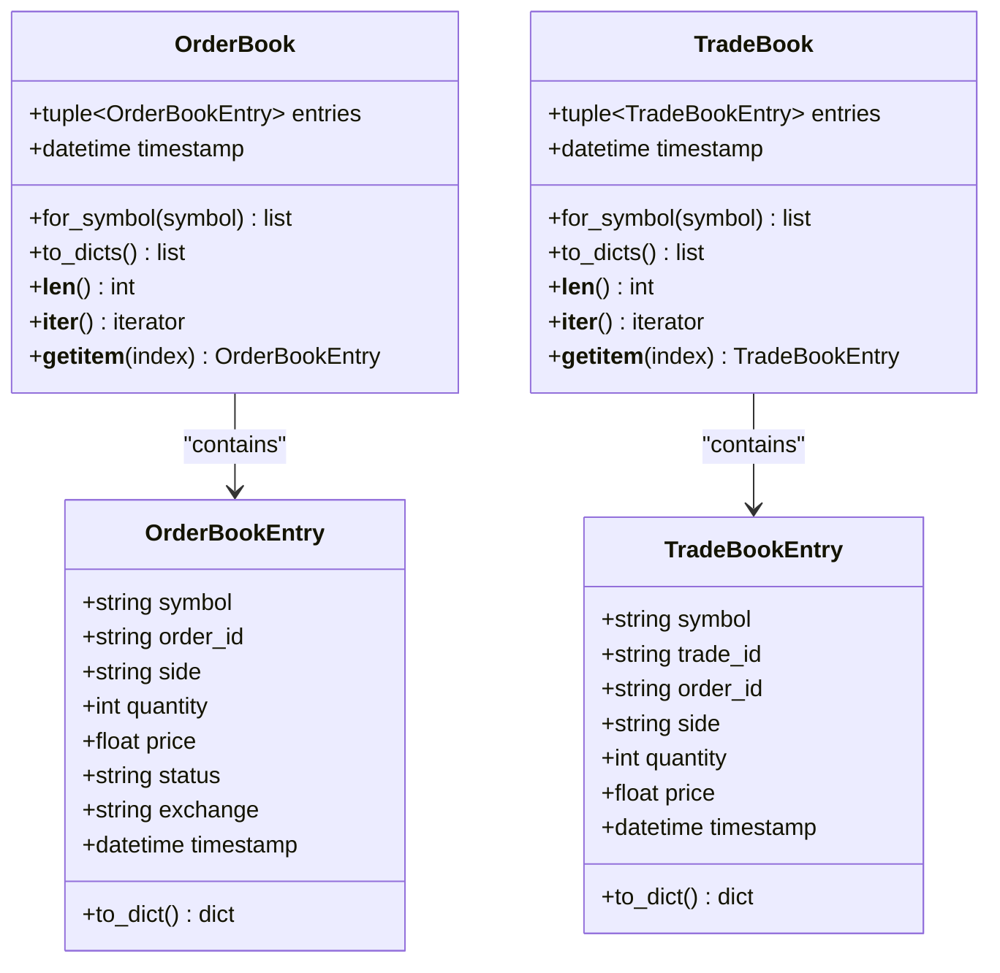

**Diagram sources**
- [book.py:1-120](file://ntrade/domain/orders/book.py#L1-L120)

**Section sources**
- [book.py:1-120](file://ntrade/domain/orders/book.py#L1-L120)

### Order Model and Facade
- Order encapsulates instrument, side, quantity, type, prices, lifecycle flags, and execution metadata.
- OrderFacade provides concise buy/sell/market/stop/cover/bracket methods that delegate to the instrument’s broker adapter.

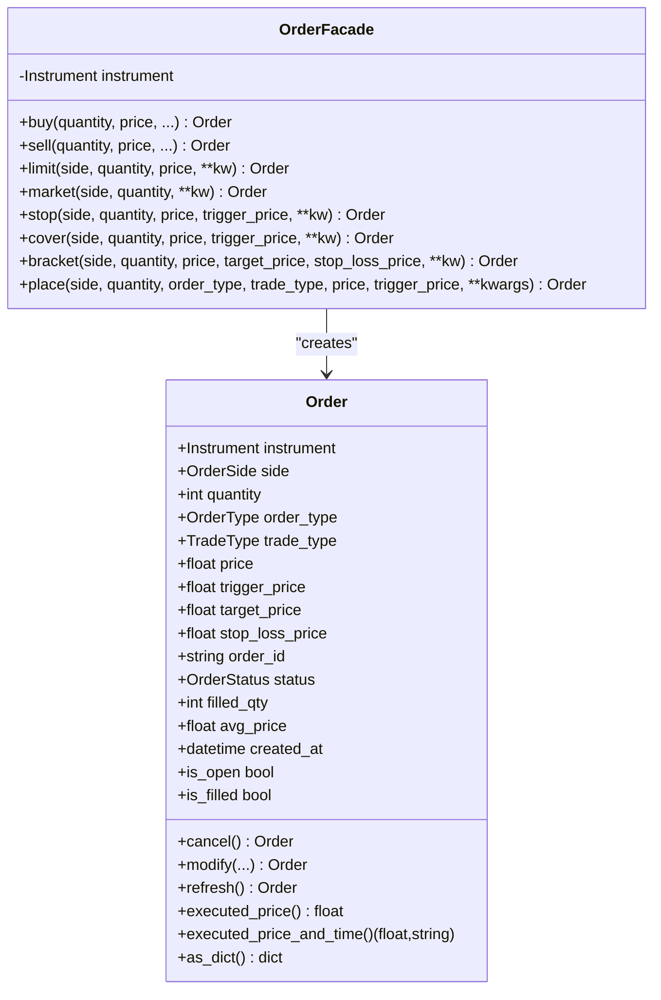

**Diagram sources**
- [order.py:1-173](file://ntrade/domain/orders/order.py#L1-L173)

**Section sources**
- [order.py:1-173](file://ntrade/domain/orders/order.py#L1-L173)

### Portfolio and Positions
- Position holds symbol, quantity, average price, last traded price, product, exchange, and metadata; exposes market_value and pnl.
- Portfolio aggregates positions and holdings, computes aggregate pnl and market value, and supports refresh from broker.
- Account holds balance and holdings with refresh capability.

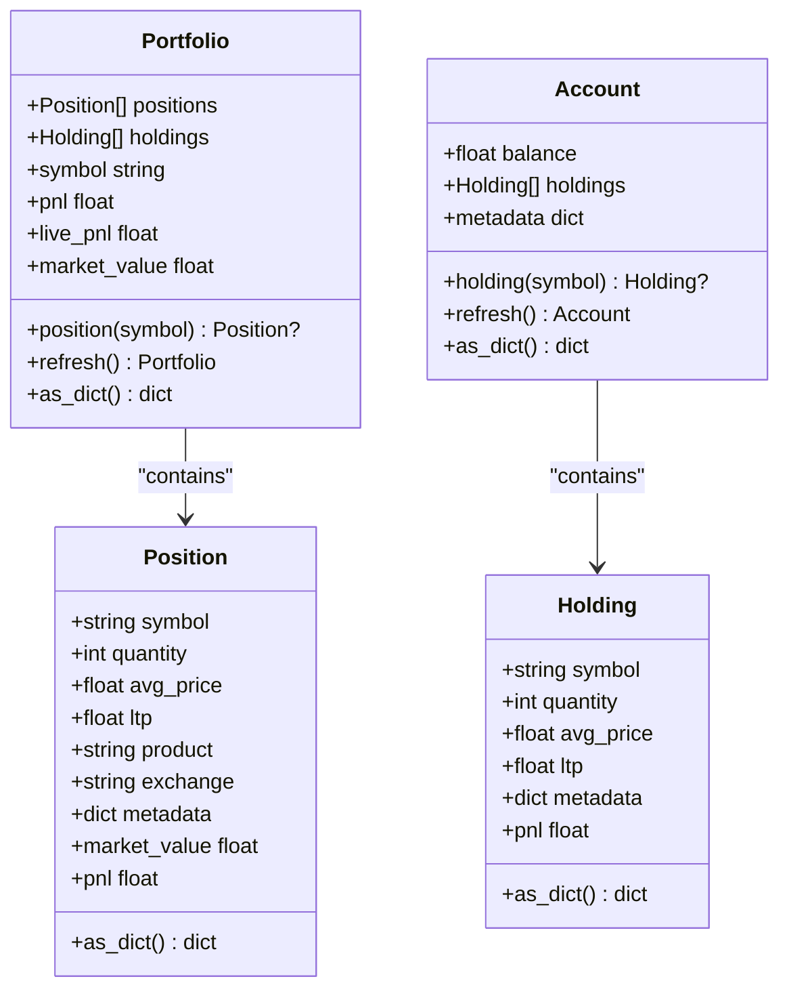

**Diagram sources**
- [portfolio.py:1-173](file://ntrade/domain/portfolio.py#L1-L173)

**Section sources**
- [portfolio.py:1-173](file://ntrade/domain/portfolio.py#L1-L173)

### Order Engine and Execution Routing
- OrderEngine subscribes to SignalApprovedEvent, creates OrderIntentEvent, and submits via ExecutionRouter.
- ExecutionRouter selects an execution target by strategy name or default.

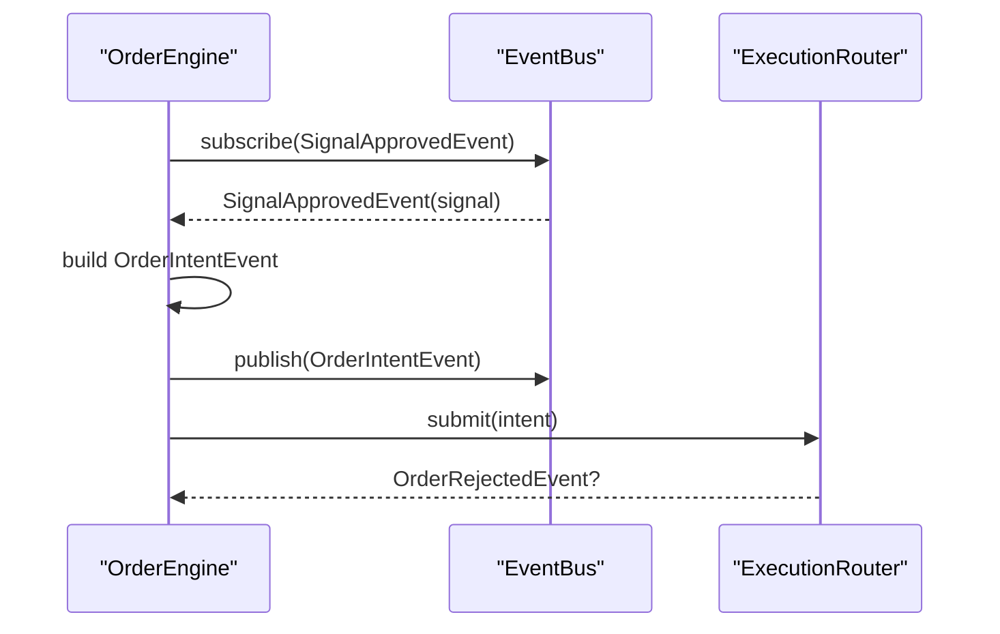

**Diagram sources**
- [order_engine.py:1-34](file://ntrade/engines/order_engine.py#L1-L34)
- [router.py:1-49](file://ntrade/execution/router.py#L1-L49)

**Section sources**
- [order_engine.py:1-34](file://ntrade/engines/order_engine.py#L1-L34)
- [router.py:1-49](file://ntrade/execution/router.py#L1-L49)

### BrokerExecution: Open Orders, Partial Fills, and Lifecycle
- Maintains an in-memory map of open orders keyed by order_id, tracking filled quantities and status transitions.
- On submit: places order via instrument.order.place, publishes OrderAcceptedEvent, handles synchronous fills immediately.
- On poll: refreshes order status, detects timeouts, publishes OrderUpdatedEvent on status changes, and emits partial/full fills via OrderFilledEvent.
- Handles cancellation/rejection after partial fills by emitting rejection only for remaining quantity.
- Supports restore_open for crash recovery and modify/cancel operations.

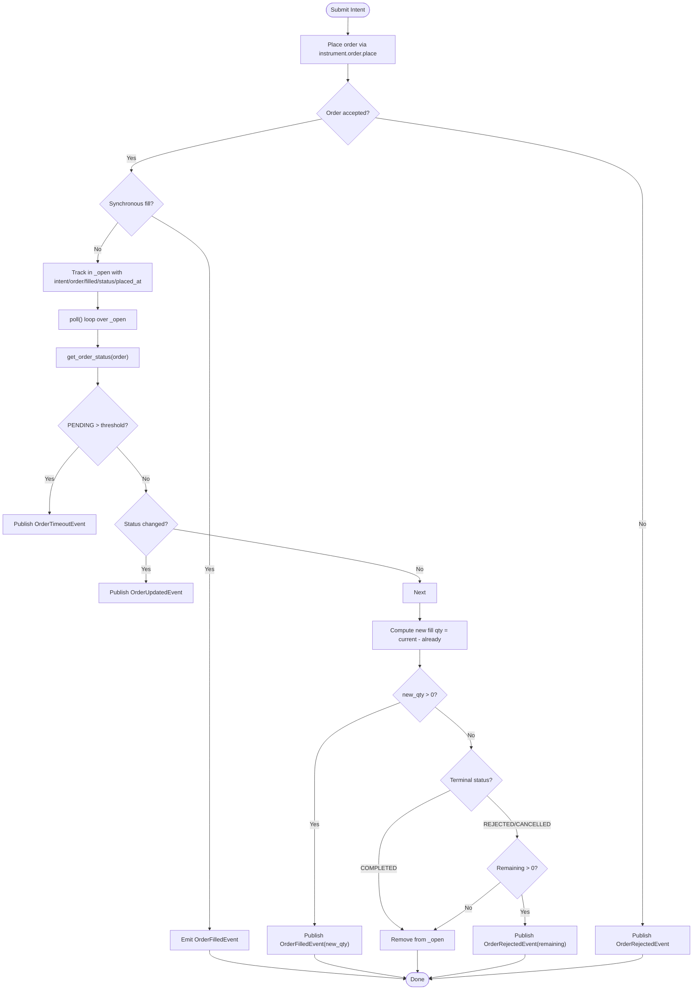

**Diagram sources**
- [broker_executor.py:1-262](file://ntrade/execution/broker_executor.py#L1-L262)
- [order_events.py:1-91](file://ntrade/events/order.py#L1-L91)

**Section sources**
- [broker_executor.py:1-262](file://ntrade/execution/broker_executor.py#L1-L262)
- [order_events.py:1-91](file://ntrade/events/order.py#L1-L91)

### PortfolioEngine: Fills to Positions and Balances
- Subscribes to OrderFilledEvent and nets position quantities, re-averages entry price, and debits/credits cash including commission and statutory charges.
- Publishes PositionUpdatedEvent and BalanceChangedEvent for downstream consumers.

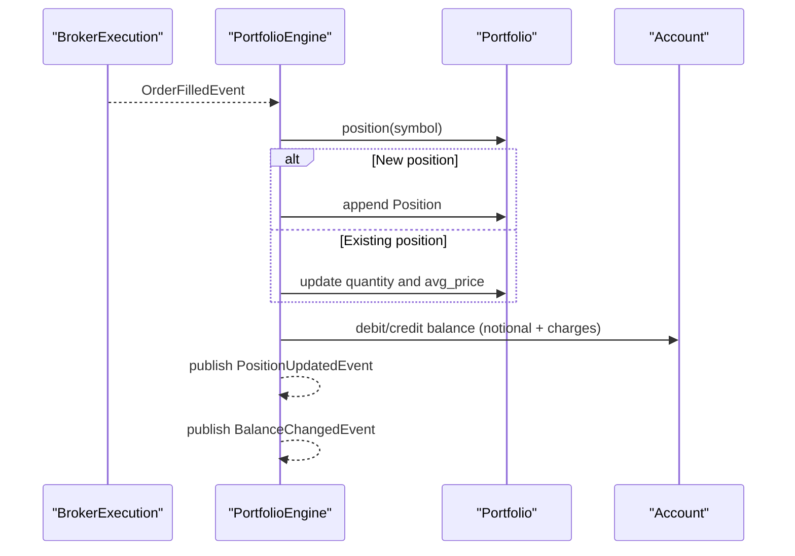

**Diagram sources**
- [portfolio_engine.py:1-69](file://ntrade/engines/portfolio_engine.py#L1-L69)

**Section sources**
- [portfolio_engine.py:1-69](file://ntrade/engines/portfolio_engine.py#L1-L69)

### PositionSyncEngine: Live Reconciliation
- Periodically pulls positions and balance from the broker, reconciling local read models and publishing canonical events.
- Ensures transient failures do not wipe state; keeps previous values on error.

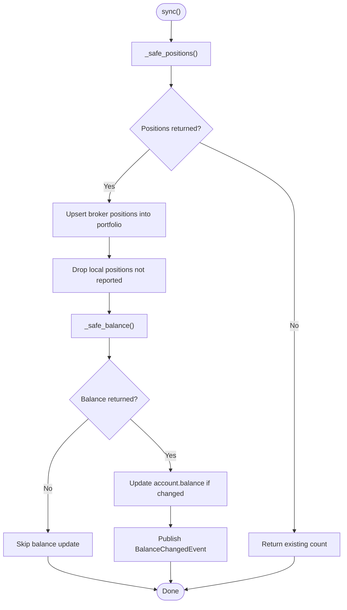

**Diagram sources**
- [position_sync.py:1-110](file://ntrade/engines/position_sync.py#L1-L110)

**Section sources**
- [position_sync.py:1-110](file://ntrade/engines/position_sync.py#L1-L110)

### PaperBroker: Order Book and Trade Book Retrieval
- Implements order placement, lifecycle, and retrieval of OrderBook and TradeBook.
- get_orderbook returns all stored orders as immutable OrderBookEntry tuples.
- get_trade_book returns completed orders as TradeBookEntry tuples.

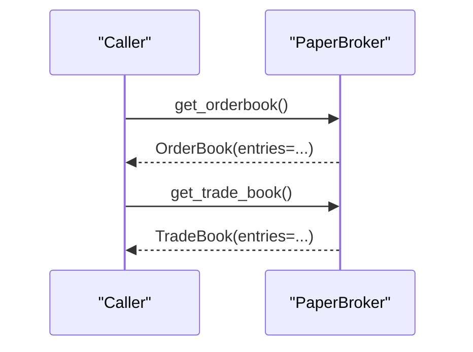

**Diagram sources**
- [paper_broker.py:1-216](file://ntrade/brokers/paper.py#L1-L216)
- [book.py:1-120](file://ntrade/domain/orders/book.py#L1-L120)

**Section sources**
- [paper_broker.py:1-216](file://ntrade/brokers/paper.py#L1-L216)
- [book.py:1-120](file://ntrade/domain/orders/book.py#L1-L120)

### Conceptual Overview
Conceptually, the order book represents open orders per instrument with statuses such as PENDING, PARTIALLY_FILLED, COMPLETED, REJECTED, CANCELLED. Partial fills incrementally increase filled_qty while leaving remaining quantity open until completion or cancellation. Each fill triggers position and balance updates, ensuring consistency across the portfolio read models.

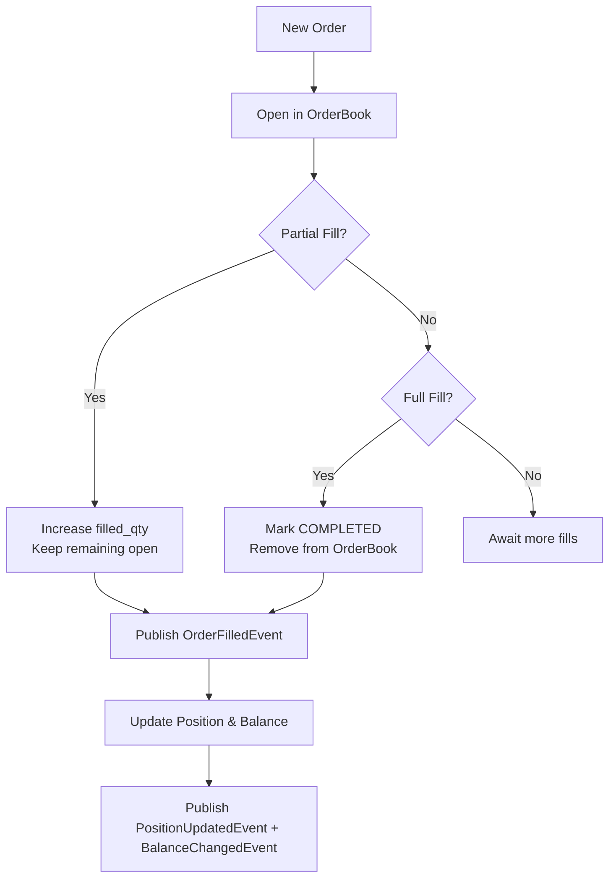

[No sources needed since this diagram shows conceptual workflow, not actual code structure]

## Dependency Analysis
The following diagram maps key dependencies among core modules involved in order book management and position tracking.

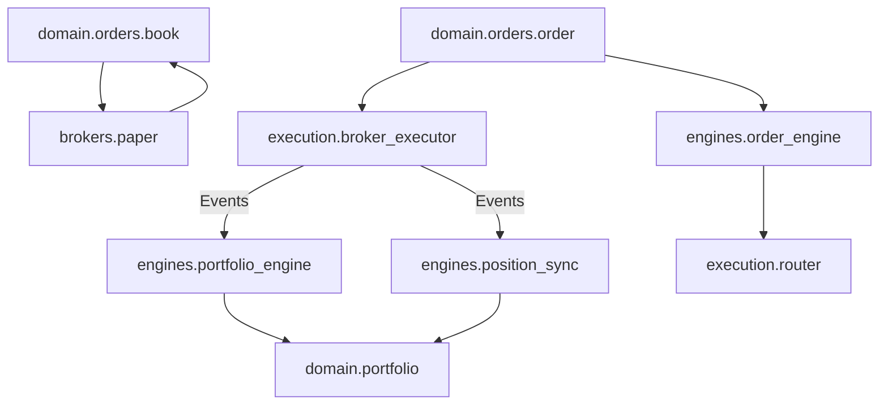

**Diagram sources**
- [book.py:1-120](file://ntrade/domain/orders/book.py#L1-L120)
- [order.py:1-173](file://ntrade/domain/orders/order.py#L1-L173)
- [portfolio.py:1-173](file://ntrade/domain/portfolio.py#L1-L173)
- [order_engine.py:1-34](file://ntrade/engines/order_engine.py#L1-L34)
- [position_sync.py:1-110](file://ntrade/engines/position_sync.py#L1-L110)
- [broker_executor.py:1-262](file://ntrade/execution/broker_executor.py#L1-L262)
- [router.py:1-49](file://ntrade/execution/router.py#L1-L49)
- [paper_broker.py:1-216](file://ntrade/brokers/paper.py#L1-L216)

**Section sources**
- [book.py:1-120](file://ntrade/domain/orders/book.py#L1-L120)
- [order.py:1-173](file://ntrade/domain/orders/order.py#L1-L173)
- [portfolio.py:1-173](file://ntrade/domain/portfolio.py#L1-L173)
- [order_engine.py:1-34](file://ntrade/engines/order_engine.py#L1-L34)
- [position_sync.py:1-110](file://ntrade/engines/position_sync.py#L1-L110)
- [broker_executor.py:1-262](file://ntrade/execution/broker_executor.py#L1-L262)
- [router.py:1-49](file://ntrade/execution/router.py#L1-L49)
- [paper_broker.py:1-216](file://ntrade/brokers/paper.py#L1-L216)

## Performance Considerations
- OrderBook and TradeBook are immutable tuples of dataclasses, enabling thread-safe reads and minimal overhead during iteration and filtering.
- Symbol filtering uses simple list comprehensions; for very large books, consider indexing by symbol in higher layers if frequent queries dominate.
- BrokerExecution maintains an in-memory open-order dictionary keyed by order_id, providing O(1) lookup for status polling and partial fill tracking.
- Polling frequency should be tuned to avoid excessive broker calls; stale detection evicts unresponsive orders after a threshold.
- PortfolioEngine updates are event-driven and localized per fill, minimizing contention and avoiding full scans except for position lookup by symbol.
- PaperBroker constructs OrderBook/TradeBook snapshots on demand; caching may be beneficial if repeated queries occur within short intervals.

[No sources needed since this section provides general guidance]

## Troubleshooting Guide
- No broker-backed instrument: Order submission returns OrderRejectedEvent when the instrument lacks a broker adapter.
- Missing order_id handling: If the broker returns a missing or invalid order_id, a unique fallback id is generated to prevent collisions.
- Stale orders: Excessive poll failures lead to eviction from the open-order tracker to free resources.
- Timeouts: PENDING orders older than a threshold trigger OrderTimeoutEvent for monitoring and remediation.
- Partial fill then cancellation/rejection: Only the remaining unfilled quantity is rejected; previously filled shares remain emitted.
- Transient broker errors: PositionSyncEngine preserves existing state on failure to avoid wiping positions or zeroing balances.

**Section sources**
- [broker_executor.py:1-262](file://ntrade/execution/broker_executor.py#L1-L262)
- [position_sync.py:1-110](file://ntrade/engines/position_sync.py#L1-L110)
- [order_events.py:1-91](file://ntrade/events/order.py#L1-L91)

## Conclusion
The system provides a robust, event-driven architecture for order book management and position tracking. Immutable domain models ensure safe data sharing, while the execution layer tracks open orders, handles partial fills, and reconciles broker state. Portfolio updates are consistent and incremental, driven by fills and periodic reconciliation. For large-scale deployments, careful tuning of polling, filtering strategies, and potential indexing can optimize performance.

[No sources needed since this section summarizes without analyzing specific files]