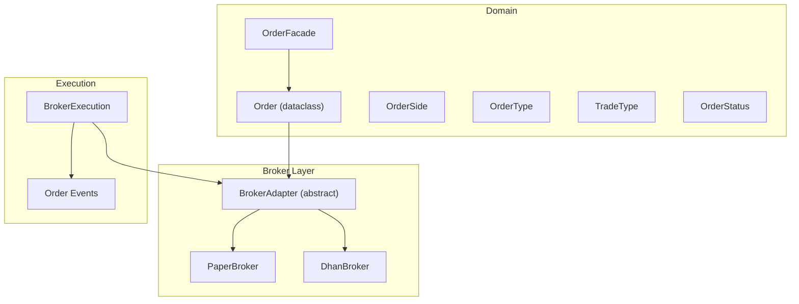
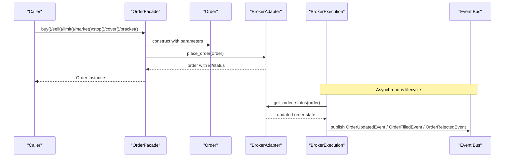
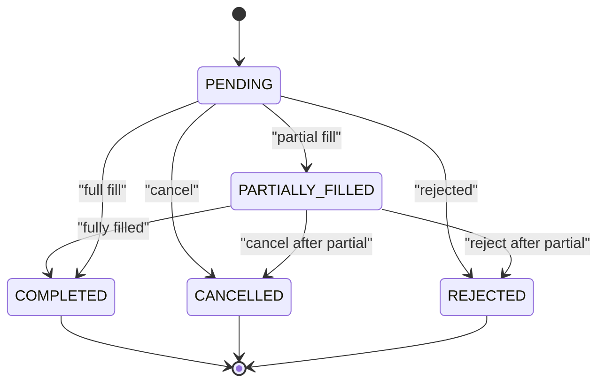
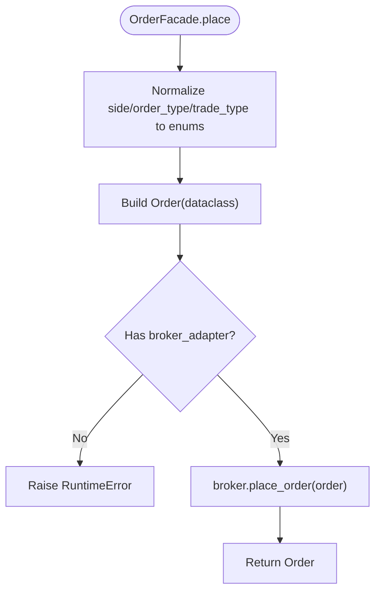
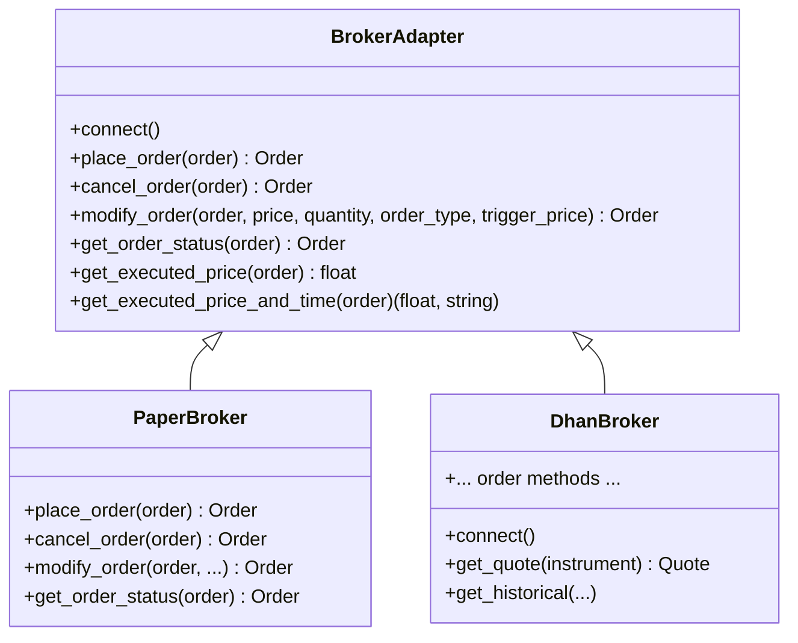
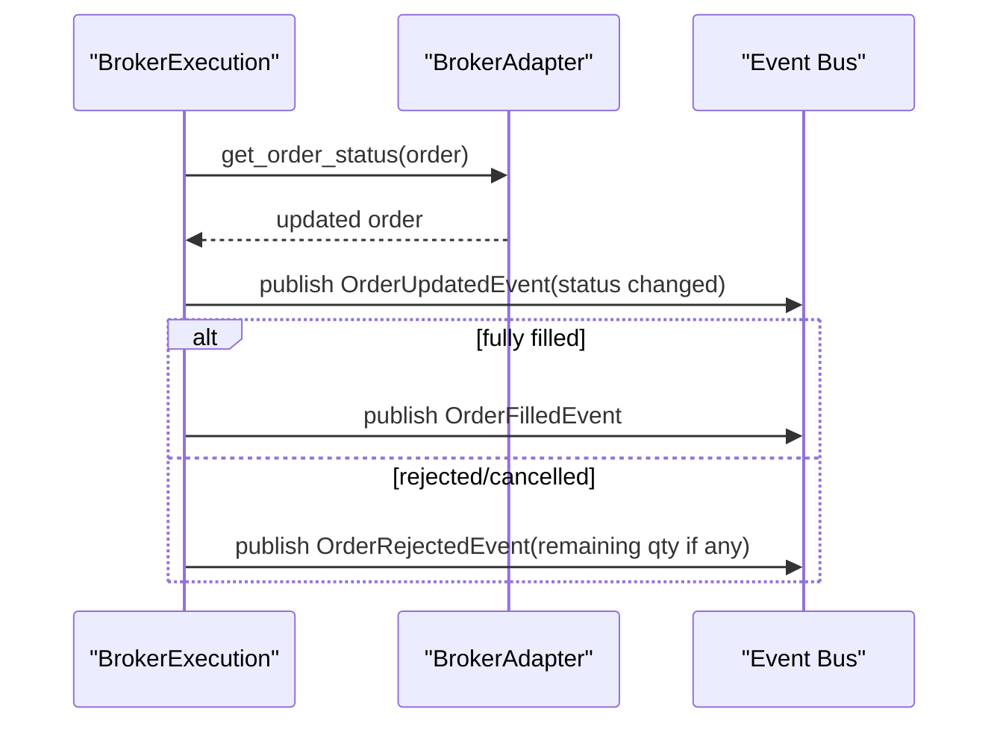
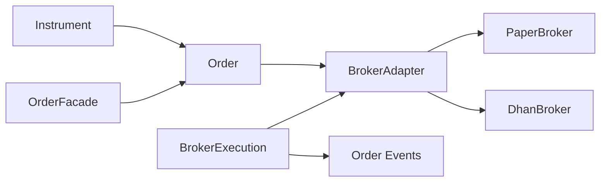

# Order Lifecycle Management

<cite>
**Referenced Files in This Document**
- [order.py](file://ntrade/domain/orders/order.py)
- [base.py](file://ntrade/brokers/base.py)
- [paper.py](file://ntrade/brokers/paper.py)
- [dhan.py](file://ntrade/brokers/dhan.py)
- [broker_executor.py](file://ntrade/execution/broker_executor.py)
- [order_events.py](file://ntrade/events/order.py)
- [test_orders.py](file://tests/test_orders.py)
</cite>

## Table of Contents
1. [Introduction](#introduction)
2. [Project Structure](#project-structure)
3. [Core Components](#core-components)
4. [Architecture Overview](#architecture-overview)
5. [Detailed Component Analysis](#detailed-component-analysis)
6. [Dependency Analysis](#dependency-analysis)
7. [Performance Considerations](#performance-considerations)
8. [Troubleshooting Guide](#troubleshooting-guide)
9. [Conclusion](#conclusion)

## Introduction
This document explains the Order class and its complete lifecycle management within the system. It covers the data model, enumerations, facade methods for order placement, and the broker-driven lifecycle transitions from submission to completion or cancellation. It also provides practical guidance on monitoring status, handling partial fills, modifying orders, and robust error handling patterns.

## Project Structure
The order domain is defined in a single module that exposes the core data model and facade. Broker adapters implement the transport boundary between the domain and live brokers. The execution layer orchestrates asynchronous order polling and event emission.

**Diagram sources**
- [order.py:14-173](file://ntrade/domain/orders/order.py#L14-L173)
- [base.py:25-163](file://ntrade/brokers/base.py#L25-L163)
- [paper.py:23-200](file://ntrade/brokers/paper.py#L23-L200)
- [dhan.py:54-200](file://ntrade/brokers/dhan.py#L54-L200)
- [broker_executor.py:46-200](file://ntrade/execution/broker_executor.py#L46-L200)
- [order_events.py:1-51](file://ntrade/events/order.py#L1-L51)

**Section sources**
- [order.py:1-173](file://ntrade/domain/orders/order.py#L1-L173)
- [base.py:1-163](file://ntrade/brokers/base.py#L1-L163)
- [paper.py:1-200](file://ntrade/brokers/paper.py#L1-L200)
- [dhan.py:1-200](file://ntrade/brokers/dhan.py#L1-L200)
- [broker_executor.py:1-200](file://ntrade/execution/broker_executor.py#L1-L200)
- [order_events.py:1-51](file://ntrade/events/order.py#L1-L51)

## Core Components
- Order dataclass fields: instrument, side, quantity, order_type, trade_type, price, trigger_price, target_price, stop_loss_price, order_id, status, filled_qty, avg_price, created_at.
- Enums:
  - OrderSide: BUY, SELL
  - OrderType: LIMIT, MARKET, STOP_LIMIT, STOP_MARKET, COVER, BRACKET
  - TradeType: MIS, CNC, MARGIN, MTF
  - OrderStatus: PENDING, COMPLETED, REJECTED, CANCELLED, PARTIALLY_FILLED
- OrderFacade methods: buy(), sell(), limit(), market(), stop(), cover(), bracket(), place()

These components provide a natural API for placing orders against an instrument while abstracting broker-specific details.

**Section sources**
- [order.py:14-173](file://ntrade/domain/orders/order.py#L14-L173)

## Architecture Overview
The OrderFacade constructs an Order and delegates placement to the instrument’s broker adapter. The BrokerExecution layer handles asynchronous order tracking, polling for updates, and publishing lifecycle events. Brokers implement the BrokerAdapter contract; PaperBroker simulates immediate fills, while DhanBroker integrates with a live trading service.

**Diagram sources**
- [order.py:118-173](file://ntrade/domain/orders/order.py#L118-L173)
- [base.py:96-122](file://ntrade/brokers/base.py#L96-L122)
- [paper.py:108-159](file://ntrade/brokers/paper.py#L108-L159)
- [broker_executor.py:58-169](file://ntrade/execution/broker_executor.py#L58-L169)
- [order_events.py:1-51](file://ntrade/events/order.py#L1-L51)

## Detailed Component Analysis

### Order Data Model and Status Transitions
- Fields:
  - instrument: linked Instrument object used to resolve broker adapter
  - side: OrderSide enum
  - quantity: int
  - order_type: OrderType enum
  - trade_type: TradeType enum
  - price: float (limit price)
  - trigger_price: float (stop trigger)
  - target_price: float (bracket target leg)
  - stop_loss_price: float (bracket stop leg)
  - order_id: str | None
  - status: OrderStatus enum
  - filled_qty: int
  - avg_price: float
  - created_at: datetime | None
- Properties:
  - is_open: True when status is PENDING or PARTIALLY_FILLED
  - is_filled: True when status is COMPLETED
- Lifecycle methods:
  - cancel(): calls broker.cancel_order(order)
  - modify(): calls broker.modify_order(order, ...)
  - refresh(): calls broker.get_order_status(order)
  - executed_price(): returns broker-reported average price or local avg_price
  - executed_price_and_time(): returns (price, time) tuple from broker or defaults

**Diagram sources**
- [order.py:35-67](file://ntrade/domain/orders/order.py#L35-L67)

**Section sources**
- [order.py:43-116](file://ntrade/domain/orders/order.py#L43-L116)

### OrderFacade Methods and Usage Patterns
- buy(quantity, price=0.0, order_type=LIMIT, trade_type=MIS, trigger_price=0.0)
- sell(quantity, price=0.0, order_type=LIMIT, trade_type=MIS, trigger_price=0.0)
- limit(side, quantity, price, **kw)
- market(side, quantity, **kw)
- stop(side, quantity, price, trigger_price, **kw)
- cover(side, quantity, price=0.0, trigger_price=0.0, **kw)
- bracket(side, quantity, price, target_price, stop_loss_price, **kw)
- place(side, quantity, order_type=LIMIT, trade_type=MIS, price=0.0, trigger_price=0.0, **kwargs)

Usage patterns:
- Construct an Order via a convenience method (buy/sell/limit/market/stop/cover/bracket).
- All methods normalize string inputs to enums and delegate to place().
- place() constructs the Order and invokes broker.place_order(order).

**Diagram sources**
- [order.py:156-173](file://ntrade/domain/orders/order.py#L156-L173)

**Section sources**
- [order.py:118-173](file://ntrade/domain/orders/order.py#L118-L173)

### BrokerAdapter Contract and Implementations
- Abstract methods and defaults:
  - place_order(order): required
  - cancel_order(order), modify_order(order, ...), get_order_status(order), get_executed_price(order), get_executed_price_and_time(order): optional with default behaviors
- PaperBroker:
  - place_order: instant fill for MARKET or uses provided price; sets COMPLETED immediately
  - cancel_order: marks open orders as CANCELLED
  - modify_order: updates stored order fields
  - get_order_status: syncs order fields from internal store
- DhanBroker:
  - Implements full broker integration; order placement and status retrieval follow SEBI rules and provider constraints

**Diagram sources**
- [base.py:25-163](file://ntrade/brokers/base.py#L25-L163)
- [paper.py:108-159](file://ntrade/brokers/paper.py#L108-L159)
- [dhan.py:54-200](file://ntrade/brokers/dhan.py#L54-L200)

**Section sources**
- [base.py:25-163](file://ntrade/brokers/base.py#L25-L163)
- [paper.py:108-159](file://ntrade/brokers/paper.py#L108-L159)
- [dhan.py:54-200](file://ntrade/brokers/dhan.py#L54-L200)

### Execution Layer and Event Emission
- BrokerExecution.submit(intent):
  - Builds Order via instrument.order.place(...)
  - Publishes OrderAcceptedEvent immediately
  - If synchronous fill (is_filled), emits fill event; otherwise tracks in _open
- BrokerExecution.poll():
  - Refreshes order status via broker.get_order_status(order)
  - Emits OrderUpdatedEvent on status changes
  - Emits OrderFilledEvent or OrderRejectedEvent based on final state
  - Handles timeouts and stale entries

**Diagram sources**
- [broker_executor.py:58-169](file://ntrade/execution/broker_executor.py#L58-L169)
- [order_events.py:1-51](file://ntrade/events/order.py#L1-L51)

**Section sources**
- [broker_executor.py:58-169](file://ntrade/execution/broker_executor.py#L58-L169)
- [order_events.py:1-51](file://ntrade/events/order.py#L1-L51)

### Examples and Best Practices
- Creating different order types:
  - Limit buy: use rel.order.buy(quantity, price)
  - Market sell: use rel.order.market(OrderSide.SELL, quantity)
  - Stop-limit: use rel.order.stop(OrderSide.SELL, quantity, price, trigger_price)
  - Cover: use rel.order.cover(OrderSide.SELL, quantity, price, trigger_price)
  - Bracket: use rel.order.bracket(OrderSide.BUY, quantity, price, target_price, stop_loss_price)
- Monitoring order status:
  - Use order.refresh() to pull latest status from broker
  - Observe OrderUpdatedEvent via the event bus for real-time updates
- Handling partial fills:
  - Check order.is_open and order.filled_qty vs order.quantity
  - On poll(), handle remaining quantities for rejection or further fills
- Managing modifications:
  - Use order.modify(price=..., quantity=..., order_type=..., trigger_price=...)
  - Ensure order is still open before modification
- Error handling:
  - RuntimeError raised if no broker adapter is present
  - Catch exceptions during broker calls and handle gracefully
  - Respect SEBI constraints (e.g., F&O market orders converted to LIMIT by DhanBroker)

**Section sources**
- [test_orders.py:9-90](file://tests/test_orders.py#L9-L90)
- [order.py:118-173](file://ntrade/domain/orders/order.py#L118-L173)
- [dhan.py:54-200](file://ntrade/brokers/dhan.py#L54-L200)

## Dependency Analysis
- Order depends on Instrument through the instrument field to access broker_adapter.
- OrderFacade depends on Order and Instrument to construct and place orders.
- BrokerAdapter defines the interface; PaperBroker and DhanBroker implement it.
- BrokerExecution depends on BrokerAdapter and publishes events to the bus.

**Diagram sources**
- [order.py:14-173](file://ntrade/domain/orders/order.py#L14-L173)
- [base.py:25-163](file://ntrade/brokers/base.py#L25-L163)
- [paper.py:23-200](file://ntrade/brokers/paper.py#L23-L200)
- [dhan.py:54-200](file://ntrade/brokers/dhan.py#L54-L200)
- [broker_executor.py:46-200](file://ntrade/execution/broker_executor.py#L46-L200)
- [order_events.py:1-51](file://ntrade/events/order.py#L1-L51)

**Section sources**
- [order.py:14-173](file://ntrade/domain/orders/order.py#L14-L173)
- [base.py:25-163](file://ntrade/brokers/base.py#L25-L163)
- [paper.py:23-200](file://ntrade/brokers/paper.py#L23-L200)
- [dhan.py:54-200](file://ntrade/brokers/dhan.py#L54-L200)
- [broker_executor.py:46-200](file://ntrade/execution/broker_executor.py#L46-L200)
- [order_events.py:1-51](file://ntrade/events/order.py#L1-L51)

## Performance Considerations
- Prefer using OrderFacade convenience methods to reduce boilerplate and ensure consistent normalization.
- Avoid frequent refresh() calls; batch status checks where possible.
- In live environments, rely on BrokerExecution.poll() for efficient status updates and event emission.
- For backtesting/paper trading, PaperBroker provides deterministic behavior without network latency.

[No sources needed since this section provides general guidance]

## Troubleshooting Guide
- RuntimeError when placing/modifying orders:
  - Occurs if the instrument has no broker_adapter configured. Ensure the instrument is created with a valid broker.
- Orders not filling:
  - Verify order_type and price settings; MARKET orders may require available liquidity.
  - For F&O instruments, DhanBroker converts MARKET to LIMIT per SEBI rules.
- Partial fills:
  - Monitor filled_qty and status; handle remaining quantities appropriately.
- Cancel/Modify failures:
  - Ensure the order is still open (PENDING or PARTIALLY_FILLED); terminal orders cannot be modified.
- Stale orders:
  - BrokerExecution.evicts orders after repeated status-refresh failures; re-check connectivity and broker availability.

**Section sources**
- [order.py:69-105](file://ntrade/domain/orders/order.py#L69-L105)
- [base.py:96-122](file://ntrade/brokers/base.py#L96-L122)
- [paper.py:121-159](file://ntrade/brokers/paper.py#L121-L159)
- [broker_executor.py:134-169](file://ntrade/execution/broker_executor.py#L134-L169)
- [test_orders.py:38-45](file://tests/test_orders.py#L38-L45)

## Conclusion
The Order class and OrderFacade provide a clean, extensible interface for order placement across multiple brokers. The BrokerAdapter abstraction ensures consistent behavior between paper and live environments, while BrokerExecution manages asynchronous lifecycle events. By following the documented patterns for order creation, monitoring, and error handling, developers can build robust trading systems with predictable order behavior.

[No sources needed since this section summarizes without analyzing specific files]