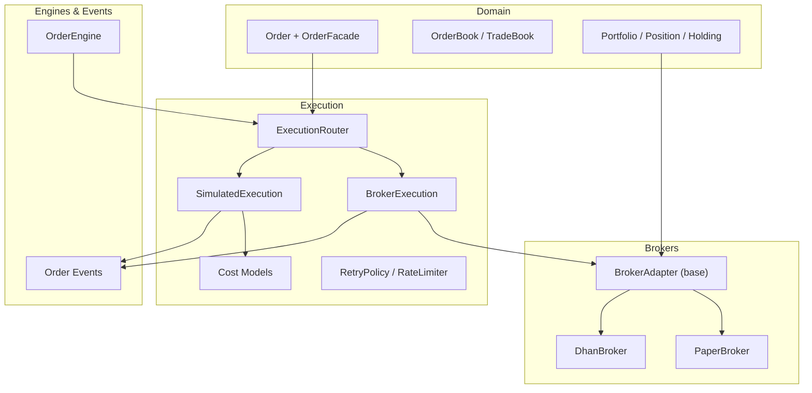
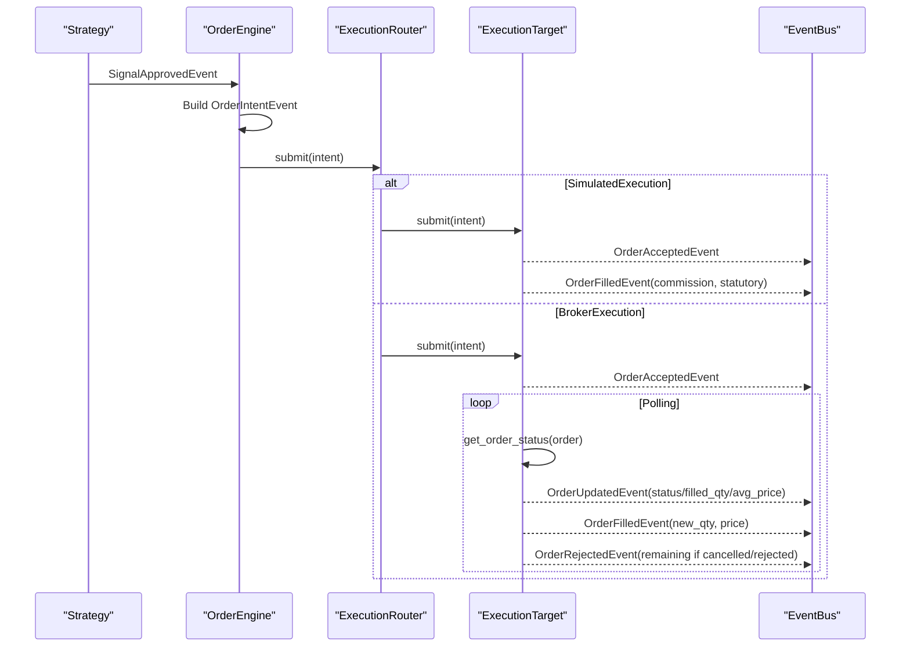
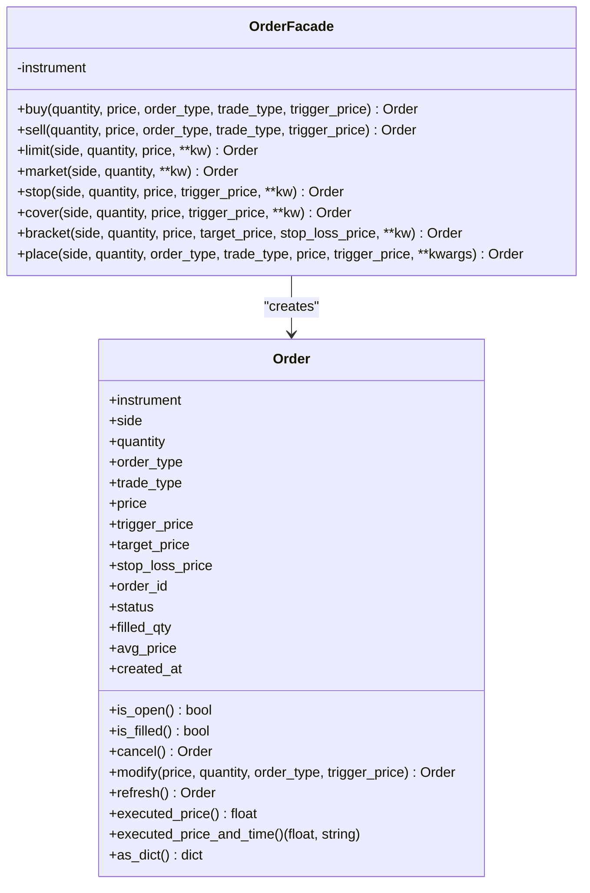
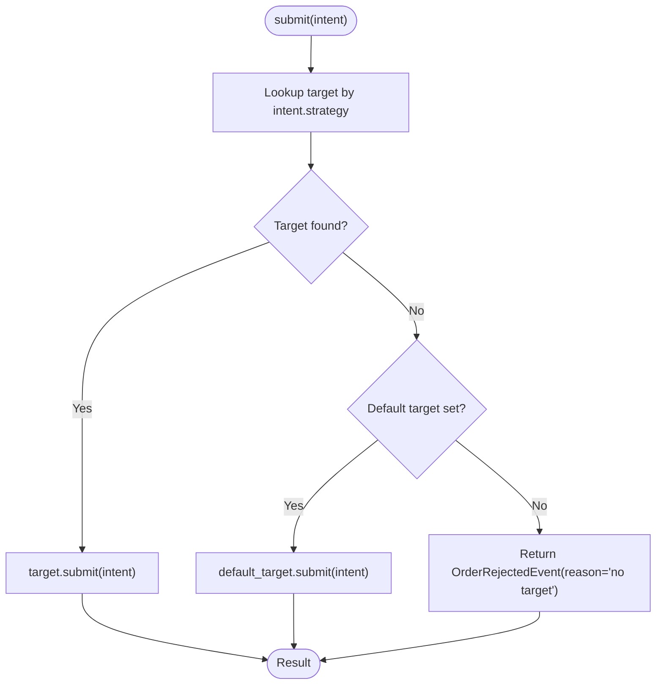
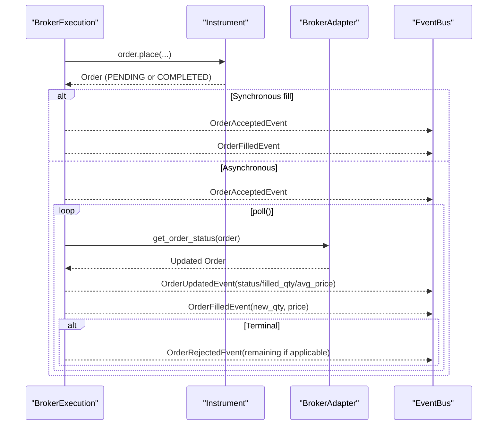
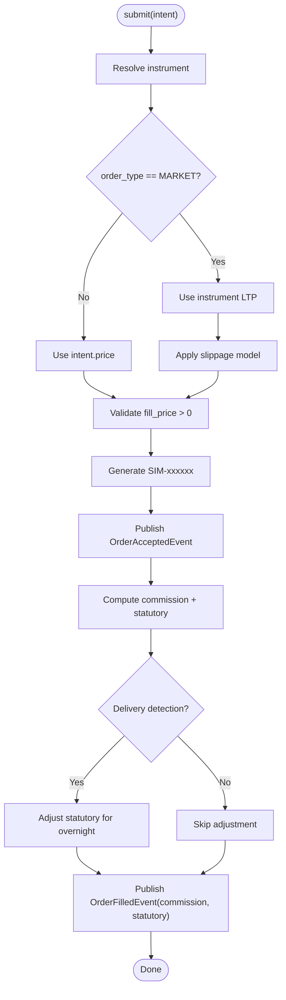
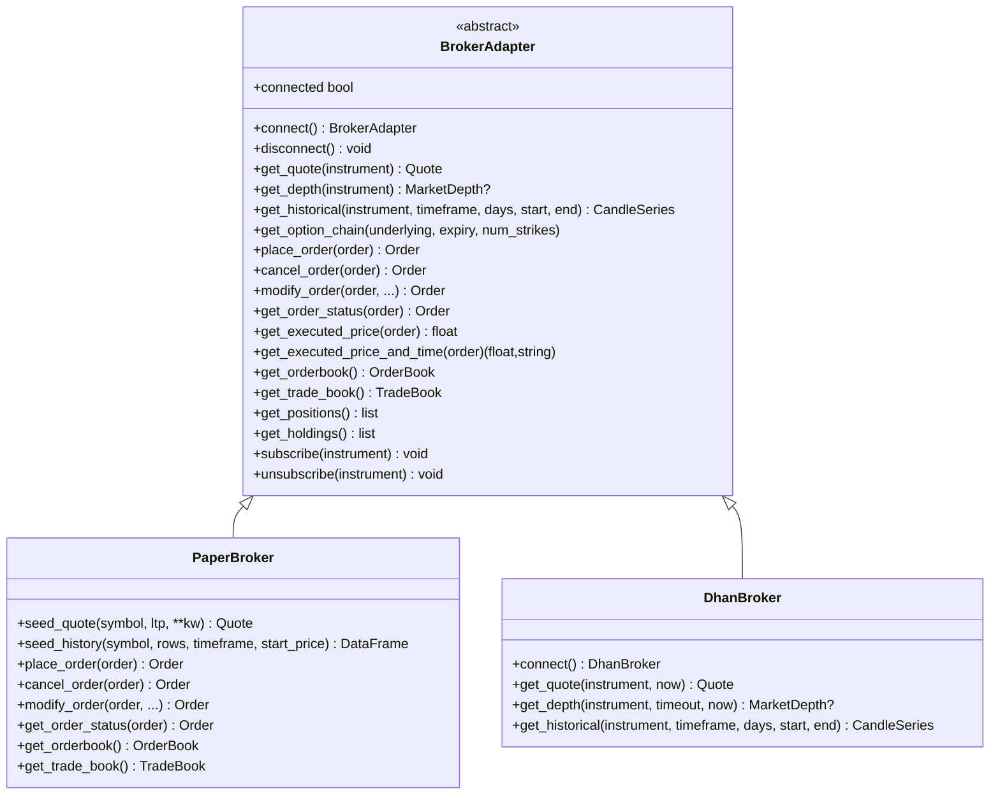
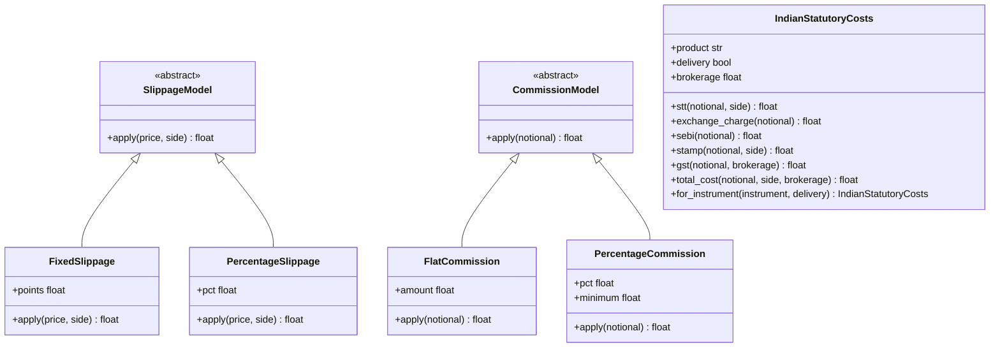
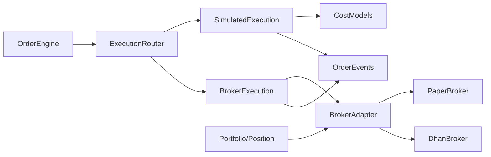

# Order Management

<cite>
**Referenced Files in This Document**
- [order.py](file://ntrade/domain/orders/order.py)
- [book.py](file://ntrade/domain/orders/book.py)
- [router.py](file://ntrade/execution/router.py)
- [broker_executor.py](file://ntrade/execution/broker_executor.py)
- [simulator.py](file://ntrade/execution/simulator.py)
- [costs.py](file://ntrade/execution/costs.py)
- [retry.py](file://ntrade/execution/retry.py)
- [base.py](file://ntrade/brokers/base.py)
- [paper.py](file://ntrade/brokers/paper.py)
- [dhan.py](file://ntrade/brokers/dhan.py)
- [portfolio.py](file://ntrade/domain/portfolio.py)
- [order_engine.py](file://ntrade/engines/order_engine.py)
- [order_events.py](file://ntrade/events/order.py)
</cite>

## Table of Contents
1. [Introduction](#introduction)
2. [Project Structure](#project-structure)
3. [Core Components](#core-components)
4. [Architecture Overview](#architecture-overview)
5. [Detailed Component Analysis](#detailed-component-analysis)
6. [Dependency Analysis](#dependency-analysis)
7. [Performance Considerations](#performance-considerations)
8. [Troubleshooting Guide](#troubleshooting-guide)
9. [Conclusion](#conclusion)

## Introduction
This document explains the order management and execution system with a focus on the Order lifecycle, supported order types, routing between simulated and live execution, cost modeling, retry mechanisms, and how orders relate to positions and portfolio updates. It is designed for both technical and non-technical readers, providing progressive explanations and diagrams that map directly to the codebase.

## Project Structure
The order management and execution subsystem spans several modules:
- Domain models for orders and books
- Execution targets (simulated vs broker)
- Broker adapters (paper and live brokers)
- Cost models and resilience utilities
- Event-driven orchestration via engines and events

**Diagram sources**
- [order.py:44-173](file://ntrade/domain/orders/order.py#L44-L173)
- [book.py:14-120](file://ntrade/domain/orders/book.py#L14-L120)
- [router.py:19-49](file://ntrade/execution/router.py#L19-L49)
- [broker_executor.py:46-262](file://ntrade/execution/broker_executor.py#L46-L262)
- [simulator.py:43-147](file://ntrade/execution/simulator.py#L43-L147)
- [costs.py:21-285](file://ntrade/execution/costs.py#L21-L285)
- [retry.py:19-98](file://ntrade/execution/retry.py#L19-L98)
- [base.py:25-163](file://ntrade/brokers/base.py#L25-L163)
- [paper.py:23-216](file://ntrade/brokers/paper.py#L23-L216)
- [dhan.py:54-200](file://ntrade/brokers/dhan.py#L54-L200)
- [order_engine.py:14-34](file://ntrade/engines/order_engine.py#L14-L34)
- [order_events.py:11-91](file://ntrade/events/order.py#L11-L91)

**Section sources**
- [order.py:44-173](file://ntrade/domain/orders/order.py#L44-L173)
- [router.py:19-49](file://ntrade/execution/router.py#L19-L49)
- [broker_executor.py:46-262](file://ntrade/execution/broker_executor.py#L46-L262)
- [simulator.py:43-147](file://ntrade/execution/simulator.py#L43-L147)
- [costs.py:21-285](file://ntrade/execution/costs.py#L21-L285)
- [retry.py:19-98](file://ntrade/execution/retry.py#L19-L98)
- [base.py:25-163](file://ntrade/brokers/base.py#L25-L163)
- [paper.py:23-216](file://ntrade/brokers/paper.py#L23-L216)
- [dhan.py:54-200](file://ntrade/brokers/dhan.py#L54-L200)
- [order_engine.py:14-34](file://ntrade/engines/order_engine.py#L14-L34)
- [order_events.py:11-91](file://ntrade/events/order.py#L11-L91)

## Core Components
- Order model and facade: rich dataclass representing an order with lifecycle helpers; facade provides natural entry points like buy/sell/market/limit/stop/cover/bracket.
- Order book and trade book: immutable value objects for open orders and executed trades.
- Execution router: selects an execution target by strategy or default.
- BrokerExecution: live execution with asynchronous placement and status polling; idempotent fill emission and timeout handling.
- SimulatedExecution: deterministic fills using instrument quotes, configurable slippage/commission/statutory costs, delivery detection.
- BrokerAdapter: abstract transport boundary for market data and order operations; implemented by PaperBroker and DhanBroker.
- Cost models: slippage, commission, and Indian statutory charges; futures carry costs.
- Retry and rate limiting: exponential backoff with jitter and token-bucket limiter.
- Order engine: materializes approved signals into order intents and routes them.
- Portfolio and positions: domain objects updated as fills occur.

**Section sources**
- [order.py:44-173](file://ntrade/domain/orders/order.py#L44-L173)
- [book.py:14-120](file://ntrade/domain/orders/book.py#L14-L120)
- [router.py:19-49](file://ntrade/execution/router.py#L19-L49)
- [broker_executor.py:46-262](file://ntrade/execution/broker_executor.py#L46-L262)
- [simulator.py:43-147](file://ntrade/execution/simulator.py#L43-L147)
- [costs.py:21-285](file://ntrade/execution/costs.py#L21-L285)
- [retry.py:19-98](file://ntrade/execution/retry.py#L19-L98)
- [order_engine.py:14-34](file://ntrade/engines/order_engine.py#L14-L34)
- [portfolio.py:19-173](file://ntrade/domain/portfolio.py#L19-L173)

## Architecture Overview
The system follows an event-driven pipeline:
- Strategy produces a signal; OrderEngine converts it to an OrderIntentEvent.
- ExecutionRouter dispatches the intent to either SimulatedExecution or BrokerExecution.
- SimulatedExecution publishes acceptance and immediate fills with costs applied.
- BrokerExecution places orders asynchronously, tracks open orders, polls for status, and emits fills and rejections as they occur.
- Brokers implement the BrokerAdapter interface; paper broker simulates instantly, while live broker integrates with external APIs.

**Diagram sources**
- [order_engine.py:14-34](file://ntrade/engines/order_engine.py#L14-L34)
- [router.py:19-49](file://ntrade/execution/router.py#L19-L49)
- [simulator.py:72-147](file://ntrade/execution/simulator.py#L72-L147)
- [broker_executor.py:58-169](file://ntrade/execution/broker_executor.py#L58-L169)
- [order_events.py:11-91](file://ntrade/events/order.py#L11-L91)

## Detailed Component Analysis

### Order Model and Lifecycle
- Data fields include side, quantity, type, trade_type, price, trigger/target/stop prices, identifiers, status, filled quantity, average price, and timestamps.
- Lifecycle methods delegate to the instrument’s broker adapter for cancel, modify, refresh, and executed price queries.
- OrderFacade provides fluent entry points: buy, sell, limit, market, stop, cover, bracket, and generic place.
- Open/filled flags simplify state checks.

**Diagram sources**
- [order.py:44-173](file://ntrade/domain/orders/order.py#L44-L173)

**Section sources**
- [order.py:44-173](file://ntrade/domain/orders/order.py#L44-L173)

### Supported Order Types and Routing
- OrderType supports LIMIT, MARKET, STOP_LIMIT, STOP_MARKET, COVER, BRACKET.
- Cover orders square a position with an attached stop; Bracket orders define entry plus target and stop legs.
- The router selects an execution target based on intent.strategy or falls back to a configured default.

**Diagram sources**
- [router.py:37-49](file://ntrade/execution/router.py#L37-L49)

**Section sources**
- [order.py:19-26](file://ntrade/domain/orders/order.py#L19-L26)
- [router.py:19-49](file://ntrade/execution/router.py#L19-L49)

### ExecutionRouter
- Maintains a registry of named targets and a default fallback.
- Delegates submission to the selected target; returns rejection events when no target is available.

**Section sources**
- [router.py:19-49](file://ntrade/execution/router.py#L19-L49)

### BrokerExecution (Live Trading)
- Places orders via the instrument’s broker adapter; immediately publishes acceptance.
- Tracks open orders with intent, order snapshot, cumulative filled quantity, last status, and placement time.
- Polling loop:
  - Refreshes order status; resets stale counter on success.
  - Emits OrderUpdatedEvent on status changes.
  - Emits partial-safe OrderFilledEvent for newly filled quantities.
  - Handles timeouts for long-pending orders.
  - On REJECTED/CANCELLED, emits remaining-rejection events if partially filled previously.
- Provides restore_open for crash recovery from persisted deltas.
- Offers modify/cancel for open orders.

**Diagram sources**
- [broker_executor.py:58-169](file://ntrade/execution/broker_executor.py#L58-L169)
- [order_events.py:11-91](file://ntrade/events/order.py#L11-L91)

**Section sources**
- [broker_executor.py:46-262](file://ntrade/execution/broker_executor.py#L46-L262)

### SimulatedExecution (Paper Trading and Backtesting)
- Deterministic fills against instrument quote state.
- For MARKET orders, uses LTP; applies slippage model; rejects if invalid price.
- Computes commission and statutory costs per fill; supports delivery detection for equity overnight exits.
- Publishes OrderAcceptedEvent followed immediately by OrderFilledEvent including commission and statutory fields.

**Diagram sources**
- [simulator.py:72-147](file://ntrade/execution/simulator.py#L72-L147)

**Section sources**
- [simulator.py:43-147](file://ntrade/execution/simulator.py#L43-L147)

### Broker Adapters (Paper and Live)
- BrokerAdapter defines the transport boundary for quotes, depth, history, options chains, and order lifecycle methods.
- PaperBroker implements instant fills, order tracking, order/trade books, and simple balance/PnL.
- DhanBroker integrates with external APIs, handles authentication, retries, and normalizes responses; enforces SEBI constraints (e.g., F&O market orders converted to LIMIT).

**Diagram sources**
- [base.py:25-163](file://ntrade/brokers/base.py#L25-L163)
- [paper.py:23-216](file://ntrade/brokers/paper.py#L23-L216)
- [dhan.py:54-200](file://ntrade/brokers/dhan.py#L54-L200)

**Section sources**
- [base.py:25-163](file://ntrade/brokers/base.py#L25-L163)
- [paper.py:23-216](file://ntrade/brokers/paper.py#L23-L216)
- [dhan.py:54-200](file://ntrade/brokers/dhan.py#L54-L200)

### Order Book Management
- OrderBook and TradeBook are immutable collections of entries with filtering and serialization helpers.
- PaperBroker exposes current open orders and executed trades through these structures.

**Section sources**
- [book.py:14-120](file://ntrade/domain/orders/book.py#L14-L120)
- [paper.py:161-188](file://ntrade/brokers/paper.py#L161-L188)

### Cost Modeling
- SlippageModel implementations: FixedSlippage, PercentageSlippage.
- CommissionModel implementations: FlatCommission, PercentageCommission.
- IndianStatutoryCosts models STT, exchange transaction charges, SEBI fee, GST, stamp duty; product-aware selection via for_instrument; total_cost aggregates all charges.
- FuturesCarryCosts models daily carry and roll costs for futures contracts.

**Diagram sources**
- [costs.py:21-205](file://ntrade/execution/costs.py#L21-L205)

**Section sources**
- [costs.py:21-285](file://ntrade/execution/costs.py#L21-L285)

### Retry Mechanisms and Idempotency
- RetryPolicy: exponential backoff with jitter; execute wraps flaky calls.
- RateLimiter: thread-safe token bucket to throttle API calls.
- Idempotent operations:
  - BrokerExecution._emit_fill computes new_qty since last poll to avoid duplicate fills.
  - BrokerExecution.restore_open rebuilds open-order tracker without re-emitting already-filled quantities.

**Section sources**
- [retry.py:19-98](file://ntrade/execution/retry.py#L19-L98)
- [broker_executor.py:241-262](file://ntrade/execution/broker_executor.py#L241-L262)
- [broker_executor.py:176-219](file://ntrade/execution/broker_executor.py#L176-L219)

### Relationship Between Orders, Positions, and Portfolio Updates
- Fills generate OrderFilledEvent; downstream consumers update positions and holdings accordingly.
- Portfolio and Account provide snapshots and refresh from broker; live PnL can be sourced from broker when available.

**Section sources**
- [order_events.py:50-64](file://ntrade/events/order.py#L50-L64)
- [portfolio.py:63-173](file://ntrade/domain/portfolio.py#L63-L173)

## Dependency Analysis
High-level dependencies among core components:

**Diagram sources**
- [order_engine.py:14-34](file://ntrade/engines/order_engine.py#L14-L34)
- [router.py:19-49](file://ntrade/execution/router.py#L19-L49)
- [simulator.py:43-147](file://ntrade/execution/simulator.py#L43-L147)
- [broker_executor.py:46-262](file://ntrade/execution/broker_executor.py#L46-L262)
- [base.py:25-163](file://ntrade/brokers/base.py#L25-L163)
- [paper.py:23-216](file://ntrade/brokers/paper.py#L23-L216)
- [dhan.py:54-200](file://ntrade/brokers/dhan.py#L54-L200)
- [order_events.py:11-91](file://ntrade/events/order.py#L11-L91)
- [portfolio.py:63-173](file://ntrade/domain/portfolio.py#L63-L173)

**Section sources**
- [order_engine.py:14-34](file://ntrade/engines/order_engine.py#L14-L34)
- [router.py:19-49](file://ntrade/execution/router.py#L19-L49)
- [simulator.py:43-147](file://ntrade/execution/simulator.py#L43-L147)
- [broker_executor.py:46-262](file://ntrade/execution/broker_executor.py#L46-L262)
- [base.py:25-163](file://ntrade/brokers/base.py#L25-L163)
- [paper.py:23-216](file://ntrade/brokers/paper.py#L23-L216)
- [dhan.py:54-200](file://ntrade/brokers/dhan.py#L54-L200)
- [order_events.py:11-91](file://ntrade/events/order.py#L11-L91)
- [portfolio.py:63-173](file://ntrade/domain/portfolio.py#L63-L173)

## Performance Considerations
- Asynchronous broker polling:
  - Stale detection avoids hanging on failed status refreshes; eviction prevents memory growth.
  - Timeout detection surfaces slow orders early.
- Deterministic simulation:
  - No network overhead; fills computed locally with configurable slippage and costs.
- Cost computation:
  - Statutory cost calculation is additive and per-fill; keep models lightweight.
- Retry and rate limiting:
  - Exponential backoff reduces load during outages; token bucket ensures compliance with API limits.
- Instrument resolution:
  - Avoid repeated lookups; cache instruments where appropriate in higher layers.

[No sources needed since this section provides general guidance]

## Troubleshooting Guide
Common issues and remedies:
- No execution target configured:
  - Ensure ExecutionRouter has a target registered for the strategy or a default target.
- Missing broker adapter on instrument:
  - Place/modify/cancel require a broker-backed instrument; attach a broker to the instrument.
- Invalid fill price:
  - SimulatedExecution rejects orders without valid price; ensure LTP availability for market orders.
- Repeated status refresh failures:
  - BrokerExecution evicts stale orders after threshold; investigate broker connectivity and error logs.
- Duplicate fills:
  - Verify idempotent emission logic; check cumulative filled tracking in BrokerExecution.
- F&O market order restrictions:
  - Live brokers may convert market orders to limit; validate order_type mapping.

**Section sources**
- [router.py:37-49](file://ntrade/execution/router.py#L37-L49)
- [order.py:69-91](file://ntrade/domain/orders/order.py#L69-L91)
- [simulator.py:80-96](file://ntrade/execution/simulator.py#L80-L96)
- [broker_executor.py:115-169](file://ntrade/execution/broker_executor.py#L115-L169)
- [dhan.py:54-200](file://ntrade/brokers/dhan.py#L54-L200)

## Conclusion
The order management and execution system provides a robust, zero-parity framework across simulated and live trading. Orders are modeled cleanly with lifecycle methods, routed flexibly, and executed deterministically or asynchronously depending on the target. Cost modeling aligns backtest results with live behavior, while resilience utilities ensure reliability under adverse conditions. Clear event flows and immutable book structures support transparent monitoring and debugging.

[No sources needed since this section summarizes without analyzing specific files]