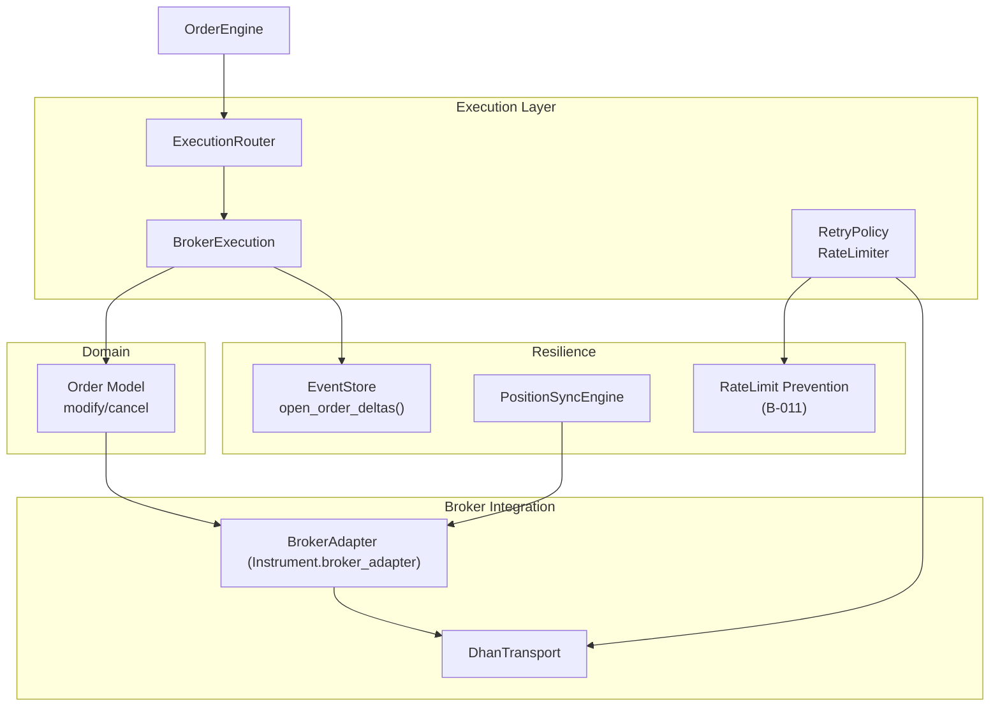
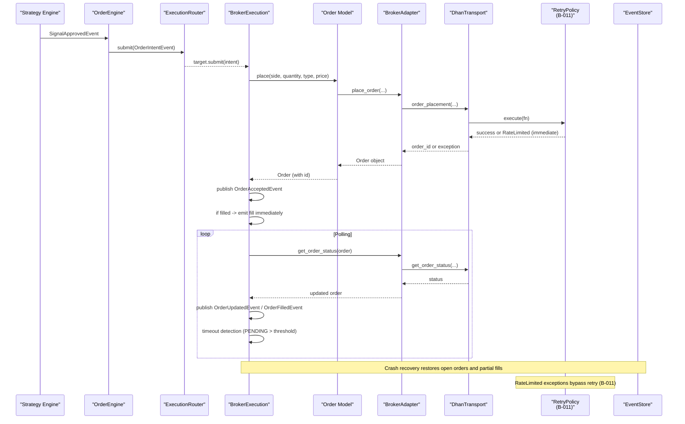
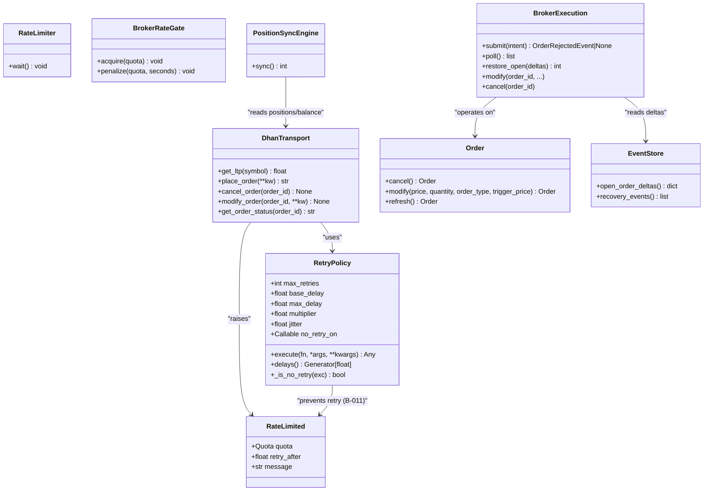

# Retry Logic & Idempotent Operations

<cite>
**Referenced Files in This Document**
- [retry.py](file://ntrade/execution/retry.py)
- [rate_limit.py](file://ntrade/execution/rate_limit.py)
- [broker_executor.py](file://ntrade/execution/broker_executor.py)
- [dhan_transport.py](file://ntrade/brokers/dhan_transport.py)
- [order_engine.py](file://ntrade/engines/order_engine.py)
- [router.py](file://ntrade/execution/router.py)
- [order.py](file://ntrade/domain/orders/order.py)
- [event_store.py](file://ntrade/storage/event_store.py)
- [position_sync.py](file://ntrade/engines/position_sync.py)
- [test_retry.py](file://tests/test_retry.py)
</cite>

## Update Summary
**Changes Made**
- Updated RetryPolicy section to document the new rate-limit prevention mechanism
- Added comprehensive coverage of RateLimited exception handling and B-011 implementation
- Enhanced error classification section with specific rate-limit failure scenarios
- Updated configuration examples to include no_retry_on parameter usage
- Added monitoring guidance for rate-limit detection and prevention

## Table of Contents
1. Introduction
2. Project Structure
3. Core Components
4. Architecture Overview
5. Detailed Component Analysis
6. Dependency Analysis
7. Performance Considerations
8. Troubleshooting Guide
9. Conclusion

## Introduction
This document explains how the system implements retry mechanisms and idempotent operation handling for order placement, modification, and cancellation. It focuses on:
- The retry policy used to handle transient failures in broker interactions while preventing rate-limit amplification
- How idempotency is ensured to prevent duplicate orders when network issues occur
- Configuration options for retries (attempts, delays, backoff, jitter, caps)
- Error classification and handling strategies for retryable vs non-retryable errors, including rate-limit failures
- Interaction between retries and order state management to maintain consistency
- Monitoring and best practices for designing resilient, idempotent operations in distributed trading systems

## Project Structure
The retry and idempotency features span several modules:
- Execution layer provides retry policies and rate limiting with built-in rate-limit prevention
- Broker execution orchestrates order lifecycle and ensures idempotent event emission
- Transport layer wraps broker API calls with retry and error normalization
- Order model exposes modify/cancel operations through the broker adapter
- Event store supports crash recovery and partial-fill persistence
- Position sync protects portfolio state from transient failures



**Diagram sources**
- [retry.py:1-128](file://ntrade/execution/retry.py#L1-L128)
- [rate_limit.py:1-147](file://ntrade/execution/rate_limit.py#L1-L147)
- [broker_executor.py:53-290](file://ntrade/execution/broker_executor.py#L53-L290)
- [dhan_transport.py:48-116](file://ntrade/brokers/dhan_transport.py#L48-L116)
- [order_engine.py:14-34](file://ntrade/engines/order_engine.py#L14-L34)
- [router.py:19-49](file://ntrade/execution/router.py#L19-L49)
- [order.py:69-91](file://ntrade/domain/orders/order.py#L69-L91)
- [event_store.py:137-181](file://ntrade/storage/event_store.py#L137-L181)
- [position_sync.py:22-110](file://ntrade/engines/position_sync.py#L22-L110)

**Section sources**
- [retry.py:1-128](file://ntrade/execution/retry.py#L1-L128)
- [rate_limit.py:1-147](file://ntrade/execution/rate_limit.py#L1-L147)
- [broker_executor.py:53-290](file://ntrade/execution/broker_executor.py#L53-L290)
- [dhan_transport.py:48-116](file://ntrade/brokers/dhan_transport.py#L48-L116)
- [order_engine.py:14-34](file://ntrade/engines/order_engine.py#L14-L34)
- [router.py:19-49](file://ntrade/execution/router.py#L19-L49)
- [order.py:69-91](file://ntrade/domain/orders/order.py#L69-L91)
- [event_store.py:137-181](file://ntrade/storage/event_store.py#L137-L181)
- [position_sync.py:22-110](file://ntrade/engines/position_sync.py#L22-L110)

## Core Components
- RetryPolicy: Configurable exponential backoff with jitter; used by transport for flaky endpoints with built-in rate-limit prevention
- RateLimiter: Thread-safe token-bucket limiter for controlling call rates
- DhanTransport: Wraps broker API calls; applies retry policy and raises explicit errors for critical failures
- BrokerExecution: Orchestrates order submission, polling, timeouts, and idempotent fill/update emissions
- Order Model: Exposes cancel/modify via broker adapter; integrates with execution flow
- EventStore: Persists events and reconstructs open-order deltas for crash recovery
- PositionSyncEngine: Safely reconciles positions and balance without wiping state on transient errors

Key responsibilities:
- Retry logic encapsulated in RetryPolicy and applied where appropriate (e.g., LTP fetch)
- **Rate-limit prevention (B-011)**: RetryPolicy never retries RateLimited exceptions to avoid quota amplification
- Idempotency enforced at execution layer via stable order IDs and deduplicated event emission
- Crash recovery uses persisted events to restore partial fills and open orders

**Section sources**
- [retry.py:31-87](file://ntrade/execution/retry.py#L31-L87)
- [rate_limit.py:50-74](file://ntrade/execution/rate_limit.py#L50-L74)
- [dhan_transport.py:80-116](file://ntrade/brokers/dhan_transport.py#L80-L116)
- [broker_executor.py:70-181](file://ntrade/execution/broker_executor.py#L70-L181)
- [order.py:69-91](file://ntrade/domain/orders/order.py#L69-L91)
- [event_store.py:137-181](file://ntrade/storage/event_store.py#L137-L181)
- [position_sync.py:28-80](file://ntrade/engines/position_sync.py#L28-L80)

## Architecture Overview
The order lifecycle integrates signal approval, intent routing, execution, and polling with resilience layers:



**Diagram sources**
- [order_engine.py:21-34](file://ntrade/engines/order_engine.py#L21-L34)
- [router.py:37-49](file://ntrade/execution/router.py#L37-L49)
- [broker_executor.py:70-181](file://ntrade/execution/broker_executor.py#L70-L181)
- [order.py:156-173](file://ntrade/domain/orders/order.py#L156-L173)
- [dhan_transport.py:276-290](file://ntrade/brokers/dhan_transport.py#L276-L290)
- [retry.py:62-80](file://ntrade/execution/retry.py#L62-L80)
- [event_store.py:137-181](file://ntrade/storage/event_store.py#L137-L181)

## Detailed Component Analysis

### RetryPolicy and RateLimiter
- RetryPolicy:
  - Exponential backoff with configurable base_delay, multiplier, max_delay, and jitter
  - execute(fn, *args, **kwargs) retries fn on any exception **except rate-limit failures** and re-raises the last exception after exhausting attempts
  - **B-011 Implementation**: RateLimited exceptions are immediately re-raised without retry attempts to prevent quota amplification
  - delays() yields per-attempt sleep durations clamped to non-negative values
  - **no_retry_on parameter**: Allows custom predicates to override default rate-limit behavior
- RateLimiter:
  - Token-bucket approach with thread-safe wait() enforcing a maximum calls_per_second

Configuration options:
- max_retries: number of attempts
- base_delay: initial delay seconds
- multiplier: exponential growth factor
- max_delay: cap on backoff
- jitter: randomization range to avoid thundering herd
- **no_retry_on**: Custom predicate for immediate exception re-raising (defaults to rate-limit detection)

Usage examples:
- Applied in DhanTransport.get_ltp to retry flaky market data calls
- Can be injected into transports or wrappers for other endpoints
- **Custom no_retry_on**: Override default behavior for specific error types

Error behavior:
- On exhaustion, the last exception is raised; callers must handle specific error types (e.g., BrokerDataError)
- **RateLimited exceptions bypass retry entirely** and propagate immediately

**Section sources**
- [retry.py:31-87](file://ntrade/execution/retry.py#L31-L87)
- [test_retry.py:67-116](file://tests/test_retry.py#L67-L116)

### Rate Limit Prevention (B-011)
- **Core Principle**: Never retry rate-limit failures (DH-904) as this amplifies quota exhaustion
- **Implementation**: RetryPolicy._is_no_retry() checks for rate-limit conditions before attempting retry
- **Detection**: Uses is_rate_limited() function to identify RateLimited exceptions and text-based patterns
- **Immediate Action**: RateLimited exceptions are re-raised on first attempt without any retry delay

Rate-limit detection methods:
- Direct RateLimited exception instances
- Text pattern matching for "DH-904", "rate_limit", "429", "too many requests"
- Custom no_retry_on predicates for specialized scenarios

Benefits:
- Prevents cascading failures during rate-limit events
- Reduces unnecessary network traffic during throttling
- Maintains system stability under load pressure

**Section sources**
- [retry.py:82-86](file://ntrade/execution/retry.py#L82-L86)
- [rate_limit.py:64-74](file://ntrade/execution/rate_limit.py#L64-L74)
- [test_retry.py:68-85](file://tests/test_retry.py#L68-L85)

### DhanTransport Retry Integration
- get_ltp:
  - Uses RetryPolicy.execute to wrap a function that fetches LTP and validates non-zero value
  - **B-011 Compliance**: RateLimited exceptions bypass retry and propagate immediately
  - Raises BrokerDataError on failure to prevent silent zeros corrupting downstream calculations
- Other endpoints:
  - Some return empty/zero on exceptions (non-critical), while order endpoints propagate errors consistently
  - All endpoints respect rate-limit prevention through consistent _invoke wrapper

Error classification:
- BrokerDataError: indicates critical failure after retries (e.g., zero LTP or network down)
- **RateLimited**: immediate propagation without retry (B-011)
- Non-critical endpoints may return None/empty structures instead of raising

Monitoring:
- Call counts and outcomes can be verified via tests and logs; ensure observability around retries
- **Rate-limit events**: Monitor for immediate exception propagation rather than retry attempts

**Section sources**
- [dhan_transport.py:119-146](file://ntrade/brokers/dhan_transport.py#L119-L146)
- [test_retry.py:225-300](file://tests/test_retry.py#L225-L300)

### BrokerExecution Idempotency and State Management
- Submission:
  - Places order via instrument.order.place; publishes OrderAcceptedEvent immediately
  - If synchronous fill occurs, emits fill event right away; otherwise tracks in _open map
- Polling:
  - Refreshes order status; publishes OrderUpdatedEvent on status changes
  - Emits partial fills only once (tracks already filled quantity)
  - Detects timeouts for PENDING orders beyond threshold and publishes OrderTimeoutEvent
  - Evicts stale entries after consecutive failures to avoid memory leaks
- Idempotency guarantees:
  - Stable order_id keys; fallback BRK- ids ensure uniqueness even if broker returns None
  - Partial fills are surfaced incrementally; later polls do not re-emit previously emitted quantities
  - Terminal states (COMPLETED, REJECTED, CANCELLED) remove entries and stop further emissions

Crash recovery:
- restore_open rebuilds _open from persisted deltas so partial fills and timeouts continue correctly
- open_order_deltas reconstructs per-order filled/remaining state from recorded events

**Section sources**
- [broker_executor.py:70-181](file://ntrade/execution/broker_executor.py#L70-L181)
- [broker_executor.py:188-231](file://ntrade/execution/broker_executor.py#L188-L231)
- [event_store.py:137-181](file://ntrade/storage/event_store.py#L137-L181)

### Order Model Modify/Cancel Flow
- cancel and modify delegate to the instrument's broker_adapter methods
- These operations rely on the same execution path and broker integration as placement
- Ensure idempotency by operating only on tracked open orders (via BrokerExecution._open)

Best practices:
- Validate order existence before modify/cancel
- Handle transient errors gracefully and propagate meaningful exceptions
- **Rate-limit awareness**: Respect immediate exception propagation for rate-limit scenarios

**Section sources**
- [order.py:69-91](file://ntrade/domain/orders/order.py#L69-L91)
- [broker_executor.py:234-251](file://ntrade/execution/broker_executor.py#L234-L251)

### PositionSyncEngine Failure Safety
- Reconciles broker-reported positions and balance into kernel read models
- On transient failures, keeps existing state rather than wiping it
- Publishes PositionUpdatedEvent and BalanceChangedEvent only on actual changes

Failure strategy:
- _safe_positions/_safe_balance catch exceptions and return None to preserve current state
- Ensures robustness against temporary broker connectivity issues

**Section sources**
- [position_sync.py:28-80](file://ntrade/engines/position_sync.py#L28-L80)
- [position_sync.py:88-102](file://ntrade/engines/position_sync.py#L88-L102)

### Retry Policy Configuration Examples
- Default policy:
  - max_retries=3, base_delay=0.2, max_delay=5.0, multiplier=2.0, jitter=0.1
  - **Automatic rate-limit prevention** via no_retry_on parameter
- Custom policy:
  - Increase max_retries for flaky endpoints; tune base_delay and max_delay for latency profiles
  - Use jitter to reduce synchronized retries across concurrent callers
  - **Custom no_retry_on**: Override default behavior for specific error types
- Application:
  - Inject RetryPolicy into DhanTransport constructor for consistent behavior

Configuration examples:
```python
# Default with automatic rate-limit prevention
policy = RetryPolicy(max_retries=3, base_delay=0.2)

# Custom with additional no-retry conditions
policy = RetryPolicy(
    max_retries=5, 
    base_delay=0.1,
    no_retry_on=lambda exc: isinstance(exc, (RateLimited, ValidationError))
)
```

**Section sources**
- [retry.py:31-58](file://ntrade/execution/retry.py#L31-L58)
- [test_retry.py:93-116](file://tests/test_retry.py#L93-L116)

### Error Classification and Handling Strategies
- Retryable errors:
  - Network timeouts, transient server errors, zero LTP values (wrapped and retried)
  - Handled by RetryPolicy.execute; on exhaustion, raise explicit error (e.g., BrokerDataError)
- **Non-retryable errors**:
  - **RateLimited exceptions**: Immediate propagation without retry (B-011)
  - Validation failures, missing broker adapters, configuration errors
  - Should be handled upstream (e.g., OrderEngine returning OrderRejectedEvent)
- Strategies:
  - Wrap flaky calls with RetryPolicy; surface distinct error types for observability
  - Avoid masking critical failures with silent defaults; prefer explicit exceptions
  - **Rate-limit handling**: Let RateLimited exceptions propagate immediately to prevent quota amplification

Error hierarchy:
- RateLimited (immediate propagation)
- BrokerDataError (after retry exhaustion)
- Other application-specific exceptions

**Section sources**
- [dhan_transport.py:40-101](file://ntrade/brokers/dhan_transport.py#L40-L101)
- [broker_executor.py:70-90](file://ntrade/execution/broker_executor.py#L70-L90)
- [order_engine.py:21-34](file://ntrade/engines/order_engine.py#L21-L34)
- [rate_limit.py:50-74](file://ntrade/execution/rate_limit.py#L50-L74)

### Monitoring Retry Attempts
- Logging:
  - BrokerExecution logs warnings for stale orders and timeouts
  - Fill events log details for traceability
  - **Rate-limit events**: Log immediate exception propagation for B-011 compliance
- Tests:
  - Verify retry behavior and sleep intervals using mocks
  - Assert call counts and exception propagation
  - **Rate-limit testing**: Confirm no retry attempts for RateLimited exceptions

Operational tips:
- Instrument retry boundaries with metrics (attempt count, latency, success/failure rates)
- Correlate OrderTimeoutEvent occurrences with backend health
- **Monitor rate-limit events**: Track frequency and response patterns for capacity planning
- **Alert on B-011 violations**: Alert if any retry attempts occur for rate-limit scenarios

**Section sources**
- [broker_executor.py:136-153](file://ntrade/execution/broker_executor.py#L136-L153)
- [test_retry.py:113-125](file://tests/test_retry.py#L113-L125)

## Dependency Analysis


**Diagram sources**
- [retry.py:31-87](file://ntrade/execution/retry.py#L31-L87)
- [rate_limit.py:50-74](file://ntrade/execution/rate_limit.py#L50-L74)
- [dhan_transport.py:80-116](file://ntrade/brokers/dhan_transport.py#L80-L116)
- [broker_executor.py:70-181](file://ntrade/execution/broker_executor.py#L70-L181)
- [order.py:69-91](file://ntrade/domain/orders/order.py#L69-L91)
- [event_store.py:137-181](file://ntrade/storage/event_store.py#L137-L181)
- [position_sync.py:28-80](file://ntrade/engines/position_sync.py#L28-L80)

**Section sources**
- [retry.py:31-87](file://ntrade/execution/retry.py#L31-L87)
- [rate_limit.py:50-74](file://ntrade/execution/rate_limit.py#L50-L74)
- [dhan_transport.py:80-116](file://ntrade/brokers/dhan_transport.py#L80-L116)
- [broker_executor.py:70-181](file://ntrade/execution/broker_executor.py#L70-L181)
- [order.py:69-91](file://ntrade/domain/orders/order.py#L69-L91)
- [event_store.py:137-181](file://ntrade/storage/event_store.py#L137-L181)
- [position_sync.py:28-80](file://ntrade/engines/position_sync.py#L28-L80)

## Performance Considerations
- Backoff tuning:
  - Adjust base_delay and max_delay to balance responsiveness and load reduction
  - Use jitter to avoid synchronized retries under high concurrency
  - **Rate-limit prevention**: Eliminates unnecessary retry attempts during throttling events
- Rate limiting:
  - Apply RateLimiter to throttle bursty workloads and respect broker quotas
  - **B-011 compliance**: Prevents retry storms that could amplify rate-limit situations
- Stale order eviction:
  - BrokerExecution evicts orders after repeated status-refresh failures to free memory
- Timeout thresholds:
  - Configure sensible timeouts for PENDING orders to detect stuck requests early
- Partial fill tracking:
  - Incremental fill emission avoids redundant processing and maintains idempotency

Performance benefits of B-011:
- **Reduced network overhead**: No retry attempts during rate-limit events
- **Faster failure detection**: Immediate propagation allows quicker error handling
- **System stability**: Prevents cascading failures during broker throttling

## Troubleshooting Guide
Common issues and resolutions:
- Zero LTP or flaky market data:
  - Ensure RetryPolicy is configured and BrokerDataError is handled appropriately
  - **Rate-limit scenarios**: Verify RateLimited exceptions propagate immediately without retry
- Duplicate fills or updates:
  - Verify BrokerExecution's partial-fill tracking and idempotent event emission
- Stuck orders:
  - Check timeout detection and stale eviction; investigate broker status refresh failures
- Crash recovery divergence:
  - Confirm EventStore.open_order_deltas matches BrokerExecution.restore_open expectations
- Portfolio state inconsistency:
  - Review PositionSyncEngine's failure safety; transient errors should not wipe state
- **Rate-limit amplification**:
  - Monitor for retry attempts on rate-limit scenarios (should not occur with B-011)
  - Investigate custom no_retry_on predicates that might interfere with rate-limit detection

Diagnostic steps:
- Inspect logs for warnings about stale orders and timeouts
- Use tests to validate retry behavior and sleep intervals
- Monitor OrderUpdatedEvent and OrderTimeoutEvent streams for anomalies
- **Rate-limit monitoring**: Track frequency of RateLimited exceptions and verify immediate propagation
- **B-011 validation**: Ensure no retry attempts occur for rate-limit scenarios

**Section sources**
- [broker_executor.py:136-153](file://ntrade/execution/broker_executor.py#L136-L153)
- [dhan_transport.py:119-146](file://ntrade/brokers/dhan_transport.py#L119-L146)
- [event_store.py:137-181](file://ntrade/storage/event_store.py#L137-L181)
- [position_sync.py:88-102](file://ntrade/engines/position_sync.py#L88-L102)
- [test_retry.py:68-85](file://tests/test_retry.py#L68-L85)

## Conclusion
The system implements robust retry mechanisms and idempotent operation handling across order placement, modification, and cancellation with enhanced rate-limit prevention. Key strengths include:
- Configurable exponential backoff with jitter via RetryPolicy
- **B-011 Implementation**: Automatic prevention of rate-limit retry amplification
- Explicit error classification and propagation (e.g., BrokerDataError, RateLimited)
- Idempotent event emission and partial-fill tracking in BrokerExecution
- Crash recovery using persisted events to restore open orders and partial fills
- Failure-safe position reconciliation to protect portfolio state

Best practices:
- Apply RetryPolicy selectively to flaky endpoints; avoid masking non-retryable errors
- **Rate-limit awareness**: Trust the built-in B-011 prevention; avoid custom overrides unless necessary
- Monitor retry attempts, timeouts, and rate-limit events for operational visibility
- Design operations to be idempotent by leveraging stable identifiers and incremental updates
- Ensure crash recovery paths align with in-memory state assumptions
- **Test rate-limit scenarios**: Verify immediate exception propagation without retry attempts

The B-011 enhancement significantly improves system resilience by preventing the common pitfall of retry storms during rate-limit events, ensuring stable operation under load pressure while maintaining full functionality for genuine transient failures.