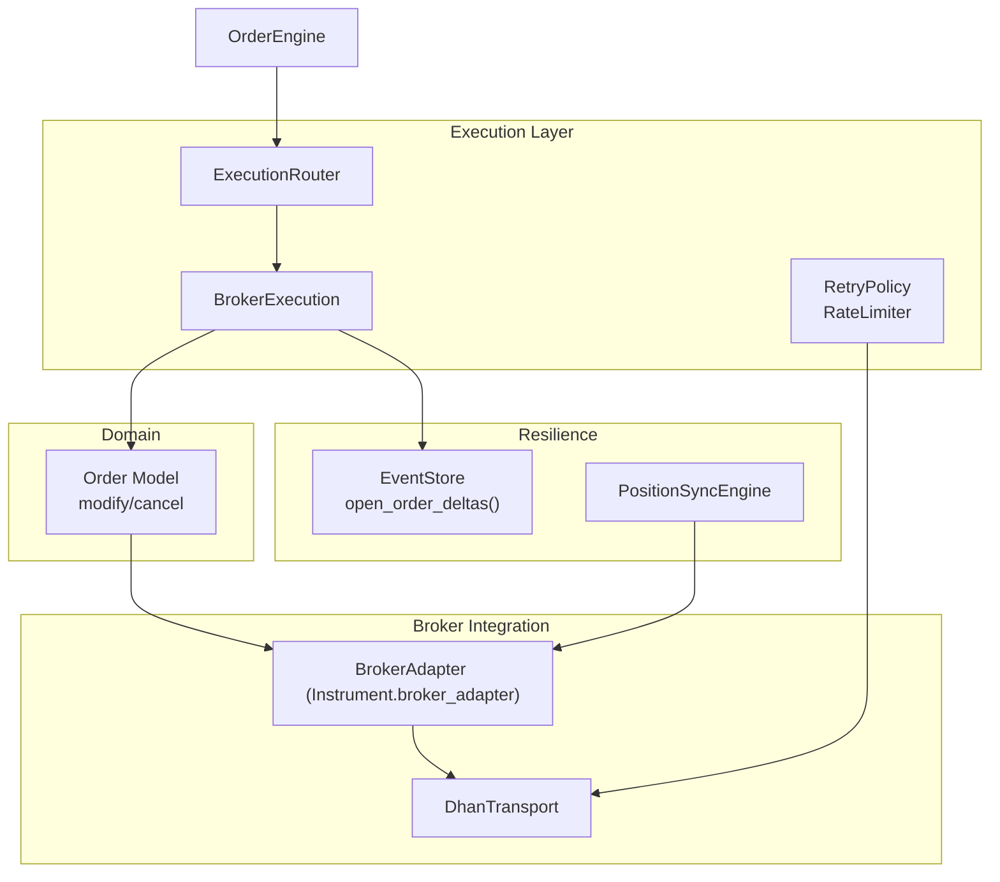
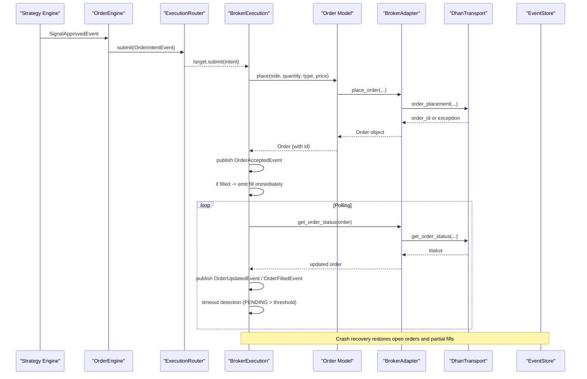
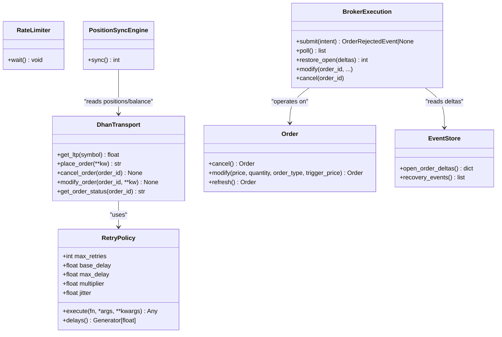

# Retry Logic & Idempotent Operations

<cite>
**Referenced Files in This Document**
- [retry.py](file://ntrade/execution/retry.py)
- [broker_executor.py](file://ntrade/execution/broker_executor.py)
- [dhan_transport.py](file://ntrade/brokers/dhan_transport.py)
- [order_engine.py](file://ntrade/engines/order_engine.py)
- [router.py](file://ntrade/execution/router.py)
- [order.py](file://ntrade/domain/orders/order.py)
- [event_store.py](file://ntrade/storage/event_store.py)
- [position_sync.py](file://ntrade/engines/position_sync.py)
- [test_retry.py](file://tests/test_retry.py)
</cite>

## Table of Contents
1. Introduction
2. Project Structure
3. Core Components
4. Architecture Overview
5. Detailed Component Analysis
6. Dependency Analysis
7. Performance Considerations
8. Troubleshooting Guide
9. Conclusion

## Introduction
This document explains how the system implements retry mechanisms and idempotent operation handling for order placement, modification, and cancellation. It focuses on:
- The retry policy used to handle transient failures in broker interactions
- How idempotency is ensured to prevent duplicate orders when network issues occur
- Configuration options for retries (attempts, delays, backoff, jitter, caps)
- Error classification and handling strategies for retryable vs non-retryable errors
- Interaction between retries and order state management to maintain consistency
- Monitoring and best practices for designing resilient, idempotent operations in distributed trading systems

## Project Structure
The retry and idempotency features span several modules:
- Execution layer provides retry policies and rate limiting
- Broker execution orchestrates order lifecycle and ensures idempotent event emission
- Transport layer wraps broker API calls with retry and error normalization
- Order model exposes modify/cancel operations through the broker adapter
- Event store supports crash recovery and partial-fill persistence
- Position sync protects portfolio state from transient failures

**Diagram sources**
- [retry.py:1-98](file://ntrade/execution/retry.py#L1-L98)
- [broker_executor.py:53-290](file://ntrade/execution/broker_executor.py#L53-L290)
- [dhan_transport.py:48-116](file://ntrade/brokers/dhan_transport.py#L48-L116)
- [order_engine.py:14-34](file://ntrade/engines/order_engine.py#L14-L34)
- [router.py:19-49](file://ntrade/execution/router.py#L19-L49)
- [order.py:69-91](file://ntrade/domain/orders/order.py#L69-L91)
- [event_store.py:137-181](file://ntrade/storage/event_store.py#L137-L181)
- [position_sync.py:22-110](file://ntrade/engines/position_sync.py#L22-L110)

**Section sources**
- [retry.py:1-98](file://ntrade/execution/retry.py#L1-L98)
- [broker_executor.py:53-290](file://ntrade/execution/broker_executor.py#L53-L290)
- [dhan_transport.py:48-116](file://ntrade/brokers/dhan_transport.py#L48-L116)
- [order_engine.py:14-34](file://ntrade/engines/order_engine.py#L14-L34)
- [router.py:19-49](file://ntrade/execution/router.py#L19-L49)
- [order.py:69-91](file://ntrade/domain/orders/order.py#L69-L91)
- [event_store.py:137-181](file://ntrade/storage/event_store.py#L137-L181)
- [position_sync.py:22-110](file://ntrade/engines/position_sync.py#L22-L110)

## Core Components
- RetryPolicy: Configurable exponential backoff with jitter; used by transport for flaky endpoints
- RateLimiter: Thread-safe token-bucket limiter for controlling call rates
- DhanTransport: Wraps broker API calls; applies retry policy and raises explicit errors for critical failures
- BrokerExecution: Orchestrates order submission, polling, timeouts, and idempotent fill/update emissions
- Order Model: Exposes cancel/modify via broker adapter; integrates with execution flow
- EventStore: Persists events and reconstructs open-order deltas for crash recovery
- PositionSyncEngine: Safely reconciles positions and balance without wiping state on transient errors

Key responsibilities:
- Retry logic encapsulated in RetryPolicy and applied where appropriate (e.g., LTP fetch)
- Idempotency enforced at execution layer via stable order IDs and deduplicated event emission
- Crash recovery uses persisted events to restore partial fills and open orders

**Section sources**
- [retry.py:19-68](file://ntrade/execution/retry.py#L19-L68)
- [dhan_transport.py:80-116](file://ntrade/brokers/dhan_transport.py#L80-L116)
- [broker_executor.py:70-181](file://ntrade/execution/broker_executor.py#L70-L181)
- [order.py:69-91](file://ntrade/domain/orders/order.py#L69-L91)
- [event_store.py:137-181](file://ntrade/storage/event_store.py#L137-L181)
- [position_sync.py:28-80](file://ntrade/engines/position_sync.py#L28-L80)

## Architecture Overview
The order lifecycle integrates signal approval, intent routing, execution, and polling with resilience layers:

**Diagram sources**
- [order_engine.py:21-34](file://ntrade/engines/order_engine.py#L21-L34)
- [router.py:37-49](file://ntrade/execution/router.py#L37-L49)
- [broker_executor.py:70-181](file://ntrade/execution/broker_executor.py#L70-L181)
- [order.py:156-173](file://ntrade/domain/orders/order.py#L156-L173)
- [dhan_transport.py:276-290](file://ntrade/brokers/dhan_transport.py#L276-L290)
- [event_store.py:137-181](file://ntrade/storage/event_store.py#L137-L181)

## Detailed Component Analysis

### RetryPolicy and RateLimiter
- RetryPolicy:
  - Exponential backoff with configurable base_delay, multiplier, max_delay, and jitter
  - execute(fn, *args, **kwargs) retries fn on any exception and re-raises the last exception after exhausting attempts
  - delays() yields per-attempt sleep durations clamped to non-negative values
- RateLimiter:
  - Token-bucket approach with thread-safe wait() enforcing a maximum calls_per_second

Configuration options:
- max_retries: number of attempts
- base_delay: initial delay seconds
- multiplier: exponential growth factor
- max_delay: cap on backoff
- jitter: randomization range to avoid thundering herd

Usage examples:
- Applied in DhanTransport.get_ltp to retry flaky market data calls
- Can be injected into transports or wrappers for other endpoints

Error behavior:
- On exhaustion, the last exception is raised; callers must handle specific error types (e.g., BrokerDataError)

**Section sources**
- [retry.py:19-68](file://ntrade/execution/retry.py#L19-L68)
- [test_retry.py:17-125](file://tests/test_retry.py#L17-L125)

### DhanTransport Retry Integration
- get_ltp:
  - Uses RetryPolicy.execute to wrap a function that fetches LTP and validates non-zero value
  - Raises BrokerDataError on failure to prevent silent zeros corrupting downstream calculations
- Other endpoints:
  - Some return empty/zero on exceptions (non-critical), while order endpoints propagate errors consistently

Error classification:
- BrokerDataError: indicates critical failure after retries (e.g., zero LTP or network down)
- Non-critical endpoints may return None/empty structures instead of raising

Monitoring:
- Call counts and outcomes can be verified via tests and logs; ensure observability around retries

**Section sources**
- [dhan_transport.py:80-116](file://ntrade/brokers/dhan_transport.py#L80-L116)
- [test_retry.py:175-238](file://tests/test_retry.py#L175-L238)

### BrokerExecution Idempotency and State Management
- Submission:
  - Places order via instrument.order.place; publishes OrderAcceptedEvent immediately
  - If synchronous fill occurs, emits fill event right away; otherwise tracks in _open map
- Polling:
  - Refreshes order status; publishes OrderUpdatedEvent on status changes
  - Emits partial fills only once (tracks already filled quantity)
  - Detects timeouts for PENDING orders beyond threshold and publishes OrderTimeoutEvent
  - Evicts stale entries after consecutive failures to avoid memory leaks
- Idempotency guarantees:
  - Stable order_id keys; fallback BRK- ids ensure uniqueness even if broker returns None
  - Partial fills are surfaced incrementally; later polls do not re-emit previously emitted quantities
  - Terminal states (COMPLETED, REJECTED, CANCELLED) remove entries and stop further emissions

Crash recovery:
- restore_open rebuilds _open from persisted deltas so partial fills and timeouts continue correctly
- open_order_deltas reconstructs per-order filled/remaining state from recorded events

**Section sources**
- [broker_executor.py:70-181](file://ntrade/execution/broker_executor.py#L70-L181)
- [broker_executor.py:188-231](file://ntrade/execution/broker_executor.py#L188-L231)
- [event_store.py:137-181](file://ntrade/storage/event_store.py#L137-L181)

### Order Model Modify/Cancel Flow
- cancel and modify delegate to the instrument’s broker_adapter methods
- These operations rely on the same execution path and broker integration as placement
- Ensure idempotency by operating only on tracked open orders (via BrokerExecution._open)

Best practices:
- Validate order existence before modify/cancel
- Handle transient errors gracefully and propagate meaningful exceptions

**Section sources**
- [order.py:69-91](file://ntrade/domain/orders/order.py#L69-L91)
- [broker_executor.py:234-251](file://ntrade/execution/broker_executor.py#L234-L251)

### PositionSyncEngine Failure Safety
- Reconciles broker-reported positions and balance into kernel read models
- On transient failures, keeps existing state rather than wiping it
- Publishes PositionUpdatedEvent and BalanceChangedEvent only on actual changes

Failure strategy:
- _safe_positions/_safe_balance catch exceptions and return None to preserve current state
- Ensures robustness against temporary broker connectivity issues

**Section sources**
- [position_sync.py:28-80](file://ntrade/engines/position_sync.py#L28-L80)
- [position_sync.py:88-102](file://ntrade/engines/position_sync.py#L88-L102)

### Retry Policy Configuration Examples
- Default policy:
  - max_retries=3, base_delay=0.2, max_delay=5.0, multiplier=2.0, jitter=0.1
- Custom policy:
  - Increase max_retries for flaky endpoints; tune base_delay and max_delay for latency profiles
  - Use jitter to reduce synchronized retries across concurrent callers
- Application:
  - Inject RetryPolicy into DhanTransport constructor for consistent behavior

**Section sources**
- [retry.py:33-37](file://ntrade/execution/retry.py#L33-L37)
- [test_retry.py:175-193](file://tests/test_retry.py#L175-L193)

### Error Classification and Handling Strategies
- Retryable errors:
  - Network timeouts, transient server errors, zero LTP values (wrapped and retried)
  - Handled by RetryPolicy.execute; on exhaustion, raise explicit error (e.g., BrokerDataError)
- Non-retryable errors:
  - Validation failures, missing broker adapters, configuration errors
  - Should be handled upstream (e.g., OrderEngine returning OrderRejectedEvent)
- Strategies:
  - Wrap flaky calls with RetryPolicy; surface distinct error types for observability
  - Avoid masking critical failures with silent defaults; prefer explicit exceptions

**Section sources**
- [dhan_transport.py:40-101](file://ntrade/brokers/dhan_transport.py#L40-L101)
- [broker_executor.py:70-90](file://ntrade/execution/broker_executor.py#L70-L90)
- [order_engine.py:21-34](file://ntrade/engines/order_engine.py#L21-L34)

### Monitoring Retry Attempts
- Logging:
  - BrokerExecution logs warnings for stale orders and timeouts
  - Fill events log details for traceability
- Tests:
  - Verify retry behavior and sleep intervals using mocks
  - Assert call counts and exception propagation

Operational tips:
- Instrument retry boundaries with metrics (attempt count, latency, success/failure rates)
- Correlate OrderTimeoutEvent occurrences with backend health

**Section sources**
- [broker_executor.py:136-153](file://ntrade/execution/broker_executor.py#L136-L153)
- [test_retry.py:113-125](file://tests/test_retry.py#L113-L125)

## Dependency Analysis

**Diagram sources**
- [retry.py:19-68](file://ntrade/execution/retry.py#L19-L68)
- [dhan_transport.py:80-116](file://ntrade/brokers/dhan_transport.py#L80-L116)
- [broker_executor.py:70-181](file://ntrade/execution/broker_executor.py#L70-L181)
- [order.py:69-91](file://ntrade/domain/orders/order.py#L69-L91)
- [event_store.py:137-181](file://ntrade/storage/event_store.py#L137-L181)
- [position_sync.py:28-80](file://ntrade/engines/position_sync.py#L28-L80)

**Section sources**
- [retry.py:19-68](file://ntrade/execution/retry.py#L19-L68)
- [dhan_transport.py:80-116](file://ntrade/brokers/dhan_transport.py#L80-L116)
- [broker_executor.py:70-181](file://ntrade/execution/broker_executor.py#L70-L181)
- [order.py:69-91](file://ntrade/domain/orders/order.py#L69-L91)
- [event_store.py:137-181](file://ntrade/storage/event_store.py#L137-L181)
- [position_sync.py:28-80](file://ntrade/engines/position_sync.py#L28-L80)

## Performance Considerations
- Backoff tuning:
  - Adjust base_delay and max_delay to balance responsiveness and load reduction
  - Use jitter to avoid synchronized retries under high concurrency
- Rate limiting:
  - Apply RateLimiter to throttle bursty workloads and respect broker quotas
- Stale order eviction:
  - BrokerExecution evicts orders after repeated status-refresh failures to free memory
- Timeout thresholds:
  - Configure sensible timeouts for PENDING orders to detect stuck requests early
- Partial fill tracking:
  - Incremental fill emission avoids redundant processing and maintains idempotency

[No sources needed since this section provides general guidance]

## Troubleshooting Guide
Common issues and resolutions:
- Zero LTP or flaky market data:
  - Ensure RetryPolicy is configured and BrokerDataError is handled appropriately
- Duplicate fills or updates:
  - Verify BrokerExecution’s partial-fill tracking and idempotent event emission
- Stuck orders:
  - Check timeout detection and stale eviction; investigate broker status refresh failures
- Crash recovery divergence:
  - Confirm EventStore.open_order_deltas matches BrokerExecution.restore_open expectations
- Portfolio state inconsistency:
  - Review PositionSyncEngine’s failure safety; transient errors should not wipe state

Diagnostic steps:
- Inspect logs for warnings about stale orders and timeouts
- Use tests to validate retry behavior and sleep intervals
- Monitor OrderUpdatedEvent and OrderTimeoutEvent streams for anomalies

**Section sources**
- [broker_executor.py:136-153](file://ntrade/execution/broker_executor.py#L136-L153)
- [dhan_transport.py:80-116](file://ntrade/brokers/dhan_transport.py#L80-L116)
- [event_store.py:137-181](file://ntrade/storage/event_store.py#L137-L181)
- [position_sync.py:88-102](file://ntrade/engines/position_sync.py#L88-L102)

## Conclusion
The system implements robust retry mechanisms and idempotent operation handling across order placement, modification, and cancellation. Key strengths include:
- Configurable exponential backoff with jitter via RetryPolicy
- Explicit error classification and propagation (e.g., BrokerDataError)
- Idempotent event emission and partial-fill tracking in BrokerExecution
- Crash recovery using persisted events to restore open orders and partial fills
- Failure-safe position reconciliation to protect portfolio state

Best practices:
- Apply RetryPolicy selectively to flaky endpoints; avoid masking non-retryable errors
- Monitor retry attempts, timeouts, and stale orders for operational visibility
- Design operations to be idempotent by leveraging stable identifiers and incremental updates
- Ensure crash recovery paths align with in-memory state assumptions

[No sources needed since this section summarizes without analyzing specific files]