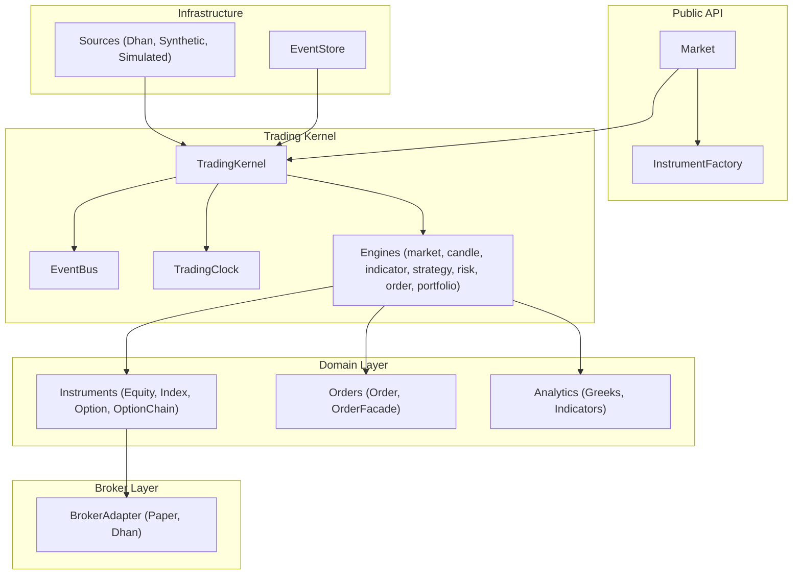
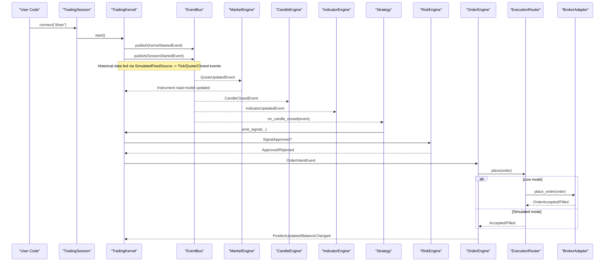
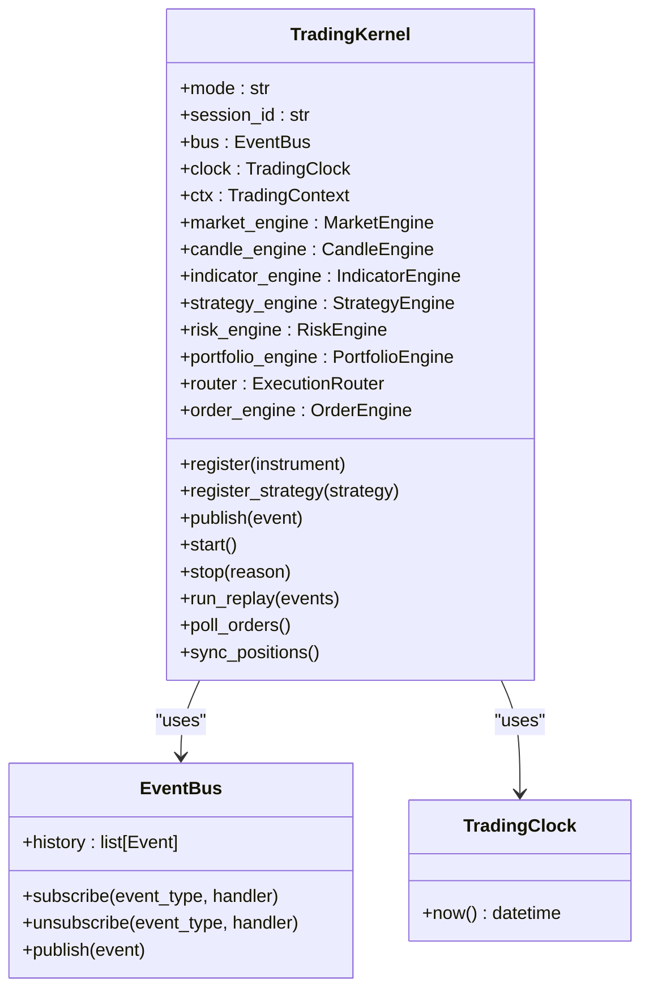
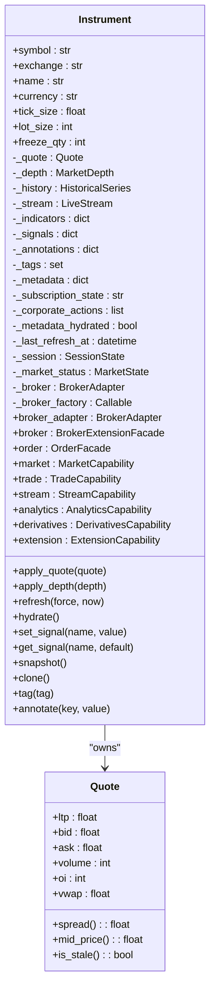
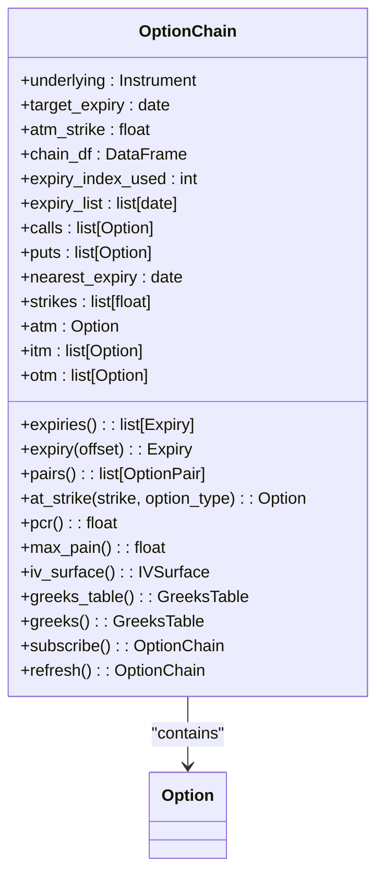
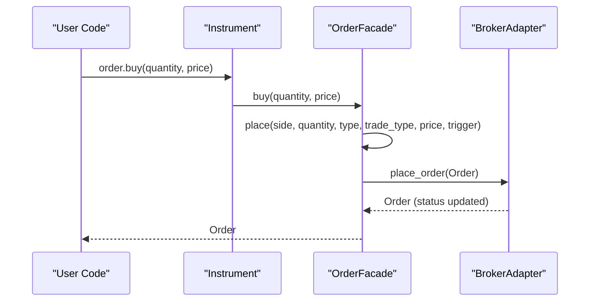
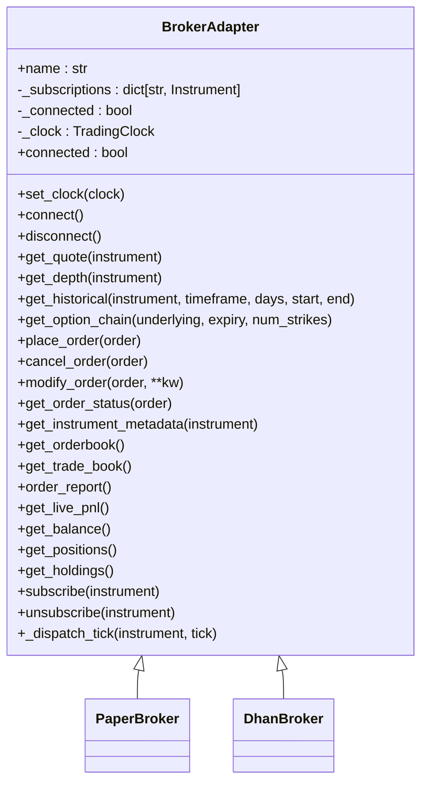
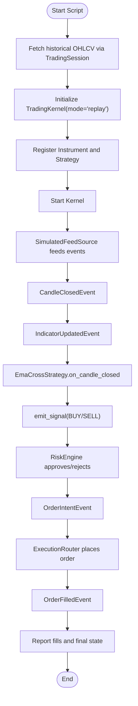
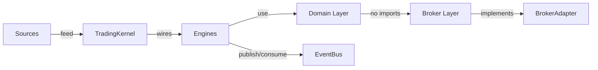

# Project Overview

<cite>
**Referenced Files in This Document**
- [ntrade/__init__.py](file://ntrade/__init__.py)
- [ARCHITECTURE.md](file://ARCHITECTURE.md)
- [ntrade/facade.py](file://ntrade/facade.py)
- [ntrade/kernel/trading_session.py](file://ntrade/kernel/trading_session.py)
- [ntrade/kernel/session.py](file://ntrade/kernel/session.py)
- [ntrade/events/base.py](file://ntrade/events/base.py)
- [ntrade/brokers/base.py](file://ntrade/brokers/base.py)
- [ntrade/domain/instruments/base.py](file://ntrade/domain/instruments/base.py)
- [ntrade/domain/instruments/chain.py](file://ntrade/domain/instruments/chain.py)
- [ntrade/domain/orders/order.py](file://ntrade/domain/orders/order.py)
- [scripts/ema_cross_run.py](file://scripts/ema_cross_run.py)
- [ntrade/engines/strategies.py](file://ntrade/engines/strategies.py)
- [ntrade/kernel/event_bus.py](file://ntrade/kernel/event_bus.py)
</cite>

## Table of Contents
1. [Introduction](#introduction)
2. [Project Structure](#project-structure)
3. [Core Components](#core-components)
4. [Architecture Overview](#architecture-overview)
5. [Detailed Component Analysis](#detailed-component-analysis)
6. [Dependency Analysis](#dependency-analysis)
7. [Performance Considerations](#performance-considerations)
8. [Troubleshooting Guide](#troubleshooting-guide)
9. [Conclusion](#conclusion)
10. [Appendices](#appendices)

## Introduction
nTrade is an institutional-grade, object-oriented trading framework where every financial entity is a rich domain object. The core philosophy is to abstract away broker APIs, websockets, and JSON payloads behind clean interfaces so that users interact with instruments, quotes, orders, and portfolios rather than transport details. The target audience includes algorithmic traders, quantitative developers, and financial institutions who need robust, event-driven systems with zero-parity testing across live, replay, and backtest modes.

Key benefits:
- Zero-parity testing across live/replay/backtest modes using the same kernel and events
- Event-driven architecture with a canonical event model and EventBus
- Rich domain modeling for instruments (Equity, Index, Option, OptionChain), analytics (Greeks, indicators), and orders
- Simple API surface for accessing quotes, creating option chains, and placing orders
- Extensible broker adapter pattern to hide transport complexity

This document provides both conceptual overviews for beginners and technical details for experienced developers, using terminology consistent with the codebase such as TradingKernel, Instrument, BrokerAdapter, and EventBus.

## Project Structure
At a high level, nTrade organizes functionality into layers:
- Public API facade and factories
- Trading kernel (event-centric, zero parity)
- Domain layer (pure Python, no broker imports)
- Broker adapters (hidden behind domain objects)
- Infrastructure (transport, persistence, replay)

**Diagram sources**
- [ntrade/facade.py:1-101](file://ntrade/facade.py#L1-L101)
- [ntrade/kernel/session.py:1-198](file://ntrade/kernel/session.py#L1-L198)
- [ntrade/domain/instruments/base.py:1-305](file://ntrade/domain/instruments/base.py#L1-L305)
- [ntrade/brokers/base.py:1-163](file://ntrade/brokers/base.py#L1-L163)

**Section sources**
- [ARCHITECTURE.md:1-389](file://ARCHITECTURE.md#L1-L389)
- [ntrade/__init__.py:1-105](file://ntrade/__init__.py#L1-L105)

## Core Components
- TradingKernel: Coordinates the engine stack, wires events, manages lifecycle, and supports replay/live/backtest modes. It exposes methods to register instruments and strategies, publish events, poll orders, and sync positions.
- EventBus: A tiny synchronous pub/sub bus with thread-safe dispatch and history recording. Handlers are registered by base class via MRO; exceptions are swallowed to keep the kernel resilient.
- Instrument: Abstract root of all market entities. Owns state (quote, depth, history, stream, indicators, signals, metadata) and exposes capability objects for market data, trading, streaming, analytics, derivatives, and provider extensions. Broker transport is hidden behind BrokerAdapter.
- BrokerAdapter: Abstract base defining the transport boundary between domain objects and brokers. Subclasses implement quote/history/order placement and optional lifecycle operations. Supports clock injection for zero-parity timestamps.
- OptionChain: Composite object containing Option instruments with analytics (PCR, max pain, IV surface, Greeks table) and convenient accessors (calls, puts, atm, nearest expiry).
- Order and OrderFacade: Rich order model with natural entry points on instruments (stock.order.buy/sell/limit/market/stop/cover/bracket). Lifecycle methods delegate to the broker adapter.

Practical examples:
- Accessing quotes: instrument.quote.ltp or instrument.market.refresh()
- Creating option chains: index.option_chain(expiry=0, num_strikes=10)
- Placing orders: instrument.order.buy(quantity, price=...) or instrument.order.bracket(...)

**Section sources**
- [ntrade/kernel/session.py:1-198](file://ntrade/kernel/session.py#L1-L198)
- [ntrade/kernel/event_bus.py:1-81](file://ntrade/kernel/event_bus.py#L1-L81)
- [ntrade/domain/instruments/base.py:1-305](file://ntrade/domain/instruments/base.py#L1-L305)
- [ntrade/brokers/base.py:1-163](file://ntrade/brokers/base.py#L1-L163)
- [ntrade/domain/instruments/chain.py:1-202](file://ntrade/domain/instruments/chain.py#L1-L202)
- [ntrade/domain/orders/order.py:1-173](file://ntrade/domain/orders/order.py#L1-L173)

## Architecture Overview
nTrade follows Clean Architecture principles with layered separation:
- Public API (facade + factories)
- Trading Kernel (event-centric, zero parity)
- Domain Layer (pure Python, no broker imports)
- Broker Layer (adapters hidden behind domain objects)
- Infrastructure (transport, persistence, replay)

The kernel orchestrates engines (market, candle, indicator, strategy, risk, order, portfolio) and execution targets (SimulatedExecution, BrokerExecution). Modes differ only in clock and execution target; the engine stack remains identical.

**Diagram sources**
- [ntrade/kernel/session.py:1-198](file://ntrade/kernel/session.py#L1-L198)
- [ntrade/kernel/trading_session.py:1-306](file://ntrade/kernel/trading_session.py#L1-L306)
- [ntrade/kernel/event_bus.py:1-81](file://ntrade/kernel/event_bus.py#L1-L81)
- [ntrade/engines/strategies.py:1-67](file://ntrade/engines/strategies.py#L1-L67)
- [ntrade/brokers/base.py:1-163](file://ntrade/brokers/base.py#L1-L163)

**Section sources**
- [ARCHITECTURE.md:1-389](file://ARCHITECTURE.md#L1-L389)
- [ntrade/__init__.py:1-105](file://ntrade/__init__.py#L1-L105)

## Detailed Component Analysis

### TradingKernel and Event-Centric Design
The TradingKernel wires the entire engine stack and ensures zero parity across modes. It uses a TradingClock for deterministic timestamps, an EventBus for decoupled communication, and interchangeable execution targets. Key responsibilities include:
- Registering instruments and strategies
- Publishing lifecycle events
- Running replay streams deterministically
- Polling live orders and syncing positions

**Diagram sources**
- [ntrade/kernel/session.py:1-198](file://ntrade/kernel/session.py#L1-L198)
- [ntrade/kernel/event_bus.py:1-81](file://ntrade/kernel/event_bus.py#L1-L81)

**Section sources**
- [ntrade/kernel/session.py:1-198](file://ntrade/kernel/session.py#L1-L198)
- [ntrade/kernel/event_bus.py:1-81](file://ntrade/kernel/event_bus.py#L1-L81)

### Instrument Domain Model
Every Instrument owns its state and behavior, exposing capabilities through cached properties. The base class defines common fields like symbol, exchange, currency, tick_size, lot_size, freeze_qty, and internal state for quote, depth, history, stream, indicators, signals, annotations, tags, and metadata. Capabilities include market, trade, stream, analytics, derivatives, and extension.

**Diagram sources**
- [ntrade/domain/instruments/base.py:1-305](file://ntrade/domain/instruments/base.py#L1-L305)

**Section sources**
- [ntrade/domain/instruments/base.py:1-305](file://ntrade/domain/instruments/base.py#L1-L305)

### OptionChain and Derivatives Analytics
OptionChain composes Option instruments and provides analytics such as PCR, max pain, IV surface, and Greeks tables. It offers convenient accessors for calls, puts, expiries, ATM options, and strike lookups.

**Diagram sources**
- [ntrade/domain/instruments/chain.py:1-202](file://ntrade/domain/instruments/chain.py#L1-L202)

**Section sources**
- [ntrade/domain/instruments/chain.py:1-202](file://ntrade/domain/instruments/chain.py#L1-L202)

### Order Model and Placement Flow
The Order model encapsulates side, quantity, type, prices, status, and lifecycle methods. OrderFacade provides natural entry points on instruments for buying, selling, and advanced order types like cover and bracket.

**Diagram sources**
- [ntrade/domain/orders/order.py:1-173](file://ntrade/domain/orders/order.py#L1-L173)
- [ntrade/brokers/base.py:1-163](file://ntrade/brokers/base.py#L1-L163)

**Section sources**
- [ntrade/domain/orders/order.py:1-173](file://ntrade/domain/orders/order.py#L1-L173)
- [ntrade/brokers/base.py:1-163](file://ntrade/brokers/base.py#L1-L163)

### BrokerAdapter Abstraction
BrokerAdapter defines the contract for market data and order lifecycle. It supports clock injection for zero-parity timestamps and multiplexes subscriptions across instruments. Concrete implementations include PaperBroker and DhanBroker.

**Diagram sources**
- [ntrade/brokers/base.py:1-163](file://ntrade/brokers/base.py#L1-L163)

**Section sources**
- [ntrade/brokers/base.py:1-163](file://ntrade/brokers/base.py#L1-L163)

### Practical Example: EMA Cross Strategy
The EMA cross strategy demonstrates how strategies react to candle-closed events, compute indicators, and emit signals. The example script shows fetching historical data, running the kernel in replay mode, and reporting fills and final state.

**Diagram sources**
- [scripts/ema_cross_run.py:1-87](file://scripts/ema_cross_run.py#L1-L87)
- [ntrade/engines/strategies.py:1-67](file://ntrade/engines/strategies.py#L1-L67)

**Section sources**
- [scripts/ema_cross_run.py:1-87](file://scripts/ema_cross_run.py#L1-L87)
- [ntrade/engines/strategies.py:1-67](file://ntrade/engines/strategies.py#L1-L67)

## Dependency Analysis
nTrade enforces strict dependency rules:
- Domain layer imports nothing from broker layer
- Instruments receive BrokerAdapter via constructor injection
- Capability pattern allows dynamic resolution of broker-specific features
- EventBus decouples subsystems and enables zero-parity testing

**Diagram sources**
- [ARCHITECTURE.md:1-389](file://ARCHITECTURE.md#L1-L389)
- [ntrade/kernel/session.py:1-198](file://ntrade/kernel/session.py#L1-L198)
- [ntrade/kernel/event_bus.py:1-81](file://ntrade/kernel/event_bus.py#L1-L81)

**Section sources**
- [ARCHITECTURE.md:1-389](file://ARCHITECTURE.md#L1-L389)

## Performance Considerations
- EventBus uses a reentrant lock for thread-safe dispatch and maintains a bounded history deque
- Instrument state is immutable snapshots (Quote, MarketDepth) for thread safety
- BrokerAdapter supports clock injection for deterministic replay without wall-clock dependencies
- Engine stack is mode-independent, ensuring consistent performance characteristics across live, replay, and backtest

[No sources needed since this section provides general guidance]

## Troubleshooting Guide
Common issues and resolutions:
- No broker adapter configured: Ensure instruments are created through a session with a valid broker or pass a broker instance
- Missing historical data: Verify timeframe and days parameters; use force=True to refresh cache
- Strategy not triggering: Check indicator bundle computation and warm-up periods; ensure correct symbol filtering
- Order placement failures: Validate order type support for the broker; check connectivity and authentication

**Section sources**
- [ntrade/domain/instruments/base.py:1-305](file://ntrade/domain/instruments/base.py#L1-L305)
- [ntrade/brokers/base.py:1-163](file://ntrade/brokers/base.py#L1-L163)
- [ntrade/engines/strategies.py:1-67](file://ntrade/engines/strategies.py#L1-L67)

## Conclusion
nTrade provides a robust, event-driven trading framework with rich domain modeling and zero-parity testing across modes. Its clean abstraction of broker APIs, comprehensive instrument and order models, and extensible architecture make it suitable for institutional-grade algorithmic trading. Users can focus on strategy development while the framework handles transport, persistence, and execution details.

[No sources needed since this section summarizes without analyzing specific files]

## Appendices

### Quick Start Examples
- Access quotes: Use instrument.quote.ltp after refreshing via instrument.market.refresh()
- Create option chains: Call index.option_chain(expiry=0, num_strikes=10)
- Place orders: Use instrument.order.buy(quantity, price=...) or instrument.order.bracket(...)

**Section sources**
- [ntrade/facade.py:1-101](file://ntrade/facade.py#L1-L101)
- [ntrade/domain/instruments/chain.py:1-202](file://ntrade/domain/instruments/chain.py#L1-L202)
- [ntrade/domain/orders/order.py:1-173](file://ntrade/domain/orders/order.py#L1-L173)