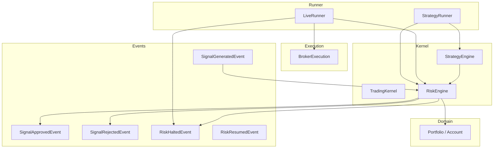
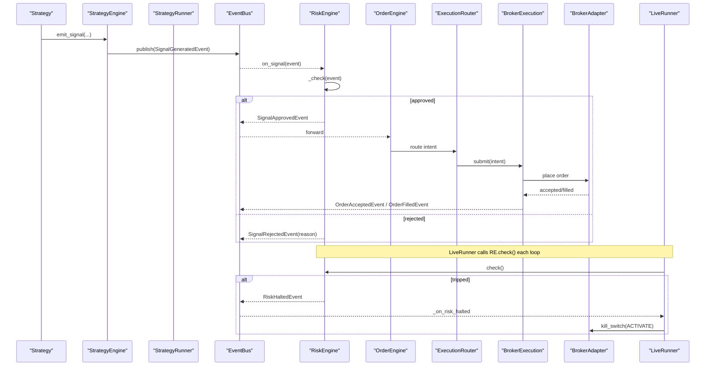
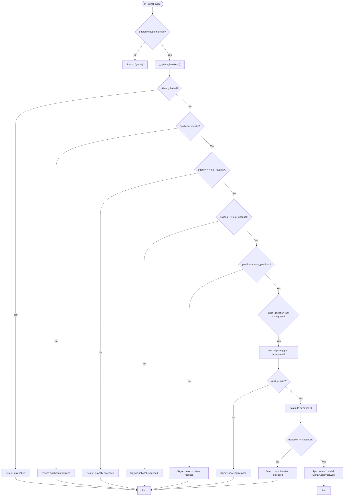
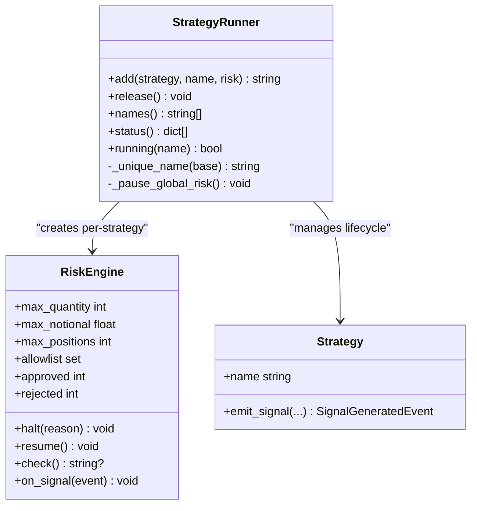
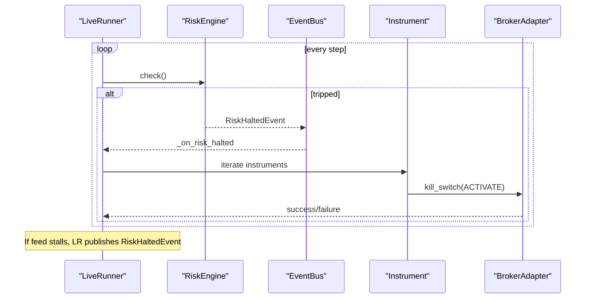
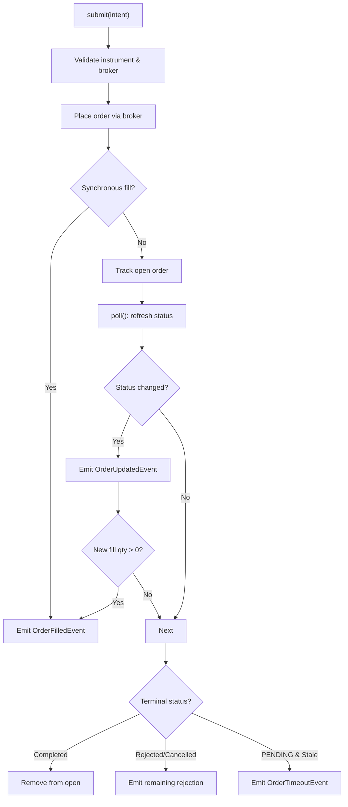
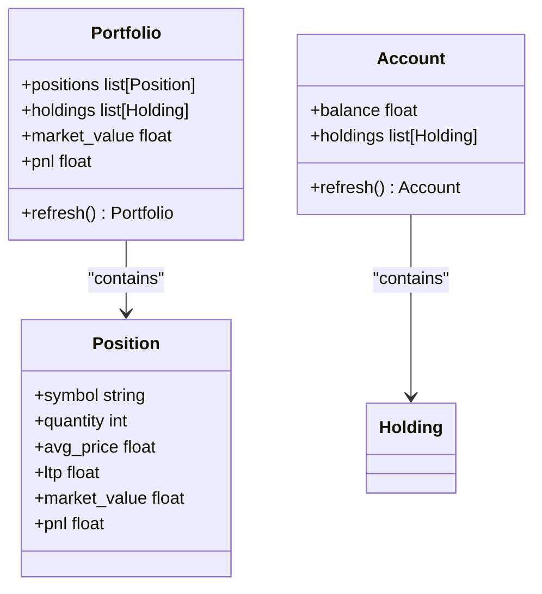
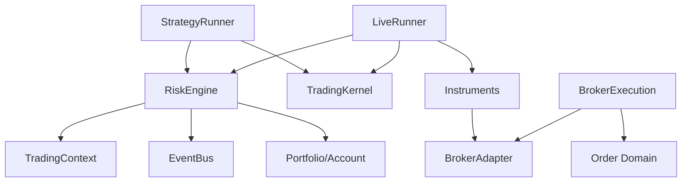

# Risk Management

<cite>
**Referenced Files in This Document**
- [risk_engine.py](file://ntrade/engines/risk_engine.py)
- [risk.py](file://ntrade/events/risk.py)
- [live_runner.py](file://ntrade/runner/live_runner.py)
- [broker_executor.py](file://ntrade/execution/broker_executor.py)
- [portfolio.py](file://ntrade/domain/portfolio.py)
- [strategy_engine.py](file://ntrade/engines/strategy_engine.py)
- [session.py](file://ntrade/kernel/session.py)
- [runner.py](file://ntrade/kernel/runner.py)
- [test_risk_breakers.py](file://tests/test_risk_breakers.py)
- [test_kill_switch_wiring.py](file://tests/test_kill_switch_wiring.py)
- [test_strategy_runner.py](file://tests/test_strategy_runner.py)
</cite>

## Update Summary
**Changes Made**
- Updated StrategyRunner section to reflect the simplified interface with only `add()` and `release()` methods
- Removed references to hot-detaching strategies and runtime enable/disable operations
- Updated diagrams and examples to show the current minimal API surface
- Clarified that strategy lifecycle management is now handled through the kernel's StrategyEngine directly

## Table of Contents
1. [Introduction](#introduction)
2. [Project Structure](#project-structure)
3. [Core Components](#core-components)
4. [Architecture Overview](#architecture-overview)
5. [Detailed Component Analysis](#detailed-component-analysis)
6. [Dependency Analysis](#dependency-analysis)
7. [Performance Considerations](#performance-considerations)
8. [Troubleshooting Guide](#troubleshooting-guide)
9. [Conclusion](#conclusion)
10. [Appendices](#appendices)

## Introduction
This document explains the risk management and circuit breaker system that screens trading signals before they become orders, enforces position and exposure limits, and automatically suspends trading when thresholds are breached. It covers:
- The RiskEngine with three primary circuit breakers: max_daily_loss (equity vs session start), max_drawdown_pct (peak-to-trough), and price_deviation_pct (fat-finger guard against last traded price).
- Position limits and per-strategy isolation via StrategyRunner-scoped RiskEngines.
- The halt/resume mechanism and integration with the LiveRunner kill switch to immediately stop broker execution.
- The risk event system for external monitoring and intervention.
- Monitoring, alerting, and manual override procedures for production use.

## Project Structure
The risk system spans several modules:
- Risk screening and circuit breakers live in the RiskEngine.
- Events define signal flow and risk state transitions.
- The LiveRunner evaluates risk continuously and triggers a broker kill switch on halt.
- BrokerExecution provides order lifecycle and cancellation capabilities.
- Portfolio models supply equity and position data used by risk checks.
- StrategyRunner scopes risk per strategy and isolates limits.
- TradingKernel wires engines and exposes helpers for polling and syncing.

**Diagram sources**
- [session.py:38-101](file://ntrade/kernel/session.py#L38-L101)
- [strategy_engine.py:48-102](file://ntrade/engines/strategy_engine.py#L48-L102)
- [risk_engine.py:19-141](file://ntrade/engines/risk_engine.py#L19-L141)
- [live_runner.py:21-196](file://ntrade/runner/live_runner.py#L21-L196)
- [broker_executor.py:46-262](file://ntrade/execution/broker_executor.py#L46-L262)
- [portfolio.py:63-173](file://ntrade/domain/portfolio.py#L63-L173)
- [risk.py:11-52](file://ntrade/events/risk.py#L11-L52)
- [runner.py:16-135](file://ntrade/kernel/runner.py#L16-L135)

**Section sources**
- [session.py:38-101](file://ntrade/kernel/session.py#L38-L101)
- [strategy_engine.py:48-102](file://ntrade/engines/strategy_engine.py#L48-L102)
- [risk_engine.py:19-141](file://ntrade/engines/risk_engine.py#L19-L141)
- [live_runner.py:21-196](file://ntrade/runner/live_runner.py#L21-L196)
- [broker_executor.py:46-262](file://ntrade/execution/broker_executor.py#L46-L262)
- [portfolio.py:63-173](file://ntrade/domain/portfolio.py#L63-L173)
- [risk.py:11-52](file://ntrade/events/risk.py#L11-L52)
- [runner.py:16-135](file://ntrade/kernel/runner.py#L16-L135)

## Core Components
- RiskEngine: Screens SignalGeneratedEvent, enforces static limits (allowlist, quantity, notional, position count), and applies circuit breakers (daily loss, drawdown, price deviation). Publishes SignalApprovedEvent or SignalRejectedEvent; publishes RiskHaltedEvent/RiskResumedEvent on state changes.
- StrategyRunner: Creates per-strategy RiskEngine instances scoped by strategy name, pausing the global RiskEngine to avoid double-screening. Exposes status and lifecycle controls through a minimal API surface.
- LiveRunner: Calls engine.check() every loop iteration to detect mid-session breaches; subscribes to RiskHaltedEvent to trigger broker kill switch; monitors feed health and can publish its own RiskHaltedEvent if ticks freeze.
- BrokerExecution: Manages order submission, lifecycle polling, timeouts, and cancellation; integrates with broker adapters for live execution.
- Portfolio/Account: Provides balance, positions, and market values used to compute equity and drawdown.

Key responsibilities:
- RiskEngine: signal screening, circuit breaker evaluation, halt/resume semantics, per-strategy position counting.
- StrategyRunner: per-strategy risk scoping, global risk pause/unpause, strategy lifecycle management.
- LiveRunner: continuous risk evaluation, kill switch activation, watchdog for stale feeds.
- BrokerExecution: order lifecycle and cancellation.
- Portfolio/Account: equity and MTM calculations.

**Section sources**
- [risk_engine.py:19-141](file://ntrade/engines/risk_engine.py#L19-L141)
- [runner.py:16-135](file://ntrade/kernel/runner.py#L16-L135)
- [live_runner.py:21-196](file://ntrade/runner/live_runner.py#L21-L196)
- [broker_executor.py:46-262](file://ntrade/execution/broker_executor.py#L46-L262)
- [portfolio.py:63-173](file://ntrade/domain/portfolio.py#L63-L173)

## Architecture Overview
The risk architecture is event-driven and layered:
- Strategies emit SignalGeneratedEvent through StrategyEngine.
- RiskEngine screens signals and either approves or rejects them.
- Approved signals proceed to OrderEngine and ExecutionRouter to BrokerExecution.
- LiveRunner periodically calls RiskEngine.check() to evaluate circuit breakers even without new signals.
- On RiskHaltedEvent, LiveRunner activates broker kill switches across instruments.

**Diagram sources**
- [strategy_engine.py:37-45](file://ntrade/engines/strategy_engine.py#L37-L45)
- [risk_engine.py:73-111](file://ntrade/engines/risk_engine.py#L73-L111)
- [session.py:103-102](file://ntrade/kernel/session.py#L103-L102)
- [broker_executor.py:58-95](file://ntrade/execution/broker_executor.py#L58-95)
- [live_runner.py:96-104](file://ntrade/runner/live_runner.py#L96-104)
- [live_runner.py:181-196](file://ntrade/runner/live_runner.py#L181-196)

## Detailed Component Analysis

### RiskEngine: Circuit Breakers and Screening
- Static limits: allowlist, max_quantity, max_notional, max_positions.
- Circuit breakers:
  - max_daily_loss: halts when session equity falls below session start balance by more than the cap.
  - max_drawdown_pct: halts when peak-to-trough equity drop exceeds threshold.
  - price_deviation_pct: rejects signals whose price deviates beyond a percentage from reference LTP or prev_close.
- Halt/resume:
  - halt(reason) sets halted flag and publishes RiskHaltedEvent with current equity.
  - resume() clears halted state, resets peak equity and start balance, publishes RiskResumedEvent.
- Per-strategy isolation:
  - When strategy is set, _position_count counts only positions tagged with that strategy metadata.
- Continuous evaluation:
  - check() evaluates breakers without requiring a signal; LiveRunner invokes it every loop.

**Diagram sources**
- [risk_engine.py:73-111](file://ntrade/engines/risk_engine.py#L73-L111)
- [risk_engine.py:113-128](file://ntrade/engines/risk_engine.py#L113-L128)
- [risk_engine.py:129-141](file://ntrade/engines/risk_engine.py#L129-L141)

**Section sources**
- [risk_engine.py:19-141](file://ntrade/engines/risk_engine.py#L19-L141)
- [test_risk_breakers.py:30-111](file://tests/test_risk_breakers.py#L30-L111)

### StrategyRunner: Simplified Interface and Per-Strategy Risk Isolation
**Updated** The StrategyRunner interface has been simplified to focus on core functionality. Hot-detaching strategies and runtime enable/disable operations are no longer supported through the StrategyRunner API.

- **Minimal Public API**: Only `add()` and `release()` methods remain in the public interface.
- Each added strategy gets a unique name and a dedicated RiskEngine instance scoped to that name.
- Global RiskEngine is paused while runner owns strategies to prevent double-screening.
- Status API exposes per-strategy limits and approve/reject counts.
- Strategy lifecycle management is handled through the kernel's StrategyEngine directly.

**Diagram sources**
- [runner.py:16-135](file://ntrade/kernel/runner.py#L16-L135)
- [risk_engine.py:19-141](file://ntrade/engines/risk_engine.py#L19-L141)
- [strategy_engine.py:18-46](file://ntrade/engines/strategy_engine.py#L18-L46)

**Section sources**
- [runner.py:16-135](file://ntrade/kernel/runner.py#L16-L135)
- [test_strategy_runner.py:72-243](file://tests/test_strategy_runner.py#L72-L243)

### LiveRunner: Kill Switch Integration and Feed Watchdog
- Subscribes to RiskHaltedEvent; on receipt, iterates instruments and calls instrument.broker.kill_switch(action="ACTIVATE").
- Tracks kill_switched and kill_switch_failed flags for observability.
- Calls RiskEngine.check() every step to catch bleeding positions between signals.
- Monitors tick flow; if no new ticks for N checks, publishes RiskHaltedEvent to halt trading.

**Diagram sources**
- [live_runner.py:96-104](file://ntrade/runner/live_runner.py#L96-104)
- [live_runner.py:181-196](file://ntrade/runner/live_runner.py#L181-196)
- [live_runner.py:154-174](file://ntrade/runner/live_runner.py#L154-174)

**Section sources**
- [live_runner.py:21-196](file://ntrade/runner/live_runner.py#L21-L196)
- [test_kill_switch_wiring.py:36-75](file://tests/test_kill_switch_wiring.py#L36-L75)

### BrokerExecution: Order Lifecycle and Cancellation
- Places orders via broker adapter; publishes OrderAcceptedEvent immediately; handles synchronous fills.
- Polls open orders, emits updates, timeouts, rejections, and partial fills safely.
- Supports modify/cancel operations used by higher layers to manage open orders.

**Diagram sources**
- [broker_executor.py:58-95](file://ntrade/execution/broker_executor.py#L58-95)
- [broker_executor.py:106-169](file://ntrade/execution/broker_executor.py#L106-169)
- [broker_executor.py:221-238](file://ntrade/execution/broker_executor.py#L221-238)

**Section sources**
- [broker_executor.py:46-262](file://ntrade/execution/broker_executor.py#L46-L262)

### Portfolio and Equity Calculations
- Equity = account.balance + sum(position.market_value).
- Drawdown computed relative to peak equity observed during session.
- Daily loss computed as session_start_balance - current_equity.

**Diagram sources**
- [portfolio.py:63-173](file://ntrade/domain/portfolio.py#L63-L173)

**Section sources**
- [portfolio.py:63-173](file://ntrade/domain/portfolio.py#L63-L173)

## Dependency Analysis
- RiskEngine depends on context (account, portfolio, instrument quotes) and EventBus for events.
- StrategyRunner depends on TradingKernel and RiskEngine; manages subscriptions to avoid double-screening.
- LiveRunner depends on TradingKernel, RiskEngine, and broker adapters via instruments.
- BrokerExecution depends on broker adapter interface and order domain types.
- Tests validate behavior of breakers, kill switch wiring, and per-strategy isolation.

**Diagram sources**
- [risk_engine.py:19-141](file://ntrade/engines/risk_engine.py#L19-L141)
- [runner.py:16-135](file://ntrade/kernel/runner.py#L16-L135)
- [live_runner.py:21-196](file://ntrade/runner/live_runner.py#L21-L196)
- [broker_executor.py:46-262](file://ntrade/execution/broker_executor.py#L46-L262)
- [portfolio.py:63-173](file://ntrade/domain/portfolio.py#L63-L173)

**Section sources**
- [risk_engine.py:19-141](file://ntrade/engines/risk_engine.py#L19-L141)
- [runner.py:16-135](file://ntrade/kernel/runner.py#L16-L135)
- [live_runner.py:21-196](file://ntrade/runner/live_runner.py#L21-L196)
- [broker_executor.py:46-262](file://ntrade/execution/broker_executor.py#L46-L262)
- [portfolio.py:63-173](file://ntrade/domain/portfolio.py#L63-L173)

## Performance Considerations
- RiskEngine._update_breakers runs on every signal and every LiveRunner step; keep thresholds efficient to avoid excessive computations.
- Position counting is O(N) over positions; consider indexing by strategy metadata if portfolios grow large.
- LiveRunner poll_interval and sync_interval should balance responsiveness with broker rate limits.
- BrokerExecution stale detection prevents memory leaks on failed polls; tune stale limit based on network reliability.

## Troubleshooting Guide
Common issues and resolutions:
- Signals rejected due to price deviation: ensure valid LTP or prev_close is available; otherwise, price is unverifiable and rejected.
- Unexpected halts: inspect halt_reason from RiskEngine; verify daily loss and drawdown thresholds; check for bleeding positions.
- Kill switch failures: observe LiveRunner.kill_switch_failed flag; log broker exceptions and retry or escalate manually.
- Feed stagnation: LiveRunner watchdog publishes RiskHaltedEvent when ticks stall; reconnect feed or restart runner.
- Double-screening: ensure StrategyRunner properly pauses global RiskEngine; verify subscription counts after release.

Operational steps:
- Monitor RiskHaltedEvent and RiskResumedEvent for real-time alerts.
- Use LiveRunner.status and StrategyRunner.status to audit approvals/rejections and limits.
- Manually resume only after verifying risk conditions are resolved; call RiskEngine.resume().
- For immediate order cancellation, use BrokerExecution.cancel(order_id) or rely on kill switch activation.

**Section sources**
- [test_risk_breakers.py:30-111](file://tests/test_risk_breakers.py#L30-L111)
- [test_kill_switch_wiring.py:36-75](file://tests/test_kill_switch_wiring.py#L36-L75)
- [live_runner.py:154-174](file://ntrade/runner/live_runner.py#L154-L174)
- [broker_executor.py:106-169](file://ntrade/execution/broker_executor.py#L106-L169)

## Conclusion
The risk management system provides robust protection through layered circuit breakers, per-strategy isolation, and automatic trading suspension with broker kill switch integration. Continuous evaluation ensures mid-session risks are caught, while event-driven design enables external monitoring and intervention. Proper configuration, monitoring, and manual override procedures are essential for safe production operation.

## Appendices

### Configuration Examples
- Configure RiskEngine parameters:
  - max_daily_loss: float cap on session losses.
  - max_drawdown_pct: float threshold for peak-to-trough drawdown.
  - price_deviation_pct: float threshold for fat-finger guard.
  - max_quantity, max_notional, max_positions: static limits.
  - allowlist: set of permitted symbols.
- StrategyRunner per-strategy risk:
  - Pass risk dict to runner.add(strategy, risk={...}) to isolate limits per strategy.

**Section sources**
- [risk_engine.py:20-35](file://ntrade/engines/risk_engine.py#L20-L35)
- [runner.py:33-47](file://ntrade/kernel/runner.py#L33-L47)

### Custom Risk Validators
- Extend RiskEngine logic by overriding _check or adding custom validators:
  - Add additional static checks (e.g., sector exposure caps).
  - Integrate external risk APIs for dynamic limits.
  - Ensure consistent event publishing (approve/reject/halt/resume).

**Section sources**
- [risk_engine.py:84-111](file://ntrade/engines/risk_engine.py#L84-L111)

### Responding to Risk Events
- Subscribe to RiskHaltedEvent to trigger external actions:
  - Alerting systems, dashboards, or manual intervention workflows.
- Subscribe to RiskResumedEvent to restore automated trading after validation.
- Use LiveRunner flags (kill_switched, kill_switch_failed) to assess kill switch outcomes.

**Section sources**
- [risk.py:39-52](file://ntrade/events/risk.py#L39-L52)
- [live_runner.py:181-196](file://ntrade/runner/live_runner.py#L181-196)

### Relationship Between Risk Management, Portfolio Tracking, and Automated Decisions
- RiskEngine uses Portfolio and Account to compute equity and drawdown.
- Approved signals flow to OrderEngine and ExecutionRouter for automated decisions.
- LiveRunner coordinates risk evaluation with feed and broker synchronization.

**Section sources**
- [portfolio.py:63-173](file://ntrade/domain/portfolio.py#L63-L173)
- [session.py:103-102](file://ntrade/kernel/session.py#L103-L102)
- [live_runner.py:96-104](file://ntrade/runner/live_runner.py#L96-L104)

### StrategyRunner Interface Changes
**Updated** The StrategyRunner interface has been significantly simplified to provide a cleaner, more focused API surface.

- **Removed Methods**: `remove()`, `enable()`, and `disable()` methods have been removed from the public interface.
- **Remaining Methods**: Only `add()` and `release()` methods remain in the public API surface.
- **Hot-Detaching**: Runtime strategy removal and enable/disable operations are no longer supported through StrategyRunner.
- **Lifecycle Management**: Strategy lifecycle is now managed through the kernel's StrategyEngine directly.

This change simplifies the API surface and reduces complexity in strategy management, making the system more predictable and easier to maintain.

**Section sources**
- [runner.py:16-135](file://ntrade/kernel/runner.py#L16-L135)
- [test_strategy_runner.py:109-118](file://tests/test_strategy_runner.py#L109-L118)