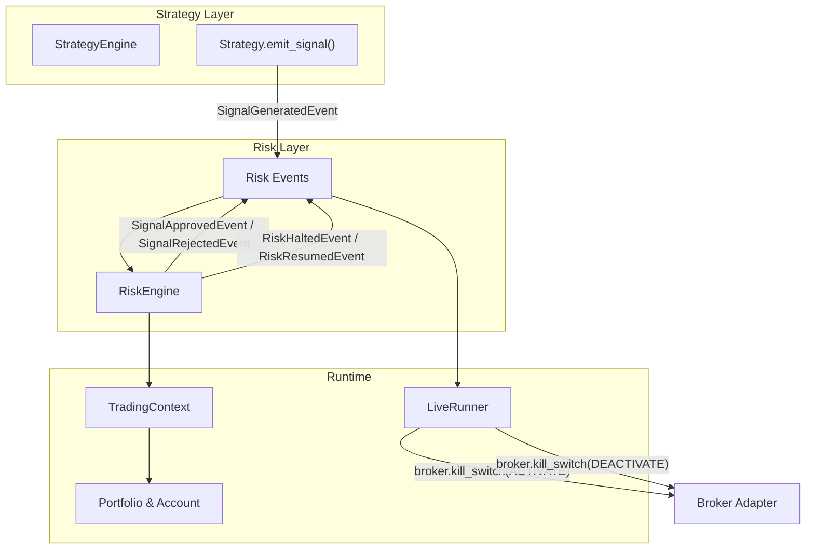
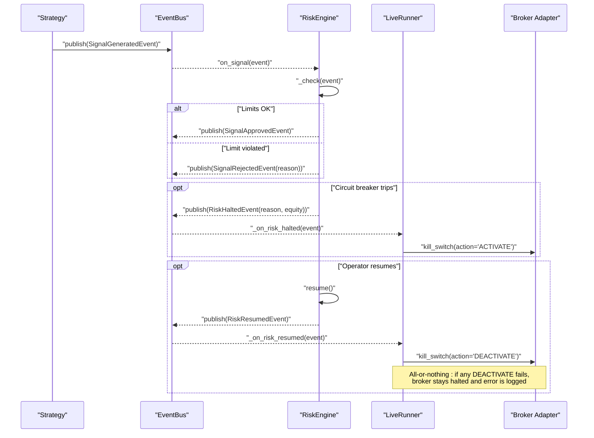
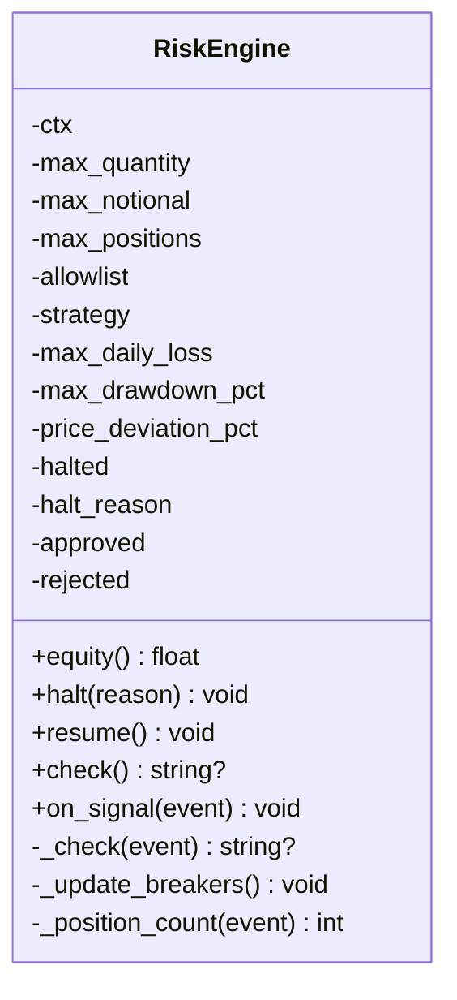
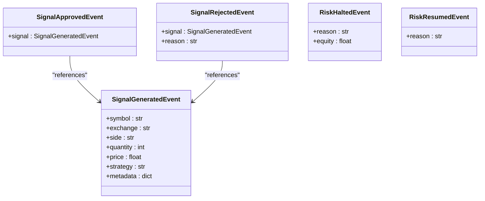
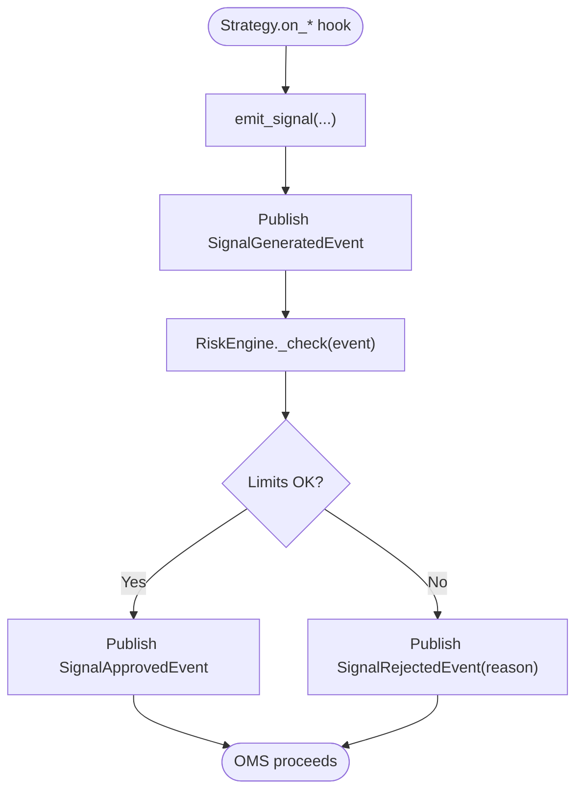
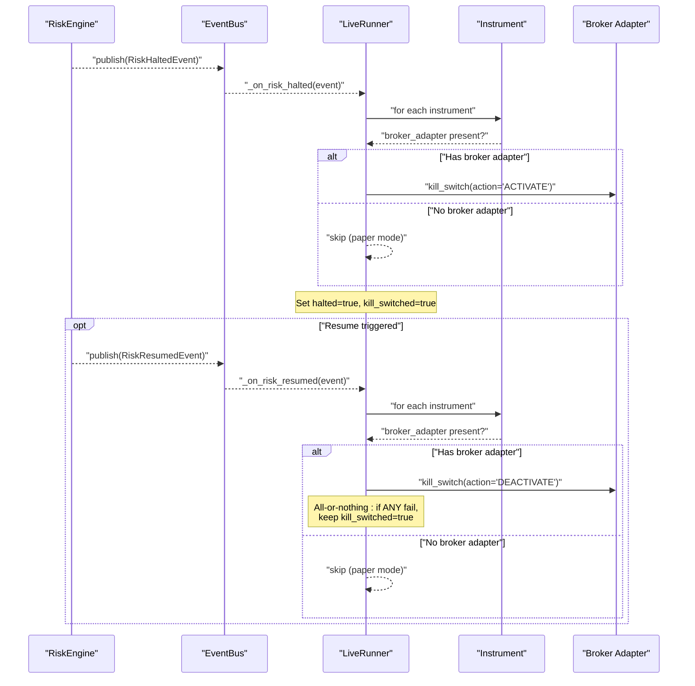
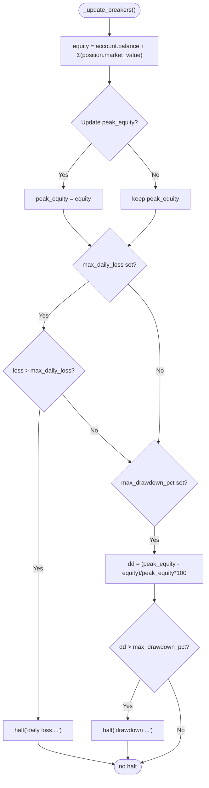
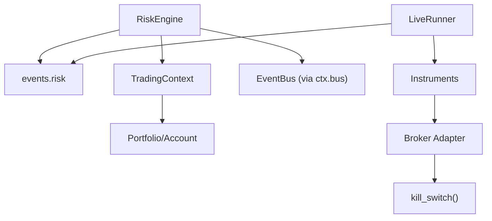

# Risk Management User Guide

<cite>
**Referenced Files in This Document**
- [risk_engine.py](file://ntrade/engines/risk_engine.py)
- [risk.py](file://ntrade/events/risk.py)
- [strategy_engine.py](file://ntrade/engines/strategy_engine.py)
- [context.py](file://ntrade/kernel/context.py)
- [portfolio.py](file://ntrade/domain/portfolio.py)
- [live_runner.py](file://ntrade/runner/live_runner.py)
- [05-risk.md](file://user-guide/05-risk.md)
- [test_risk_breakers.py](file://tests/test_risk_breakers.py)
- [test_kill_switch_wiring.py](file://tests/test_kill_switch_wiring.py)
</cite>

## Update Summary
**Changes Made**
- Updated Live Kill Switch Integration section to document the new RiskResumedEvent handling
- Enhanced the architecture overview to show the complete resume mechanism
- Added detailed explanation of the all-or-nothing resume mechanism
- Updated troubleshooting guide to include resume-related issues
- Enhanced diagrams to show the complete halt/resume lifecycle

## Table of Contents
1. [Introduction](#introduction)
2. [Project Structure](#project-structure)
3. [Core Components](#core-components)
4. [Architecture Overview](#architecture-overview)
5. [Detailed Component Analysis](#detailed-component-analysis)
6. [Dependency Analysis](#dependency-analysis)
7. [Performance Considerations](#performance-considerations)
8. [Troubleshooting Guide](#troubleshooting-guide)
9. [Conclusion](#conclusion)

## Introduction
This guide explains how nTrade's risk management system screens strategy signals, enforces per-strategy limits, and activates circuit breakers to protect your session. It also describes the live kill-switch integration that stops orders at the broker when a risk breaker trips, and the automatic resume mechanism that re-arms brokers when trading is cleared. You will learn how to configure limits, interpret events, and recover from halts safely with guaranteed broker state synchronization.

## Project Structure
Risk management spans several modules:
- Strategy emits signals via an event bus.
- RiskEngine screens signals against static limits and dynamic circuit breakers.
- Events capture approvals, rejections, and halt/resume states.
- LiveRunner reacts to halts by activating broker kill switches and resumes by deactivating them.
- Context provides shared state (portfolio, account, instruments).
- Portfolio models positions and market values used for equity calculations.

**Diagram sources**
- [strategy_engine.py:37-45](file://ntrade/engines/strategy_engine.py#L37-L45)
- [risk_engine.py:19-41](file://ntrade/engines/risk_engine.py#L19-L41)
- [risk.py:11-52](file://ntrade/events/risk.py#L11-L52)
- [context.py:17-46](file://ntrade/kernel/context.py#L17-L46)
- [portfolio.py:19-36](file://ntrade/domain/portfolio.py#L19-L36)
- [live_runner.py:208-253](file://ntrade/runner/live_runner.py#L208-L253)

**Section sources**
- [strategy_engine.py:1-46](file://ntrade/engines/strategy_engine.py#L1-L46)
- [risk_engine.py:1-41](file://ntrade/engines/risk_engine.py#L1-L41)
- [risk.py:1-52](file://ntrade/events/risk.py#L1-L52)
- [context.py:1-46](file://ntrade/kernel/context.py#L1-L46)
- [portfolio.py:1-36](file://ntrade/domain/portfolio.py#L1-L36)
- [live_runner.py:208-253](file://ntrade/runner/live_runner.py#L208-L253)

## Core Components
- StrategyEngine and Strategy: Strategies emit trade signals through emit_signal(), which publishes a SignalGeneratedEvent with symbol, exchange, side, quantity, price, and metadata.
- RiskEngine: Subscribes to SignalGeneratedEvent and applies:
  - Static limits: allowlist, max_quantity, max_notional, max_positions, price_deviation_pct.
  - Circuit breakers: max_daily_loss, max_drawdown_pct.
  - State: halted flag, halt reason, approved/rejected counters, equity tracking.
- Risk Events: SignalGeneratedEvent, SignalApprovedEvent, SignalRejectedEvent, RiskHaltedEvent, RiskResumedEvent.
- TradingContext: Shared mutable state including portfolio, account, instruments, and thread-safe accessors.
- Portfolio and Account: Position and Holding models provide market_value and P&L; equity is computed as balance + sum(position.market_value).
- LiveRunner: On RiskHaltedEvent, activates broker kill switch on all instruments with a broker adapter. On RiskResumedEvent, deactivates kill switch on all broker adapters with all-or-nothing semantics.

Key behaviors:
- Per-strategy isolation: A RiskEngine can be scoped to a single strategy name; otherwise it screens all strategies.
- Equity calculation: Session equity = account.balance + Σ(position.quantity × position.ltp).
- Halt semantics: Once tripped, all subsequent signals are rejected until resume() clears the halt and resets peak equity/start balance.
- Resume semantics: When resume() is called, LiveRunner calls kill_switch(action='DEACTIVATE') on all broker adapters, ensuring all brokers are re-armed before allowing trading to resume.

**Section sources**
- [strategy_engine.py:37-45](file://ntrade/engines/strategy_engine.py#L37-L45)
- [risk_engine.py:19-111](file://ntrade/engines/risk_engine.py#L19-L111)
- [risk.py:11-52](file://ntrade/events/risk.py#L11-L52)
- [context.py:17-46](file://ntrade/kernel/context.py#L17-L46)
- [portfolio.py:19-36](file://ntrade/domain/portfolio.py#L19-L36)
- [live_runner.py:208-253](file://ntrade/runner/live_runner.py#L208-L253)

## Architecture Overview
The risk pipeline is event-driven and decoupled:
- Strategy emits SignalGeneratedEvent.
- RiskEngine evaluates limits and circuit breakers, then publishes either SignalApprovedEvent or SignalRejectedEvent.
- If a circuit breaker trips, RiskEngine publishes RiskHaltedEvent; LiveRunner listens and activates broker kill switches.
- Resume clears the halt and publishes RiskResumedEvent; LiveRunner listens and deactivates broker kill switches with all-or-nothing semantics.

**Diagram sources**
- [strategy_engine.py:37-45](file://ntrade/engines/strategy_engine.py#L37-L45)
- [risk_engine.py:73-111](file://ntrade/engines/risk_engine.py#L73-L111)
- [risk.py:11-52](file://ntrade/events/risk.py#L11-L52)
- [live_runner.py:208-253](file://ntrade/runner/live_runner.py#L208-L253)

## Detailed Component Analysis

### RiskEngine
Responsibilities:
- Screen signals against allowlist, quantity, notional, position count, and price deviation.
- Monitor equity-based circuit breakers (daily loss cap and drawdown limit).
- Manage halt/resume lifecycle and publish corresponding events.
- Provide equity snapshot and position counting (global or per-strategy).

Key methods:
- __init__: subscribes to SignalGeneratedEvent; stores limits and initial state.
- equity(): returns session equity using account.balance and positions' market_value.
- halt()/resume(): toggles halted state and publishes RiskHaltedEvent/RiskResumedEvent.
- check(): evaluates circuit breakers without a signal (used by runners each loop).
- on_signal/_check(): screening logic and rejection reasons.
- _position_count(): counts open positions relevant to this engine (all or per-strategy).

**Diagram sources**
- [risk_engine.py:19-141](file://ntrade/engines/risk_engine.py#L19-L141)

**Section sources**
- [risk_engine.py:19-141](file://ntrade/engines/risk_engine.py#L19-L141)

### Risk Events
Events define the contract between Strategy, RiskEngine, and downstream consumers:
- SignalGeneratedEvent: intended trade parameters and strategy identity.
- SignalApprovedEvent: passes risk checks; OMS may proceed.
- SignalRejectedEvent: blocked by risk; includes reason.
- RiskHaltedEvent: circuit breaker tripped; includes reason and equity snapshot.
- RiskResumedEvent: trading may resume after operator action.

**Diagram sources**
- [risk.py:11-52](file://ntrade/events/risk.py#L11-L52)

**Section sources**
- [risk.py:11-52](file://ntrade/events/risk.py#L11-L52)

### Strategy Emission Flow
Strategies emit signals via emit_signal(), which constructs a SignalGeneratedEvent and publishes it to the bus. The RiskEngine consumes these events and decides approval or rejection.

**Diagram sources**
- [strategy_engine.py:37-45](file://ntrade/engines/strategy_engine.py#L37-L45)
- [risk_engine.py:84-111](file://ntrade/engines/risk_engine.py#L84-L111)

**Section sources**
- [strategy_engine.py:37-45](file://ntrade/engines/strategy_engine.py#L37-L45)
- [risk_engine.py:84-111](file://ntrade/engines/risk_engine.py#L84-L111)

### Live Kill Switch Integration
When a circuit breaker trips, LiveRunner activates the broker kill switch on every instrument that has a broker adapter. This prevents new orders from being accepted at the broker level. **Updated**: When trading is resumed, LiveRunner automatically deactivates the kill switch on all broker adapters with all-or-nothing semantics.

**Diagram sources**
- [live_runner.py:208-253](file://ntrade/runner/live_runner.py#L208-L253)

**Section sources**
- [live_runner.py:208-253](file://ntrade/runner/live_runner.py#L208-L253)

### Equity and Circuit Breaker Logic
Equity is computed as cash balance plus mark-to-market of open positions. Circuit breakers evaluate:
- Daily loss: start_balance - equity > max_daily_loss.
- Drawdown: (peak_equity - equity) / peak_equity * 100 > max_drawdown_pct.

**Diagram sources**
- [risk_engine.py:113-128](file://ntrade/engines/risk_engine.py#L113-L128)
- [portfolio.py:19-36](file://ntrade/domain/portfolio.py#L19-L36)

**Section sources**
- [risk_engine.py:113-128](file://ntrade/engines/risk_engine.py#L113-L128)
- [portfolio.py:19-36](file://ntrade/domain/portfolio.py#L19-L36)

## Dependency Analysis
RiskEngine depends on:
- Event types from events.risk for input/output contracts.
- TradingContext for portfolio, account, and instrument access.
- Portfolio models for position market values.
- LiveRunner for kill-switch activation upon halt and deactivation upon resume.

**Diagram sources**
- [risk_engine.py:13-16](file://ntrade/engines/risk_engine.py#L13-L16)
- [context.py:17-46](file://ntrade/kernel/context.py#L17-L46)
- [portfolio.py:19-36](file://ntrade/domain/portfolio.py#L19-L36)
- [live_runner.py:208-253](file://ntrade/runner/live_runner.py#L208-L253)

**Section sources**
- [risk_engine.py:13-16](file://ntrade/engines/risk_engine.py#L13-L16)
- [context.py:17-46](file://ntrade/kernel/context.py#L17-L46)
- [portfolio.py:19-36](file://ntrade/domain/portfolio.py#L19-L36)
- [live_runner.py:208-253](file://ntrade/runner/live_runner.py#L208-L253)

## Performance Considerations
- Screening cost: Each signal triggers constant-time checks against configured limits; position counting is linear in number of positions but typically small.
- Equity computation: Summation over positions; efficient enough for typical portfolios.
- Event bus overhead: Decoupled design avoids tight coupling; ensure event handlers remain lightweight.
- LiveRunner kill switch: Iterates instruments once per halt/resume; consider caching snapshots if needed.
- Resume mechanism: All-or-nothing approach ensures consistency but may require multiple broker calls.

[No sources needed since this section provides general guidance]

## Troubleshooting Guide
Common issues and resolutions:
- Signals rejected due to allowlist: Ensure symbols are included in the allowlist configuration.
- Quantity or notional exceeded: Adjust max_quantity or max_notional to match strategy sizing.
- Price deviation too high: Verify price source and reduce price_deviation_pct threshold if necessary.
- Circuit breaker tripped: Review daily loss and drawdown thresholds; call resume() after addressing the cause.
- Kill switch activated in live mode: Confirm broker connectivity and ensure kill switch deactivation when resuming operations.
- Resume failed: Check if any broker adapter failed to deactivate kill switch; investigate broker connectivity and retry resume operation.

Useful diagnostics:
- Inspect SignalRejectedEvent.reason for exact failure cause.
- Monitor approved vs rejected counts via runner status or event history.
- Track RiskHaltedEvent occurrences and reasons during live runs.
- Check runner.halted and runner.kill_switched flags to understand current state.
- Monitor kill_switch_failed flag to detect resume failures.

**Section sources**
- [05-risk.md:34-46](file://user-guide/05-risk.md#L34-L46)
- [test_risk_breakers.py:30-111](file://tests/test_risk_breakers.py#L30-L111)
- [test_kill_switch_wiring.py:77-134](file://tests/test_kill_switch_wiring.py#L77-L134)

## Conclusion
nTrade's risk management system provides robust, configurable safeguards for both paper and live trading. By combining per-strategy limits with dynamic circuit breakers and a live kill switch with automatic resume capability, it ensures that risky trades are blocked early and sessions are protected under adverse conditions. The all-or-nothing resume mechanism guarantees that all broker adapters are properly re-armed before allowing trading to resume, preventing partial broker states. Use the provided events and APIs to monitor, tune, and recover from risk events effectively.

[No sources needed since this section summarizes without analyzing specific files]