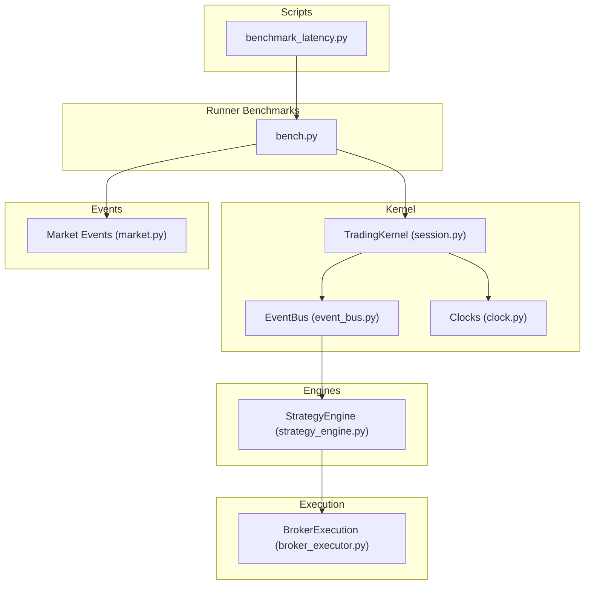
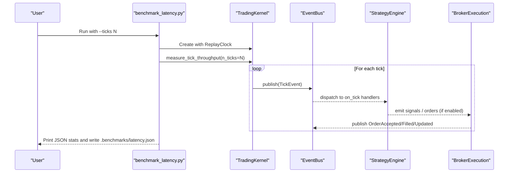
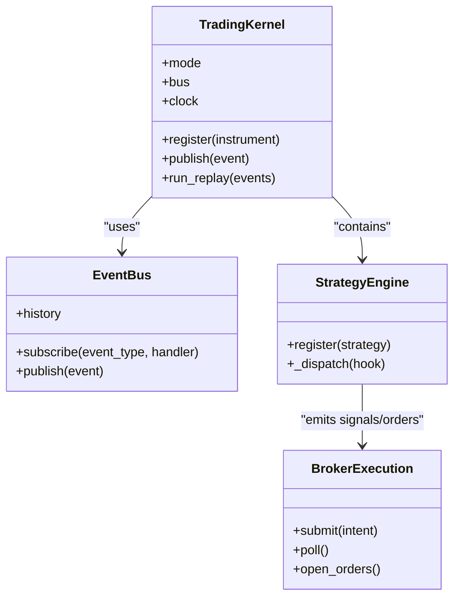

# Benchmarking & Performance Testing

<cite>
**Referenced Files in This Document**
- [benchmark_latency.py](file://scripts/benchmark_latency.py)
- [bench.py](file://ntrade/runner/bench.py)
- [test_benchmark.py](file://tests/test_benchmark.py)
- [event_bus.py](file://ntrade/kernel/event_bus.py)
- [session.py](file://ntrade/kernel/session.py)
- [clock.py](file://ntrade/kernel/clock.py)
- [market.py](file://ntrade/events/market.py)
- [strategy_engine.py](file://ntrade/engines/strategy_engine.py)
- [broker_executor.py](file://ntrade/execution/broker_executor.py)
</cite>

## Table of Contents
1. [Introduction](#introduction)
2. [Project Structure](#project-structure)
3. [Core Components](#core-components)
4. [Architecture Overview](#architecture-overview)
5. [Detailed Component Analysis](#detailed-component-analysis)
6. [Dependency Analysis](#dependency-analysis)
7. [Performance Considerations](#performance-considerations)
8. [Troubleshooting Guide](#troubleshooting-guide)
9. [Conclusion](#conclusion)
10. [Appendices](#appendices)

## Introduction
This document explains how to benchmark and performance-test nTrade’s kernel event pipeline, market data processing, and broker communication. It focuses on the provided latency benchmark script and helper utilities, shows how to measure throughput and latency across the event bus and engines, and provides guidance for creating custom benchmarks, profiling CPU/memory, and designing throughput and load tests suitable for high-frequency trading scenarios. It also covers regression testing and continuous monitoring strategies.

## Project Structure
The benchmarking surface centers around:
- A CLI entry point that constructs a replay-mode TradingKernel and runs a micro-benchmark over the event pipeline.
- A reusable micro-benchmark function that publishes synthetic ticks and measures wall time and events-per-second.
- The kernel’s event bus and clock abstractions that underpin deterministic, reproducible measurements.
- Engines and execution targets that participate in the event flow and can be measured or profiled.

**Diagram sources**
- [benchmark_latency.py:1-36](file://scripts/benchmark_latency.py#L1-L36)
- [bench.py:1-26](file://ntrade/runner/bench.py#L1-L26)
- [session.py:1-198](file://ntrade/kernel/session.py#L1-L198)
- [event_bus.py:1-81](file://ntrade/kernel/event_bus.py#L1-L81)
- [clock.py:1-55](file://ntrade/kernel/clock.py#L1-L55)
- [market.py:1-83](file://ntrade/events/market.py#L1-L83)
- [strategy_engine.py:1-102](file://ntrade/engines/strategy_engine.py#L1-L102)
- [broker_executor.py:1-262](file://ntrade/execution/broker_executor.py#L1-L262)

**Section sources**
- [benchmark_latency.py:1-36](file://scripts/benchmark_latency.py#L1-L36)
- [bench.py:1-26](file://ntrade/runner/bench.py#L1-L26)
- [session.py:1-198](file://ntrade/kernel/session.py#L1-L198)
- [event_bus.py:1-81](file://ntrade/kernel/event_bus.py#L1-L81)
- [clock.py:1-55](file://ntrade/kernel/clock.py#L1-L55)
- [market.py:1-83](file://ntrade/events/market.py#L1-L83)
- [strategy_engine.py:1-102](file://ntrade/engines/strategy_engine.py#L1-L102)
- [broker_executor.py:1-262](file://ntrade/execution/broker_executor.py#L1-L262)

## Core Components
- Latency benchmark CLI: Constructs a replay-mode kernel with a deterministic clock and invokes the throughput measurement routine. Outputs JSON stats to a file and stdout.
- Throughput measurement: Publishes a fixed number of TickEvent instances through the kernel’s event bus, records wall time, and computes events-per-second.
- Event bus: Synchronous publish/subscribe with serialized dispatch via a reentrant lock; maintains a bounded history used by tests and benchmarks.
- Clock abstraction: Deterministic ReplayClock enables zero-parity replay where timestamps are driven by events rather than wall time.
- Strategy engine: Subscribes to market events and dispatches them to strategy hooks; useful for measuring strategy computation overhead.
- Broker executor: Routes order intents to a live broker adapter; supports asynchronous lifecycle polling and emits fill/update events.

Key usage patterns:
- Use the CLI to run a quick latency sweep against the full kernel stack.
- Use the measurement function directly in tests or custom scripts to isolate specific components.

**Section sources**
- [benchmark_latency.py:1-36](file://scripts/benchmark_latency.py#L1-L36)
- [bench.py:1-26](file://ntrade/runner/bench.py#L1-L26)
- [event_bus.py:1-81](file://ntrade/kernel/event_bus.py#L1-L81)
- [clock.py:1-55](file://ntrade/kernel/clock.py#L1-L55)
- [strategy_engine.py:1-102](file://ntrade/engines/strategy_engine.py#L1-L102)
- [broker_executor.py:1-262](file://ntrade/execution/broker_executor.py#L1-L262)

## Architecture Overview
The benchmark flow exercises the entire kernel event pipeline deterministically:

**Diagram sources**
- [benchmark_latency.py:1-36](file://scripts/benchmark_latency.py#L1-L36)
- [bench.py:1-26](file://ntrade/runner/bench.py#L1-L26)
- [session.py:1-198](file://ntrade/kernel/session.py#L1-L198)
- [event_bus.py:1-81](file://ntrade/kernel/event_bus.py#L1-L81)
- [strategy_engine.py:1-102](file://ntrade/engines/strategy_engine.py#L1-L102)
- [broker_executor.py:1-262](file://ntrade/execution/broker_executor.py#L1-L262)

## Detailed Component Analysis

### Latency Benchmark Script
- Purpose: Quick end-to-end latency check of the kernel event pipeline using synthetic ticks.
- Inputs: Number of ticks and optional output path.
- Behavior: Initializes a replay-mode kernel with a deterministic clock, runs the throughput measurement, and persists results as JSON.

Usage example:
- Execute the script with a desired tick count; it prints statistics and writes them to a JSON file under the project’s benchmarks directory.

**Section sources**
- [benchmark_latency.py:1-36](file://scripts/benchmark_latency.py#L1-L36)

### Throughput Measurement Helper
- Purpose: Measure kernel event pipeline throughput by publishing a known number of ticks and timing the operation.
- Metrics: Total ticks, wall seconds, and events-per-second.
- Design: Registers an equity instrument once, then publishes TickEvent instances with incrementally advancing timestamps.

Customization tips:
- Adjust symbol, exchange, price range, and timestamp cadence to simulate realistic market conditions.
- Wrap additional logic around publish calls to measure downstream effects (e.g., indicator updates, strategy computations).

**Section sources**
- [bench.py:1-26](file://ntrade/runner/bench.py#L1-L26)

### Event Bus Internals and Implications
- Serialization: Dispatch is protected by a reentrant lock to ensure consistent state during handler execution.
- History: A bounded deque stores recent events; accessible for inspection and used by tests to validate fanout behavior.
- Error isolation: Handler exceptions are logged but do not abort dispatch, ensuring robustness under load.

Implications for benchmarking:
- Lock contention can become a bottleneck if many heavy handlers subscribe to common event types.
- History size impacts memory usage; tune max_history when running large-scale benchmarks.

**Section sources**
- [event_bus.py:1-81](file://ntrade/kernel/event_bus.py#L1-L81)

### Clock Abstraction and Determinism
- LiveClock returns wall time; ReplayClock and SimulationClock provide deterministic timestamps driven by events.
- Deterministic clocks enable zero-parity replay, making benchmarks reproducible across runs.

Benchmarking tip:
- Always use ReplayClock in benchmarks to avoid jitter from system time and external dependencies.

**Section sources**
- [clock.py:1-55](file://ntrade/kernel/clock.py#L1-L55)

### Strategy Engine and Computation Overhead
- StrategyEngine subscribes to multiple event types and dispatches to per-strategy hooks.
- Hook methods are invoked per event; errors are swallowed to keep the pipeline stable.

Measuring strategy computation:
- Add lightweight timers inside strategy hooks to compute per-event processing time.
- Aggregate metrics across events to estimate average and tail latencies for strategy logic.

**Section sources**
- [strategy_engine.py:1-102](file://ntrade/engines/strategy_engine.py#L1-L102)

### Broker Execution and Communication Overhead
- BrokerExecution places orders via a broker adapter and publishes lifecycle events asynchronously.
- Polling refreshes open orders and emits fills/rejections; includes timeout detection and idempotent emission.

Measuring broker overhead:
- Time between OrderIntentEvent and OrderAcceptedEvent for submission latency.
- Time between OrderAcceptedEvent and OrderFilledEvent for fill latency.
- Monitor poll frequency and network call durations in broker adapters.

**Section sources**
- [broker_executor.py:1-262](file://ntrade/execution/broker_executor.py#L1-L262)

### Market Data Events
- TickEvent, QuoteEvent, DepthEvent, and derived events represent market data flowing into the kernel.
- Benchmarks typically use TickEvent to exercise the pipeline at scale.

Design tip:
- Vary event kinds and payloads to stress different engines (candle, indicator, quote projection).

**Section sources**
- [market.py:1-83](file://ntrade/events/market.py#L1-L83)

## Dependency Analysis
The benchmark depends on the kernel’s wiring of engines and execution targets. The following diagram maps key runtime dependencies exercised by the benchmark:

**Diagram sources**
- [session.py:1-198](file://ntrade/kernel/session.py#L1-L198)
- [event_bus.py:1-81](file://ntrade/kernel/event_bus.py#L1-L81)
- [strategy_engine.py:1-102](file://ntrade/engines/strategy_engine.py#L1-L102)
- [broker_executor.py:1-262](file://ntrade/execution/broker_executor.py#L1-L262)

**Section sources**
- [session.py:1-198](file://ntrade/kernel/session.py#L1-L198)
- [event_bus.py:1-81](file://ntrade/kernel/event_bus.py#L1-L81)
- [strategy_engine.py:1-102](file://ntrade/engines/strategy_engine.py#L1-L102)
- [broker_executor.py:1-262](file://ntrade/execution/broker_executor.py#L1-L262)

## Performance Considerations
- Event bus contention: Heavy handlers subscribed to common events can serialize dispatch. Profile handler hot paths and consider batching or offloading non-critical work.
- History growth: Large event histories increase memory pressure. Tune max_history for long-running benchmarks.
- Strategy complexity: Complex indicator calculations or deep lookbacks can spike per-event latency. Profile strategy hooks and optimize data structures.
- Broker I/O: Network latency and retries dominate broker-related timings. Use connection pooling, backoff strategies, and async polling judiciously.
- Deterministic replay: Use ReplayClock consistently to eliminate time-based variance in benchmarks.

[No sources needed since this section provides general guidance]

## Troubleshooting Guide
Common issues and remedies:
- Inconsistent throughput across runs: Ensure ReplayClock is used and no external time-dependent code is executed during measurement.
- High memory usage: Reduce event history size or limit the number of concurrent subscribers.
- Missing metrics fields: Verify the benchmark helper returns expected keys; update tests accordingly.
- Broker timeouts: Increase timeout thresholds or improve network reliability; monitor poll failures and stale order eviction.

Validation test:
- A simple pytest verifies that the throughput measurement returns a dictionary with required fields and positive rates.

**Section sources**
- [test_benchmark.py:1-14](file://tests/test_benchmark.py#L1-L14)

## Conclusion
nTrade provides a focused set of tools to measure kernel event pipeline latency and throughput deterministically. By leveraging the replay clock and synthetic tick generation, you can quantify baseline performance, identify bottlenecks in the event bus and engines, and assess broker communication overhead. Extend these primitives to build component-specific benchmarks, integrate profiling, and establish regression baselines for continuous performance monitoring.

[No sources needed since this section summarizes without analyzing specific files]

## Appendices

### How to Use benchmark_latency.py
- Run the script with a desired tick count to generate and print statistics, and write results to a JSON file.
- Inspect the output JSON to track trends over time or compare configurations.

**Section sources**
- [benchmark_latency.py:1-36](file://scripts/benchmark_latency.py#L1-L36)

### Creating Custom Benchmarks
- Reuse measure_tick_throughput to create targeted benchmarks for specific event types or engine combinations.
- Instrument strategy hooks to capture per-event computation times.
- Wrap broker operations to measure submission and fill latencies separately.

**Section sources**
- [bench.py:1-26](file://ntrade/runner/bench.py#L1-L26)
- [strategy_engine.py:1-102](file://ntrade/engines/strategy_engine.py#L1-L102)
- [broker_executor.py:1-262](file://ntrade/execution/broker_executor.py#L1-L262)

### Profiling Techniques
- CPU profiling: Use Python profilers to profile strategy hooks and event handlers; focus on hot loops and expensive computations.
- Memory analysis: Track event history growth and object lifetimes; reduce allocations in tight loops.
- End-to-end tracing: Record timestamps around key phases (tick publish, strategy processing, order submission, fill receipt).

[No sources needed since this section provides general guidance]

### Throughput and Load Testing Strategies
- Throughput: Scale tick volume and measure events-per-second; vary subscriber counts to observe scaling characteristics.
- Load: Simulate bursts of quotes and depth updates; measure impact on candle and indicator engines.
- Stress: Introduce slow handlers or network delays to evaluate resilience and backpressure behavior.

[No sources needed since this section provides general guidance]

### Regression Testing and Continuous Monitoring
- Baseline: Capture reference metrics from benchmark runs under controlled conditions.
- CI integration: Run benchmarks periodically and compare against baselines; fail builds on regressions beyond thresholds.
- Dashboards: Persist JSON outputs and visualize trends for wall_seconds, events_per_sec, and derived metrics.

[No sources needed since this section provides general guidance]

### Example Scenarios
- Measuring order execution latency: Time from OrderIntentEvent to OrderAcceptedEvent and then to OrderFilledEvent; aggregate across symbols and sides.
- Market data processing speed: Publish QuoteEvent and DepthEvent streams; measure downstream updates in candle and indicator engines.
- Strategy computation time: Instrument strategy hooks to record per-event processing duration; compute mean, p50, p95, and p99.

[No sources needed since this section provides general guidance]