# Contract Testing Framework

<cite>
**Referenced Files in This Document**
- [ARCHITECTURE.md](file://ARCHITECTURE.md)
- [pyproject.toml](file://pyproject.toml)
- [test_contract_auth_observability.py](file://tests/test_contract_auth_observability.py)
- [test_contract_feed_reconnect_subscription.py](file://tests/test_contract_feed_reconnect_subscription.py)
- [test_contract_live_consumers.py](file://tests/test_contract_live_consumers.py)
- [test_contract_strategy_scanner_orthogonal.py](file://tests/test_contract_strategy_scanner_orthogonal.py)
- [event_bus.py](file://ntrade/kernel/event_bus.py)
- [base.py](file://ntrade/events/base.py)
- [factories.py](file://ntrade/factories.py)
- [paper.py](file://ntrade/brokers/paper.py)
- [test_dhan_broker.py](file://tests/test_dhan_broker.py)
- [test_sources.py](file://tests/test_sources.py)
- [test_kernel_engines.py](file://tests/test_kernel_engines.py)
</cite>

## Table of Contents
1. [Introduction](#introduction)
2. [Project Structure](#project-structure)
3. [Core Components](#core-components)
4. [Architecture Overview](#architecture-overview)
5. [Detailed Component Analysis](#detailed-component-analysis)
6. [Dependency Analysis](#dependency-analysis)
7. [Performance Considerations](#performance-considerations)
8. [Troubleshooting Guide](#troubleshooting-guide)
9. [Conclusion](#conclusion)
10. [Appendices](#appendices)

## Introduction
This document describes the contract testing framework embedded in the nTrade project. It focuses on how tests assert stable, cross-cutting contracts across the trading kernel, event bus, broker adapters, and live runner consumers. The goal is to ensure that:
- Auth lifecycle is independent from observability events.
- Reconnection preserves subscription codes and API versions.
- Live runner consumers act independently (feed drop vs order timeout).
- Strategy registration does not interfere with scanner throttling.
- Event-driven components remain deterministic and resilient.

These contracts are enforced by focused test files that target specific integration points without coupling to implementation details.

## Project Structure
The repository organizes code into a layered architecture with domain, kernel, execution, brokers, sources, and tests. Contract tests reside under tests/ and assert behavioral invariants across modules.

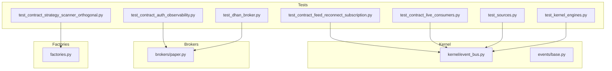

**Diagram sources**
- [test_contract_auth_observability.py:1-32](file://tests/test_contract_auth_observability.py#L1-L32)
- [test_contract_feed_reconnect_subscription.py:1-70](file://tests/test_contract_feed_reconnect_subscription.py#L1-L70)
- [test_contract_live_consumers.py:1-54](file://tests/test_contract_live_consumers.py#L1-L54)
- [test_contract_strategy_scanner_orthogonal.py:1-65](file://tests/test_contract_strategy_scanner_orthogonal.py#L1-L65)
- [test_dhan_broker.py:1-200](file://tests/test_dhan_broker.py#L1-L200)
- [test_sources.py:1-32](file://tests/test_sources.py#L1-L32)
- [test_kernel_engines.py:1-112](file://tests/test_kernel_engines.py#L1-L112)
- [event_bus.py:1-81](file://ntrade/kernel/event_bus.py#L1-L81)
- [base.py:1-22](file://ntrade/events/base.py#L1-L22)
- [paper.py:72-87](file://ntrade/brokers/paper.py#L72-L87)
- [factories.py:1-84](file://ntrade/factories.py#L1-L84)

**Section sources**
- [ARCHITECTURE.md:1-389](file://ARCHITECTURE.md#L1-L389)
- [pyproject.toml:1-25](file://pyproject.toml#L1-L25)

## Core Components
- EventBus: A tiny synchronous pub/sub bus with reentrant dispatch, MRO-based subscriptions, and history recording for replay.
- Event base: Frozen dataclass events with canonical timestamps from the TradingClock.
- Broker adapters: PaperBroker provides deterministic behavior for backtest/replay/live parity.
- Factories: InstrumentFactory and OptionFactory create domain objects consistently, enabling repeatable test fixtures.

Key responsibilities:
- EventBus ensures thread-safe publishing and swallows handler exceptions to protect the kernel.
- Events provide immutable, hashable payloads for deterministic replay and comparison.
- Broker adapters normalize wire formats into domain objects and expose capabilities.
- Factories centralize object creation and flyweight semantics via SymbolMaster.

**Section sources**
- [event_bus.py:1-81](file://ntrade/kernel/event_bus.py#L1-L81)
- [base.py:1-22](file://ntrade/events/base.py#L1-L22)
- [paper.py:72-87](file://ntrade/brokers/paper.py#L72-L87)
- [factories.py:1-84](file://ntrade/factories.py#L1-L84)

## Architecture Overview
Contract tests enforce boundaries between subsystems:
- Auth shutdown must not emit observability events.
- Reconnect must rebuild feeds with correct subscription codes and API version.
- Live runner consumers must be orthogonal: feed drop triggers risk halt; order timeout cancels orders only.
- Strategy registration must not reset scanner throttle cache.

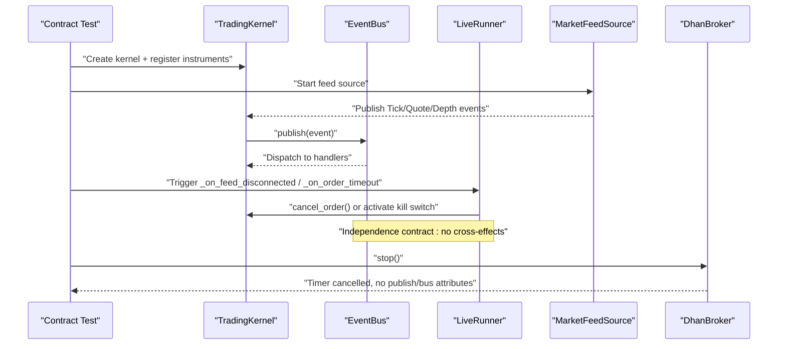

**Diagram sources**
- [test_contract_live_consumers.py:1-54](file://tests/test_contract_live_consumers.py#L1-L54)
- [test_contract_auth_observability.py:1-32](file://tests/test_contract_auth_observability.py#L1-L32)
- [test_contract_feed_reconnect_subscription.py:1-70](file://tests/test_contract_feed_reconnect_subscription.py#L1-L70)
- [event_bus.py:1-81](file://ntrade/kernel/event_bus.py#L1-L81)

## Detailed Component Analysis

### Auth Shutdown Independence Contract
Purpose: Ensure DhanBroker.stop() cancels the auth refresh timer and does not emit any observability/lifecycle events.

Key assertions:
- Refresh timer is set to None after stop().
- Broker has no bus or publish attributes, preventing accidental event emission.

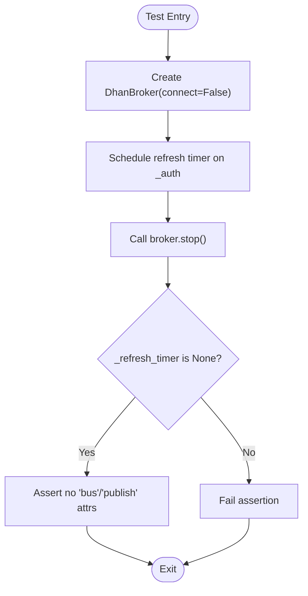

**Diagram sources**
- [test_contract_auth_observability.py:1-32](file://tests/test_contract_auth_observability.py#L1-L32)

**Section sources**
- [test_contract_auth_observability.py:1-32](file://tests/test_contract_auth_observability.py#L1-L32)

### Reconnect Subscription Code and Version Contract
Purpose: Guarantee that reconnect rebuilds the feed with the same subscription spec (code-21) and uses version v2.

Key assertions:
- After stop→start, a fresh feed is created.
- Subscriptions list equals expected tuples with code 21.
- All subscription tuples encode full-data code 21.

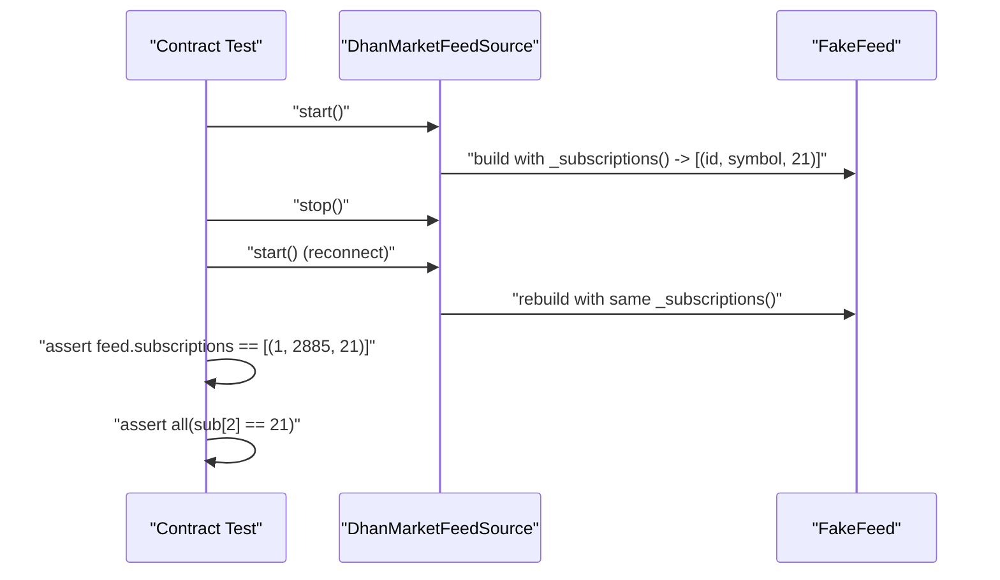

**Diagram sources**
- [test_contract_feed_reconnect_subscription.py:1-70](file://tests/test_contract_feed_reconnect_subscription.py#L1-L70)

**Section sources**
- [test_contract_feed_reconnect_subscription.py:1-70](file://tests/test_contract_feed_reconnect_subscription.py#L1-L70)

### Live Runner Consumers Orthogonality Contract
Purpose: Verify that feed disconnect triggers risk halt without cancelling orders, while order timeout cancels orders without halting.

Key assertions:
- FeedDisconnectedEvent results in RiskHaltedEvent and no cancel calls.
- OrderTimeoutEvent results in cancel_order call and no RiskHaltedEvent.

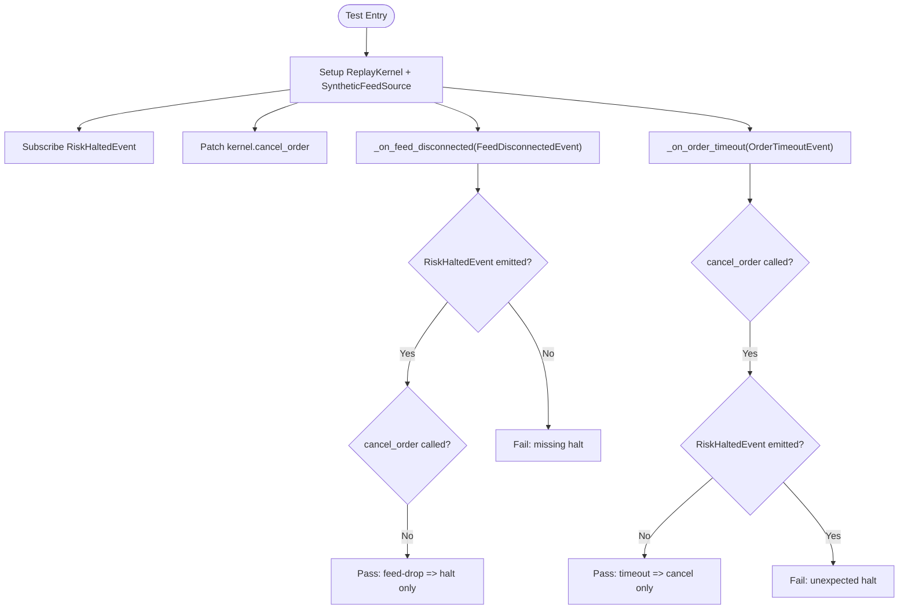

**Diagram sources**
- [test_contract_live_consumers.py:1-54](file://tests/test_contract_live_consumers.py#L1-L54)

**Section sources**
- [test_contract_live_consumers.py:1-54](file://tests/test_contract_live_consumers.py#L1-L54)

### Strategy Registration vs Scanner Throttle Contract
Purpose: Ensure registering a strategy does not reset the ScannerFacade’s rate-limit cache.

Key assertions:
- After warm scan, subsequent momentum() returns cached result without re-scanning.
- StrategyEngine names reflect new strategy, but scanner cache remains intact.

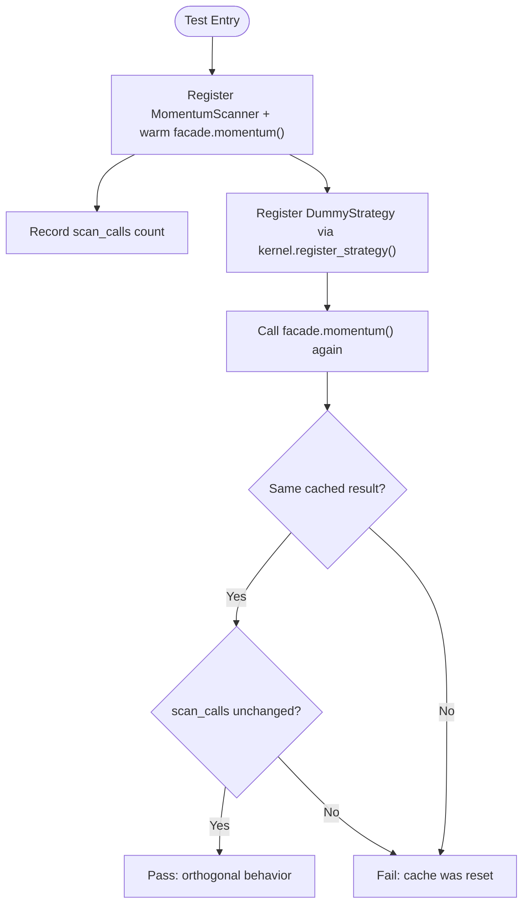

**Diagram sources**
- [test_contract_strategy_scanner_orthogonal.py:1-65](file://tests/test_contract_strategy_scanner_orthogonal.py#L1-L65)

**Section sources**
- [test_contract_strategy_scanner_orthogonal.py:1-65](file://tests/test_contract_strategy_scanner_orthogonal.py#L1-L65)

### Event Bus Behavior Under Concurrency
Purpose: Validate EventBus publishes deterministically, records history, and isolates handler errors.

Key behaviors:
- Handlers registered on base types receive subclass events via MRO.
- Handler exceptions are logged and swallowed.
- History is bounded and thread-safe.

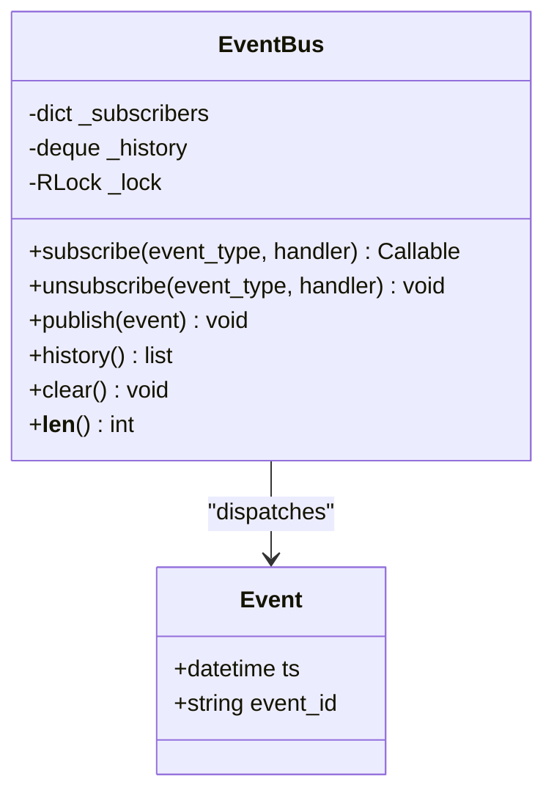

**Diagram sources**
- [event_bus.py:1-81](file://ntrade/kernel/event_bus.py#L1-L81)
- [base.py:1-22](file://ntrade/events/base.py#L1-L22)

**Section sources**
- [event_bus.py:1-81](file://ntrade/kernel/event_bus.py#L1-L81)
- [base.py:1-22](file://ntrade/events/base.py#L1-L22)

### Simulated Feed Source Contracts
Purpose: Confirm SimulatedFeedSource requires input, projects quotes, and emits ticks consistent with kernel history.

Key assertions:
- Construction without prices raises ValueError.
- Published ticks update instrument LTP and bus history length.

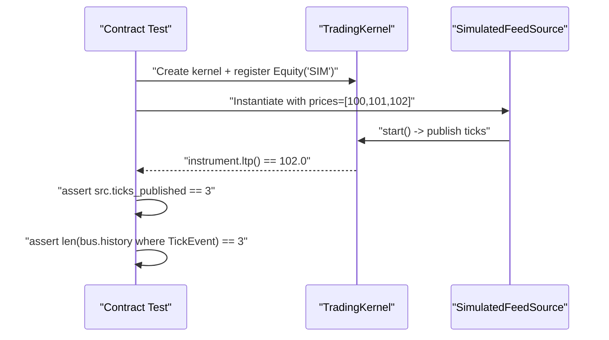

**Diagram sources**
- [test_sources.py:1-32](file://tests/test_sources.py#L1-L32)

**Section sources**
- [test_sources.py:1-32](file://tests/test_sources.py#L1-L32)

### Kernel Engines Projection Contracts
Purpose: Validate MarketEngine, CandleEngine, and IndicatorEngine projections and event emissions.

Key assertions:
- Tick events update instrument quote and stream last_tick.
- Candle engines close candles on bucket transitions and flush partials.
- Indicator engine publishes bundles and updates instrument analytics.

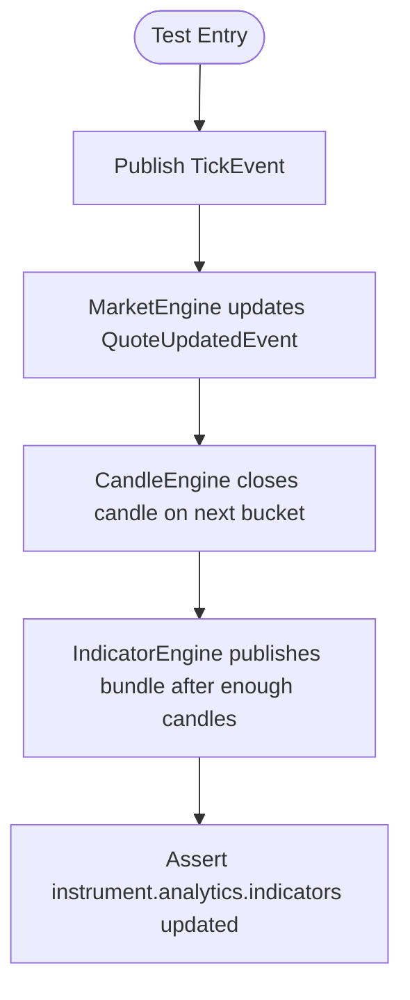

**Diagram sources**
- [test_kernel_engines.py:1-112](file://tests/test_kernel_engines.py#L1-L112)

**Section sources**
- [test_kernel_engines.py:1-112](file://tests/test_kernel_engines.py#L1-L112)

### Broker Adapter Contracts (PaperBroker)
Purpose: Ensure PaperBroker produces deterministic depth and historical data for parity.

Key behaviors:
- Depth levels derived from current quote with randomized quantities.
- Historical data seeded per symbol/timeframe and filtered by start/end.

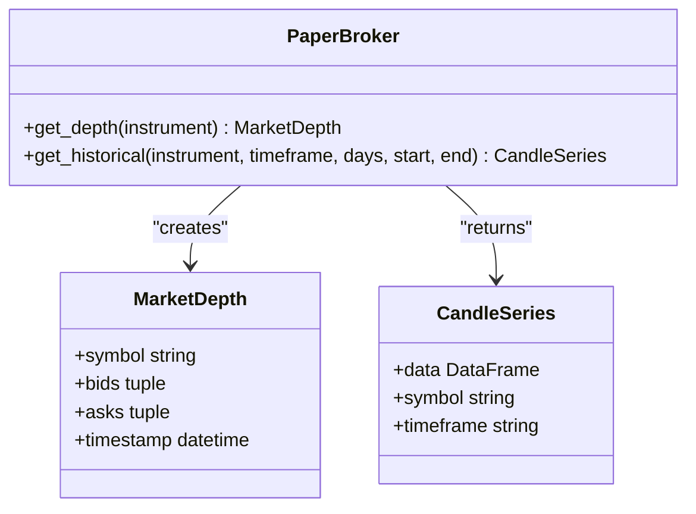

**Diagram sources**
- [paper.py:72-87](file://ntrade/brokers/paper.py#L72-L87)

**Section sources**
- [paper.py:72-87](file://ntrade/brokers/paper.py#L72-L87)

## Dependency Analysis
Contract tests depend on core kernel and event infrastructure to assert system-wide invariants.

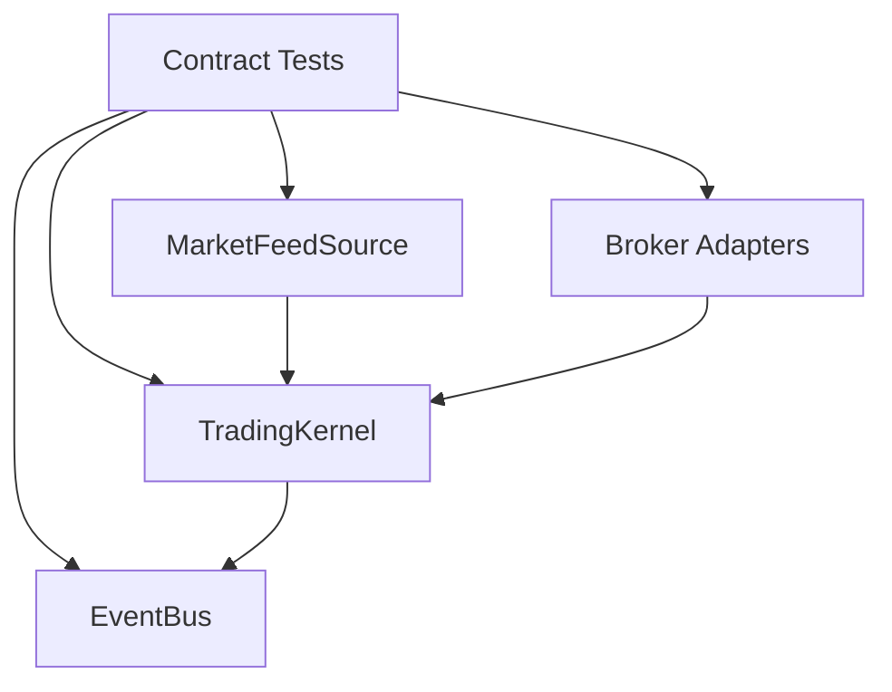

**Diagram sources**
- [test_contract_auth_observability.py:1-32](file://tests/test_contract_auth_observability.py#L1-L32)
- [test_contract_feed_reconnect_subscription.py:1-70](file://tests/test_contract_feed_reconnect_subscription.py#L1-L70)
- [test_contract_live_consumers.py:1-54](file://tests/test_contract_live_consumers.py#L1-L54)
- [test_contract_strategy_scanner_orthogonal.py:1-65](file://tests/test_contract_strategy_scanner_orthogonal.py#L1-L65)
- [event_bus.py:1-81](file://ntrade/kernel/event_bus.py#L1-L81)

**Section sources**
- [test_contract_auth_observability.py:1-32](file://tests/test_contract_auth_observability.py#L1-L32)
- [test_contract_feed_reconnect_subscription.py:1-70](file://tests/test_contract_feed_reconnect_subscription.py#L1-L70)
- [test_contract_live_consumers.py:1-54](file://tests/test_contract_live_consumers.py#L1-L54)
- [test_contract_strategy_scanner_orthogonal.py:1-65](file://tests/test_contract_strategy_scanner_orthogonal.py#L1-L65)
- [event_bus.py:1-81](file://ntrade/kernel/event_bus.py#L1-L81)

## Performance Considerations
- EventBus uses an RLock to serialize dispatch; keep handler logic lightweight to avoid blocking.
- Event history is bounded (maxlen); tune max_history based on memory constraints and replay needs.
- Simulated tick synthesis should use deterministic seeds to avoid randomness overhead in tests.
- PaperBroker randomization is suitable for tests; avoid heavy computations in production paths.

## Troubleshooting Guide
Common issues and resolutions:
- Missing bus/publish attributes in broker layer: Ensure broker adapters do not accidentally integrate event publishing during lifecycle methods.
- Reconnect misconfiguration: Verify _subscriptions() returns correct tuples and feed constructor receives version="v2".
- Live runner consumer interference: Isolate feed disconnect and order timeout handlers to prevent cross-effects.
- Scanner throttle resets: Ensure strategy registration does not clear facade caches.

**Section sources**
- [test_contract_auth_observability.py:1-32](file://tests/test_contract_auth_observability.py#L1-L32)
- [test_contract_feed_reconnect_subscription.py:1-70](file://tests/test_contract_feed_reconnect_subscription.py#L1-L70)
- [test_contract_live_consumers.py:1-54](file://tests/test_contract_live_consumers.py#L1-L54)
- [test_contract_strategy_scanner_orthogonal.py:1-65](file://tests/test_contract_strategy_scanner_orthogonal.py#L1-L65)

## Conclusion
The contract testing framework enforces critical invariants across the trading kernel, event bus, broker adapters, and live runner consumers. By focusing on behavioral contracts rather than implementation details, these tests maintain stability and predictability across live, replay, and backtest modes.

## Appendices
- Configuration: pytest defaults defined in pyproject.toml.
- Architecture overview: Layered design and dependency rules documented in ARCHITECTURE.md.

**Section sources**
- [pyproject.toml:1-25](file://pyproject.toml#L1-L25)
- [ARCHITECTURE.md:1-389](file://ARCHITECTURE.md#L1-L389)