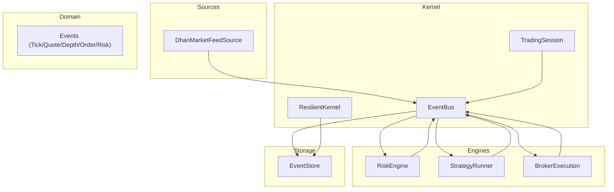
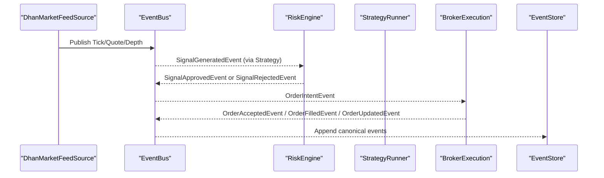
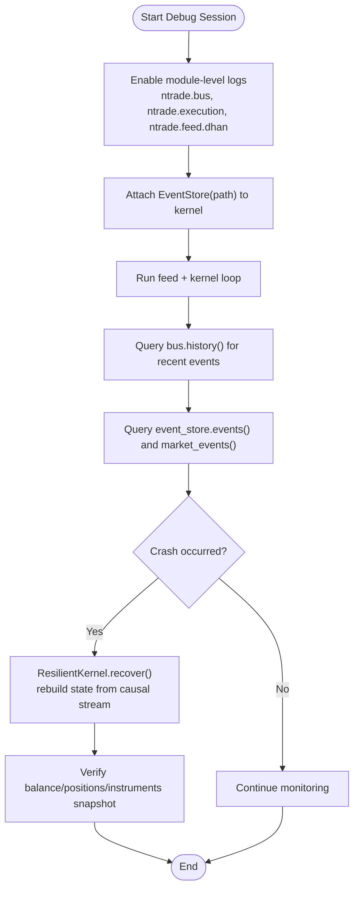
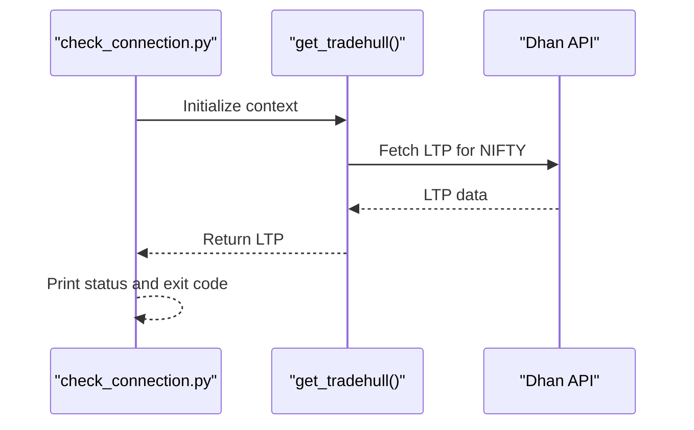
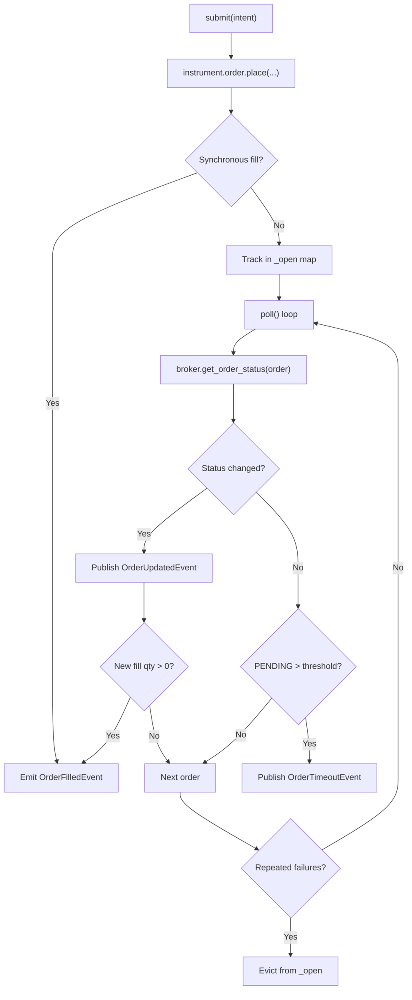
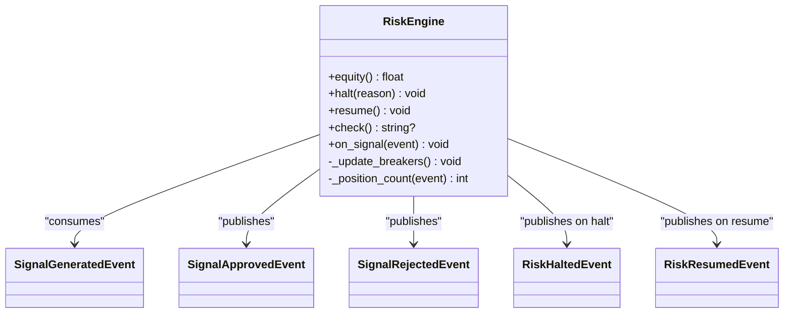
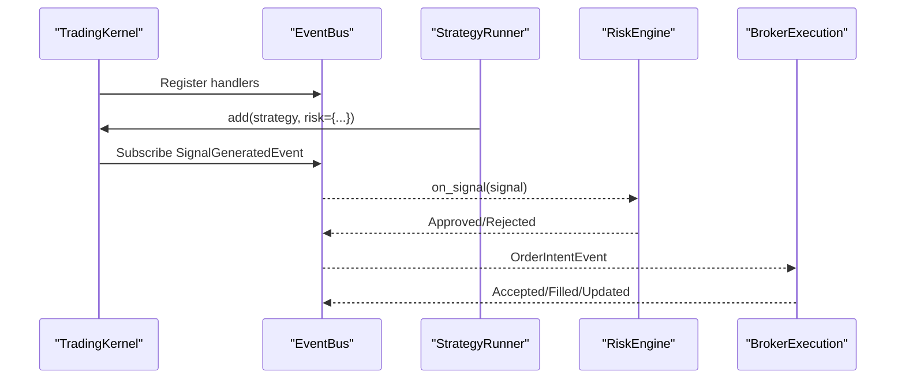
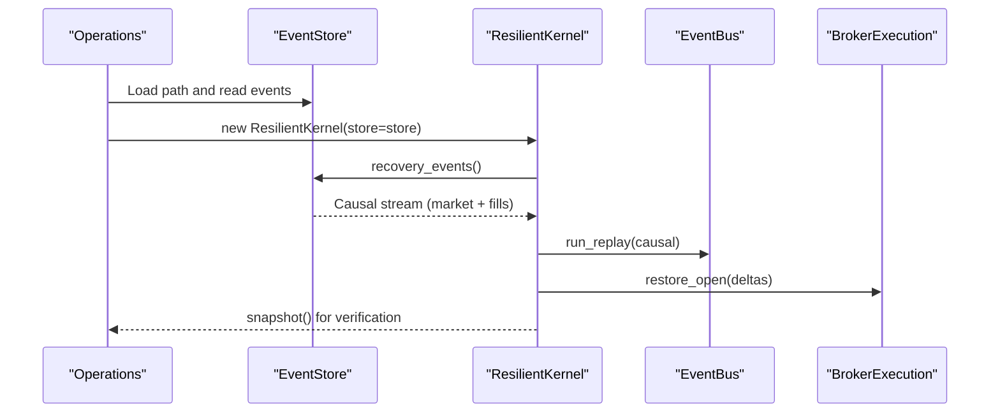
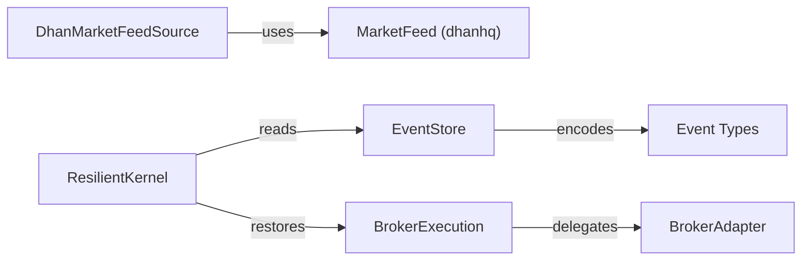

# Debugging & Troubleshooting

<cite>
**Referenced Files in This Document**
- [ARCHITECTURE.md](file://ARCHITECTURE.md)
- [facade.py](file://ntrade/facade.py)
- [event_bus.py](file://ntrade/kernel/event_bus.py)
- [base.py](file://ntrade/events/base.py)
- [risk_engine.py](file://ntrade/engines/risk_engine.py)
- [trading_session.py](file://ntrade/kernel/trading_session.py)
- [broker_executor.py](file://ntrade/execution/broker_executor.py)
- [dhan_feed.py](file://ntrade/sources/dhan_feed.py)
- [event_store.py](file://ntrade/storage/event_store.py)
- [resilient.py](file://ntrade/kernel/resilient.py)
- [runner.py](file://ntrade/kernel/runner.py)
- [live_runner_run.py](file://scripts/live_runner_run.py)
- [check_connection.py](file://check_connection.py)
</cite>

## Table of Contents
1. [Introduction](#introduction)
2. [Project Structure](#project-structure)
3. [Core Components](#core-components)
4. [Architecture Overview](#architecture-overview)
5. [Detailed Component Analysis](#detailed-component-analysis)
6. [Dependency Analysis](#dependency-analysis)
7. [Performance Considerations](#performance-considerations)
8. [Troubleshooting Guide](#troubleshooting-guide)
9. [Conclusion](#conclusion)
10. [Appendices](#appendices)

## Introduction
This document provides a comprehensive debugging and troubleshooting guide for nTrade development. It focuses on event tracing, log analysis, state inspection, structured logging, distributed tracing patterns, and recovery procedures across the event-driven trading kernel. It also covers common issues with broker connections, market data streaming, order execution failures, risk engine triggers, memory leaks, performance bottlenecks, concurrency problems, and production debugging techniques.

## Project Structure
nTrade is an event-centric trading framework organized into layers: public facade, trading kernel (event bus, engines), domain layer, broker adapters, and infrastructure (feeds, storage, replay). The kernel orchestrates events through engines (market, candle, indicator, strategy, risk, order, portfolio) and execution targets (simulated or broker). EventStore records canonical events for deterministic replay and crash recovery.

**Diagram sources**
- [event_bus.py:1-81](file://ntrade/kernel/event_bus.py#L1-L81)
- [risk_engine.py:1-141](file://ntrade/engines/risk_engine.py#L1-L141)
- [runner.py:1-161](file://ntrade/kernel/runner.py#L1-L161)
- [broker_executor.py:1-262](file://ntrade/execution/broker_executor.py#L1-L262)
- [dhan_feed.py:1-233](file://ntrade/sources/dhan_feed.py#L1-L233)
- [event_store.py:1-236](file://ntrade/storage/event_store.py#L1-L236)
- [trading_session.py:1-306](file://ntrade/kernel/trading_session.py#L1-L306)
- [resilient.py:1-147](file://ntrade/kernel/resilient.py#L1-L147)

**Section sources**
- [ARCHITECTURE.md:1-389](file://ARCHITECTURE.md#L1-L389)

## Core Components
- EventBus: Synchronous pub/sub with serialized dispatch and handler error isolation; maintains bounded history for replay and diagnostics.
- Events: Frozen dataclasses carrying kernel-clock timestamps to ensure determinism across live/replay/backtest.
- RiskEngine: Screens signals via static limits and circuit breakers; publishes halt/resume events.
- BrokerExecution: Routes order intents to brokers, tracks open orders, emits lifecycle events, supports partial fills and timeouts.
- DhanMarketFeedSource: Adapts Dhan websocket payloads to canonical events; robust against malformed payloads and connection states.
- EventStore: Append-only JSONL store for audit, replay, and crash recovery; reconstructs causal streams and open-order deltas.
- ResilientKernel: Replays causal events to rebuild state without re-trading; restores execution sequences and open-order trackers.
- TradingSession: Unified entry point combining broker, kernel, and strategy runner; exposes account/portfolio/orderbook APIs.

**Section sources**
- [event_bus.py:1-81](file://ntrade/kernel/event_bus.py#L1-L81)
- [base.py:1-22](file://ntrade/events/base.py#L1-L22)
- [risk_engine.py:1-141](file://ntrade/engines/risk_engine.py#L1-L141)
- [broker_executor.py:1-262](file://ntrade/execution/broker_executor.py#L1-L262)
- [dhan_feed.py:1-233](file://ntrade/sources/dhan_feed.py#L1-L233)
- [event_store.py:1-236](file://ntrade/storage/event_store.py#L1-L236)
- [resilient.py:1-147](file://ntrade/kernel/resilient.py#L1-L147)
- [trading_session.py:1-306](file://ntrade/kernel/trading_session.py#L1-L306)

## Architecture Overview
The system follows Clean Architecture principles with layered separation and zero parity across modes. The kernel wires engines around a shared EventBus; event sources (feed, replay, backtest) publish canonical events; execution targets route intents to simulated or real brokers. EventStore enables deterministic replay and crash recovery.

**Diagram sources**
- [dhan_feed.py:1-233](file://ntrade/sources/dhan_feed.py#L1-L233)
- [event_bus.py:1-81](file://ntrade/kernel/event_bus.py#L1-L81)
- [risk_engine.py:1-141](file://ntrade/engines/risk_engine.py#L1-L141)
- [runner.py:1-161](file://ntrade/kernel/runner.py#L1-L161)
- [broker_executor.py:1-262](file://ntrade/execution/broker_executor.py#L1-L262)
- [event_store.py:1-236](file://ntrade/storage/event_store.py#L1-L236)

## Detailed Component Analysis

### Event Tracing and State Inspection
- Use EventBus.history to inspect recent events and verify flow correctness.
- Inspect EventStore for full audit trail and causal ordering; use market_events() for replay-only market stream.
- For crash recovery, rely on ResilientKernel.recovery_events() and open_order_deltas() to rebuild state deterministically.

**Diagram sources**
- [event_bus.py:1-81](file://ntrade/kernel/event_bus.py#L1-L81)
- [event_store.py:1-236](file://ntrade/storage/event_store.py#L1-L236)
- [resilient.py:1-147](file://ntrade/kernel/resilient.py#L1-L147)

**Section sources**
- [event_bus.py:1-81](file://ntrade/kernel/event_bus.py#L1-L81)
- [event_store.py:1-236](file://ntrade/storage/event_store.py#L1-L236)
- [resilient.py:1-147](file://ntrade/kernel/resilient.py#L1-L147)

### Logging Levels and Structured Logging
- Module-level loggers:
  - ntrade.bus: Event dispatch errors and warnings.
  - ntrade.execution: Order lifecycle (accepted, filled, rejected, timeout).
  - ntrade.feed.dhan: Feed errors, disconnects, and payload ingestion metrics.
- Recommended levels:
  - INFO for fills and key lifecycle transitions.
  - WARNING for stale orders, timeouts, feed closures.
  - ERROR for transport errors and unexpected payloads.
- Structured logging tips:
  - Include symbol, exchange, order_id, side, quantity, price, strategy name.
  - Avoid printing large payloads; prefer IDs and counts.
  - Ensure thread-safe logging by using standard Python logging.

**Section sources**
- [event_bus.py:1-81](file://ntrade/kernel/event_bus.py#L1-L81)
- [broker_executor.py:1-262](file://ntrade/execution/broker_executor.py#L1-L262)
- [dhan_feed.py:1-233](file://ntrade/sources/dhan_feed.py#L1-L233)

### Distributed Tracing Patterns
- Use event_id and ts fields to correlate events across components.
- Propagate strategy names and order_id through intent and fill events.
- Build traces by correlating:
  - Tick/Quote/Depth → SignalGenerated → SignalApproved → OrderAccepted → OrderFilled.
- For multi-engine workflows, tag events with session_id and mode (live/replay/backtest).

**Section sources**
- [base.py:1-22](file://ntrade/events/base.py#L1-L22)
- [broker_executor.py:1-262](file://ntrade/execution/broker_executor.py#L1-L262)
- [risk_engine.py:1-141](file://ntrade/engines/risk_engine.py#L1-L141)

### Broker Connections and Market Data Streaming
- Connection checks:
  - Use check_connection.py to validate credentials and LTP fetch.
- Feed warmup:
  - DhanMarketFeedSource.wait_ready(timeout, min_ticks) ensures connectivity and initial ticks before starting strategies.
- Payload mapping:
  - dhan_payload_to_events skips unknown securities and malformed fields; monitor payloads_ingested to detect stalls.
- Disconnect handling:
  - FeedDisconnectedEvent published on close; LiveRunner should react by pausing trading and alerting.

**Diagram sources**
- [check_connection.py:1-43](file://check_connection.py#L1-L43)

**Section sources**
- [check_connection.py:1-43](file://check_connection.py#L1-L43)
- [dhan_feed.py:1-233](file://ntrade/sources/dhan_feed.py#L1-L233)

### Order Execution Failures and Partial Fills
- Submission:
  - BrokerExecution.submit places orders via instrument.order.place; immediate acceptance published; synchronous brokers may emit fills immediately.
- Polling:
  - poll() refreshes status, emits updates and fills; handles timeouts after threshold; evicts stale orders after repeated failures.
- Partial fills:
  - _emit_fill computes delta since last poll; idempotent and safe for repeated calls.
- Crash recovery:
  - restore_open rebuilds per-order filled/remaining state from EventStore.open_order_deltas().

**Diagram sources**
- [broker_executor.py:1-262](file://ntrade/execution/broker_executor.py#L1-L262)

**Section sources**
- [broker_executor.py:1-262](file://ntrade/execution/broker_executor.py#L1-L262)

### Risk Engine Triggers and Circuit Breakers
- Screening:
  - Allowlist, max_quantity, max_notional, max_positions checked per signal.
- Circuit breakers:
  - max_daily_loss, max_drawdown_pct, price_deviation_pct; halt prevents further approvals until resume.
- Events:
  - RiskHaltedEvent and RiskResumedEvent published; LiveRunner activates kill switch on halt.

**Diagram sources**
- [risk_engine.py:1-141](file://ntrade/engines/risk_engine.py#L1-L141)

**Section sources**
- [risk_engine.py:1-141](file://ntrade/engines/risk_engine.py#L1-L141)

### Event-Driven Architecture Debugging
- Event flow visualization:
  - Use bus.history() to trace sequence; filter by event_type and symbol via EventStore.
- State synchronization:
  - Ensure instruments are registered before feeding events; verify kernel.start() called; confirm feed.running and wait_ready succeeded.
- Multi-strategy management:
  - StrategyRunner isolates per-strategy risk; use status() to inspect approved/rejected counts and limits.

**Diagram sources**
- [runner.py:1-161](file://ntrade/kernel/runner.py#L1-L161)
- [risk_engine.py:1-141](file://ntrade/engines/risk_engine.py#L1-L141)
- [broker_executor.py:1-262](file://ntrade/execution/broker_executor.py#L1-L262)
- [event_bus.py:1-81](file://ntrade/kernel/event_bus.py#L1-L81)

**Section sources**
- [runner.py:1-161](file://ntrade/kernel/runner.py#L1-L161)
- [event_bus.py:1-81](file://ntrade/kernel/event_bus.py#L1-L81)

### Memory Leaks, Performance Bottlenecks, and Concurrency
- Memory:
  - EventBus._history bounded via maxlen; monitor len(bus) and event_store length; clear periodically if needed.
- Performance:
  - Benchmark tick throughput using scripts/benchmark_latency.py; reduce poll_interval carefully; avoid heavy computations in handlers.
- Concurrency:
  - EventBus uses RLock to serialize dispatch; ensure handlers do not block long; avoid direct broker calls inside handlers—use events.

**Section sources**
- [event_bus.py:1-81](file://ntrade/kernel/event_bus.py#L1-L81)
- [event_store.py:1-236](file://ntrade/storage/event_store.py#L1-L236)

### Production Debugging Techniques and Crash Analysis
- Audit trail:
  - Persist EventStore(path); query events(symbol=...) for targeted analysis.
- Crash recovery:
  - ResilientKernel.recover() rebuilds state from causal stream; verify snapshot() post-recovery; ensure no strategies attached during recovery.
- Open-order restoration:
  - EventStore.open_order_deltas() feeds BrokerExecution.restore_open() to continue partial fills correctly.

**Diagram sources**
- [event_store.py:1-236](file://ntrade/storage/event_store.py#L1-L236)
- [resilient.py:1-147](file://ntrade/kernel/resilient.py#L1-L147)
- [broker_executor.py:1-262](file://ntrade/execution/broker_executor.py#L1-L262)

**Section sources**
- [event_store.py:1-236](file://ntrade/storage/event_store.py#L1-L236)
- [resilient.py:1-147](file://ntrade/kernel/resilient.py#L1-L147)
- [broker_executor.py:1-262](file://ntrade/execution/broker_executor.py#L1-L262)

### Debugging Custom Strategies, Indicators, and Broker Integrations
- Strategies:
  - Use StrategyRunner.status() to inspect enabled state and risk counters; hot detach/remove via remove(name).
- Indicators:
  - Validate computed bundles via Instrument.indicators; ensure timeframe alignment with candles.
- Broker integrations:
  - Mock broker methods for tests; verify place_order and get_order_status behavior; use paper broker for parity testing.

**Section sources**
- [runner.py:1-161](file://ntrade/kernel/runner.py#L1-L161)
- [trading_session.py:1-306](file://ntrade/kernel/trading_session.py#L1-L306)

## Dependency Analysis
Key dependencies and coupling:
- DhanMarketFeedSource depends on dhanhq.MarketFeed; abstracted via feed_factory for testability.
- BrokerExecution depends on BrokerAdapter contract; decouples kernel from transport details.
- EventStore depends on canonical event types; resilient decoding skips unknown types gracefully.
- ResilientKernel depends on EventStore and router targets; one-shot recovery enforced.

**Diagram sources**
- [dhan_feed.py:1-233](file://ntrade/sources/dhan_feed.py#L1-L233)
- [broker_executor.py:1-262](file://ntrade/execution/broker_executor.py#L1-L262)
- [event_store.py:1-236](file://ntrade/storage/event_store.py#L1-L236)
- [resilient.py:1-147](file://ntrade/kernel/resilient.py#L1-L147)

**Section sources**
- [dhan_feed.py:1-233](file://ntrade/sources/dhan_feed.py#L1-L233)
- [broker_executor.py:1-262](file://ntrade/execution/broker_executor.py#L1-L262)
- [event_store.py:1-236](file://ntrade/storage/event_store.py#L1-L236)
- [resilient.py:1-147](file://ntrade/kernel/resilient.py#L1-L147)

## Performance Considerations
- Keep handler logic lightweight; offload heavy work to background tasks.
- Tune poll_interval and sync_interval based on latency benchmarks.
- Monitor bus.history length and EventStore size; implement periodic cleanup if necessary.
- Use synthetic feed for offline rehearsal to minimize live risks and measure throughput.

[No sources needed since this section provides general guidance]

## Troubleshooting Guide

### Common Issues and Resolutions
- Broker connection failures:
  - Run check_connection.py to validate credentials and LTP fetch; ensure environment variables are set.
- Market data stalls:
  - Verify feed.wait_ready(min_ticks); inspect payloads_ingested; check for malformed payloads or unknown security_ids.
- Order execution timeouts:
  - Review poll() logs for stale orders; increase timeout thresholds if needed; ensure broker.get_order_status succeeds.
- Risk halts:
  - Check RiskEngine.halt_reason; review daily loss and drawdown metrics; resume only after corrective action.
- Memory growth:
  - Inspect bus.history length; consider clearing or limiting history; monitor EventStore file size.
- Concurrency anomalies:
  - Ensure handlers do not block; rely on EventBus serialization; avoid direct shared state mutations outside events.

**Section sources**
- [check_connection.py:1-43](file://check_connection.py#L1-L43)
- [dhan_feed.py:1-233](file://ntrade/sources/dhan_feed.py#L1-L233)
- [broker_executor.py:1-262](file://ntrade/execution/broker_executor.py#L1-L262)
- [risk_engine.py:1-141](file://ntrade/engines/risk_engine.py#L1-L141)
- [event_bus.py:1-81](file://ntrade/kernel/event_bus.py#L1-L81)

### Diagnostic Tools and Utilities
- Live runner harness:
  - scripts/live_runner_run.py runs synth or live feed; prints summary including ticks, polls, fills, and balance.
- Connection checker:
  - check_connection.py validates Tradehull connectivity and balance retrieval.
- Observability tests:
  - Use caplog to assert log outputs for fills and lifecycle events.

**Section sources**
- [live_runner_run.py:1-69](file://scripts/live_runner_run.py#L1-L69)
- [check_connection.py:1-43](file://check_connection.py#L1-L43)

## Conclusion
nTrade’s event-driven architecture provides robust debugging and recovery capabilities through structured logging, canonical events, and deterministic replay. By leveraging EventBus history, EventStore auditing, and ResilientKernel recovery, developers can diagnose issues across broker connections, market data streaming, order execution, and risk controls. Adopting the recommended practices ensures reliable development, testing, and production operations.

[No sources needed since this section summarizes without analyzing specific files]

## Appendices

### Quick Reference: Entry Points and Facades
- Legacy facade: Market(broker="dhan") delegates to TradingSession for unified access.
- Preferred entry: TradingSession.connect("dhan") returns a session with kernel and runner pre-wired.

**Section sources**
- [facade.py:1-101](file://ntrade/facade.py#L1-L101)
- [trading_session.py:1-306](file://ntrade/kernel/trading_session.py#L1-L306)