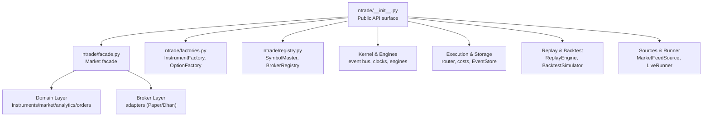
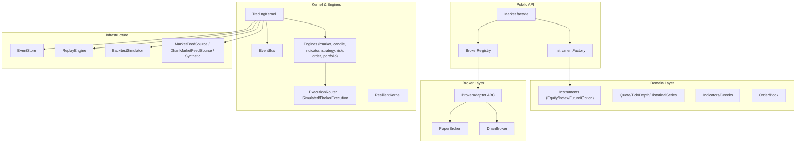
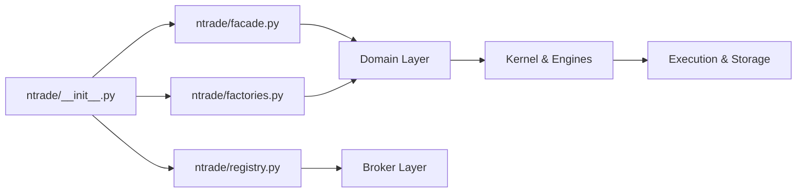

# Development Workflow & Best Practices

<cite>
**Referenced Files in This Document**
- [ARCHITECTURE.md](file://ARCHITECTURE.md)
- [pyproject.toml](file://pyproject.toml)
- [ntrade/__init__.py](file://ntrade/__init__.py)
- [ntrade/facade.py](file://ntrade/facade.py)
- [ntrade/factories.py](file://ntrade/factories.py)
- [ntrade/registry.py](file://ntrade/registry.py)
- [.agents/skills/dhan-tradehull/SKILL.md](file://.agents/skills/dhan-tradehull/SKILL.md)
- [.agents/skills/dhan-tradehull/references/coding-style.md](file://.agents/skills/dhan-tradehull/references/coding-style.md)
- [.agents/skills/dhan-tradehull/references/deployment.md](file://.agents/skills/dhan-tradehull/references/deployment.md)
- [.agents/skills/dhan-tradehull/references/algo-dev-workflow.md](file://.agents/skills/dhan-tradehull/references/algo-dev-workflow.md)
- [tests/test_factories_facade.py](file://tests/test_factories_facade.py)
- [tests/test_broker_executor.py](file://tests/test_broker_executor.py)
</cite>

## Table of Contents
1. [Introduction](#introduction)
2. [Project Structure](#project-structure)
3. [Core Components](#core-components)
4. [Architecture Overview](#architecture-overview)
5. [Detailed Component Analysis](#detailed-component-analysis)
6. [Dependency Analysis](#dependency-analysis)
7. [Performance Considerations](#performance-considerations)
8. [Troubleshooting Guide](#troubleshooting-guide)
9. [Conclusion](#conclusion)
10. [Appendices](#appendices)

## Introduction
This document defines the nTrade development workflow and best practices. It covers project setup, dependency management via pyproject.toml, virtual environment configuration, code organization principles from ARCHITECTURE.md, and the end-to-end lifecycle for feature development, testing, code review, and deployment. It also documents coding standards, naming conventions, documentation requirements, version control practices, branching strategies, release management, CI/CD guidance, and contribution guidelines with backward compatibility considerations.

## Project Structure
nTrade is organized as a layered Python package:
- Public API surface and entry points live at the package root (facade, factories, registry).
- Domain layer contains pure domain objects (instruments, market data, analytics, orders).
- Broker adapters abstract broker-specific implementations behind a common interface.
- Kernel and engines implement an event-centric trading kernel with zero parity across live, replay, and backtest modes.
- Execution, storage, replay, backtest, sources, scanners, sim, and runner provide infrastructure and orchestration.
- tests contain offline unit and integration tests.

**Diagram sources**
- [ntrade/__init__.py](file://ntrade/__init__.py)
- [ntrade/facade.py](file://ntrade/facade.py)
- [ntrade/factories.py](file://ntrade/factories.py)
- [ntrade/registry.py](file://ntrade/registry.py)

**Section sources**
- [ARCHITECTURE.md](file://ARCHITECTURE.md)
- [ntrade/__init__.py](file://ntrade/__init__.py)

## Core Components
Key components that shape the development workflow:
- Market facade: thin adapter over TradingSession; provides legacy public API and delegates to unified session.
- InstrumentFactory: single creation entry point bound to a broker; uses SymbolMaster flyweight for shared instances.
- SymbolMaster: flyweight cache keyed by (kind, symbol, exchange), thread-safe via reentrant lock.
- BrokerRegistry: name-to-factory mapping with default brokers registered lazily; supports dynamic registration.

These components enforce dependency injection, zero-parity execution, and extensibility through capability patterns.

**Section sources**
- [ntrade/facade.py](file://ntrade/facade.py)
- [ntrade/factories.py](file://ntrade/factories.py)
- [ntrade/registry.py](file://ntrade/registry.py)

## Architecture Overview
nTrade follows Clean Architecture with a strict dependency rule: the domain layer imports nothing from the broker layer. Instruments receive a BrokerAdapter via constructor injection and access broker capabilities through a capability facade resolved at call time. The kernel is event-centric with zero parity across live, replay, and backtest modes.

**Diagram sources**
- [ARCHITECTURE.md](file://ARCHITECTURE.md)
- [ntrade/facade.py](file://ntrade/facade.py)
- [ntrade/factories.py](file://ntrade/factories.py)
- [ntrade/registry.py](file://ntrade/registry.py)

## Detailed Component Analysis

### Project Setup and Virtual Environment
- Use a modern Python build system defined in pyproject.toml.
- Install dependencies and optional dev tools via pip using the project’s metadata.
- Create and activate a virtual environment before installing to isolate dependencies.
- Configure pytest via pyproject.toml testpaths.

Recommended steps:
- Create venv and activate it.
- Install project with optional dev extras.
- Verify installation and run tests.

**Section sources**
- [pyproject.toml](file://pyproject.toml)

### Dependency Management with pyproject.toml
- Build system uses setuptools with minimum required versions.
- Project metadata includes name, version, description, requires-python, and core dependencies.
- Optional dev dependencies include pytest.
- Package discovery includes ntrade* packages.
- Pytest configuration sets testpaths to tests.

Best practices:
- Pin major versions for stability; allow minor/patch updates.
- Keep dev dependencies separate via optional-dependencies.
- Validate Python version constraints align with your runtime.

**Section sources**
- [pyproject.toml](file://pyproject.toml)

### Code Organization Principles and Module Structure
- Public API surface exports domain objects, events, kernel components, execution, and utilities.
- Domain layer remains broker-agnostic; broker adapters normalize wire formats into domain objects.
- Capability pattern enables adding broker features without modifying base classes.
- Factory + Flyweight + Registry patterns ensure consistent object creation and shared state.

Guidelines:
- Place new asset classes under domain/instruments and register via factory.
- Implement new analytics as pure functions over OHLCV and integrate into compute_bundle.
- Extend broker support by subclassing BrokerAdapter and registering capabilities.

**Section sources**
- [ARCHITECTURE.md](file://ARCHITECTURE.md)
- [ntrade/__init__.py](file://ntrade/__init__.py)

### Development Lifecycle: Feature Development, Testing, Review, Deployment
- Feature development follows the algo development workflow: auth → market data → signal → order → monitor/exit → optional UI.
- Testing: use pytest; maintain unit tests for factories, registry, facade, and execution behavior.
- Code review: adhere to coding style and patterns; validate zero-parity behavior across modes.
- Deployment: use server deployment practices; prefer lifetime PIN authentication for always-on algos.

Workflow references:
- Auth, market data, indicators, options, orders, portfolio, utilities, coding style, UI, errors, and deployment are covered in skill references.

**Section sources**
- [.agents/skills/dhan-tradehull/references/algo-dev-workflow.md](file://.agents/skills/dhan-tradehull/references/algo-dev-workflow.md)
- [.agents/skills/dhan-tradehull/references/coding-style.md](file://.agents/skills/dhan-tradehull/references/coding-style.md)
- [.agents/skills/dhan-tradehull/references/deployment.md](file://.agents/skills/dhan-tradehull/references/deployment.md)
- [tests/test_factories_facade.py](file://tests/test_factories_facade.py)
- [tests/test_broker_executor.py](file://tests/test_broker_executor.py)

### Coding Standards and Naming Conventions
- Vertical alignment of assignments within blocks.
- Named boolean conditions bc1/bc2/sc1/sc2 for buy/sell logic.
- Block comments with divider lines separating logical sections.
- Flat sequential structure; avoid deep nesting.
- try/except only around order placement calls; check return values for rejections.
- Orderbook dict as state machine; set all keys at once; reset on exit.
- Time guards at loop top; constants UPPERCASE; f-string prints with timestamp prefix; logs saved per day.

Adopt these patterns consistently when writing strategies or extensions.

**Section sources**
- [.agents/skills/dhan-tradehull/references/coding-style.md](file://.agents/skills/dhan-tradehull/references/coding-style.md)

### Documentation Requirements
- Maintain clear module docstrings describing responsibilities and usage.
- Follow ARCHITECTURE.md for design rationale and extensibility guidelines.
- Include examples in scripts or examples directories where applicable.
- Keep references up to date for broker APIs and deployment practices.

**Section sources**
- [ARCHITECTURE.md](file://ARCHITECTURE.md)

### Creating New Features Following Established Patterns
- Add new instrument types under domain/instruments; set KIND and DEFAULT_EXCHANGE; update factory methods if needed.
- Implement new analytics as pure functions over OHLCV; integrate into compute_bundle or as Instrument methods delegating there.
- Extend broker support by subclassing BrokerAdapter; implement get_quote, get_historical, place_order; add @capability(name, brokers=("you",)).
- Ensure zero parity by running identical strategies across live, replay, and backtest modes.

**Section sources**
- [ARCHITECTURE.md](file://ARCHITECTURE.md)

### Implementing Custom Brokers
- Subclass BrokerAdapter and implement required methods.
- Register the broker via BrokerRegistry.register(name, factory).
- Normalize broker-specific wire formats into domain objects at the adapter boundary.
- Use capability decorators to expose broker-specific features selectively.

**Section sources**
- [ARCHITECTURE.md](file://ARCHITECTURE.md)
- [ntrade/registry.py](file://ntrade/registry.py)

### Extending the Domain Model
- Add new states or behaviors to instruments while keeping them broker-agnostic.
- Use constructor injection to pass BrokerAdapter instances.
- Leverage capability facade for dynamic resolution of broker features.

**Section sources**
- [ARCHITECTURE.md](file://ARCHITECTURE.md)

### Version Control Practices and Branching Strategy
- Use feature branches per change; keep commits atomic and descriptive.
- Prefer rebasing onto main for linear history; squash merges for clean releases.
- Tag releases with semantic versioning aligned with pyproject.toml version.
- Maintain CHANGELOG entries for notable changes and deprecations.

[No sources needed since this section provides general guidance]

### Release Management
- Update version in pyproject.toml and __version__ in package init.
- Run full test suite and lint checks locally before tagging.
- Publish artifacts using setuptools build backend configured in pyproject.toml.
- Announce breaking changes and migration notes in release docs.

**Section sources**
- [pyproject.toml](file://pyproject.toml)
- [ntrade/__init__.py](file://ntrade/__init__.py)

### Continuous Integration and Automated Testing
- Configure CI to install dependencies via pyproject.toml and run pytest against tests directory.
- Cache dependencies to speed up builds; run linting and type checks if available.
- Enforce branch protection rules requiring passing CI checks.
- Automate publishing on tagged releases.

[No sources needed since this section provides general guidance]

### Deployment Automation
- Use systemd units for long-running processes; prefer pin_totp authentication for lifetime sessions.
- Detach processes with setsid or nohup; manage logs and restart policies.
- Monitor ports and memory/CPU usage; scale horizontally with care due to rate limits.

**Section sources**
- [.agents/skills/dhan-tradehull/references/deployment.md](file://.agents/skills/dhan-tradehull/references/deployment.md)

### Contributing Guidelines and Code Review Processes
- Follow coding style and patterns strictly; use named booleans and flat structure.
- Write tests for new functionality; ensure existing tests pass.
- Provide clear PR descriptions referencing architecture decisions and trade-offs.
- Maintain backward compatibility; deprecate gradually with migration paths.

**Section sources**
- [.agents/skills/dhan-tradehull/references/coding-style.md](file://.agents/skills/dhan-tradehull/references/coding-style.md)
- [ARCHITECTURE.md](file://ARCHITECTURE.md)

### Maintaining Backward Compatibility
- Keep legacy facade (Market) for backward compatibility while preferring TradingSession.
- Avoid breaking changes in public API; introduce deprecation warnings before removal.
- Validate zero parity across modes to prevent regressions.

**Section sources**
- [ntrade/facade.py](file://ntrade/facade.py)
- [ARCHITECTURE.md](file://ARCHITECTURE.md)

## Dependency Analysis
The public API surface exposes domain objects, events, kernel components, execution, and utilities. Factories and registries manage object creation and broker resolution. Domain layer remains independent of broker implementations.

**Diagram sources**
- [ntrade/__init__.py](file://ntrade/__init__.py)
- [ntrade/facade.py](file://ntrade/facade.py)
- [ntrade/factories.py](file://ntrade/factories.py)
- [ntrade/registry.py](file://ntrade/registry.py)

**Section sources**
- [ntrade/__init__.py](file://ntrade/__init__.py)
- [ntrade/facade.py](file://ntrade/facade.py)
- [ntrade/factories.py](file://ntrade/factories.py)
- [ntrade/registry.py](file://ntrade/registry.py)

## Performance Considerations
- Use flyweight caching for instruments to reduce memory footprint and ensure shared state.
- Prefer event-driven processing; avoid polling loops where possible.
- Batch historical data fetches and leverage caching mechanisms in HistoricalSeries.
- Measure throughput with benchmarking scripts; optimize hot paths in engines and feed sources.

[No sources needed since this section provides general guidance]

## Troubleshooting Guide
Common issues and resolutions:
- Broker rejections: capture stdout around order placement; log both request and raw reply; parse reasons even when fields are None.
- Stale orders: poll executor to evict orders after max failures; handle network errors gracefully.
- Token expiration: refresh daily tokens or switch to pin_totp for lifetime sessions.
- Port conflicts: kill by port rather than process name; verify new PID owns the port.

**Section sources**
- [.agents/skills/dhan-tradehull/references/coding-style.md](file://.agents/skills/dhan-tradehull/references/coding-style.md)
- [tests/test_broker_executor.py](file://tests/test_broker_executor.py)
- [.agents/skills/dhan-tradehull/references/deployment.md](file://.agents/skills/dhan-tradehull/references/deployment.md)

## Conclusion
nTrade provides a robust, event-centric trading framework with strong separation of concerns, zero parity across execution modes, and extensible broker adapters. By following the documented setup, coding standards, and lifecycle practices, contributors can develop features reliably, maintain backward compatibility, and deploy confidently.

[No sources needed since this section summarizes without analyzing specific files]

## Appendices

### Quick Start Checklist
- Set up venv and install project with dev extras.
- Verify tests pass locally.
- Follow coding style and patterns when implementing features.
- Add tests for new functionality.
- Deploy with systemd and pin_totp authentication for long-running processes.

[No sources needed since this section provides general guidance]