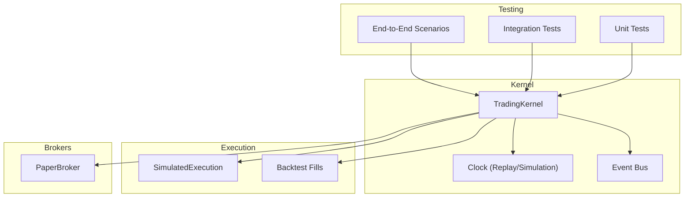
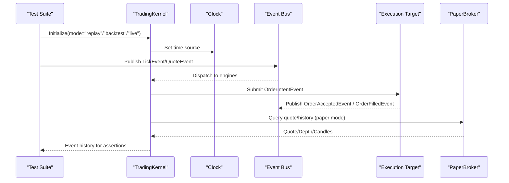
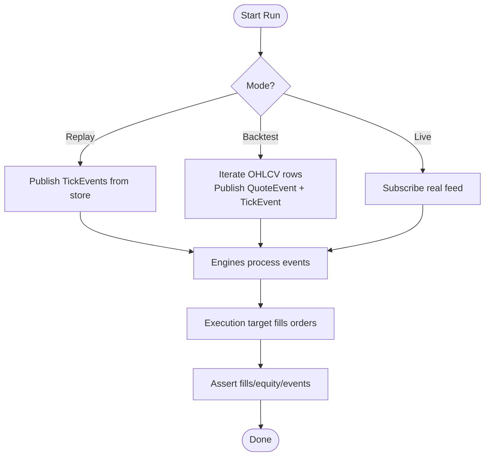
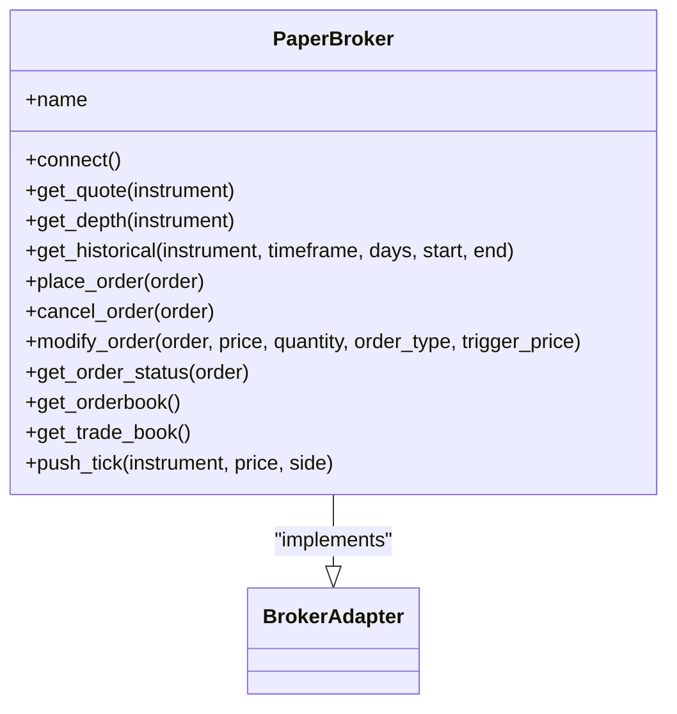
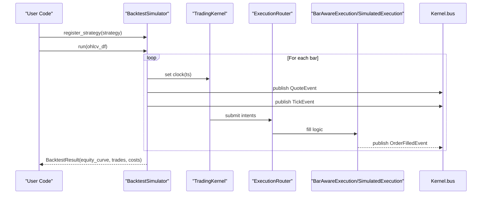
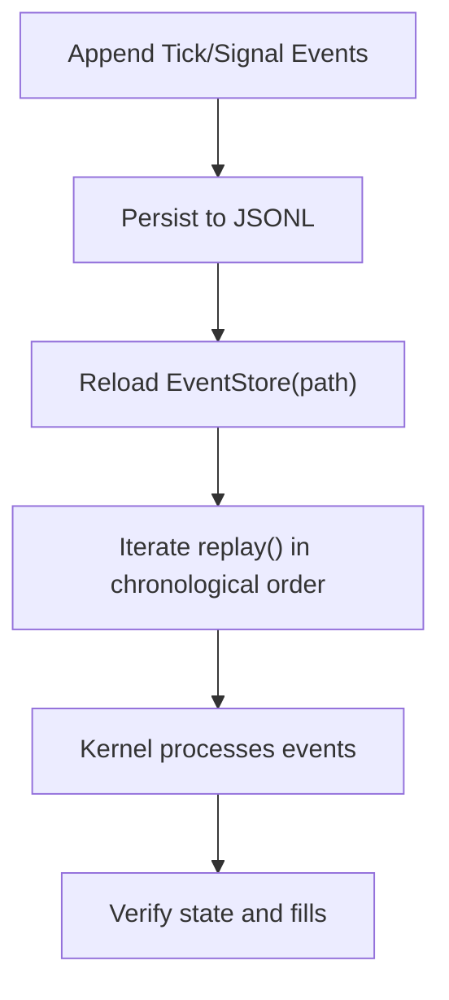
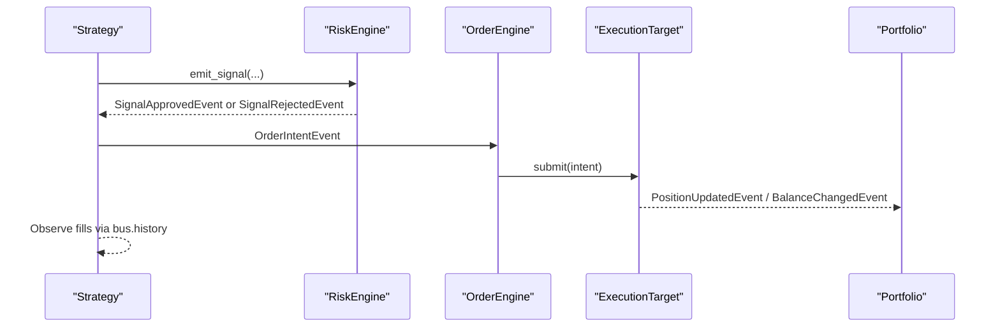
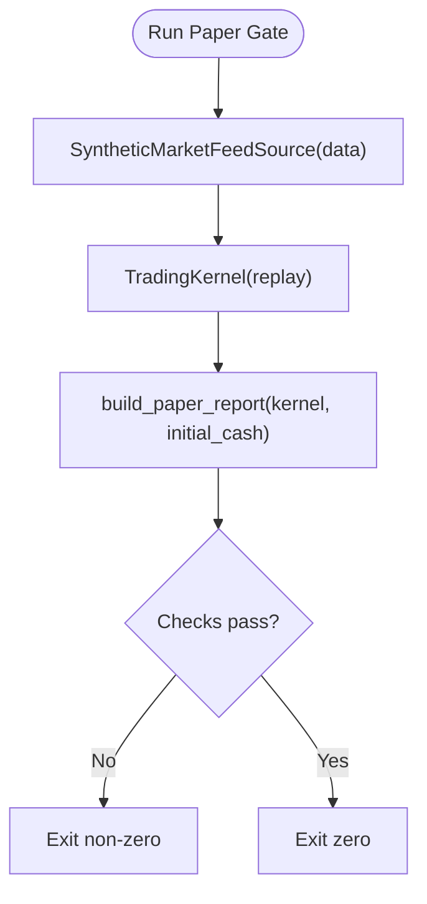
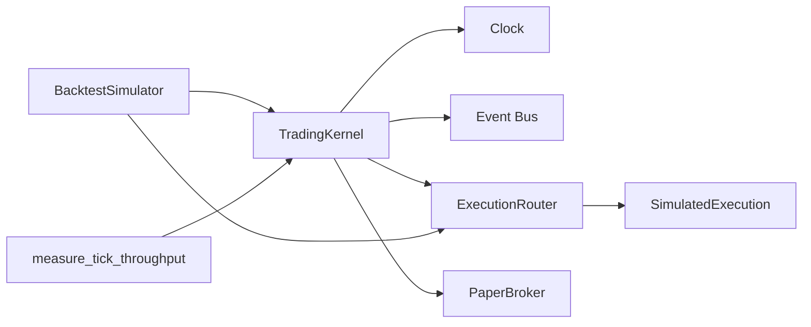
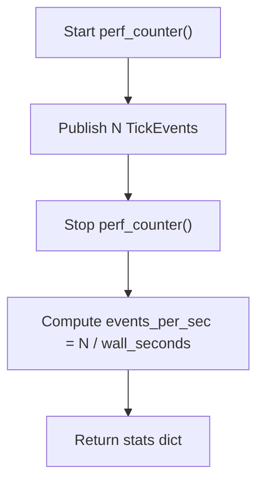

# Testing & Development

<cite>
**Referenced Files in This Document**
- [pyproject.toml](file://pyproject.toml)
- [ntrade/brokers/paper.py](file://ntrade/brokers/paper.py)
- [ntrade/backtest/simulator.py](file://ntrade/backtest/simulator.py)
- [ntrade/execution/simulator.py](file://ntrade/execution/simulator.py)
- [ntrade/runner/bench.py](file://ntrade/runner/bench.py)
- [scripts/benchmark_latency.py](file://scripts/benchmark_latency.py)
- [ntrade/runner/gate.py](file://ntrade/runner/gate.py)
- [scripts/paper_gate_run.py](file://scripts/paper_gate_run.py)
- [tests/test_benchmark.py](file://tests/test_benchmark.py)
- [tests/test_paper_gate.py](file://tests/test_paper_gate.py)
- [tests/test_replay_backtest.py](file://tests/test_replay_backtest.py)
- [tests/test_brokers.py](file://tests/test_brokers.py)
- [tests/test_engine_pipeline.py](file://tests/test_engine_pipeline.py)
</cite>

## Table of Contents
1. [Introduction](#introduction)
2. [Project Structure](#project-structure)
3. [Core Components](#core-components)
4. [Architecture Overview](#architecture-overview)
5. [Detailed Component Analysis](#detailed-component-analysis)
6. [Dependency Analysis](#dependency-analysis)
7. [Performance Considerations](#performance-considerations)
8. [Troubleshooting Guide](#troubleshooting-guide)
9. [Conclusion](#conclusion)
10. [Appendices](#appendices)

## Introduction
This document explains the testing strategies and development workflows in nTrade, focusing on the comprehensive test suite, zero-parity across live/replay/backtest modes, benchmarking techniques, debugging practices, and continuous integration setup. It also covers how to add features safely, write tests, maintain backward compatibility, and optimize performance for production deployments.

## Project Structure
The repository is organized into domain modules (market data, instruments, orders), engines (candle, indicator, market, order, portfolio, risk, strategy), execution targets, kernel/session orchestration, replay/backtest utilities, runners, and a broad test suite under tests/. Configuration and optional dependencies are declared in pyproject.toml.

**Diagram sources**
- [ntrade/kernel/session.py](file://ntrade/kernel/session.py)
- [ntrade/execution/simulator.py](file://ntrade/execution/simulator.py)
- [ntrade/backtest/simulator.py](file://ntrade/backtest/simulator.py)
- [ntrade/brokers/paper.py](file://ntrade/brokers/paper.py)

**Section sources**
- [pyproject.toml:1-25](file://pyproject.toml#L1-L25)

## Core Components
- PaperBroker: In-memory broker used by tests, backtests, and replays; implements the same BrokerAdapter contract as live brokers to ensure consistent APIs across environments.
- SimulatedExecution: Deterministic fill engine that applies slippage, commission, and statutory costs; supports delivery detection for equity overnight exits.
- BacktestSimulator: Runs the standard kernel over historical OHLCV bars with zero parity to live trading; publishes QuoteEvent and TickEvent per bar and tracks equity curves and costs.
- Benchmarking: measure_tick_throughput provides micro-benchmarks for kernel event pipeline throughput; scripts/benchmark_latency.py writes results to .benchmarks/latency.json.
- Paper->Live Gate: build_paper_report reconstructs equity from fills and events to produce a validation checklist before going live.

**Section sources**
- [ntrade/brokers/paper.py:1-216](file://ntrade/brokers/paper.py#L1-L216)
- [ntrade/execution/simulator.py:1-147](file://ntrade/execution/simulator.py#L1-L147)
- [ntrade/backtest/simulator.py:1-220](file://ntrade/backtest/simulator.py#L1-L220)
- [ntrade/runner/bench.py:1-26](file://ntrade/runner/bench.py#L1-L26)
- [scripts/benchmark_latency.py:1-37](file://scripts/benchmark_latency.py#L1-L37)
- [ntrade/runner/gate.py:1-69](file://ntrade/runner/gate.py#L1-L69)

## Architecture Overview
Zero-parity architecture ensures identical behavior across live, replay, and backtest modes by sharing the same TradingKernel + engine stack + execution target; only the event source, clock, and cost models differ.

**Diagram sources**
- [ntrade/backtest/simulator.py:116-143](file://ntrade/backtest/simulator.py#L116-L143)
- [ntrade/execution/simulator.py:72-146](file://ntrade/execution/simulator.py#L72-L146)
- [ntrade/brokers/paper.py:62-87](file://ntrade/brokers/paper.py#L62-L87)

## Detailed Component Analysis

### Zero-Parity Testing Across Modes
- Replay vs Live parity: The same kernel and execution target produce identical fills when driven by identical events.
- Backtest parity: Historical bars are converted to QuoteEvent and TickEvent per bar; fills and equity curve match expectations deterministically.

**Diagram sources**
- [tests/test_replay_backtest.py:83-99](file://tests/test_replay_backtest.py#L83-L99)
- [ntrade/backtest/simulator.py:116-143](file://ntrade/backtest/simulator.py#L116-L143)

**Section sources**
- [tests/test_replay_backtest.py:72-100](file://tests/test_replay_backtest.py#L72-L100)
- [tests/test_replay_backtest.py:133-148](file://tests/test_replay_backtest.py#L133-L148)

### PaperBroker Patterns and Mock Implementations
- Seeding quotes and history for deterministic tests.
- Immediate fills for MARKET orders using last trade price; limit orders use provided price or LTP.
- Order lifecycle methods (cancel, modify, status, book/trade retrieval).
- Capability extension pattern allows adding broker-specific features while rejecting unsupported ones.

**Diagram sources**
- [ntrade/brokers/paper.py:23-216](file://ntrade/brokers/paper.py#L23-L216)

**Section sources**
- [tests/test_brokers.py:10-28](file://tests/test_brokers.py#L10-L28)
- [tests/test_brokers.py:30-36](file://tests/test_brokers.py#L30-L36)
- [tests/test_brokers.py:38-66](file://tests/test_brokers.py#L38-L66)
- [tests/test_brokers.py:90-107](file://tests/test_brokers.py#L90-L107)

### Backtesting with Bar-Aware Fills and Costs
- BacktestSimulator constructs a kernel with an execution router and either BarAwareExecution or SimulatedExecution depending on policy.
- Per-bar processing publishes QuoteEvent and TickEvent; futures carry and roll costs can be applied deterministically.
- Fill policies control limit fills based on bar ranges; MARKET orders ignore policy.

**Diagram sources**
- [ntrade/backtest/simulator.py:116-143](file://ntrade/backtest/simulator.py#L116-L143)
- [ntrade/execution/simulator.py:72-146](file://ntrade/execution/simulator.py#L72-L146)

**Section sources**
- [tests/test_replay_backtest.py:133-148](file://tests/test_replay_backtest.py#L133-L148)
- [tests/test_replay_backtest.py:151-167](file://tests/test_replay_backtest.py#L151-L167)
- [tests/test_replay_backtest.py:184-215](file://tests/test_replay_backtest.py#L184-L215)
- [tests/test_replay_backtest.py:217-241](file://tests/test_replay_backtest.py#L217-L241)

### Event Store and Replay Engine
- EventStore persists events to JSONL, supports chronological replay, nested events, and graceful handling of unknown types.
- ReplayEngine drives the kernel from stored events, ensuring clock follows event timestamps.

**Diagram sources**
- [tests/test_replay_backtest.py:24-55](file://tests/test_replay_backtest.py#L24-L55)
- [tests/test_replay_backtest.py:72-81](file://tests/test_replay_backtest.py#L72-L81)
- [tests/test_replay_backtest.py:243-267](file://tests/test_replay_backtest.py#L243-L267)

**Section sources**
- [tests/test_replay_backtest.py:24-55](file://tests/test_replay_backtest.py#L24-L55)
- [tests/test_replay_backtest.py:72-81](file://tests/test_replay_backtest.py#L72-L81)
- [tests/test_replay_backtest.py:243-267](file://tests/test_replay_backtest.py#L243-L267)

### Full Pipeline Integration Tests
- Strategy emits signals → Risk engine validates → OMS creates intents → Execution target fills → Portfolio updates.
- Assertions cover event kinds, position netting, balance changes, and risk rejections.

**Diagram sources**
- [tests/test_engine_pipeline.py:65-79](file://tests/test_engine_pipeline.py#L65-L79)
- [tests/test_engine_pipeline.py:82-90](file://tests/test_engine_pipeline.py#L82-L90)
- [tests/test_engine_pipeline.py:93-112](file://tests/test_engine_pipeline.py#L93-L112)

**Section sources**
- [tests/test_engine_pipeline.py:65-79](file://tests/test_engine_pipeline.py#L65-L79)
- [tests/test_engine_pipeline.py:82-90](file://tests/test_engine_pipeline.py#L82-L90)
- [tests/test_engine_pipeline.py:93-112](file://tests/test_engine_pipeline.py#L93-L112)

### Paper->Live Gate Validation
- build_paper_report reconstructs equity from fills and ticks/quotes, computes max drawdown, and surfaces total charges.
- paper_gate_run.py runs a synthetic replay over real historical data and enforces go-live checks (fills > 0, drawdown cap).

**Diagram sources**
- [scripts/paper_gate_run.py:22-61](file://scripts/paper_gate_run.py#L22-L61)
- [ntrade/runner/gate.py:10-68](file://ntrade/runner/gate.py#L10-L68)

**Section sources**
- [tests/test_paper_gate.py:11-21](file://tests/test_paper_gate.py#L11-L21)
- [tests/test_paper_gate.py:23-40](file://tests/test_paper_gate.py#L23-L40)
- [scripts/paper_gate_run.py:22-61](file://scripts/paper_gate_run.py#L22-L61)

## Dependency Analysis
- Kernel depends on Clock, Event Bus, Engines, Execution Router, and Execution Targets.
- BacktestSimulator wires ExecutionRouter with BarAwareExecution or SimulatedExecution and registers strategies.
- PaperBroker provides deterministic market data and order lifecycle for tests and replays.
- Bench utilities depend on kernel’s event bus to measure throughput.

**Diagram sources**
- [ntrade/backtest/simulator.py:86-109](file://ntrade/backtest/simulator.py#L86-L109)
- [ntrade/execution/simulator.py:43-70](file://ntrade/execution/simulator.py#L43-L70)
- [ntrade/runner/bench.py:11-25](file://ntrade/runner/bench.py#L11-L25)

**Section sources**
- [ntrade/backtest/simulator.py:86-109](file://ntrade/backtest/simulator.py#L86-L109)
- [ntrade/execution/simulator.py:43-70](file://ntrade/execution/simulator.py#L43-L70)
- [ntrade/runner/bench.py:11-25](file://ntrade/runner/bench.py#L11-L25)

## Performance Considerations
- Throughput measurement: measure_tick_throughput publishes N ticks and returns wall_seconds and events_per_sec.
- Latency benchmark script: scripts/benchmark_latency.py writes results to .benchmarks/latency.json for regression tracking.
- Deterministic fills and zero-cost opt-out allow isolating performance without statutory overhead when needed.

**Diagram sources**
- [ntrade/runner/bench.py:11-25](file://ntrade/runner/bench.py#L11-L25)

**Section sources**
- [tests/test_benchmark.py:9-15](file://tests/test_benchmark.py#L9-L15)
- [scripts/benchmark_latency.py:18-32](file://scripts/benchmark_latency.py#L18-L32)

## Troubleshooting Guide
- Market order without price: SimulatedExecution rejects intent if base price <= 0; ensure a valid quote exists before submitting MARKET orders.
- Unknown instrument: Execution target returns rejection with reason; verify instrument registration.
- Delivery detection: Overnight equity sells incur additional STT/stamp uplift on entry leg; disable with delivery_detection=False if not desired.
- Paper gate failures: No fills or excessive drawdown cause exit non-zero; review strategy logic and risk settings.

**Section sources**
- [ntrade/execution/simulator.py:72-96](file://ntrade/execution/simulator.py#L72-96)
- [scripts/paper_gate_run.py:52-61](file://scripts/paper_gate_run.py#L52-L61)

## Conclusion
nTrade’s testing framework emphasizes zero-parity across live, replay, and backtest modes through shared kernel and execution targets, deterministic mocks, and robust event-driven pipelines. The test suite covers unit, integration, and end-to-end scenarios, while benchmarking and gating tools support performance validation and safe deployment. Following the patterns outlined here ensures reliable feature development, backward compatibility, and production readiness.

## Appendices

### Development Workflow
- Add a new feature: implement within the relevant module, wire into the kernel/router where applicable, and expose via clean interfaces.
- Write tests:
  - Unit tests for isolated logic (e.g., PaperBroker capabilities).
  - Integration tests for full pipeline flows (signals → risk → OMS → execution → portfolio).
  - End-to-end scenarios using ReplayEngine and EventStore for deterministic replay.
- Maintain backward compatibility: preserve existing event contracts, avoid breaking changes to broker adapter interfaces, and handle unknown event types gracefully.

**Section sources**
- [tests/test_brokers.py:38-66](file://tests/test_brokers.py#L38-L66)
- [tests/test_replay_backtest.py:243-267](file://tests/test_replay_backtest.py#L243-L267)

### Continuous Integration and Code Quality
- pytest configuration: testpaths set to tests/, optional dev dependency includes pytest.
- Recommended CI steps:
  - Install dependencies and dev extras.
  - Run pytest with verbose output.
  - Execute benchmark_latency.py and compare .benchmarks/latency.json against baseline.
  - Run paper_gate_run.py with representative symbols/days to validate go-live checks.

**Section sources**
- [pyproject.toml:17-25](file://pyproject.toml#L17-L25)

### Examples: Testing Custom Brokers, Strategies, Indicators
- Custom broker: extend BrokerAdapter, implement required methods, and add capabilities via the capability decorator; assert supported/unsupported behaviors.
- Custom strategy: subclass Strategy, override on_tick/on_candle_closed, emit signals, and assert fills and portfolio updates.
- Custom indicators: compute values on candles and assert correctness against known inputs; integrate with indicator engine.

**Section sources**
- [tests/test_brokers.py:90-107](file://tests/test_brokers.py#L90-L107)
- [tests/test_engine_pipeline.py:16-31](file://tests/test_engine_pipeline.py#L16-L31)
- [tests/test_engine_pipeline.py:33-47](file://tests/test_engine_pipeline.py#L33-L47)