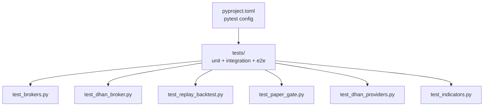
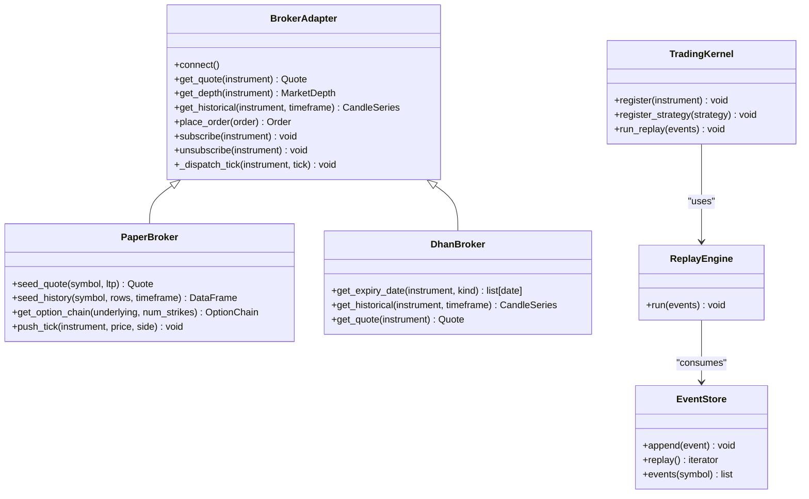
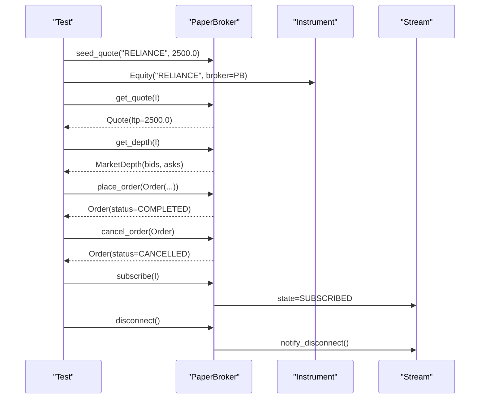
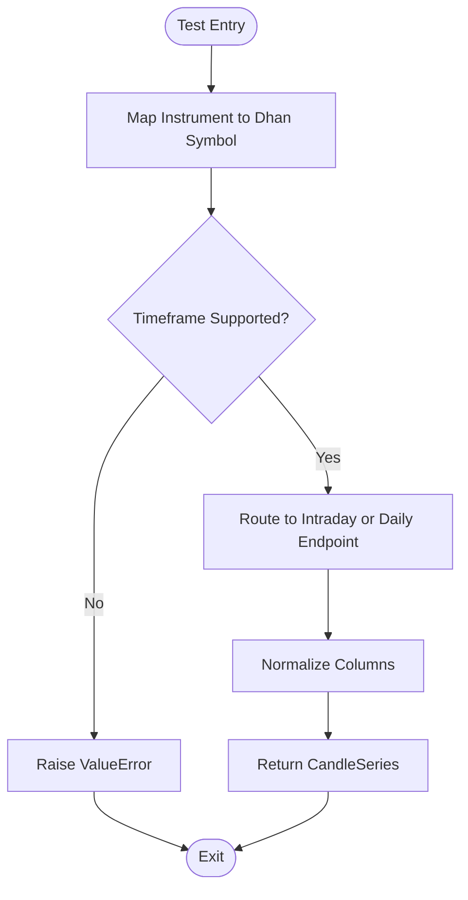
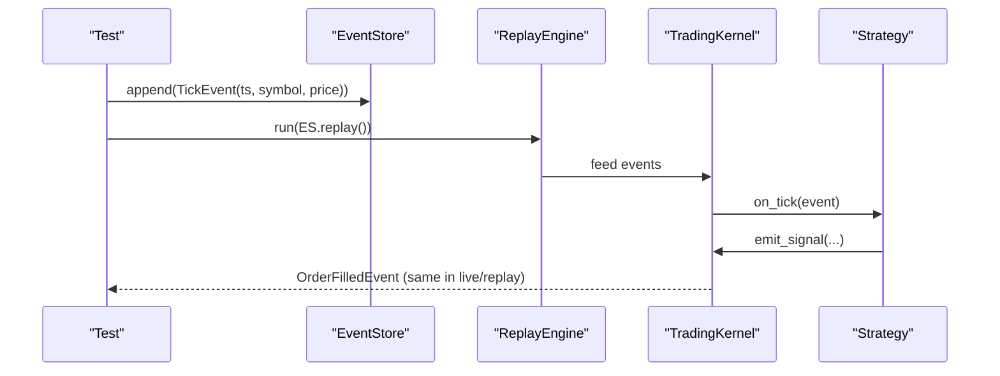
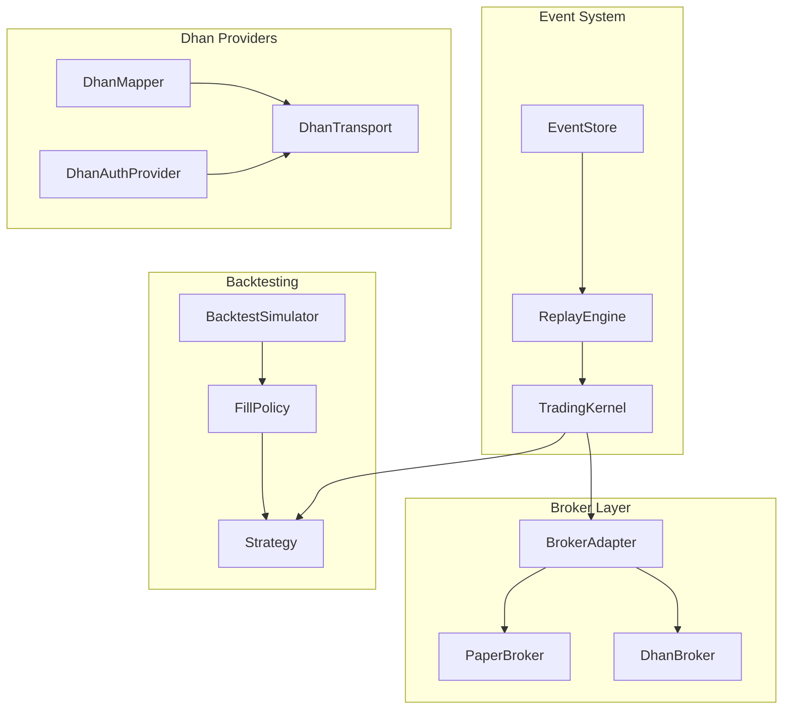

# Testing Frameworks & Patterns

<cite>
**Referenced Files in This Document**
- [pyproject.toml](file://pyproject.toml)
- [test_brokers.py](file://tests/test_brokers.py)
- [paper.py](file://ntrade/brokers/paper.py)
- [base.py](file://ntrade/brokers/base.py)
- [test_dhan_broker.py](file://tests/test_dhan_broker.py)
- [test_replay_backtest.py](file://tests/test_replay_backtest.py)
- [test_paper_gate.py](file://tests/test_paper_gate.py)
- [test_dhan_providers.py](file://tests/test_dhan_providers.py)
- [test_indicators.py](file://tests/test_indicators.py)
</cite>

## Table of Contents
1. [Introduction](#introduction)
2. [Project Structure](#project-structure)
3. [Core Components](#core-components)
4. [Architecture Overview](#architecture-overview)
5. [Detailed Component Analysis](#detailed-component-analysis)
6. [Dependency Analysis](#dependency-analysis)
7. [Performance Considerations](#performance-considerations)
8. [Troubleshooting Guide](#troubleshooting-guide)
9. [Conclusion](#conclusion)
10. [Appendices](#appendices)

## Introduction
This document explains the testing frameworks and patterns used across nTrade’s pytest-based test suite, which covers unit tests, integration tests, and end-to-end scenarios for brokers, engines, replay/backtest, and market data feeds. It focuses on:
- The zero-parity testing approach ensuring identical behavior across live, replay, and backtest modes
- Broker abstraction with PaperBroker and mock implementations
- Fixture management, test data setup, and mocking strategies for external dependencies like Dhan API
- Best practices for event-driven systems, asynchronous operations, and real-time components
- Test organization, naming conventions, and coverage requirements

## Project Structure
The project uses a standard pytest configuration with all tests under the tests directory. The configuration defines the test path and optional dev dependencies including pytest.

**Diagram sources**
- [pyproject.toml:23-25](file://pyproject.toml#L23-L25)

**Section sources**
- [pyproject.toml:1-25](file://pyproject.toml#L1-L25)

## Core Components
Key testing components and patterns:
- BrokerAdapter base class defines the broker contract (quotes, depth, history, orders, streaming). All brokers implement this interface to ensure consistent APIs across paper/live.
- PaperBroker is an in-memory broker used by tests, backtests, and replays. It seeds quotes/history, manages order lifecycle, and dispatches ticks deterministically.
- DhanBroker tests use stubbed Tradehull via types.SimpleNamespace or unittest.mock.MagicMock to avoid network calls while validating symbol mapping, timeframe handling, and historical data normalization.
- ReplayEngine and EventStore enable deterministic replay of events; TradingKernel supports both live and replay modes with a shared clock for zero-parity.
- BacktestSimulator and FillPolicy provide deterministic fills and equity curves for candle-based strategies.
- Indicator tests validate mathematical correctness and bounds of technical indicators.

**Section sources**
- [base.py:25-163](file://ntrade/brokers/base.py#L25-L163)
- [paper.py:23-216](file://ntrade/brokers/paper.py#L23-L216)
- [test_dhan_broker.py:1-200](file://tests/test_dhan_broker.py#L1-L200)
- [test_replay_backtest.py:1-200](file://tests/test_replay_backtest.py#L1-L200)
- [test_indicators.py:1-149](file://tests/test_indicators.py#L1-L149)

## Architecture Overview
The testing architecture centers around a broker abstraction that isolates domain logic from transport details. Tests exercise the same domain code against PaperBroker (in-memory), DhanBroker (stubbed), and replay/backtest engines to guarantee zero-parity.

**Diagram sources**
- [base.py:25-163](file://ntrade/brokers/base.py#L25-L163)
- [paper.py:23-216](file://ntrade/brokers/paper.py#L23-L216)
- [test_dhan_broker.py:1-200](file://tests/test_dhan_broker.py#L1-L200)
- [test_replay_backtest.py:1-200](file://tests/test_replay_backtest.py#L1-L200)

## Detailed Component Analysis

### Broker Abstraction and PaperBroker Testing
PaperBroker implements the BrokerAdapter contract and provides deterministic seeding for quotes, history, and option chains. Tests verify:
- Quote and depth retrieval
- Historical data generation and filtering
- Order placement, cancellation, modification, and status queries
- Capability registry and extension facade behavior
- Subscription multiplexing and disconnect notifications
- Custom capability decorator usage

**Diagram sources**
- [test_brokers.py:10-88](file://tests/test_brokers.py#L10-L88)
- [paper.py:39-188](file://ntrade/brokers/paper.py#L39-L188)
- [base.py:64-68](file://ntrade/brokers/base.py#L64-L68)

**Section sources**
- [test_brokers.py:1-107](file://tests/test_brokers.py#L1-L107)
- [paper.py:23-216](file://ntrade/brokers/paper.py#L23-L216)
- [base.py:25-163](file://ntrade/brokers/base.py#L25-L163)

### DhanBroker Unit Testing with Mocked Transport
DhanBroker tests validate symbol mapping, timeframe conversion, historical data routing, and quote normalization using mocked Tradehull methods. Key patterns:
- Construct DhanBroker instances without initialization overhead using __new__
- Stub tsl methods via types.SimpleNamespace or MagicMock
- Assert correct error handling for unsupported timeframes and empty responses
- Verify column normalization for historical data

**Diagram sources**
- [test_dhan_broker.py:90-123](file://tests/test_dhan_broker.py#L90-L123)
- [test_dhan_broker.py:125-183](file://tests/test_dhan_broker.py#L125-L183)

**Section sources**
- [test_dhan_broker.py:1-200](file://tests/test_dhan_broker.py#L1-L200)

### Zero-Parity Testing: Replay and Backtest
Zero-parity ensures identical behavior across live, replay, and backtest modes. Tests demonstrate:
- EventStore persistence and chronological replay
- ReplayEngine driving TradingKernel with deterministic timestamps
- Live vs replay fill equivalence using shared ReplayClock
- BacktestSimulator producing equity curves and commission calculations
- FillPolicy enforcing bar-aware limit fills

**Diagram sources**
- [test_replay_backtest.py:24-99](file://tests/test_replay_backtest.py#L24-L99)

**Section sources**
- [test_replay_backtest.py:1-200](file://tests/test_replay_backtest.py#L1-L200)

### Paper->Live Gate Reporting
Gate reporting validates that paper trading sessions produce accurate summaries including trade counts, charges, and drawdown metrics. Tests assert:
- Initial report structure with zero trades
- Per-fill charge breakdown matching kernel history
- Total charges calculation from statutory and commission fields

**Section sources**
- [test_paper_gate.py:1-40](file://tests/test_paper_gate.py#L1-L40)

### Dhan Provider Decomposition Testing
Tests cover DhanMapper, DhanAuthProvider, and DhanTransport components:
- Symbol formatting for equities and options (including fractional strikes)
- Timeframe mapping with validation for unsupported intervals
- Quote normalization and history column standardization
- Order book and trade book normalization
- Authentication flow with mocked Tradehull client
- Transport retry logic and error propagation

**Section sources**
- [test_dhan_providers.py:1-200](file://tests/test_dhan_providers.py#L1-L200)

### Indicator Testing Patterns
Indicator tests validate mathematical correctness and boundary conditions:
- RSI within [0, 100] range and trend direction
- ATR positivity and VWAP bounds
- Supertrend signal direction based on trend
- SMA/EMA warm-up periods and bundle computation
- IndicatorEngine row limiting for memory efficiency

**Section sources**
- [test_indicators.py:1-149](file://tests/test_indicators.py#L1-L149)

## Dependency Analysis
Testing dependencies are organized by component:
- Broker layer: BrokerAdapter → PaperBroker/DhanBroker
- Event system: EventStore → ReplayEngine → TradingKernel
- Backtesting: BacktestSimulator → FillPolicy → Strategy
- External integrations: Dhan providers (mapper, auth, transport) mocked in tests

**Diagram sources**
- [base.py:25-163](file://ntrade/brokers/base.py#L25-L163)
- [paper.py:23-216](file://ntrade/brokers/paper.py#L23-L216)
- [test_replay_backtest.py:1-200](file://tests/test_replay_backtest.py#L1-L200)
- [test_dhan_providers.py:1-200](file://tests/test_dhan_providers.py#L1-L200)

**Section sources**
- [base.py:25-163](file://ntrade/brokers/base.py#L25-L163)
- [paper.py:23-216](file://ntrade/brokers/paper.py#L23-L216)
- [test_replay_backtest.py:1-200](file://tests/test_replay_backtest.py#L1-L200)
- [test_dhan_providers.py:1-200](file://tests/test_dhan_providers.py#L1-L200)

## Performance Considerations
- Use deterministic seeds in PaperBroker for reproducible tests
- Limit indicator engine rows to prevent memory growth in long-running tests
- Mock external APIs to avoid network latency in unit tests
- Use lightweight fixtures for common test data (OHLCV, quotes)
- Prefer in-memory structures over file I/O where possible for faster test execution

[No sources needed since this section provides general guidance]

## Troubleshooting Guide
Common testing issues and solutions:
- **Broker connection errors**: Ensure PaperBroker is properly initialized with seed values
- **Timeframe mapping failures**: Validate supported timeframes for each broker implementation
- **Historical data normalization**: Check column names match expected format (timestamp, open, high, low, close, volume)
- **Event ordering**: Verify EventStore maintains chronological order during replay
- **Mock object attributes**: Ensure MagicMock objects have required attributes set before assertions

**Section sources**
- [test_dhan_broker.py:90-123](file://tests/test_dhan_broker.py#L90-L123)
- [test_replay_backtest.py:24-42](file://tests/test_replay_backtest.py#L24-L42)

## Conclusion
nTrade’s testing framework provides comprehensive coverage through pytest with clear separation between unit, integration, and end-to-end tests. The broker abstraction enables zero-parity testing across live, replay, and backtest modes. PaperBroker serves as a deterministic test double, while DhanBroker tests use strategic mocking to validate behavior without network dependencies. The event-driven architecture is thoroughly tested through replay mechanisms, ensuring consistent behavior across all execution modes.

[No sources needed since this section summarizes without analyzing specific files]

## Appendices

### Test Organization and Naming Conventions
- Test files follow pattern `test_<component>.py`
- Functions use descriptive names starting with `test_`
- Fixtures defined with `@pytest.fixture` decorator
- Class-based tests group related functionality
- Assertions use pytest’s built-in equality and context managers

### Coverage Requirements
- Aim for >80% line coverage across core modules
- Prioritize coverage of error handling paths
- Include boundary condition tests for numerical computations
- Test both success and failure scenarios for external integrations

[No sources needed since this section provides general guidance]