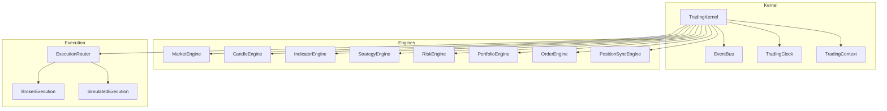
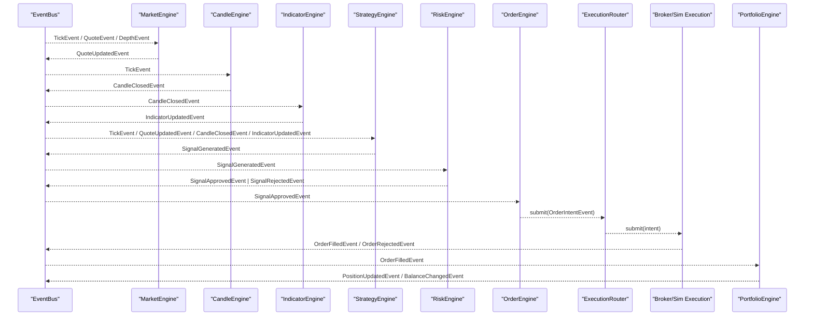
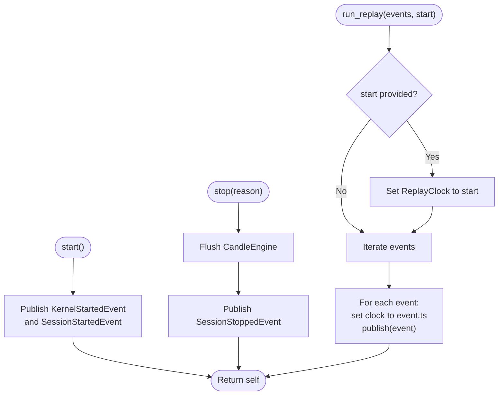
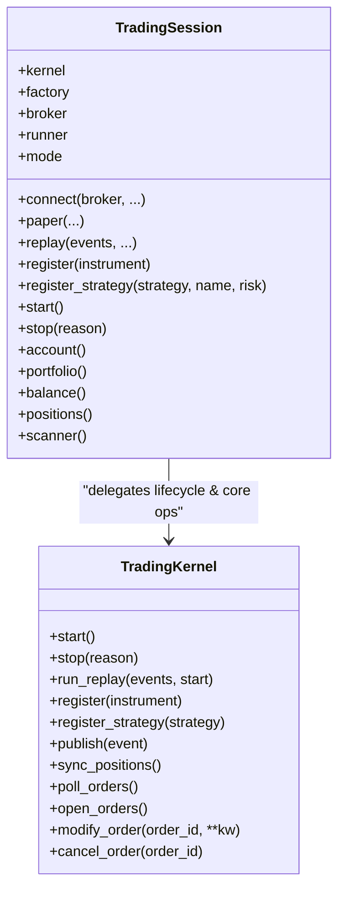
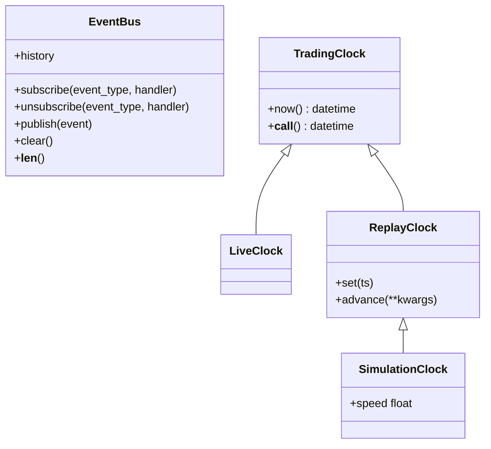
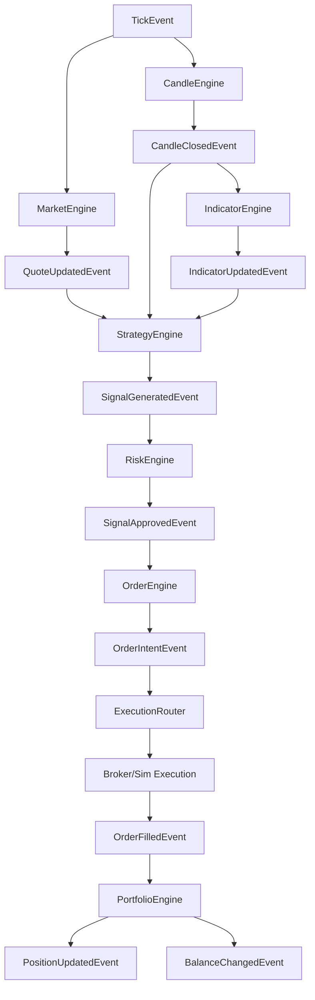
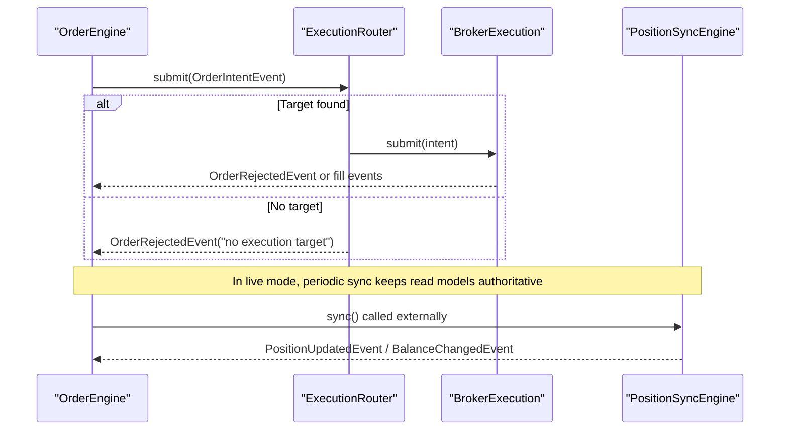
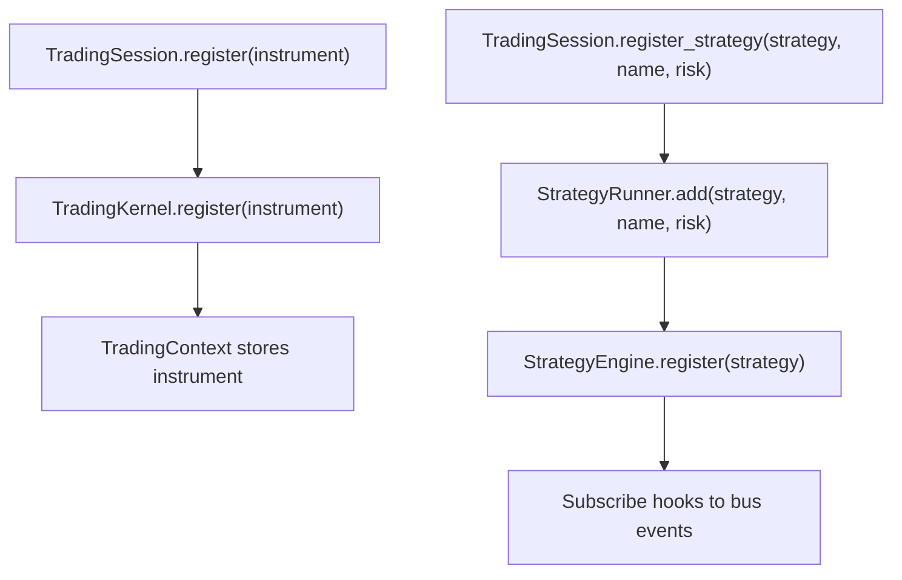
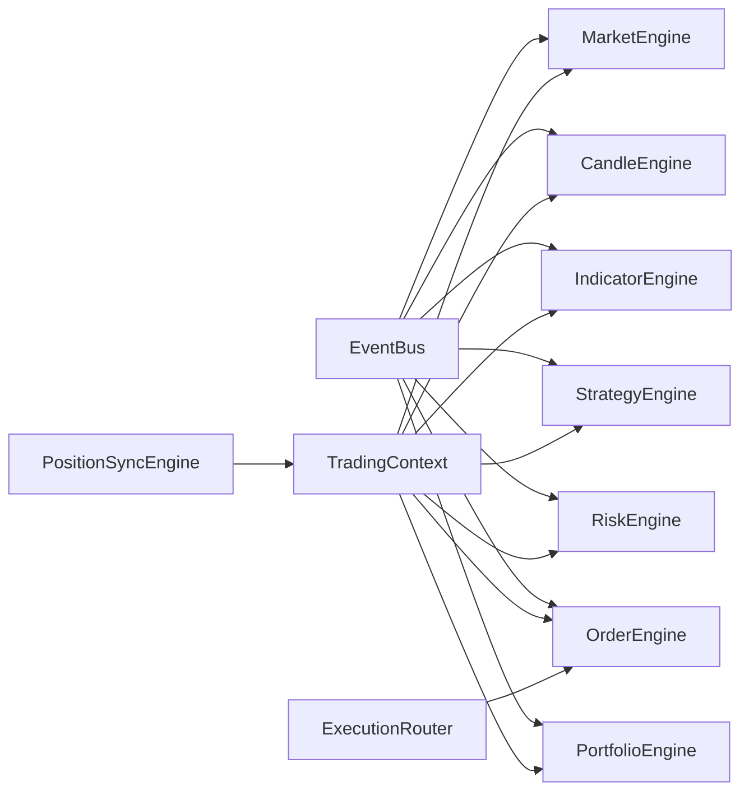

# Core Kernel Orchestration

<cite>
**Referenced Files in This Document**
- [session.py](file://ntrade/kernel/session.py)
- [trading_session.py](file://ntrade/kernel/trading_session.py)
- [clock.py](file://ntrade/kernel/clock.py)
- [event_bus.py](file://ntrade/kernel/event_bus.py)
- [market_engine.py](file://ntrade/engines/market_engine.py)
- [candle_engine.py](file://ntrade/engines/candle_engine.py)
- [indicator_engine.py](file://ntrade/engines/indicator_engine.py)
- [strategy_engine.py](file://ntrade/engines/strategy_engine.py)
- [risk_engine.py](file://ntrade/engines/risk_engine.py)
- [portfolio_engine.py](file://ntrade/engines/portfolio_engine.py)
- [order_engine.py](file://ntrade/engines/order_engine.py)
- [position_sync.py](file://ntrade/engines/position_sync.py)
- [router.py](file://ntrade/execution/router.py)
</cite>

## Table of Contents
1. Introduction
2. Project Structure
3. Core Components
4. Architecture Overview
5. Detailed Component Analysis
6. Dependency Analysis
7. Performance Considerations
8. Troubleshooting Guide
9. Conclusion

## Introduction
This document explains the TradingKernel orchestration layer that coordinates all framework subsystems: market, candle, indicator, strategy, risk, portfolio, and order engines. It covers initialization across modes (live, replay, backtest), engine stack assembly, execution target setup, lifecycle management, instrument and strategy registration, event publishing, broker integration via ExecutionRouter, and position synchronization. Concrete examples describe how to instantiate a kernel, configure it per mode, and manage sessions.

## Project Structure
At the heart of the system is the TradingKernel class, which wires together:
- Event bus for decoupled communication
- Clock abstraction for deterministic time
- Engine pipeline for data processing and decision-making
- Execution router for order routing to live or simulated targets
- Position synchronization for live reconciliation

**Diagram sources**
- [session.py:38-101](file://ntrade/kernel/session.py#L38-L101)
- [event_bus.py:24-81](file://ntrade/kernel/event_bus.py#L24-L81)
- [clock.py:14-55](file://ntrade/kernel/clock.py#L14-L55)
- [router.py:19-49](file://ntrade/execution/router.py#L19-L49)

**Section sources**
- [session.py:38-101](file://ntrade/kernel/session.py#L38-L101)
- [trading_session.py:39-143](file://ntrade/kernel/trading_session.py#L39-L143)

## Core Components
- TradingKernel: Central coordinator that initializes the engine stack, sets up the event bus, clock, context, execution router, and optional recording store. It exposes start(), stop(), run_replay(), and helpers for broker operations and position sync.
- TradingSession: High-level facade that constructs a broker, kernel, and strategy runner; provides convenient constructors for live, paper, and replay modes; and delegates lifecycle calls to the kernel.
- EventBus: Synchronous publish/subscribe with reentrant locking, history buffer, and exception-safe dispatch.
- TradingClock: Time abstraction with LiveClock (wall time), ReplayClock (deterministic), and SimulationClock (speed scaling).
- Engines: Market, Candle, Indicator, Strategy, Risk, Portfolio, Order, and PositionSync engines form the processing pipeline.
- ExecutionRouter: Routes order intents to named execution targets (BrokerExecution or SimulatedExecution).

Key responsibilities:
- Mode-specific configuration: only clock and execution target differ between live/replay/backtest.
- Event-driven wiring: engines subscribe to events and publish normalized downstream events.
- Determinism: ReplayClock ensures zero parity across modes.

**Section sources**
- [session.py:38-101](file://ntrade/kernel/session.py#L38-L101)
- [trading_session.py:39-143](file://ntrade/kernel/trading_session.py#L39-L143)
- [event_bus.py:24-81](file://ntrade/kernel/event_bus.py#L24-L81)
- [clock.py:14-55](file://ntrade/kernel/clock.py#L14-L55)
- [router.py:19-49](file://ntrade/execution/router.py#L19-L49)

## Architecture Overview
The kernel orchestrates an event-driven pipeline:
- MarketEngine normalizes raw ticks/quotes/depth into QuoteUpdatedEvent.
- CandleEngine aggregates ticks into closed candles and emits CandleClosedEvent.
- IndicatorEngine computes indicators on candle close and publishes IndicatorUpdatedEvent.
- StrategyEngine fans events to registered strategies; strategies emit signals via SignalGeneratedEvent.
- RiskEngine screens signals and publishes SignalApprovedEvent or SignalRejectedEvent.
- OrderEngine materializes approved signals into OrderIntentEvent and submits via ExecutionRouter.
- ExecutionRouter routes to BrokerExecution (live) or SimulatedExecution (paper/backtest).
- PortfolioEngine updates positions and cash on fills and publishes PositionUpdatedEvent and BalanceChangedEvent.
- PositionSyncEngine reconciles broker-reported state into the kernel’s read models.

**Diagram sources**
- [market_engine.py:15-64](file://ntrade/engines/market_engine.py#L15-L64)
- [candle_engine.py:19-82](file://ntrade/engines/candle_engine.py#L19-L82)
- [indicator_engine.py:18-55](file://ntrade/engines/indicator_engine.py#L18-L55)
- [strategy_engine.py:48-102](file://ntrade/engines/strategy_engine.py#L48-L102)
- [risk_engine.py:19-141](file://ntrade/engines/risk_engine.py#L19-L141)
- [order_engine.py:14-34](file://ntrade/engines/order_engine.py#L14-L34)
- [router.py:19-49](file://ntrade/execution/router.py#L19-L49)
- [portfolio_engine.py:15-69](file://ntrade/engines/portfolio_engine.py#L15-L69)

## Detailed Component Analysis

### TradingKernel: Initialization, Modes, and Lifecycle
- Initialization:
  - Creates EventBus, TradingClock (default LiveClock), and TradingContext with instruments and session_id.
  - Sets initial account balance from initial_cash.
  - Optionally injects clock into broker for timestamp alignment.
  - Optional EventStore subscription records all events for audit/replay.
  - Assembles engine stack: Market, Candle, Indicator, Strategy, Risk, Portfolio engines.
  - Configures ExecutionRouter: adds BrokerExecution if broker present, else SimulatedExecution with statutory charges by default; sets default target.
  - Wires OrderEngine with the router.
- Lifecycle:
  - start(): publishes KernelStartedEvent and SessionStartedEvent.
  - stop(): flushes candles and publishes SessionStoppedEvent.
  - run_replay(events, start=None): optionally sets ReplayClock start, then iterates events setting clock to each event’s timestamp and publishing through the bus.
- Broker integration:
  - broker_execution(): returns the active BrokerExecution target if present.
  - poll_orders(): polls open orders and republishes fills/rejections.
  - sync_positions(): reconciles broker positions/balance into kernel read models.
  - open_orders(), modify_order(), cancel_order(): delegate to broker execution when available.

**Diagram sources**
- [session.py:120-145](file://ntrade/kernel/session.py#L120-L145)

**Section sources**
- [session.py:38-101](file://ntrade/kernel/session.py#L38-L101)
- [session.py:120-145](file://ntrade/kernel/session.py#L120-L145)
- [session.py:148-198](file://ntrade/kernel/session.py#L148-L198)

### TradingSession: Unified Entry Point and Mode-Specific Setup
- Constructors:
  - connect(broker, ...): builds a live session using BrokerRegistry and sets mode="live".
  - paper(...): creates a PaperBroker instance and sets mode="paper".
  - replay(events, ...): creates a ReplayClock and sets mode="replay", storing events for later playback.
- Instrument creation: delegates to InstrumentFactory for equity/index/etf/commodity/currency/future/option.
- Account and portfolio access: bridges to broker or kernel context depending on mode.
- Engine stack:
  - register(instrument): forwards to kernel.register.
  - register_strategy(strategy, name, risk): uses StrategyRunner to add strategies.
- Lifecycle:
  - start(): calls kernel.start(); if replay mode, runs kernel.run_replay with stored events.
  - stop(): calls kernel.stop().
- Scanner: lazily created ScannerFacade bound to the session.

**Diagram sources**
- [trading_session.py:39-143](file://ntrade/kernel/trading_session.py#L39-L143)
- [session.py:38-101](file://ntrade/kernel/session.py#L38-L101)

**Section sources**
- [trading_session.py:39-143](file://ntrade/kernel/trading_session.py#L39-L143)
- [trading_session.py:225-249](file://ntrade/kernel/trading_session.py#L225-L249)

### Event Bus and Clock: Deterministic Time and Safe Dispatch
- EventBus:
  - Thread-safe publish with RLock; subscribes handlers by event type and subclasses via MRO.
  - Maintains bounded history for replay/debugging.
  - Swallows handler exceptions to keep the kernel resilient.
- TradingClock:
  - LiveClock returns wall time.
  - ReplayClock maintains deterministic time and supports set/advance.
  - SimulationClock extends ReplayClock with speed scaling for backtests.

**Diagram sources**
- [event_bus.py:24-81](file://ntrade/kernel/event_bus.py#L24-L81)
- [clock.py:14-55](file://ntrade/kernel/clock.py#L14-L55)

**Section sources**
- [event_bus.py:24-81](file://ntrade/kernel/event_bus.py#L24-L81)
- [clock.py:14-55](file://ntrade/kernel/clock.py#L14-L55)

### Engine Pipeline: Data Flow and Processing Logic
- MarketEngine:
  - Subscribes to TickEvent, QuoteEvent, DepthEvent.
  - Updates instrument read-models and publishes QuoteUpdatedEvent.
- CandleEngine:
  - Aggregates ticks into OHLCV buckets per timeframe.
  - Emits CandleClosedEvent upon bucket closure; supports flush at session end.
- IndicatorEngine:
  - Consumes CandleClosedEvent, computes indicator bundle, updates instrument indicators, and publishes IndicatorUpdatedEvent.
- StrategyEngine:
  - Fans events to registered strategies via hooks; strategies emit signals via emit_signal.
- RiskEngine:
  - Screens signals with static limits and circuit breakers; publishes SignalApprovedEvent or SignalRejectedEvent; supports halt/resume.
- OrderEngine:
  - Converts SignalApprovedEvent to OrderIntentEvent and submits via ExecutionRouter; republishes rejections.
- PortfolioEngine:
  - On OrderFilledEvent, updates positions and cash, publishes PositionUpdatedEvent and BalanceChangedEvent.

**Diagram sources**
- [market_engine.py:15-64](file://ntrade/engines/market_engine.py#L15-L64)
- [candle_engine.py:19-82](file://ntrade/engines/candle_engine.py#L19-L82)
- [indicator_engine.py:18-55](file://ntrade/engines/indicator_engine.py#L18-L55)
- [strategy_engine.py:48-102](file://ntrade/engines/strategy_engine.py#L48-L102)
- [risk_engine.py:19-141](file://ntrade/engines/risk_engine.py#L19-L141)
- [order_engine.py:14-34](file://ntrade/engines/order_engine.py#L14-L34)
- [portfolio_engine.py:15-69](file://ntrade/engines/portfolio_engine.py#L15-L69)

**Section sources**
- [market_engine.py:15-64](file://ntrade/engines/market_engine.py#L15-L64)
- [candle_engine.py:19-82](file://ntrade/engines/candle_engine.py#L19-L82)
- [indicator_engine.py:18-55](file://ntrade/engines/indicator_engine.py#L18-L55)
- [strategy_engine.py:48-102](file://ntrade/engines/strategy_engine.py#L48-L102)
- [risk_engine.py:19-141](file://ntrade/engines/risk_engine.py#L19-L141)
- [order_engine.py:14-34](file://ntrade/engines/order_engine.py#L14-L34)
- [portfolio_engine.py:15-69](file://ntrade/engines/portfolio_engine.py#L15-L69)

### Execution Router and Position Synchronization
- ExecutionRouter:
  - Maintains a map of named targets and a default target.
  - Resolves intent.strategy to a target; falls back to default; otherwise rejects with reason.
- PositionSyncEngine:
  - Reconciles broker-reported positions and balance into kernel read models.
  - Publishes canonical events for changes; safe against transient failures to avoid corrupting state.

**Diagram sources**
- [router.py:19-49](file://ntrade/execution/router.py#L19-L49)
- [position_sync.py:22-110](file://ntrade/engines/position_sync.py#L22-L110)

**Section sources**
- [router.py:19-49](file://ntrade/execution/router.py#L19-L49)
- [position_sync.py:22-110](file://ntrade/engines/position_sync.py#L22-L110)

### Instrument Registration and Strategy Workflow
- Instrument registration:
  - TradingSession.register(instrument) delegates to kernel.register, which stores the instrument in TradingContext.
- Strategy registration:
  - TradingSession.register_strategy(strategy, name, risk) uses StrategyRunner to add strategies with optional risk overrides.
  - Strategies receive events via StrategyEngine hooks and can emit signals.

**Diagram sources**
- [trading_session.py:225-239](file://ntrade/kernel/trading_session.py#L225-L239)
- [session.py:104-110](file://ntrade/kernel/session.py#L104-L110)
- [strategy_engine.py:65-68](file://ntrade/engines/strategy_engine.py#L65-L68)

**Section sources**
- [trading_session.py:225-239](file://ntrade/kernel/trading_session.py#L225-L239)
- [session.py:104-110](file://ntrade/kernel/session.py#L104-L110)
- [strategy_engine.py:65-68](file://ntrade/engines/strategy_engine.py#L65-L68)

### Event Publishing Interface
- Kernel.publish(event) forwards to EventBus.publish.
- Engines publish normalized events after processing:
  - MarketEngine: QuoteUpdatedEvent
  - CandleEngine: CandleClosedEvent
  - IndicatorEngine: IndicatorUpdatedEvent
  - StrategyEngine: SignalGeneratedEvent (via strategy.emit_signal)
  - RiskEngine: SignalApprovedEvent or SignalRejectedEvent
  - OrderEngine: OrderIntentEvent and relays rejections
  - PortfolioEngine: PositionUpdatedEvent and BalanceChangedEvent
- All events are serialized and recorded in EventBus history.

**Section sources**
- [session.py:112-114](file://ntrade/kernel/session.py#L112-L114)
- [event_bus.py:47-66](file://ntrade/kernel/event_bus.py#L47-L66)
- [market_engine.py:25-51](file://ntrade/engines/market_engine.py#L25-L51)
- [candle_engine.py:56-69](file://ntrade/engines/candle_engine.py#L56-L69)
- [indicator_engine.py:28-51](file://ntrade/engines/indicator_engine.py#L28-L51)
- [strategy_engine.py:37-45](file://ntrade/engines/strategy_engine.py#L37-L45)
- [risk_engine.py:73-82](file://ntrade/engines/risk_engine.py#L73-L82)
- [order_engine.py:21-33](file://ntrade/engines/order_engine.py#L21-L33)
- [portfolio_engine.py:20-68](file://ntrade/engines/portfolio_engine.py#L20-L68)

### Broker Integration and Position Synchronization Patterns
- BrokerExecution vs SimulatedExecution:
  - If a broker is provided, ExecutionRouter registers BrokerExecution as the default target; otherwise, SimulatedExecution is used with statutory charges by default.
- Position synchronization:
  - PositionSyncEngine.sync() pulls positions and balance from the broker and reconciles into kernel read models, publishing canonical events.
  - Transient errors are handled safely to preserve existing state.

**Section sources**
- [session.py:88-101](file://ntrade/kernel/session.py#L88-L101)
- [position_sync.py:28-80](file://ntrade/engines/position_sync.py#L28-L80)

### Examples: Instantiation, Configuration, and Session Management
- Live session:
  - Use TradingSession.connect("dhan", env_path=".env", initial_cash=..., timeframe="1m").
  - Register instruments and strategies, then call start().
- Paper session:
  - Use TradingSession.paper(session_id="paper", initial_cash=...).
  - Suitable for deterministic offline testing.
- Replay session:
  - Use TradingSession.replay(events, broker=..., session_id="replay", initial_cash=...).
  - Events are fed through kernel.run_replay during start().
- Direct kernel instantiation:
  - Create TradingKernel(mode="live"|"replay"|"backtest", broker=..., clock=..., execution=..., initial_cash=..., statutory=...).
  - Wire custom clocks and execution targets as needed.

**Section sources**
- [trading_session.py:73-143](file://ntrade/kernel/trading_session.py#L73-L143)
- [session.py:38-101](file://ntrade/kernel/session.py#L38-L101)

## Dependency Analysis
The kernel’s dependencies are intentionally minimal and focused on interchangeable components:
- EventBus depends on Event base types.
- Engines depend on TradingContext and EventBus.
- ExecutionRouter depends on TradingContext and target implementations.
- PositionSyncEngine depends on TradingContext and BrokerAdapter interface.

**Diagram sources**
- [event_bus.py:24-81](file://ntrade/kernel/event_bus.py#L24-L81)
- [session.py:38-101](file://ntrade/kernel/session.py#L38-L101)
- [router.py:19-49](file://ntrade/execution/router.py#L19-L49)
- [position_sync.py:22-110](file://ntrade/engines/position_sync.py#L22-L110)

**Section sources**
- [event_bus.py:24-81](file://ntrade/kernel/event_bus.py#L24-L81)
- [session.py:38-101](file://ntrade/kernel/session.py#L38-L101)
- [router.py:19-49](file://ntrade/execution/router.py#L19-L49)
- [position_sync.py:22-110](file://ntrade/engines/position_sync.py#L22-L110)

## Performance Considerations
- Event bus serialization:
  - RLock ensures thread safety; keep handlers lightweight to avoid blocking dispatch.
- History buffer:
  - EventBus maintains a bounded deque; tune max_history based on memory constraints.
- Candle buffering:
  - CandleEngine caps closed candles; adjust max_candles to control memory usage.
- Indicator computation:
  - IndicatorEngine processes rolling windows; limit rows and use efficient compute_bundle.
- Execution routing:
  - ExecutionRouter lookup is O(1); ensure default target is set to avoid rejection overhead.
- Position sync:
  - Avoid frequent sync calls; batch reconciliation to reduce broker load.

[No sources needed since this section provides general guidance]

## Troubleshooting Guide
Common issues and resolutions:
- No execution target for strategy:
  - Ensure ExecutionRouter has a default target or a target registered for the strategy name.
- Signals rejected by risk:
  - Review allowlist, quantity/notional limits, price deviation checks, and daily loss/drawdown caps.
- Missing quotes or indicators:
  - Verify instruments are registered and market events are flowing; check timeframe alignment for candles.
- Position drift in live mode:
  - Call sync_positions() periodically to reconcile broker state; handle transient errors gracefully.
- Event bus exceptions:
  - Handlers are isolated; inspect logs for failed subscribers without crashing the kernel.

**Section sources**
- [router.py:37-48](file://ntrade/execution/router.py#L37-L48)
- [risk_engine.py:84-111](file://ntrade/engines/risk_engine.py#L84-L111)
- [event_bus.py:47-66](file://ntrade/kernel/event_bus.py#L47-L66)
- [position_sync.py:88-102](file://ntrade/engines/position_sync.py#L88-L102)

## Conclusion
TradingKernel serves as the central orchestrator that wires together market data, analytics, strategy logic, risk controls, portfolio accounting, and execution. Its design emphasizes determinism through a pluggable clock, resilience via an exception-safe event bus, and flexibility through interchangeable execution targets. By following the documented patterns for initialization, registration, lifecycle management, and synchronization, users can build robust trading systems across live, paper, and replay modes with consistent behavior.