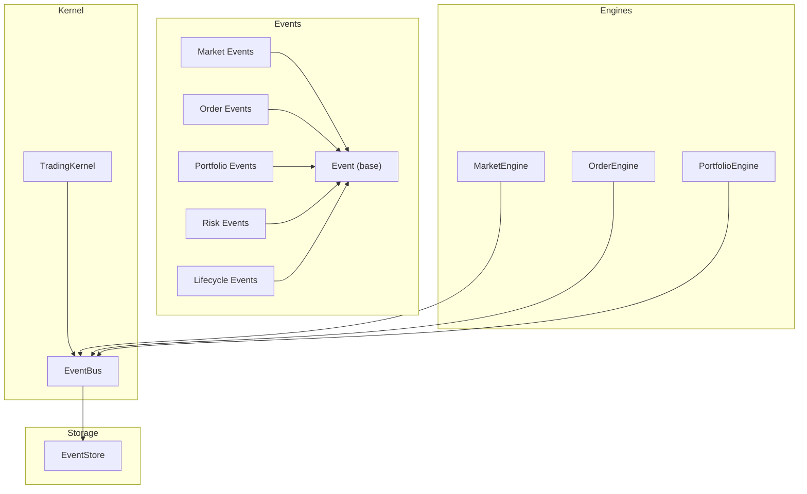
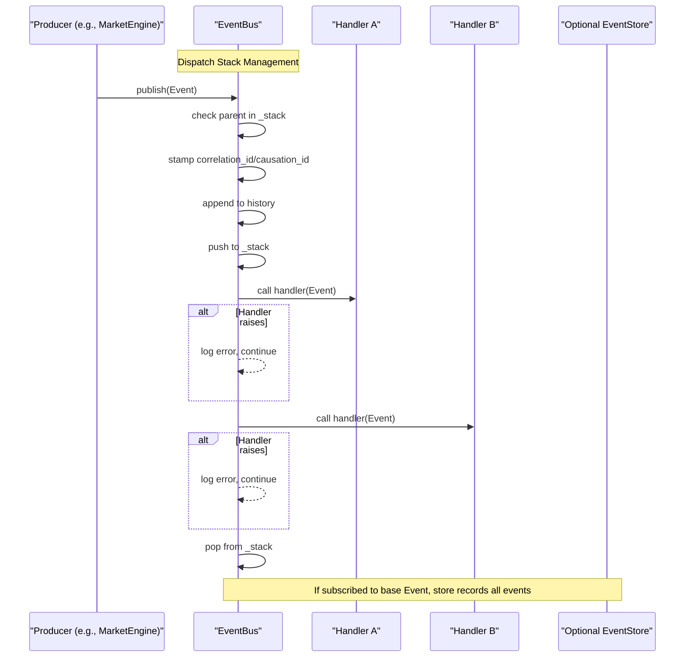
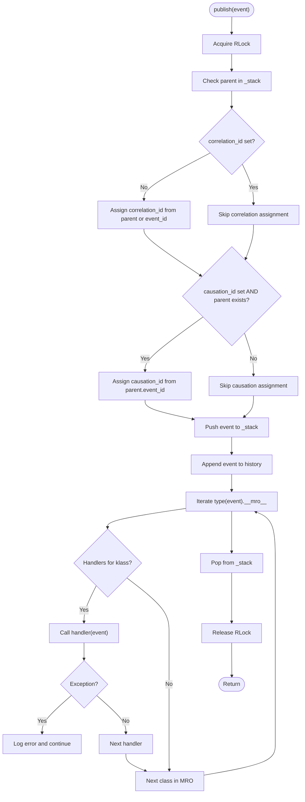
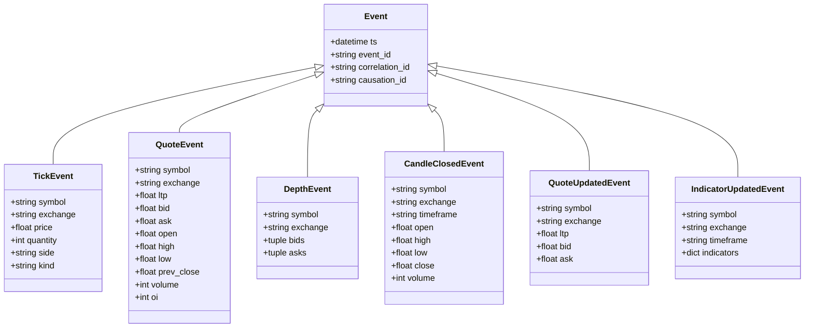
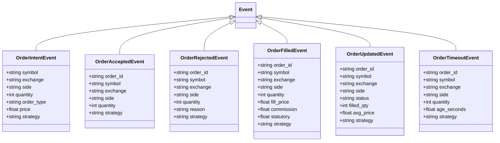
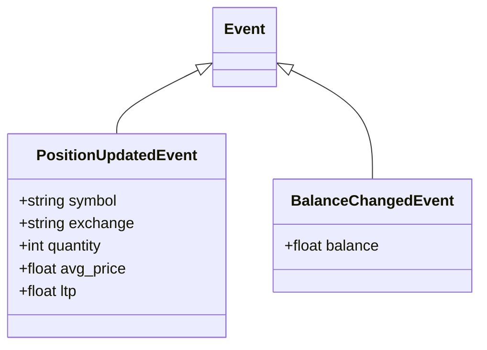
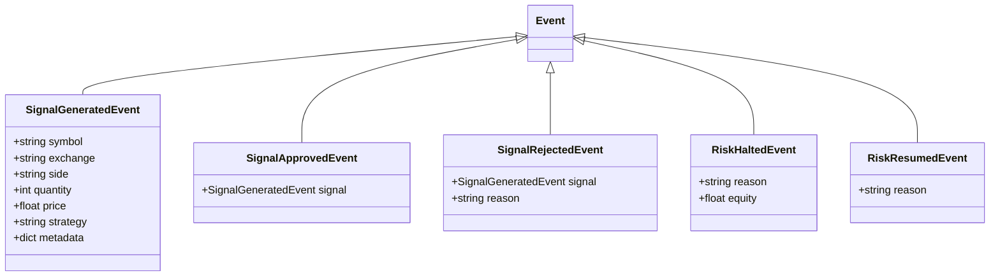
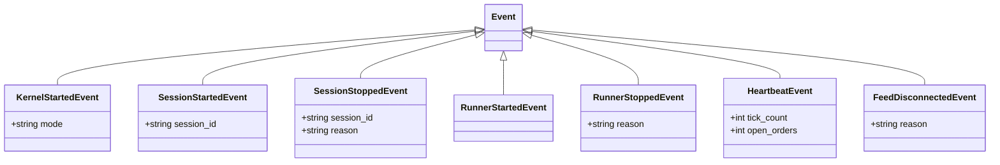
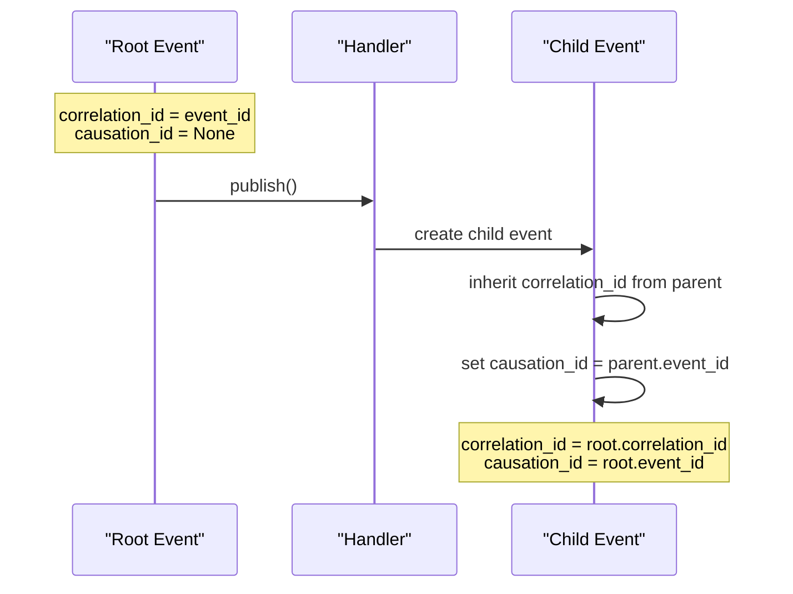
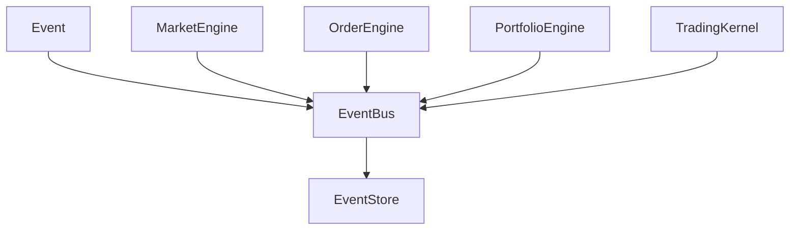

# Event Bus System

<cite>
**Referenced Files in This Document**
- [event_bus.py](file://ntrade/kernel/event_bus.py)
- [base.py](file://ntrade/events/base.py)
- [market.py](file://ntrade/events/market.py)
- [order.py](file://ntrade/events/order.py)
- [portfolio.py](file://ntrade/events/portfolio.py)
- [risk.py](file://ntrade/events/risk.py)
- [lifecycle.py](file://ntrade/events/lifecycle.py)
- [__init__.py](file://ntrade/events/__init__.py)
- [session.py](file://ntrade/kernel/session.py)
- [market_engine.py](file://ntrade/engines/market_engine.py)
- [event_store.py](file://ntrade/storage/event_store.py)
- [test_event_traceability.py](file://tests/test_event_traceability.py)
</cite>

## Update Summary
**Changes Made**
- Added comprehensive documentation for correlation_id and causation_id tracking system
- Updated Event base class documentation to include new traceability fields
- Enhanced EventBus publish method documentation with causal chain propagation
- Added new section on event traceability and causal chain management
- Updated performance considerations to include traceability overhead
- Enhanced troubleshooting guide with traceability debugging techniques

## Table of Contents
1. [Introduction](#introduction)
2. [Project Structure](#project-structure)
3. [Core Components](#core-components)
4. [Architecture Overview](#architecture-overview)
5. [Detailed Component Analysis](#detailed-component-analysis)
6. [Event Traceability System](#event-traceability-system)
7. [Dependency Analysis](#dependency-analysis)
8. [Performance Considerations](#performance-considerations)
9. [Troubleshooting Guide](#troubleshooting-guide)
10. [Conclusion](#conclusion)
11. [Appendices](#appendices)

## Introduction
This document explains the EventBus implementation and its event-driven communication mechanism that decouples trading components in the nTrade kernel. The system uses a publish-subscribe pattern where subsystems publish typed events and subscribe to handlers, enabling flexible, resilient, and deterministic interactions across market data processing, order lifecycle, portfolio updates, risk checks, and kernel lifecycle management.

The EventBus is synchronous and thread-safe, with serialized dispatch via a reentrant lock. It supports handler registration by event type (including inheritance-based routing), error isolation per handler, and an in-memory history for replay and monitoring. Events are immutable dataclasses with deterministic timestamps sourced from the TradingClock, ensuring identical behavior across live, replay, and backtest modes.

**Updated** The EventBus now includes comprehensive event traceability through correlation_id and causation_id fields, enabling complete causal chain tracking across all published events.

## Project Structure
The event bus and event types are organized under:
- Kernel layer: EventBus implementation and wiring within the TradingKernel
- Events layer: Base event model and domain-specific event classes
- Storage layer: EventStore for persistence and replay with traceability support
- Engines: Consumers/producers of events that wire handlers and publish derived events



**Diagram sources**
- [event_bus.py](file://ntrade/kernel/event_bus.py)
- [base.py](file://ntrade/events/base.py)
- [event_store.py](file://ntrade/storage/event_store.py)
- [market.py](file://ntrade/events/market.py)
- [order.py](file://ntrade/events/order.py)
- [portfolio.py](file://ntrade/events/portfolio.py)
- [risk.py](file://ntrade/events/risk.py)
- [lifecycle.py](file://ntrade/events/lifecycle.py)
- [session.py](file://ntrade/kernel/session.py)
- [market_engine.py](file://ntrade/engines/market_engine.py)

**Section sources**
- [event_bus.py](file://ntrade/kernel/event_bus.py)
- [base.py](file://ntrade/events/base.py)
- [event_store.py](file://ntrade/storage/event_store.py)
- [session.py](file://ntrade/kernel/session.py)
- [market_engine.py](file://ntrade/engines/market_engine.py)

## Core Components
- EventBus: Synchronous, thread-safe pub/sub bus with MRO-based routing, per-handler error isolation, bounded history, and automatic traceability stamping.
- Event base class: Immutable dataclass carrying deterministic timestamp, unique identifier, and traceability fields (correlation_id, causation_id).
- Domain events: Typed events for market data, orders, portfolio, risk, and lifecycle with full traceability support.

Key responsibilities:
- EventBus.subscribe(event_type, handler): Register handlers; returns the handler for convenience.
- EventBus.unsubscribe(event_type, handler): Remove a previously registered handler.
- EventBus.publish(event): Serialize dispatch over MRO, record event in history, isolate handler exceptions, and stamp traceability IDs.

Event typing and metadata:
- All events inherit from Event and carry ts (datetime), event_id (unique hex), correlation_id (causal chain grouping), and causation_id (parent event reference).
- Some events include additional fields such as metadata (e.g., signal events).

**Section sources**
- [event_bus.py](file://ntrade/kernel/event_bus.py)
- [base.py](file://ntrade/events/base.py)
- [__init__.py](file://ntrade/events/__init__.py)

## Architecture Overview
The EventBus sits at the center of the kernel, connecting engines and external producers/consumers. Handlers subscribe to specific event types or base classes, receiving subclass events through MRO traversal. Publishing is serialized to ensure consistent state transitions and prevent torn reads when multiple threads produce events. The EventBus maintains an internal dispatch stack to track causal relationships between events.



**Diagram sources**
- [event_bus.py](file://ntrade/kernel/event_bus.py)
- [session.py](file://ntrade/kernel/session.py)

**Section sources**
- [event_bus.py](file://ntrade/kernel/event_bus.py)
- [session.py](file://ntrade/kernel/session.py)

## Detailed Component Analysis

### EventBus Class
Responsibilities:
- Maintain subscriber maps keyed by event type
- Provide subscribe/unsubscribe APIs
- Publish events with MRO-based routing and automatic traceability stamping
- Record events into a bounded deque history
- Expose thread-safe accessors for history and length
- Manage internal dispatch stack for causal relationship tracking

Implementation highlights:
- Thread safety: RLock serializes subscription changes and publishing
- Error isolation: Each handler invocation is wrapped in try/except; exceptions are logged and do not stop other handlers
- History: Fixed-size deque ensures memory bounds; accessible via property
- Clearing: Clears both subscribers and history atomically
- Traceability: Automatic correlation_id/causation_id assignment from dispatch stack



**Diagram sources**
- [event_bus.py](file://ntrade/kernel/event_bus.py)

**Section sources**
- [event_bus.py](file://ntrade/kernel/event_bus.py)

### Event Base Class and Typing System
- Event is a frozen dataclass with keyword-only fields: ts (datetime), event_id (auto-generated unique string), correlation_id (causal chain grouping), and causation_id (parent event reference)
- Immutability ensures deterministic recording and replay
- Timestamps must come from the TradingClock to maintain zero parity across modes
- correlation_id groups related events in a causal chain (None = bus assigns)
- causation_id points to the immediate parent event's event_id (None = root event)



**Diagram sources**
- [base.py](file://ntrade/events/base.py)
- [market.py](file://ntrade/events/market.py)

**Section sources**
- [base.py](file://ntrade/events/base.py)
- [market.py](file://ntrade/events/market.py)

### Order Lifecycle Events
These events represent the flow from signal approval to execution outcomes:
- OrderIntentEvent: Pre-execution intent created after risk approval
- OrderAcceptedEvent: Execution target accepted the order
- OrderRejectedEvent: Execution target or risk rejected the order
- OrderFilledEvent: Fill confirmation with price and costs
- OrderUpdatedEvent: Status changes for open orders
- OrderTimeoutEvent: Pending order exceeded timeout threshold



**Diagram sources**
- [order.py](file://ntrade/events/order.py)

**Section sources**
- [order.py](file://ntrade/events/order.py)

### Portfolio Events
- PositionUpdatedEvent: Reflects net position changes after fills
- BalanceChangedEvent: Account balance updates after fills or cash movements



**Diagram sources**
- [portfolio.py](file://ntrade/events/portfolio.py)

**Section sources**
- [portfolio.py](file://ntrade/events/portfolio.py)

### Risk Events
- SignalGeneratedEvent: Strategy decision with trade parameters and optional metadata
- SignalApprovedEvent: Risk passed the signal; OMS may materialize it
- SignalRejectedEvent: Risk blocked the signal with reason
- RiskHaltedEvent: Circuit breaker tripped; trading must stop
- RiskResumedEvent: Circuit breaker cleared; trading may resume



**Diagram sources**
- [risk.py](file://ntrade/events/risk.py)

**Section sources**
- [risk.py](file://ntrade/events/risk.py)

### Lifecycle Events
- KernelStartedEvent: Kernel finished wiring and is live
- SessionStartedEvent: Trading session began
- SessionStoppedEvent: Session ended with flush/close
- RunnerStartedEvent: LiveRunner began orchestration loop
- RunnerStoppedEvent: LiveRunner stopped and cleaned up
- HeartbeatEvent: Periodic heartbeat proving kernel liveness
- FeedDisconnectedEvent: Market feed websocket disconnected



**Diagram sources**
- [lifecycle.py](file://ntrade/events/lifecycle.py)

**Section sources**
- [lifecycle.py](file://ntrade/events/lifecycle.py)

### Handler Registration Patterns and Event Routing
- Subscribe by exact type or base class: Subscribers to a base class receive all subclasses via MRO traversal
- Handler signature: Callable[[Event], None]
- Unsubscribe removes a previously registered handler safely
- Example usage patterns:
  - Engines subscribe to raw market events and publish normalized events
  - Optional full-event recording subscribes to base Event for audit/replay

```mermaid
sequenceDiagram
participant Engine as "MarketEngine"
participant Bus as "EventBus"
participant Store as "EventStore (optional)"
Engine->>Bus : subscribe(TickEvent, on_tick)
Engine->>Bus : subscribe(QuoteEvent, on_quote)
Engine->>Bus : subscribe(DepthEvent, on_depth)
Store->>Bus : subscribe(Event, _record)
Note over Engine,Store : Handlers registered; any published event routed by MRO
```

**Diagram sources**
- [market_engine.py](file://ntrade/engines/market_engine.py)
- [session.py](file://ntrade/kernel/session.py)

**Section sources**
- [market_engine.py](file://ntrade/engines/market_engine.py)
- [session.py](file://ntrade/kernel/session.py)

## Event Traceability System

### Correlation ID and Causation ID
The EventBus implements comprehensive event traceability through two key fields:

- **correlation_id**: Groups all events belonging to the same causal chain. Root events get their own event_id as correlation_id, while derived events inherit the chain's correlation_id.
- **causation_id**: Points to the immediate parent event's event_id, establishing direct causal relationships.

### Automatic Traceability Assignment
When an event is published:
1. The EventBus checks if correlation_id is already set (caller-provided)
2. If not set, assigns correlation_id from parent event or uses event_id for root events
3. Sets causation_id from parent.event_id if available and not already set
4. Maintains internal dispatch stack (_stack) to track current causal context

### Causal Chain Propagation
Events published from within handlers automatically inherit traceability information:
- Root events: correlation_id = event_id, causation_id = None
- Derived events: correlation_id = parent.correlation_id, causation_id = parent.event_id
- Full chains share the same correlation_id while maintaining individual causation links

### Explicit Override Support
Callers can explicitly set correlation_id and causation_id when creating events, which will be preserved and not overwritten by the bus.

### EventStore Integration
The EventStore seamlessly handles correlation_id and causation_id fields during serialization and deserialization:
- New events include traceability fields in JSONL format
- Old events without traceability fields decode correctly with None values
- Backward compatibility maintained for existing event stores



**Diagram sources**
- [event_bus.py](file://ntrade/kernel/event_bus.py)
- [base.py](file://ntrade/events/base.py)
- [test_event_traceability.py](file://tests/test_event_traceability.py)

**Section sources**
- [event_bus.py](file://ntrade/kernel/event_bus.py)
- [base.py](file://ntrade/events/base.py)
- [test_event_traceability.py](file://tests/test_event_traceability.py)
- [event_store.py](file://ntrade/storage/event_store.py)

## Dependency Analysis
The EventBus depends on the Event base class and is used extensively by engines and the kernel. Engines subscribe to specific event types and publish derived events, forming a clear producer-consumer graph. The EventStore provides persistence and replay capabilities with full traceability support.



**Diagram sources**
- [event_bus.py](file://ntrade/kernel/event_bus.py)
- [base.py](file://ntrade/events/base.py)
- [event_store.py](file://ntrade/storage/event_store.py)
- [market_engine.py](file://ntrade/engines/market_engine.py)
- [session.py](file://ntrade/kernel/session.py)

**Section sources**
- [event_bus.py](file://ntrade/kernel/event_bus.py)
- [base.py](file://ntrade/events/base.py)
- [event_store.py](file://ntrade/storage/event_store.py)
- [market_engine.py](file://ntrade/engines/market_engine.py)
- [session.py](file://ntrade/kernel/session.py)

## Performance Considerations
- Synchronous vs asynchronous processing:
  - EventBus is synchronous; dispatch occurs within the same thread context
  - Serialization via RLock prevents concurrent modifications and ensures consistent state
- Handler priority:
  - Dispatch follows most-derived-first order using type(event).__mro__
  - No explicit priority field; ordering is determined by Python's MRO
- Memory management:
  - History is a bounded deque with configurable maxlen; older events are dropped automatically
  - Clear() resets subscribers and history atomically
  - Internal dispatch stack (_stack) maintains minimal overhead for traceability
- Throughput:
  - Minimal overhead per publish: append to deque, iterate matching handlers, and stamp traceability IDs
  - Exception handling per handler avoids cascading failures but adds logging overhead
- Traceability overhead:
  - Correlation_id/causation_id assignment adds negligible overhead (simple string operations)
  - Dispatch stack maintains constant space complexity per nested event publication

[No sources needed since this section provides general guidance]

## Troubleshooting Guide
Common issues and remedies:
- Handler exceptions:
  - Exceptions are caught and logged; check logs for handler names and event types
  - Isolate faulty handlers to prevent bus disruption
- Missing handlers:
  - Ensure correct event type registration; verify MRO if subscribing to base classes
- Memory growth:
  - Adjust max_history during EventBus initialization to bound memory usage
- Replay and audit:
  - Subscribe to base Event to capture all events for debugging and replay
- Traceability debugging:
  - Use correlation_id to group related events across the entire causal chain
  - Follow causation_id links to reconstruct event sequences
  - Inspect bus.history for complete event timeline with traceability information
  - Verify that root events have correlation_id = event_id and causation_id = None
  - Check that derived events properly inherit correlation_id and set causation_id

**Section sources**
- [event_bus.py](file://ntrade/kernel/event_bus.py)
- [session.py](file://ntrade/kernel/session.py)
- [test_event_traceability.py](file://tests/test_event_traceability.py)

## Conclusion
The EventBus provides a robust, deterministic, and decoupled communication backbone for the nTrade kernel. Its synchronous, thread-safe design, MRO-based routing, error isolation, bounded history, and comprehensive traceability make it suitable for high-frequency trading environments where reliability, reproducibility, and complete event chain visibility are critical. By adhering to the event typing system, handler registration patterns, and automatic traceability features, developers can build scalable, modular trading systems with clear separation of concerns and complete auditability.

[No sources needed since this section summarizes without analyzing specific files]

## Appendices

### Concrete Examples

- Custom event creation:
  - Define a new dataclass inheriting from Event with keyword-only fields
  - Use deterministic timestamps from the TradingClock
  - Include metadata where appropriate for traceability
  - Optionally set correlation_id/causation_id for custom causal relationships

- Handler registration:
  - Subscribe engines to relevant event types
  - Optionally subscribe to base Event for full recording with traceability
  - Use correlation_id to correlate related events across handlers

- Event flow debugging:
  - Inspect history via bus.history for complete event timeline
  - Monitor logs for handler exceptions
  - Use session-level start/stop events to correlate lifecycle phases
  - Filter events by correlation_id to analyze specific causal chains
  - Follow causation_id links to reconstruct event sequences

**Section sources**
- [test_event_traceability.py](file://tests/test_event_traceability.py)
- [event_bus.py](file://ntrade/kernel/event_bus.py)
- [base.py](file://ntrade/events/base.py)