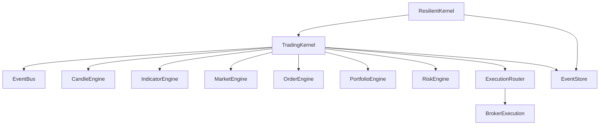
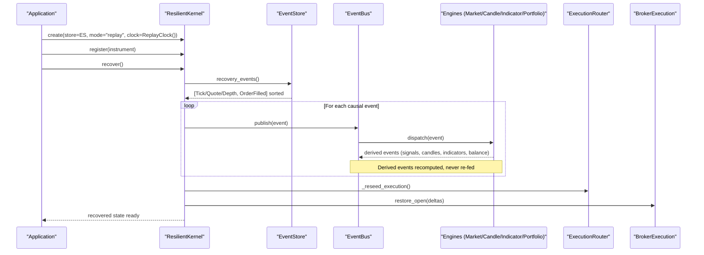
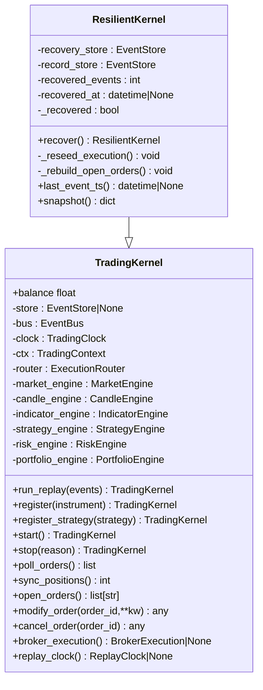
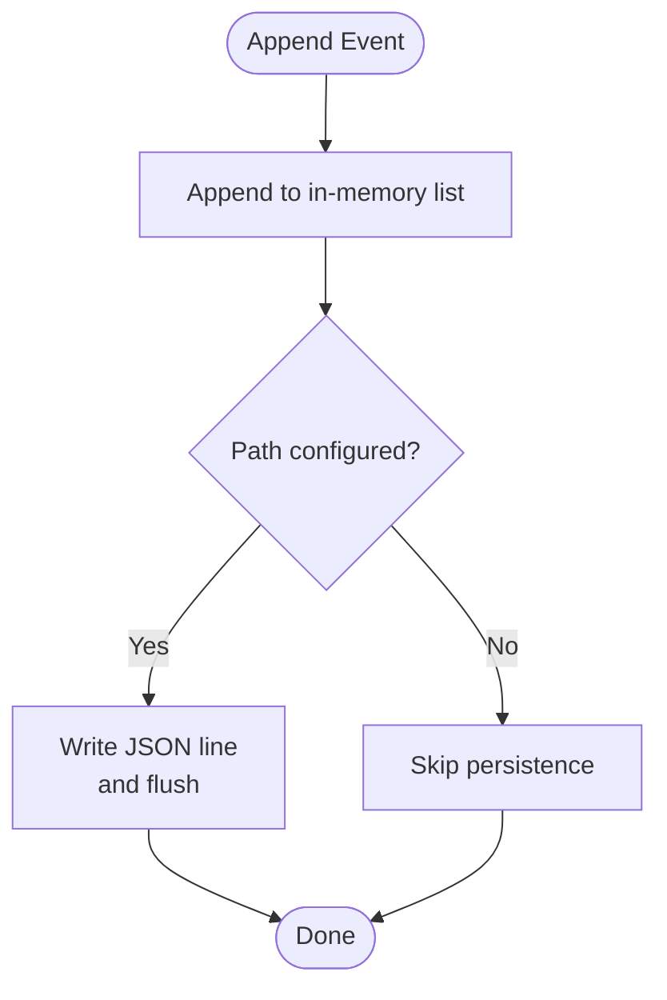
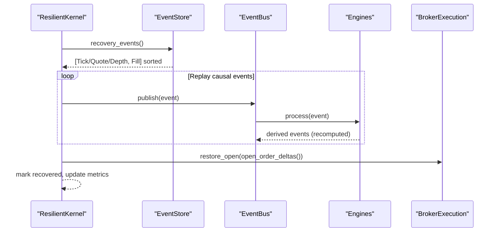
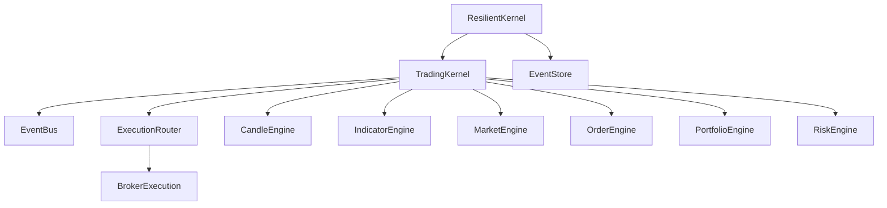

# Resilient Kernel & Crash Recovery

<cite>
**Referenced Files in This Document**
- [resilient.py](file://ntrade/kernel/resilient.py)
- [event_store.py](file://ntrade/storage/event_store.py)
- [session.py](file://ntrade/kernel/session.py)
- [base.py](file://ntrade/events/base.py)
- [event_bus.py](file://ntrade/kernel/event_bus.py)
- [clock.py](file://ntrade/kernel/clock.py)
- [router.py](file://ntrade/execution/router.py)
- [broker_executor.py](file://ntrade/execution/broker_executor.py)
- [market.py](file://ntrade/events/market.py)
- [order.py](file://ntrade/events/order.py)
- [test_kernel_resilient.py](file://tests/test_kernel_resilient.py)
</cite>

## Table of Contents
1. [Introduction](#introduction)
2. [Project Structure](#project-structure)
3. [Core Components](#core-components)
4. [Architecture Overview](#architecture-overview)
5. [Detailed Component Analysis](#detailed-component-analysis)
6. [Dependency Analysis](#dependency-analysis)
7. [Performance Considerations](#performance-considerations)
8. [Troubleshooting Guide](#troubleshooting-guide)
9. [Conclusion](#conclusion)
10. [Appendices](#appendices)

## Introduction
This document explains the ResilientKernel implementation that provides crash recovery and an audit trail for the trading system. It shows how a resilient kernel wraps the standard TradingKernel with EventStore integration to record causal events, replay them deterministically, and restore system state after failures. It also covers event store architecture (persistent logging, filtering, efficient storage/retrieval), crash recovery mechanics (replay from last checkpoint), audit trail capabilities (compliance and debugging), backend integration patterns, performance optimizations for high-frequency scenarios, setup examples, and monitoring guidance.

## Project Structure
The resilient kernel is implemented as a thin extension over the core TradingKernel, leveraging the EventBus, TradingClock, ExecutionRouter, and an append-only EventStore. The key files involved are:
- ResilientKernel: crash recovery orchestration and state restoration
- EventStore: persistent, replayable event log
- TradingKernel: engine stack wiring and replay loop
- EventBus: synchronous publish/subscribe bus with history
- TradingClock: deterministic time source for zero-parity replay
- ExecutionRouter and BrokerExecution: order routing and live lifecycle management
- Market and Order events: canonical event types used by the store and engines

**Diagram sources**
- [resilient.py:17-78](file://ntrade/kernel/resilient.py#L17-L78)
- [session.py:38-103](file://ntrade/kernel/session.py#L38-L103)
- [event_store.py:76-104](file://ntrade/storage/event_store.py#L76-L104)
- [router.py:19-49](file://ntrade/execution/router.py#L19-L49)
- [broker_executor.py:53-107](file://ntrade/execution/broker_executor.py#L53-L107)

**Section sources**
- [resilient.py:17-78](file://ntrade/kernel/resilient.py#L17-L78)
- [session.py:38-103](file://ntrade/kernel/session.py#L38-L103)
- [event_store.py:76-104](file://ntrade/storage/event_store.py#L76-L104)

## Core Components
- ResilientKernel: Extends TradingKernel to support recovery from an EventStore. It replays only causal events (market data + fills), rebuilds derived state deterministically, re-seeds execution sequences, and restores open-order deltas.
- EventStore: Append-only, JSONL-backed event log with in-memory index. Provides recovery_events() for causal streams, open_order_deltas() for partial-fill reconstruction, and market_events() for pure market data replay.
- TradingKernel: Wires the engine stack, manages the EventBus, optional full-event recording via EventStore, and provides run_replay() for deterministic processing.
- EventBus: Thread-safe pub/sub with bounded history; records all events for auditing and replay.
- TradingClock: Deterministic clock abstraction; ReplayClock drives zero-parity replay.
- ExecutionRouter and BrokerExecution: Route intents to targets; BrokerExecution tracks open orders and emits lifecycle events.

Key responsibilities:
- Zero-parity invariant: same event stream produces identical decisions across live, replay, and backtest.
- Causal ordering: recovery_events sorts by timestamp then by recorded index to preserve causality.
- One-shot recovery: recover() must be called before strategies are registered to avoid re-trading.

**Section sources**
- [resilient.py:17-78](file://ntrade/kernel/resilient.py#L17-L78)
- [event_store.py:76-210](file://ntrade/storage/event_store.py#L76-L210)
- [session.py:38-147](file://ntrade/kernel/session.py#L38-L147)
- [event_bus.py:24-81](file://ntrade/kernel/event_bus.py#L24-L81)
- [clock.py:14-55](file://ntrade/kernel/clock.py#L14-L55)
- [router.py:19-49](file://ntrade/execution/router.py#L19-L49)
- [broker_executor.py:53-107](file://ntrade/execution/broker_executor.py#L53-L107)

## Architecture Overview
ResilientKernel orchestrates crash recovery by:
- Subscribing to the base Event class on the bus to record every event into an EventStore (audit trail).
- On startup, calling recover() to replay only causal events (market ticks/quotes/depth and fills) through the engine stack without attaching strategies.
- Rebuilding portfolio, positions, balances, candles, indicators, and instrument state deterministically.
- Re-seeding execution sequences and restoring open-order deltas so resumed polling emits only remaining quantities.

**Diagram sources**
- [resilient.py:43-78](file://ntrade/kernel/resilient.py#L43-L78)
- [event_store.py:183-210](file://ntrade/storage/event_store.py#L183-L210)
- [session.py:135-147](file://ntrade/kernel/session.py#L135-L147)
- [event_bus.py:47-66](file://ntrade/kernel/event_bus.py#L47-L66)
- [broker_executor.py:188-200](file://ntrade/execution/broker_executor.py#L188-L200)

## Detailed Component Analysis

### ResilientKernel
ResilientKernel extends TradingKernel to provide deterministic crash recovery:
- Constructor accepts a recovery store and optional record store for continued auditing.
- recover():
  - Validates one-shot constraint and empty-strategies requirement.
  - Retrieves causal events from EventStore.recovery_events().
  - Temporarily unsubscribes the recording handler to avoid re-appending recovered events.
  - Runs run_replay() to rebuild state deterministically.
  - Re-seeds execution sequences and restores open-order deltas.
  - Marks recovery complete and records metrics (count, timestamp).
- Helper methods:
  - _reseed_execution(): bumps simulated execution sequence counters past any recovered fill IDs to prevent collisions.
  - _rebuild_open_orders(): reconstructs per-order filled/remaining deltas for BrokerExecution using open_order_deltas().
  - last_event_ts(): returns the last causal event timestamp for resume point tracking.
  - snapshot(): returns a summary including balance, positions, and instruments.

**Diagram sources**
- [resilient.py:17-78](file://ntrade/kernel/resilient.py#L17-L78)
- [session.py:38-147](file://ntrade/kernel/session.py#L38-L147)

**Section sources**
- [resilient.py:17-78](file://ntrade/kernel/resilient.py#L17-L78)
- [resilient.py:80-122](file://ntrade/kernel/resilient.py#L80-L122)
- [resilient.py:124-147](file://ntrade/kernel/resilient.py#L124-L147)

### EventStore Architecture
EventStore implements an append-only, replayable event log:
- Persistence: JSONL file when path provided; otherwise in-memory only.
- Serialization: Encodes nested events recursively; decodes unknown types gracefully.
- Querying:
  - events(event_type=None, symbol=None): filter by type or symbol.
  - market_events(): returns only market data events (Tick/Quote/Depth).
  - recovery_events(): returns causal stream (market + fills) sorted by timestamp and recorded index to preserve causality.
  - open_order_deltas(): reconstructs per-order partial-fill deltas for still-open orders.
- Lifecycle: clear(), close(), iteration, length.

**Diagram sources**
- [event_store.py:89-99](file://ntrade/storage/event_store.py#L89-L99)

**Section sources**
- [event_store.py:76-210](file://ntrade/storage/event_store.py#L76-L210)

### Crash Recovery Mechanism
Crash recovery ensures deterministic state restoration:
- Only causal events (market data and fills) are replayed; derived events (signals, candles, indicators, balance updates) are recomputed by the kernel.
- Causal ordering uses timestamp plus recorded index to maintain effect-before-cause semantics.
- After replay:
  - Execution sequences are reseeded to avoid ID collisions.
  - Open-order deltas are restored so poll() resumes emitting only remaining quantities.
  - Snapshot exposes recovered metrics and state.

**Diagram sources**
- [resilient.py:43-78](file://ntrade/kernel/resilient.py#L43-L78)
- [event_store.py:183-210](file://ntrade/storage/event_store.py#L183-L210)
- [broker_executor.py:188-200](file://ntrade/execution/broker_executor.py#L188-L200)

**Section sources**
- [resilient.py:43-78](file://ntrade/kernel/resilient.py#L43-L78)
- [event_store.py:183-210](file://ntrade/storage/event_store.py#L183-L210)

### Audit Trail Functionality
Audit trail supports compliance and debugging:
- Full event recording: TradingKernel subscribes to the base Event class and appends every published event to the EventStore.
- Filtering: EventStore.events() allows querying by type and symbol; market_events() isolates causal market data.
- Timeline reconstruction: recovery_events() yields a causally ordered stream suitable for timeline analysis and post-mortem review.
- Correlation: Events carry timestamps from TradingClock and unique event_ids; fills correlate with originating market events via timestamp and recorded index.

**Section sources**
- [session.py:71-77](file://ntrade/kernel/session.py#L71-L77)
- [event_store.py:116-135](file://ntrade/storage/event_store.py#L116-L135)
- [event_store.py:183-210](file://ntrade/storage/event_store.py#L183-L210)
- [base.py:16-22](file://ntrade/events/base.py#L16-L22)

### Integration with Storage Backends
EventStore supports two modes:
- In-memory: no path provided; events stay in memory for testing or ephemeral sessions.
- Persistent JSONL: path provided; events appended line-by-line with flush for durability.

Future backend extensions can be achieved by:
- Implementing a custom append-only writer behind EventStore.append()
- Using streaming writes for high-throughput scenarios
- Adding partitioning by symbol/time window for large datasets

**Section sources**
- [event_store.py:76-99](file://ntrade/storage/event_store.py#L76-L99)

### Performance Optimization Techniques
- Causal stream filtering: recovery_events() selects only market and fill events to minimize replay overhead.
- Deterministic replay: ReplayClock ensures consistent timing without wall-clock variability.
- Bounded history: EventBus maintains a deque with max length to control memory usage during live sessions.
- Efficient sorting: recovery_events() uses timestamp plus recorded index to avoid expensive comparisons.
- Minimal I/O: EventStore flushes once per append; consider batching for very high-frequency scenarios.

**Section sources**
- [event_store.py:183-210](file://ntrade/storage/event_store.py#L183-L210)
- [event_bus.py:24-31](file://ntrade/kernel/event_bus.py#L24-L31)
- [clock.py:31-46](file://ntrade/kernel/clock.py#L31-L46)

## Dependency Analysis
ResilientKernel depends on:
- TradingKernel for engine stack and replay loop
- EventStore for causal event retrieval and open-order delta reconstruction
- EventBus for event publishing and subscription management
- ExecutionRouter and BrokerExecution for order lifecycle and ID sequencing

**Diagram sources**
- [resilient.py:17-78](file://ntrade/kernel/resilient.py#L17-L78)
- [session.py:38-103](file://ntrade/kernel/session.py#L38-L103)
- [event_store.py:76-104](file://ntrade/storage/event_store.py#L76-L104)
- [router.py:19-49](file://ntrade/execution/router.py#L19-L49)
- [broker_executor.py:53-107](file://ntrade/execution/broker_executor.py#L53-L107)

**Section sources**
- [resilient.py:17-78](file://ntrade/kernel/resilient.py#L17-L78)
- [session.py:38-103](file://ntrade/kernel/session.py#L38-L103)
- [event_store.py:76-104](file://ntrade/storage/event_store.py#L76-L104)

## Performance Considerations
- High-frequency trading scenarios benefit from:
  - Causal event filtering to reduce replay volume
  - Deterministic clock to avoid synchronization overhead
  - Bounded event history to prevent memory growth
  - Efficient JSONL serialization with immediate flush for durability
- Monitoring recommendations:
  - Track recovered_events count and recovered_at timestamp
  - Monitor EventStore size and file growth rate
  - Measure EventBus history length and fan-out ratio
  - Observe BrokerExecution open_orders() count and poll latency

[No sources needed since this section provides general guidance]

## Troubleshooting Guide
Common issues and resolutions:
- Recover already ran: Ensure recover() is called only once before registering strategies.
- No recovery store: Provide a valid EventStore instance to ResilientKernel.
- Strategies registered before recovery: Register strategies after recover() completes.
- Unknown event types during decode: EventStore._decode skips unknown types gracefully; ensure event classes are registered.
- Partial-fill delta mismatch: Verify open_order_deltas() includes all relevant order lifecycle events.
- Order ID collisions: _reseed_execution() bumps sequences; confirm new orders use next BRK- id.

**Section sources**
- [resilient.py:43-78](file://ntrade/kernel/resilient.py#L43-L78)
- [event_store.py:60-73](file://ntrade/storage/event_store.py#L60-L73)
- [broker_executor.py:109-116](file://ntrade/execution/broker_executor.py#L109-L116)

## Conclusion
ResilientKernel provides robust crash recovery and audit trail capabilities by wrapping TradingKernel with EventStore integration. It ensures deterministic state restoration through causal event replay, maintains compliance through comprehensive event logging, and supports high-frequency trading with optimized storage and retrieval patterns. The architecture enables seamless integration with different storage backends and offers monitoring capabilities for system health and recovery metrics.

[No sources needed since this section summarizes without analyzing specific files]

## Appendices

### Setup Examples
- Basic resilient kernel setup:
  - Create EventStore with optional path for persistence
  - Initialize ResilientKernel with recovery store and ReplayClock
  - Register instruments and call recover() before strategies
  - Resume normal operation with strategies registered

- Event store configuration:
  - Use in-memory store for testing
  - Configure JSONL path for production persistence
  - Monitor file growth and implement rotation policies

- Recovery procedures:
  - Validate recovery store integrity
  - Call recover() once before strategy registration
  - Verify snapshot() output matches expected state
  - Resume polling and position synchronization

**Section sources**
- [test_kernel_resilient.py:44-51](file://tests/test_kernel_resilient.py#L44-L51)
- [test_kernel_resilient.py:195-212](file://tests/test_kernel_resilient.py#L195-L212)
- [test_kernel_resilient.py:215-228](file://tests/test_kernel_resilient.py#L215-L228)

### Monitoring Capabilities
- System health:
  - Track kernel mode and session status
  - Monitor broker connection and order lifecycle
  - Observe engine pipeline throughput

- Storage utilization:
  - Measure EventStore size and growth rate
  - Monitor JSONL file operations and flush frequency
  - Implement cleanup policies for old sessions

- Recovery metrics:
  - Count recovered events and timestamp
  - Verify position and balance reconciliation
  - Track open-order delta restoration success

**Section sources**
- [resilient.py:136-147](file://ntrade/kernel/resilient.py#L136-L147)
- [event_store.py:231-236](file://ntrade/storage/event_store.py#L231-L236)
- [event_bus.py:68-72](file://ntrade/kernel/event_bus.py#L68-L72)