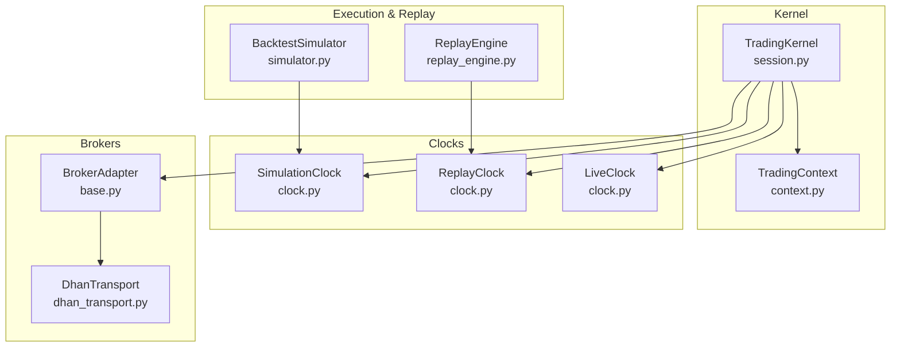
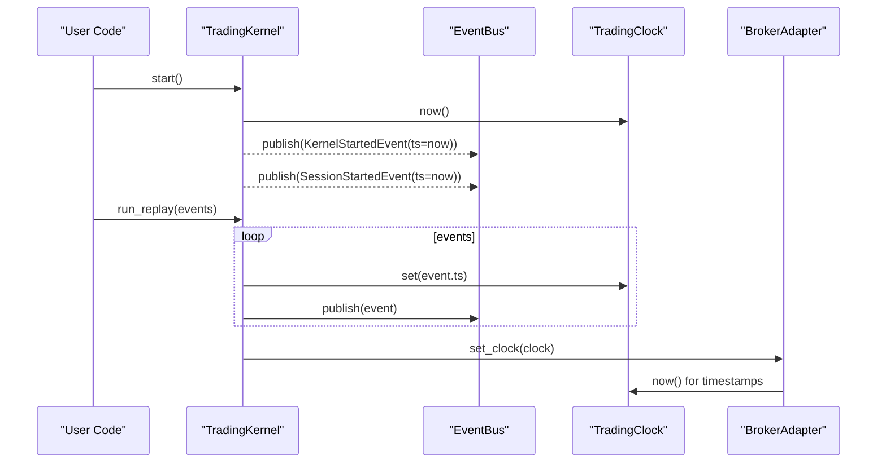
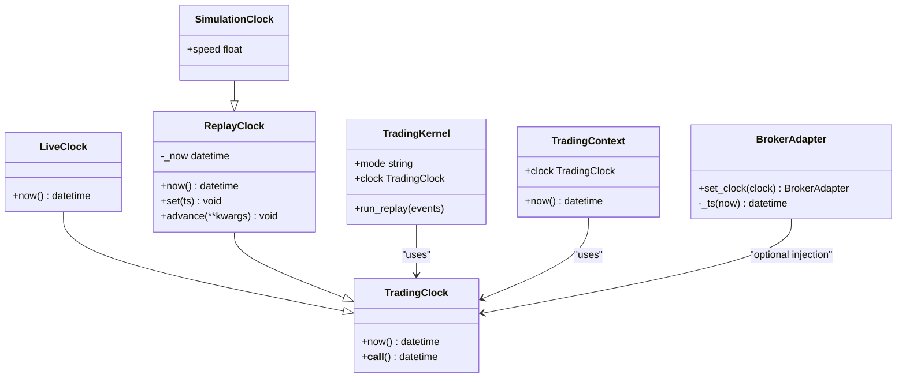
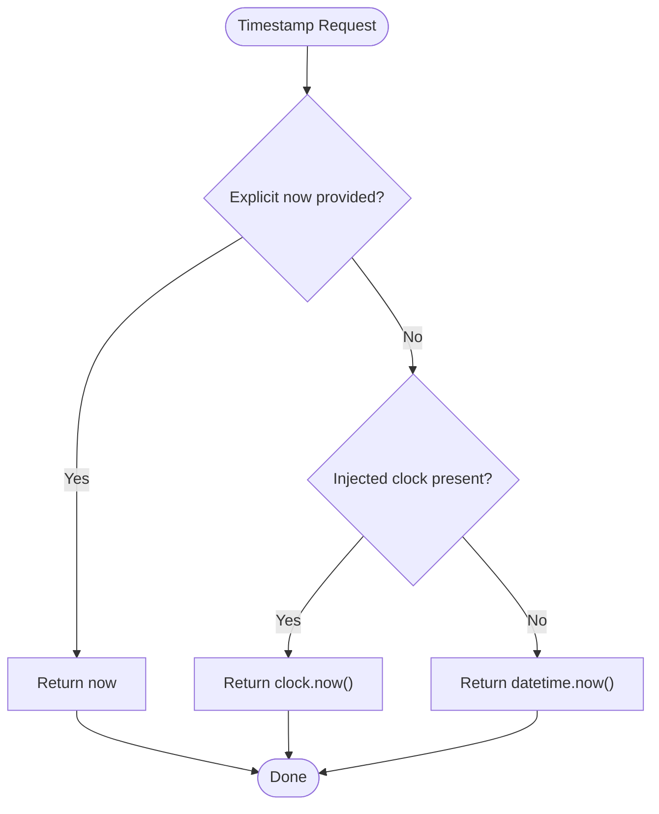
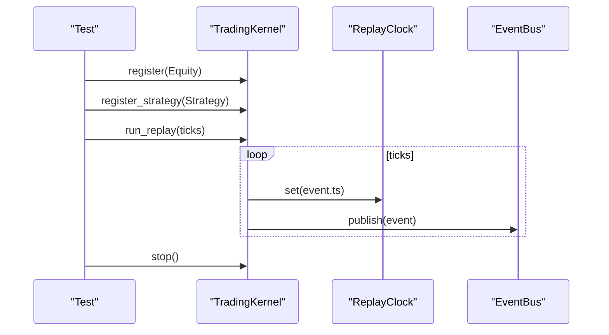
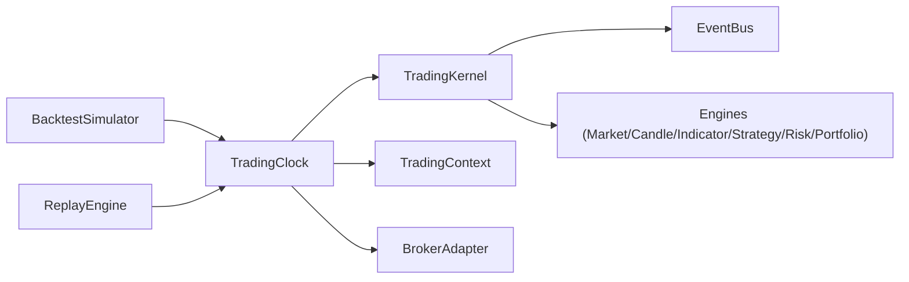

# Trading Clock Abstraction

<cite>
**Referenced Files in This Document**
- [clock.py](file://ntrade/kernel/clock.py)
- [session.py](file://ntrade/kernel/session.py)
- [context.py](file://ntrade/kernel/context.py)
- [base.py](file://ntrade/brokers/base.py)
- [dhan_transport.py](file://ntrade/brokers/dhan_transport.py)
- [simulator.py](file://ntrade/backtest/simulator.py)
- [replay_engine.py](file://ntrade/replay/replay_engine.py)
- [trading_session.py](file://ntrade/kernel/trading_session.py)
- [test_event_bus_clock.py](file://tests/test_event_bus_clock.py)
- [test_replay_backtest.py](file://tests/test_replay_backtest.py)
</cite>

## Table of Contents
1. Introduction
2. Project Structure
3. Core Components
4. Architecture Overview
5. Detailed Component Analysis
6. Dependency Analysis
7. Performance Considerations
8. Troubleshooting Guide
9. Conclusion

## Introduction
This document explains the TradingClock abstraction layer that centralizes time management across live, replay, and backtest modes. It covers the base interface and its concrete implementations: LiveClock for wall-time operations, ReplayClock for deterministic time progression during replay testing, and SimulationClock for backtest scenarios with optional speed scaling. It also documents clock.set() for time manipulation, now() for current time access, timezone handling, zero-parity guarantees, broker integration for timestamp normalization, event sequencing, usage examples, debugging techniques, performance implications, and best practices.

## Project Structure
The TradingClock lives under the kernel module and is consumed by the kernel session, context, replay engine, backtest simulator, and brokers. The following diagram shows how the clock integrates into the system.

**Diagram sources**
- [session.py:38-100](file://ntrade/kernel/session.py#L38-L100)
- [context.py:17-49](file://ntrade/kernel/context.py#L17-L49)
- [clock.py:14-55](file://ntrade/kernel/clock.py#L14-L55)
- [simulator.py:58-143](file://ntrade/backtest/simulator.py#L58-L143)
- [replay_engine.py:14-24](file://ntrade/replay/replay_engine.py#L14-L24)
- [base.py:25-57](file://ntrade/brokers/base.py#L25-L57)
- [dhan_transport.py:60-67](file://ntrade/brokers/dhan_transport.py#L60-L67)

**Section sources**
- [clock.py:1-55](file://ntrade/kernel/clock.py#L1-L55)
- [session.py:38-100](file://ntrade/kernel/session.py#L38-L100)
- [context.py:17-49](file://ntrade/kernel/context.py#L17-L49)
- [simulator.py:58-143](file://ntrade/backtest/simulator.py#L58-L143)
- [replay_engine.py:14-24](file://ntrade/replay/replay_engine.py#L14-L24)
- [base.py:25-57](file://ntrade/brokers/base.py#L25-L57)
- [dhan_transport.py:60-67](file://ntrade/brokers/dhan_transport.py#L60-L67)

## Core Components
- TradingClock (base): Defines the contract for time retrieval via now() and callable behavior.
- LiveClock: Returns wall-clock datetime.now().
- ReplayClock: Deterministic clock driven by set() and advance(), used in replay to follow event timestamps.
- SimulationClock: Extends ReplayClock with a speed factor for backtesting.

Key methods and properties:
- now(): Current time source for all engines and strategies.
- set(ts): Jump to a specific timestamp (ReplayClock/SimulationClock).
- advance(**kwargs): Advance by timedelta kwargs (ReplayClock).
- speed: Time scale factor (SimulationClock).

Zero-parity principle:
- All modes share the same kernel and engine stack; only the clock and execution target differ.
- Replay and backtest use deterministic clocks so identical event streams produce identical decisions as live trading.

**Section sources**
- [clock.py:14-55](file://ntrade/kernel/clock.py#L14-L55)
- [session.py:38-70](file://ntrade/kernel/session.py#L38-L70)

## Architecture Overview
The TradingKernel wires the engine stack and injects the clock into the context and brokers. During replay or backtest, the clock is set per event or bar to ensure deterministic time progression. Broakers receive the clock to normalize their timestamps.

**Diagram sources**
- [session.py:120-145](file://ntrade/kernel/session.py#L120-L145)
- [base.py:35-57](file://ntrade/brokers/base.py#L35-L57)

**Section sources**
- [session.py:120-145](file://ntrade/kernel/session.py#L120-L145)
- [base.py:35-57](file://ntrade/brokers/base.py#L35-L57)

## Detailed Component Analysis

### TradingClock Base Interface
- now(): Abstract method returning a datetime instance.
- __call__(): Convenience to call now().

Usage patterns:
- Strategies and engines should never call datetime.now(); they must use the injected clock.
- Context exposes now() delegating to the clock.

**Section sources**
- [clock.py:14-22](file://ntrade/kernel/clock.py#L14-L22)
- [context.py:48-49](file://ntrade/kernel/context.py#L48-L49)

### LiveClock
- now(): Returns wall-clock time.
- Use case: Live trading where real-time is required.

Behavior:
- No state mutation; always returns current wall time.

**Section sources**
- [clock.py:24-28](file://ntrade/kernel/clock.py#L24-L28)

### ReplayClock
- now(): Returns internal _now.
- set(ts): Jumps to a specific timestamp.
- advance(**kwargs): Advances by timedelta parameters.

Use cases:
- ReplayEngine sets the clock to each event’s timestamp.
- Backtest loops set the clock per bar before publishing Quote/Tick events.

Determinism:
- Identical event sequences yield identical decisions across runs.

**Section sources**
- [clock.py:31-46](file://ntrade/kernel/clock.py#L31-L46)
- [session.py:133-145](file://ntrade/kernel/session.py#L133-L145)
- [simulator.py:116-143](file://ntrade/backtest/simulator.py#L116-L143)

### SimulationClock
- Inherits ReplayClock functionality.
- speed: Float multiplier for time scaling in backtests.

Use cases:
- Speed up backtests while preserving deterministic ordering.

**Section sources**
- [clock.py:49-55](file://ntrade/kernel/clock.py#L49-L55)

### Integration with TradingKernel and Context
- TradingKernel initializes with a TradingClock (default LiveClock).
- TradingContext holds the clock and exposes now().
- Broker adapters can receive set_clock(clock) to normalize timestamps.

**Diagram sources**
- [clock.py:14-55](file://ntrade/kernel/clock.py#L14-L55)
- [session.py:38-70](file://ntrade/kernel/session.py#L38-L70)
- [context.py:17-49](file://ntrade/kernel/context.py#L17-L49)
- [base.py:25-57](file://ntrade/brokers/base.py#L25-L57)

**Section sources**
- [session.py:38-70](file://ntrade/kernel/session.py#L38-L70)
- [context.py:17-49](file://ntrade/kernel/context.py#L17-L49)
- [base.py:25-57](file://ntrade/brokers/base.py#L25-L57)

### Broker Timestamp Normalization
- BrokerAdapter._ts(now) resolves timestamps: explicit now > injected clock > wall clock.
- DhanTransport uses an injected clock for timestamps when available.

**Diagram sources**
- [base.py:46-57](file://ntrade/brokers/base.py#L46-L57)
- [dhan_transport.py:60-67](file://ntrade/brokers/dhan_transport.py#L60-L67)

**Section sources**
- [base.py:46-57](file://ntrade/brokers/base.py#L46-L57)
- [dhan_transport.py:60-67](file://ntrade/brokers/dhan_transport.py#L60-L67)

### Zero-Parity Testing
- ReplayEngine and BacktestSimulator drive the kernel with deterministic clocks.
- Tests demonstrate identical fills between live and replay when using ReplayClock.

**Diagram sources**
- [replay_engine.py:14-24](file://ntrade/replay/replay_engine.py#L14-L24)
- [session.py:133-145](file://ntrade/kernel/session.py#L133-L145)
- [test_replay_backtest.py:83-99](file://tests/test_replay_backtest.py#L83-L99)

**Section sources**
- [test_replay_backtest.py:83-99](file://tests/test_replay_backtest.py#L83-L99)
- [replay_engine.py:14-24](file://ntrade/replay/replay_engine.py#L14-L24)
- [session.py:133-145](file://ntrade/kernel/session.py#L133-L145)

### Usage Examples

#### Strategy Usage
- Strategies should obtain time via ctx.now() or the injected clock rather than datetime.now().
- Example references:
  - Strategy hooks in tests show signal emission based on events; time-sensitive logic should rely on ctx.now().

**Section sources**
- [context.py:48-49](file://ntrade/kernel/context.py#L48-L49)
- [test_replay_backtest.py:58-70](file://tests/test_replay_backtest.py#L58-L70)

#### Deterministic Replay Scenarios
- ReplayEngine.run(events) drives the kernel with ReplayClock.
- BacktestSimulator.run(data) sets SimulationClock per bar and publishes Quote/Tick events.

**Section sources**
- [replay_engine.py:14-24](file://ntrade/replay/replay_engine.py#L14-L24)
- [simulator.py:116-143](file://ntrade/backtest/simulator.py#L116-L143)

#### Debugging Techniques
- Inspect bus.history to verify event order and timestamps.
- Assert clock.now() matches expected values after set/advance.
- Use test patterns to validate zero parity between live and replay.

**Section sources**
- [test_event_bus_clock.py:76-93](file://tests/test_event_bus_clock.py#L76-L93)
- [test_replay_backtest.py:72-81](file://tests/test_replay_backtest.py#L72-L81)

### Timezone Handling
- The codebase uses naive datetime objects from datetime.now() and does not enforce timezone-aware timestamps.
- Ensure consistent timezone semantics by:
  - Using UTC consistently at ingestion points if needed.
  - Avoiding mixing aware and naive datetimes.
- Brokers’ timestamp resolution falls back to datetime.now() when no clock is injected.

**Section sources**
- [base.py:46-57](file://ntrade/brokers/base.py#L46-L57)
- [clock.py:24-28](file://ntrade/kernel/clock.py#L24-L28)

## Dependency Analysis
The clock is a core dependency for kernel lifecycle, event sequencing, and broker timestamp normalization.

**Diagram sources**
- [session.py:38-100](file://ntrade/kernel/session.py#L38-L100)
- [context.py:17-49](file://ntrade/kernel/context.py#L17-L49)
- [base.py:25-57](file://ntrade/brokers/base.py#L25-L57)
- [simulator.py:58-143](file://ntrade/backtest/simulator.py#L58-L143)
- [replay_engine.py:14-24](file://ntrade/replay/replay_engine.py#L14-L24)

**Section sources**
- [session.py:38-100](file://ntrade/kernel/session.py#L38-L100)
- [context.py:17-49](file://ntrade/kernel/context.py#L17-L49)
- [base.py:25-57](file://ntrade/brokers/base.py#L25-L57)
- [simulator.py:58-143](file://ntrade/backtest/simulator.py#L58-L143)
- [replay_engine.py:14-24](file://ntrade/replay/replay_engine.py#L14-L24)

## Performance Considerations
- Prefer ctx.now() over repeated datetime.now() calls to maintain determinism and reduce overhead in replay/backtest.
- In backtests, avoid unnecessary clock.set() calls outside the main loop; batch updates per bar.
- Use SimulationClock.speed to accelerate backtests without altering event ordering.
- Minimize logging inside tight loops to prevent I/O bottlenecks.
- Keep event payloads small and immutable to reduce memory churn.

[No sources needed since this section provides general guidance]

## Troubleshooting Guide
Common issues and resolutions:
- Incorrect timestamps in logs:
  - Ensure broker.set_clock(clock) is called when running replay/backtest.
  - Verify clock.set() is invoked before publishing events.
- Non-deterministic results:
  - Confirm ReplayClock or SimulationClock is used instead of LiveClock in tests.
  - Validate event ordering and timestamps are monotonic.
- Timezone mismatches:
  - Use consistent naive or aware datetimes throughout; avoid mixing.
- Event ordering anomalies:
  - Inspect bus.history to confirm sequence and timestamps.

**Section sources**
- [session.py:133-145](file://ntrade/kernel/session.py#L133-L145)
- [base.py:46-57](file://ntrade/brokers/base.py#L46-L57)
- [test_event_bus_clock.py:76-93](file://tests/test_event_bus_clock.py#L76-L93)
- [test_replay_backtest.py:72-81](file://tests/test_replay_backtest.py#L72-L81)

## Conclusion
The TradingClock abstraction ensures consistent time management across live, replay, and backtest modes, enabling zero-parity testing and deterministic behavior. By centralizing time retrieval through now(), supporting set() and advance(), and integrating with brokers for timestamp normalization, it provides a robust foundation for time-sensitive trading systems. Adhering to best practices around clock usage, timezone consistency, and performance optimization will improve reliability and maintainability.