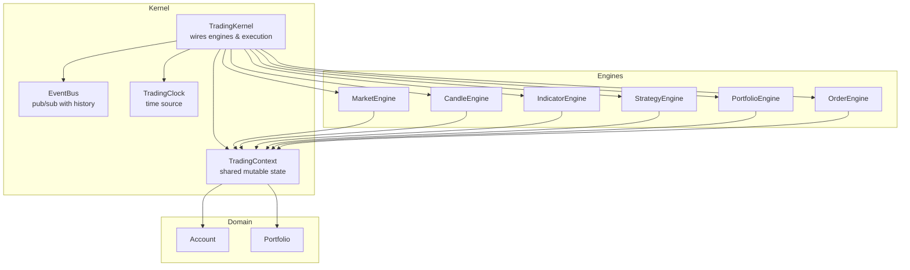
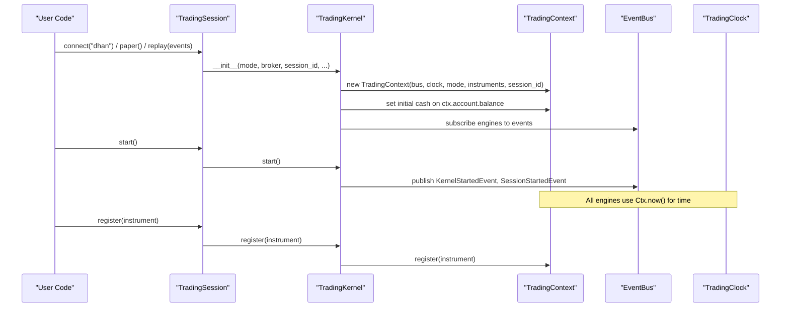
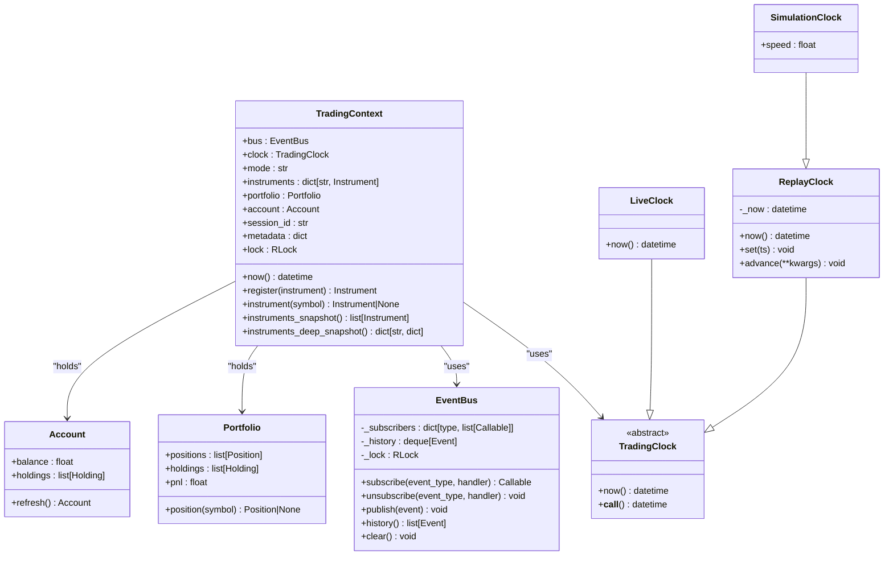
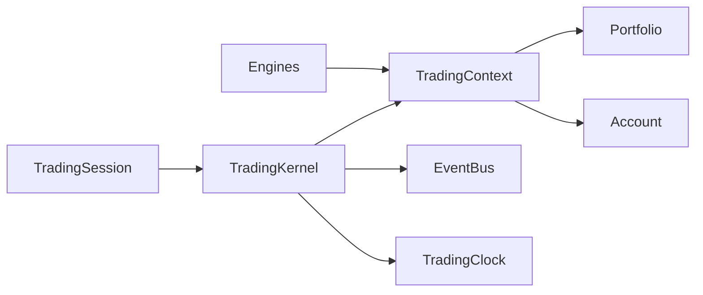

# Trading Context

<cite>
**Referenced Files in This Document**
- [context.py](file://ntrade/kernel/context.py)
- [session.py](file://ntrade/kernel/session.py)
- [trading_session.py](file://ntrade/kernel/trading_session.py)
- [event_bus.py](file://ntrade/kernel/event_bus.py)
- [clock.py](file://ntrade/kernel/clock.py)
- [portfolio.py](file://ntrade/domain/portfolio.py)
- [strategy_engine.py](file://ntrade/engines/strategy_engine.py)
- [portfolio_engine.py](file://ntrade/engines/portfolio_engine.py)
- [market_engine.py](file://ntrade/engines/market_engine.py)
- [test_context.py](file://tests/test_context.py)
</cite>

## Table of Contents
1. [Introduction](#introduction)
2. [Project Structure](#project-structure)
3. [Core Components](#core-components)
4. [Architecture Overview](#architecture-overview)
5. [Detailed Component Analysis](#detailed-component-analysis)
6. [Dependency Analysis](#dependency-analysis)
7. [Performance Considerations](#performance-considerations)
8. [Troubleshooting Guide](#troubleshooting-guide)
9. [Conclusion](#conclusion)

## Introduction
This document explains the TradingContext class, which provides the execution environment for strategies and engines. It encapsulates shared state such as the event bus, trading clock, account information, portfolio access, and instrument registry. It also documents how context initialization varies by mode (live, replay, backtest), how sessions manage lifecycle and resource injection, and how strategies and engines consistently access market data and perform trading operations through a unified API surface while maintaining isolation between sessions. Thread safety, context switching patterns, and debugging techniques are covered to help developers build robust, deterministic trading systems.

## Project Structure
TradingContext lives in the kernel layer and is wired into the TradingKernel, which constructs the engine stack and execution targets. The TradingSession composes the broker, kernel, and strategy runner, exposing a consistent API across modes. Engines subscribe to events via the EventBus and read/write shared state through the context.

**Diagram sources**
- [session.py:38-101](file://ntrade/kernel/session.py#L38-L101)
- [context.py:17-79](file://ntrade/kernel/context.py#L17-L79)
- [event_bus.py:24-81](file://ntrade/kernel/event_bus.py#L24-L81)
- [clock.py:14-55](file://ntrade/kernel/clock.py#L14-L55)
- [portfolio.py:63-173](file://ntrade/domain/portfolio.py#L63-L173)

**Section sources**
- [session.py:38-101](file://ntrade/kernel/session.py#L38-L101)
- [trading_session.py:39-142](file://ntrade/kernel/trading_session.py#L39-L142)

## Core Components
- TradingContext: Holds the EventBus, TradingClock, mode, instruments registry, Portfolio, Account, session_id, metadata, and a reentrant lock protecting instrument registration and iteration.
- TradingKernel: Constructs the context, wires engines, sets initial cash, injects clock into broker if supported, and manages lifecycle events.
- TradingSession: High-level entry point that creates brokers, kernels, and runners; exposes account/portfolio/order APIs and delegates to the kernel’s context when not using a live broker.
- EventBus: Synchronous pub/sub with RLock serialization, handler exception isolation, and event history for replay.
- TradingClock: Time abstraction with LiveClock, ReplayClock, and SimulationClock for deterministic time control.
- Portfolio and Account: Domain models representing positions/holdings and balance; updated by engines based on fills and broker sync.

Key responsibilities:
- Provide a single source of truth for time, events, and shared state.
- Offer thread-safe access to instruments and snapshots.
- Maintain isolation per session via separate contexts.
- Expose consistent APIs across modes through the session facade.

**Section sources**
- [context.py:17-79](file://ntrade/kernel/context.py#L17-L79)
- [session.py:38-101](file://ntrade/kernel/session.py#L38-L101)
- [trading_session.py:39-142](file://ntrade/kernel/trading_session.py#L39-L142)
- [event_bus.py:24-81](file://ntrade/kernel/event_bus.py#L24-L81)
- [clock.py:14-55](file://ntrade/kernel/clock.py#L14-L55)
- [portfolio.py:63-173](file://ntrade/domain/portfolio.py#L63-L173)

## Architecture Overview
The kernel initializes a TradingContext with an EventBus and a mode-specific clock. Engines subscribe to events and mutate context state safely under locks. Strategies receive events via StrategyEngine and emit signals through the context’s bus. Session methods delegate to either the broker or the kernel’s context depending on the mode.

**Diagram sources**
- [trading_session.py:73-142](file://ntrade/kernel/trading_session.py#L73-L142)
- [session.py:38-101](file://ntrade/kernel/session.py#L38-L101)
- [context.py:26-46](file://ntrade/kernel/context.py#L26-L46)
- [event_bus.py:47-66](file://ntrade/kernel/event_bus.py#L47-L66)
- [clock.py:24-55](file://ntrade/kernel/clock.py#L24-L55)

## Detailed Component Analysis

### TradingContext Class
TradingContext encapsulates:
- Event bus for decoupled communication
- Trading clock for deterministic time
- Mode flag for behavior differentiation
- Instrument registry with thread-safe accessors
- Portfolio and Account references updated by engines
- Session identifier and arbitrary metadata
- Reentrant lock for safe concurrent access

Initialization:
- Accepts bus, clock, mode, optional instruments, portfolio, account, session_id, and metadata.
- Defaults to empty portfolio/account if not provided.
- Stores a threading.RLock for mutual exclusion around instrument map mutations and iterations.

Access patterns:
- now(): returns current time from the clock.
- register(instrument): adds or updates an instrument by symbol under lock.
- instrument(symbol): retrieves an instrument by symbol under lock.
- instruments_snapshot(): returns a shallow list copy of all instruments under lock.
- instruments_deep_snapshot(): returns a deep snapshot mapping symbol to instrument.snapshot(), ensuring consistency during feed updates.

Thread safety:
- All instrument registry operations are protected by ctx.lock.
- Engines operating in multi-threaded environments (e.g., WebSocket feeds vs order threads) should acquire ctx.lock around critical sections that mutate shared state beyond what engines already protect internally.

Usage examples:
- Registering instruments before starting the kernel ensures engines can project state onto them.
- Using instruments_deep_snapshot() when serializing or iterating to avoid torn reads from concurrent feed updates.
- Accessing ctx.now() instead of datetime.now() for deterministic behavior across modes.

**Section sources**
- [context.py:17-79](file://ntrade/kernel/context.py#L17-L79)
- [test_context.py:14-69](file://tests/test_context.py#L14-L69)

### Context Initialization and Mode-Specific Configuration
TradingKernel constructs the context with:
- Mode: live, replay, or backtest
- Broker adapter (optional): clock injected via set_clock for deterministic timestamps
- Initial cash: seeds ctx.account.balance
- Optional event store: subscribes to base Event for recording

Mode differences:
- Live: uses LiveClock and real broker execution target.
- Replay: uses ReplayClock and replays timestamped events deterministically.
- Backtest/Simulation: uses SimulationClock with speed scaling and simulated execution with statutory charges.

Lifecycle:
- start(): publishes KernelStartedEvent and SessionStartedEvent.
- stop(): flushes candle engine and publishes SessionStoppedEvent.
- run_replay(): advances ReplayClock per event timestamp and publishes events.

**Section sources**
- [session.py:38-101](file://ntrade/kernel/session.py#L38-L101)
- [session.py:120-145](file://ntrade/kernel/session.py#L120-L145)
- [clock.py:24-55](file://ntrade/kernel/clock.py#L24-L55)

### Session Management and Resource Injection
TradingSession composes:
- BrokerAdapter (optional)
- TradingKernel (default constructed)
- StrategyRunner
- InstrumentFactory

Constructors:
- connect(broker): live mode with named broker
- paper(): deterministic offline mode with PaperBroker seeded with initial cash
- replay(events): deterministic replay mode with ReplayClock

Accessors:
- account(), portfolio(), balance(), positions(), orderbook(), tradebook(), order_report() delegate to broker when present, otherwise to kernel.ctx.

Lifecycle:
- start(): starts kernel and optionally runs replay events
- stop(): stops kernel
- connect_broker()/disconnect(): explicit broker connection management

**Section sources**
- [trading_session.py:39-142](file://ntrade/kernel/trading_session.py#L39-L142)
- [trading_session.py:176-216](file://ntrade/kernel/trading_session.py#L176-L216)
- [trading_session.py:240-249](file://ntrade/kernel/trading_session.py#L240-L249)

### Access Patterns for Portfolio, Account, Positions, and Instruments
- Portfolio: accessed via ctx.portfolio; contains positions and holdings; updated by PortfolioEngine on fills.
- Account: accessed via ctx.account; holds balance and holdings; updated by PortfolioEngine on fills.
- Positions: ctx.portfolio.positions; query via position(symbol).
- Instruments: ctx.instrument(symbol); register via ctx.register(instrument); iterate via instruments_snapshot() or instruments_deep_snapshot().

Engines update context state:
- PortfolioEngine consumes OrderFilledEvent to net positions, average entry prices, and adjust account balance with charges.
- MarketEngine publishes QuoteUpdatedEvent after updating instrument quote state.

**Section sources**
- [portfolio_engine.py:15-69](file://ntrade/engines/portfolio_engine.py#L15-L69)
- [market_engine.py:18-48](file://ntrade/engines/market_engine.py#L18-L48)
- [portfolio.py:63-173](file://ntrade/domain/portfolio.py#L63-L173)

### Integration with Kernel Lifecycle and Event System
- StrategyEngine subscribes to multiple event types and dispatches to strategy hooks.
- Strategy emits signals via ctx.bus.publish(SignalGeneratedEvent), which RiskEngine screens before becoming orders.
- EventBus serializes dispatch with RLock, records history, and isolates handler exceptions.

**Diagram sources**
- [context.py:17-79](file://ntrade/kernel/context.py#L17-L79)
- [event_bus.py:24-81](file://ntrade/kernel/event_bus.py#L24-L81)
- [clock.py:14-55](file://ntrade/kernel/clock.py#L14-L55)
- [portfolio.py:63-173](file://ntrade/domain/portfolio.py#L63-L173)

### Concrete Usage Examples
- Strategy usage:
  - Subclass Strategy and override hooks like on_tick, on_candle_closed, on_indicator_updated.
  - Use self.ctx.now() for timestamps and self.ctx.bus.emit(signal) to generate trade signals.
- Accessing market data:
  - Retrieve instruments via ctx.instrument(symbol) or iterate ctx.instruments_snapshot().
  - Quote updates flow through MarketEngine publishing QuoteUpdatedEvent.
- Performing trading operations:
  - Emit signals via Strategy.emit_signal(...), which publish SignalGeneratedEvent.
  - RiskEngine screens signals; OrderEngine converts approved signals into orders.
  - PortfolioEngine updates positions and balances on OrderFilledEvent.

**Section sources**
- [strategy_engine.py:18-46](file://ntrade/engines/strategy_engine.py#L18-L46)
- [market_engine.py:18-48](file://ntrade/engines/market_engine.py#L18-L48)
- [portfolio_engine.py:15-69](file://ntrade/engines/portfolio_engine.py#L15-L69)

## Dependency Analysis
TradingContext depends on EventBus and TradingClock, and holds references to Portfolio and Account. Engines depend on the context for state and event publishing. TradingKernel orchestrates wiring and lifecycle. TradingSession abstracts broker interactions and delegates to kernel context when appropriate.

**Diagram sources**
- [session.py:38-101](file://ntrade/kernel/session.py#L38-L101)
- [context.py:17-79](file://ntrade/kernel/context.py#L17-L79)
- [trading_session.py:39-142](file://ntrade/kernel/trading_session.py#L39-L142)

**Section sources**
- [session.py:38-101](file://ntrade/kernel/session.py#L38-L101)
- [trading_session.py:39-142](file://ntrade/kernel/trading_session.py#L39-L142)

## Performance Considerations
- Event dispatch is serialized via RLock; avoid heavy work in handlers to prevent blocking producers.
- Use instruments_deep_snapshot() when serializing or iterating to avoid inconsistent reads under concurrent feed updates.
- Minimize direct datetime.now() calls; rely on ctx.now() for deterministic behavior and reduced overhead.
- Keep strategy hooks lightweight; offload expensive computations to background tasks if necessary.
- Prefer shallow snapshots for frequent reads; deep snapshots are more expensive but ensure consistency.

[No sources needed since this section provides general guidance]

## Troubleshooting Guide
Common issues and resolutions:
- Deadlocks or stalls:
  - Ensure no long-running operations inside event handlers; they block the bus.
  - Verify ctx.lock is not held outside critical sections.
- Inconsistent instrument states:
  - Use instruments_deep_snapshot() when reading across threads.
  - Avoid mutating instruments directly; use ctx.register() and let engines update read-models.
- Missing data or stale quotes:
  - Confirm MarketEngine subscriptions and QuoteUpdatedEvent publication.
  - Check that instruments are registered before starting the kernel.
- Balance drift:
  - Validate PortfolioEngine handling of OrderFilledEvent and charge calculations.
  - Ensure broker sync is called in live mode to reconcile positions/balance.

Debugging techniques:
- Inspect EventBus.history to trace event flow and timestamps.
- Log ctx.now() at key points to verify deterministic time in replay/backtest.
- Use TradingSession.kernel.ctx.instruments_snapshot() to verify registered instruments.
- Print ctx.account.balance and ctx.portfolio.positions after fills to validate updates.

**Section sources**
- [event_bus.py:47-71](file://ntrade/kernel/event_bus.py#L47-L71)
- [context.py:61-79](file://ntrade/kernel/context.py#L61-L79)
- [portfolio_engine.py:15-69](file://ntrade/engines/portfolio_engine.py#L15-L69)

## Conclusion
TradingContext is the central hub for shared state and coordination in the trading kernel. It provides thread-safe access to instruments, deterministic time via TradingClock, and consistent access to portfolio and account state. Through TradingKernel and TradingSession, it supports multiple modes with isolated sessions and a uniform API surface. Proper usage of context methods, careful event handling, and adherence to thread-safety practices ensure robust, deterministic trading systems.

[No sources needed since this section summarizes without analyzing specific files]