# Trading Kernel

<cite>
**Referenced Files in This Document**
- [kernel/__init__.py](file://ntrade/kernel/__init__.py)
- [kernel/session.py](file://ntrade/kernel/session.py)
- [kernel/trading_session.py](file://ntrade/kernel/trading_session.py)
- [kernel/event_bus.py](file://ntrade/kernel/event_bus.py)
- [kernel/clock.py](file://ntrade/kernel/clock.py)
- [kernel/context.py](file://ntrade/kernel/context.py)
- [kernel/resilient.py](file://ntrade/kernel/resilient.py)
- [kernel/runner.py](file://ntrade/kernel/runner.py)
- [events/base.py](file://ntrade/events/base.py)
- [storage/event_store.py](file://ntrade/storage/event_store.py)
</cite>

## Table of Contents
1. [Introduction](#introduction)
2. [Project Structure](#project-structure)
3. [Core Components](#core-components)
4. [Architecture Overview](#architecture-overview)
5. [Detailed Component Analysis](#detailed-component-analysis)
6. [Dependency Analysis](#dependency-analysis)
7. [Performance Considerations](#performance-considerations)
8. [Troubleshooting Guide](#troubleshooting-guide)
9. [Conclusion](#conclusion)
10. [Appendices](#appendices)

## Introduction
This document explains the Trading Kernel subsystem, an event-driven orchestration engine that coordinates all framework components across live, replay, and backtest modes. It covers the central coordinator (TradingKernel), the publish-subscribe EventBus, the TradingClock abstraction, lifecycle management via TradingSession, the execution environment TradingContext, and crash recovery with ResilientKernel backed by EventStore. Concrete examples are provided for initialization, event handling, session management, configuration options, performance considerations, debugging techniques, thread safety, error handling, and monitoring capabilities.

## Project Structure
The kernel lives under ntrade/kernel and integrates with events, storage, engines, and execution modules. The public surface is exposed through kernel/__init__.py, which re-exports core classes for consumers.

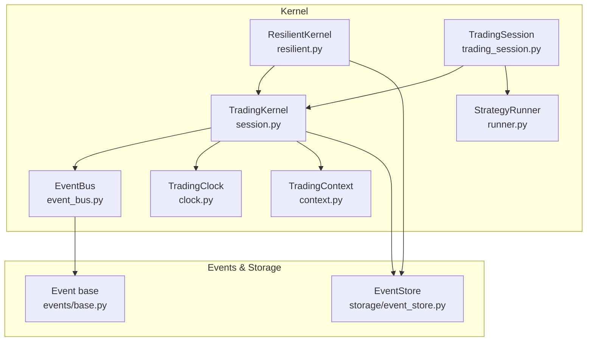

**Diagram sources**
- [kernel/session.py:38-101](file://ntrade/kernel/session.py#L38-L101)
- [kernel/event_bus.py:24-81](file://ntrade/kernel/event_bus.py#L24-L81)
- [kernel/clock.py:14-55](file://ntrade/kernel/clock.py#L14-L55)
- [kernel/context.py:17-79](file://ntrade/kernel/context.py#L17-L79)
- [kernel/resilient.py:17-78](file://ntrade/kernel/resilient.py#L17-L78)
- [kernel/runner.py:16-161](file://ntrade/kernel/runner.py#L16-L161)
- [kernel/trading_session.py:39-143](file://ntrade/kernel/trading_session.py#L39-L143)
- [events/base.py:16-22](file://ntrade/events/base.py#L16-L22)
- [storage/event_store.py:76-114](file://ntrade/storage/event_store.py#L76-L114)

**Section sources**
- [kernel/__init__.py:1-16](file://ntrade/kernel/__init__.py#L1-L16)
- [kernel/session.py:38-101](file://ntrade/kernel/session.py#L38-L101)
- [kernel/trading_session.py:39-143](file://ntrade/kernel/trading_session.py#L39-L143)

## Core Components
- TradingKernel: Wires the engine stack, manages lifecycle, wiring, replay, and optional event recording.
- EventBus: Synchronous pub/sub bus with handler isolation, MRO-based dispatch, and bounded history.
- TradingClock: Abstraction over time; LiveClock for wall time, ReplayClock/SimulationClock for deterministic time.
- TradingContext: Thread-safe shared state holding bus, clock, instruments, portfolio, account, and metadata.
- ResilientKernel: Crash recovery by replaying causal events from EventStore to rebuild state deterministically.
- StrategyRunner: Multi-strategy manager with per-strategy risk scoping and hot attach/detach.
- TradingSession: Unified entry point combining broker, kernel, instrument factory, and strategy runner.

**Section sources**
- [kernel/session.py:38-101](file://ntrade/kernel/session.py#L38-L101)
- [kernel/event_bus.py:24-81](file://ntrade/kernel/event_bus.py#L24-L81)
- [kernel/clock.py:14-55](file://ntrade/kernel/clock.py#L14-L55)
- [kernel/context.py:17-79](file://ntrade/kernel/context.py#L17-L79)
- [kernel/resilient.py:17-78](file://ntrade/kernel/resilient.py#L17-L78)
- [kernel/runner.py:16-161](file://ntrade/kernel/runner.py#L16-L161)
- [kernel/trading_session.py:39-143](file://ntrade/kernel/trading_session.py#L39-L143)

## Architecture Overview
The kernel orchestrates market data, candles, indicators, strategies, risk, portfolio, and execution through a single event bus. Time is abstracted via TradingClock so behavior is identical across live, replay, and backtest. Optional EventStore records events for audit and recovery.

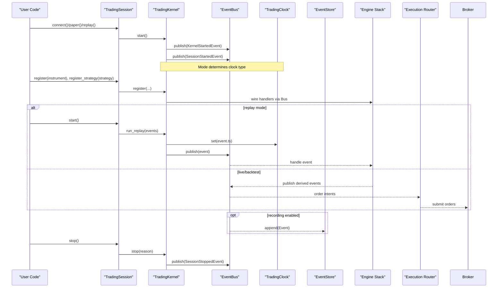

**Diagram sources**
- [kernel/trading_session.py:240-249](file://ntrade/kernel/trading_session.py#L240-L249)
- [kernel/session.py:120-145](file://ntrade/kernel/session.py#L120-L145)
- [kernel/event_bus.py:47-66](file://ntrade/kernel/event_bus.py#L47-L66)
- [storage/event_store.py:89-99](file://ntrade/storage/event_store.py#L89-L99)

## Detailed Component Analysis

### TradingKernel
Wires the engine stack and provides lifecycle and replay APIs. It supports three modes (live, replay, backtest) by swapping only the clock and execution target while keeping the stack identical.

Key responsibilities:
- Initialize and wire engines: Market, Candle, Indicator, Strategy, Risk, Portfolio, Order.
- Manage execution targets: BrokerExecution or SimulatedExecution via ExecutionRouter.
- Lifecycle: start/stop with lifecycle events.
- Replay: deterministic feed using ReplayClock.
- Recording: optional EventStore subscription to capture all events.

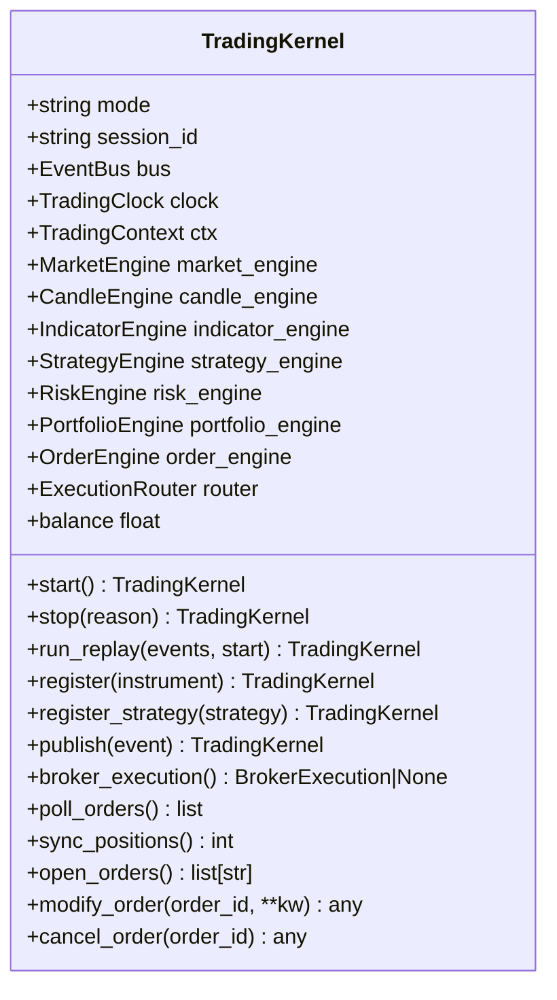

**Diagram sources**
- [kernel/session.py:38-101](file://ntrade/kernel/session.py#L38-L101)
- [kernel/session.py:120-198](file://ntrade/kernel/session.py#L120-L198)

**Section sources**
- [kernel/session.py:38-101](file://ntrade/kernel/session.py#L38-L101)
- [kernel/session.py:120-198](file://ntrade/kernel/session.py#L120-L198)

### EventBus
A synchronous publish-subscribe bus with:
- Handler registration by event type (MRO-based dispatch).
- Error isolation: exceptions in handlers are logged and swallowed.
- Serialization: RLock ensures consistent dispatch and prevents torn state.
- History: bounded deque for recent events.

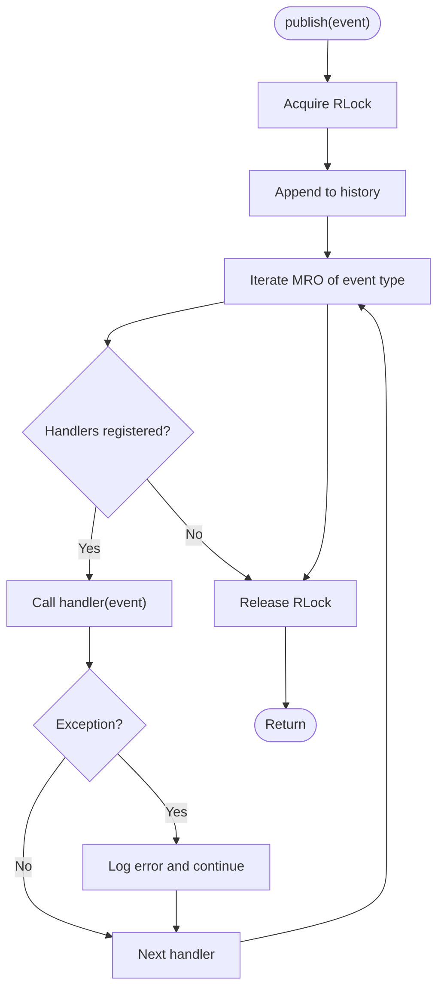

**Diagram sources**
- [kernel/event_bus.py:47-66](file://ntrade/kernel/event_bus.py#L47-L66)

**Section sources**
- [kernel/event_bus.py:24-81](file://ntrade/kernel/event_bus.py#L24-L81)

### TradingClock
Abstraction for time with three implementations:
- LiveClock: returns wall-clock time.
- ReplayClock: deterministic clock advanced by set/advance.
- SimulationClock: extends ReplayClock with speed scaling for backtests.

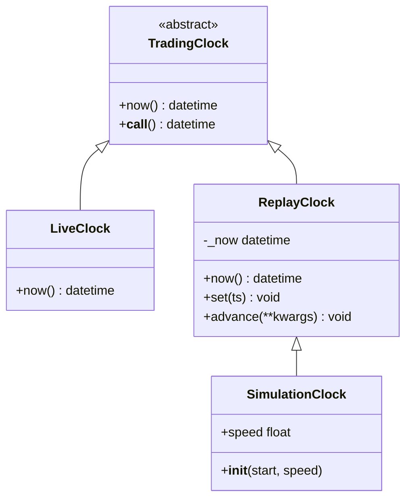

**Diagram sources**
- [kernel/clock.py:14-55](file://ntrade/kernel/clock.py#L14-L55)

**Section sources**
- [kernel/clock.py:14-55](file://ntrade/kernel/clock.py#L14-L55)

### TradingContext
Thread-safe shared state for engines and strategies:
- Holds bus, clock, mode, instruments, portfolio, account, session_id, metadata.
- Provides now(), register(), instrument(), snapshot methods.
- Uses RLock to protect instrument registration and iteration.

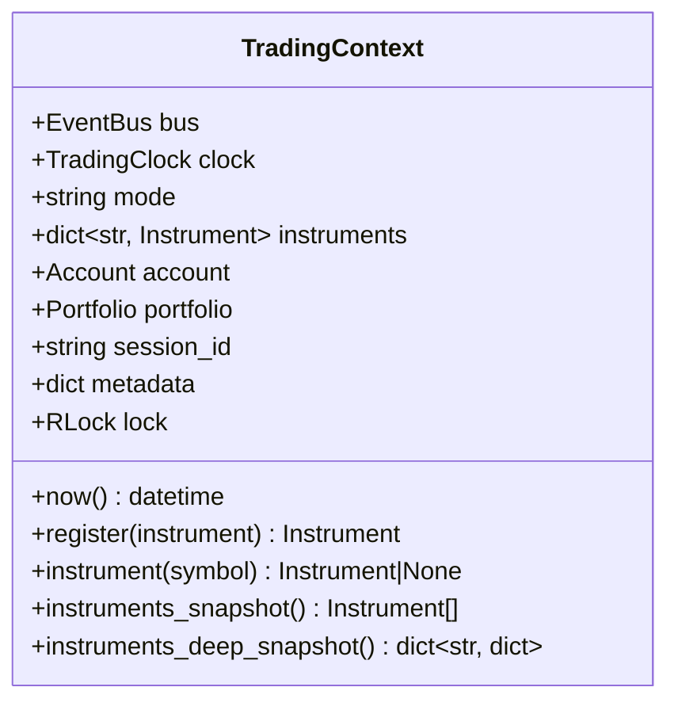

**Diagram sources**
- [kernel/context.py:17-79](file://ntrade/kernel/context.py#L17-L79)

**Section sources**
- [kernel/context.py:17-79](file://ntrade/kernel/context.py#L17-L79)

### ResilientKernel
Crash recovery by replaying causal events from EventStore:
- Replays market data and fills to rebuild state deterministically.
- Prevents double-trading by not re-emitting derived events.
- Reseeds execution sequences and rebuilds open-order deltas.
- One-shot recover() enforces correct usage order.

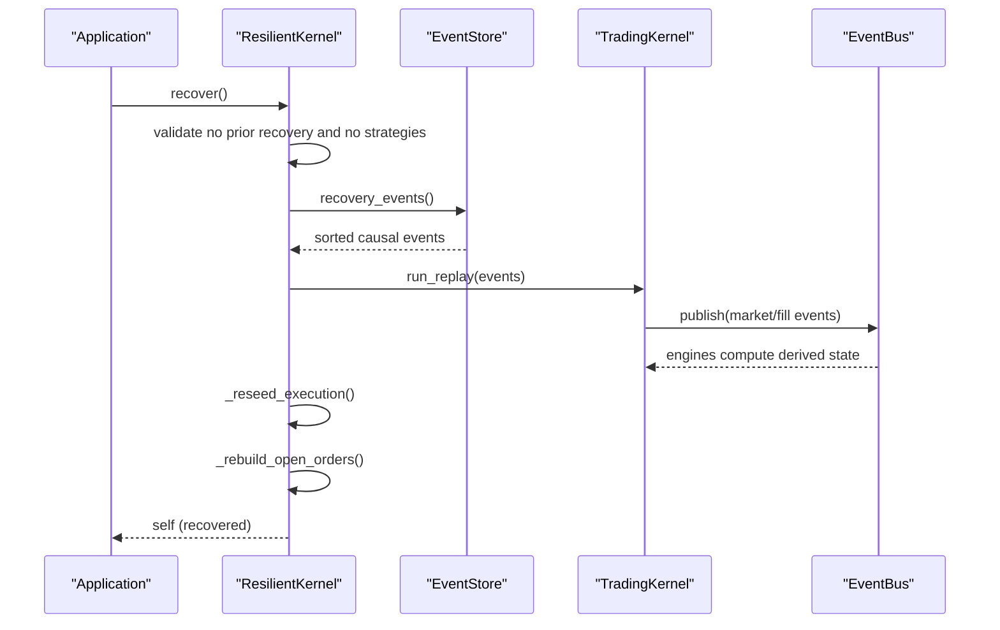

**Diagram sources**
- [kernel/resilient.py:43-78](file://ntrade/kernel/resilient.py#L43-L78)
- [storage/event_store.py:183-210](file://ntrade/storage/event_store.py#L183-L210)

**Section sources**
- [kernel/resilient.py:17-147](file://ntrade/kernel/resilient.py#L17-L147)
- [storage/event_store.py:183-210](file://ntrade/storage/event_store.py#L183-L210)

### StrategyRunner
Multi-strategy management on top of TradingKernel:
- Adds strategies with per-strategy RiskEngine scope.
- Hot attach/detach and enable/disable.
- Pauses global risk engine during add to avoid duplicate approvals.
- Provides status reporting and context-manager lifecycle.

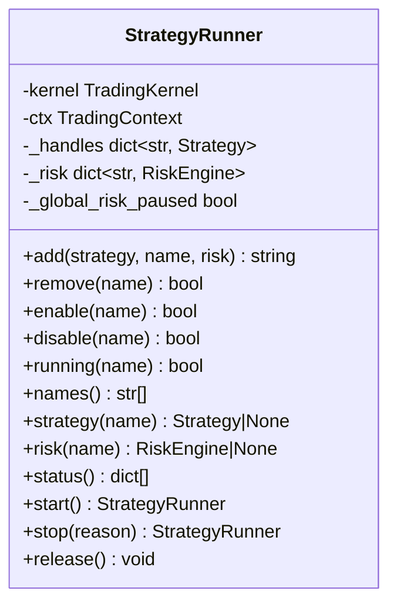

**Diagram sources**
- [kernel/runner.py:16-161](file://ntrade/kernel/runner.py#L16-L161)

**Section sources**
- [kernel/runner.py:16-161](file://ntrade/kernel/runner.py#L16-L161)

### TradingSession
Unified entry point combining broker, kernel, instrument factory, and strategy runner:
- Constructors: connect(broker), paper(), replay(events).
- Instrument creation helpers and account/portfolio accessors.
- Lifecycle: start(), stop(), connect_broker(), disconnect().
- Scanner facade lazily created.

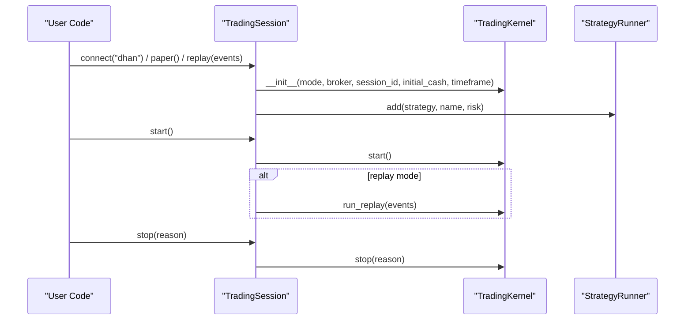

**Diagram sources**
- [kernel/trading_session.py:73-143](file://ntrade/kernel/trading_session.py#L73-L143)
- [kernel/trading_session.py:240-249](file://ntrade/kernel/trading_session.py#L240-L249)

**Section sources**
- [kernel/trading_session.py:39-143](file://ntrade/kernel/trading_session.py#L39-L143)
- [kernel/trading_session.py:240-249](file://ntrade/kernel/trading_session.py#L240-L249)

### Events and EventStore
- Event base: immutable dataclass with timestamp from TradingClock and unique id.
- EventStore: append-only, JSONL-backed store with causal queries and recovery helpers.

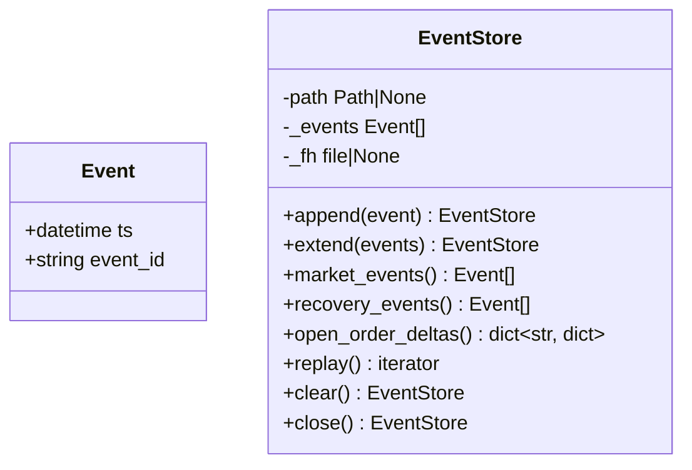

**Diagram sources**
- [events/base.py:16-22](file://ntrade/events/base.py#L16-L22)
- [storage/event_store.py:76-114](file://ntrade/storage/event_store.py#L76-L114)
- [storage/event_store.py:183-210](file://ntrade/storage/event_store.py#L183-L210)

**Section sources**
- [events/base.py:16-22](file://ntrade/events/base.py#L16-L22)
- [storage/event_store.py:76-114](file://ntrade/storage/event_store.py#L76-L114)
- [storage/event_store.py:183-210](file://ntrade/storage/event_store.py#L183-L210)

## Dependency Analysis
High-level dependencies among kernel components:

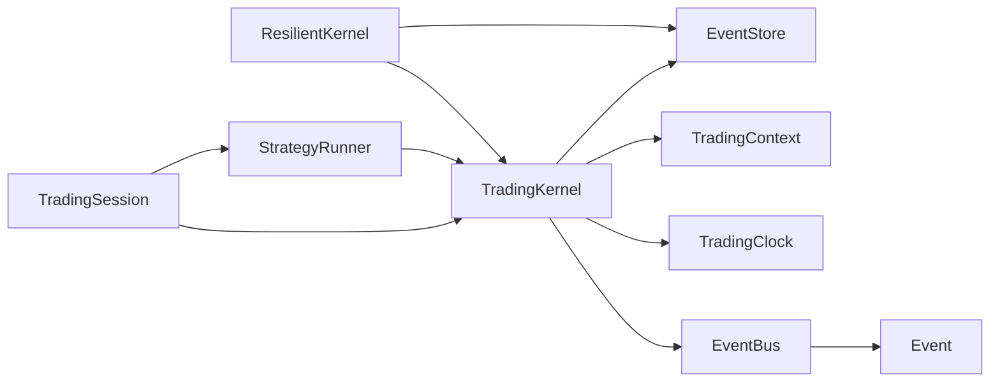

**Diagram sources**
- [kernel/session.py:38-101](file://ntrade/kernel/session.py#L38-L101)
- [kernel/resilient.py:17-78](file://ntrade/kernel/resilient.py#L17-L78)
- [kernel/runner.py:16-161](file://ntrade/kernel/runner.py#L16-L161)
- [kernel/trading_session.py:39-143](file://ntrade/kernel/trading_session.py#L39-L143)
- [kernel/event_bus.py:24-81](file://ntrade/kernel/event_bus.py#L24-L81)
- [events/base.py:16-22](file://ntrade/events/base.py#L16-L22)
- [storage/event_store.py:76-114](file://ntrade/storage/event_store.py#L76-L114)

**Section sources**
- [kernel/session.py:38-101](file://ntrade/kernel/session.py#L38-L101)
- [kernel/resilient.py:17-78](file://ntrade/kernel/resilient.py#L17-L78)
- [kernel/runner.py:16-161](file://ntrade/kernel/runner.py#L16-L161)
- [kernel/trading_session.py:39-143](file://ntrade/kernel/trading_session.py#L39-L143)
- [kernel/event_bus.py:24-81](file://ntrade/kernel/event_bus.py#L24-L81)
- [events/base.py:16-22](file://ntrade/events/base.py#L16-L22)
- [storage/event_store.py:76-114](file://ntrade/storage/event_store.py#L76-L114)

## Performance Considerations
- EventBus serialization: RLock serializes dispatch to prevent torn state; keep handlers fast and avoid blocking I/O inside handlers.
- History size: EventBus maintains a bounded deque; tune max_history to balance memory vs. debugging needs.
- EventStore persistence: JSONL append is efficient; consider periodic flush and rotation for long-running sessions.
- Snapshotting: Use shallow snapshots for iteration; deep snapshots when consistency across fields is required.
- Replay determinism: Ensure clocks follow event timestamps; avoid direct datetime.now() calls in engines/strategies.
- Execution routing: Separate live and simulated execution targets to minimize overhead in non-live modes.

[No sources needed since this section provides general guidance]

## Troubleshooting Guide
Common issues and remedies:
- Handler exceptions: EventBus logs and continues; inspect logs to identify failing subscribers.
- Recovery errors: ResilientKernel enforces one-shot recovery and requires no strategies before recover(); ensure correct ordering.
- Open-order mismatches after crash: Use EventStore.open_order_deltas() to rebuild partial-fill state; verify BrokerExecution.restore_open() was called.
- Timestamp inconsistencies: Verify TradingClock is used everywhere; ensure ReplayClock.set() is invoked during replay.
- Missing events in history: Confirm EventStore is attached to EventBus and not paused unintentionally during recovery.

**Section sources**
- [kernel/event_bus.py:47-66](file://ntrade/kernel/event_bus.py#L47-L66)
- [kernel/resilient.py:43-78](file://ntrade/kernel/resilient.py#L43-L78)
- [storage/event_store.py:137-181](file://ntrade/storage/event_store.py#L137-L181)

## Conclusion
The Trading Kernel provides a robust, event-driven orchestration layer that unifies market data processing, strategy execution, risk control, and order management across live, replay, and backtest environments. Its design emphasizes zero-parity determinism, resilience through causal replay, and clear separation of concerns via the EventBus and TradingClock abstractions. With careful configuration and monitoring, it supports high-performance trading systems with strong reliability guarantees.

[No sources needed since this section summarizes without analyzing specific files]

## Appendices

### Configuration Options
- TradingKernel:
  - mode: "live", "replay", or "backtest".
  - timeframe: candle aggregation interval.
  - initial_cash: starting balance.
  - statutory: cost model for simulated execution.
  - store: optional EventStore for recording.
- TradingSession:
  - broker: named broker adapter or PaperBroker.
  - session_id: unique identifier.
  - initial_cash, timeframe: passed to kernel.
- EventBus:
  - max_history: bounded history length.
- TradingClock:
  - ReplayClock.start: initial timestamp.
  - SimulationClock.speed: time scale factor.

**Section sources**
- [kernel/session.py:42-101](file://ntrade/kernel/session.py#L42-L101)
- [kernel/trading_session.py:46-143](file://ntrade/kernel/trading_session.py#L46-L143)
- [kernel/event_bus.py:25-28](file://ntrade/kernel/event_bus.py#L25-L28)
- [kernel/clock.py:31-55](file://ntrade/kernel/clock.py#L31-L55)

### Concrete Examples

- Kernel initialization:
  - Create a kernel with a chosen mode, clock, and optional EventStore; register instruments and strategies; start the session.
  - References: [kernel/session.py:38-101](file://ntrade/kernel/session.py#L38-L101)

- Event handling:
  - Subscribe to base Event or specific types; handlers receive events and may update state; exceptions are isolated.
  - References: [kernel/event_bus.py:30-66](file://ntrade/kernel/event_bus.py#L30-L66)

- Session management:
  - Use TradingSession.connect/paper/replay to construct sessions; call start/stop; optionally run replay events.
  - References: [kernel/trading_session.py:73-143](file://ntrade/kernel/trading_session.py#L73-L143), [kernel/trading_session.py:240-249](file://ntrade/kernel/trading_session.py#L240-L249)

- Crash recovery:
  - Instantiate ResilientKernel with EventStore; call recover() before registering strategies; resume normal operation afterward.
  - References: [kernel/resilient.py:27-78](file://ntrade/kernel/resilient.py#L27-L78), [storage/event_store.py:183-210](file://ntrade/storage/event_store.py#L183-L210)

### Thread Safety, Error Handling, Monitoring
- Thread safety:
  - EventBus uses RLock for serialized dispatch.
  - TradingContext uses RLock for instrument registration and snapshots.
- Error handling:
  - EventBus swallows handler exceptions and logs them.
  - ResilientKernel validates preconditions and raises RuntimeError for misuse.
- Monitoring:
  - Use EventStore.history/events/market_events for auditing.
  - StrategyRunner.status() provides per-strategy metrics.
  - TradingKernel.snapshot() (via ResilientKernel) exposes recovered state summary.

**Section sources**
- [kernel/event_bus.py:24-81](file://ntrade/kernel/event_bus.py#L24-L81)
- [kernel/context.py:17-79](file://ntrade/kernel/context.py#L17-L79)
- [kernel/resilient.py:43-78](file://ntrade/kernel/resilient.py#L43-L78)
- [kernel/runner.py:110-125](file://ntrade/kernel/runner.py#L110-L125)
- [kernel/resilient.py:136-147](file://ntrade/kernel/resilient.py#L136-L147)