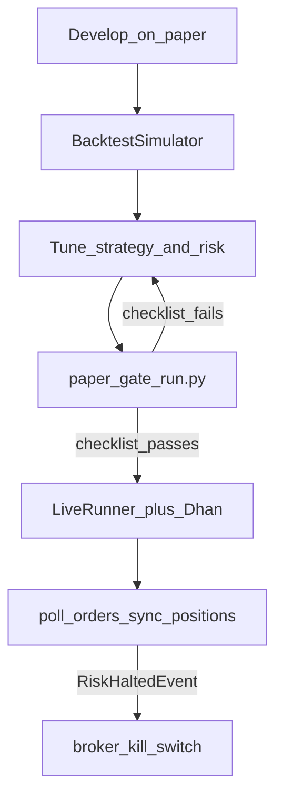

# Trading Flows

This page walks the real end-to-end paths: from a quote to a fill, from paper
to live, and what happens to an order after you place it. Read this after
[Core Journey](02-core-journey.md) and [Broker Capabilities](07-broker-capabilities.md).

---

## 1. Happy path — one instrument, paper

```
TradingSession.paper()
        │
        ▼
  session.stock("TCS") / .index("NIFTY")
        │
        ▼
  instrument.market.refresh()          ← quote
  instrument.market.history()("5m")    ← bars
  instrument.analytics.compute()       ← indicators
        │
        ▼
  instrument.order.buy(...)            ← OrderFacade → PaperBroker.place_order
        │
        ▼
  order.status / filled_qty / avg_price
  session.positions() / session.balance()
```

```python
from ntrade import TradingSession

session = TradingSession.paper(initial_cash=100_000.0)
tcs = session.stock("TCS")
tcs.market.refresh()
series = tcs.market.history()("5m", days=5)
tcs.analytics.compute()

order = tcs.order.buy(10, price=tcs.market.ltp() or 0, order_type="LIMIT")
print(order.order_id, order.status, order.filled_qty, order.avg_price)
print("positions:", session.positions())
print("balance:", session.balance())
```

Same code on live: swap `TradingSession.connect("dhan")`. Orders then hit the
real OMS — test on paper first.

---

## 2. Strategy flow (event-centric)

Strategies do **not** call `.order.buy()` themselves. They emit signals; the
kernel screens and executes.

```
Feed (bars / ticks / live WS)
        │
        ▼
  MarketEngine → CandleEngine → IndicatorEngine
        │
        ▼
  Strategy.on_candle_closed / on_indicator_updated
        │  emit_signal(...)
        ▼
  RiskEngine  ──reject──► SignalRejectedEvent (done)
        │ approve
        ▼
  OrderEngine → OrderIntentEvent → ExecutionRouter
        │
        ├── paper/backtest → SimulatedExecution → OrderFilledEvent
        └── live           → BrokerExecution   → OrderAcceptedEvent
                                                → poll → OrderFilledEvent /
                                                          OrderUpdatedEvent /
                                                          OrderRejectedEvent
        │
        ▼
  PortfolioEngine → PositionUpdatedEvent + BalanceChangedEvent
```

```python
from ntrade import TradingSession
from ntrade.engines.strategies import EmaCrossStrategy

session = TradingSession.paper(initial_cash=100_000.0)
session.register(session.index("NIFTY"))
session.register_strategy(
    EmaCrossStrategy(fast=9, slow=21, quantity=5, symbol="NIFTY"),
    risk={"max_quantity": 25, "max_daily_loss": 5_000.0, "max_drawdown_pct": 5.0},
)
session.start()
# feed events (SimulatedFeedSource / SyntheticMarketFeedSource / live feed)
session.stop()
```

Details: [Strategies](03-strategies.md) · [Risk](05-risk.md) · [Simulation](06-simulation.md).

---

## 3. Order lifecycle

### Manual / facade orders

```
place → PENDING / OPEN
      → (partial fills) PARTIALLY_FILLED
      → COMPLETED  or  CANCELLED  or  REJECTED
```

```python
order = tcs.order.limit("BUY", 10, price=2500)
order.modify(price=2495)
order.cancel()
# refresh status from broker when live
# order is updated in place by cancel/modify return values
```

### Live kernel orders (`BrokerExecution`)

When a strategy (or intent) goes through the live kernel:

1. `submit()` publishes `OrderAcceptedEvent` immediately and tracks the open order.
2. `kernel.poll_orders()` refreshes broker status.
3. New fill deltas publish `OrderFilledEvent` (partial-safe: a 3-then-2 fill
   never reports 5 twice).
4. Status changes also publish `OrderUpdatedEvent`
   (`PENDING → PARTIALLY_FILLED → COMPLETED / CANCELLED / REJECTED`).
5. A partial that later cancels keeps filled shares; only the remainder rejects.

```python
# Inside a LiveRunner loop (or manually):
kernel.poll_orders()
kernel.sync_positions()     # reconcile broker positions/balance into the kernel
kernel.open_orders()
kernel.modify_order(order_id, price=...)
kernel.cancel_order(order_id)
```

`LiveRunner` calls `poll_orders` / `sync_positions` on every `step()`.

---

## 4. Options flow

```
underlying.market.refresh()
        │
        ▼
underlying.derivatives.option_chain(expiry=0, num_strikes=10)
        │
        ▼
chain.atm / .itm / .otm / .pcr() / .max_pain()
        │
        ▼
atm.order.buy(...)  or  atm.broker.place_super_order(...)
```

Full walkthrough: [Options Trading](08-options-trading.md).

---

## 5. Scanner → discretionary trade

```
session.register(many instruments)
refresh quotes
        │
        ▼
session.scanner().breakout(...) / .momentum(...) / .gap(...) / .volume(...) / .imbalance(...)
        │
        ▼
for r in results:   # ScannerResult
    r.instrument.market.ltp()
    r.instrument.order.buy(...)     # optional — scanners never auto-trade
```

Scanners only rank. You (or a strategy) decide whether to trade.
See [Scanners](04-scanners.md).

---

## 6. Paper → backtest → paper-gate → live



### Step A — develop on paper

```python
session = TradingSession.paper(initial_cash=100_000.0)
# explore quotes, chains, manual orders, scanners
```

### Step B — backtest

```python
from ntrade import BacktestSimulator
from ntrade.engines.strategies import EmaCrossStrategy

frame = session.stock("TCS").market.history()("5m", days=15, force=True).df
sim = BacktestSimulator(timeframe="5m", initial_cash=100_000.0, symbol="TCS")
sim.register_strategy(EmaCrossStrategy(fast=9, slow=21, quantity=5, symbol="TCS"))
result = sim.run(frame)
print(result.final_equity, result.max_drawdown_pct, result.n_trades)
```

### Step C — paper gate (must pass before live)

```bash
.venv/bin/python scripts/paper_gate_run.py --symbol NIFTY --days 15
```

Prints a `build_paper_report` checklist (fills, equity, max drawdown). Fails
closed when unhealthy.

### Step D — live

```bash
.venv/bin/python scripts/live_runner_run.py
# or
.venv/bin/python scripts/ema_cross_run.py NIFTY 15
```

`LiveRunner(kernel, feed)`:

- starts kernel + feed
- every `poll_interval`: `poll_orders()` + `sync_positions()`
- on `RiskHaltedEvent` → `instrument.broker.kill_switch(action="ACTIVATE")`
- publishes `RunnerStartedEvent` / `RunnerStoppedEvent`

---

## 7. Replay & crash-recovery flow

```
Live session with EventStore(path)
        │  every event appended to JSONL
        ▼
Crash / stop
        │
        ▼
store.market_events()  ──or──  ResilientKernel.recover()
        │
        ▼
Fresh kernel recomputes signals/fills from the causal market stream
(positions + balance match the crashed session)
```

```python
from ntrade import TradingKernel, EventStore, ReplayEngine

store = EventStore("session-events.jsonl")
kernel = TradingKernel(mode="live", store=store, timeframe="1m")
# ... run ...

# Deterministic replay of market events only
ReplayEngine(timeframe="1m").run(store.market_events())
```

Never re-feed derived events (signals/fills) — the kernel recomputes them.

---

## 8. Risk halt flow (live)

```
Signal / fill moves equity
        │
        ▼
RiskEngine checks max_daily_loss / max_drawdown_pct / price_deviation_pct
        │ trip
        ▼
halt() → RiskHaltedEvent → every later signal rejected
        │
        ▼  (LiveRunner)
instrument.broker.kill_switch(action="ACTIVATE")
        │
        ▼
operator investigates → risk.resume() → RiskResumedEvent
```

See [Risk](05-risk.md).

---

## 9. Choosing a flow quickly

| Goal | Flow |
|------|------|
| Click around quotes / place a test order | §1 Paper happy path |
| Automate entries from indicators | §2 Strategy flow |
| Trade NIFTY options with greeks | §4 Options + [08](08-options-trading.md) |
| Build a morning watchlist | §5 Scanner |
| Prove a strategy before real money | §6 Paper → gate → live |
| Debug a past live session | §7 Replay / EventStore |
| Hard stop on daily loss | §8 Risk halt + kill switch |
| Use Dhan depth / GTT / super orders | [07 Broker Capabilities](07-broker-capabilities.md) |

---

Back: [Options Trading](08-options-trading.md) · [Index](index.md)
